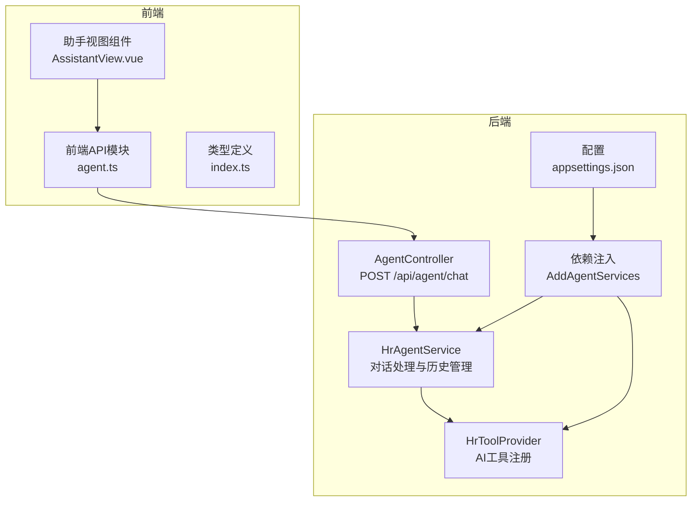
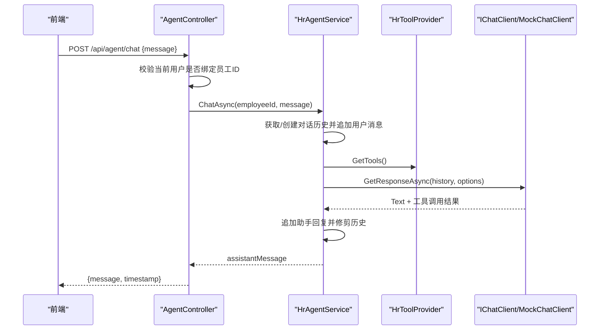
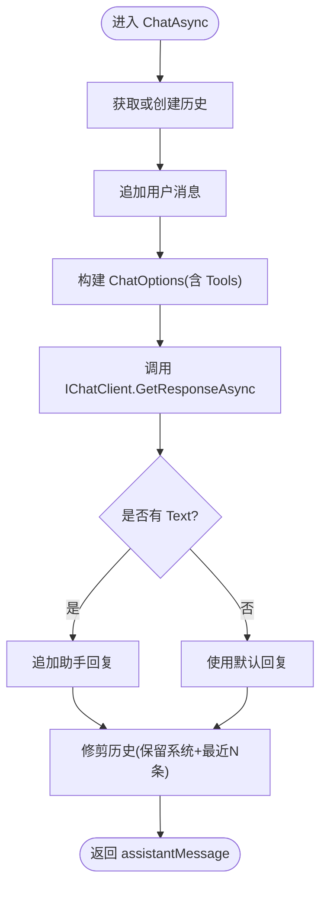
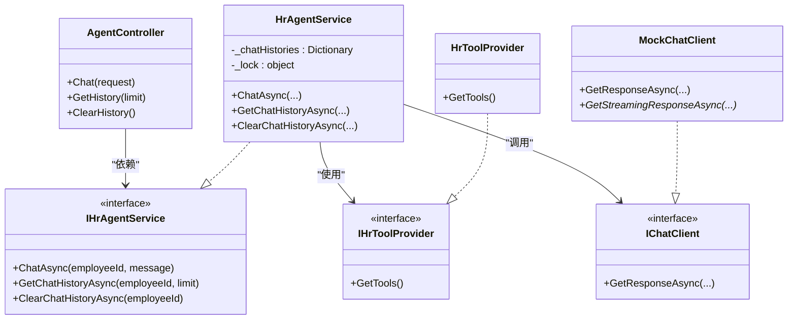

# AI助手接口

<cite>
**本文引用的文件**
- [AgentController.cs](file://Backend/Hrevolve.Web/Controllers/AgentController.cs)
- [HrAgentService.cs](file://Backend/Hrevolve.Agent/Services/HrAgentService.cs)
- [HrToolProvider.cs](file://Backend/Hrevolve.Agent/Services/HrToolProvider.cs)
- [DependencyInjection.cs](file://Backend/Hrevolve.Agent/DependencyInjection.cs)
- [Program.cs](file://Backend/Hrevolve.Web/Program.cs)
- [appsettings.json](file://Backend/Hrevolve.Web/appsettings.json)
- [Agent.md](file://Design/Agent.md)
- [agent.ts](file://Frontend/hrevolve-web/src/api/modules/agent.ts)
- [AssistantView.vue](file://Frontend/hrevolve-web/src/views/assistant/AssistantView.vue)
- [index.ts](file://Frontend/hrevolve-web/src/types/index.ts)
</cite>

## 目录
1. [简介](#简介)
2. [项目结构](#项目结构)
3. [核心组件](#核心组件)
4. [架构总览](#架构总览)
5. [详细组件分析](#详细组件分析)
6. [依赖关系分析](#依赖关系分析)
7. [性能考量](#性能考量)
8. [故障排查指南](#故障排查指南)
9. [结论](#结论)
10. [附录](#附录)

## 简介
本文件面向后端与前端开发者，系统性阐述“AI助手交互API”的设计与实现，重点覆盖：
- POST /api/agent/chat 端点的请求与响应规范
- 流式响应（Streaming Response）的现状与扩展路径
- HrAgentService 如何集成 Microsoft Agent Framework 与 Microsoft.Extensions.AI
- HrToolProvider 中注册的工具（如查询假期余额、提交请假、查询组织信息等）如何被调用
- 对话历史的存储机制与上下文管理策略
- 结合 Design/Agent.md 文档，说明 AI 助手的设计原则与扩展能力

## 项目结构
后端采用模块化单体架构，AI 助手位于独立的 Hrevolve.Agent 模块；Web 层通过控制器暴露 API；前端通过 Axios 请求封装调用。

图表来源
- [AgentController.cs](file://Backend/Hrevolve.Web/Controllers/AgentController.cs#L1-L87)
- [HrAgentService.cs](file://Backend/Hrevolve.Agent/Services/HrAgentService.cs#L1-L151)
- [HrToolProvider.cs](file://Backend/Hrevolve.Agent/Services/HrToolProvider.cs#L1-L250)
- [DependencyInjection.cs](file://Backend/Hrevolve.Agent/DependencyInjection.cs#L1-L123)
- [appsettings.json](file://Backend/Hrevolve.Web/appsettings.json#L1-L39)
- [agent.ts](file://Frontend/hrevolve-web/src/api/modules/agent.ts#L1-L21)
- [AssistantView.vue](file://Frontend/hrevolve-web/src/views/assistant/AssistantView.vue#L40-L89)
- [index.ts](file://Frontend/hrevolve-web/src/types/index.ts#L670-L690)

章节来源
- [AgentController.cs](file://Backend/Hrevolve.Web/Controllers/AgentController.cs#L1-L87)
- [Program.cs](file://Backend/Hrevolve.Web/Program.cs#L100-L110)
- [DependencyInjection.cs](file://Backend/Hrevolve.Agent/DependencyInjection.cs#L1-L75)
- [appsettings.json](file://Backend/Hrevolve.Web/appsettings.json#L1-L39)

## 核心组件
- AgentController：对外暴露 /api/agent/chat、/api/agent/history 等端点，负责鉴权、参数校验与响应包装。
- HrAgentService：基于 Microsoft.Extensions.AI 的 IChatClient 与 IHrToolProvider，负责对话历史管理、工具调用与最终回复生成。
- HrToolProvider：注册 AI 可调用工具（查询假期余额、提交请假、查询薪资、考勤、组织信息、今日考勤等）。
- 依赖注入：根据 appsettings.json 中 AI.Provider 配置选择 OpenAI、Azure 或 Mock 客户端。
- 前端集成：agent.ts 封装 /agent/chat、/agent/history、/agent/history 删除；AssistantView.vue 负责消息渲染与交互。

章节来源
- [AgentController.cs](file://Backend/Hrevolve.Web/Controllers/AgentController.cs#L1-L87)
- [HrAgentService.cs](file://Backend/Hrevolve.Agent/Services/HrAgentService.cs#L1-L151)
- [HrToolProvider.cs](file://Backend/Hrevolve.Agent/Services/HrToolProvider.cs#L1-L250)
- [DependencyInjection.cs](file://Backend/Hrevolve.Agent/DependencyInjection.cs#L1-L123)
- [agent.ts](file://Frontend/hrevolve-web/src/api/modules/agent.ts#L1-L21)
- [AssistantView.vue](file://Frontend/hrevolve-web/src/views/assistant/AssistantView.vue#L40-L89)
- [index.ts](file://Frontend/hrevolve-web/src/types/index.ts#L670-L690)

## 架构总览
AI 助手整体采用“控制器 -> 服务 -> 工具提供者 -> AI客户端”的分层结构。服务层维护每员工的对话历史，工具层提供具体业务能力，AI 客户端负责推理与工具调用。

图表来源
- [AgentController.cs](file://Backend/Hrevolve.Web/Controllers/AgentController.cs#L18-L41)
- [HrAgentService.cs](file://Backend/Hrevolve.Agent/Services/HrAgentService.cs#L37-L67)
- [HrToolProvider.cs](file://Backend/Hrevolve.Agent/Services/HrToolProvider.cs#L20-L32)
- [DependencyInjection.cs](file://Backend/Hrevolve.Agent/DependencyInjection.cs#L39-L74)

## 详细组件分析

### 控制器：AgentController
- 认证要求：[Authorize]，依赖 ICurrentUserAccessor 获取当前员工ID。
- POST /api/agent/chat
  - 请求体：ChatRequest { message }
  - 响应体：ChatResponse { message, timestamp }
- GET /api/agent/history：按 limit 返回历史消息（排除系统消息）。
- DELETE /api/agent/history：清空指定员工的历史。

章节来源
- [AgentController.cs](file://Backend/Hrevolve.Web/Controllers/AgentController.cs#L18-L77)
- [AgentController.cs](file://Backend/Hrevolve.Web/Controllers/AgentController.cs#L80-L87)

### 服务：HrAgentService
- 对话历史管理
  - 每员工独立内存字典存储，带锁保护。
  - 初始系统提示由 GetSystemPrompt() 提供。
  - 历史上限修剪，保留系统消息与最近 N 条。
- 工具调用
  - 通过 ChatOptions.Tools 注入 HrToolProvider.GetTools()。
  - 调用 IChatClient.GetResponseAsync，AI 决定是否调用工具。
- 错误处理
  - 捕获异常并返回友好提示。

图表来源
- [HrAgentService.cs](file://Backend/Hrevolve.Agent/Services/HrAgentService.cs#L37-L67)
- [HrAgentService.cs](file://Backend/Hrevolve.Agent/Services/HrAgentService.cs#L75-L101)

章节来源
- [HrAgentService.cs](file://Backend/Hrevolve.Agent/Services/HrAgentService.cs#L1-L151)

### 工具提供者：HrToolProvider
- 工具清单（均通过 AIFunctionFactory.Create 注册）
  - get_leave_balance：查询假期余额（支持按假期类型过滤）
  - submit_leave_request：提交请假申请（校验日期格式、计算天数）
  - get_salary_info：查询薪资明细（支持按年/月过滤）
  - get_attendance_records：查询考勤记录（起止日期）
  - query_hr_policy：查询 HR 政策（关键词匹配示例）
  - get_organization_info：查询组织架构（支持按部门过滤）
  - get_today_attendance：查询今日考勤状态
- 工具签名均包含 employeeId 参数，便于权限与数据隔离。

章节来源
- [HrToolProvider.cs](file://Backend/Hrevolve.Agent/Services/HrToolProvider.cs#L20-L32)
- [HrToolProvider.cs](file://Backend/Hrevolve.Agent/Services/HrToolProvider.cs#L34-L249)

### 依赖注入与AI客户端
- 根据 appsettings.json 中 AI.Provider 选择：
  - OpenAI：读取 ApiKey 与 Model，构造 OpenAIClient 并适配为 IChatClient。
  - Azure：读取 Endpoint、ApiKey、DeploymentName（当前示例使用 Mock）。
  - 默认：MockChatClient（开发测试用）。
- MockChatClient 不支持流式响应，但提供同步响应与简单关键词路由。

章节来源
- [DependencyInjection.cs](file://Backend/Hrevolve.Agent/DependencyInjection.cs#L1-L75)
- [DependencyInjection.cs](file://Backend/Hrevolve.Agent/DependencyInjection.cs#L76-L123)
- [appsettings.json](file://Backend/Hrevolve.Web/appsettings.json#L11-L17)

### 设计原则与扩展能力（参考 Design/Agent.md）
- 微软代理框架（Microsoft Agent Framework）与统一抽象层（Microsoft.Extensions.AI）。
- “Agent Skill” 模块化设计，每个核心能力作为独立模块，暴露清晰的内外部接口。
- 支持多提供商（OpenAI、Azure、Mock），便于在不同环境切换。
- RAG 向量数据库抽象层预留，便于未来引入知识检索增强。

章节来源
- [Agent.md](file://Design/Agent.md#L186-L235)

## 依赖关系分析

图表来源
- [AgentController.cs](file://Backend/Hrevolve.Web/Controllers/AgentController.cs#L1-L87)
- [HrAgentService.cs](file://Backend/Hrevolve.Agent/Services/HrAgentService.cs#L1-L151)
- [HrToolProvider.cs](file://Backend/Hrevolve.Agent/Services/HrToolProvider.cs#L1-L250)
- [DependencyInjection.cs](file://Backend/Hrevolve.Agent/DependencyInjection.cs#L1-L123)

章节来源
- [Program.cs](file://Backend/Hrevolve.Web/Program.cs#L100-L110)
- [DependencyInjection.cs](file://Backend/Hrevolve.Agent/DependencyInjection.cs#L1-L75)

## 性能考量
- 历史修剪：服务端对每员工历史进行上限控制，避免无限增长导致内存压力。
- 并发安全：使用静态字典 + 锁保护，确保多线程下历史一致性。
- AI 客户端：Mock 客户端仅用于开发测试；生产环境建议使用 OpenAI/Azure 客户端以获得更好的推理质量与稳定性。
- 前端渲染：前端在发送消息后立即插入“加载中”占位，提升交互体验。

章节来源
- [HrAgentService.cs](file://Backend/Hrevolve.Agent/Services/HrAgentService.cs#L103-L145)
- [DependencyInjection.cs](file://Backend/Hrevolve.Agent/DependencyInjection.cs#L39-L74)
- [AssistantView.vue](file://Frontend/hrevolve-web/src/views/assistant/AssistantView.vue#L40-L89)

## 故障排查指南
- 无员工ID
  - 现象：控制器返回错误码与提示。
  - 处理：确保登录用户已绑定员工信息。
- AI 客户端未配置
  - 现象：Mock 客户端返回通用提示。
  - 处理：在 appsettings.json 中配置 AI.Provider 与对应凭据。
- 工具调用失败
  - 现象：服务端捕获异常并返回友好提示。
  - 处理：检查工具方法签名与参数校验逻辑。
- 前端未显示流式响应
  - 现象：Mock 客户端不支持流式。
  - 处理：切换到 OpenAI/Azure 客户端并在前端实现流式渲染。

章节来源
- [AgentController.cs](file://Backend/Hrevolve.Web/Controllers/AgentController.cs#L23-L28)
- [DependencyInjection.cs](file://Backend/Hrevolve.Agent/DependencyInjection.cs#L39-L74)
- [HrAgentService.cs](file://Backend/Hrevolve.Agent/Services/HrAgentService.cs#L68-L73)

## 结论
本系统通过清晰的分层与模块化设计，实现了可扩展的 AI 助手能力。HrAgentService 以 Microsoft.Extensions.AI 为抽象，结合 HrToolProvider 的工具注册，能够灵活地将自然语言请求转化为具体业务操作。当前实现支持同步响应与本地历史管理，具备良好的扩展性，可在生产环境接入流式响应与持久化存储。

## 附录

### POST /api/agent/chat 请求与响应
- 请求
  - 方法：POST
  - 路径：/api/agent/chat
  - 认证：Bearer JWT
  - 请求体：ChatRequest { message }
- 响应
  - 成功：ChatResponse { message, timestamp }
  - 失败：错误码与消息（如未绑定员工）

章节来源
- [AgentController.cs](file://Backend/Hrevolve.Web/Controllers/AgentController.cs#L18-L41)
- [AgentController.cs](file://Backend/Hrevolve.Web/Controllers/AgentController.cs#L80-L87)

### 对话历史与上下文管理
- 存储：每员工独立内存列表，首条为系统提示。
- 读取：跳过系统消息，取最近 limit 条。
- 清理：删除该员工历史。
- 修剪：保留系统消息与最近 N 条，移除最早非系统消息。

章节来源
- [HrAgentService.cs](file://Backend/Hrevolve.Agent/Services/HrAgentService.cs#L75-L101)
- [HrAgentService.cs](file://Backend/Hrevolve.Agent/Services/HrAgentService.cs#L103-L145)

### 实际对话示例：员工询问“我还有多少年假”
- 步骤
  - 用户输入“我还有多少年假”。
  - 控制器校验员工ID并调用 HrAgentService.ChatAsync。
  - 服务将用户消息加入历史，构建 ChatOptions 并调用 IChatClient。
  - AI 识别意图并调用 get_leave_balance 工具。
  - 工具返回余额信息，服务追加助手回复并修剪历史。
  - 控制器返回 { message, timestamp }。
- 前端
  - agent.ts 调用 /agent/chat。
  - AssistantView.vue 渲染消息与时间戳。

章节来源
- [HrToolProvider.cs](file://Backend/Hrevolve.Agent/Services/HrToolProvider.cs#L34-L57)
- [HrAgentService.cs](file://Backend/Hrevolve.Agent/Services/HrAgentService.cs#L37-L67)
- [agent.ts](file://Frontend/hrevolve-web/src/api/modules/agent.ts#L1-L21)
- [AssistantView.vue](file://Frontend/hrevolve-web/src/views/assistant/AssistantView.vue#L40-L89)

### 流式响应（Streaming Response）
- 现状
  - MockChatClient 不支持 GetStreamingResponseAsync。
  - 依赖注入中若 Provider 为 OpenAI/Azure，应使用对应客户端的流式接口。
- 建议
  - 在前端实现 SSE 或流式渲染逻辑，以提升用户体验。
  - 在后端控制器增加 /streaming/chat 端点（如需）。

章节来源
- [DependencyInjection.cs](file://Backend/Hrevolve.Agent/DependencyInjection.cs#L113-L122)
- [DependencyInjection.cs](file://Backend/Hrevolve.Agent/DependencyInjection.cs#L39-L74)