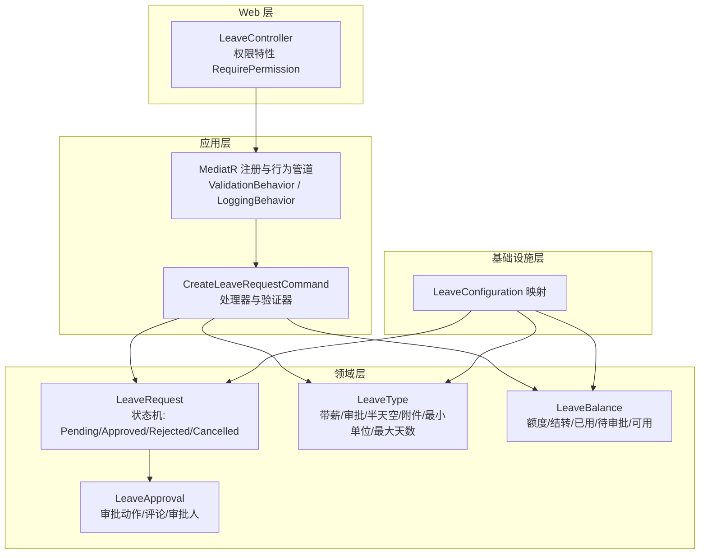
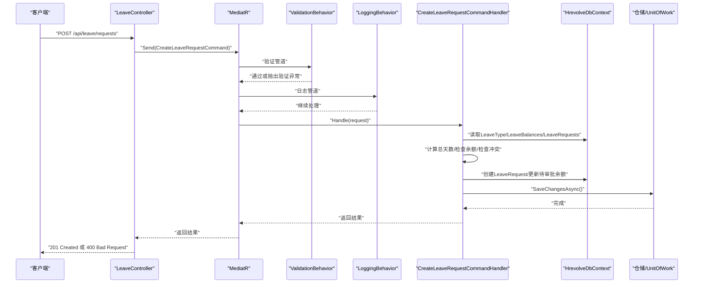
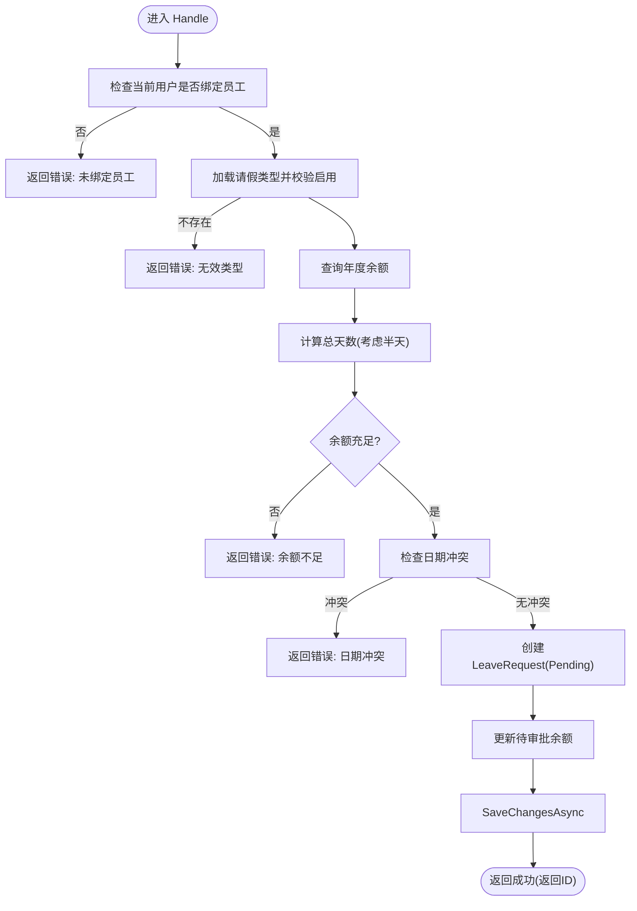
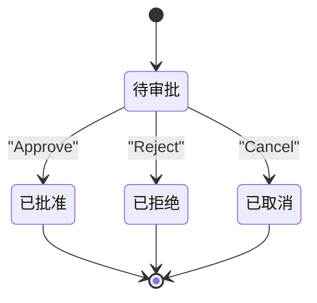
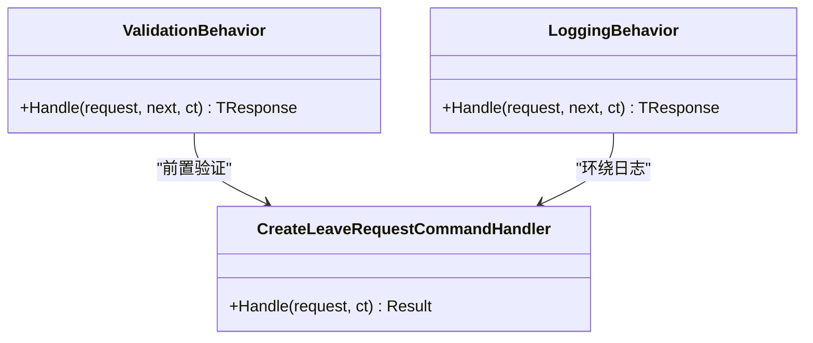
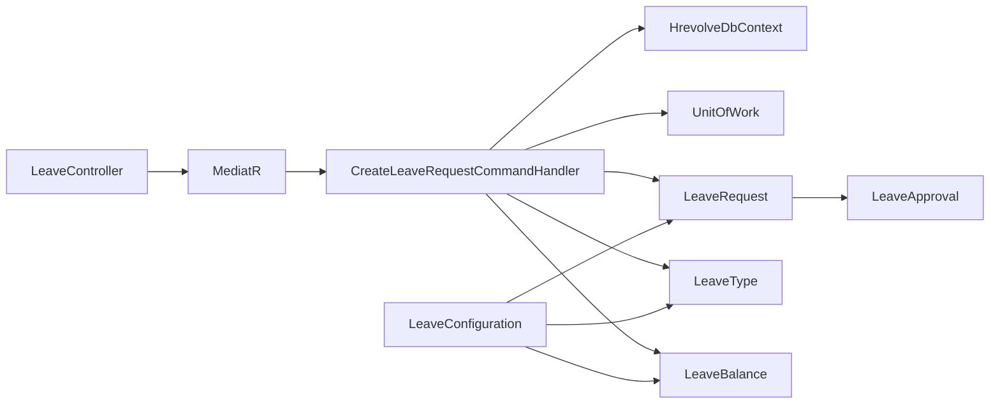

# 假期管理接口

<cite>
**本文引用的文件**
- [Backend/Hrevolve.Web/Controllers/LeaveController.cs](file://Backend/Hrevolve.Web/Controllers/LeaveController.cs)
- [Backend/Hrevolve.Application/Leave/Commands/CreateLeaveRequestCommand.cs](file://Backend/Hrevolve.Application/Leave/Commands/CreateLeaveRequestCommand.cs)
- [Backend/Hrevolve.Domain/Leave/LeaveRequest.cs](file://Backend/Hrevolve.Domain/Leave/LeaveRequest.cs)
- [Backend/Hrevolve.Domain/Leave/LeaveType.cs](file://Backend/Hrevolve.Domain/Leave/LeaveType.cs)
- [Backend/Hrevolve.Application/Behaviors/ValidationBehavior.cs](file://Backend/Hrevolve.Application/Behaviors/ValidationBehavior.cs)
- [Backend/Hrevolve.Application/Behaviors/LoggingBehavior.cs](file://Backend/Hrevolve.Application/Behaviors/LoggingBehavior.cs)
- [Backend/Hrevolve.Application/DependencyInjection.cs](file://Backend/Hrevolve.Application/DependencyInjection.cs)
- [Backend/Hrevolve.Web/Filters/RequirePermissionAttribute.cs](file://Backend/Hrevolve.Web/Filters/RequirePermissionAttribute.cs)
- [Backend/Hrevolve.Shared/Identity/ICurrentUser.cs](file://Backend/Hrevolve.Shared/Identity/ICurrentUser.cs)
- [Backend/Hrevolve.Infrastructure/Persistence/Configurations/LeaveConfiguration.cs](file://Backend/Hrevolve.Infrastructure/Persistence/Configurations/LeaveConfiguration.cs)
- [Backend/Hrevolve.Domain/Identity/Role.cs](file://Backend/Hrevolve.Domain/Identity/Role.cs)
</cite>

## 目录
1. [简介](#简介)
2. [项目结构](#项目结构)
3. [核心组件](#核心组件)
4. [架构总览](#架构总览)
5. [详细组件分析](#详细组件分析)
6. [依赖关系分析](#依赖关系分析)
7. [性能考虑](#性能考虑)
8. [故障排查指南](#故障排查指南)
9. [结论](#结论)
10. [附录](#附录)

## 简介
本文件为假期管理API的全面技术文档，覆盖请假申请、审批流程、假期余额查询等能力。重点说明：
- POST /api/leave/requests 的请求体JSON结构（类型、起止时间、起止时段、原因、附件等）
- GET /api/leave/balances/my 的响应格式与余额计算逻辑
- LeaveType 类别定义及规则（是否带薪、是否需要审批、最小单位、单次最大天数、是否允许半天、是否需要附件等）
- 审批流引擎的状态机：Pending、Approved、Rejected、Cancelled
- 审批操作 PUT /api/leave/requests/{id}/approve 的权限控制
- 基于 MediatR 行为管道的验证与日志自动执行机制

## 项目结构
假期管理相关代码分布在以下层次：
- Web 层：控制器暴露REST接口，包含权限校验特性
- Application 层：MediatR命令与验证器、应用服务行为管道（验证、日志）
- Domain 层：领域模型（LeaveRequest、LeaveType、LeaveBalance、LeaveApproval）与状态机
- Infrastructure 层：EF Core映射配置、仓储与数据库上下文
- Shared 层：通用接口与异常类型

图表来源
- [Backend/Hrevolve.Web/Controllers/LeaveController.cs](file://Backend/Hrevolve.Web/Controllers/LeaveController.cs#L1-L122)
- [Backend/Hrevolve.Application/DependencyInjection.cs](file://Backend/Hrevolve.Application/DependencyInjection.cs#L1-L26)
- [Backend/Hrevolve.Application/Leave/Commands/CreateLeaveRequestCommand.cs](file://Backend/Hrevolve.Application/Leave/Commands/CreateLeaveRequestCommand.cs#L1-L137)
- [Backend/Hrevolve.Domain/Leave/LeaveRequest.cs](file://Backend/Hrevolve.Domain/Leave/LeaveRequest.cs#L1-L234)
- [Backend/Hrevolve.Domain/Leave/LeaveType.cs](file://Backend/Hrevolve.Domain/Leave/LeaveType.cs#L1-L146)
- [Backend/Hrevolve.Infrastructure/Persistence/Configurations/LeaveConfiguration.cs](file://Backend/Hrevolve.Infrastructure/Persistence/Configurations/LeaveConfiguration.cs#L1-L167)

章节来源
- [Backend/Hrevolve.Web/Controllers/LeaveController.cs](file://Backend/Hrevolve.Web/Controllers/LeaveController.cs#L1-L122)
- [Backend/Hrevolve.Application/DependencyInjection.cs](file://Backend/Hrevolve.Application/DependencyInjection.cs#L1-L26)
- [Backend/Hrevolve.Application/Leave/Commands/CreateLeaveRequestCommand.cs](file://Backend/Hrevolve.Application/Leave/Commands/CreateLeaveRequestCommand.cs#L1-L137)
- [Backend/Hrevolve.Domain/Leave/LeaveRequest.cs](file://Backend/Hrevolve.Domain/Leave/LeaveRequest.cs#L1-L234)
- [Backend/Hrevolve.Domain/Leave/LeaveType.cs](file://Backend/Hrevolve.Domain/Leave/LeaveType.cs#L1-L146)
- [Backend/Hrevolve.Infrastructure/Persistence/Configurations/LeaveConfiguration.cs](file://Backend/Hrevolve.Infrastructure/Persistence/Configurations/LeaveConfiguration.cs#L1-L167)

## 核心组件
- 控制器 LeaveController：提供请假申请、审批、取消、余额查询、类型查询等接口；使用权限特性进行访问控制
- 命令与验证 CreateLeaveRequestCommand：封装请假申请请求参数，内置FluentValidation验证器
- 领域模型 LeaveRequest：请假实体，包含起止日期、起止时段、总天数、状态、审批记录等；提供 Approve/Reject/Cancel 状态转换
- 假期类型 LeaveType：定义假期类别属性（是否带薪、是否需要审批、最小单位、最大天数、是否允许半天、是否需要附件等）
- 余额模型 LeaveBalance：年度额度、结转、已用、待审批、可用余额计算
- 审批记录 LeaveApproval：记录审批动作、审批人、评论、审批时间
- 行为管道 ValidationBehavior / LoggingBehavior：自动执行验证与日志记录
- 权限 RequirePermissionAttribute：基于当前用户权限进行授权校验

章节来源
- [Backend/Hrevolve.Web/Controllers/LeaveController.cs](file://Backend/Hrevolve.Web/Controllers/LeaveController.cs#L1-L122)
- [Backend/Hrevolve.Application/Leave/Commands/CreateLeaveRequestCommand.cs](file://Backend/Hrevolve.Application/Leave/Commands/CreateLeaveRequestCommand.cs#L1-L137)
- [Backend/Hrevolve.Domain/Leave/LeaveRequest.cs](file://Backend/Hrevolve.Domain/Leave/LeaveRequest.cs#L1-L234)
- [Backend/Hrevolve.Domain/Leave/LeaveType.cs](file://Backend/Hrevolve.Domain/Leave/LeaveType.cs#L1-L146)
- [Backend/Hrevolve.Application/Behaviors/ValidationBehavior.cs](file://Backend/Hrevolve.Application/Behaviors/ValidationBehavior.cs#L1-L43)
- [Backend/Hrevolve.Application/Behaviors/LoggingBehavior.cs](file://Backend/Hrevolve.Application/Behaviors/LoggingBehavior.cs#L1-L51)
- [Backend/Hrevolve.Web/Filters/RequirePermissionAttribute.cs](file://Backend/Hrevolve.Web/Filters/RequirePermissionAttribute.cs#L1-L80)
- [Backend/Hrevolve.Shared/Identity/ICurrentUser.cs](file://Backend/Hrevolve.Shared/Identity/ICurrentUser.cs#L1-L115)

## 架构总览
下图展示从HTTP请求到领域模型处理的端到端流程，以及MediatR行为管道在其中的作用。

图表来源
- [Backend/Hrevolve.Web/Controllers/LeaveController.cs](file://Backend/Hrevolve.Web/Controllers/LeaveController.cs#L1-L122)
- [Backend/Hrevolve.Application/DependencyInjection.cs](file://Backend/Hrevolve.Application/DependencyInjection.cs#L1-L26)
- [Backend/Hrevolve.Application/Leave/Commands/CreateLeaveRequestCommand.cs](file://Backend/Hrevolve.Application/Leave/Commands/CreateLeaveRequestCommand.cs#L1-L137)
- [Backend/Hrevolve.Application/Behaviors/ValidationBehavior.cs](file://Backend/Hrevolve.Application/Behaviors/ValidationBehavior.cs#L1-L43)
- [Backend/Hrevolve.Application/Behaviors/LoggingBehavior.cs](file://Backend/Hrevolve.Application/Behaviors/LoggingBehavior.cs#L1-L51)

## 详细组件分析

### 1) 请假申请：POST /api/leave/requests
- 请求路径：POST /api/leave/requests
- 权限要求：需要权限 leave:write
- 请求体字段（CreateLeaveRequestCommand）：
  - leaveTypeId：请假类型ID（必填）
  - startDate：开始日期（必填）
  - endDate：结束日期（必填，需≥开始日期）
  - startDayPart：开始时段（FullDay/Morning/Afternoon，默认FullDay）
  - endDayPart：结束时段（FullDay/Morning/Afternoon，默认FullDay）
  - reason：请假原因（必填，长度≤1000）
  - attachments：附件URL列表（可选）
- 处理逻辑要点：
  - 校验当前用户是否绑定员工信息
  - 校验请假类型存在且启用
  - 查询员工该类型的年度余额，计算请假总天数（考虑半天扣减）
  - 若余额不足，返回错误
  - 检查日期冲突（排除已取消/已拒绝的申请）
  - 创建LeaveRequest并设置状态为Pending
  - 若存在余额记录，则增加Pending天数
  - 保存事务并返回新申请ID

图表来源
- [Backend/Hrevolve.Application/Leave/Commands/CreateLeaveRequestCommand.cs](file://Backend/Hrevolve.Application/Leave/Commands/CreateLeaveRequestCommand.cs#L1-L137)
- [Backend/Hrevolve.Domain/Leave/LeaveRequest.cs](file://Backend/Hrevolve.Domain/Leave/LeaveRequest.cs#L1-L234)

章节来源
- [Backend/Hrevolve.Web/Controllers/LeaveController.cs](file://Backend/Hrevolve.Web/Controllers/LeaveController.cs#L1-L122)
- [Backend/Hrevolve.Application/Leave/Commands/CreateLeaveRequestCommand.cs](file://Backend/Hrevolve.Application/Leave/Commands/CreateLeaveRequestCommand.cs#L1-L137)
- [Backend/Hrevolve.Domain/Leave/LeaveRequest.cs](file://Backend/Hrevolve.Domain/Leave/LeaveRequest.cs#L1-L234)

### 2) 审批流程：状态机与审批操作
- 状态机（LeaveRequestStatus）：
  - Pending：待审批
  - Approved：已批准
  - Rejected：已拒绝
  - Cancelled：已取消
- 审批动作：
  - Approve：记录审批人、动作、评论，状态置为Approved
  - Reject：记录审批人、动作、拒绝原因，状态置为Rejected
  - Cancel：记录取消原因，状态置为Cancelled
- 审批接口：
  - POST /api/leave/requests/{id}/approve：需要权限 leave:approve
  - POST /api/leave/requests/{id}/reject：需要权限 leave:approve
  - POST /api/leave/requests/{id}/cancel：无需审批权限（仅申请人或特定角色）

图表来源
- [Backend/Hrevolve.Domain/Leave/LeaveRequest.cs](file://Backend/Hrevolve.Domain/Leave/LeaveRequest.cs#L1-L234)

章节来源
- [Backend/Hrevolve.Domain/Leave/LeaveRequest.cs](file://Backend/Hrevolve.Domain/Leave/LeaveRequest.cs#L1-L234)
- [Backend/Hrevolve.Web/Controllers/LeaveController.cs](file://Backend/Hrevolve.Web/Controllers/LeaveController.cs#L1-L122)

### 3) 假期余额查询：GET /api/leave/balances/my
- 接口：GET /api/leave/balances/my
- 参数：
  - year：可选，查询年份，默认当前年
- 返回值（概念性说明）：
  - 列表项包含：leaveTypeId、leaveTypeName、entitlement（年度额度）、carriedOver（结转）、used（已用）、pending（待审批）、available（可用）
- 计算规则（LeaveBalance.Available）：
  - available = entitlement + carriedOver - used - pending
- 数据库映射：
  - LeaveBalances 表包含唯一索引：(TenantId, EmployeeId, LeaveTypeId, Year)

章节来源
- [Backend/Hrevolve.Domain/Leave/LeaveRequest.cs](file://Backend/Hrevolve.Domain/Leave/LeaveRequest.cs#L160-L234)
- [Backend/Hrevolve.Infrastructure/Persistence/Configurations/LeaveConfiguration.cs](file://Backend/Hrevolve.Infrastructure/Persistence/Configurations/LeaveConfiguration.cs#L141-L167)

### 4) 假期类型定义与规则：LeaveType
- 关键属性：
  - name/code/description：名称、编码、描述
  - isPaid：是否带薪
  - requiresApproval：是否需要审批
  - allowHalfDay：是否允许半天
  - minUnit：最小请假单位（小时）
  - maxDaysPerRequest：单次最大天数（可空）
  - requiresAttachment：是否需要附件
  - color：颜色标识
  - isActive：是否启用
- 策略（LeavePolicy）：
  - effectiveAfterDays：入职后生效天数
  - baseQuota：基础额度（天）
  - seniorityRules/gradeRules：司龄/职级规则（JSON字符串）
  - maxCarryOverDays：最大结转天数
  - carryOverExpiryMonths：结转有效期（月）
  - proRataFirstYear：入职当年是否按比例发放
  - accrualPeriod：发放周期（Yearly/Monthly/Quarterly）
  - isActive：是否启用

章节来源
- [Backend/Hrevolve.Domain/Leave/LeaveType.cs](file://Backend/Hrevolve.Domain/Leave/LeaveType.cs#L1-L146)

### 5) 权限控制：RequirePermissionAttribute
- 作用：在控制器方法上声明所需权限，未登录或权限不足时返回401/403
- 特性支持：
  - 支持 requireAll 模式（需要全部权限）或默认模式（任一权限即可）
  - 系统管理员（system:admin）拥有所有权限
- 使用示例：
  - [RequirePermission(Permissions.LeaveWrite)]：提交请假申请
  - [RequirePermission(Permissions.LeaveApprove)]：审批/拒绝/取消

章节来源
- [Backend/Hrevolve.Web/Filters/RequirePermissionAttribute.cs](file://Backend/Hrevolve.Web/Filters/RequirePermissionAttribute.cs#L1-L80)
- [Backend/Hrevolve.Domain/Identity/Role.cs](file://Backend/Hrevolve.Domain/Identity/Role.cs#L93-L123)
- [Backend/Hrevolve.Shared/Identity/ICurrentUser.cs](file://Backend/Hrevolve.Shared/Identity/ICurrentUser.cs#L1-L115)
- [Backend/Hrevolve.Web/Controllers/LeaveController.cs](file://Backend/Hrevolve.Web/Controllers/LeaveController.cs#L1-L122)

### 6) MediatR 行为管道：验证与日志
- 注册位置：应用层依赖注入中注册 ValidationBehavior 与 LoggingBehavior
- 验证行为：
  - 自动收集FluentValidation验证器结果
  - 若有失败，抛出统一验证异常
- 日志行为：
  - 记录请求名称、用户ID、租户ID
  - 记录处理耗时与异常信息

图表来源
- [Backend/Hrevolve.Application/DependencyInjection.cs](file://Backend/Hrevolve.Application/DependencyInjection.cs#L1-L26)
- [Backend/Hrevolve.Application/Behaviors/ValidationBehavior.cs](file://Backend/Hrevolve.Application/Behaviors/ValidationBehavior.cs#L1-L43)
- [Backend/Hrevolve.Application/Behaviors/LoggingBehavior.cs](file://Backend/Hrevolve.Application/Behaviors/LoggingBehavior.cs#L1-L51)
- [Backend/Hrevolve.Application/Leave/Commands/CreateLeaveRequestCommand.cs](file://Backend/Hrevolve.Application/Leave/Commands/CreateLeaveRequestCommand.cs#L1-L137)

章节来源
- [Backend/Hrevolve.Application/DependencyInjection.cs](file://Backend/Hrevolve.Application/DependencyInjection.cs#L1-L26)
- [Backend/Hrevolve.Application/Behaviors/ValidationBehavior.cs](file://Backend/Hrevolve.Application/Behaviors/ValidationBehavior.cs#L1-L43)
- [Backend/Hrevolve.Application/Behaviors/LoggingBehavior.cs](file://Backend/Hrevolve.Application/Behaviors/LoggingBehavior.cs#L1-L51)

## 依赖关系分析
- 控制器依赖 MediatR 发送命令，命令处理器依赖数据库上下文与工作单元
- 领域模型之间存在强内聚：LeaveRequest 与 LeaveApproval 一对多、LeaveRequest 与 LeaveType 多对一
- EF Core 映射配置确保数据一致性与索引优化（如LeaveRequests的复合索引）

图表来源
- [Backend/Hrevolve.Web/Controllers/LeaveController.cs](file://Backend/Hrevolve.Web/Controllers/LeaveController.cs#L1-L122)
- [Backend/Hrevolve.Application/Leave/Commands/CreateLeaveRequestCommand.cs](file://Backend/Hrevolve.Application/Leave/Commands/CreateLeaveRequestCommand.cs#L1-L137)
- [Backend/Hrevolve.Infrastructure/Persistence/Configurations/LeaveConfiguration.cs](file://Backend/Hrevolve.Infrastructure/Persistence/Configurations/LeaveConfiguration.cs#L1-L167)

章节来源
- [Backend/Hrevolve.Web/Controllers/LeaveController.cs](file://Backend/Hrevolve.Web/Controllers/LeaveController.cs#L1-L122)
- [Backend/Hrevolve.Application/Leave/Commands/CreateLeaveRequestCommand.cs](file://Backend/Hrevolve.Application/Leave/Commands/CreateLeaveRequestCommand.cs#L1-L137)
- [Backend/Hrevolve.Infrastructure/Persistence/Configurations/LeaveConfiguration.cs](file://Backend/Hrevolve.Infrastructure/Persistence/Configurations/LeaveConfiguration.cs#L1-L167)

## 性能考虑
- 查询优化：
  - LeaveRequests 的索引：(TenantId, EmployeeId, Status)、(TenantId, StartDate, EndDate) 有助于快速筛选与冲突检测
  - LeaveBalances 的唯一索引：(TenantId, EmployeeId, LeaveTypeId, Year) 保证余额查询唯一性
- 天数计算：
  - 使用整段日期差与半天扣减，避免复杂循环，时间复杂度 O(1)
- 批量验证：
  - ValidationBehavior 并行执行多个验证器，减少等待时间
- 日志开销：
  - LoggingBehavior 记录请求与耗时，建议在生产环境合理采样或分级

章节来源
- [Backend/Hrevolve.Infrastructure/Persistence/Configurations/LeaveConfiguration.cs](file://Backend/Hrevolve.Infrastructure/Persistence/Configurations/LeaveConfiguration.cs#L74-L122)
- [Backend/Hrevolve.Application/Behaviors/ValidationBehavior.cs](file://Backend/Hrevolve.Application/Behaviors/ValidationBehavior.cs#L1-L43)
- [Backend/Hrevolve.Application/Behaviors/LoggingBehavior.cs](file://Backend/Hrevolve.Application/Behaviors/LoggingBehavior.cs#L1-L51)

## 故障排查指南
- 常见错误码与含义（来自命令处理器返回）：
  - NO_EMPLOYEE_LINKED：当前用户未关联员工信息
  - INVALID_LEAVE_TYPE：请假类型不存在或已禁用
  - INSUFFICIENT_BALANCE：假期余额不足
  - DATE_CONFLICT：所选日期与已有请假申请冲突
- 验证失败：
  - 若请求体不满足FluentValidation规则，将抛出验证异常，返回400
- 权限问题：
  - 未登录：返回401
  - 权限不足：返回403
- 日志定位：
  - 查看日志中的请求名称、用户ID、租户ID、耗时与异常消息，快速定位问题

章节来源
- [Backend/Hrevolve.Application/Leave/Commands/CreateLeaveRequestCommand.cs](file://Backend/Hrevolve.Application/Leave/Commands/CreateLeaveRequestCommand.cs#L50-L125)
- [Backend/Hrevolve.Application/Behaviors/ValidationBehavior.cs](file://Backend/Hrevolve.Application/Behaviors/ValidationBehavior.cs#L1-L43)
- [Backend/Hrevolve.Web/Filters/RequirePermissionAttribute.cs](file://Backend/Hrevolve.Web/Filters/RequirePermissionAttribute.cs#L1-L80)
- [Backend/Hrevolve.Application/Behaviors/LoggingBehavior.cs](file://Backend/Hrevolve.Application/Behaviors/LoggingBehavior.cs#L1-L51)

## 结论
本系统以清晰的分层架构与领域驱动设计实现了假期管理的核心能力。通过MediatR行为管道自动执行验证与日志，配合严格的权限控制与状态机管理，确保了业务流程的正确性与可观测性。LeaveType与LeavePolicy提供了灵活的假期规则配置，满足多样化组织需求。

## 附录

### A. 请求与响应规范摘要
- 提交请假申请（POST /api/leave/requests）
  - 请求体字段：leaveTypeId、startDate、endDate、startDayPart、endDayPart、reason、attachments
  - 成功响应：201 Created，Location指向详情，Body包含新建ID
  - 失败响应：400 Bad Request，Body包含错误码与错误信息
- 获取我的假期余额（GET /api/leave/balances/my）
  - 响应格式（概念性）：数组，每项包含 leaveTypeId、leaveTypeName、entitlement、carriedOver、used、pending、available
- 审批操作（POST /api/leave/requests/{id}/approve）
  - 权限：leave:approve
  - 请求体：comments（可选）
  - 响应：200 OK，消息提示“审批请假功能待实现”（当前为占位实现）

章节来源
- [Backend/Hrevolve.Web/Controllers/LeaveController.cs](file://Backend/Hrevolve.Web/Controllers/LeaveController.cs#L1-L122)
- [Backend/Hrevolve.Application/Leave/Commands/CreateLeaveRequestCommand.cs](file://Backend/Hrevolve.Application/Leave/Commands/CreateLeaveRequestCommand.cs#L1-L137)
- [Backend/Hrevolve.Domain/Leave/LeaveRequest.cs](file://Backend/Hrevolve.Domain/Leave/LeaveRequest.cs#L1-L234)