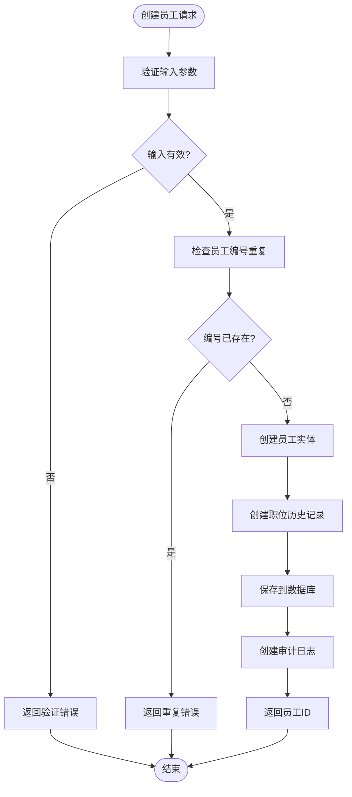
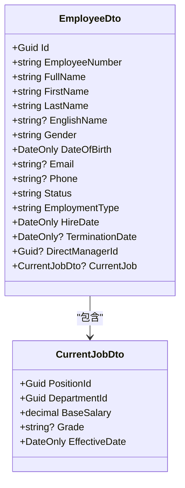
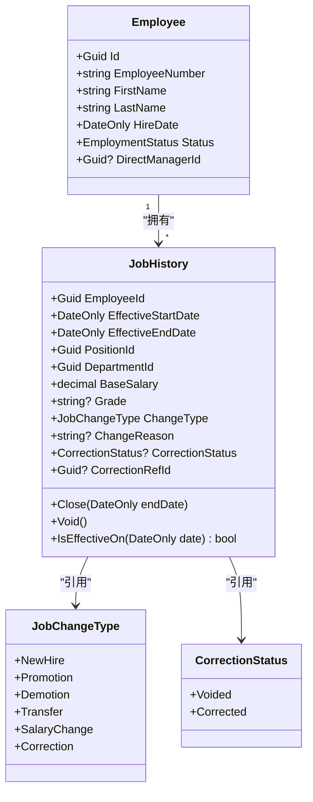
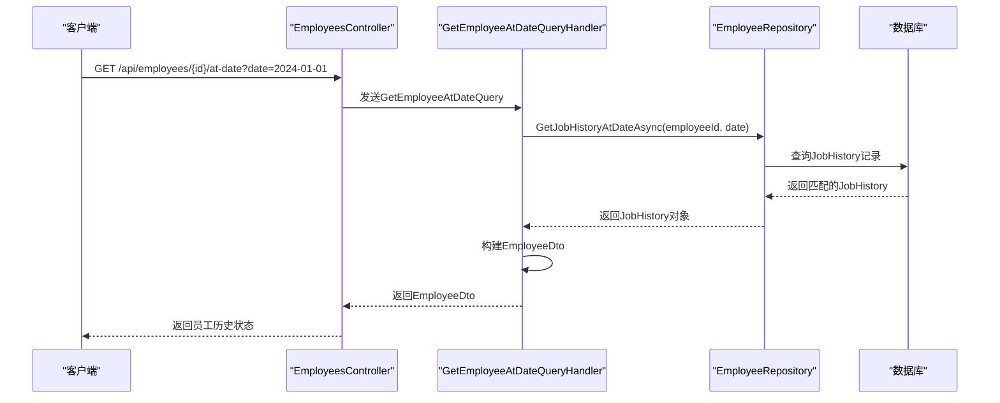
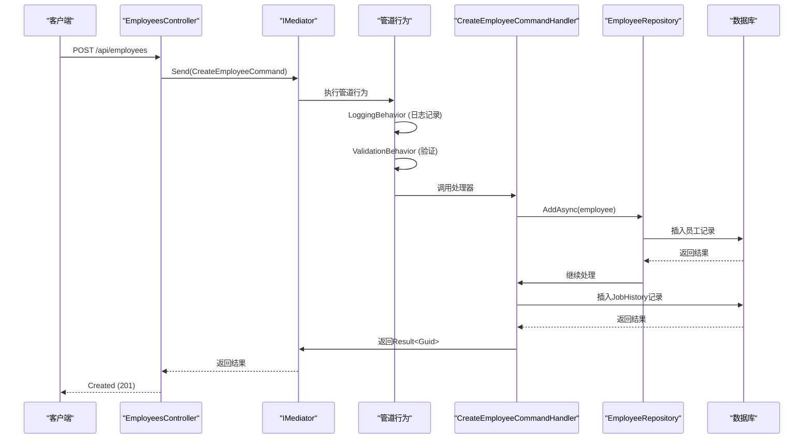
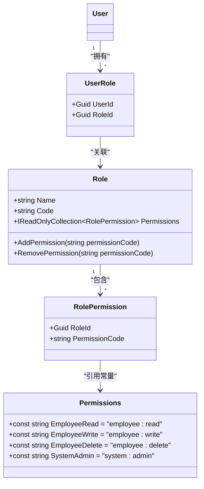
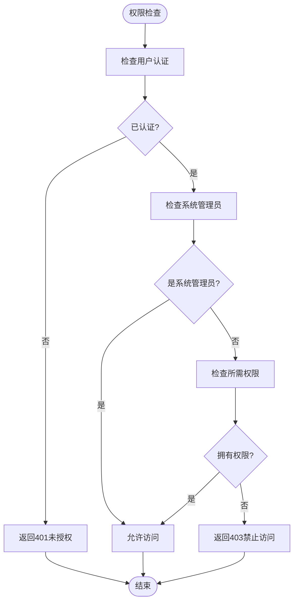
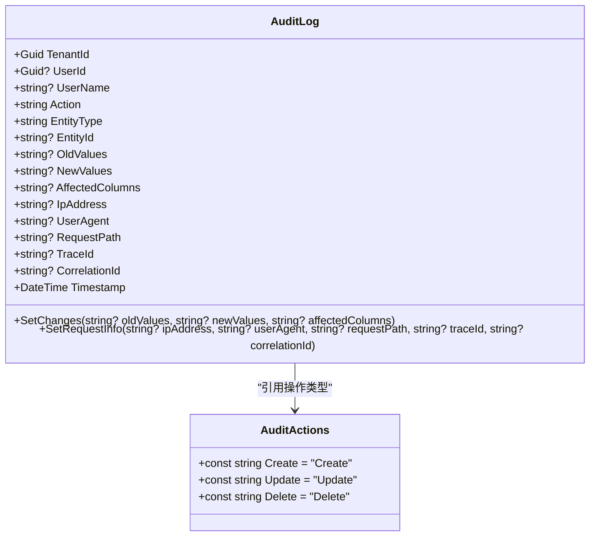
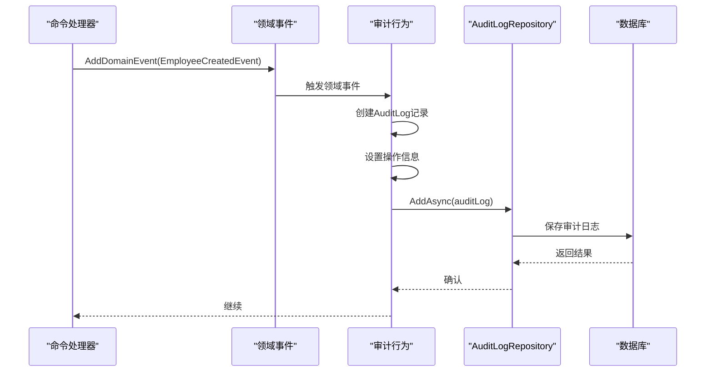

# 员工管理接口

<cite>
**本文档引用文件**  
- [EmployeesController.cs](file://Backend/Hrevolve.Web/Controllers/EmployeesController.cs)
- [CreateEmployeeCommand.cs](file://Backend/Hrevolve.Application/Employees/Commands/CreateEmployeeCommand.cs)
- [GetEmployeeQuery.cs](file://Backend/Hrevolve.Application/Employees/Queries/GetEmployeeQuery.cs)
- [Employee.cs](file://Backend/Hrevolve.Domain/Employees/Employee.cs)
- [JobHistory.cs](file://Backend/Hrevolve.Domain/Employees/JobHistory.cs)
- [RequirePermissionAttribute.cs](file://Backend/Hrevolve.Web/Filters/RequirePermissionAttribute.cs)
- [AuditableEntity.cs](file://Backend/Hrevolve.Domain/Common/AuditableEntity.cs)
- [AuditLog.cs](file://Backend/Hrevolve.Domain/Audit/AuditLog.cs)
- [Role.cs](file://Backend/Hrevolve.Domain/Identity/Role.cs)
- [EmployeeRepository.cs](file://Backend/Hrevolve.Infrastructure/Persistence/Repositories/EmployeeRepository.cs)
- [LoggingBehavior.cs](file://Backend/Hrevolve.Application/Behaviors/LoggingBehavior.cs)
- [ValidationBehavior.cs](file://Backend/Hrevolve.Application/Behaviors/ValidationBehavior.cs)
</cite>

## 目录
1. [简介](#简介)
2. [核心API端点](#核心api端点)
3. [创建员工请求结构](#创建员工请求结构)
4. [获取员工详情响应格式](#获取员工详情响应格式)
5. [分页查询所有员工](#分页查询所有员工)
6. [SCD Type 2历史追溯机制](#scd-type-2历史追溯机制)
7. [MediatR命令调用示例](#mediatr命令调用示例)
8. [RBAC权限控制机制](#rbac权限控制机制)
9. [软删除行为说明](#软删除行为说明)
10. [审计日志自动记录机制](#审计日志自动记录机制)

## 简介
本系统提供完整的员工全生命周期管理功能，涵盖员工创建、更新、查询、离职及历史状态追溯。系统采用CQRS架构模式，通过MediatR实现命令与查询分离，结合SCD Type 2（缓慢变化维度类型2）机制实现员工职位变动的历史追溯。系统支持多租户隔离、RBAC权限控制和全面的审计日志记录。

## 核心API端点
系统提供以下核心API端点用于员工管理：

| 端点 | 方法 | 权限要求 | 功能描述 |
|------|------|----------|----------|
| `/api/employees` | POST | `employee:write` | 创建新员工 |
| `/api/employees/{id}` | GET | `employee:read` | 获取员工当前状态 |
| `/api/employees/{id}/at-date` | GET | `employee:read` | 获取员工历史时点状态 |
| `/api/employees` | GET | `employee:read` | 分页查询所有员工 |
| `/api/employees/{id}` | PUT | `employee:write` | 更新员工信息 |
| `/api/employees/{id}/terminate` | POST | `employee:write` | 处理员工离职 |

**Section sources**
- [EmployeesController.cs](file://Backend/Hrevolve.Web/Controllers/EmployeesController.cs#L6-L95)

## 创建员工请求结构
POST `/api/employees` 接口用于创建新员工，请求体包含员工基本信息、职位信息和联系方式。

### 请求体字段说明
| 字段名 | 类型 | 必填 | 描述 |
|--------|------|------|------|
| `employeeNumber` | string | 是 | 员工编号，唯一标识 |
| `firstName` | string | 是 | 名字 |
| `lastName` | string | 是 | 姓氏 |
| `englishName` | string | 否 | 英文名 |
| `gender` | string | 是 | 性别（Male/Female/Other） |
| `dateOfBirth` | DateOnly | 是 | 出生日期 |
| `hireDate` | DateOnly | 是 | 入职日期 |
| `employmentType` | string | 是 | 雇佣类型（FullTime/PartTime/Contract/Intern/Consultant） |
| `email` | string | 否 | 工作邮箱 |
| `phone` | string | 否 | 联系电话 |
| `directManagerId` | Guid | 否 | 直属上级ID |
| `positionId` | Guid | 是 | 职位ID |
| `departmentId` | Guid | 是 | 部门ID |
| `baseSalary` | decimal | 是 | 基本工资 |

### 请求验证规则
系统通过FluentValidation对请求进行验证，主要规则包括：
- 员工编号不能为空且长度不超过50字符
- 姓名不能为空且长度不超过50字符
- 出生日期必须早于当前日期
- 邮箱格式必须正确（如果提供）
- 职位和部门不能为空
- 基本工资不能为负数



**Diagram sources**
- [CreateEmployeeCommand.cs](file://Backend/Hrevolve.Application/Employees/Commands/CreateEmployeeCommand.cs#L6-L64)
- [CreateEmployeeCommandHandler.cs](file://Backend/Hrevolve.Application/Employees/Commands/CreateEmployeeCommand.cs#L70-L124)

**Section sources**
- [CreateEmployeeCommand.cs](file://Backend/Hrevolve.Application/Employees/Commands/CreateEmployeeCommand.cs#L6-L64)

## 获取员工详情响应格式
GET `/api/employees/{id}` 接口返回员工的完整信息，包括当前职位状态。

### 响应体结构
```json
{
  "id": "string",
  "employeeNumber": "string",
  "fullName": "string",
  "firstName": "string",
  "lastName": "string",
  "englishName": "string",
  "gender": "string",
  "dateOfBirth": "DateOnly",
  "email": "string",
  "phone": "string",
  "status": "string",
  "employmentType": "string",
  "hireDate": "DateOnly",
  "terminationDate": "DateOnly",
  "directManagerId": "string",
  "currentJob": {
    "positionId": "string",
    "departmentId": "string",
    "baseSalary": "decimal",
    "grade": "string",
    "effectiveDate": "DateOnly"
  }
}
```

### 字段说明
| 字段名 | 类型 | 描述 |
|--------|------|------|
| `id` | Guid | 员工唯一标识 |
| `employeeNumber` | string | 员工编号 |
| `fullName` | string | 姓名（姓+名） |
| `firstName` | string | 名字 |
| `lastName` | string | 姓氏 |
| `englishName` | string | 英文名 |
| `gender` | string | 性别 |
| `dateOfBirth` | DateOnly | 出生日期 |
| `email` | string | 工作邮箱 |
| `phone` | string | 联系电话 |
| `status` | string | 员工状态（Active/OnLeave/Suspended/Terminated） |
| `employmentType` | string | 雇佣类型 |
| `hireDate` | DateOnly | 入职日期 |
| `terminationDate` | DateOnly | 离职日期 |
| `directManagerId` | Guid | 直属上级ID |
| `currentJob` | object | 当前职位信息 |



**Diagram sources**
- [GetEmployeeQuery.cs](file://Backend/Hrevolve.Application/Employees/Queries/GetEmployeeQuery.cs#L6-L24)

**Section sources**
- [GetEmployeeQuery.cs](file://Backend/Hrevolve.Application/Employees/Queries/GetEmployeeQuery.cs#L6-L24)

## 分页查询所有员工
GET `/api/employees` 支持分页查询所有员工，可通过查询参数控制分页。

### 请求参数
| 参数名 | 类型 | 默认值 | 描述 |
|--------|------|--------|------|
| `pageSize` | int | 20 | 每页大小（1-100） |
| `pageNumber` | int | 1 | 页码 |
| `sortBy` | string | - | 排序字段 |
| `sortDescending` | bool | false | 是否降序 |

### 响应格式
系统返回PagedResult<T>格式的分页结果：
```json
{
  "items": [
    {
      // 员工对象
    }
  ],
  "totalCount": 100,
  "pageNumber": 1,
  "pageSize": 20,
  "totalPages": 5,
  "hasPreviousPage": false,
  "hasNextPage": true
}
```

**Section sources**
- [Result.cs](file://Backend/Hrevolve.Shared/Results/Result.cs#L46-L63)
- [PagedRequest.cs](file://Backend/Hrevolve.Shared/Results/Result.cs#L68-L87)

## SCD Type 2历史追溯机制
系统通过JobHistory实体实现SCD Type 2（缓慢变化维度类型2）机制，支持员工任意历史时间点的状态查询。

### JobHistory实体设计


**Diagram sources**
- [JobHistory.cs](file://Backend/Hrevolve.Domain/Employees/JobHistory.cs#L9-L124)
- [Employee.cs](file://Backend/Hrevolve.Domain/Employees/Employee.cs#L6-L137)

### 工作流程


**Diagram sources**
- [EmployeesController.cs](file://Backend/Hrevolve.Web/Controllers/EmployeesController.cs#L32-L47)
- [GetEmployeeAtDateQuery.cs](file://Backend/Hrevolve.Application/Employees/Queries/GetEmployeeQuery.cs#L96-L145)
- [EmployeeRepository.cs](file://Backend/Hrevolve.Infrastructure/Persistence/Repositories/EmployeeRepository.cs#L70-L81)

### 核心特性
1. **时间区间管理**：每条记录有`EffectiveStartDate`和`EffectiveEndDate`，默认结束日期为9999-12-31表示当前有效记录
2. **历史追溯**：通过`IsEffectiveOn(DateOnly date)`方法判断记录在指定日期是否有效
3. **数据修正**：支持`CorrectionStatus`标记作废记录和修正记录
4. **变更追踪**：记录`ChangeType`和`ChangeReason`用于审计

**Section sources**
- [JobHistory.cs](file://Backend/Hrevolve.Domain/Employees/JobHistory.cs#L9-L124)

## MediatR命令调用示例
系统采用MediatR库实现CQRS模式，以下是创建员工的命令调用示例：



**Diagram sources**
- [EmployeesController.cs](file://Backend/Hrevolve.Web/Controllers/EmployeesController.cs#L54-L65)
- [CreateEmployeeCommandHandler.cs](file://Backend/Hrevolve.Application/Employees/Commands/CreateEmployeeCommand.cs#L70-L124)
- [LoggingBehavior.cs](file://Backend/Hrevolve.Application/Behaviors/LoggingBehavior.cs#L6-L51)
- [ValidationBehavior.cs](file://Backend/Hrevolve.Application/Behaviors/ValidationBehavior.cs#L8-L43)

### 管道行为
系统配置了多个管道行为：
- **ValidationBehavior**：自动执行FluentValidation验证
- **LoggingBehavior**：记录请求处理日志
- **其他行为**：可扩展事务、缓存等行为

**Section sources**
- [CreateEmployeeCommand.cs](file://Backend/Hrevolve.Application/Employees/Commands/CreateEmployeeCommand.cs#L6-L126)
- [EmployeesController.cs](file://Backend/Hrevolve.Web/Controllers/EmployeesController.cs#L54-L65)

## RBAC权限控制机制
系统采用基于角色的访问控制（RBAC）机制，通过`[RequirePermission]`特性实现细粒度权限控制。

### 权限定义


**Diagram sources**
- [Role.cs](file://Backend/Hrevolve.Domain/Identity/Role.cs#L8-L124)

### 权限检查流程


**Diagram sources**
- [RequirePermissionAttribute.cs](file://Backend/Hrevolve.Web/Filters/RequirePermissionAttribute.cs#L7-L79)

### 权限映射
| 权限码 | 描述 | API端点 |
|--------|------|---------|
| `employee:read` | 员工读取权限 | GET /api/employees/{id} |
| `employee:write` | 员工写入权限 | POST/PUT /api/employees |
| `employee:delete` | 员工删除权限 | DELETE /api/employees/{id} |
| `system:admin` | 系统管理员 | 拥有所有权限 |

**Section sources**
- [RequirePermissionAttribute.cs](file://Backend/Hrevolve.Web/Filters/RequirePermissionAttribute.cs#L7-L79)
- [Role.cs](file://Backend/Hrevolve.Domain/Identity/Role.cs#L89-L123)

## 软删除行为说明
系统采用软删除机制而非物理删除，通过`AuditableEntity`基类实现。

### 软删除字段
```csharp
public abstract class AuditableEntity : Entity
{
    public bool IsDeleted { get; set; } // 软删除标记
    public DateTime? DeletedAt { get; set; } // 删除时间
    public Guid? DeletedBy { get; set; } // 删除人ID
    // 其他审计字段...
}
```

### 删除流程
1. 设置`IsDeleted = true`
2. 记录`DeletedAt`和`DeletedBy`
3. 在查询时自动过滤已删除记录
4. 保留完整审计日志

**Section sources**
- [AuditableEntity.cs](file://Backend/Hrevolve.Domain/Common/AuditableEntity.cs#L36-L47)

## 审计日志自动记录机制
系统通过领域事件和审计日志实现完整的操作追踪。

### 审计日志实体


**Diagram sources**
- [AuditLog.cs](file://Backend/Hrevolve.Domain/Audit/AuditLog.cs#L8-L126)

### 日志记录流程


### 记录内容
审计日志记录以下信息：
- **操作信息**：操作类型、实体类型、实体ID
- **变更数据**：旧值、新值、变更字段（JSON格式）
- **用户信息**：用户ID、用户名
- **环境信息**：IP地址、用户代理、请求路径
- **追踪信息**：追踪ID、关联ID
- **时间戳**：操作发生时间

**Section sources**
- [AuditLog.cs](file://Backend/Hrevolve.Domain/Audit/AuditLog.cs#L8-L126)
- [Employee.cs](file://Backend/Hrevolve.Domain/Employees/Employee.cs#L74-L96)