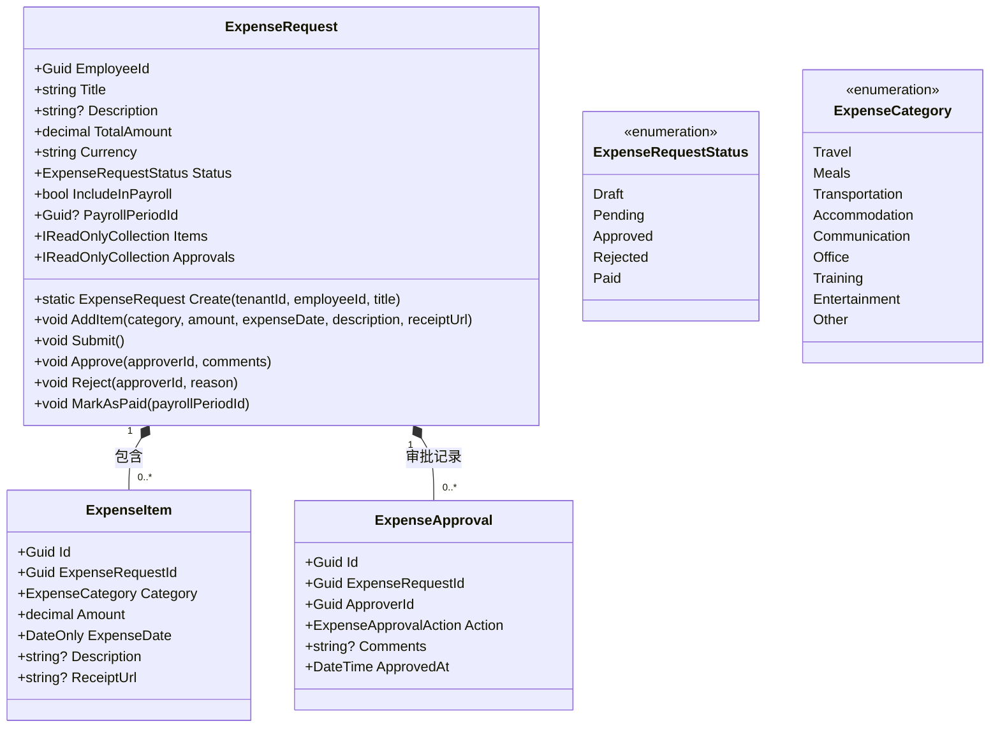
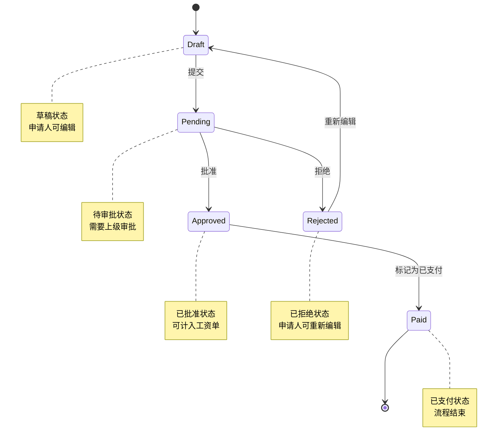
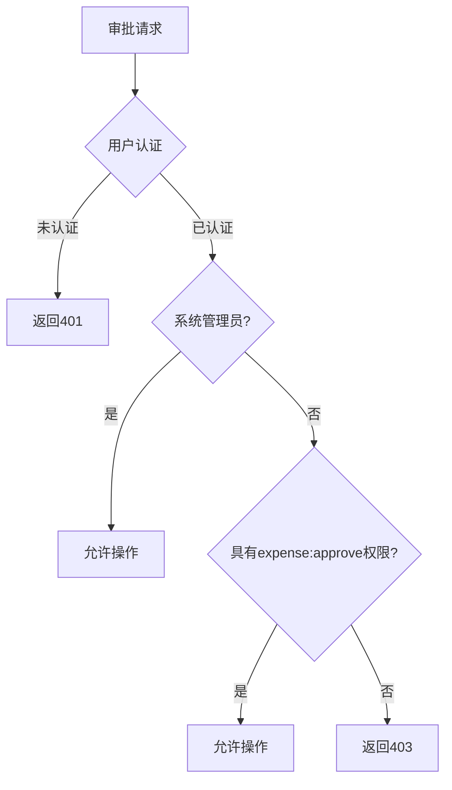
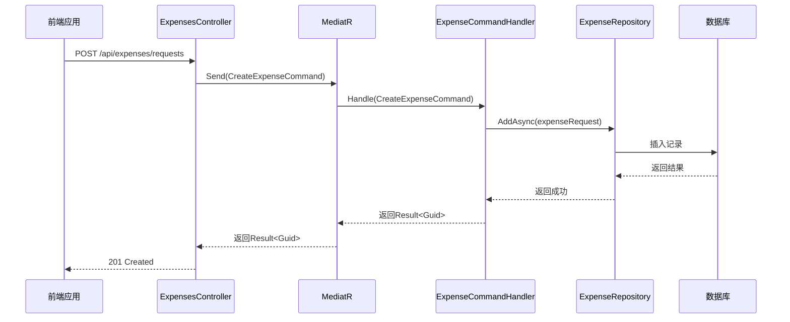

# 报销管理接口

<cite>
**本文档引用的文件**
- [ExpensesController.cs](file://Backend/Hrevolve.Web/Controllers/ExpensesController.cs)
- [ExpenseRequest.cs](file://Backend/Hrevolve.Domain/Expense/ExpenseRequest.cs)
- [ExpenseConfiguration.cs](file://Backend/Hrevolve.Infrastructure/Persistence/Configurations/ExpenseConfiguration.cs)
- [RequirePermissionAttribute.cs](file://Backend/Hrevolve.Web/Filters/RequirePermissionAttribute.cs)
- [Role.cs](file://Backend/Hrevolve.Domain/Identity/Role.cs)
- [expense.ts](file://Frontend/hrevolve-web/src/api/modules/expense.ts)
- [DependencyInjection.cs](file://Backend/Hrevolve.Application/DependencyInjection.cs)
</cite>

## 目录
1. [简介](#简介)
2. [核心数据结构](#核心数据结构)
3. [API端点](#api端点)
4. [状态流转](#状态流转)
5. [权限控制](#权限控制)
6. [MediatR命令处理流程](#mediatr命令处理流程)
7. [文件上传与附件存储](#文件上传与附件存储)
8. [错误处理](#错误处理)

## 简介
报销管理接口提供完整的报销申请生命周期管理功能，包括报销申请的创建、提交、审批、支付和历史查询。系统采用领域驱动设计（DDD）和CQRS模式，通过MediatR实现命令查询职责分离。报销申请支持多明细项、发票附件上传和完整的审批流程。

**Section sources**
- [README.md](file://Backend/README.md#L1-L158)

## 核心数据结构

### 报销申请（ExpenseRequest）
报销申请是系统的核心实体，包含申请基本信息、明细项和审批记录。



**Diagram sources**
- [ExpenseRequest.cs](file://Backend/Hrevolve.Domain/Expense/ExpenseRequest.cs#L8-L105)

**Section sources**
- [ExpenseRequest.cs](file://Backend/Hrevolve.Domain/Expense/ExpenseRequest.cs#L1-L187)

## API端点

### POST /api/expenses/requests - 创建报销申请
创建新的报销申请，初始状态为草稿。

#### 请求体结构
```json
{
  "title": "北京出差报销",
  "description": "客户拜访出差费用",
  "items": [
    {
      "category": "Travel",
      "amount": 1200.00,
      "expenseDate": "2025-12-27",
      "description": "高铁票",
      "receiptUrl": "https://storage.example.com/receipts/123.jpg"
    },
    {
      "category": "Accommodation",
      "amount": 800.00,
      "expenseDate": "2025-12-27",
      "description": "酒店住宿",
      "receiptUrl": "https://storage.example.com/receipts/456.jpg"
    }
  ]
}
```

#### 字段说明
- `title`: 申请标题（必填，最大200字符）
- `description`: 申请描述（可选，最大1000字符）
- `items`: 报销明细项数组（至少一项）
  - `category`: 费用类别（枚举值）
  - `amount`: 金额（精度18,2）
  - `expenseDate`: 费用发生日期
  - `description`: 明细描述
  - `receiptUrl`: 发票/收据URL

**Section sources**
- [ExpensesController.cs](file://Backend/Hrevolve.Web/Controllers/ExpensesController.cs#L74-L78)

### GET /api/expenses/requests/{id} - 获取报销详情
获取指定报销申请的详细信息。

#### 响应格式
```json
{
  "id": "a1b2c3d4-e5f6-7890-1234-567890abcdef",
  "employeeId": "e1f2g3h4-i5j6-7890-1234-567890abcdef",
  "employeeName": "张三",
  "title": "北京出差报销",
  "description": "客户拜访出差费用",
  "totalAmount": 2000.00,
  "currency": "CNY",
  "status": "Approved",
  "createdAt": "2025-12-27T10:00:00Z",
  "updatedAt": "2025-12-27T14:30:00Z",
  "items": [
    {
      "id": "b2c3d4e5-f6g7-8901-2345-67890abcdeff",
      "category": "Travel",
      "amount": 1200.00,
      "expenseDate": "2025-12-27",
      "description": "高铁票",
      "receiptUrl": "https://storage.example.com/receipts/123.jpg"
    }
  ],
  "approvals": [
    {
      "approverId": "f6g7h8i9-j0k1-2345-6789-0123456789ab",
      "approverName": "李四",
      "action": "Approve",
      "comments": "费用合理，同意报销",
      "approvedAt": "2025-12-27T14:30:00Z"
    }
  ]
}
```

**Section sources**
- [ExpensesController.cs](file://Backend/Hrevolve.Web/Controllers/ExpensesController.cs#L55-L68)

### POST /api/expenses/requests/{id}/submit - 提交报销申请
将草稿状态的报销申请提交审批。

**Section sources**
- [ExpenseRequest.cs](file://Backend/Hrevolve.Domain/Expense/ExpenseRequest.cs#L76-L82)

### POST /api/expenses/requests/{id}/approve - 审批报销申请
审批报销申请，可批准或拒绝。

#### 请求体
```json
{
  "approved": true,
  "comment": "费用合理，同意报销"
}
```

**Section sources**
- [ExpensesController.cs](file://Backend/Hrevolve.Web/Controllers/ExpensesController.cs#L83-L87)

## 状态流转
报销申请具有明确的状态流转机制，确保业务流程的正确性。



**Diagram sources**
- [ExpenseRequest.cs](file://Backend/Hrevolve.Domain/Expense/ExpenseRequest.cs#L107-L114)

**Section sources**
- [ExpenseRequest.cs](file://Backend/Hrevolve.Domain/Expense/ExpenseRequest.cs#L76-L94)

## 权限控制
系统采用RBAC（基于角色的访问控制）模型，确保只有授权用户才能执行特定操作。

### 权限定义
```csharp
public static class Permissions
{
    public const string ExpenseRead = "expense:read";
    public const string ExpenseWrite = "expense:write";
    public const string ExpenseApprove = "expense:approve";
}
```

### 审批权限
只有具有`expense:approve`权限的用户（直属上级或财务人员）才能审批报销申请。



**Diagram sources**
- [RequirePermissionAttribute.cs](file://Backend/Hrevolve.Web/Filters/RequirePermissionAttribute.cs#L33-L77)
- [Role.cs](file://Backend/Hrevolve.Domain/Identity/Role.cs#L89-L119)

**Section sources**
- [RequirePermissionAttribute.cs](file://Backend/Hrevolve.Web/Filters/RequirePermissionAttribute.cs#L1-L80)

## MediatR命令处理流程
系统采用MediatR实现CQRS模式，将命令处理与查询分离。



**Diagram sources**
- [DependencyInjection.cs](file://Backend/Hrevolve.Application/DependencyInjection.cs#L13-L18)
- [ExpensesController.cs](file://Backend/Hrevolve.Web/Controllers/ExpensesController.cs#L74-L78)

**Section sources**
- [DependencyInjection.cs](file://Backend/Hrevolve.Application/DependencyInjection.cs#L1-L25)

## 文件上传与附件存储
系统提供安全的文件上传接口，用于上传发票和收据。

### 上传流程
1. 前端创建FormData对象
2. 调用上传接口
3. 服务端验证文件类型和大小
4. 上传到安全存储
5. 返回文件URL

### 上传接口
POST /api/expenses/receipts/upload

```typescript
// 前端调用示例
const uploadReceipt = (file: File) => {
  const formData = new FormData();
  formData.append('file', file);
  return request.post<{ url: string }>('/expenses/receipts/upload', formData);
};
```

### 安全策略
- 文件类型限制：仅允许图片（jpg, png, gif）和PDF
- 文件大小限制：最大10MB
- 存储加密：所有文件在存储时进行加密
- 访问控制：通过JWT Token验证访问权限
- URL有效期：生成的访问URL具有时效性

**Section sources**
- [expense.ts](file://Frontend/hrevolve-web/src/api/modules/expense.ts#L107-L111)

## 错误处理
系统提供统一的错误响应格式，便于前端处理。

```json
{
  "code": "VALIDATION_ERROR",
  "message": "报销申请必须包含至少一项费用",
  "details": {
    "items": [
      "报销明细不能为空"
    ]
  }
}
```

常见错误码：
- `VALIDATION_ERROR`: 验证错误
- `UNAUTHORIZED`: 未授权访问
- `FORBIDDEN`: 权限不足
- `NOT_FOUND`: 资源不存在
- `BUSINESS_RULE_VIOLATION`: 业务规则违反

**Section sources**
- [RequirePermissionAttribute.cs](file://Backend/Hrevolve.Web/Filters/RequirePermissionAttribute.cs#L40-L44)
- [ExpenseRequest.cs](file://Backend/Hrevolve.Domain/Expense/ExpenseRequest.cs#L78-L79)