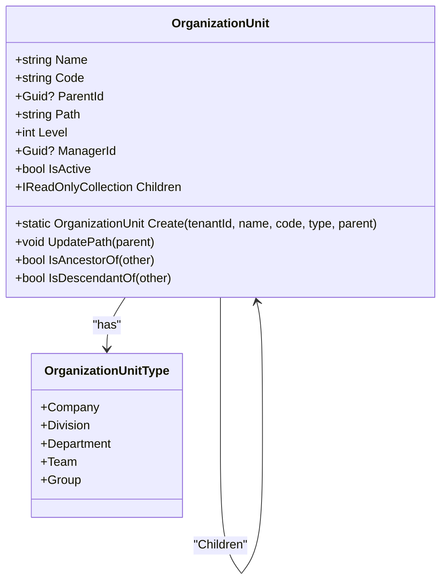
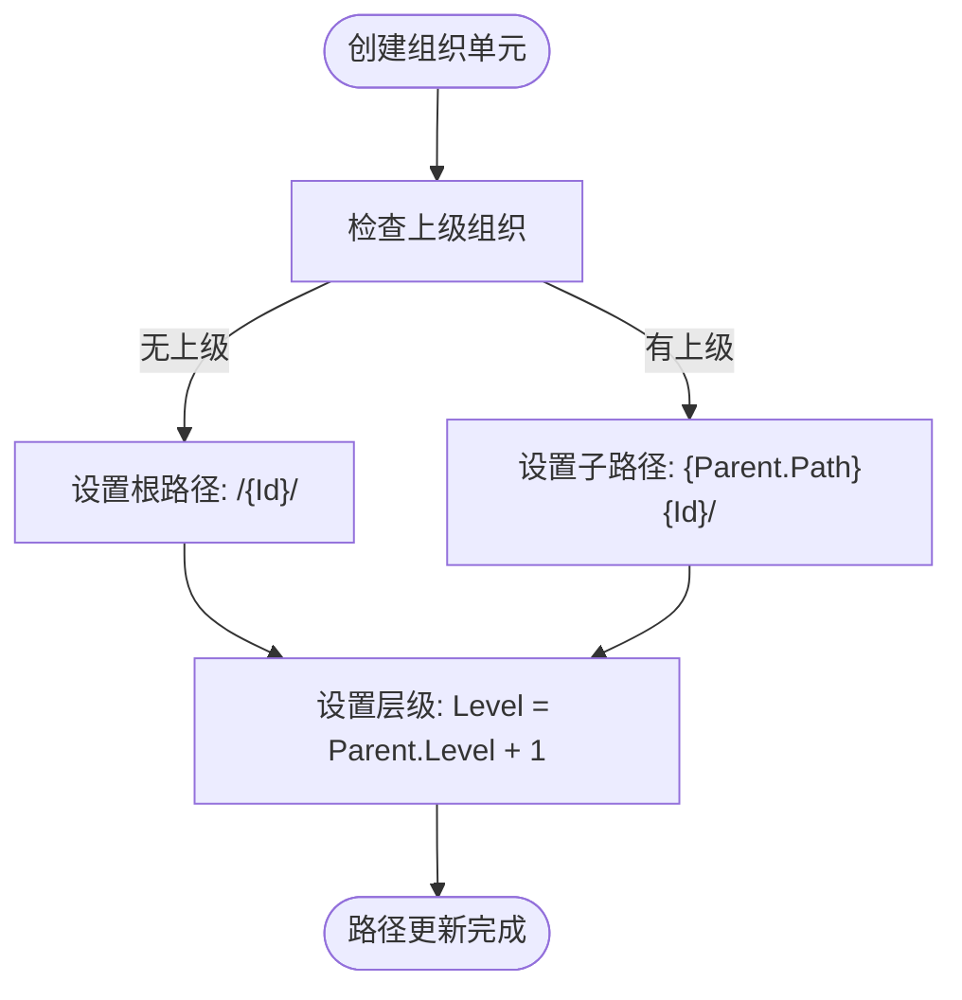
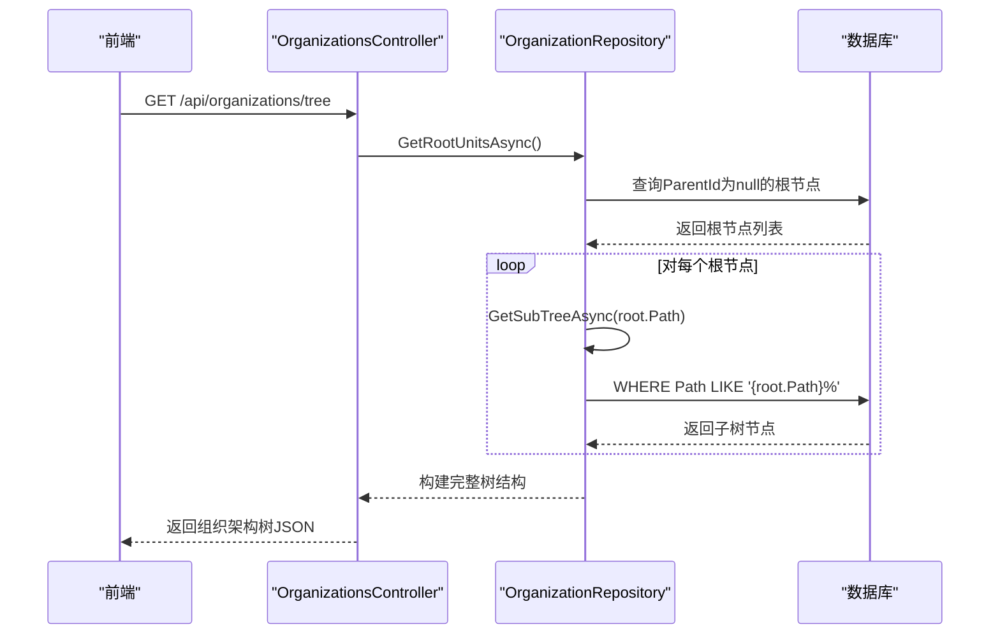
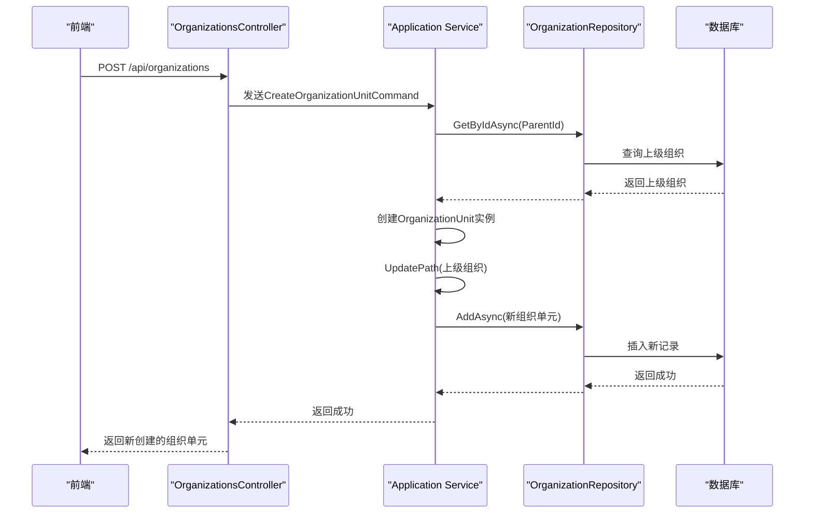
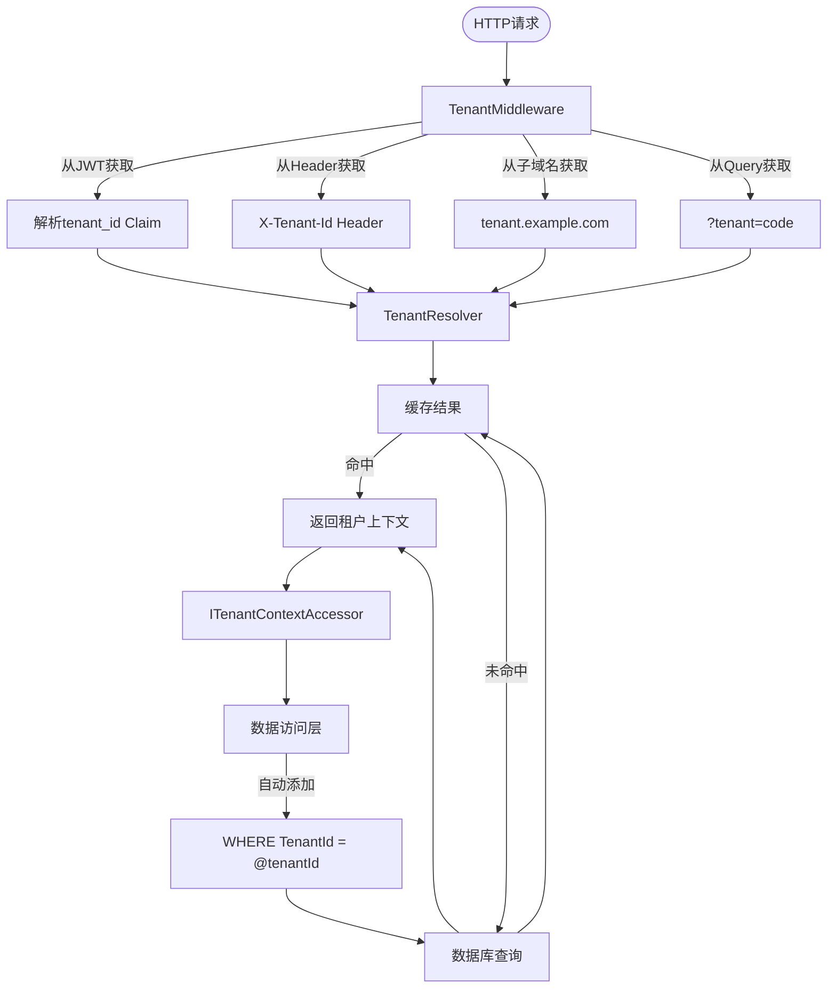
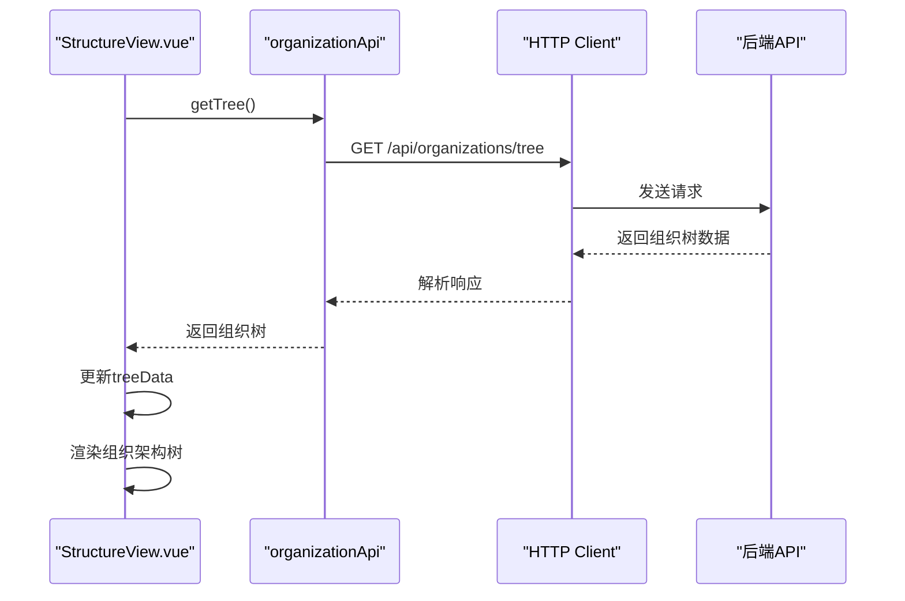
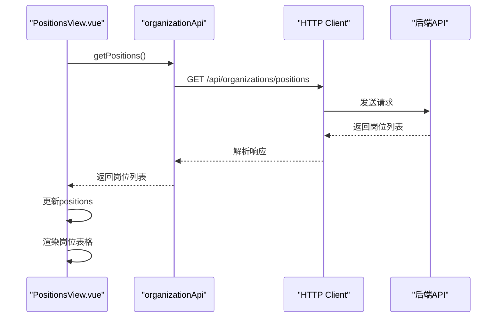

# 组织架构接口

<cite>
**本文档引用的文件**  
- [OrganizationUnit.cs](file://Backend/Hrevolve.Domain/Organizations/OrganizationUnit.cs)
- [Position.cs](file://Backend/Hrevolve.Domain/Organizations/Position.cs)
- [OrganizationsController.cs](file://Backend/Hrevolve.Web/Controllers/OrganizationsController.cs)
- [OrganizationConfiguration.cs](file://Backend/Hrevolve.Infrastructure/Persistence/Configurations/OrganizationConfiguration.cs)
- [TenantMiddleware.cs](file://Backend/Hrevolve.Web/Middleware/TenantMiddleware.cs)
- [TenantResolver.cs](file://Backend/Hrevolve.Infrastructure/MultiTenancy/TenantResolver.cs)
- [StructureView.vue](file://Frontend/hrevolve-web/src/views/organization/StructureView.vue)
- [PositionsView.vue](file://Frontend/hrevolve-web/src/views/organization/PositionsView.vue)
- [organization.ts](file://Frontend/hrevolve-web/src/api/modules/organization.ts)
- [Program.cs](file://Backend/Hrevolve.Web/Program.cs)
</cite>

## 目录
1. [简介](#简介)
2. [核心数据模型](#核心数据模型)
3. [组织架构树形结构实现](#组织架构树形结构实现)
4. [组织单元增删改查API](#组织单元增删改查api)
5. [岗位管理API](#岗位管理api)
6. [组织与员工关联关系](#组织与员工关联关系)
7. [多租户数据隔离机制](#多租户数据隔离机制)
8. [前端集成示例](#前端集成示例)
9. [性能优化与查询策略](#性能优化与查询策略)

## 简介
本技术文档详细说明了HR管理系统中组织架构管理API的设计与实现。系统采用邻接表+路径枚举的混合模型来高效管理树形组织结构，支持组织单元（OrganizationUnit）和岗位（Position）的完整生命周期管理。文档涵盖了从数据模型、API设计到多租户隔离的各个方面，为开发者提供全面的技术参考。

## 核心数据模型

### 组织单元（OrganizationUnit）
组织单元是系统中组织架构的基本组成单位，其核心属性包括：
- **Name**: 组织单元名称
- **Code**: 唯一编码
- **Type**: 组织类型（公司、事业部、部门、团队、小组）
- **ParentId**: 上级组织ID（邻接表模型）
- **Path**: 路径枚举（如 /1/5/23/）
- **Level**: 层级深度
- **ManagerId**: 负责人ID
- **IsActive**: 激活状态

**Section sources**
- [OrganizationUnit.cs](file://Backend/Hrevolve.Domain/Organizations/OrganizationUnit.cs#L9-L107)

### 岗位（Position）
岗位定义了组织内的职位信息，其核心属性包括：
- **Name**: 岗位名称
- **Code**: 唯一编码
- **OrganizationUnitId**: 所属组织单元ID
- **Level**: 岗位级别（初级、中级、高级等）
- **Sequence**: 职位序列（技术序列、管理序列）
- **SalaryRangeMin/Max**: 薪资范围

**Section sources**
- [Position.cs](file://Backend/Hrevolve.Domain/Organizations/Position.cs#L8-L71)

## 组织架构树形结构实现

### 邻接表+路径枚举混合模型
系统采用邻接表（ParentId）和路径枚举（Path）相结合的混合模型来实现高效的树形结构管理。



**Diagram sources**
- [OrganizationUnit.cs](file://Backend/Hrevolve.Domain/Organizations/OrganizationUnit.cs#L9-L107)

### 路径枚举更新逻辑
当创建或移动组织单元时，系统会自动更新其路径枚举字段：



**Diagram sources**
- [OrganizationUnit.cs](file://Backend/Hrevolve.Domain/Organizations/OrganizationUnit.cs#L66-L77)

## 组织单元增删改查API

### 获取组织架构树
通过 `GET /api/organizations/tree` 接口获取完整的组织架构树。



**Section sources**
- [OrganizationsController.cs](file://Backend/Hrevolve.Web/Controllers/OrganizationsController.cs#L17-L20)
- [OrganizationRepository.cs](file://Backend/Hrevolve.Infrastructure/Persistence/Repositories/OrganizationRepository.cs#L40-L57)

### 创建组织单元
通过 `POST /api/organizations` 接口创建新的组织单元。



**Section sources**
- [OrganizationsController.cs](file://Backend/Hrevolve.Web/Controllers/OrganizationsController.cs#L39-L44)
- [OrganizationUnit.cs](file://Backend/Hrevolve.Domain/Organizations/OrganizationUnit.cs#L45-L64)

### 创建组织单元JSON示例
```json
{
  "name": "研发部",
  "code": "RD",
  "type": "Department",
  "parentId": "a1b2c3d4-e5f6-7890-1234-567890abcdef",
  "description": "负责产品研发和技术支持"
}
```

## 岗位管理API

### 岗位与组织单元关系
岗位（Position）与组织单元（OrganizationUnit）之间存在一对多的关系。

```mermaid
erDiagram
ORGANIZATION_UNIT ||--o{ POSITION : "contains"
ORGANIZATION_UNIT {
guid Id PK
string Name
string Code
guid? ParentId FK
string Path
int Level
guid? ManagerId FK
bool IsActive
}
POSITION }o--|| ORGANIZATION_UNIT : "belongs to"
POSITION {
guid Id PK
string Name
string Code
guid OrganizationUnitId FK
string Level
string? Sequence
decimal? SalaryRangeMin
decimal? SalaryRangeMax
bool IsActive
}
```

**Diagram sources**
- [Position.cs](file://Backend/Hrevolve.Domain/Organizations/Position.cs#L13-L14)
- [OrganizationConfiguration.cs](file://Backend/Hrevolve.Infrastructure/Persistence/Configurations/OrganizationConfiguration.cs#L87-L90)

### 批量调整人员岗位
系统支持通过批量API调整员工的岗位分配，实现组织架构调整时的人员迁移。

**Section sources**
- [GetEmployeeQuery.cs](file://Backend/Hrevolve.Application/Employees/Queries/GetEmployeeQuery.cs#L23-L36)

## 多租户数据隔离机制

### 租户上下文管理
系统通过中间件链实现多租户数据隔离。



**Diagram sources**
- [TenantMiddleware.cs](file://Backend/Hrevolve.Web/Middleware/TenantMiddleware.cs#L21-L132)
- [TenantResolver.cs](file://Backend/Hrevolve.Infrastructure/MultiTenancy/TenantResolver.cs#L29-L56)
- [Program.cs](file://Backend/Hrevolve.Web/Program.cs#L149-L153)

### 数据库查询过滤
所有数据访问操作都会自动应用租户过滤器，确保不同租户的数据完全隔离。

**Section sources**
- [RequirementsDocument.md](file://Design/RequirementsDocument.md#L86-L88)

## 前端集成示例

### 组织架构树视图
前端通过调用API获取并展示组织架构树。



**Section sources**
- [StructureView.vue](file://Frontend/hrevolve-web/src/views/organization/StructureView.vue#L12-L17)
- [organization.ts](file://Frontend/hrevolve-web/src/api/modules/organization.ts#L7-L9)

### 岗位管理视图
前端通过API获取并展示岗位列表。



**Section sources**
- [PositionsView.vue](file://Frontend/hrevolve-web/src/views/organization/PositionsView.vue#L11-L15)
- [organization.ts](file://Frontend/hrevolve-web/src/api/modules/organization.ts#L31-L33)

## 性能优化与查询策略

### 索引策略
数据库为关键字段创建了复合索引以优化查询性能。

```mermaid
erDiagram
ORGANIZATION_UNIT {
guid Id PK
string Name
string Code
guid? ParentId FK
string Path "索引: (TenantId, Path)"
int Level
guid? ManagerId FK
bool IsActive
}
ORGANIZATION_UNIT ||--o{ ORGANIZATION_UNIT : "Parent-Child"
ORGANIZATION_UNIT }o--|| POSITION : "contains"
classDiagram
class Index {
+"(TenantId, Code)" : 唯一索引
+"(TenantId, ParentId)" : 普通索引
+"(TenantId, Path)" : 普通索引
}
```

**Section sources**
- [OrganizationConfiguration.cs](file://Backend/Hrevolve.Infrastructure/Persistence/Configurations/OrganizationConfiguration.cs#L33-L37)

### 查询性能影响
路径枚举模型显著提升了树形查询的性能：
- **优点**：子树查询、祖先查询、层级查询都非常高效
- **缺点**：移动节点时需要更新所有子节点的Path字段
- **权衡**：读多写少的场景下，路径枚举是最佳选择