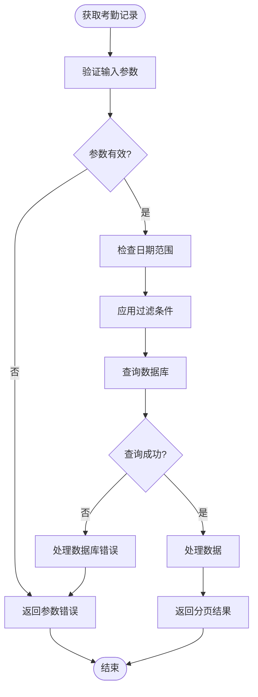
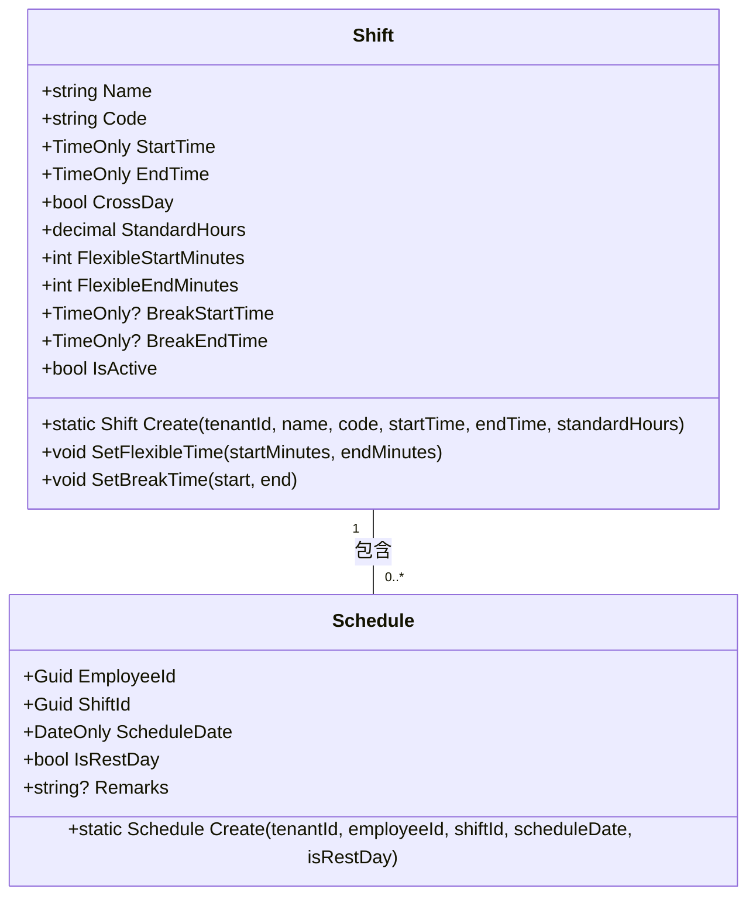
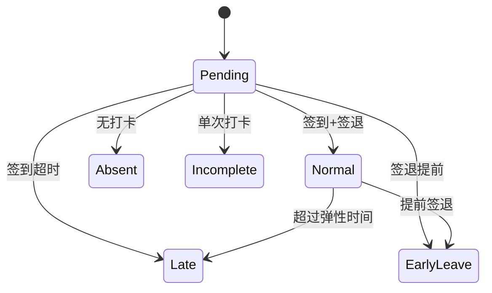
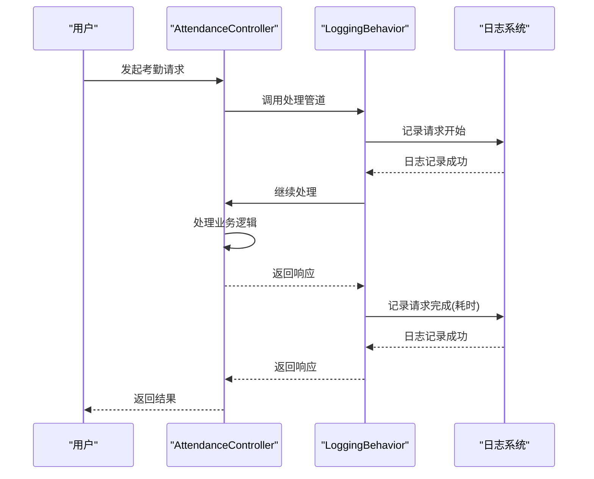
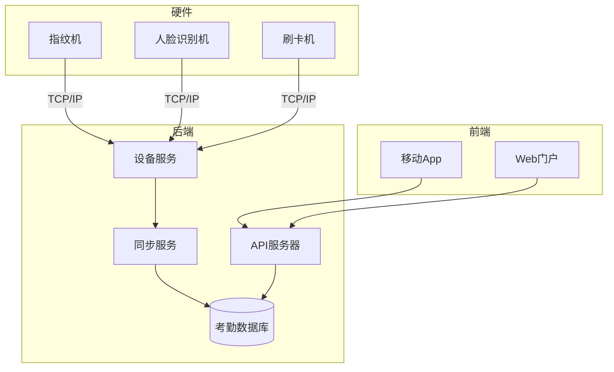

# 考勤管理接口

<cite>
**本文档引用的文件**   
- [AttendanceController.cs](file://Backend/Hrevolve.Web/Controllers/AttendanceController.cs)
- [AttendanceRecord.cs](file://Backend/Hrevolve.Domain/Attendance/AttendanceRecord.cs)
- [Shift.cs](file://Backend/Hrevolve.Domain/Attendance/Shift.cs)
- [LoggingBehavior.cs](file://Backend/Hrevolve.Application/Behaviors/LoggingBehavior.cs)
- [AttendanceConfiguration.cs](file://Backend/Hrevolve.Infrastructure/Persistence/Configurations/AttendanceConfiguration.cs)
- [ClockDevicesView.vue](file://Frontend/hrevolve-web/src/views/company/ClockDevicesView.vue)
- [attendance.ts](file://Frontend/hrevolve-web/src/api/modules/attendance.ts)
- [index.ts](file://Frontend/hrevolve-web/src/types/index.ts)
</cite>

## 目录
1. [简介](#简介)
2. [考勤记录管理](#考勤记录管理)
3. [班次与排班管理](#班次与排班管理)
4. [考勤异常处理](#考勤异常处理)
5. [日志记录机制](#日志记录机制)
6. [硬件设备集成](#硬件设备集成)

## 简介
本API文档详细描述了考勤管理模块的核心功能，包括打卡记录管理、班次安排、异常处理、智能排班以及与硬件设备的集成。系统采用基于租户的多租户架构，支持灵活的考勤规则配置和多种打卡方式。

**Section sources**
- [AttendanceController.cs](file://Backend/Hrevolve.Web/Controllers/AttendanceController.cs#L1-L126)

## 考勤记录管理

### 获取考勤记录
通过 `GET /api/attendance/records/my` 接口获取指定员工的考勤记录，支持多种查询参数进行过滤：

| 参数名 | 类型 | 必填 | 描述 |
|-------|------|------|------|
| startDate | DateOnly | 否 | 查询开始日期，格式为YYYY-MM-DD |
| endDate | DateOnly | 否 | 查询结束日期，格式为YYYY-MM-DD |
| pageNumber | int | 否 | 页码，默认为1 |
| pageSize | int | 否 | 每页大小，默认为20 |

当不提供日期范围时，默认返回最近30天的考勤记录。支持分页查询，返回结果包含总记录数和分页信息。



**Diagram sources**
- [AttendanceController.cs](file://Backend/Hrevolve.Web/Controllers/AttendanceController.cs#L62-L70)
- [AttendanceRecord.cs](file://Backend/Hrevolve.Domain/Attendance/AttendanceRecord.cs#L8-L169)

### 手动添加打卡记录
通过 `POST /api/attendance/manual-check` 接口手动添加或补录打卡记录，请求体结构如下：

```json
{
  "date": "2024-01-15",
  "checkInTime": "2024-01-15T09:05:00",
  "checkOutTime": "2024-01-15T18:02:00",
  "reason": "忘记打卡"
}
```

| 字段 | 类型 | 必填 | 描述 |
|------|------|------|------|
| date | DateOnly | 是 | 考勤日期 |
| checkInTime | DateTime | 否 | 签到时间 |
| checkOutTime | DateTime | 否 | 签退时间 |
| reason | string | 是 | 补卡原因 |

系统会根据提供的打卡时间自动计算实际工时，并将记录状态设置为"待审批"，需要管理员审批后生效。

**Section sources**
- [AttendanceController.cs](file://Backend/Hrevolve.Web/Controllers/AttendanceController.cs#L49-L56)
- [AttendanceRecord.cs](file://Backend/Hrevolve.Domain/Attendance/AttendanceRecord.cs#L121-L136)

## 班次与排班管理

### 班次实体定义
`Shift` 实体用于定义标准班次时间，包含以下核心属性：

| 属性 | 类型 | 描述 |
|------|------|------|
| Name | string | 班次名称（如"早班"） |
| Code | string | 班次代码（唯一标识） |
| StartTime | TimeOnly | 上班时间 |
| EndTime | TimeOnly | 下班时间 |
| CrossDay | bool | 是否跨天（下班时间早于上班时间） |
| StandardHours | decimal | 标准工时（小时） |
| FlexibleStartMinutes | int | 弹性上班时间（分钟） |
| FlexibleEndMinutes | int | 弹性下班时间（分钟） |
| BreakStartTime | TimeOnly? | 休息开始时间 |
| BreakEndTime | TimeOnly? | 休息结束时间 |
| IsActive | bool | 是否启用 |



**Diagram sources**
- [Shift.cs](file://Backend/Hrevolve.Domain/Attendance/Shift.cs#L8-L89)
- [Shift.cs](file://Backend/Hrevolve.Domain/Attendance/Shift.cs#L94-L129)

### 班次管理API
系统提供完整的班次管理API，支持班次的增删改查操作：

| HTTP方法 | 路径 | 描述 | 权限要求 |
|---------|------|------|---------|
| GET | /api/schedules/shift-templates | 获取班次模板列表 | attendance:read |
| POST | /api/schedules/shift-templates | 创建新班次 | attendance:write |
| PUT | /api/schedules/shift-templates/{id} | 更新班次信息 | attendance:write |
| DELETE | /api/schedules/shift-templates/{id} | 删除班次 | attendance:write |

智能排班功能支持周期性班次生成规则，可通过API批量为员工分配周期性班次，如每周一至周五的固定班次安排。

**Section sources**
- [SchedulesController.cs](file://Backend/Hrevolve.Web/Controllers/SchedulesController.cs#L58-L96)
- [ShiftTemplatesView.vue](file://Frontend/hrevolve-web/src/views/schedule/ShiftTemplatesView.vue#L1-L162)

## 考勤异常处理

### 异常标记与响应
系统自动检测并标记考勤异常情况，考勤记录的 `Status` 字段会反映相应的异常状态：

| 状态 | 描述 | 触发条件 |
|------|------|---------|
| Late | 迟到 | 签到时间超过允许的弹性时间 |
| EarlyLeave | 早退 | 签退时间早于规定时间 |
| Absent | 缺勤 | 未进行任何打卡操作 |
| Incomplete | 打卡不完整 | 只有签到或只有签退记录 |
| Pending | 待处理 | 初始状态或补卡待审批 |

响应字段说明：
- `LateMinutes`: 迟到分钟数
- `EarlyLeaveMinutes`: 早退分钟数
- `ActualHours`: 实际工时（小时）
- `OvertimeHours`: 加班时长（小时）
- `Remarks`: 备注信息
- `IsApproved`: 是否已审核



**Diagram sources**
- [AttendanceRecord.cs](file://Backend/Hrevolve.Domain/Attendance/AttendanceRecord.cs#L48-L168)
- [AttendanceStatus](file://Backend/Hrevolve.Domain/Attendance/AttendanceRecord.cs#L180-L190)

## 日志记录机制
系统通过 `LoggingBehavior` 中间件实现全面的操作日志记录，每次考勤操作都会被记录：



日志记录包含以下关键信息：
- 请求名称
- 用户ID
- 租户ID
- 处理耗时（毫秒）
- 错误信息（如有）

日志级别包括：
- `Information`: 正常请求处理
- `Error`: 请求处理失败

**Diagram sources**
- [LoggingBehavior.cs](file://Backend/Hrevolve.Application/Behaviors/LoggingBehavior.cs#L6-L51)
- [ExceptionHandlingMiddleware.cs](file://Backend/Hrevolve.Web/Middleware/ExceptionHandlingMiddleware.cs#L1-L97)

**Section sources**
- [LoggingBehavior.cs](file://Backend/Hrevolve.Application/Behaviors/LoggingBehavior.cs#L6-L51)

## 硬件设备集成
系统支持与多种类型的打卡硬件设备集成，包括指纹机、人脸识别机、刷卡机等。

### 设备管理API
| HTTP方法 | 路径 | 描述 |
|---------|------|------|
| GET | /api/company/clock-devices | 获取打卡设备列表 |
| POST | /api/company/clock-devices | 创建打卡设备 |
| PUT | /api/company/clock-devices/{id} | 更新设备信息 |
| DELETE | /api/company/clock-devices/{id} | 删除设备 |

设备类型支持：
- Fingerprint: 指纹识别
- Face: 人脸识别
- Card: 刷卡
- GPS: GPS定位（移动端）
- WiFi: WiFi信号识别

### 集成设计考虑
1. **设备认证**: 每台设备有唯一的序列号和认证密钥
2. **心跳机制**: 设备定期发送心跳包，确保在线状态
3. **数据同步**: 支持定时或实时同步打卡数据
4. **位置验证**: 结合GPS和WiFi进行位置验证，防止代打卡
5. **离线模式**: 设备支持离线存储，网络恢复后自动同步



**Diagram sources**
- [CompanyController.cs](file://Backend/Hrevolve.Web/Controllers/CompanyController.cs#L128-L165)
- [ClockDevicesView.vue](file://Frontend/hrevolve-web/src/views/company/ClockDevicesView.vue#L1-L227)
- [index.ts](file://Frontend/hrevolve-web/src/types/index.ts#L100-L113)

**Section sources**
- [CompanyController.cs](file://Backend/Hrevolve.Web/Controllers/CompanyController.cs#L128-L165)
- [ClockDevicesView.vue](file://Frontend/hrevolve-web/src/views/company/ClockDevicesView.vue#L1-L227)