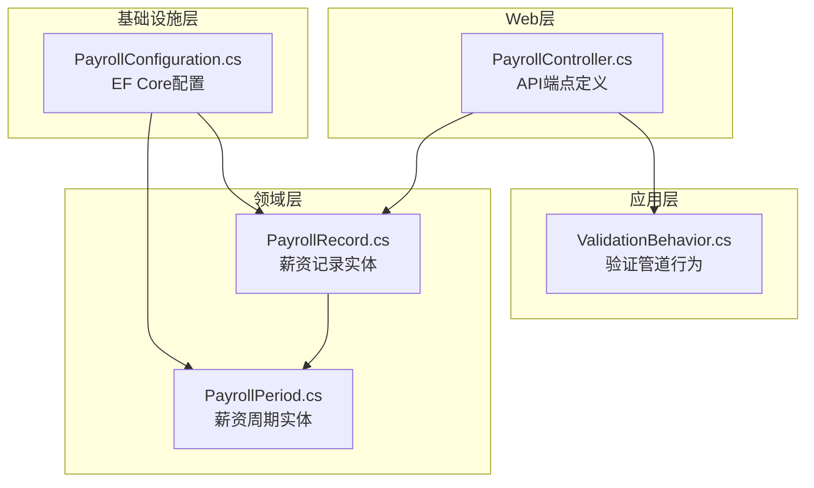
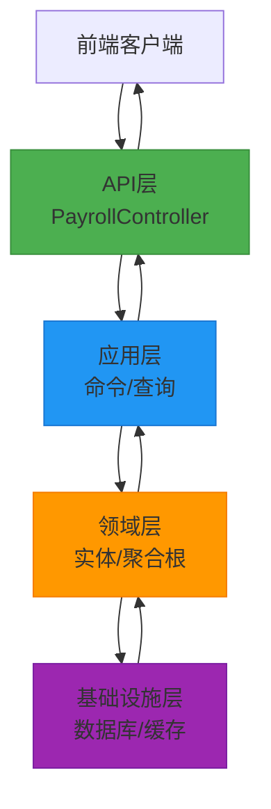
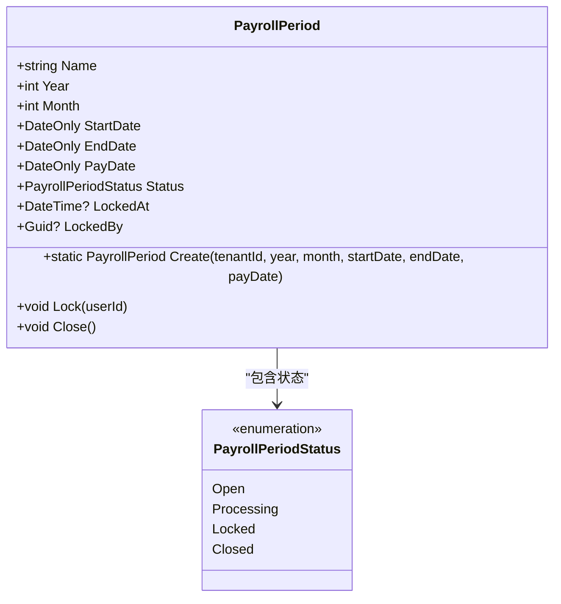
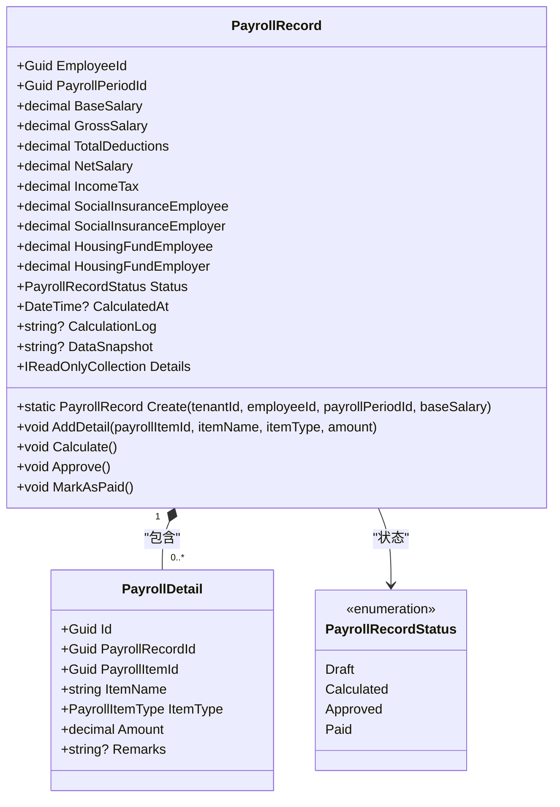
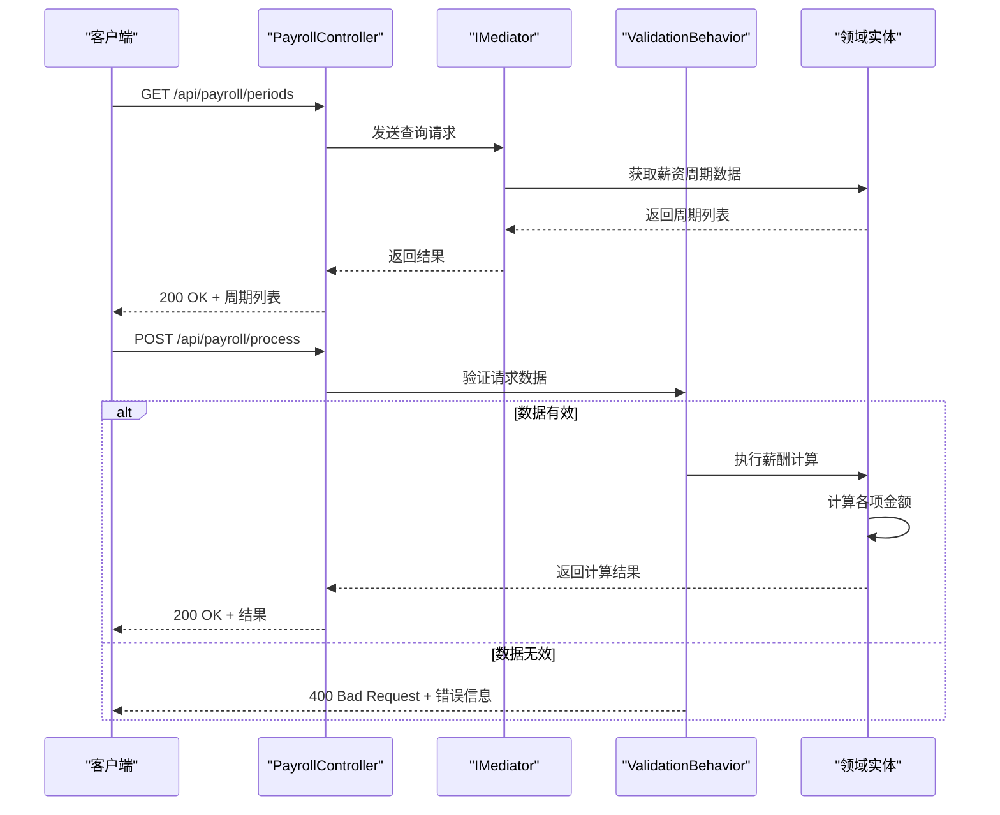
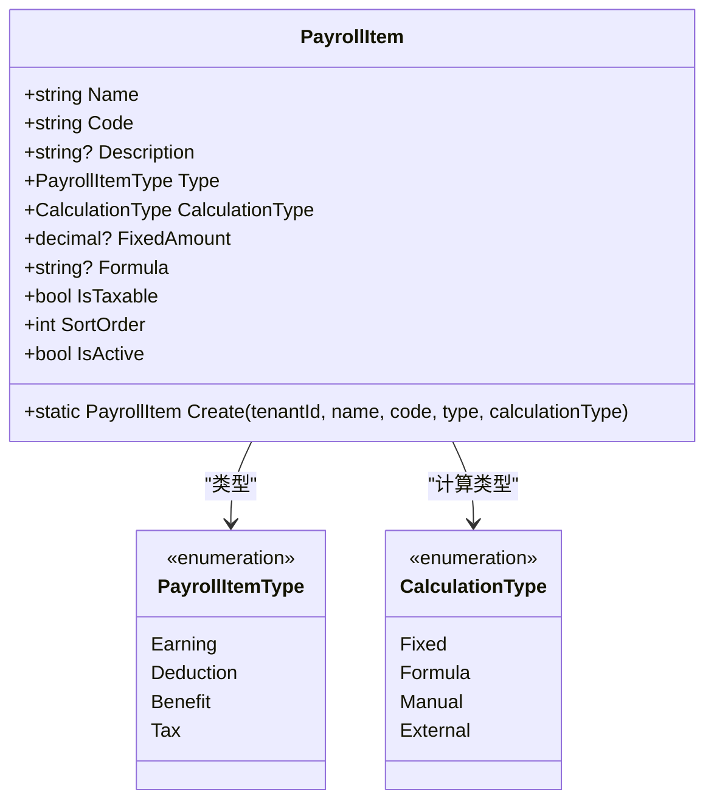
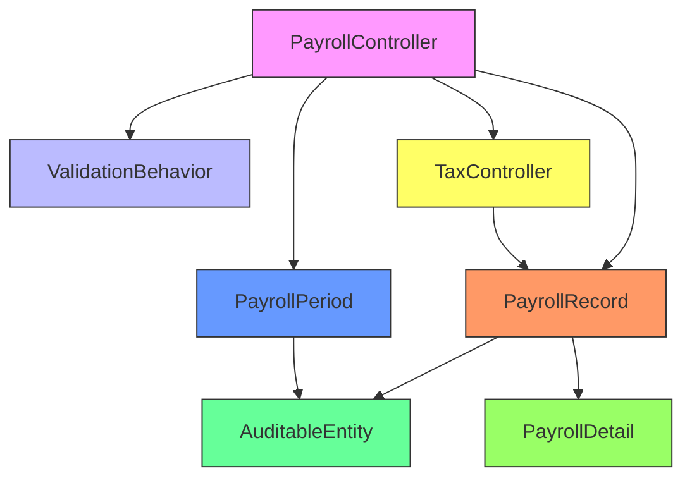
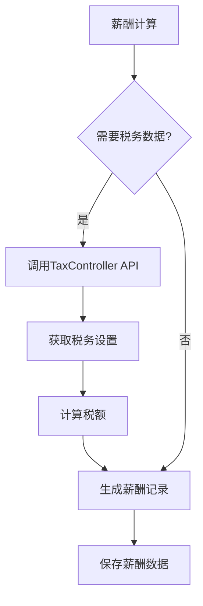

# 薪酬管理接口

<cite>
**本文档引用文件**  
- [PayrollController.cs](file://Backend/Hrevolve.Web/Controllers/PayrollController.cs)
- [PayrollPeriod.cs](file://Backend/Hrevolve.Domain/Payroll/PayrollPeriod.cs)
- [PayrollRecord.cs](file://Backend/Hrevolve.Domain/Payroll/PayrollRecord.cs)
- [ValidationBehavior.cs](file://Backend/Hrevolve.Application/Behaviors/ValidationBehavior.cs)
- [TaxController.cs](file://Backend/Hrevolve.Web/Controllers/TaxController.cs)
- [PayrollConfiguration.cs](file://Backend/Hrevolve.Infrastructure/Persistence/Configurations/PayrollConfiguration.cs)
- [AuditableEntity.cs](file://Backend/Hrevolve.Domain/Common/AuditableEntity.cs)
- [README.md](file://Backend/README.md)
</cite>

## 目录
1. [简介](#简介)
2. [项目结构](#项目结构)
3. [核心组件](#核心组件)
4. [架构概述](#架构概述)
5. [详细组件分析](#详细组件分析)
6. [依赖分析](#依赖分析)
7. [性能考虑](#性能考虑)
8. [故障排除指南](#故障排除指南)
9. [结论](#结论)

## 简介

本技术文档详细说明了Hrevolve人力资源管理系统中的薪酬管理API，涵盖薪资周期管理、薪酬记录生成、工资单发放等核心功能。系统采用领域驱动设计（DDD）和模块化单体架构，确保高内聚、低耦合的系统结构。薪酬管理模块支持多租户数据隔离、RBAC权限控制和敏感数据保护，满足企业级应用的安全性要求。

## 项目结构

薪酬管理功能分布在系统的多个层次中，遵循清晰的分层架构：

**图示来源**  
- [PayrollController.cs](file://Backend/Hrevolve.Web/Controllers/PayrollController.cs#L6-L114)
- [PayrollPeriod.cs](file://Backend/Hrevolve.Domain/Payroll/PayrollPeriod.cs#L8-L72)
- [PayrollRecord.cs](file://Backend/Hrevolve.Domain/Payroll/PayrollRecord.cs#L8-L124)
- [ValidationBehavior.cs](file://Backend/Hrevolve.Application/Behaviors/ValidationBehavior.cs#L8-L42)
- [PayrollConfiguration.cs](file://Backend/Hrevolve.Infrastructure/Persistence/Configurations/PayrollConfiguration.cs#L5-L147)

**本节来源**  
- [README.md](file://Backend/README.md#L20-L28)

## 核心组件

薪酬管理模块的核心组件包括薪资周期（PayrollPeriod）、薪资记录（PayrollRecord）和薪资明细（PayrollDetail）三个主要实体，以及相应的API控制器和数据访问配置。这些组件共同实现了完整的薪酬处理流程，从周期创建、计算到工资单发放。

**本节来源**  
- [PayrollPeriod.cs](file://Backend/Hrevolve.Domain/Payroll/PayrollPeriod.cs#L8-L72)
- [PayrollRecord.cs](file://Backend/Hrevolve.Domain/Payroll/PayrollRecord.cs#L8-L124)

## 架构概述

薪酬管理模块采用CQRS模式和领域驱动设计，各层职责分明：

**图示来源**  
- [PayrollController.cs](file://Backend/Hrevolve.Web/Controllers/PayrollController.cs#L6-L114)
- [PayrollRecord.cs](file://Backend/Hrevolve.Domain/Payroll/PayrollRecord.cs#L8-L124)
- [PayrollPeriod.cs](file://Backend/Hrevolve.Domain/Payroll/PayrollPeriod.cs#L8-L72)

## 详细组件分析

### 薪资周期管理

薪资周期（PayrollPeriod）是薪酬计算的基本时间单位，每个周期包含开始日期、结束日期和发薪日期。系统通过状态机管理周期的生命周期，确保数据一致性。

**图示来源**  
- [PayrollPeriod.cs](file://Backend/Hrevolve.Domain/Payroll/PayrollPeriod.cs#L8-L72)

**本节来源**  
- [PayrollPeriod.cs](file://Backend/Hrevolve.Domain/Payroll/PayrollPeriod.cs#L8-L72)
- [PayrollController.cs](file://Backend/Hrevolve.Web/Controllers/PayrollController.cs#L15-L23)

### 薪酬记录与计算

PayrollRecord实体是薪酬计算的核心，包含基本工资、津贴、扣款、税额等字段，并通过Calculate方法实现净收入计算逻辑。

**图示来源**  
- [PayrollRecord.cs](file://Backend/Hrevolve.Domain/Payroll/PayrollRecord.cs#L8-L124)

**本节来源**  
- [PayrollRecord.cs](file://Backend/Hrevolve.Domain/Payroll/PayrollRecord.cs#L8-L124)
- [PayrollController.cs](file://Backend/Hrevolve.Web/Controllers/PayrollController.cs#L41-L49)

### API端点与工作流

薪酬管理API提供了完整的RESTful接口，支持薪资周期管理和工资单查询。POST /api/payroll/process端点触发批量薪酬计算的后台作业启动机制。

**图示来源**  
- [PayrollController.cs](file://Backend/Hrevolve.Web/Controllers/PayrollController.cs#L15-L50)
- [ValidationBehavior.cs](file://Backend/Hrevolve.Application/Behaviors/ValidationBehavior.cs#L8-L42)

**本节来源**  
- [PayrollController.cs](file://Backend/Hrevolve.Web/Controllers/PayrollController.cs#L15-L50)
- [ValidationBehavior.cs](file://Backend/Hrevolve.Application/Behaviors/ValidationBehavior.cs#L8-L42)

### 薪资项配置

薪资项（PayrollItem）定义了薪酬计算的基本单元，支持固定金额、公式计算、手动输入和外部数据四种计算类型。

**图示来源**  
- [PayrollPeriod.cs](file://Backend/Hrevolve.Domain/Payroll/PayrollPeriod.cs#L85-L157)

**本节来源**  
- [PayrollPeriod.cs](file://Backend/Hrevolve.Domain/Payroll/PayrollPeriod.cs#L85-L157)

## 依赖分析

薪酬管理模块与其他系统组件存在明确的依赖关系，确保功能完整性和数据一致性。

**图示来源**  
- [PayrollController.cs](file://Backend/Hrevolve.Web/Controllers/PayrollController.cs#L6-L114)
- [PayrollRecord.cs](file://Backend/Hrevolve.Domain/Payroll/PayrollRecord.cs#L8-L124)
- [PayrollPeriod.cs](file://Backend/Hrevolve.Domain/Payroll/PayrollPeriod.cs#L8-L72)
- [AuditableEntity.cs](file://Backend/Hrevolve.Domain/Common/AuditableEntity.cs#L6-L47)
- [TaxController.cs](file://Backend/Hrevolve.Web/Controllers/TaxController.cs#L9-L114)

**本节来源**  
- [PayrollController.cs](file://Backend/Hrevolve.Web/Controllers/PayrollController.cs#L6-L114)
- [TaxController.cs](file://Backend/Hrevolve.Web/Controllers/TaxController.cs#L9-L114)

## 性能考虑

薪酬计算涉及大量数据处理，系统通过以下机制优化性能：
- 使用EF Core的Include和ThenInclude进行关联数据预加载
- 对关键查询字段（如TenantId, Year, Month）建立复合索引
- 采用异步编程模型避免线程阻塞
- 通过数据快照（DataSnapshot）减少重复计算

## 故障排除指南

### 数据验证问题

ValidationBehavior在薪酬处理前校验数据完整性，确保输入数据符合业务规则。如果验证失败，系统将返回400 Bad Request响应，并包含详细的错误信息。

**本节来源**  
- [ValidationBehavior.cs](file://Backend/Hrevolve.Application/Behaviors/ValidationBehavior.cs#L8-L42)

### 敏感数据保护

薪酬数据的敏感性通过以下措施得到保护：
- 字段级加密：敏感字段使用租户特定密钥进行加密存储
- 访问审计：所有薪酬数据访问操作记录到审计日志
- RBAC权限控制：基于角色的访问控制确保只有授权用户可访问
- 多租户隔离：通过TenantId实现数据逻辑隔离

**本节来源**  
- [AuditableEntity.cs](file://Backend/Hrevolve.Domain/Common/AuditableEntity.cs#L6-L47)
- [README.md](file://Backend/README.md#L151-L152)

### 税务集成

薪酬模块与税务模块通过API接口集成，共享员工税务档案和报税记录。TaxController提供获取税务设置和报税记录的接口，支持薪酬计算中的税额计算。

**图示来源**  
- [TaxController.cs](file://Backend/Hrevolve.Web/Controllers/TaxController.cs#L9-L114)

**本节来源**  
- [TaxController.cs](file://Backend/Hrevolve.Web/Controllers/TaxController.cs#L9-L114)
- [PayrollRecord.cs](file://Backend/Hrevolve.Domain/Payroll/PayrollRecord.cs#L37-L38)

## 结论

Hrevolve薪酬管理API提供了一套完整的薪酬处理解决方案，支持薪资周期管理、薪酬计算、工资单发放等核心功能。系统采用现代化的架构设计，确保了可维护性、安全性和性能。通过领域驱动设计和CQRS模式，系统实现了业务逻辑的清晰分离和高效处理。未来可进一步完善薪酬计算规则引擎和RAG知识库集成，提升系统的智能化水平。