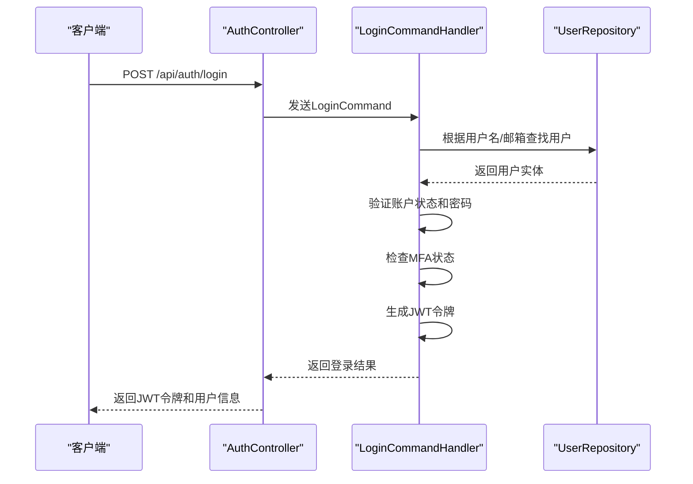
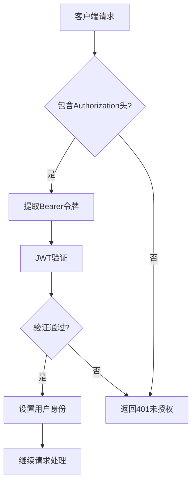
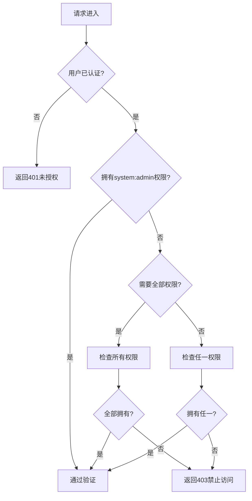
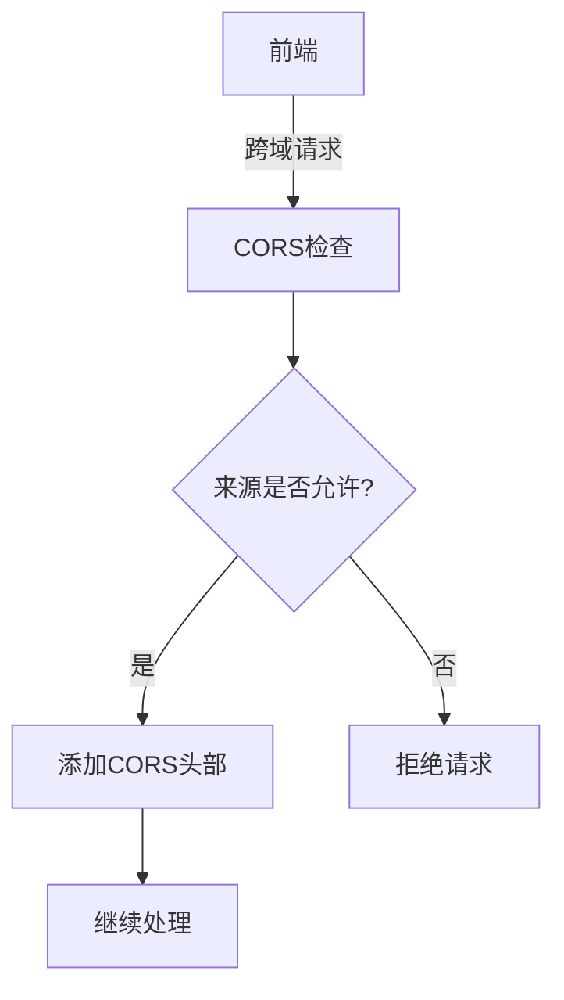

# 认证接口

<cite>
**本文档引用的文件**
- [AuthController.cs](file://Backend/Hrevolve.Web/Controllers/AuthController.cs)
- [LoginCommand.cs](file://Backend/Hrevolve.Application/Identity/Commands/LoginCommand.cs)
- [RequirePermissionAttribute.cs](file://Backend/Hrevolve.Web/Filters/RequirePermissionAttribute.cs)
- [Program.cs](file://Backend/Hrevolve.Web/Program.cs)
- [appsettings.json](file://Backend/Hrevolve.Web/appsettings.json)
- [User.cs](file://Backend/Hrevolve.Domain/Identity/User.cs)
- [ICurrentUser.cs](file://Backend/Hrevolve.Shared/Identity/ICurrentUser.cs)
- [auth.ts](file://Frontend/hrevolve-web/src/stores/auth.ts)
- [LoginView.vue](file://Frontend/hrevolve-web/src/views/auth/LoginView.vue)
</cite>

## 目录
1. [简介](#简介)
2. [认证端点](#认证端点)
3. [JWT令牌机制](#jwt令牌机制)
4. [权限控制](#权限控制)
5. [前端集成](#前端集成)
6. [OAuth 2.0/SSO集成](#oauth-20sso集成)
7. [错误处理](#错误处理)
8. [CORS策略](#cors策略)
9. [代码示例](#代码示例)

## 简介
Hrevolve系统提供了一套完整的身份验证和授权机制，支持多租户架构下的用户认证。系统采用JWT（JSON Web Token）作为主要的认证方式，结合刷新令牌机制确保安全性。认证API支持标准的用户名密码登录、多因素认证（MFA）、令牌刷新和登出功能。系统还集成了OAuth 2.0/SSO支持，允许与外部身份提供商（如Azure AD）对接。

**Section sources**
- [AuthController.cs](file://Backend/Hrevolve.Web/Controllers/AuthController.cs#L1-L83)
- [LoginCommand.cs](file://Backend/Hrevolve.Application/Identity/Commands/LoginCommand.cs#L1-L169)

## 认证端点
Hrevolve认证API提供以下主要端点：

### 登录端点 (POST /api/auth/login)
这是主要的认证入口，用于用户名密码登录。

**请求体结构：**
- `username` (string, 必需): 用户名或邮箱
- `password` (string, 必需): 密码
- `tenantCode` (string, 可选): 租户代码
- `deviceId` (string, 可选): 设备ID（用于MFA信任设备判断）
- `ipAddress` (string, 服务器自动补充): 客户端IP地址

**响应结构：**
```json
{
  "accessToken": "jwt-token-string",
  "refreshToken": "refresh-token-string",
  "expiresAt": "2024-01-01T00:00:00Z",
  "userId": "guid",
  "userName": "string",
  "requiresMfa": false
}
```

当用户启用了MFA且当前设备不受信任时，`requiresMfa`将返回`true`，`accessToken`和`refreshToken`为空字符串，客户端需要引导用户完成MFA验证。

### 刷新令牌端点 (POST /api/auth/refresh)
用于使用刷新令牌获取新的访问令牌。

**请求体结构：**
```json
{
  "refreshToken": "refresh-token-string"
}
```

### 登出端点 (POST /api/auth/logout)
使当前用户的令牌失效（目前为占位实现）。

### 获取当前用户信息端点 (GET /api/auth/me)
返回当前认证用户的基本信息和权限。

**响应结构：**
```json
{
  "userId": "guid",
  "tenantId": "guid",
  "username": "string",
  "email": "string",
  "employeeId": "guid",
  "permissions": ["string"]
}
```



**Diagram sources**
- [AuthController.cs](file://Backend/Hrevolve.Web/Controllers/AuthController.cs#L15-L32)
- [LoginCommand.cs](file://Backend/Hrevolve.Application/Identity/Commands/LoginCommand.cs#L51-L118)

**Section sources**
- [AuthController.cs](file://Backend/Hrevolve.Web/Controllers/AuthController.cs#L14-L54)
- [LoginCommand.cs](file://Backend/Hrevolve.Application/Identity/Commands/LoginCommand.cs#L19-L169)

## JWT令牌机制
Hrevolve系统使用JWT作为主要的认证令牌，具有以下特点：

### 令牌格式
JWT令牌包含以下声明（claims）：

- `sub`: 用户ID (GUID)
- `email`: 用户邮箱
- `jti`: JWT ID (唯一标识符)
- `tenant_id`: 租户ID (GUID)
- `username`: 用户名
- `employee_id`: 员工ID (如果关联)
- `permission`: 权限声明（可重复）

### 令牌配置
从`appsettings.json`文件中读取JWT配置：

```json
"Jwt": {
  "Key": "your-256-bit-secret-key-here-must-be-at-least-32-characters",
  "Issuer": "https://hrevolve.local",
  "Audience": "https://hrevolve.local"
}
```

### 令牌有效期
- 访问令牌（Access Token）有效期：2小时
- 刷新令牌（Refresh Token）目前为Base64编码的GUID，实际项目中应存储在数据库并设置过期时间

### 令牌验证
在`Program.cs`中配置了JWT Bearer认证：



**Diagram sources**
- [Program.cs](file://Backend/Hrevolve.Web/Program.cs#L70-L86)
- [LoginCommand.cs](file://Backend/Hrevolve.Application/Identity/Commands/LoginCommand.cs#L128-L161)

**Section sources**
- [Program.cs](file://Backend/Hrevolve.Web/Program.cs#L70-L86)
- [appsettings.json](file://Backend/Hrevolve.Web/appsettings.json#L6-L10)
- [LoginCommand.cs](file://Backend/Hrevolve.Application/Identity/Commands/LoginCommand.cs#L128-L161)

## 权限控制
Hrevolve系统提供细粒度的权限控制机制，通过`RequirePermissionAttribute`实现。

### RequirePermissionAttribute
这是一个自定义的授权过滤器，用于保护API端点。

**使用方式：**
```csharp
// 需要任一权限
[RequirePermission("employee:read", "employee:write")]
public IActionResult GetEmployees() { }

// 需要所有权限
[RequirePermission(true, "employee:read", "employee:write")]
public IActionResult UpdateEmployee() { }
```

**处理逻辑：**
1. 检查用户是否已认证
2. 系统管理员（拥有`system:admin`权限）自动通过
3. 根据`requireAll`参数判断是否需要全部权限
4. 验证用户是否具有所需权限



**Diagram sources**
- [RequirePermissionAttribute.cs](file://Backend/Hrevolve.Web/Filters/RequirePermissionAttribute.cs#L33-L77)

**Section sources**
- [RequirePermissionAttribute.cs](file://Backend/Hrevolve.Web/Filters/RequirePermissionAttribute.cs#L6-L79)
- [ICurrentUser.cs](file://Backend/Hrevolve.Shared/Identity/ICurrentUser.cs#L49-L56)

## 前端集成
前端使用Pinia状态管理来处理认证状态。

### 认证状态管理
`auth.ts` store管理以下状态：
- `token`: 访问令牌
- `refreshToken`: 刷新令牌
- `user`: 当前用户信息
- `tenantId`: 租户ID
- `isAuthenticated`: 认证状态

### 主要方法
- `login()`: 执行登录，存储令牌和用户信息
- `fetchUser()`: 获取当前用户信息
- `refreshAccessToken()`: 刷新访问令牌
- `logout()`: 清除认证状态

### 登录界面
`LoginView.vue`提供了用户友好的登录界面，包含：
- 用户名和密码输入框
- 记住我选项
- 社交登录按钮（Google、Microsoft、微信、WhatsApp）
- 忘记密码链接

**Section sources**
- [auth.ts](file://Frontend/hrevolve-web/src/stores/auth.ts#L1-L119)
- [auth.ts](file://Frontend/hrevolve-web/src/api/modules/auth.ts#L1-L31)
- [LoginView.vue](file://Frontend/hrevolve-web/src/views/auth/LoginView.vue#L1-L762)

## OAuth 2.0/SSO集成
系统支持与外部身份提供商的集成。

### 外部登录实体
`User.cs`中的`ExternalLogin`实体存储外部登录信息：
- `Provider`: 提供商名称（Google、Microsoft、WeChat、WhatsApp）
- `ProviderKey`: 外部系统中的用户唯一标识

### 集成路径
1. 前端点击社交登录按钮
2. 重定向到`/api/auth/external/{provider}`
3. 后端处理OAuth流程
4. 创建或关联用户账户
5. 返回JWT令牌

目前社交登录功能正在开发中，前端已预留接口。

**Section sources**
- [User.cs](file://Backend/Hrevolve.Domain/Identity/User.cs#L150-L168)
- [LoginView.vue](file://Frontend/hrevolve-web/src/views/auth/LoginView.vue#L58-L69)

## 错误处理
系统定义了标准化的错误响应格式。

### 常见错误码
| 错误码 | HTTP状态码 | 含义 | 处理建议 |
|--------|-----------|------|----------|
| INVALID_CREDENTIALS | 401 | 凭证无效 | 提示用户检查用户名密码 |
| ACCOUNT_LOCKED | 401 | 账户被锁定 | 提示用户稍后重试或联系管理员 |
| ACCOUNT_DISABLED | 401 | 账户被禁用 | 提示用户联系管理员 |
| UNAUTHORIZED | 401 | 未授权访问 | 重定向到登录页面 |
| FORBIDDEN | 403 | 权限不足 | 提示用户无权访问该资源 |
| TOO_MANY_REQUESTS | 429 | 请求过于频繁 | 实现指数退避重试 |

### 错误响应格式
```json
{
  "code": "ERROR_CODE",
  "message": "错误描述"
}
```

**Section sources**
- [LoginCommand.cs](file://Backend/Hrevolve.Application/Identity/Commands/LoginCommand.cs#L59-L78)
- [RequirePermissionAttribute.cs](file://Backend/Hrevolve.Web/Filters/RequirePermissionAttribute.cs#L40-L44)
- [RequirePermissionAttribute.cs](file://Backend/Hrevolve.Web/Filters/RequirePermissionAttribute.cs#L69-L76)

## CORS策略
系统配置了CORS策略以支持前端跨域请求。

### 策略配置
在`Program.cs`中配置了名为"AllowAll"的CORS策略：
- 允许任何来源
- 允许任何方法
- 允许任何头部

### 开发环境配置
开发环境下，前端通过代理或CORS配置与后端通信。生产环境建议使用反向代理或精确的CORS策略。



**Diagram sources**
- [Program.cs](file://Backend/Hrevolve.Web/Program.cs#L91-L98)
- [Program.cs](file://Backend/Hrevolve.Web/Program.cs#L132)

**Section sources**
- [Program.cs](file://Backend/Hrevolve.Web/Program.cs#L90-L99)

## 代码示例
### C# HttpClient调用示例
```csharp
var client = new HttpClient();
client.DefaultRequestHeaders.Authorization = new AuthenticationHeaderValue("Bearer", token);

var response = await client.GetAsync("https://api.hrevolve.local/api/employees");
if (response.IsSuccessStatusCode)
{
    var employees = await response.Content.ReadFromJsonAsync<List<Employee>>();
}
```

### Axios调用示例
```javascript
import axios from 'axios';

const api = axios.create({
  baseURL: '/api',
  headers: {
    'Authorization': `Bearer ${localStorage.getItem('token')}`
  }
});

api.interceptors.response.use(
  response => response,
  async error => {
    if (error.response?.status === 401) {
      // 尝试刷新令牌
      const refreshed = await refreshAccessToken();
      if (refreshed) {
        error.config.headers.Authorization = `Bearer ${newToken}`;
        return api(error.config);
      }
      // 刷新失败，重定向到登录
      window.location.href = '/login';
    }
    return Promise.reject(error);
  }
);
```

**Section sources**
- [auth.ts](file://Frontend/hrevolve-web/src/stores/auth.ts#L70-L85)
- [Program.cs](file://Backend/Hrevolve.Web/Program.cs#L146-L147)