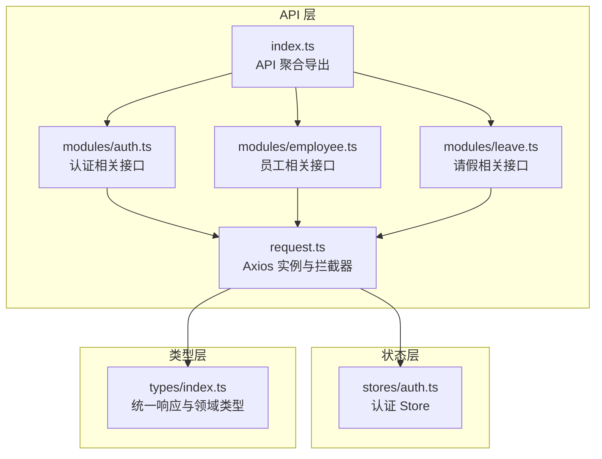
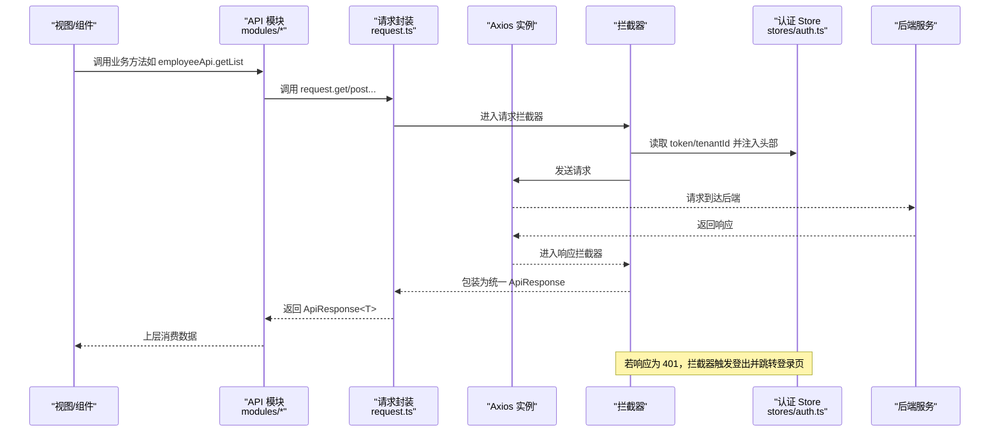
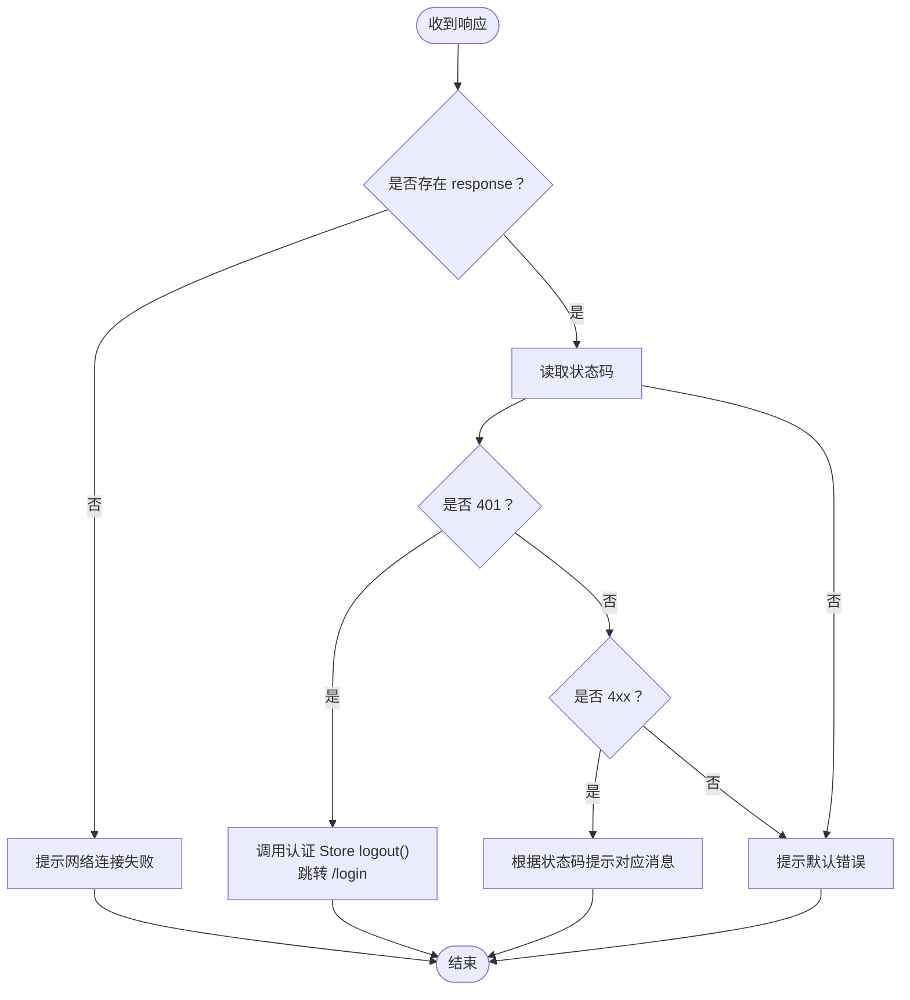
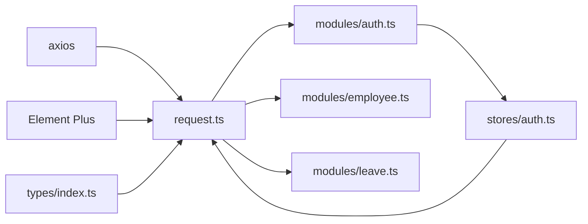

# API客户端

<cite>
**本文引用的文件**
- [request.ts](file://Frontend/hrevolve-web/src/api/request.ts)
- [index.ts](file://Frontend/hrevolve-web/src/api/index.ts)
- [auth.ts](file://Frontend/hrevolve-web/src/api/modules/auth.ts)
- [employee.ts](file://Frontend/hrevolve-web/src/api/modules/employee.ts)
- [leave.ts](file://Frontend/hrevolve-web/src/api/modules/leave.ts)
- [auth.ts](file://Frontend/hrevolve-web/src/stores/auth.ts)
- [index.ts](file://Frontend/hrevolve-web/src/types/index.ts)
- [main.ts](file://Frontend/hrevolve-web/src/main.ts)
- [package.json](file://Frontend/hrevolve-web/package.json)
</cite>

## 目录
1. [简介](#简介)
2. [项目结构](#项目结构)
3. [核心组件](#核心组件)
4. [架构总览](#架构总览)
5. [详细组件分析](#详细组件分析)
6. [依赖关系分析](#依赖关系分析)
7. [性能考虑](#性能考虑)
8. [故障排查指南](#故障排查指南)
9. [结论](#结论)
10. [附录](#附录)

## 简介
本文件面向前端开发者，系统性梳理 Hrevolve Web 前端的 API 客户端设计与实现，重点覆盖：
- 基于 Axios 的请求封装与拦截器机制（自动注入 JWT 头、统一响应包装、错误码全局处理）
- API 模块聚合与业务模块划分（auth、employee、leave 等）
- GET/POST 请求示例路径（参数序列化、文件上传、超时设置等）
- 错误码（如 401 未授权）的全局处理逻辑与与 Pinia 认证 Store 的联动
- 类型安全（TypeScript 泛型）与 Mock 数据调试技巧

## 项目结构
前端 API 客户端位于 Frontend/hrevolve-web/src/api 下，采用“请求封装 + 模块聚合 + 业务模块”的分层组织方式：
- request.ts：Axios 实例创建、请求/响应拦截器、统一方法封装
- modules/*：按领域拆分的业务 API 模块（如 auth、employee、leave）
- index.ts：对外统一导出 API 模块与 request 实例
- stores/auth.ts：认证状态与 Token 生命周期管理
- types/index.ts：统一的 API 响应结构与领域模型类型

图表来源
- [request.ts](file://Frontend/hrevolve-web/src/api/request.ts#L1-L107)
- [index.ts](file://Frontend/hrevolve-web/src/api/index.ts#L1-L19)
- [auth.ts](file://Frontend/hrevolve-web/src/api/modules/auth.ts#L1-L31)
- [employee.ts](file://Frontend/hrevolve-web/src/api/modules/employee.ts#L1-L51)
- [leave.ts](file://Frontend/hrevolve-web/src/api/modules/leave.ts#L1-L51)
- [auth.ts](file://Frontend/hrevolve-web/src/stores/auth.ts#L1-L119)
- [index.ts](file://Frontend/hrevolve-web/src/types/index.ts#L1-L70)

章节来源
- [request.ts](file://Frontend/hrevolve-web/src/api/request.ts#L1-L107)
- [index.ts](file://Frontend/hrevolve-web/src/api/index.ts#L1-L19)

## 核心组件
- Axios 实例与拦截器
  - 基础配置：baseURL、timeout、默认 Content-Type
  - 请求拦截器：从 Pinia Store 中读取 token 和 tenantId，并注入到 Authorization 与 X-Tenant-Id 头部
  - 响应拦截器：将后端原始响应包装为统一 ApiResponse 结构；对常见 HTTP 状态码进行统一提示与处理（如 401 自动登出）
- 统一请求方法
  - get/post/put/delete/patch：均以泛型约束返回值类型，最终返回统一 ApiResponse<T>
- API 模块聚合
  - index.ts 对外导出各业务模块与 request 实例，便于上层组件按需导入
- 认证 Store
  - stores/auth.ts 管理 token、refreshToken、tenantId、用户信息与权限；在登录、刷新 Token、退出登录时持久化到 localStorage，并与 API 层协同工作

章节来源
- [request.ts](file://Frontend/hrevolve-web/src/api/request.ts#L1-L107)
- [index.ts](file://Frontend/hrevolve-web/src/api/index.ts#L1-L19)
- [auth.ts](file://Frontend/hrevolve-web/src/stores/auth.ts#L1-L119)
- [index.ts](file://Frontend/hrevolve-web/src/types/index.ts#L1-L70)

## 架构总览
下图展示从前端调用到后端服务的整体链路，以及错误码与认证 Store 的联动：

图表来源
- [request.ts](file://Frontend/hrevolve-web/src/api/request.ts#L1-L107)
- [auth.ts](file://Frontend/hrevolve-web/src/stores/auth.ts#L1-L119)
- [employee.ts](file://Frontend/hrevolve-web/src/api/modules/employee.ts#L1-L51)
- [leave.ts](file://Frontend/hrevolve-web/src/api/modules/leave.ts#L1-L51)

## 详细组件分析

### 请求封装与拦截器（request.ts）
- Axios 实例
  - baseURL 默认读取环境变量 VITE_API_BASE_URL，未设置时回退为 /api
  - timeout 设置为 30000ms
  - 默认 Content-Type 为 application/json
- 请求拦截器
  - 自动注入 Authorization: Bearer <token>
  - 当 tenantId 存在且非空时，注入 X-Tenant-Id 头部
  - 异常时打印错误并拒绝 Promise
- 响应拦截器
  - 将后端原始响应体包装为统一 ApiResponse 结构（success、data、message）
  - 对常见状态码进行统一提示与处理：
    - 401：弹出“登录已过期，请重新登录”，调用认证 Store 的 logout，并跳转到 /login
    - 403/404/500：分别提示“没有权限访问该资源”、“请求的资源不存在”、“服务器内部错误”
    - 其他：优先显示后端返回的 message，否则提示“请求失败”
  - 无 response（网络异常）时提示“网络连接失败，请检查网络”
- 统一请求方法
  - get/post/put/delete/patch：均返回 Promise<ApiResponse<T>>
  - 内部通过 service.get/post... 调用后，再将结果 res.data 返回给调用方

章节来源
- [request.ts](file://Frontend/hrevolve-web/src/api/request.ts#L1-L107)

### API 模块聚合（index.ts）
- 对外导出各业务模块（auth、employee、organization、leave、attendance、payroll、agent、localization、company、schedule、expense、insurance、tax、settings）
- 同时导出 request 实例，便于上层直接使用底层封装

章节来源
- [index.ts](file://Frontend/hrevolve-web/src/api/index.ts#L1-L19)

### 认证模块（modules/auth.ts）
- 提供登录、刷新 Token、获取当前用户、退出登录、修改密码等接口
- 所有方法均通过 request.post/get 等统一方法发起请求，并返回 ApiResponse<T>
- 与认证 Store 协作：登录成功后写入 token/refreshToken 并拉取用户信息；刷新失败则自动登出

章节来源
- [auth.ts](file://Frontend/hrevolve-web/src/api/modules/auth.ts#L1-L31)
- [auth.ts](file://Frontend/hrevolve-web/src/stores/auth.ts#L1-L119)

### 员工模块（modules/employee.ts）
- 支持员工列表查询、详情查询、历史时点数据查询、创建/更新/删除、职位历史、调岗/调薪、离职等
- 参数通过 params 序列化传入 GET 请求，POST/PUT 通过 data 传入
- 返回类型均为 ApiResponse<T>，其中 T 由 TypeScript 泛型推断

章节来源
- [employee.ts](file://Frontend/hrevolve-web/src/api/modules/employee.ts#L1-L51)

### 请假模块（modules/leave.ts）
- 支持假期类型、余额、申请列表、我的申请、待审批、提交/取消/审批等
- 分页参数通过 params 传递，支持 status、employeeId 等筛选
- 返回类型均为 ApiResponse<T>，泛型约束具体实体类型

章节来源
- [leave.ts](file://Frontend/hrevolve-web/src/api/modules/leave.ts#L1-L51)

### 认证 Store（stores/auth.ts）
- 状态：token、refreshToken、user、tenantId
- 计算属性：isAuthenticated、userRoles、userPermissions
- 方法：login、fetchUser、refreshAccessToken、logout
- 与 API 层协作：登录成功后持久化 token/refreshToken；刷新 Token 成功后更新本地状态；异常时自动登出

章节来源
- [auth.ts](file://Frontend/hrevolve-web/src/stores/auth.ts#L1-L119)

### 类型系统（types/index.ts）
- 统一响应结构：ApiResponse<T>，包含 success、data、message、errors
- 分页类型：PageRequest、PageResponse<T>
- 业务类型：User、LoginRequest、LoginResponse、Employee、LeaveRequest、LeaveBalance、LeaveType 等

章节来源
- [index.ts](file://Frontend/hrevolve-web/src/types/index.ts#L1-L70)

### 使用示例（路径指引）
以下为常见场景的调用路径（不直接展示代码内容）：
- GET 列表与参数序列化
  - 员工列表：参见 [employee.ts](file://Frontend/hrevolve-web/src/api/modules/employee.ts#L7-L9)
  - 请假申请列表：参见 [leave.ts](file://Frontend/hrevolve-web/src/api/modules/leave.ts#L22-L24)
- POST 提交与表单数据
  - 登录：参见 [auth.ts](file://Frontend/hrevolve-web/src/api/modules/auth.ts#L7-L9)
  - 提交请假申请：参见 [leave.ts](file://Frontend/hrevolve-web/src/api/modules/leave.ts#L37-L39)
- PUT/DELETE 更新与删除
  - 更新员工：参见 [employee.ts](file://Frontend/hrevolve-web/src/api/modules/employee.ts#L27-L29)
  - 删除员工：参见 [employee.ts](file://Frontend/hrevolve-web/src/api/modules/employee.ts#L32-L34)
- 文件上传（multipart/form-data）
  - 在调用 request.post 时，通过 AxiosRequestConfig.headers 设置 Content-Type 为 multipart/form-data，并将文件作为 FormData.append(...) 的值传入 data 字段
  - 示例路径参考：[request.ts](file://Frontend/hrevolve-web/src/api/request.ts#L84-L104)
- 超时设置
  - 在调用 request.get/post/put/delete/patch 时，通过第三个参数 AxiosRequestConfig 指定 timeout（单位 ms）

章节来源
- [employee.ts](file://Frontend/hrevolve-web/src/api/modules/employee.ts#L1-L51)
- [leave.ts](file://Frontend/hrevolve-web/src/api/modules/leave.ts#L1-L51)
- [auth.ts](file://Frontend/hrevolve-web/src/api/modules/auth.ts#L1-L31)
- [request.ts](file://Frontend/hrevolve-web/src/api/request.ts#L84-L104)

### 错误码与全局处理（401 未授权）
- 401 未授权
  - 响应拦截器检测到 401 时，弹出提示“登录已过期，请重新登录”，调用认证 Store 的 logout 清除本地状态，并跳转到 /login
- 其他错误
  - 403：没有权限访问该资源
  - 404：请求的资源不存在
  - 500：服务器内部错误
  - 其他：优先显示后端 message，否则“请求失败”
  - 网络异常：提示“网络连接失败，请检查网络”

图表来源
- [request.ts](file://Frontend/hrevolve-web/src/api/request.ts#L38-L81)
- [auth.ts](file://Frontend/hrevolve-web/src/stores/auth.ts#L89-L98)

章节来源
- [request.ts](file://Frontend/hrevolve-web/src/api/request.ts#L38-L81)
- [auth.ts](file://Frontend/hrevolve-web/src/stores/auth.ts#L89-L98)

### 类型安全与 Mock 调试
- 类型安全
  - 使用 ApiResponse<T> 保证所有接口返回结构一致
  - 业务实体类型集中在 types/index.ts，避免重复定义
  - 泛型约束确保调用方能获得强类型返回值
- Mock 调试
  - 在开发环境可使用浏览器插件或本地代理工具模拟后端响应，验证拦截器与错误处理逻辑
  - 通过在 request.ts 中临时禁用拦截器或修改 baseURL，快速切换真实/Mock 环境

章节来源
- [index.ts](file://Frontend/hrevolve-web/src/types/index.ts#L1-L70)
- [request.ts](file://Frontend/hrevolve-web/src/api/request.ts#L1-L107)

## 依赖关系分析
- request.ts 依赖
  - axios：HTTP 客户端
  - Element Plus：消息提示（ElMessage）
  - stores/auth.ts：认证状态（token、tenantId）
  - types/index.ts：统一响应结构 ApiResponse<T>
- API 模块依赖
  - modules/* 依赖 request.ts
  - modules/auth.ts 依赖 stores/auth.ts
- 运行时依赖
  - Vue 3、Pinia、Element Plus、Axios 等

图表来源
- [request.ts](file://Frontend/hrevolve-web/src/api/request.ts#L1-L107)
- [auth.ts](file://Frontend/hrevolve-web/src/stores/auth.ts#L1-L119)
- [index.ts](file://Frontend/hrevolve-web/src/types/index.ts#L1-L70)
- [auth.ts](file://Frontend/hrevolve-web/src/api/modules/auth.ts#L1-L31)
- [employee.ts](file://Frontend/hrevolve-web/src/api/modules/employee.ts#L1-L51)
- [leave.ts](file://Frontend/hrevolve-web/src/api/modules/leave.ts#L1-L51)

章节来源
- [request.ts](file://Frontend/hrevolve-web/src/api/request.ts#L1-L107)
- [package.json](file://Frontend/hrevolve-web/package.json#L1-L38)

## 性能考虑
- 超时设置：默认 30000ms，可根据接口特性在调用处调整
- 请求头复用：Authorization 与 X-Tenant-Id 由拦截器统一注入，减少重复代码
- 统一响应包装：便于前端缓存与错误处理策略收敛
- 分页参数：通过 params 传递，避免大体积 JSON 传输

## 故障排查指南
- 401 未授权
  - 现象：弹出“登录已过期，请重新登录”，自动跳转 /login
  - 排查：确认 token 是否存在且未过期；检查 stores/auth.ts 的 refreshAccessToken 流程
- 403/404/500
  - 现象：对应提示消息
  - 排查：查看后端返回 message；确认权限与资源是否存在
- 网络异常
  - 现象：提示“网络连接失败，请检查网络”
  - 排查：检查 VITE_API_BASE_URL 配置、代理设置、防火墙
- 参数序列化问题
  - 现象：后端接收不到分页参数
  - 排查：确认调用 request.get 时通过 config.params 传参
- 文件上传失败
  - 现象：后端无法解析 multipart/form-data
  - 排查：确认 AxiosRequestConfig.headers 中 Content-Type 为 multipart/form-data，并将文件作为 FormData.append(...) 的值传入 data

章节来源
- [request.ts](file://Frontend/hrevolve-web/src/api/request.ts#L38-L81)
- [auth.ts](file://Frontend/hrevolve-web/src/stores/auth.ts#L69-L98)

## 结论
本前端 API 客户端通过 Axios 封装与拦截器实现了：
- 统一的请求/响应处理与错误码全局处理
- 明确的业务模块划分与类型安全
- 与认证 Store 的紧密联动，保障 Token 生命周期与多租户上下文
建议在实际开发中：
- 严格使用 ApiResponse<T> 与领域类型
- 在调用处合理设置超时与重试策略
- 使用 Mock 工具快速验证拦截器与错误处理链路

## 附录
- 环境变量
  - VITE_API_BASE_URL：后端基础地址，默认 /api
- 依赖版本
  - axios、pinia、element-plus、vue 等

章节来源
- [request.ts](file://Frontend/hrevolve-web/src/api/request.ts#L7-L13)
- [package.json](file://Frontend/hrevolve-web/package.json#L1-L38)