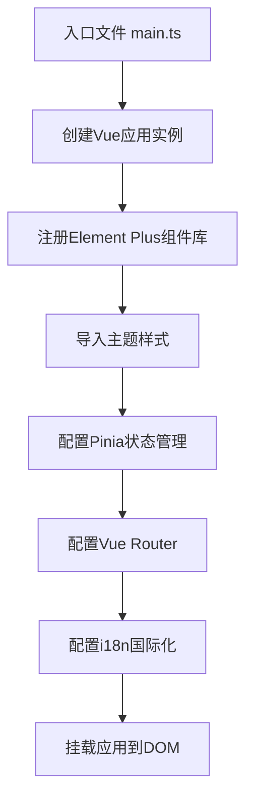
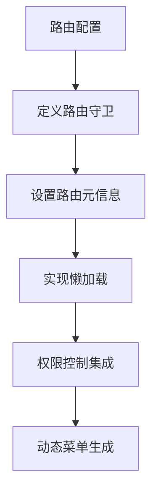
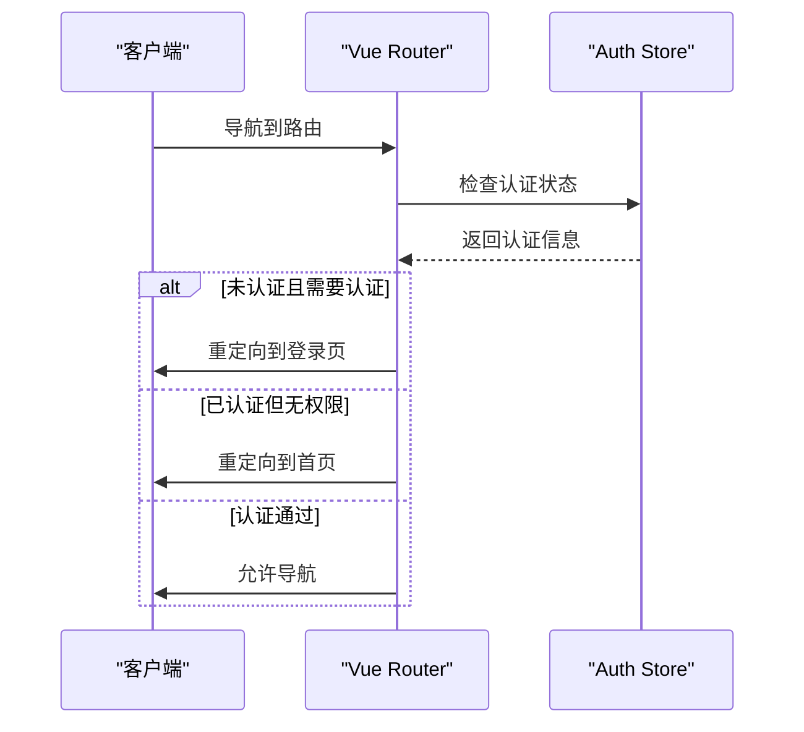
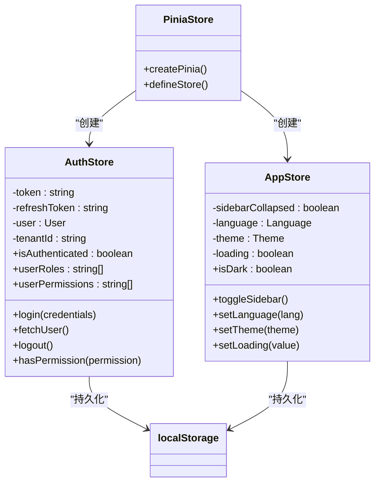
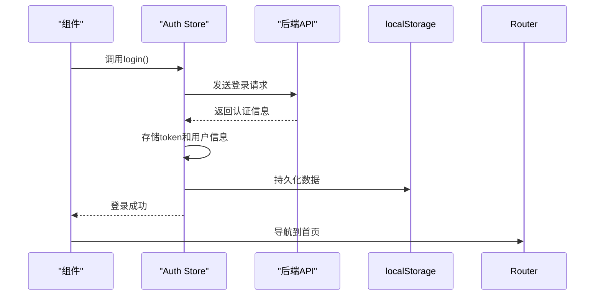
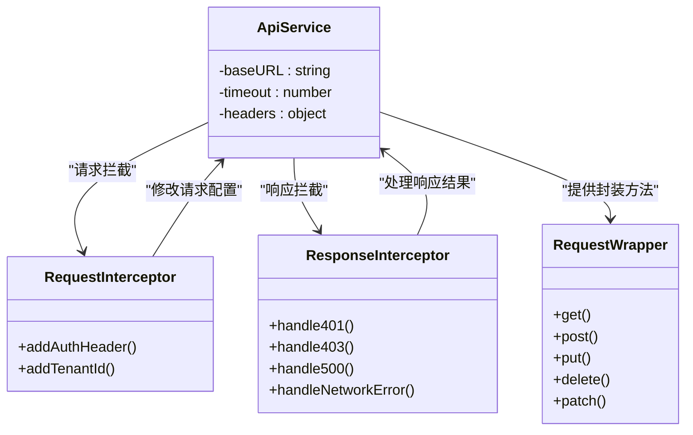
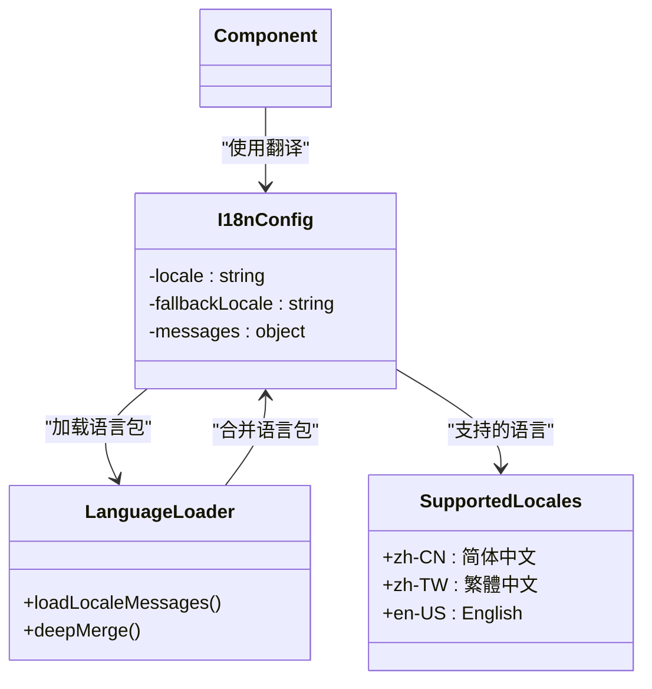

# 前端架构

<cite>
**本文档引用文件**  
- [main.ts](file://Frontend/hrevolve-web/src/main.ts)
- [App.vue](file://Frontend/hrevolve-web/src/App.vue)
- [vite.config.ts](file://Frontend/hrevolve-web/vite.config.ts)
- [router/index.ts](file://Frontend/hrevolve-web/src/router/index.ts)
- [stores/index.ts](file://Frontend/hrevolve-web/src/stores/index.ts)
- [stores/auth.ts](file://Frontend/hrevolve-web/src/stores/auth.ts)
- [stores/app.ts](file://Frontend/hrevolve-web/src/stores/app.ts)
- [api/request.ts](file://Frontend/hrevolve-web/src/api/request.ts)
- [api/index.ts](file://Frontend/hrevolve-web/src/api/index.ts)
- [api/modules/auth.ts](file://Frontend/hrevolve-web/src/api/modules/auth.ts)
- [i18n/index.ts](file://Frontend/hrevolve-web/src/i18n/index.ts)
- [layouts/MainLayout.vue](file://Frontend/hrevolve-web/src/layouts/MainLayout.vue)
- [views/auth/LoginView.vue](file://Frontend/hrevolve-web/src/views/auth/LoginView.vue)
- [types/index.ts](file://Frontend/hrevolve-web/src/types/index.ts)
</cite>

## 目录
1. [项目结构](#项目结构)
2. [应用初始化流程](#应用初始化流程)
3. [Vue Router路由配置](#vue-router路由配置)
4. [Pinia状态管理](#pinia状态管理)
5. [API请求封装](#api请求封装)
6. [组件化设计与UI集成](#组件化设计与ui集成)
7. [国际化配置](#国际化配置)
8. [性能优化实践](#性能优化实践)

## 项目结构

Hrevolve前端项目采用模块化架构设计，主要目录结构如下：

```
Frontend/hrevolve-web/
├── src/
│   ├── api/              # API接口模块
│   ├── components/       # 公共组件
│   ├── i18n/             # 国际化配置
│   ├── layouts/          # 布局组件
│   ├── router/           # 路由配置
│   ├── stores/           # Pinia状态管理
│   ├── styles/           # 样式文件
│   ├── types/            # TypeScript类型定义
│   ├── views/            # 页面视图组件
│   ├── App.vue           # 根组件
│   └── main.ts           # 应用入口
├── vite.config.ts        # Vite构建配置
└── package.json          # 项目依赖
```

项目基于Vue 3组合式API和Vite构建系统，采用TypeScript进行类型安全开发，集成Element Plus作为UI组件库。

**文档来源**
- [main.ts](file://Frontend/hrevolve-web/src/main.ts)
- [vite.config.ts](file://Frontend/hrevolve-web/vite.config.ts)

## 应用初始化流程

应用初始化从`main.ts`文件开始，通过Vue 3的`createApp`函数创建应用实例，并依次注册核心插件和配置。



初始化流程详细步骤：
1. 导入Vue核心功能和Element Plus组件库
2. 导入根组件App.vue和路由、状态管理、国际化等核心模块
3. 导入并应用Element Plus的暗色主题和自定义样式
4. 创建Vue应用实例
5. 注册Element Plus图标组件
6. 依次使用Pinia、Router、i18n和Element Plus插件
7. 挂载应用到DOM元素

**文档来源**
- [main.ts](file://Frontend/hrevolve-web/src/main.ts#L1-L28)

## Vue Router路由配置

Vue Router采用声明式路由配置，支持懒加载和权限控制。路由配置定义在`router/index.ts`文件中，通过`createRouter`和`createWebHistory`创建路由实例。



### 路由配置策略

路由配置采用模块化设计，主要特点包括：

- **懒加载**：所有路由组件通过`import()`函数动态导入，实现代码分割
- **元信息**：每个路由包含`meta`字段，存储标题、图标、权限等信息
- **嵌套路由**：使用`children`属性实现多级路由结构
- **权限控制**：通过`permission`字段定义路由访问权限

### 路由守卫

路由守卫实现在`router.beforeEach`钩子中，主要功能包括：

1. 认证检查：验证用户是否已登录
2. 权限验证：检查用户是否有访问特定路由的权限
3. 重定向：根据用户状态自动跳转到适当页面
4. 页面标题设置：动态更新页面标题



**文档来源**
- [router/index.ts](file://Frontend/hrevolve-web/src/router/index.ts#L1-L417)
- [main.ts](file://Frontend/hrevolve-web/src/main.ts#L7)
- [stores/auth.ts](file://Frontend/hrevolve-web/src/stores/auth.ts)

## Pinia状态管理

Pinia作为Vue 3推荐的状态管理库，在Hrevolve项目中用于统一管理应用状态，主要包括认证状态和应用配置。

### 状态管理架构



### 认证状态管理

`auth.ts`文件定义了认证相关的状态和逻辑：

- **状态**：token、refreshToken、用户信息、租户ID
- **计算属性**：isAuthenticated（是否认证）、userRoles（用户角色）、userPermissions（用户权限）
- **方法**：login（登录）、fetchUser（获取用户信息）、logout（退出登录）、hasPermission（检查权限）

认证状态通过localStorage持久化，确保页面刷新后用户状态不丢失。

### 应用配置管理

`app.ts`文件管理应用级别的配置：

- **状态**：侧边栏折叠状态、语言、主题、全局加载状态
- **计算属性**：isDark（是否暗色主题）
- **方法**：toggleSidebar（切换侧边栏）、setLanguage（设置语言）、setTheme（设置主题）

主题设置会动态更新HTML元素的class，实现主题切换。



**文档来源**
- [stores/index.ts](file://Frontend/hrevolve-web/src/stores/index.ts#L1-L9)
- [stores/auth.ts](file://Frontend/hrevolve-web/src/stores/auth.ts#L1-L119)
- [stores/app.ts](file://Frontend/hrevolve-web/src/stores/app.ts#L1-L66)
- [main.ts](file://Frontend/hrevolve-web/src/main.ts#L8)

## API请求封装

API请求通过axios进行封装，实现在`api/request.ts`文件中，提供统一的请求拦截、响应处理和错误管理。

### 请求封装架构



### 请求拦截器

请求拦截器在`service.interceptors.request.use`中定义，主要功能：

- **认证头**：自动添加Bearer Token到Authorization头
- **租户ID**：添加X-Tenant-Id头，支持多租户架构
- **错误处理**：记录请求错误日志

### 响应拦截器

响应拦截器在`service.interceptors.response.use`中定义，处理各种HTTP状态码：

- **401未认证**：显示错误消息，清除认证状态，重定向到登录页
- **403无权限**：显示权限不足提示
- **404资源不存在**：显示资源未找到提示
- **500服务器错误**：显示服务器内部错误提示
- **网络错误**：显示网络连接失败提示

### API模块化

API模块通过`api/index.ts`统一导出，采用模块化设计：

```mermaid
flowchart TD
A["API模块"] --> B["auth模块"]
A --> C["employee模块"]
A --> D["organization模块"]
A --> E["leave模块"]
A --> F["attendance模块"]
A --> G["payroll模块"]
A --> H["agent模块"]
A --> I["localization模块"]
A --> J["company模块"]
A --> K["schedule模块"]
A --> L["expense模块"]
A --> M["insurance模块"]
A --> N["tax模块"]
A --> O["settings模块"]
P["request.ts"] --> A : "提供基础请求能力"
Q["业务组件"] --> A : "调用API方法"
```

每个API模块（如`auth.ts`）封装特定业务领域的请求方法，提供类型安全的接口调用。

**文档来源**
- [api/request.ts](file://Frontend/hrevolve-web/src/api/request.ts#L1-L107)
- [api/index.ts](file://Frontend/hrevolve-web/src/api/index.ts#L1-L19)
- [api/modules/auth.ts](file://Frontend/hrevolve-web/src/api/modules/auth.ts#L1-L31)
- [stores/auth.ts](file://Frontend/hrevolve-web/src/stores/auth.ts#L4)

## 组件化设计与UI集成

项目采用组件化设计原则，集成Element Plus UI库，实现一致的用户界面和交互体验。

### 根组件App.vue

`App.vue`作为应用的根组件，主要职责是：

- 使用`el-config-provider`配置Element Plus全局设置
- 通过`router-view`渲染当前路由组件
- 响应式更新Element Plus的locale配置

```vue
<template>
  <el-config-provider :locale="locale">
    <router-view />
  </el-config-provider>
</template>
```

### 布局组件

`MainLayout.vue`实现主布局，包含：

- 侧边栏菜单
- 顶部导航栏
- 面包屑导航
- 主内容区域

布局组件通过Pinia状态管理侧边栏展开/折叠状态，并动态生成菜单项。

### 组件化原则

项目遵循以下组件化设计原则：

- **单一职责**：每个组件只负责一个特定功能
- **可复用性**：公共组件提取到components目录
- **可维护性**：组件逻辑与模板分离，使用组合式API
- **类型安全**：使用TypeScript定义组件props和emits

**文档来源**
- [App.vue](file://Frontend/hrevolve-web/src/App.vue#L1-L32)
- [layouts/MainLayout.vue](file://Frontend/hrevolve-web/src/layouts/MainLayout.vue#L1-L800)
- [package.json](file://Frontend/hrevolve-web/package.json#L12-L17)

## 国际化配置

国际化通过vue-i18n实现，支持多语言切换和动态语言包加载。

### i18n架构



### 实现细节

- **本地化**：支持zh-CN、zh-TW、en-US三种语言
- **语言包合并**：本地翻译优先，后端翻译作为补充
- **动态切换**：用户可随时切换语言，设置持久化到localStorage
- **响应式更新**：语言切换后界面实时更新

**文档来源**
- [i18n/index.ts](file://Frontend/hrevolve-web/src/i18n/index.ts#L1-L62)
- [layouts/MainLayout.vue](file://Frontend/hrevolve-web/src/layouts/MainLayout.vue#L8)
- [types/index.ts](file://Frontend/hrevolve-web/src/types/index.ts)

## 性能优化实践

项目实施了多项性能优化措施，提升用户体验和应用性能。

### 代码分割与懒加载

- **路由懒加载**：所有路由组件动态导入，按需加载
- **组件懒加载**：大型组件使用`defineAsyncComponent`异步加载
- **第三方库按需引入**：Element Plus图标按需注册

### 构建优化

Vite配置优化了构建性能：

```typescript
export default defineConfig({
  build: {
    outDir: 'dist',
    sourcemap: false, // 生产环境禁用source map
  },
  server: {
    proxy: {
      '/api': {
        target: 'https://localhost:5225',
        changeOrigin: true,
      },
    },
  },
})
```

### 运行时优化

- **响应式优化**：使用`shallowRef`避免深度响应式，提升性能
- **图标优化**：使用`markRaw`包装Element Plus图标，避免响应式转换
- **菜单过滤**：开发环境跳过权限检查，提升开发体验

### 缓存策略

- **localStorage持久化**：用户认证信息、偏好设置持久化存储
- **浏览器缓存**：Vite生成的静态资源具有内容哈希，支持长期缓存

**文档来源**
- [vite.config.ts](file://Frontend/hrevolve-web/vite.config.ts#L1-L27)
- [layouts/MainLayout.vue](file://Frontend/hrevolve-web/src/layouts/MainLayout.vue#L52)
- [router/index.ts](file://Frontend/hrevolve-web/src/router/index.ts#L9)
- [stores/app.ts](file://Frontend/hrevolve-web/src/stores/app.ts#L11)