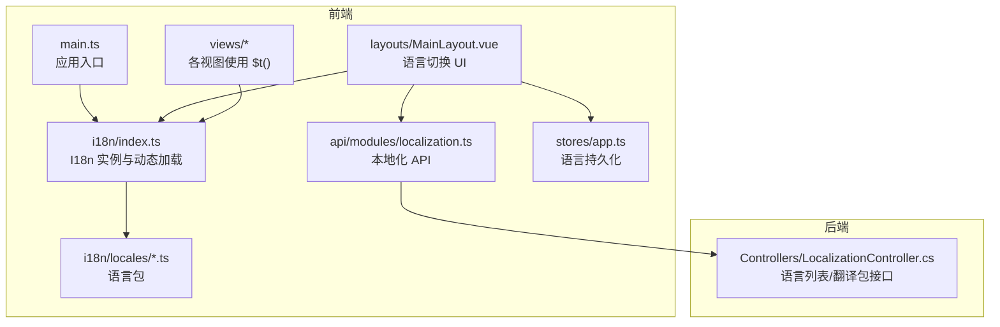
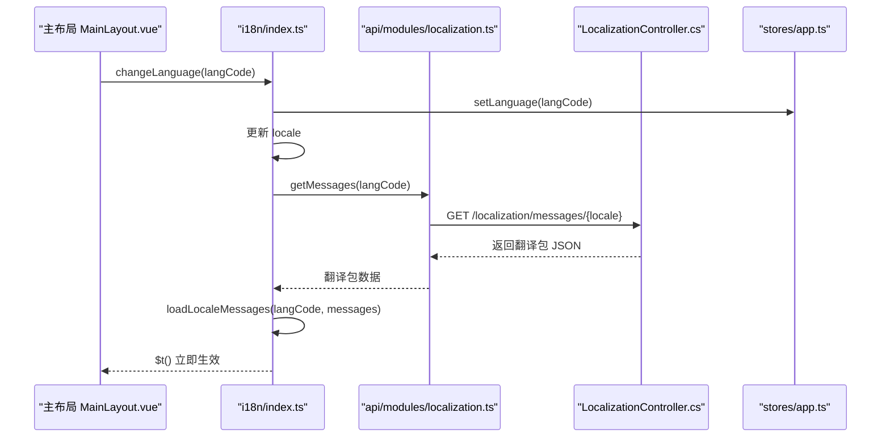
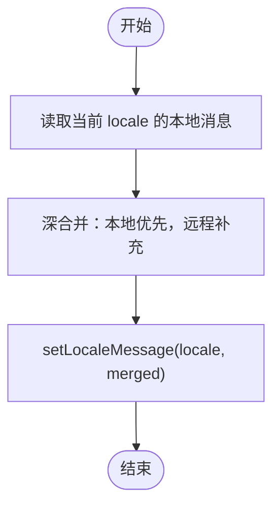
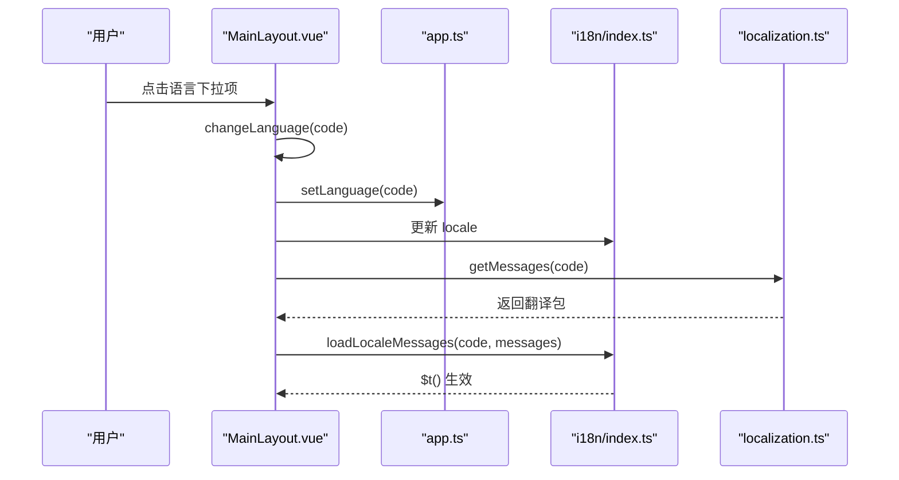
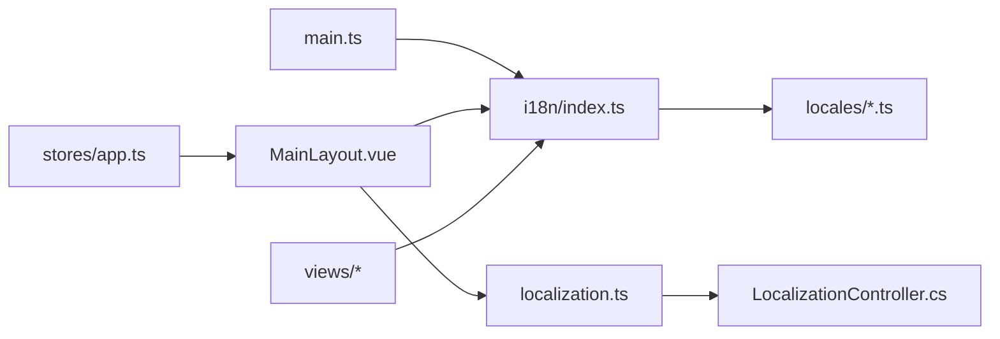

# 国际化

<cite>
**本文引用的文件**
- [Frontend/hrevolve-web/src/i18n/index.ts](file://Frontend/hrevolve-web/src/i18n/index.ts)
- [Frontend/hrevolve-web/src/i18n/locales/en-US.ts](file://Frontend/hrevolve-web/src/i18n/locales/en-US.ts)
- [Frontend/hrevolve-web/src/i18n/locales/zh-CN.ts](file://Frontend/hrevolve-web/src/i18n/locales/zh-CN.ts)
- [Frontend/hrevolve-web/src/i18n/locales/zh-TW.ts](file://Frontend/hrevolve-web/src/i18n/locales/zh-TW.ts)
- [Frontend/hrevolve-web/src/main.ts](file://Frontend/hrevolve-web/src/main.ts)
- [Frontend/hrevolve-web/src/layouts/MainLayout.vue](file://Frontend/hrevolve-web/src/layouts/MainLayout.vue)
- [Frontend/hrevolve-web/src/api/modules/localization.ts](file://Frontend/hrevolve-web/src/api/modules/localization.ts)
- [Backend/Hrevolve.Web/Controllers/LocalizationController.cs](file://Backend/Hrevolve.Web/Controllers/LocalizationController.cs)
- [Frontend/hrevolve-web/src/views/self-service/LeaveView.vue](file://Frontend/hrevolve-web/src/views/self-service/LeaveView.vue)
- [Frontend/hrevolve-web/src/views/dashboard/DashboardView.vue](file://Frontend/hrevolve-web/src/views/dashboard/DashboardView.vue)
- [Frontend/hrevolve-web/src/views/settings/ConfigsView.vue](file://Frontend/hrevolve-web/src/views/settings/ConfigsView.vue)
- [Frontend/hrevolve-web/src/views/payroll/RecordsView.vue](file://Frontend/hrevolve-web/src/views/payroll/RecordsView.vue)
- [Frontend/hrevolve-web/src/stores/app.ts](file://Frontend/hrevolve-web/src/stores/app.ts)
</cite>

## 目录
1. [简介](#简介)
2. [项目结构](#项目结构)
3. [核心组件](#核心组件)
4. [架构总览](#架构总览)
5. [详细组件分析](#详细组件分析)
6. [依赖关系分析](#依赖关系分析)
7. [性能考量](#性能考量)
8. [故障排查指南](#故障排查指南)
9. [结论](#结论)
10. [附录](#附录)

## 简介
本文件面向前端国际化（i18n）系统，围绕以下目标展开：
- 解析 en-US.ts、zh-CN.ts、zh-TW.ts 中多语言键值对的组织结构与命名规范
- 说明 index.ts 中 Vue I18n 实例的初始化配置，包括默认语言、回退语言、消息装载策略
- 阐述语言切换逻辑与后端语言包动态加载策略
- 介绍在 Vue 模板与 JavaScript 中调用 $t() 进行文本翻译的方式
- 提供动态切换界面语言的实现步骤与注意事项
- 说明日期、数字、货币等区域化格式的处理思路
- 覆盖新增语言的支持流程与翻译一致性校验方法

## 项目结构
国际化相关代码主要分布在前端 i18n 目录与后端 Localization 控制器之间，前端通过 Pinia Store 与 API 模块协同完成语言切换与动态加载。

图表来源
- [Frontend/hrevolve-web/src/main.ts](file://Frontend/hrevolve-web/src/main.ts#L1-L28)
- [Frontend/hrevolve-web/src/i18n/index.ts](file://Frontend/hrevolve-web/src/i18n/index.ts#L1-L62)
- [Frontend/hrevolve-web/src/i18n/locales/en-US.ts](file://Frontend/hrevolve-web/src/i18n/locales/en-US.ts#L1-L787)
- [Frontend/hrevolve-web/src/i18n/locales/zh-CN.ts](file://Frontend/hrevolve-web/src/i18n/locales/zh-CN.ts#L1-L787)
- [Frontend/hrevolve-web/src/i18n/locales/zh-TW.ts](file://Frontend/hrevolve-web/src/i18n/locales/zh-TW.ts#L1-L787)
- [Frontend/hrevolve-web/src/layouts/MainLayout.vue](file://Frontend/hrevolve-web/src/layouts/MainLayout.vue#L1-L769)
- [Frontend/hrevolve-web/src/api/modules/localization.ts](file://Frontend/hrevolve-web/src/api/modules/localization.ts#L1-L26)
- [Backend/Hrevolve.Web/Controllers/LocalizationController.cs](file://Backend/Hrevolve.Web/Controllers/LocalizationController.cs#L1-L91)

章节来源
- [Frontend/hrevolve-web/src/main.ts](file://Frontend/hrevolve-web/src/main.ts#L1-L28)
- [Frontend/hrevolve-web/src/i18n/index.ts](file://Frontend/hrevolve-web/src/i18n/index.ts#L1-L62)

## 核心组件
- Vue I18n 实例与动态加载
  - 默认语言与回退语言：初始化时从本地存储读取，默认 zh-CN，回退 zh-CN
  - 本地语言包：直接导入 zh-CN、zh-TW、en-US 并注册到 messages
  - 动态加载：提供 loadLocaleMessages 函数，按“本地优先、后端补充”的策略合并远程翻译
- 语言包组织
  - 采用分层命名空间：common、auth、menu、dashboard、employee、profile、attendance、leave、payroll、expense、assistant、error、tax、settings、schedule、organization、leaveAdmin、payrollAdmin、shifts、attendanceAdmin、orgAdmin、insurance、company、languageOptions、currencyOptions、tags、costCenters、clockDevices、assistantExtra、loginPage、taxExtra、weekdays、calendar、errorPage
  - 文本统一使用英文键名，中文与繁体分别在 zh-CN.ts 与 zh-TW.ts 中对应
- 语言切换与持久化
  - 主布局中提供语言下拉菜单，触发 changeLanguage
  - 切换时更新 i18n.locale，并通过 Pinia Store 持久化到 localStorage
  - 本地化 API 提供后端语言列表与翻译包接口，支持从后端拉取并合并

章节来源
- [Frontend/hrevolve-web/src/i18n/index.ts](file://Frontend/hrevolve-web/src/i18n/index.ts#L1-L62)
- [Frontend/hrevolve-web/src/i18n/locales/en-US.ts](file://Frontend/hrevolve-web/src/i18n/locales/en-US.ts#L1-L787)
- [Frontend/hrevolve-web/src/i18n/locales/zh-CN.ts](file://Frontend/hrevolve-web/src/i18n/locales/zh-CN.ts#L1-L787)
- [Frontend/hrevolve-web/src/i18n/locales/zh-TW.ts](file://Frontend/hrevolve-web/src/i18n/locales/zh-TW.ts#L1-L787)
- [Frontend/hrevolve-web/src/layouts/MainLayout.vue](file://Frontend/hrevolve-web/src/layouts/MainLayout.vue#L1-L769)
- [Frontend/hrevolve-web/src/api/modules/localization.ts](file://Frontend/hrevolve-web/src/api/modules/localization.ts#L1-L26)
- [Frontend/hrevolve-web/src/stores/app.ts](file://Frontend/hrevolve-web/src/stores/app.ts#L1-L66)

## 架构总览
前端通过 main.ts 注册 i18n 插件，随后在主布局中提供语言切换 UI，调用 API 获取语言列表与翻译包，最终通过 loadLocaleMessages 合并到当前 locale 的消息集中。

图表来源
- [Frontend/hrevolve-web/src/layouts/MainLayout.vue](file://Frontend/hrevolve-web/src/layouts/MainLayout.vue#L1-L769)
- [Frontend/hrevolve-web/src/i18n/index.ts](file://Frontend/hrevolve-web/src/i18n/index.ts#L1-L62)
- [Frontend/hrevolve-web/src/api/modules/localization.ts](file://Frontend/hrevolve-web/src/api/modules/localization.ts#L1-L26)
- [Backend/Hrevolve.Web/Controllers/LocalizationController.cs](file://Backend/Hrevolve.Web/Controllers/LocalizationController.cs#L1-L91)
- [Frontend/hrevolve-web/src/stores/app.ts](file://Frontend/hrevolve-web/src/stores/app.ts#L1-L66)

## 详细组件分析

### Vue I18n 实例与动态加载（index.ts）
- 初始化配置要点
  - legacy: false（启用组合式 API 风格）
  - locale: 从 localStorage 读取，若无则 zh-CN
  - fallbackLocale: zh-CN
  - messages: 注册本地语言包
- 动态加载策略
  - loadLocaleMessages：深合并本地与远程翻译，保持本地优先，仅在本地缺失时补充远程
  - 合并逻辑：对象递归合并，字符串/数值等基础类型仅在本地不存在时采用远程

图表来源
- [Frontend/hrevolve-web/src/i18n/index.ts](file://Frontend/hrevolve-web/src/i18n/index.ts#L1-L62)

章节来源
- [Frontend/hrevolve-web/src/i18n/index.ts](file://Frontend/hrevolve-web/src/i18n/index.ts#L1-L62)

### 语言包组织结构（locales/*.ts）
- 分层命名空间设计
  - 通用：common
  - 认证：auth
  - 菜单：menu
  - 仪表盘：dashboard
  - 员工与档案：employee、profile
  - 考勤：attendance
  - 请假：leave、leaveAdmin
  - 薪资：payroll、payrollAdmin
  - 报销：expense
  - 辅助工具：assistant、assistantExtra
  - 错误页：error、errorPage
  - 税务：tax、taxExtra
  - 系统设置：settings
  - 排班：schedule
  - 组织架构：organization、orgAdmin
  - 保险福利：insurance
  - 公司设置：company
  - 语言与货币选项：languageOptions、currencyOptions
  - 标签、成本中心、打卡设备：tags、costCenters、clockDevices
  - 星期与日历：weekdays、calendar
- 键名规范
  - 英文键名统一，中文与繁体分别在 zh-CN.ts 与 zh-TW.ts 中对应
  - 常见单位与占位符：如 daysUnit、perMonth、yearLabel 等
- 示例路径
  - [Frontend/hrevolve-web/src/i18n/locales/en-US.ts](file://Frontend/hrevolve-web/src/i18n/locales/en-US.ts#L1-L787)
  - [Frontend/hrevolve-web/src/i18n/locales/zh-CN.ts](file://Frontend/hrevolve-web/src/i18n/locales/zh-CN.ts#L1-L787)
  - [Frontend/hrevolve-web/src/i18n/locales/zh-TW.ts](file://Frontend/hrevolve-web/src/i18n/locales/zh-TW.ts#L1-L787)

章节来源
- [Frontend/hrevolve-web/src/i18n/locales/en-US.ts](file://Frontend/hrevolve-web/src/i18n/locales/en-US.ts#L1-L787)
- [Frontend/hrevolve-web/src/i18n/locales/zh-CN.ts](file://Frontend/hrevolve-web/src/i18n/locales/zh-CN.ts#L1-L787)
- [Frontend/hrevolve-web/src/i18n/locales/zh-TW.ts](file://Frontend/hrevolve-web/src/i18n/locales/zh-TW.ts#L1-L787)

### 语言切换与 UI（MainLayout.vue）
- 语言列表来源
  - 优先从后端 localization/locales 拉取，失败时使用本地 supportedLocales
- 切换流程
  - changeLanguage：更新 i18n.locale 与 appStore.language，提示切换结果
  - 本地化 API：localizationApi.getMessages(langCode) 用于动态加载后端翻译包
- 下拉菜单与激活态
  - 通过 el-dropdown 渲染语言列表，激活态高亮

图表来源
- [Frontend/hrevolve-web/src/layouts/MainLayout.vue](file://Frontend/hrevolve-web/src/layouts/MainLayout.vue#L1-L769)
- [Frontend/hrevolve-web/src/stores/app.ts](file://Frontend/hrevolve-web/src/stores/app.ts#L1-L66)
- [Frontend/hrevolve-web/src/i18n/index.ts](file://Frontend/hrevolve-web/src/i18n/index.ts#L1-L62)
- [Frontend/hrevolve-web/src/api/modules/localization.ts](file://Frontend/hrevolve-web/src/api/modules/localization.ts#L1-L26)

章节来源
- [Frontend/hrevolve-web/src/layouts/MainLayout.vue](file://Frontend/hrevolve-web/src/layouts/MainLayout.vue#L1-L769)
- [Frontend/hrevolve-web/src/stores/app.ts](file://Frontend/hrevolve-web/src/stores/app.ts#L1-L66)
- [Frontend/hrevolve-web/src/api/modules/localization.ts](file://Frontend/hrevolve-web/src/api/modules/localization.ts#L1-L26)

### 在模板与 JS 中使用 $t()
- 模板中
  - 通过 t('命名空间.键') 直接渲染文本
  - 示例：面包屑、菜单项、表格列头、按钮文案等
- JS 中
  - 表单验证规则、状态标签映射、提示消息等使用 t() 动态生成
- 示例路径
  - [Frontend/hrevolve-web/src/views/self-service/LeaveView.vue](file://Frontend/hrevolve-web/src/views/self-service/LeaveView.vue#L1-L200)
  - [Frontend/hrevolve-web/src/views/dashboard/DashboardView.vue](file://Frontend/hrevolve-web/src/views/dashboard/DashboardView.vue#L1-L200)

章节来源
- [Frontend/hrevolve-web/src/views/self-service/LeaveView.vue](file://Frontend/hrevolve-web/src/views/self-service/LeaveView.vue#L1-L200)
- [Frontend/hrevolve-web/src/views/dashboard/DashboardView.vue](file://Frontend/hrevolve-web/src/views/dashboard/DashboardView.vue#L1-L200)

### 区域化格式（日期、数字、货币）
- 日期
  - 仪表盘根据当前 locale 选择 en-US 或 zh-CN，使用本地化日期格式
  - 示例路径：[Frontend/hrevolve-web/src/views/dashboard/DashboardView.vue](file://Frontend/hrevolve-web/src/views/dashboard/DashboardView.vue#L1-L200)
- 数字与货币
  - 薪资记录视图使用 Intl.NumberFormat 对金额进行货币格式化
  - 示例路径：[Frontend/hrevolve-web/src/views/payroll/RecordsView.vue](file://Frontend/hrevolve-web/src/views/payroll/RecordsView.vue#L1-L37)
- 系统配置
  - 系统设置页提供时区、日期格式、默认语言、货币等配置项
  - 示例路径：[Frontend/hrevolve-web/src/views/settings/ConfigsView.vue](file://Frontend/hrevolve-web/src/views/settings/ConfigsView.vue#L91-L129)

章节来源
- [Frontend/hrevolve-web/src/views/dashboard/DashboardView.vue](file://Frontend/hrevolve-web/src/views/dashboard/DashboardView.vue#L1-L200)
- [Frontend/hrevolve-web/src/views/payroll/RecordsView.vue](file://Frontend/hrevolve-web/src/views/payroll/RecordsView.vue#L1-L37)
- [Frontend/hrevolve-web/src/views/settings/ConfigsView.vue](file://Frontend/hrevolve-web/src/views/settings/ConfigsView.vue#L91-L129)

### 新增语言支持流程
- 后端
  - 在 LocalizationController.cs 中扩展受支持语言列表与翻译包构造逻辑
  - 示例路径：[Backend/Hrevolve.Web/Controllers/LocalizationController.cs](file://Backend/Hrevolve.Web/Controllers/LocalizationController.cs#L1-L91)
- 前端
  - 在 i18n/locales 新增对应语言包文件（如 zh-HK.ts），并在 index.ts 中导入并注册到 messages
  - 在 MainLayout.vue 的 supportedLocales 中加入新语言条目，或确保后端返回该语言
  - 若需后端动态加载，确保 localization.ts 的 getMessages/getLocales 能正确返回新语言
- 示例路径
  - [Frontend/hrevolve-web/src/i18n/index.ts](file://Frontend/hrevolve-web/src/i18n/index.ts#L1-L62)
  - [Frontend/hrevolve-web/src/layouts/MainLayout.vue](file://Frontend/hrevolve-web/src/layouts/MainLayout.vue#L1-L769)
  - [Frontend/hrevolve-web/src/api/modules/localization.ts](file://Frontend/hrevolve-web/src/api/modules/localization.ts#L1-L26)

章节来源
- [Backend/Hrevolve.Web/Controllers/LocalizationController.cs](file://Backend/Hrevolve.Web/Controllers/LocalizationController.cs#L1-L91)
- [Frontend/hrevolve-web/src/i18n/index.ts](file://Frontend/hrevolve-web/src/i18n/index.ts#L1-L62)
- [Frontend/hrevolve-web/src/layouts/MainLayout.vue](file://Frontend/hrevolve-web/src/layouts/MainLayout.vue#L1-L769)
- [Frontend/hrevolve-web/src/api/modules/localization.ts](file://Frontend/hrevolve-web/src/api/modules/localization.ts#L1-L26)

### 翻译一致性校验方法
- 键名一致性
  - 以 en-US.ts 为基准，检查 zh-CN.ts、zh-TW.ts 是否包含相同键树
- 值完整性
  - 通过后端 localization/messages 接口批量拉取翻译包，对比缺失键
- 合并策略
  - 使用 loadLocaleMessages 的“本地优先、远程补充”策略，确保本地覆盖远程空值
- 建议工具链
  - 可引入键名扫描与差异报告脚本，定期比对语言包差异
  - 在 CI 中加入键名一致性检查任务

章节来源
- [Frontend/hrevolve-web/src/i18n/index.ts](file://Frontend/hrevolve-web/src/i18n/index.ts#L1-L62)
- [Backend/Hrevolve.Web/Controllers/LocalizationController.cs](file://Backend/Hrevolve.Web/Controllers/LocalizationController.cs#L1-L91)

## 依赖关系分析
- 应用入口 main.ts 注册 i18n 插件
- 主布局依赖 i18n、localization API、Pinia Store
- 视图层广泛使用 $t()，依赖 i18n 实例
- 后端提供语言列表与翻译包接口，前端通过 API 模块消费

图表来源
- [Frontend/hrevolve-web/src/main.ts](file://Frontend/hrevolve-web/src/main.ts#L1-L28)
- [Frontend/hrevolve-web/src/i18n/index.ts](file://Frontend/hrevolve-web/src/i18n/index.ts#L1-L62)
- [Frontend/hrevolve-web/src/i18n/locales/en-US.ts](file://Frontend/hrevolve-web/src/i18n/locales/en-US.ts#L1-L787)
- [Frontend/hrevolve-web/src/layouts/MainLayout.vue](file://Frontend/hrevolve-web/src/layouts/MainLayout.vue#L1-L769)
- [Frontend/hrevolve-web/src/api/modules/localization.ts](file://Frontend/hrevolve-web/src/api/modules/localization.ts#L1-L26)
- [Backend/Hrevolve.Web/Controllers/LocalizationController.cs](file://Backend/Hrevolve.Web/Controllers/LocalizationController.cs#L1-L91)
- [Frontend/hrevolve-web/src/stores/app.ts](file://Frontend/hrevolve-web/src/stores/app.ts#L1-L66)

章节来源
- [Frontend/hrevolve-web/src/main.ts](file://Frontend/hrevolve-web/src/main.ts#L1-L28)
- [Frontend/hrevolve-web/src/layouts/MainLayout.vue](file://Frontend/hrevolve-web/src/layouts/MainLayout.vue#L1-L769)
- [Frontend/hrevolve-web/src/api/modules/localization.ts](file://Frontend/hrevolve-web/src/api/modules/localization.ts#L1-L26)
- [Backend/Hrevolve.Web/Controllers/LocalizationController.cs](file://Backend/Hrevolve.Web/Controllers/LocalizationController.cs#L1-L91)

## 性能考量
- 菜单渲染性能优化
  - 使用 shallowRef 存储菜单配置，避免深度响应式开销
  - 延迟翻译到渲染阶段，仅存储翻译键，减少初始化开销
  - 限制同时展开的子菜单数量，降低 DOM 节点数量
  - 为菜单项添加 will-change 与 GPU 加速，改善动画流畅度
- $t() 调用开销
  - 在大量菜单项场景下，减少 t() 调用次数，或缓存翻译结果
- 语言切换开销
  - 切换时避免重复请求同一语言包，必要时增加去抖与并发控制

章节来源
- [Frontend/hrevolve-web/PERFORMANCE_OPTIMIZATION.md](file://Frontend/hrevolve-web/PERFORMANCE_OPTIMIZATION.md#L1-L60)

## 故障排查指南
- 语言切换无效
  - 检查 i18n.locale 是否被正确更新
  - 确认 appStore.setLanguage 已持久化到 localStorage
  - 参考路径：[Frontend/hrevolve-web/src/layouts/MainLayout.vue](file://Frontend/hrevolve-web/src/layouts/MainLayout.vue#L1-L769)，[Frontend/hrevolve-web/src/stores/app.ts](file://Frontend/hrevolve-web/src/stores/app.ts#L1-L66)
- 后端翻译包未生效
  - 确认 localizationApi.getMessages 返回的数据结构正确
  - 检查 loadLocaleMessages 的合并逻辑是否覆盖了本地键
  - 参考路径：[Frontend/hrevolve-web/src/i18n/index.ts](file://Frontend/hrevolve-web/src/i18n/index.ts#L1-L62)，[Frontend/hrevolve-web/src/api/modules/localization.ts](file://Frontend/hrevolve-web/src/api/modules/localization.ts#L1-L26)
- 日期/货币格式不符合预期
  - 仪表盘日期格式根据 locale 选择 en-US 或 zh-CN
  - 货币格式使用 Intl.NumberFormat，确保传入正确的语言与货币代码
  - 参考路径：[Frontend/hrevolve-web/src/views/dashboard/DashboardView.vue](file://Frontend/hrevolve-web/src/views/dashboard/DashboardView.vue#L1-L200)，[Frontend/hrevolve-web/src/views/payroll/RecordsView.vue](file://Frontend/hrevolve-web/src/views/payroll/RecordsView.vue#L1-L37)

章节来源
- [Frontend/hrevolve-web/src/layouts/MainLayout.vue](file://Frontend/hrevolve-web/src/layouts/MainLayout.vue#L1-L769)
- [Frontend/hrevolve-web/src/stores/app.ts](file://Frontend/hrevolve-web/src/stores/app.ts#L1-L66)
- [Frontend/hrevolve-web/src/i18n/index.ts](file://Frontend/hrevolve-web/src/i18n/index.ts#L1-L62)
- [Frontend/hrevolve-web/src/api/modules/localization.ts](file://Frontend/hrevolve-web/src/api/modules/localization.ts#L1-L26)
- [Frontend/hrevolve-web/src/views/dashboard/DashboardView.vue](file://Frontend/hrevolve-web/src/views/dashboard/DashboardView.vue#L1-L200)
- [Frontend/hrevolve-web/src/views/payroll/RecordsView.vue](file://Frontend/hrevolve-web/src/views/payroll/RecordsView.vue#L1-L37)

## 结论
本项目的国际化体系以 Vue I18n 为核心，结合后端动态翻译包与本地语言包，实现了灵活的语言切换与一致的文本呈现。通过“本地优先、远程补充”的合并策略，既保证了本地定制能力，又支持后端增量更新。建议在新增语言时严格遵循键名一致性与合并策略，并在 CI 中加入自动化校验，持续保障翻译质量与用户体验。

## 附录
- 关键实现路径索引
  - I18n 实例与动态加载：[Frontend/hrevolve-web/src/i18n/index.ts](file://Frontend/hrevolve-web/src/i18n/index.ts#L1-L62)
  - 语言包文件：[Frontend/hrevolve-web/src/i18n/locales/en-US.ts](file://Frontend/hrevolve-web/src/i18n/locales/en-US.ts#L1-L787)，[Frontend/hrevolve-web/src/i18n/locales/zh-CN.ts](file://Frontend/hrevolve-web/src/i18n/locales/zh-CN.ts#L1-L787)，[Frontend/hrevolve-web/src/i18n/locales/zh-TW.ts](file://Frontend/hrevolve-web/src/i18n/locales/zh-TW.ts#L1-L787)
  - 应用入口注册：[Frontend/hrevolve-web/src/main.ts](file://Frontend/hrevolve-web/src/main.ts#L1-L28)
  - 语言切换 UI：[Frontend/hrevolve-web/src/layouts/MainLayout.vue](file://Frontend/hrevolve-web/src/layouts/MainLayout.vue#L1-L769)
  - 本地化 API：[Frontend/hrevolve-web/src/api/modules/localization.ts](file://Frontend/hrevolve-web/src/api/modules/localization.ts#L1-L26)
  - 后端控制器：[Backend/Hrevolve.Web/Controllers/LocalizationController.cs](file://Backend/Hrevolve.Web/Controllers/LocalizationController.cs#L1-L91)
  - 视图中 $t() 使用示例：[Frontend/hrevolve-web/src/views/self-service/LeaveView.vue](file://Frontend/hrevolve-web/src/views/self-service/LeaveView.vue#L1-L200)，[Frontend/hrevolve-web/src/views/dashboard/DashboardView.vue](file://Frontend/hrevolve-web/src/views/dashboard/DashboardView.vue#L1-L200)
  - 区域化格式示例：[Frontend/hrevolve-web/src/views/payroll/RecordsView.vue](file://Frontend/hrevolve-web/src/views/payroll/RecordsView.vue#L1-L37)，[Frontend/hrevolve-web/src/views/settings/ConfigsView.vue](file://Frontend/hrevolve-web/src/views/settings/ConfigsView.vue#L91-L129)
  - 语言持久化 Store：[Frontend/hrevolve-web/src/stores/app.ts](file://Frontend/hrevolve-web/src/stores/app.ts#L1-L66)