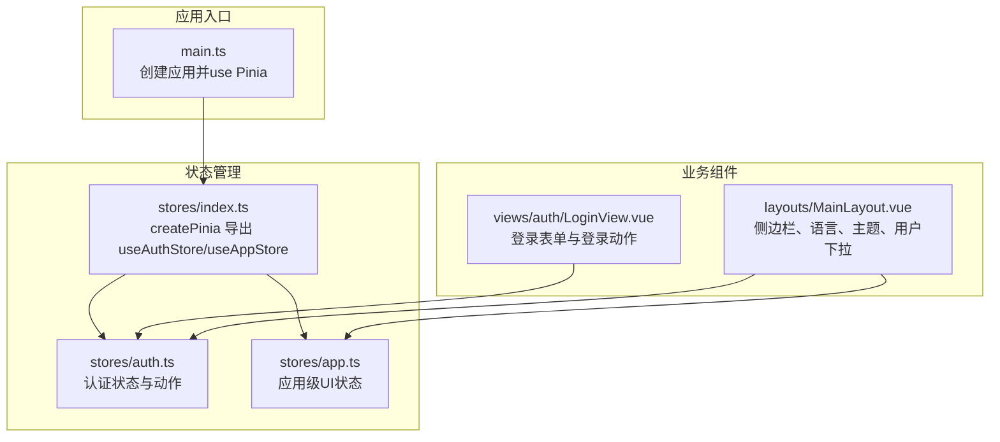
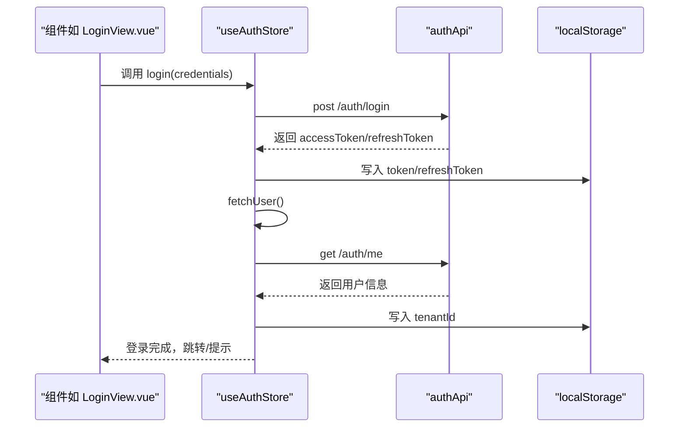
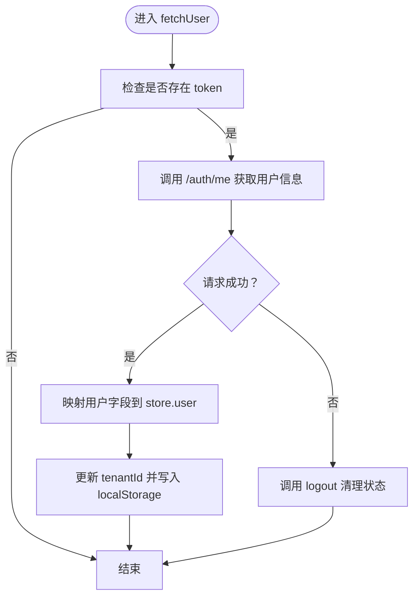
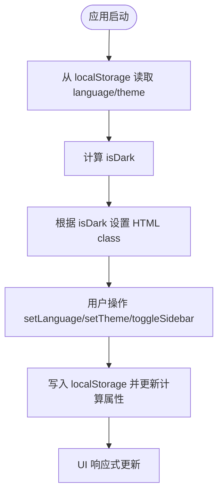
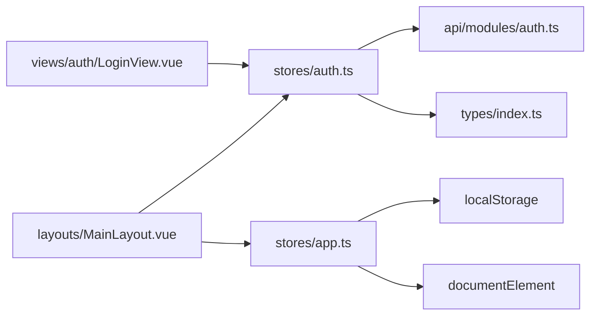

# 状态管理

<cite>
**本文引用的文件**
- [auth.ts](file://Frontend/hrevolve-web/src/stores/auth.ts)
- [app.ts](file://Frontend/hrevolve-web/src/stores/app.ts)
- [index.ts（stores）](file://Frontend/hrevolve-web/src/stores/index.ts)
- [main.ts](file://Frontend/hrevolve-web/src/main.ts)
- [auth.ts（api）](file://Frontend/hrevolve-web/src/api/modules/auth.ts)
- [index.ts（types）](file://Frontend/hrevolve-web/src/types/index.ts)
- [LoginView.vue](file://Frontend/hrevolve-web/src/views/auth/LoginView.vue)
- [MainLayout.vue](file://Frontend/hrevolve-web/src/layouts/MainLayout.vue)
</cite>

## 目录
1. [简介](#简介)
2. [项目结构](#项目结构)
3. [核心组件](#核心组件)
4. [架构总览](#架构总览)
5. [详细组件分析](#详细组件分析)
6. [依赖关系分析](#依赖关系分析)
7. [性能考量](#性能考量)
8. [故障排查指南](#故障排查指南)
9. [结论](#结论)
10. [附录](#附录)

## 简介
本文件系统性梳理前端 Pinia 状态管理在本项目中的落地实践，重点覆盖：
- 认证状态管理（auth.ts）：token 存储、登录状态同步、登出清理、权限校验与 Token 刷新
- 应用级状态（app.ts）：侧边栏展开状态、主题与语言配置、全局加载状态
- store 统一注册与模块化组织（index.ts）
- 在组件中通过 defineStore/useStore 调用状态的最佳实践
- 状态持久化（localStorage）、状态重置、actions 异步处理与数据监听
- 常见问题排查（状态不更新、模块命名冲突）

## 项目结构
Pinia Store 位于前端工程的 stores 目录，采用“按功能模块拆分”的组织方式：
- stores/auth.ts：用户认证与授权相关状态
- stores/app.ts：应用级 UI/UX 状态（侧边栏、主题、语言等）
- stores/index.ts：Pinia 实例创建与导出 useAuthStore/useAppStore
- main.ts：应用启动时挂载 Pinia

图表来源
- [main.ts](file://Frontend/hrevolve-web/src/main.ts#L1-L28)
- [index.ts（stores）](file://Frontend/hrevolve-web/src/stores/index.ts#L1-L9)
- [auth.ts](file://Frontend/hrevolve-web/src/stores/auth.ts#L1-L119)
- [app.ts](file://Frontend/hrevolve-web/src/stores/app.ts#L1-L66)
- [LoginView.vue](file://Frontend/hrevolve-web/src/views/auth/LoginView.vue#L1-L762)
- [MainLayout.vue](file://Frontend/hrevolve-web/src/layouts/MainLayout.vue#L1-L408)

章节来源
- [main.ts](file://Frontend/hrevolve-web/src/main.ts#L1-L28)
- [index.ts（stores）](file://Frontend/hrevolve-web/src/stores/index.ts#L1-L9)

## 核心组件
- 认证 Store（useAuthStore）
  - 状态：token、refreshToken、user、tenantId
  - 计算属性：isAuthenticated、userRoles、userPermissions
  - 动作：login、fetchUser、refreshAccessToken、logout
  - 权限辅助：hasPermission、hasRole
- 应用 Store（useAppStore）
  - 状态：sidebarCollapsed、language、theme、loading
  - 计算属性：isDark
  - 动作：toggleSidebar、setLanguage、setTheme、setLoading

章节来源
- [auth.ts](file://Frontend/hrevolve-web/src/stores/auth.ts#L1-L119)
- [app.ts](file://Frontend/hrevolve-web/src/stores/app.ts#L1-L66)

## 架构总览
Pinia 在应用启动时被注入，随后各组件通过 defineStore/useStore 获取状态与动作。认证状态与应用状态分别服务于登录流程、权限控制与 UI 主题/语言偏好。

图表来源
- [LoginView.vue](file://Frontend/hrevolve-web/src/views/auth/LoginView.vue#L1-L762)
- [auth.ts](file://Frontend/hrevolve-web/src/stores/auth.ts#L1-L119)
- [auth.ts（api）](file://Frontend/hrevolve-web/src/api/modules/auth.ts#L1-L31)

## 详细组件分析

### 认证状态管理（auth.ts）
- 状态与持久化
  - token/refreshToken/tenantId 从 localStorage 初始化，确保刷新后仍保持登录态
  - 登录成功后写入 localStorage；登出时移除
- 登录流程
  - 调用 authApi.login，接收 accessToken/refreshToken 并持久化
  - 紧接着调用 fetchUser，从后端获取用户详情并写入 localStorage
- 用户信息同步
  - fetchUser 在 token 存在时才发起请求；若后端返回异常（如 token 失效），自动触发 logout 清理
- Token 刷新
  - refreshAccessToken 使用 refreshToken 请求后端换取新 token
  - 成功则更新内存与 localStorage；失败则回退到 logout
- 权限与角色
  - hasPermission 与 hasRole 提供细粒度权限判断，支持 Admin 角色兜底
- 登出清理
  - 清空 token、refreshToken、user、tenantId，并移除对应 localStorage 键

图表来源
- [auth.ts](file://Frontend/hrevolve-web/src/stores/auth.ts#L1-L119)
- [auth.ts（api）](file://Frontend/hrevolve-web/src/api/modules/auth.ts#L1-L31)

章节来源
- [auth.ts](file://Frontend/hrevolve-web/src/stores/auth.ts#L1-L119)
- [auth.ts（api）](file://Frontend/hrevolve-web/src/api/modules/auth.ts#L1-L31)
- [index.ts（types）](file://Frontend/hrevolve-web/src/types/index.ts#L1-L120)

### 应用级状态（app.ts）
- 侧边栏展开状态
  - sidebarCollapsed 默认 false，toggleSidebar 切换
- 主题与语言
  - language 与 theme 从 localStorage 初始化；setLanguage/setTheme 更新并持久化
  - isDark 计算属性根据 theme 自动推断（auto 时依据 prefers-color-scheme）
  - setTheme 同步更新 documentElement 的 dark class，驱动样式切换
- 全局加载状态
  - setLoading 控制全局 loading 状态，便于统一加载反馈

图表来源
- [app.ts](file://Frontend/hrevolve-web/src/stores/app.ts#L1-L66)

章节来源
- [app.ts](file://Frontend/hrevolve-web/src/stores/app.ts#L1-L66)

### store 统一注册与模块化组织（stores/index.ts）
- 创建 Pinia 实例并导出
- 同时导出 useAuthStore/useAppStore，便于组件直接按需导入

章节来源
- [index.ts（stores）](file://Frontend/hrevolve-web/src/stores/index.ts#L1-L9)

### 在组件中调用状态的最佳实践
- 登录组件 LoginView.vue
  - 通过 useAuthStore 调用 login，提交表单后跳转或提示
  - 参考路径：[LoginView.vue](file://Frontend/hrevolve-web/src/views/auth/LoginView.vue#L1-L762)
- 主布局 MainLayout.vue
  - 通过 useAppStore 控制侧边栏折叠、语言切换、主题切换
  - 通过 useAuthStore 显示用户信息、执行 logout
  - 参考路径：[MainLayout.vue](file://Frontend/hrevolve-web/src/layouts/MainLayout.vue#L1-L408)

章节来源
- [LoginView.vue](file://Frontend/hrevolve-web/src/views/auth/LoginView.vue#L1-L762)
- [MainLayout.vue](file://Frontend/hrevolve-web/src/layouts/MainLayout.vue#L1-L408)

## 依赖关系分析
- 认证 Store 依赖
  - authApi：封装 /auth/* 接口
  - User/Role 等类型：定义用户与权限结构
- 应用 Store 依赖
  - localStorage：持久化语言与主题
  - documentElement：主题切换时添加/移除 dark class
- 组件依赖
  - LoginView.vue 依赖 useAuthStore
  - MainLayout.vue 依赖 useAppStore 与 useAuthStore

图表来源
- [auth.ts](file://Frontend/hrevolve-web/src/stores/auth.ts#L1-L119)
- [app.ts](file://Frontend/hrevolve-web/src/stores/app.ts#L1-L66)
- [auth.ts（api）](file://Frontend/hrevolve-web/src/api/modules/auth.ts#L1-L31)
- [index.ts（types）](file://Frontend/hrevolve-web/src/types/index.ts#L1-L120)
- [LoginView.vue](file://Frontend/hrevolve-web/src/views/auth/LoginView.vue#L1-L762)
- [MainLayout.vue](file://Frontend/hrevolve-web/src/layouts/MainLayout.vue#L1-L408)

章节来源
- [auth.ts](file://Frontend/hrevolve-web/src/stores/auth.ts#L1-L119)
- [app.ts](file://Frontend/hrevolve-web/src/stores/app.ts#L1-L66)
- [auth.ts（api）](file://Frontend/hrevolve-web/src/api/modules/auth.ts#L1-L31)
- [index.ts（types）](file://Frontend/hrevolve-web/src/types/index.ts#L1-L120)
- [LoginView.vue](file://Frontend/hrevolve-web/src/views/auth/LoginView.vue#L1-L762)
- [MainLayout.vue](file://Frontend/hrevolve-web/src/layouts/MainLayout.vue#L1-L408)

## 性能考量
- 响应式与浅响应
  - MainLayout.vue 使用 shallowRef 包裹菜单数据，减少深层响应式开销
  - 使用 markRaw 包裹图标组件，避免不必要的响应式转换
- 主题切换
  - app.ts 的 setTheme 直接更新 documentElement.class，避免额外渲染
- 语言切换
  - changeLanguage 仅在必要时切换 locale，并通过 appStore.setLanguage 持久化

章节来源
- [MainLayout.vue](file://Frontend/hrevolve-web/src/layouts/MainLayout.vue#L1-L408)
- [app.ts](file://Frontend/hrevolve-web/src/stores/app.ts#L1-L66)

## 故障排查指南
- 状态不更新
  - 检查组件是否通过 defineStore/useStore 正确引入 store
  - 确认 store 的 ref 响应式字段是否在组件模板中被正确使用
  - 若使用 computed，请确认依赖的 store 字段已变更
- 模块命名冲突
  - stores/index.ts 同时导出 useAuthStore/useAppStore，避免重复命名
  - 组件中统一从 '@/stores' 导入，避免不同路径导致的重复实例
- 登录后用户信息未显示
  - 确认 login 成功后是否调用了 fetchUser
  - 检查 /auth/me 接口返回字段与 User 类型一致
- 主题切换无效
  - 确认 setTheme 是否更新了 documentElement.classList
  - 检查 isDark 计算属性与 theme 的映射逻辑
- Token 刷新失败
  - 检查 /auth/refresh 接口是否可用
  - 确认 refreshAccessToken 的错误分支会触发 logout

章节来源
- [index.ts（stores）](file://Frontend/hrevolve-web/src/stores/index.ts#L1-L9)
- [auth.ts](file://Frontend/hrevolve-web/src/stores/auth.ts#L1-L119)
- [app.ts](file://Frontend/hrevolve-web/src/stores/app.ts#L1-L66)
- [auth.ts（api）](file://Frontend/hrevolve-web/src/api/modules/auth.ts#L1-L31)
- [index.ts（types）](file://Frontend/hrevolve-web/src/types/index.ts#L1-L120)

## 结论
本项目的 Pinia 状态管理遵循“按功能模块拆分”的清晰组织方式，认证与应用级状态职责明确。通过 localStorage 持久化、完善的 actions 异步处理与权限辅助函数，实现了良好的用户体验与可维护性。建议在后续迭代中：
- 补齐后端 Token 刷新接口，完善 refreshAccessToken 的健壮性
- 在开发环境逐步启用权限过滤，确保菜单与按钮级别的权限控制
- 对高频组件继续采用 shallowRef/markRaw 等性能优化手段

## 附录
- 组件中调用状态的参考路径
  - 登录：[LoginView.vue](file://Frontend/hrevolve-web/src/views/auth/LoginView.vue#L1-L762)
  - 主布局：[MainLayout.vue](file://Frontend/hrevolve-web/src/layouts/MainLayout.vue#L1-L408)
- store 统一注册：[index.ts（stores）](file://Frontend/hrevolve-web/src/stores/index.ts#L1-L9)
- 应用启动挂载 Pinia：[main.ts](file://Frontend/hrevolve-web/src/main.ts#L1-L28)