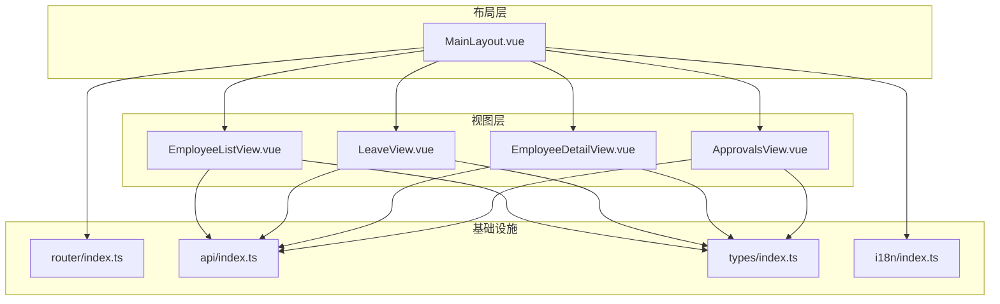
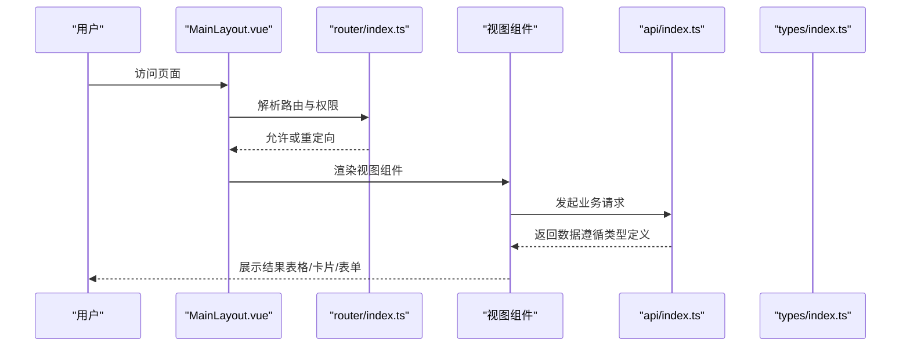
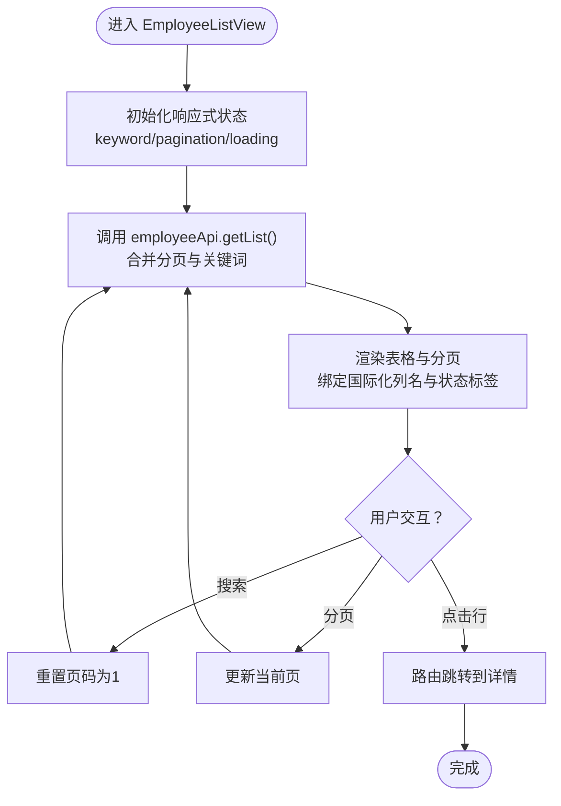
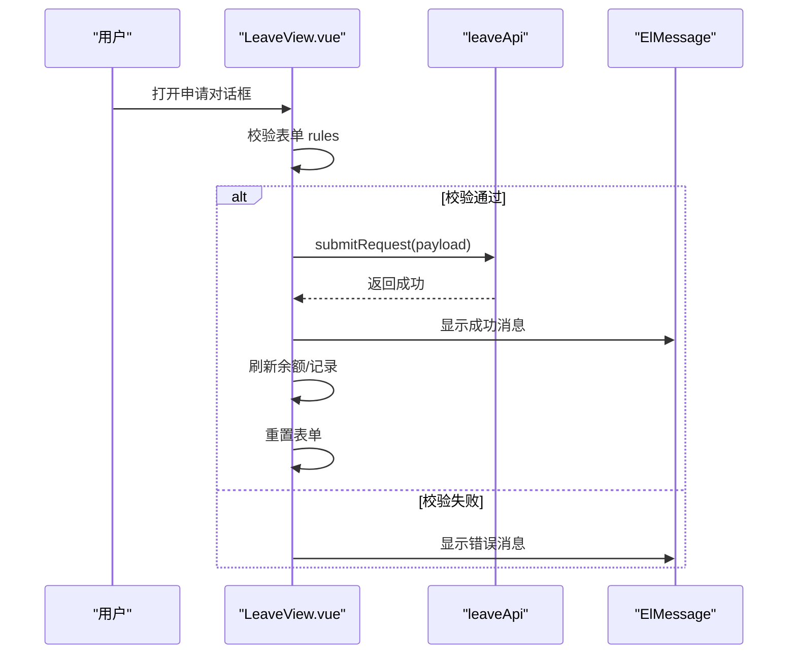
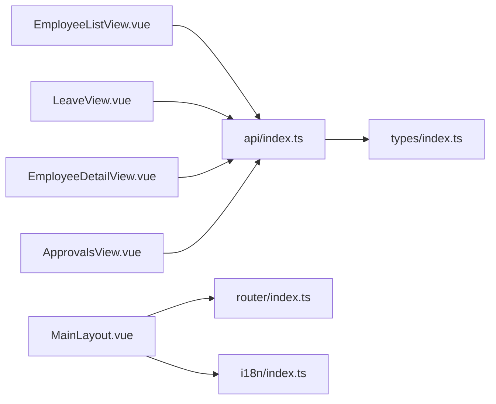

# 组件架构

<cite>
**本文引用的文件**
- [HelloWorld.vue](file://Frontend/hrevolve-web/src/components/HelloWorld.vue)
- [MainLayout.vue](file://Frontend/hrevolve-web/src/layouts/MainLayout.vue)
- [EmployeeListView.vue](file://Frontend/hrevolve-web/src/views/employees/EmployeeListView.vue)
- [LeaveView.vue](file://Frontend/hrevolve-web/src/views/self-service/LeaveView.vue)
- [EmployeeDetailView.vue](file://Frontend/hrevolve-web/src/views/employees/EmployeeDetailView.vue)
- [ApprovalsView.vue](file://Frontend/hrevolve-web/src/views/leave/ApprovalsView.vue)
- [router/index.ts](file://Frontend/hrevolve-web/src/router/index.ts)
- [api/index.ts](file://Frontend/hrevolve-web/src/api/index.ts)
- [types/index.ts](file://Frontend/hrevolve-web/src/types/index.ts)
- [i18n/index.ts](file://Frontend/hrevolve-web/src/i18n/index.ts)
</cite>

## 目录
1. [简介](#简介)
2. [项目结构](#项目结构)
3. [核心组件](#核心组件)
4. [架构总览](#架构总览)
5. [详细组件分析](#详细组件分析)
6. [依赖关系分析](#依赖关系分析)
7. [性能考量](#性能考量)
8. [故障排查指南](#故障排查指南)
9. [结论](#结论)
10. [附录](#附录)

## 简介
本文件系统性梳理 Hrevolve 前端组件架构，聚焦 Vue 3 单文件组件（SFC）的设计模式与复用机制。重点围绕以下方面：
- HelloWorld.vue 作为基础组件示例，展示 template/script/style 三部分的协作方式与最佳实践
- views 目录下的业务视图组件（如 EmployeeListView、LeaveView）如何通过 props、事件与 API/Store 进行父子通信与数据流转
- Element Plus UI 组件的集成方式与自定义封装实践
- 生命周期管理、响应式数据绑定、插槽（slot）使用与可访问性（a11y）支持
- 组件测试策略、响应式布局实现方案与性能优化建议

## 项目结构
前端采用基于目录的特性分层组织：
- components：通用基础组件（如 HelloWorld）
- layouts：布局组件（如 MainLayout），承载全局导航、侧边栏、面包屑与主内容区
- views：业务视图组件，按功能域划分（员工、请假、考勤、排班、薪酬、公司设置、系统设置等）
- api：统一导出各模块 API，集中管理网络请求
- types：TS 类型定义，覆盖 HRM 各领域模型
- router：路由配置与守卫，负责页面级导航与鉴权
- i18n：国际化配置与语言包加载

图表来源
- [MainLayout.vue](file://Frontend/hrevolve-web/src/layouts/MainLayout.vue#L1-L80)
- [router/index.ts](file://Frontend/hrevolve-web/src/router/index.ts#L1-L60)
- [api/index.ts](file://Frontend/hrevolve-web/src/api/index.ts#L1-L19)
- [types/index.ts](file://Frontend/hrevolve-web/src/types/index.ts#L1-L60)
- [i18n/index.ts](file://Frontend/hrevolve-web/src/i18n/index.ts#L1-L30)

章节来源
- [router/index.ts](file://Frontend/hrevolve-web/src/router/index.ts#L1-L120)
- [api/index.ts](file://Frontend/hrevolve-web/src/api/index.ts#L1-L19)
- [types/index.ts](file://Frontend/hrevolve-web/src/types/index.ts#L1-L120)
- [i18n/index.ts](file://Frontend/hrevolve-web/src/i18n/index.ts#L1-L62)

## 核心组件
- HelloWorld.vue：最小化 SFC 示例，演示 defineProps、ref、template 插值与 scoped 样式
- MainLayout.vue：全局布局，包含侧边栏菜单、面包屑、语言切换、用户下拉、主内容区过渡动画
- EmployeeListView.vue：员工列表视图，集成 Element Plus 表格、分页、搜索、加载态与国际化
- LeaveView.vue：自助请假视图，包含余额卡片、记录表格、对话框表单、校验规则与状态标签
- EmployeeDetailView.vue：员工详情视图，展示基本信息与工作履历时间线
- ApprovalsView.vue：请假审批视图，展示待审批列表与批准/拒绝操作

章节来源
- [HelloWorld.vue](file://Frontend/hrevolve-web/src/components/HelloWorld.vue#L1-L42)
- [MainLayout.vue](file://Frontend/hrevolve-web/src/layouts/MainLayout.vue#L1-L120)
- [EmployeeListView.vue](file://Frontend/hrevolve-web/src/views/employees/EmployeeListView.vue#L1-L68)
- [LeaveView.vue](file://Frontend/hrevolve-web/src/views/self-service/LeaveView.vue#L1-L120)
- [EmployeeDetailView.vue](file://Frontend/hrevolve-web/src/views/employees/EmployeeDetailView.vue#L1-L64)
- [ApprovalsView.vue](file://Frontend/hrevolve-web/src/views/leave/ApprovalsView.vue#L1-L58)

## 架构总览
整体采用“布局 + 视图 + 基础设施”的分层设计：
- 布局层（MainLayout）负责全局导航、权限过滤、面包屑与主题样式
- 视图层（views）按业务域拆分，内部通过 API 模块与类型系统进行数据契约约束
- 基础设施（router、api、types、i18n）提供路由守卫、网络请求、类型定义与国际化能力

图表来源
- [MainLayout.vue](file://Frontend/hrevolve-web/src/layouts/MainLayout.vue#L1-L120)
- [router/index.ts](file://Frontend/hrevolve-web/src/router/index.ts#L370-L417)
- [api/index.ts](file://Frontend/hrevolve-web/src/api/index.ts#L1-L19)
- [types/index.ts](file://Frontend/hrevolve-web/src/types/index.ts#L1-L120)

## 详细组件分析

### HelloWorld.vue：基础组件示例
- 结构组成
  - script setup：使用 defineProps 定义只读属性，使用 ref 声明响应式状态
  - template：展示插值与按钮交互，演示事件绑定与条件渲染
  - style：scoped 样式限定作用域，避免样式泄漏
- 设计要点
  - 最小化职责，便于演示与复用
  - 通过 props 传递外部输入，内部状态通过 ref 管理
  - 模板与样式的分离，利于维护与主题定制

章节来源
- [HelloWorld.vue](file://Frontend/hrevolve-web/src/components/HelloWorld.vue#L1-L42)

### MainLayout.vue：布局与导航
- 功能要点
  - 侧边栏菜单：使用浅响应式与图标组件，支持折叠/展开与子菜单展开动画
  - 面包屑：根据路由层级动态生成，支持国际化标题
  - 语言切换：支持从后端加载语言包并合并，本地回退逻辑
  - 用户下拉：登出与跳转至个人资料
  - 主内容区：通过 router-view + transition 实现页面切换动画
- 性能与体验
  - 使用 shallowRef 与 markRaw 降低响应式开销
  - 子菜单展开动画自定义，避免默认动画带来的视觉问题
  - 开发环境临时跳过权限检查，生产环境启用

章节来源
- [MainLayout.vue](file://Frontend/hrevolve-web/src/layouts/MainLayout.vue#L1-L200)
- [router/index.ts](file://Frontend/hrevolve-web/src/router/index.ts#L1-L120)
- [i18n/index.ts](file://Frontend/hrevolve-web/src/i18n/index.ts#L1-L62)

### EmployeeListView.vue：业务视图组件（列表/搜索/分页）
- 数据流
  - 响应式状态：员工列表、加载态、关键词、分页参数
  - 生命周期：onMounted 触发首次加载
  - 交互：搜索、分页变更、行点击查看详情
- Element Plus 集成
  - el-card、el-table、el-pagination、el-input、el-button、el-tag
  - 国际化：useI18n，占位符与按钮文案动态翻译
- 复用与解耦
  - 通过 employeeApi 模块抽象网络请求，类型来自 types/index.ts
  - 状态与 UI 解耦，便于替换为其他 UI 库

图表来源
- [EmployeeListView.vue](file://Frontend/hrevolve-web/src/views/employees/EmployeeListView.vue#L1-L68)
- [api/index.ts](file://Frontend/hrevolve-web/src/api/index.ts#L1-L19)
- [types/index.ts](file://Frontend/hrevolve-web/src/types/index.ts#L149-L180)

章节来源
- [EmployeeListView.vue](file://Frontend/hrevolve-web/src/views/employees/EmployeeListView.vue#L1-L68)

### LeaveView.vue：自助请假视图（表单/对话框/状态）
- 数据与状态
  - 响应式数据：余额、记录、类型、加载态、对话框可见性、表单实例
  - 表单：reactive 对象 + computed 规则，语言切换时自动更新
  - 生命周期：onMounted 加载余额、记录、类型
- Element Plus 集成
  - el-row/col、el-dialog、el-form、el-table、el-date-picker、el-select、el-input
  - 状态标签与进度条，深选择器覆盖第三方样式
- 交互流程
  - 申请对话框提交：校验 -> 提交 -> 成功提示 -> 刷新数据 -> 重置表单
  - 取消请假：调用取消接口 -> 成功提示 -> 刷新数据
- 可访问性（a11y）建议
  - 为表单项添加 aria-label 或 label 关联
  - 为按钮提供明确的文本描述
  - 为表格添加 caption 或合适的标题

图表来源
- [LeaveView.vue](file://Frontend/hrevolve-web/src/views/self-service/LeaveView.vue#L1-L120)
- [api/index.ts](file://Frontend/hrevolve-web/src/api/index.ts#L1-L19)

章节来源
- [LeaveView.vue](file://Frontend/hrevolve-web/src/views/self-service/LeaveView.vue#L1-L250)

### EmployeeDetailView.vue：详情视图（组合加载/时间线）
- 数据流
  - 通过路由参数获取员工 ID，Promise.all 并行加载员工与工作履历
  - 使用 dayjs 格式化日期，状态映射为标签类型
- Element Plus 集成
  - el-card、el-descriptions、el-timeline、el-timeline-item
- 复用与解耦
  - 与 EmployeeListView 形成“列表-详情”联动，保持一致的数据契约与国际化

章节来源
- [EmployeeDetailView.vue](file://Frontend/hrevolve-web/src/views/employees/EmployeeDetailView.vue#L1-L64)

### ApprovalsView.vue：审批视图（操作按钮/状态标签）
- 数据流
  - 加载待审批列表，格式化日期，提供批准/拒绝操作
  - 成功/失败提示，刷新列表
- Element Plus 集成
  - el-table、el-button、el-empty
- 复用与解耦
  - 与 LeaveView 的审批流程形成统一的 API 调用与状态管理

章节来源
- [ApprovalsView.vue](file://Frontend/hrevolve-web/src/views/leave/ApprovalsView.vue#L1-L58)

## 依赖关系分析
- 组件到基础设施
  - 视图组件依赖 api 模块进行数据请求，类型来自 types 模块
  - 布局组件依赖 router 进行导航与权限控制，依赖 i18n 进行多语言
- 组件间通信
  - 列表与详情：通过路由参数传递 ID，实现“父子”视图联动
  - 表单与列表：通过提交后刷新数据，实现“兄弟”视图同步
- 外部库
  - Element Plus：大量 UI 组件与图标
  - vue-router：路由导航与守卫
  - vue-i18n：国际化
  - dayjs：日期格式化

图表来源
- [EmployeeListView.vue](file://Frontend/hrevolve-web/src/views/employees/EmployeeListView.vue#L1-L68)
- [LeaveView.vue](file://Frontend/hrevolve-web/src/views/self-service/LeaveView.vue#L1-L120)
- [EmployeeDetailView.vue](file://Frontend/hrevolve-web/src/views/employees/EmployeeDetailView.vue#L1-L64)
- [ApprovalsView.vue](file://Frontend/hrevolve-web/src/views/leave/ApprovalsView.vue#L1-L58)
- [api/index.ts](file://Frontend/hrevolve-web/src/api/index.ts#L1-L19)
- [types/index.ts](file://Frontend/hrevolve-web/src/types/index.ts#L1-L120)
- [router/index.ts](file://Frontend/hrevolve-web/src/router/index.ts#L1-L120)
- [i18n/index.ts](file://Frontend/hrevolve-web/src/i18n/index.ts#L1-L62)

章节来源
- [router/index.ts](file://Frontend/hrevolve-web/src/router/index.ts#L370-L417)
- [api/index.ts](file://Frontend/hrevolve-web/src/api/index.ts#L1-L19)
- [types/index.ts](file://Frontend/hrevolve-web/src/types/index.ts#L1-L120)
- [i18n/index.ts](file://Frontend/hrevolve-web/src/i18n/index.ts#L1-L62)

## 性能考量
- 响应式优化
  - 使用 shallowRef 与 markRaw 降低菜单与图标对象的响应式开销
  - 使用 computed 缓存过滤后的菜单项，避免重复计算
- 网络与渲染
  - 列表组件使用 v-loading 与分页，减少一次性渲染压力
  - 表单规则使用 computed，语言切换时自动更新，避免重复绑定
- 动画与主题
  - 自定义子菜单展开动画，避免默认动画导致的视觉抖动
  - 深选择器覆盖第三方样式，保证主题一致性
- 开发与生产差异
  - 权限检查在开发环境临时关闭，生产环境启用，避免调试干扰

章节来源
- [MainLayout.vue](file://Frontend/hrevolve-web/src/layouts/MainLayout.vue#L1-L200)
- [LeaveView.vue](file://Frontend/hrevolve-web/src/views/self-service/LeaveView.vue#L1-L120)
- [router/index.ts](file://Frontend/hrevolve-web/src/router/index.ts#L370-L417)

## 故障排查指南
- 路由与权限
  - 登录后未正确跳转：检查路由守卫中的 requiresAuth 与 isAuthenticated 判断
  - 权限不足：确认 meta.permission 与 authStore.hasPermission 的实现
- 国际化
  - 语言切换无效：检查 changeLanguage 中的 locale 更新与消息提示
  - 翻译缺失：确认 i18n 深合并逻辑是否覆盖了本地翻译
- API 请求
  - 列表为空：确认 employeeApi/getList 的分页参数与关键词拼接
  - 表单提交失败：查看 ElMessage 错误提示与 rules 校验
- 可访问性（a11y）
  - 表单控件缺少标签：为每个输入添加关联 label 或 aria-label
  - 按钮语义不清：确保按钮文本具有明确含义
  - 表格缺少标题：为表格添加 caption 或合适的标题元素

章节来源
- [router/index.ts](file://Frontend/hrevolve-web/src/router/index.ts#L370-L417)
- [i18n/index.ts](file://Frontend/hrevolve-web/src/i18n/index.ts#L1-L62)
- [LeaveView.vue](file://Frontend/hrevolve-web/src/views/self-service/LeaveView.vue#L1-L120)
- [EmployeeListView.vue](file://Frontend/hrevolve-web/src/views/employees/EmployeeListView.vue#L1-L68)

## 结论
Hrevolve 前端以 Vue 3 SFC 为核心，结合 Element Plus 与 Pinia/Router/I18n 等生态，构建了清晰的布局-视图-基础设施分层架构。组件通过 props、事件与 API/Store 实现松耦合的数据流与交互，配合类型系统与国际化，提升了可维护性与可扩展性。建议在后续迭代中进一步完善组件测试策略与可访问性细节，持续优化性能与用户体验。

## 附录
- 组件测试策略建议
  - 单元测试：针对组件的 props、事件与状态变化进行断言
  - 集成测试：模拟路由与 API 返回，验证数据流与 UI 更新
  - 可访问性测试：使用自动化工具检测标签、键盘导航与屏幕阅读器兼容性
- 响应式布局实现方案
  - 使用 Element Plus 的栅格系统（el-row/el-col）适配不同屏幕尺寸
  - 在组件样式中使用媒体查询与相对单位，确保在窄屏设备上的可用性
- 可访问性（a11y）支持
  - 为交互元素提供语义化标签与描述
  - 确保键盘可达性与焦点管理
  - 为图片与图标提供替代文本