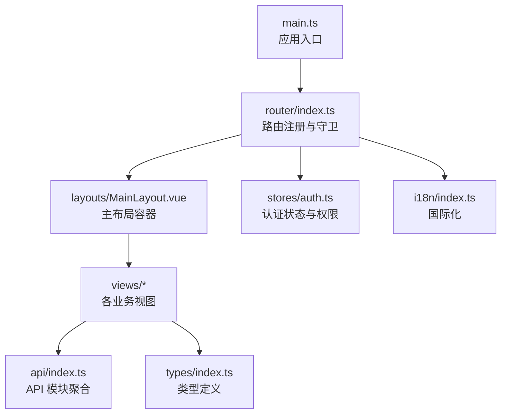
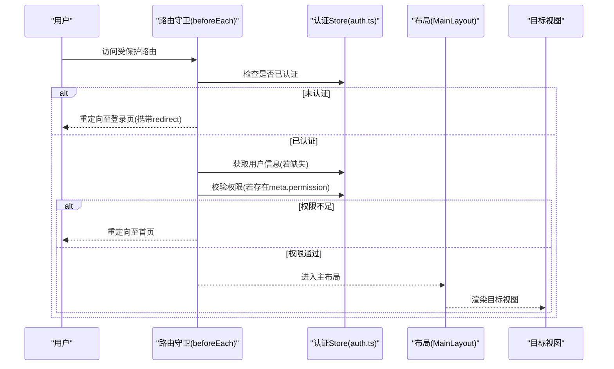
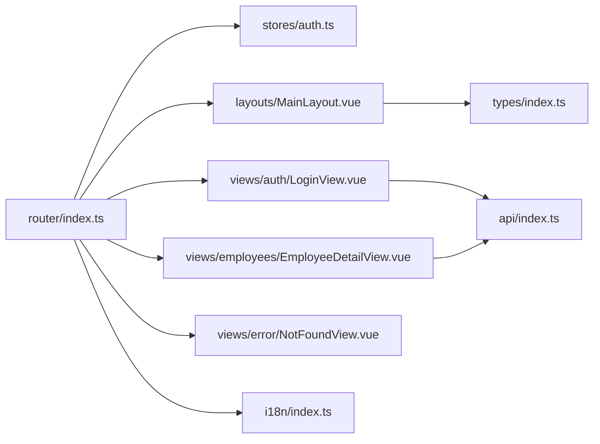

# 路由与导航

<cite>
**本文引用的文件**
- [router/index.ts](file://Frontend/hrevolve-web/src/router/index.ts)
- [main.ts](file://Frontend/hrevolve-web/src/main.ts)
- [views/auth/LoginView.vue](file://Frontend/hrevolve-web/src/views/auth/LoginView.vue)
- [views/employees/EmployeeDetailView.vue](file://Frontend/hrevolve-web/src/views/employees/EmployeeDetailView.vue)
- [views/error/NotFoundView.vue](file://Frontend/hrevolve-web/src/views/error/NotFoundView.vue)
- [layouts/MainLayout.vue](file://Frontend/hrevolve-web/src/layouts/MainLayout.vue)
- [stores/auth.ts](file://Frontend/hrevolve-web/src/stores/auth.ts)
- [types/index.ts](file://Frontend/hrevolve-web/src/types/index.ts)
- [i18n/index.ts](file://Frontend/hrevolve-web/src/i18n/index.ts)
- [api/index.ts](file://Frontend/hrevolve-web/src/api/index.ts)
</cite>

## 目录
1. [简介](#简介)
2. [项目结构](#项目结构)
3. [核心组件](#核心组件)
4. [架构总览](#架构总览)
5. [详细组件分析](#详细组件分析)
6. [依赖关系分析](#依赖关系分析)
7. [性能考量](#性能考量)
8. [故障排查指南](#故障排查指南)
9. [结论](#结论)
10. [附录](#附录)

## 简介
本文件围绕前端路由系统进行系统化梳理，重点覆盖 Vue Router 在本项目中的配置与实践，包括：
- 路由表定义方式：静态路由（如登录页）与动态路由（如员工详情页）的差异与配置要点
- 路由懒加载（import() 语法）的性能优势与在大型应用中的必要性
- 路由守卫（beforeEach）如何集成权限控制，阻止未授权访问
- 嵌套路由、命名视图、路由参数传递与查询参数处理的实际用例
- 编程式导航、路由元信息（meta 字段用于权限标识）与 404 路由兜底策略的实现

## 项目结构
路由相关的核心文件集中在前端工程的 router 目录，并与布局、视图、状态管理、国际化等模块协同工作。

图表来源
- [main.ts](file://Frontend/hrevolve-web/src/main.ts#L1-L28)
- [router/index.ts](file://Frontend/hrevolve-web/src/router/index.ts#L1-L416)
- [layouts/MainLayout.vue](file://Frontend/hrevolve-web/src/layouts/MainLayout.vue#L1-L800)
- [stores/auth.ts](file://Frontend/hrevolve-web/src/stores/auth.ts#L1-L119)
- [i18n/index.ts](file://Frontend/hrevolve-web/src/i18n/index.ts#L1-L62)
- [api/index.ts](file://Frontend/hrevolve-web/src/api/index.ts#L1-L19)
- [types/index.ts](file://Frontend/hrevolve-web/src/types/index.ts#L1-L771)

章节来源
- [main.ts](file://Frontend/hrevolve-web/src/main.ts#L1-L28)
- [router/index.ts](file://Frontend/hrevolve-web/src/router/index.ts#L1-L416)

## 核心组件
- 路由表与守卫：集中于路由文件，负责页面级权限与导航控制
- 主布局：承载面包屑、侧边栏、主内容区，配合路由元信息生成标题与菜单
- 认证状态与权限：Pinia Store 提供 hasPermission、hasRole 等能力
- 国际化：通过 meta.titleKey 与翻译键配合，实现页面标题与菜单文案的国际化
- 视图组件：包含登录页、员工详情页、404 错误页等

章节来源
- [router/index.ts](file://Frontend/hrevolve-web/src/router/index.ts#L1-L416)
- [layouts/MainLayout.vue](file://Frontend/hrevolve-web/src/layouts/MainLayout.vue#L1-L800)
- [stores/auth.ts](file://Frontend/hrevolve-web/src/stores/auth.ts#L1-L119)
- [i18n/index.ts](file://Frontend/hrevolve-web/src/i18n/index.ts#L1-L62)

## 架构总览
路由系统采用“路由表 + 路由守卫 + 布局 + 视图”的分层设计，结合 Pinia 认证状态与权限判断，形成统一的导航与安全控制。

图表来源
- [router/index.ts](file://Frontend/hrevolve-web/src/router/index.ts#L376-L414)
- [stores/auth.ts](file://Frontend/hrevolve-web/src/stores/auth.ts#L1-L119)
- [layouts/MainLayout.vue](file://Frontend/hrevolve-web/src/layouts/MainLayout.vue#L1-L800)

## 详细组件分析

### 路由表与静态/动态路由配置
- 静态路由
  - 登录页：路径固定，无需认证，meta.requiresAuth=false
  - 404 路由兜底：通配路径捕获未匹配路由
- 动态路由
  - 员工详情页：路径包含参数 :id，用于从后端拉取数据并渲染
- 嵌套路由
  - 根布局下挂载多级菜单，每个功能域（组织、员工、考勤、假期、薪酬、公司、排班、报销、保险、报税、系统设置）以 children 形式组织
- 命名视图
  - 通过具名插槽 router-view 渲染主内容区，配合布局过渡动画

章节来源
- [router/index.ts](file://Frontend/hrevolve-web/src/router/index.ts#L1-L369)
- [views/employees/EmployeeDetailView.vue](file://Frontend/hrevolve-web/src/views/employees/EmployeeDetailView.vue#L1-L64)
- [layouts/MainLayout.vue](file://Frontend/hrevolve-web/src/layouts/MainLayout.vue#L398-L404)

### 路由懒加载与性能优势
- 路由懒加载通过 import() 语法按需加载视图组件，避免首屏加载全部模块，显著降低初始包体积与首屏时间
- 在大型应用中，懒加载是必要的性能手段，可减少主线程阻塞，改善交互流畅度

章节来源
- [router/index.ts](file://Frontend/hrevolve-web/src/router/index.ts#L1-L369)

### 路由守卫与权限控制
- 不需要认证的页面：直接放行；若已登录且访问登录页，则重定向至首页
- 需要认证的页面：未登录则重定向至登录页并携带 redirect 参数
- 获取用户信息：若用户信息缺失，先拉取用户信息
- 权限校验：读取 meta.permission，调用 hasPermission 判断；开发环境跳过权限检查
- 页面标题：通过 meta.titleKey 与国际化配合，动态设置页面标题

章节来源
- [router/index.ts](file://Frontend/hrevolve-web/src/router/index.ts#L376-L414)
- [stores/auth.ts](file://Frontend/hrevolve-web/src/stores/auth.ts#L1-L119)
- [i18n/index.ts](file://Frontend/hrevolve-web/src/i18n/index.ts#L1-L62)

### 嵌套路由与命名视图
- 嵌套路由：根布局 children 中按功能域划分子路由，支持多级嵌套
- 命名视图：布局中通过 router-view 渲染主内容区，配合过渡动画提升用户体验

章节来源
- [router/index.ts](file://Frontend/hrevolve-web/src/router/index.ts#L12-L361)
- [layouts/MainLayout.vue](file://Frontend/hrevolve-web/src/layouts/MainLayout.vue#L398-L404)

### 路由参数传递与查询参数处理
- 路由参数（动态段）：员工详情页通过 :id 获取参数，组件内读取 route.params.id 并发起并发请求
- 查询参数（query）：登录页在未登录时重定向携带 redirect，登录成功后根据 redirect 或默认路径跳转

章节来源
- [router/index.ts](file://Frontend/hrevolve-web/src/router/index.ts#L97-L102)
- [views/employees/EmployeeDetailView.vue](file://Frontend/hrevolve-web/src/views/employees/EmployeeDetailView.vue#L16-L24)
- [views/auth/LoginView.vue](file://Frontend/hrevolve-web/src/views/auth/LoginView.vue#L40-L56)

### 编程式导航
- 登录成功后：根据 query.redirect 或默认路径进行 push 导航
- 错误页返回：点击按钮后 push 回首页
- 布局中：用户下拉菜单项使用 router.push 导航到个人资料页

章节来源
- [views/auth/LoginView.vue](file://Frontend/hrevolve-web/src/views/auth/LoginView.vue#L40-L56)
- [views/error/NotFoundView.vue](file://Frontend/hrevolve-web/src/views/error/NotFoundView.vue#L10-L13)
- [layouts/MainLayout.vue](file://Frontend/hrevolve-web/src/layouts/MainLayout.vue#L382-L391)

### 路由元信息（meta）与 404 路由兜底
- meta 字段用途：
  - requiresAuth：标记页面是否需要认证
  - permission：标记所需权限字符串，用于守卫校验
  - titleKey：用于国际化标题与菜单文案
- 404 路由兜底：通配路径捕获未匹配路由，统一跳转到错误页

章节来源
- [router/index.ts](file://Frontend/hrevolve-web/src/router/index.ts#L1-L369)
- [views/error/NotFoundView.vue](file://Frontend/hrevolve-web/src/views/error/NotFoundView.vue#L1-L29)

### 登录页与认证流程
- 登录页通过表单校验与认证 Store 登录，成功后根据 redirect 或默认路径跳转
- 认证 Store 提供登录、刷新令牌、获取用户信息、登出等能力

章节来源
- [views/auth/LoginView.vue](file://Frontend/hrevolve-web/src/views/auth/LoginView.vue#L1-L762)
- [stores/auth.ts](file://Frontend/hrevolve-web/src/stores/auth.ts#L1-L119)

### 员工详情页与参数解析
- 通过路由参数 :id 获取员工 ID
- 并发请求员工信息与职位历史，渲染详情卡片与时间线

章节来源
- [views/employees/EmployeeDetailView.vue](file://Frontend/hrevolve-web/src/views/employees/EmployeeDetailView.vue#L1-L64)

## 依赖关系分析
- 路由文件依赖认证 Store 进行权限判断与用户信息获取
- 布局文件依赖路由元信息生成面包屑与菜单
- 视图组件依赖 API 模块与类型定义
- 国际化模块与路由 meta.titleKey 协作，实现标题与菜单文案国际化

图表来源
- [router/index.ts](file://Frontend/hrevolve-web/src/router/index.ts#L1-L416)
- [stores/auth.ts](file://Frontend/hrevolve-web/src/stores/auth.ts#L1-L119)
- [layouts/MainLayout.vue](file://Frontend/hrevolve-web/src/layouts/MainLayout.vue#L1-L800)
- [views/auth/LoginView.vue](file://Frontend/hrevolve-web/src/views/auth/LoginView.vue#L1-L762)
- [views/employees/EmployeeDetailView.vue](file://Frontend/hrevolve-web/src/views/employees/EmployeeDetailView.vue#L1-L64)
- [views/error/NotFoundView.vue](file://Frontend/hrevolve-web/src/views/error/NotFoundView.vue#L1-L29)
- [types/index.ts](file://Frontend/hrevolve-web/src/types/index.ts#L1-L771)
- [api/index.ts](file://Frontend/hrevolve-web/src/api/index.ts#L1-L19)
- [i18n/index.ts](file://Frontend/hrevolve-web/src/i18n/index.ts#L1-L62)

## 性能考量
- 路由懒加载：通过 import() 语法按需加载视图，降低首屏体积与加载时间
- 布局与菜单：使用浅响应式与图标标记避免响应式转换开销，减少渲染压力
- 动画与过渡：布局中使用过渡动画，兼顾美观与性能
- 开发环境权限豁免：开发阶段跳过权限检查，减少守卫逻辑开销

章节来源
- [router/index.ts](file://Frontend/hrevolve-web/src/router/index.ts#L1-L369)
- [layouts/MainLayout.vue](file://Frontend/hrevolve-web/src/layouts/MainLayout.vue#L1-L800)

## 故障排查指南
- 无法进入受保护页面
  - 检查 meta.requiresAuth 与 meta.permission 是否正确设置
  - 确认认证 Store 是否已登录且用户信息已拉取
- 登录后未回到原页面
  - 检查登录页重定向逻辑与 redirect 查询参数
- 权限不足被重定向
  - 确认用户权限集合是否包含所需 permission
  - 开发环境可能跳过权限检查
- 404 页面未显示
  - 检查通配路径配置是否正确
  - 确认未被其他路由覆盖

章节来源
- [router/index.ts](file://Frontend/hrevolve-web/src/router/index.ts#L376-L414)
- [views/auth/LoginView.vue](file://Frontend/hrevolve-web/src/views/auth/LoginView.vue#L40-L56)
- [stores/auth.ts](file://Frontend/hrevolve-web/src/stores/auth.ts#L1-L119)

## 结论
本项目的路由体系通过“路由表 + 路由守卫 + 布局 + 视图”的清晰分层，结合 Pinia 认证与权限、国际化与懒加载策略，实现了安全、可维护、高性能的前端导航体验。建议在大型应用中坚持使用懒加载与权限守卫，确保首屏性能与访问安全。

## 附录
- 类型与 API：统一导出 API 模块，便于视图组件按需引入
- 国际化：通过 meta.titleKey 与翻译键配合，实现标题与菜单文案国际化

章节来源
- [api/index.ts](file://Frontend/hrevolve-web/src/api/index.ts#L1-L19)
- [types/index.ts](file://Frontend/hrevolve-web/src/types/index.ts#L1-L771)
- [i18n/index.ts](file://Frontend/hrevolve-web/src/i18n/index.ts#L1-L62)