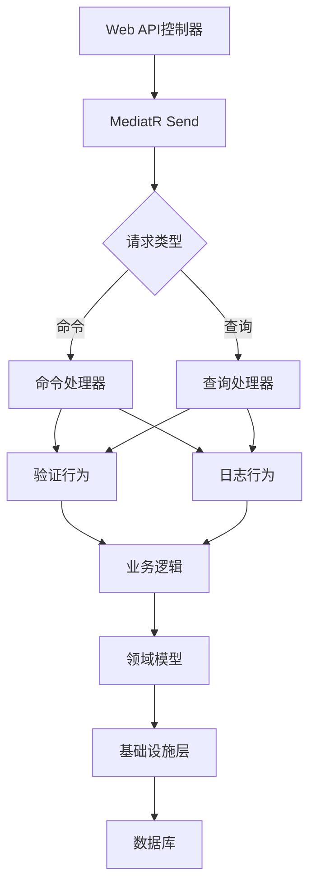
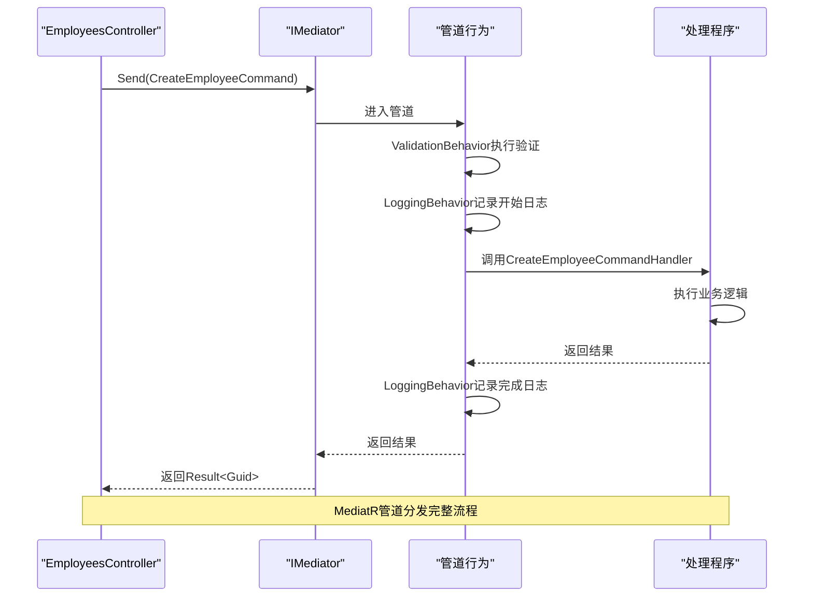
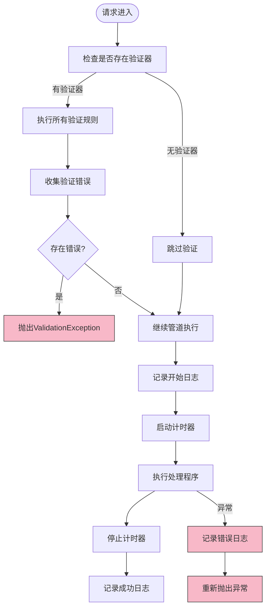

# CQRS与MediatR

<cite>
**本文档中引用的文件**   
- [CreateEmployeeCommand.cs](file://Backend/Hrevolve.Application/Employees/Commands/CreateEmployeeCommand.cs)
- [GetEmployeeQuery.cs](file://Backend/Hrevolve.Application/Employees/Queries/GetEmployeeQuery.cs)
- [ValidationBehavior.cs](file://Backend/Hrevolve.Application/Behaviors/ValidationBehavior.cs)
- [LoggingBehavior.cs](file://Backend/Hrevolve.Application/Behaviors/LoggingBehavior.cs)
- [DependencyInjection.cs](file://Backend/Hrevolve.Application/DependencyInjection.cs)
- [EmployeesController.cs](file://Backend/Hrevolve.Web/Controllers/EmployeesController.cs)
- [HrevolveException.cs](file://Backend/Hrevolve.Shared/Exceptions/HrevolveException.cs)
- [Result.cs](file://Backend/Hrevolve.Shared/Results/Result.cs)
- [EmployeeRepository.cs](file://Backend/Hrevolve.Infrastructure/Persistence/Repositories/EmployeeRepository.cs)
- [CreateLeaveRequestCommand.cs](file://Backend/Hrevolve.Application/Leave/Commands/CreateLeaveRequestCommand.cs)
- [Program.cs](file://Backend/Hrevolve.Web/Program.cs)
</cite>

## 目录
1. [引言](#引言)
2. [CQRS与MediatR架构概述](#cqrs与mediatr架构概述)
3. [命令与查询的分离设计](#命令与查询的分离设计)
4. [MediatR管道分发机制](#mediatr管道分发机制)
5. [行为过滤器执行流程](#行为过滤器执行流程)
6. [请求验证与FluentValidation集成](#请求验证与fluentvalidation集成)
7. [自定义行为管道扩展](#自定义行为管道扩展)
8. [错误处理模式](#错误处理模式)
9. [结论](#结论)

## 引言
Hrevolve系统采用CQRS（命令查询职责分离）模式与MediatR框架实现业务逻辑的清晰分离和请求处理的管道化。该架构将数据修改操作（命令）与数据读取操作（查询）完全分离，通过MediatR中介者模式实现请求的统一分发和处理。系统通过行为管道（Pipeline Behavior）实现了横切关注点的集中处理，如验证、日志记录等，提高了代码的可维护性和可扩展性。

## CQRS与MediatR架构概述



**图示来源**
- [EmployeesController.cs](file://Backend/Hrevolve.Web/Controllers/EmployeesController.cs)
- [CreateEmployeeCommand.cs](file://Backend/Hrevolve.Application/Employees/Commands/CreateEmployeeCommand.cs)
- [GetEmployeeQuery.cs](file://Backend/Hrevolve.Application/Employees/Queries/GetEmployeeQuery.cs)
- [ValidationBehavior.cs](file://Backend/Hrevolve.Application/Behaviors/ValidationBehavior.cs)
- [LoggingBehavior.cs](file://Backend/Hrevolve.Application/Behaviors/LoggingBehavior.cs)

## 命令与查询的分离设计

在Hrevolve系统中，命令和查询被严格分离，遵循CQRS模式的核心原则。命令用于修改系统状态，返回操作结果；查询用于获取数据，不产生副作用。

### 命令设计示例：CreateEmployeeCommand
`CreateEmployeeCommand`是一个典型的命令对象，继承自`IRequest<Result<Guid>>`，表示该命令执行后将返回一个包含`Guid`类型结果的`Result`对象。命令包含了创建员工所需的所有必要信息，如员工编号、姓名、性别、出生日期等。

### 查询设计示例：GetEmployeeQuery
`GetEmployeeQuery`是一个典型的查询对象，继承自`IRequest<Result<EmployeeDto>>`，表示该查询将返回一个包含`EmployeeDto`类型数据的结果。查询仅包含获取员工信息所需的参数，如员工ID。

**本节来源**
- [CreateEmployeeCommand.cs](file://Backend/Hrevolve.Application/Employees/Commands/CreateEmployeeCommand.cs)
- [GetEmployeeQuery.cs](file://Backend/Hrevolve.Application/Employees/Queries/GetEmployeeQuery.cs)

## MediatR管道分发机制

MediatR框架在Hrevolve系统中充当请求分发的中枢，实现了请求与处理程序之间的解耦。当Web控制器通过`IMediator`接口的`Send`方法发送请求时，MediatR会根据请求类型自动路由到相应的处理程序。

### 请求处理流程
1. Web控制器调用`mediator.Send()`发送请求
2. MediatR根据请求类型查找注册的处理程序
3. 请求通过行为管道（Pipeline）进行预处理
4. 执行具体的命令或查询处理程序
5. 返回处理结果

### 管道行为注册
在`DependencyInjection.cs`文件中，系统通过`AddMediatR`配置将`ValidationBehavior`和`LoggingBehavior`注册为全局管道行为，确保所有请求都会经过这些行为的处理。



**图示来源**
- [EmployeesController.cs](file://Backend/Hrevolve.Web/Controllers/EmployeesController.cs)
- [DependencyInjection.cs](file://Backend/Hrevolve.Application/DependencyInjection.cs)
- [CreateEmployeeCommand.cs](file://Backend/Hrevolve.Application/Employees/Commands/CreateEmployeeCommand.cs)

## 行为过滤器执行流程

Hrevolve系统通过MediatR的管道行为机制实现了横切关注点的集中处理。两个核心行为过滤器`ValidationBehavior`和`LoggingBehavior`在请求处理过程中发挥着重要作用。

### ValidationBehavior执行流程
`ValidationBehavior`是基于FluentValidation的自动验证管道行为。当请求进入管道时，该行为会自动查找与请求类型匹配的验证器并执行验证。

1. 检查是否存在针对当前请求的验证器
2. 创建验证上下文并执行所有验证规则
3. 收集验证错误并分组
4. 如果存在验证错误，抛出`ValidationException`
5. 如果验证通过，继续执行后续管道

### LoggingBehavior执行流程
`LoggingBehavior`负责记录请求处理的完整生命周期日志，包括开始、完成和异常情况。

1. 记录请求开始日志，包含请求名称、用户ID和租户ID
2. 启动性能计时器
3. 执行后续管道和处理程序
4. 记录请求完成日志，包含处理耗时
5. 如果发生异常，记录错误日志并重新抛出异常



**图示来源**
- [ValidationBehavior.cs](file://Backend/Hrevolve.Application/Behaviors/ValidationBehavior.cs)
- [LoggingBehavior.cs](file://Backend/Hrevolve.Application/Behaviors/LoggingBehavior.cs)

## 请求验证与FluentValidation集成

Hrevolve系统通过FluentValidation库实现了声明式的请求验证机制。每个命令或查询都可以拥有对应的验证器，验证规则以流畅的API形式定义。

### 验证器实现
在`CreateEmployeeCommandValidator`中，系统定义了员工创建命令的验证规则，包括：
- 员工编号不能为空且长度不超过50字符
- 姓名和姓氏不能为空
- 出生日期必须早于当前日期
- 邮箱格式必须正确（如果提供）
- 职位和部门不能为空
- 基本工资不能为负数

### 验证错误处理
当验证失败时，`ValidationBehavior`会收集所有验证错误并抛出`ValidationException`，该异常包含详细的错误信息字典，键为属性名，值为该属性的所有错误消息数组。

**本节来源**
- [CreateEmployeeCommand.cs](file://Backend/Hrevolve.Application/Employees/Commands/CreateEmployeeCommand.cs)
- [ValidationBehavior.cs](file://Backend/Hrevolve.Application/Behaviors/ValidationBehavior.cs)
- [HrevolveException.cs](file://Backend/Hrevolve.Shared/Exceptions/HrevolveException.cs)

## 自定义行为管道扩展

Hrevolve系统的管道行为设计具有良好的扩展性，可以轻松添加新的行为来增强请求处理能力。

### 性能监控行为
可以创建`PerformanceMonitoringBehavior`来监控关键操作的性能指标：

```csharp
public class PerformanceMonitoringBehavior<TRequest, TResponse>(
    IMetrics metrics) : IPipelineBehavior<TRequest, TResponse>
{
    public async Task<TResponse> Handle(
        TRequest request,
        RequestHandlerDelegate<TResponse> next,
        CancellationToken cancellationToken)
    {
        var timer = metrics.Measure.Timer.Time("request_duration", new[] {
            new KeyValuePair<string, object>("request_type", typeof(TRequest).Name)
        });
        
        try
        {
            return await next();
        }
        finally
        {
            timer.Dispose();
        }
    }
}
```

### 事务控制行为
可以创建`TransactionBehavior`来确保命令处理的原子性：

```csharp
public class TransactionBehavior<TRequest, TResponse>(
    IUnitOfWork unitOfWork) : IPipelineBehavior<TRequest, TResponse>
{
    public async Task<TResponse> Handle(
        TRequest request,
        RequestHandlerDelegate<TResponse> next,
        CancellationToken cancellationToken)
    {
        if (request is not ICommand) // 仅对命令使用事务
            return await next();
            
        await unitOfWork.BeginTransactionAsync(cancellationToken);
        
        try
        {
            var response = await next();
            await unitOfWork.CommitTransactionAsync(cancellationToken);
            return response;
        }
        catch
        {
            await unitOfWork.RollbackTransactionAsync(cancellationToken);
            throw;
        }
    }
}
```

**本节来源**
- [ValidationBehavior.cs](file://Backend/Hrevolve.Application/Behaviors/ValidationBehavior.cs)
- [LoggingBehavior.cs](file://Backend/Hrevolve.Application/Behaviors/LoggingBehavior.cs)
- [DependencyInjection.cs](file://Backend/Hrevolve.Application/DependencyInjection.cs)

## 错误处理模式

Hrevolve系统采用统一的错误处理模式，通过自定义异常类型和全局异常处理中间件实现一致的错误响应。

### 异常类型体系
系统定义了层次化的异常类型：
- `HrevolveException`：所有业务异常的基类
- `ValidationException`：验证失败异常
- `EntityNotFoundException`：实体未找到异常
- `ForbiddenException`：权限不足异常
- `UnauthorizedException`：未授权异常
- `ConcurrencyException`：并发冲突异常

### 全局异常处理
`ExceptionHandlingMiddleware`捕获所有未处理的异常，并将其转换为标准化的错误响应格式，包含错误代码、消息和详细的验证错误信息。

**本节来源**
- [HrevolveException.cs](file://Backend/Hrevolve.Shared/Exceptions/HrevolveException.cs)
- [Result.cs](file://Backend/Hrevolve.Shared/Results/Result.cs)
- [EmployeesController.cs](file://Backend/Hrevolve.Web/Controllers/EmployeesController.cs)

## 结论
Hrevolve系统通过CQRS模式与MediatR框架的结合，实现了清晰的架构分离和灵活的请求处理机制。命令与查询的分离确保了业务逻辑的单一职责，MediatR的管道行为机制提供了强大的横切关注点处理能力。通过FluentValidation的集成，系统实现了声明式的请求验证，而统一的异常处理模式确保了API响应的一致性。这种架构设计不仅提高了代码的可维护性和可测试性，还为未来的功能扩展提供了坚实的基础。