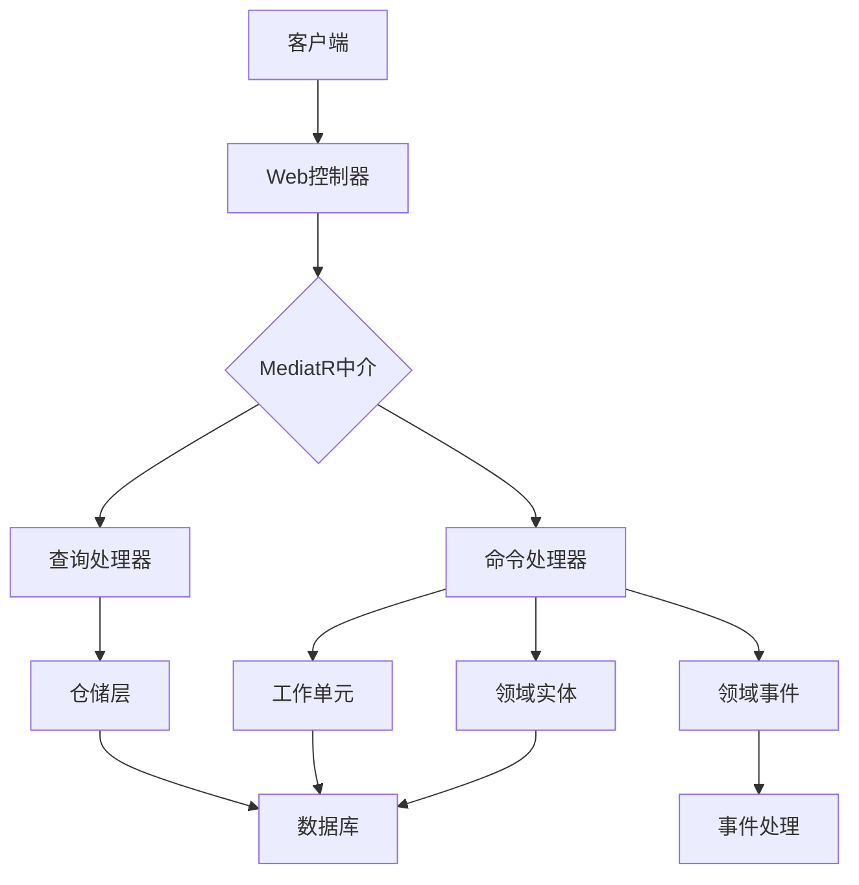
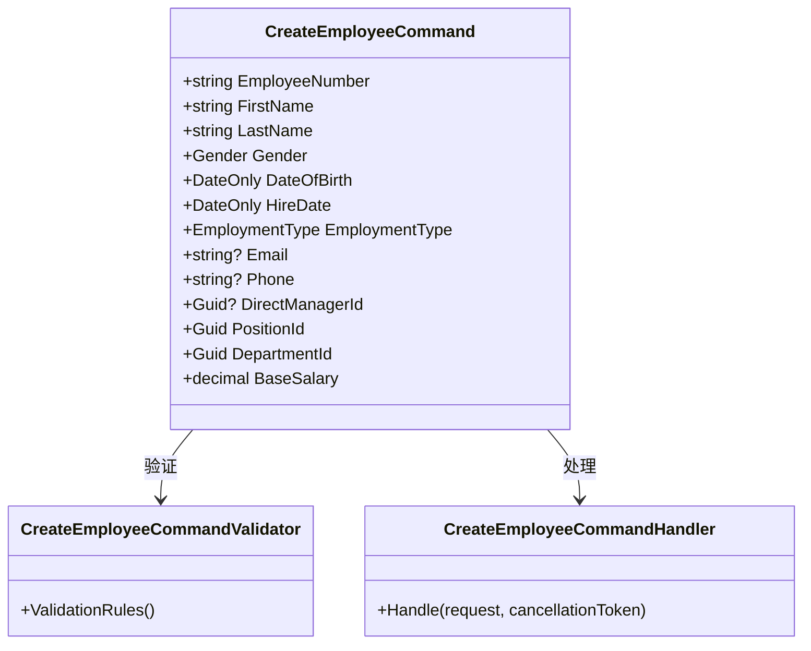
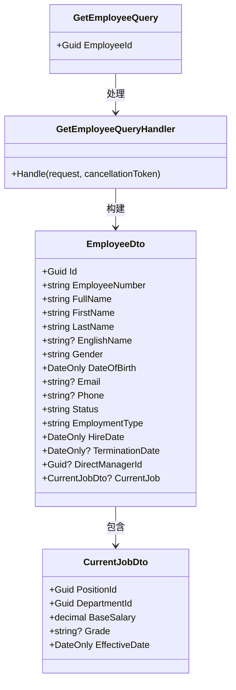
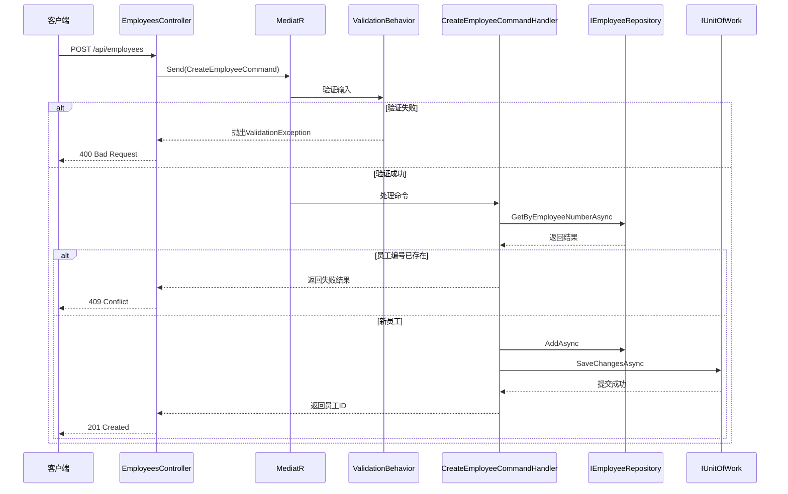
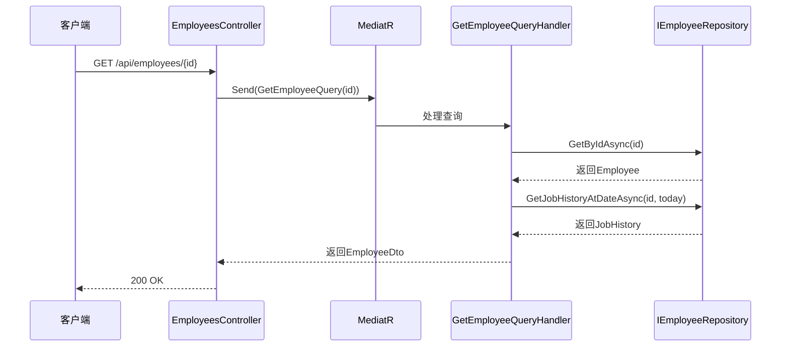
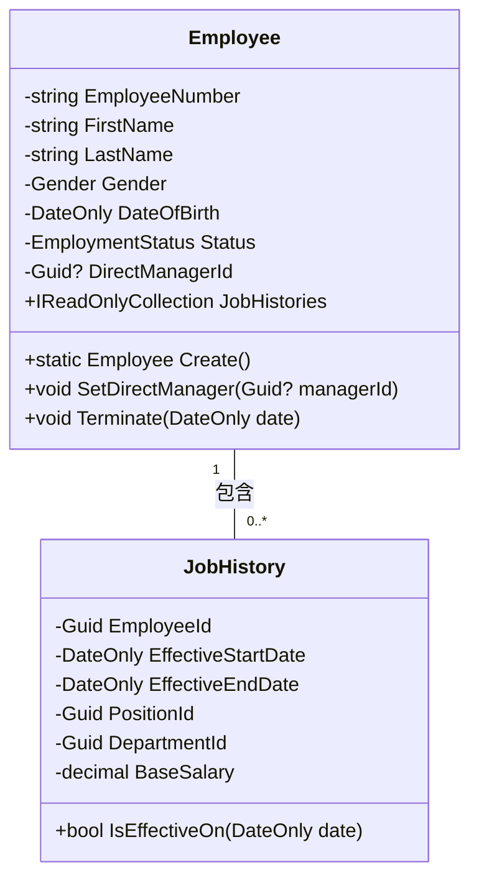

# CQRS模式概念

<cite>
**本文档中引用的文件**   
- [CreateEmployeeCommand.cs](file://Backend/Hrevolve.Application/Employees/Commands/CreateEmployeeCommand.cs)
- [GetEmployeeQuery.cs](file://Backend/Hrevolve.Application/Employees/Queries/GetEmployeeQuery.cs)
- [Employee.cs](file://Backend/Hrevolve.Domain/Employees/Employee.cs)
- [EmployeeRepository.cs](file://Backend/Hrevolve.Infrastructure/Persistence/Repositories/EmployeeRepository.cs)
- [ValidationBehavior.cs](file://Backend/Hrevolve.Application/Behaviors/ValidationBehavior.cs)
- [LoggingBehavior.cs](file://Backend/Hrevolve.Application/Behaviors/LoggingBehavior.cs)
- [EmployeesController.cs](file://Backend/Hrevolve.Web/Controllers/EmployeesController.cs)
- [Result.cs](file://Backend/Hrevolve.Shared/Results/Result.cs)
- [TenantResolver.cs](file://Backend/Hrevolve.Infrastructure/MultiTenancy/TenantResolver.cs)
- [JobHistory.cs](file://Backend/Hrevolve.Domain/Employees/JobHistory.cs)
</cite>

## 目录
1. [引言](#引言)
2. [CQRS架构概述](#cqrs架构概述)
3. [命令与查询分离的设计原则](#命令与查询分离的设计原则)
4. [核心实现分析](#核心实现分析)
5. [数据流向与处理流程](#数据流向与处理流程)
6. [领域驱动设计中的聚合根保护](#领域驱动设计中的聚合根保护)
7. [并发冲突的减少机制](#并发冲突的减少机制)
8. [使用场景示例](#使用场景示例)
9. [潜在复杂性与数据一致性挑战](#潜在复杂性与数据一致性挑战)
10. [应对策略与最佳实践](#应对策略与最佳实践)
11. [结论](#结论)

## 引言
CQRS（命令查询职责分离）是一种将读操作与写操作分离的架构模式，在Hrevolve系统中被广泛应用于提升系统的可维护性与性能。通过将创建员工等写操作与获取员工信息等读操作解耦，系统能够独立优化各自的处理路径。该模式不仅支持领域驱动设计中的聚合根保护，还有效减少了高并发环境下的数据冲突。本文将深入探讨CQRS在Hrevolve系统中的具体实现，结合`CreateEmployeeCommand`和`GetEmployeeQuery`两个核心组件，阐述其设计原则、数据流向及实际应用场景。

## CQRS架构概述
在Hrevolve系统中，CQRS模式通过MediatR库实现请求的中介处理，使得命令（Commands）和查询（Queries）可以分别由不同的处理器进行处理。这种分离允许系统针对写操作和读操作采用不同的数据模型和优化策略。例如，写操作关注数据一致性和业务规则验证，而读操作则侧重于高效的数据检索和投影。整个架构依托于依赖注入机制，确保各层之间的松耦合，同时通过行为管道（Behaviors）实现了横切关注点如日志记录和输入验证的统一管理。

**图示来源**
- [EmployeesController.cs](file://Backend/Hrevolve.Web/Controllers/EmployeesController.cs#L6-L106)
- [CreateEmployeeCommand.cs](file://Backend/Hrevolve.Application/Employees/Commands/CreateEmployeeCommand.cs#L1-L126)
- [GetEmployeeQuery.cs](file://Backend/Hrevolve.Application/Employees/Queries/GetEmployeeQuery.cs#L1-L146)

## 命令与查询分离的设计原则
Hrevolve系统遵循CQRS的核心设计原则，即命令不返回数据，查询不修改状态。`CreateEmployeeCommand`作为典型的命令对象，仅负责执行创建员工的业务逻辑，并返回操作结果标识符；而`GetEmployeeQuery`则专注于从仓储中提取员工信息并封装为DTO返回。这种职责分离确保了每个组件的单一性，提升了代码的可测试性和可维护性。此外，命令通常包含完整的业务验证逻辑，而查询则可利用缓存或物化视图提高响应速度。

**本节来源**
- [CreateEmployeeCommand.cs](file://Backend/Hrevolve.Application/Employees/Commands/CreateEmployeeCommand.cs#L6-L65)
- [GetEmployeeQuery.cs](file://Backend/Hrevolve.Application/Employees/Queries/GetEmployeeQuery.cs#L38-L41)

## 核心实现分析
### CreateEmployeeCommand 实现分析
`CreateEmployeeCommand` 是一个记录类型（record），定义了创建员工所需的所有必要字段，包括员工编号、姓名、性别、出生日期等。其对应的验证器 `CreateEmployeeCommandValidator` 使用FluentValidation对输入数据进行严格校验，确保业务规则的一致性。命令处理器 `CreateEmployeeCommandHandler` 接收请求后，首先检查员工编号是否已存在，随后调用领域工厂方法 `Employee.Create` 创建新员工实例，并通过仓储保存到数据库。

**图示来源**
- [CreateEmployeeCommand.cs](file://Backend/Hrevolve.Application/Employees/Commands/CreateEmployeeCommand.cs#L6-L126)

**本节来源**
- [CreateEmployeeCommand.cs](file://Backend/Hrevolve.Application/Employees/Commands/CreateEmployeeCommand.cs#L6-L126)

### GetEmployeeQuery 实现分析
`GetEmployeeQuery` 接收员工ID作为参数，其处理器 `GetEmployeeQueryHandler` 通过 `IEmployeeRepository` 获取员工实体，并结合 `JobHistory` 查询当前职位信息，最终构造成 `EmployeeDto` 返回。该查询支持历史时点查询功能，允许获取员工在过去任意时间点的组织状态，体现了SCD（缓慢变化维度）Type 2的设计思想。

**图示来源**
- [GetEmployeeQuery.cs](file://Backend/Hrevolve.Application/Employees/Queries/GetEmployeeQuery.cs#L38-L146)

**本节来源**
- [GetEmployeeQuery.cs](file://Backend/Hrevolve.Application/Employees/Queries/GetEmployeeQuery.cs#L38-L146)

## 数据流向与处理流程
### 命令处理流程
当客户端发起创建员工请求时，`EmployeesController` 接收 `CreateEmployeeCommand` 并通过 `IMediator.Send` 方法将其发送至MediatR管道。首先经过 `ValidationBehavior` 进行输入验证，若通过则进入 `LoggingBehavior` 记录日志，最后由 `CreateEmployeeCommandHandler` 执行实际业务逻辑。处理器使用 `IEmployeeRepository` 检查唯一性约束，创建领域对象，并通过 `IUnitOfWork` 提交事务。

**图示来源**
- [EmployeesController.cs](file://Backend/Hrevolve.Web/Controllers/EmployeesController.cs#L48-L66)
- [CreateEmployeeCommand.cs](file://Backend/Hrevolve.Application/Employees/Commands/CreateEmployeeCommand.cs#L69-L125)
- [ValidationBehavior.cs](file://Backend/Hrevolve.Application/Behaviors/ValidationBehavior.cs#L1-L43)

### 查询处理流程
获取员工信息的查询流程相对简单。`EmployeesController` 接收员工ID后，构造 `GetEmployeeQuery` 并通过MediatR分发。由于查询操作无需验证，直接由 `GetEmployeeQueryHandler` 处理，从仓储中获取员工及其职位历史，并组装成DTO返回。

**图示来源**
- [EmployeesController.cs](file://Backend/Hrevolve.Web/Controllers/EmployeesController.cs#L12-L27)
- [GetEmployeeQuery.cs](file://Backend/Hrevolve.Application/Employees/Queries/GetEmployeeQuery.cs#L46-L90)

## 领域驱动设计中的聚合根保护
在Hrevolve系统中，`Employee` 作为员工管理的聚合根，其内部状态通过私有setter和领域服务方法进行保护。例如，`SetDirectManager` 方法用于修改直属上级，而非直接暴露 `DirectManagerId` 属性。命令处理器在创建员工时调用 `Employee.Create` 工厂方法，确保所有必需字段都被正确初始化。此外，`JobHistory` 实体作为子实体，通过SCD Type 2机制记录员工职位变更历史，既保证了历史数据的完整性，又避免了对主聚合根的频繁更新。

**图示来源**
- [Employee.cs](file://Backend/Hrevolve.Domain/Employees/Employee.cs#L6-L137)
- [JobHistory.cs](file://Backend/Hrevolve.Domain/Employees/JobHistory.cs#L9-L124)

**本节来源**
- [Employee.cs](file://Backend/Hrevolve.Domain/Employees/Employee.cs#L6-L137)
- [JobHistory.cs](file://Backend/Hrevolve.Domain/Employees/JobHistory.cs#L9-L124)

## 并发冲突的减少机制
CQRS模式通过分离读写路径显著降低了并发冲突的可能性。在Hrevolve系统中，写操作集中在 `CreateEmployeeCommandHandler` 中，通过数据库唯一约束和应用层检查双重保障员工编号的唯一性。而读操作完全无状态，可自由扩展多个只读副本以应对高并发查询。此外，`JobHistory` 的SCD Type 2设计使得历史数据查询不会影响当前记录的写入性能，进一步提升了系统的并发处理能力。

**本节来源**
- [CreateEmployeeCommand.cs](file://Backend/Hrevolve.Application/Employees/Commands/CreateEmployeeCommand.cs#L80-L85)
- [EmployeeRepository.cs](file://Backend/Hrevolve.Infrastructure/Persistence/Repositories/EmployeeRepository.cs#L31-L35)

## 使用场景示例
### 高并发写入与复杂查询解耦
在一个大型企业人力资源系统中，每月初可能有数百名新员工集中入职，形成写操作高峰。与此同时，各级管理者需要频繁查询员工信息以进行审批和报表生成。通过CQRS模式，Hrevolve系统可以将写操作路由到主数据库，而将复杂的组织架构查询、历史数据追溯等操作分流至只读副本或缓存层，从而实现负载均衡和性能优化。

### 历史时点查询
`GetEmployeeAtDateQuery` 支持查询员工在过去任意时间点的职位状态，这对于薪资审计、组织结构调整分析等场景至关重要。例如，财务部门在计算某季度奖金时，需要准确获取员工当时的职级和薪资信息，而这一需求正是通过 `JobHistory.GetJobHistoryAtDateAsync` 实现的。

**本节来源**
- [GetEmployeeQuery.cs](file://Backend/Hrevolve.Application/Employees/Queries/GetEmployeeQuery.cs#L96-L145)
- [EmployeeRepository.cs](file://Backend/Hrevolve.Infrastructure/Persistence/Repositories/EmployeeRepository.cs#L70-L81)

## 潜在复杂性与数据一致性挑战
尽管CQRS带来了诸多优势，但也引入了新的复杂性。最显著的问题是命令与查询模型之间的数据同步延迟，可能导致“写后读不一致”现象。此外，维护两套数据访问逻辑增加了开发和测试成本。在Hrevolve系统中，虽然目前使用同一数据库进行读写，但未来若引入事件溯源或分布式查询服务，将面临更严峻的一致性挑战。

**本节来源**
- [GetEmployeeQuery.cs](file://Backend/Hrevolve.Application/Employees/Queries/GetEmployeeQuery.cs#L58-L61)
- [CreateEmployeeCommand.cs](file://Backend/Hrevolve.Application/Employees/Commands/CreateEmployeeCommand.cs#L121-L123)

## 应对策略与最佳实践
为应对上述挑战，Hrevolve系统采取了以下策略：
1. **明确边界**：严格区分命令与查询的职责，避免混合操作。
2. **统一结果封装**：使用 `Result<T>` 类型统一处理成功与失败响应，提升API一致性。
3. **管道行为复用**：通过 `ValidationBehavior` 和 `LoggingBehavior` 实现横切关注点的集中管理。
4. **租户上下文集成**：在命令处理中自动注入租户信息，确保多租户数据隔离。
5. **领域事件驱动**：通过 `AddDomainEvent` 机制为未来扩展事件溯源奠定基础。

**本节来源**
- [Result.cs](file://Backend/Hrevolve.Shared/Results/Result.cs#L6-L88)
- [ValidationBehavior.cs](file://Backend/Hrevolve.Application/Behaviors/ValidationBehavior.cs#L1-L43)
- [LoggingBehavior.cs](file://Backend/Hrevolve.Application/Behaviors/LoggingBehavior.cs#L1-L51)
- [TenantResolver.cs](file://Backend/Hrevolve.Infrastructure/MultiTenancy/TenantResolver.cs#L1-L108)

## 结论
CQRS模式在Hrevolve系统中的应用显著提升了系统的可维护性和性能。通过对 `CreateEmployeeCommand` 和 `GetEmployeeQuery` 的深入分析，可以看出该模式不仅实现了读写分离，还促进了领域驱动设计的落地。尽管存在一定的复杂性，但通过合理的架构设计和最佳实践，Hrevolve系统成功地平衡了性能、可维护性和扩展性之间的关系，为未来的发展奠定了坚实的基础。