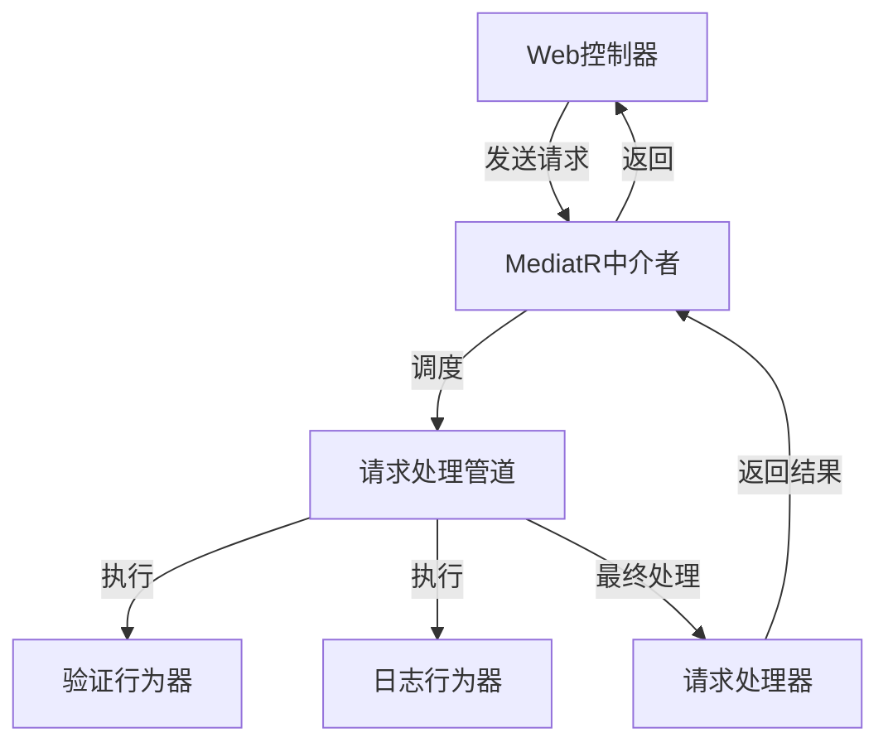
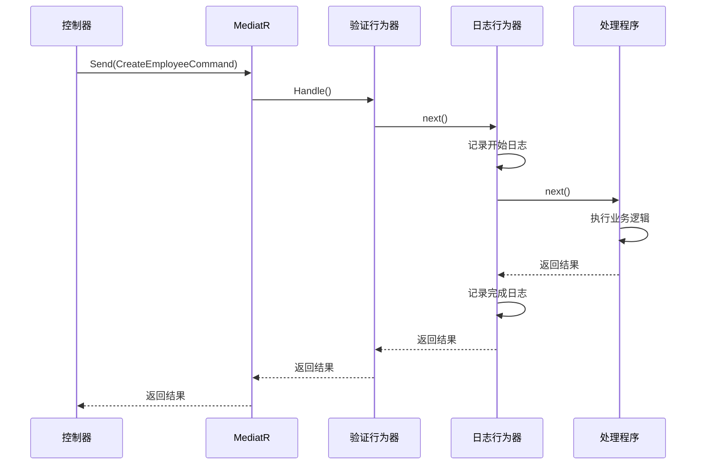
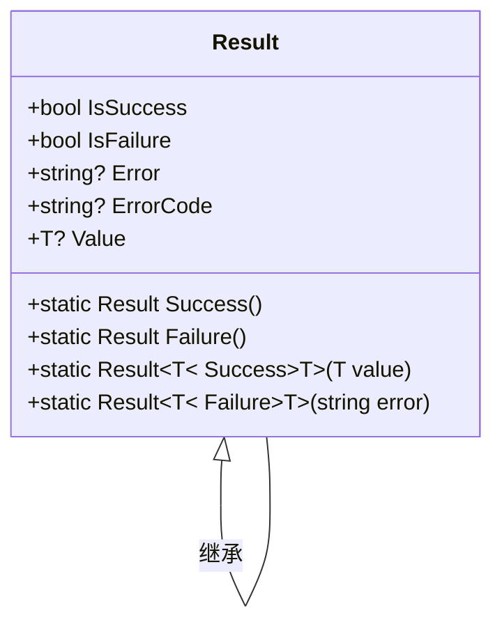

# MediatR请求管道机制

<cite>
**本文档引用文件**   
- [CreateEmployeeCommand.cs](file://Backend/Hrevolve.Application/Employees/Commands/CreateEmployeeCommand.cs)
- [LoggingBehavior.cs](file://Backend/Hrevolve.Application/Behaviors/LoggingBehavior.cs)
- [ValidationBehavior.cs](file://Backend/Hrevolve.Application/Behaviors/ValidationBehavior.cs)
- [DependencyInjection.cs](file://Backend/Hrevolve.Application/DependencyInjection.cs)
- [EmployeesController.cs](file://Backend/Hrevolve.Web/Controllers/EmployeesController.cs)
- [Program.cs](file://Backend/Hrevolve.Web/Program.cs)
- [Result.cs](file://Backend/Hrevolve.Shared/Results/Result.cs)
- [HrevolveException.cs](file://Backend/Hrevolve.Shared/Exceptions/HrevolveException.cs)
</cite>

## 目录
1. [引言](#引言)
2. [MediatR中介者模式架构](#mediatr中介者模式架构)
3. [请求处理管道机制](#请求处理管道机制)
4. [IRequest与IRequestHandler接口分析](#irequest与irequesthandler接口分析)
5. [CreateEmployeeCommand请求流程分析](#createemployeecommand请求流程分析)
6. [管道行为器（Behavior）机制](#管道行为器behavior机制)
7. [横切关注点实现](#横切关注点实现)
8. [异常处理与结果返回](#异常处理与结果返回)
9. [结论](#结论)

## 引言
Hrevolve系统采用MediatR库实现了中介者模式，通过CQRS（命令查询职责分离）模式构建了松耦合的请求处理管道。该架构将请求的发送方与处理方解耦，通过中介者统一调度，实现了关注点分离和可维护性提升。本文将深入分析MediatR在Hrevolve中的实现机制，重点解析请求管道、行为器（Behavior）和横切关注点的实现方式。

## MediatR中介者模式架构
MediatR作为中介者，负责接收请求并将其路由到相应的处理程序。在Hrevolve中，该模式通过以下核心组件实现：



**图示来源**
- [EmployeesController.cs](file://Backend/Hrevolve.Web/Controllers/EmployeesController.cs#L9)
- [DependencyInjection.cs](file://Backend/Hrevolve.Application/DependencyInjection.cs#L13)
- [ValidationBehavior.cs](file://Backend/Hrevolve.Application/Behaviors/ValidationBehavior.cs#L8)
- [LoggingBehavior.cs](file://Backend/Hrevolve.Application/Behaviors/LoggingBehavior.cs#L6)

## 请求处理管道机制
MediatR的请求处理管道采用责任链模式，将多个行为器（Behavior）串联执行。每个行为器都可以在请求处理前后执行特定逻辑，形成一个可扩展的处理管道。



**图示来源**
- [ValidationBehavior.cs](file://Backend/Hrevolve.Application/Behaviors/ValidationBehavior.cs#L12)
- [LoggingBehavior.cs](file://Backend/Hrevolve.Application/Behaviors/LoggingBehavior.cs#L12)
- [CreateEmployeeCommand.cs](file://Backend/Hrevolve.Application/Employees/Commands/CreateEmployeeCommand.cs#L70)

## IRequest与IRequestHandler接口分析
MediatR通过`IRequest`和`IRequestHandler`接口实现松耦合的请求分发机制。`IRequest<TResponse>`接口标记一个可被MediatR处理的请求，而`IRequestHandler<TRequest, TResponse>`接口定义了请求的处理契约。

在Hrevolve中，`CreateEmployeeCommand`实现了`IRequest<Result<Guid>>`，表明这是一个返回`Result<Guid>`类型的请求。这种设计使得请求与响应类型在编译时就能确定，提高了类型安全性。

```mermaid
classDiagram
class IRequest~TResponse~ {
<<interface>>
}
class IRequestHandler~TRequest, TResponse~ {
<<interface>>
+Task~TResponse~ Handle(TRequest request, CancellationToken cancellationToken)
}
class CreateEmployeeCommand {
+string EmployeeNumber
+string FirstName
+string LastName
+Gender Gender
+DateOnly DateOfBirth
+DateOnly HireDate
+EmploymentType EmploymentType
+string? Email
+string? Phone
+Guid? DirectManagerId
+Guid PositionId
+Guid DepartmentId
+decimal BaseSalary
}
class CreateEmployeeCommandHandler {
-IEmployeeRepository employeeRepository
-IUnitOfWork unitOfWork
-ITenantContextAccessor tenantContextAccessor
+Task~Result~Guid~~ Handle()
}
CreateEmployeeCommand ..|> IRequest~Result~Guid~~ : 实现
CreateEmployeeCommandHandler ..|> IRequestHandler~CreateEmployeeCommand, Result~Guid~~ : 实现
CreateEmployeeCommandHandler --> IEmployeeRepository : 依赖
CreateEmployeeCommandHandler --> IUnitOfWork : 依赖
CreateEmployeeCommandHandler --> ITenantContextAccessor : 依赖
```

**图示来源**
- [CreateEmployeeCommand.cs](file://Backend/Hrevolve.Application/Employees/Commands/CreateEmployeeCommand.cs#L6)
- [CreateEmployeeCommand.cs](file://Backend/Hrevolve.Application/Employees/Commands/CreateEmployeeCommand.cs#L73)
- [Result.cs](file://Backend/Hrevolve.Shared/Results/Result.cs#L6)

## CreateEmployeeCommand请求流程分析
以创建员工命令为例，详细分析请求从控制器发出到最终处理的完整流程：

```mermaid
flowchart TD
A[EmployeesController] --> B[Mediator.Send(command)]
B --> C{MediatR查找处理器}
C --> D[执行管道行为器]
D --> E[ValidationBehavior]
E --> F{验证通过?}
F --> |否| G[抛出ValidationException]
F --> |是| H[LoggingBehavior]
H --> I[记录开始日志]
I --> J[CreateEmployeeCommandHandler]
J --> K[检查员工编号是否已存在]
K --> L{编号已存在?}
L --> |是| M[返回失败结果]
L --> |否| N[创建员工实体]
N --> O[添加到仓储]
O --> P[保存工作单元]
P --> Q[返回成功结果]
Q --> R[LoggingBehavior]
R --> S[记录完成日志]
S --> T[返回结果到控制器]
```

**图示来源**
- [EmployeesController.cs](file://Backend/Hrevolve.Web/Controllers/EmployeesController.cs#L58)
- [ValidationBehavior.cs](file://Backend/Hrevolve.Application/Behaviors/ValidationBehavior.cs#L12)
- [LoggingBehavior.cs](file://Backend/Hrevolve.Application/Behaviors/LoggingBehavior.cs#L12)
- [CreateEmployeeCommand.cs](file://Backend/Hrevolve.Application/Employees/Commands/CreateEmployeeCommand.cs#L76)

## 管道行为器（Behavior）机制
Hrevolve中的管道行为器实现了`IPipelineBehavior<TRequest, TResponse>`接口，这是MediatR提供的扩展点，允许在请求处理前后插入自定义逻辑。

### 执行顺序
行为器的执行顺序由其在依赖注入中的注册顺序决定。在Hrevolve中，`ValidationBehavior`先于`LoggingBehavior`执行：

```csharp
services.AddMediatR(cfg =>
{
    cfg.RegisterServicesFromAssembly(assembly);
    cfg.AddBehavior(typeof(IPipelineBehavior<,>), typeof(ValidationBehavior<,>));
    cfg.AddBehavior(typeof(IPipelineBehavior<,>), typeof(LoggingBehavior<,>));
});
```

这种顺序设计确保了在记录日志之前先完成请求验证，避免了无效请求的日志污染。

### 泛型约束
行为器使用泛型约束`where TRequest : notnull`确保请求类型不为空：

```csharp
public class ValidationBehavior<TRequest, TResponse>(
    IEnumerable<IValidator<TRequest>> validators) 
    : IPipelineBehavior<TRequest, TResponse>
    where TRequest : notnull
```

这种约束提高了类型安全性，防止空请求进入处理管道。

**本节来源**
- [DependencyInjection.cs](file://Backend/Hrevolve.Application/DependencyInjection.cs#L16)
- [ValidationBehavior.cs](file://Backend/Hrevolve.Application/Behaviors/ValidationBehavior.cs#L9)
- [LoggingBehavior.cs](file://Backend/Hrevolve.Application/Behaviors/LoggingBehavior.cs#L9)

## 横切关注点实现
管道行为器在实现横切关注点方面发挥着关键作用，将与业务逻辑无关的通用功能从核心业务代码中分离。

### 验证关注点
`ValidationBehavior`自动执行FluentValidation验证，实现了声明式验证：

```csharp
var validationResults = await Task.WhenAll(
    validators.Select(v => v.ValidateAsync(context, cancellationToken)));
```

当验证失败时，抛出`ValidationException`，由全局异常处理器捕获并返回适当的HTTP状态码。

### 日志关注点
`LoggingBehavior`记录请求处理的开始、完成和异常信息，提供了完整的操作审计跟踪：

```csharp
logger.LogInformation(
    "处理请求 {RequestName} - 用户: {UserId}, 租户: {TenantId}",
    requestName, userId, tenantId);
```

这种集中式日志记录确保了日志格式的一致性和完整性。

**本节来源**
- [ValidationBehavior.cs](file://Backend/Hrevolve.Application/Behaviors/ValidationBehavior.cs#L24)
- [LoggingBehavior.cs](file://Backend/Hrevolve.Application/Behaviors/LoggingBehavior.cs#L21)

## 异常处理与结果返回
Hrevolve采用统一的结果返回模式，通过`Result<T>`类封装成功和失败情况：



在请求处理管道中，任何异常都会被适当处理：
- 验证异常由`ValidationBehavior`抛出`ValidationException`
- 业务异常继承自`HrevolveException`
- 未处理异常由全局异常中间件捕获

控制器根据`Result`对象的状态返回相应的HTTP响应，实现了统一的错误处理策略。

**本节来源**
- [Result.cs](file://Backend/Hrevolve.Shared/Results/Result.cs#L6)
- [HrevolveException.cs](file://Backend/Hrevolve.Shared/Exceptions/HrevolveException.cs#L6)
- [EmployeesController.cs](file://Backend/Hrevolve.Web/Controllers/EmployeesController.cs#L58)

## 结论
Hrevolve通过MediatR实现了优雅的中介者模式和请求处理管道。`IRequest`和`IRequestHandler`接口提供了松耦合的请求分发机制，而管道行为器则通过`IPipelineBehavior<TRequest, TResponse>`接口实现了横切关注点的模块化。以`CreateEmployeeCommand`为例的请求流程展示了从控制器到处理程序的完整路径，验证和日志行为器在其中扮演了关键角色。这种架构设计提高了代码的可维护性、可测试性和可扩展性，是现代.NET应用中推荐的实践模式。