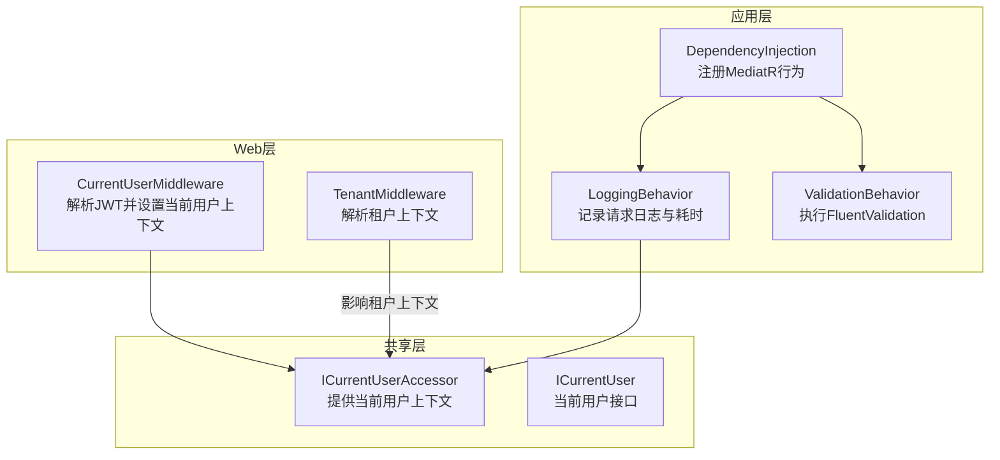
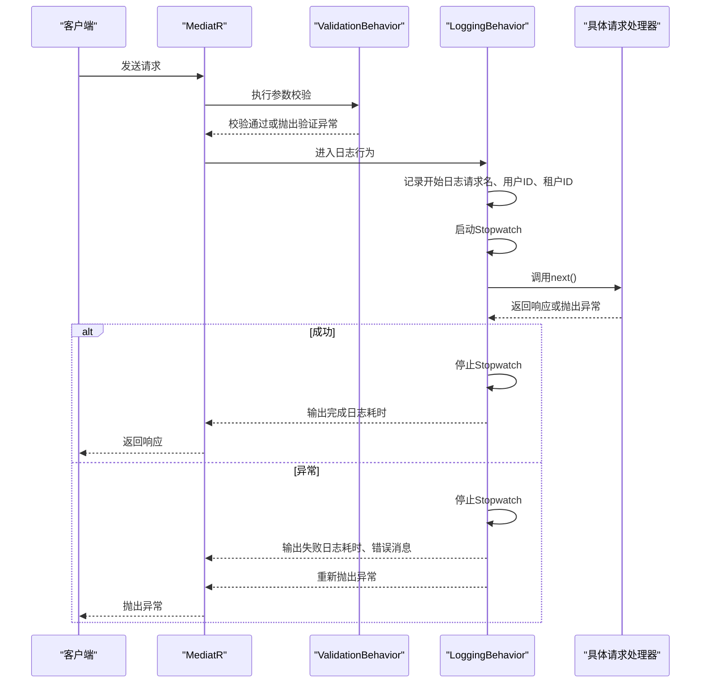
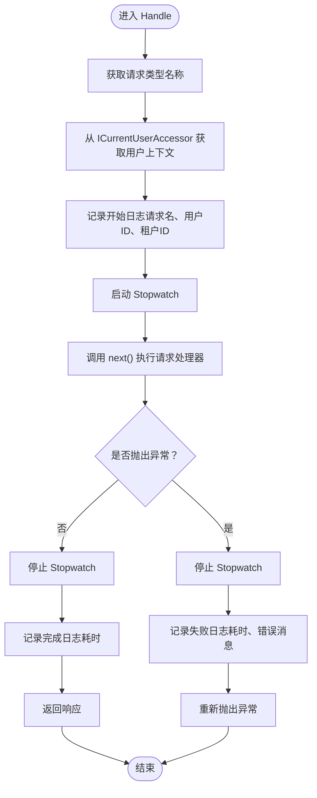
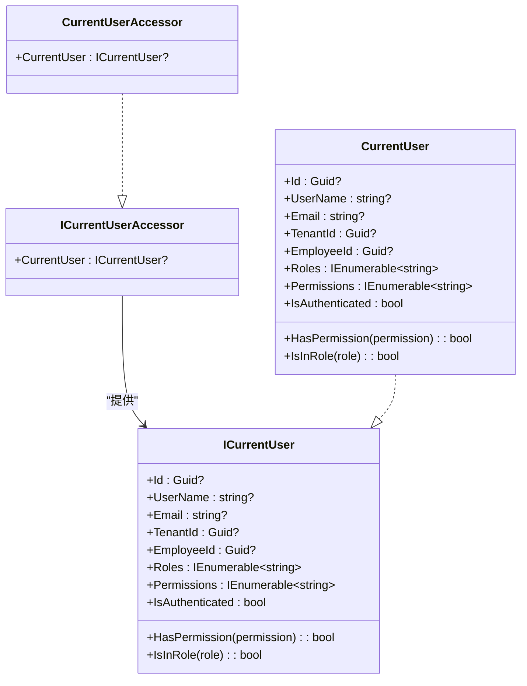
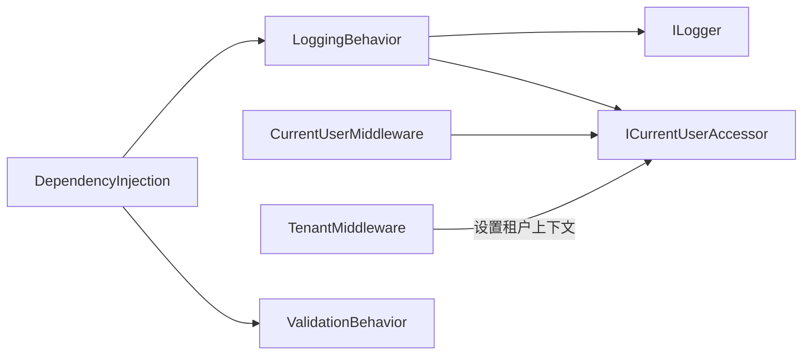

# 日志行为

<cite>
**本文引用的文件**
- [LoggingBehavior.cs](file://Backend/Hrevolve.Application/Behaviors/LoggingBehavior.cs)
- [DependencyInjection.cs](file://Backend/Hrevolve.Application/DependencyInjection.cs)
- [ICurrentUser.cs](file://Backend/Hrevolve.Shared/Identity/ICurrentUser.cs)
- [CurrentUserMiddleware.cs](file://Backend/Hrevolve.Web/Middleware/CurrentUserMiddleware.cs)
- [TenantMiddleware.cs](file://Backend/Hrevolve.Web/Middleware/TenantMiddleware.cs)
- [CreateEmployeeCommand.cs](file://Backend/Hrevolve.Application/Employees/Commands/CreateEmployeeCommand.cs)
- [LoginCommand.cs](file://Backend/Hrevolve.Application/Identity/Commands/LoginCommand.cs)
- [AuditLog.cs](file://Backend/Hrevolve.Domain/Audit/AuditLog.cs)
- [Agent.md](file://Design/Agent.md)
</cite>

## 目录
1. [简介](#简介)
2. [项目结构](#项目结构)
3. [核心组件](#核心组件)
4. [架构总览](#架构总览)
5. [详细组件分析](#详细组件分析)
6. [依赖关系分析](#依赖关系分析)
7. [性能考量](#性能考量)
8. [故障排查指南](#故障排查指南)
9. [结论](#结论)
10. [附录](#附录)

## 简介
本文件聚焦于应用层管道行为中的“日志行为”（LoggingBehavior），系统性阐述其在请求处理生命周期中的职责：如何通过结构化日志记录请求名称、用户ID、租户ID、执行耗时等关键上下文；如何利用Stopwatch精准计时；以及在成功与异常两种分支下分别输出不同级别的日志，并保持异常的正常传播，不破坏原有错误处理流程。同时结合多租户与当前用户上下文的中间件，说明这些上下文如何被注入到日志中，为系统监控与问题排查提供可靠支撑。

## 项目结构
- 日志行为位于应用层的行为管道中，作为MediatR的IPipelineBehavior实现之一，与验证行为共同构成请求处理的前置/后置横切关注点。
- 当前用户上下文由Web层中间件从JWT中解析并注入到共享层的ICurrentUserAccessor中，供应用层行为读取。
- 多租户上下文由Web层中间件解析并注入到ITenantContextAccessor，虽然日志行为不直接使用租户上下文，但其与当前用户上下文共同决定日志中的租户ID字段来源。

图表来源
- [DependencyInjection.cs](file://Backend/Hrevolve.Application/DependencyInjection.cs#L12-L18)
- [LoggingBehavior.cs](file://Backend/Hrevolve.Application/Behaviors/LoggingBehavior.cs#L12-L50)
- [ICurrentUser.cs](file://Backend/Hrevolve.Shared/Identity/ICurrentUser.cs#L62-L66)
- [CurrentUserMiddleware.cs](file://Backend/Hrevolve.Web/Middleware/CurrentUserMiddleware.cs#L9-L25)
- [TenantMiddleware.cs](file://Backend/Hrevolve.Web/Middleware/TenantMiddleware.cs#L21-L94)

章节来源
- [DependencyInjection.cs](file://Backend/Hrevolve.Application/DependencyInjection.cs#L12-L18)
- [LoggingBehavior.cs](file://Backend/Hrevolve.Application/Behaviors/LoggingBehavior.cs#L12-L50)
- [ICurrentUser.cs](file://Backend/Hrevolve.Shared/Identity/ICurrentUser.cs#L62-L66)
- [CurrentUserMiddleware.cs](file://Backend/Hrevolve.Web/Middleware/CurrentUserMiddleware.cs#L9-L25)
- [TenantMiddleware.cs](file://Backend/Hrevolve.Web/Middleware/TenantMiddleware.cs#L21-L94)

## 核心组件
- LoggingBehavior：实现IPipelineBehavior，负责在请求进入与退出时输出结构化日志，并使用Stopwatch统计耗时。
- ICurrentUserAccessor：提供当前请求的用户上下文（含用户ID、租户ID等）。
- DependencyInjection：注册MediatR时将LoggingBehavior与ValidationBehavior加入管道，形成统一的横切逻辑。

章节来源
- [LoggingBehavior.cs](file://Backend/Hrevolve.Application/Behaviors/LoggingBehavior.cs#L12-L50)
- [ICurrentUser.cs](file://Backend/Hrevolve.Shared/Identity/ICurrentUser.cs#L62-L66)
- [DependencyInjection.cs](file://Backend/Hrevolve.Application/DependencyInjection.cs#L12-L18)

## 架构总览
LoggingBehavior在MediatR请求处理管道中的位置如下：
- 请求进入：先经过ValidationBehavior进行参数校验，再进入LoggingBehavior进行日志记录与计时。
- 请求退出：LoggingBehavior在next()返回后输出“处理完成”日志；若发生异常，则在catch块中输出“处理失败”日志并重新抛出异常，保证错误传播不受影响。

图表来源
- [DependencyInjection.cs](file://Backend/Hrevolve.Application/DependencyInjection.cs#L12-L18)
- [LoggingBehavior.cs](file://Backend/Hrevolve.Application/Behaviors/LoggingBehavior.cs#L12-L50)
- [ValidationBehavior.cs](file://Backend/Hrevolve.Application/Behaviors/ValidationBehavior.cs#L12-L41)

## 详细组件分析

### LoggingBehavior：请求处理日志与耗时统计
- 结构化日志：使用命名参数模板记录请求名称、用户ID、租户ID、耗时、错误信息等，便于集中化日志系统检索与聚合。
- 上下文获取：通过ICurrentUserAccessor读取当前用户，从而获得用户ID与租户ID。
- 耗时统计：使用Stopwatch.StartNew()在调用next()之前启动计时；无论成功还是异常，均在try/catch块结束时停止计时并输出相应日志。
- 异常处理：捕获异常后记录失败日志，并立即throw重新抛出，确保异常继续沿调用链传播，不影响原有错误处理流程。

图表来源
- [LoggingBehavior.cs](file://Backend/Hrevolve.Application/Behaviors/LoggingBehavior.cs#L12-L50)

章节来源
- [LoggingBehavior.cs](file://Backend/Hrevolve.Application/Behaviors/LoggingBehavior.cs#L12-L50)

### ICurrentUserAccessor与当前用户上下文
- ICurrentUserAccessor提供CurrentUser属性，用于在请求生命周期内传递当前用户信息（包括用户ID、租户ID、角色、权限等）。
- Web层的CurrentUserMiddleware从JWT Claims中解析用户信息并设置到ICurrentUserAccessor，确保应用层行为可以读取到当前用户上下文。
- 租户上下文由TenantMiddleware解析并注入ITenantContextAccessor，虽然日志行为不直接使用租户上下文，但其与当前用户上下文共同决定日志中的租户ID字段来源。

图表来源
- [ICurrentUser.cs](file://Backend/Hrevolve.Shared/Identity/ICurrentUser.cs#L62-L66)
- [ICurrentUser.cs](file://Backend/Hrevolve.Shared/Identity/ICurrentUser.cs#L86-L114)

章节来源
- [ICurrentUser.cs](file://Backend/Hrevolve.Shared/Identity/ICurrentUser.cs#L62-L66)
- [ICurrentUser.cs](file://Backend/Hrevolve.Shared/Identity/ICurrentUser.cs#L86-L114)
- [CurrentUserMiddleware.cs](file://Backend/Hrevolve.Web/Middleware/CurrentUserMiddleware.cs#L9-L25)
- [TenantMiddleware.cs](file://Backend/Hrevolve.Web/Middleware/TenantMiddleware.cs#L21-L94)

### MediatR行为注册与顺序
- 在应用层DI中，注册MediatR时将ValidationBehavior与LoggingBehavior按顺序加入管道，确保先进行参数校验，再进行日志记录与计时。
- 这种顺序保证了：
  - 参数无效时不会产生无意义的日志与耗时统计；
  - 正常处理与异常处理都会被完整记录，便于审计与监控。

章节来源
- [DependencyInjection.cs](file://Backend/Hrevolve.Application/DependencyInjection.cs#L12-L18)

### 请求示例与日志上下文
- CreateEmployeeCommand：典型的应用层请求，其处理过程会经过LoggingBehavior，日志中将包含请求名称、用户ID、租户ID、耗时等上下文。
- LoginCommand：登录请求同样会经过LoggingBehavior，日志中将包含请求名称、用户ID、租户ID、耗时等上下文；登录成功后会生成JWT，其中包含tenant_id等声明，CurrentUserMiddleware据此设置当前用户上下文。

章节来源
- [CreateEmployeeCommand.cs](file://Backend/Hrevolve.Application/Employees/Commands/CreateEmployeeCommand.cs#L1-L25)
- [LoginCommand.cs](file://Backend/Hrevolve.Application/Identity/Commands/LoginCommand.cs#L1-L27)
- [CurrentUserMiddleware.cs](file://Backend/Hrevolve.Web/Middleware/CurrentUserMiddleware.cs#L27-L57)

## 依赖关系分析
- LoggingBehavior依赖：
  - ILogger：用于结构化日志输出。
  - ICurrentUserAccessor：用于获取当前用户上下文（用户ID、租户ID）。
- Web层中间件：
  - CurrentUserMiddleware：从JWT Claims中解析用户信息并设置到ICurrentUserAccessor。
  - TenantMiddleware：解析租户上下文并设置到ITenantContextAccessor（日志行为不直接使用，但影响日志中的租户ID来源）。
- 应用层DI：
  - 注册MediatR时将LoggingBehavior与ValidationBehavior加入管道，形成统一的横切逻辑。

图表来源
- [LoggingBehavior.cs](file://Backend/Hrevolve.Application/Behaviors/LoggingBehavior.cs#L12-L50)
- [ICurrentUser.cs](file://Backend/Hrevolve.Shared/Identity/ICurrentUser.cs#L62-L66)
- [CurrentUserMiddleware.cs](file://Backend/Hrevolve.Web/Middleware/CurrentUserMiddleware.cs#L9-L25)
- [TenantMiddleware.cs](file://Backend/Hrevolve.Web/Middleware/TenantMiddleware.cs#L21-L94)
- [DependencyInjection.cs](file://Backend/Hrevolve.Application/DependencyInjection.cs#L12-L18)

章节来源
- [LoggingBehavior.cs](file://Backend/Hrevolve.Application/Behaviors/LoggingBehavior.cs#L12-L50)
- [ICurrentUser.cs](file://Backend/Hrevolve.Shared/Identity/ICurrentUser.cs#L62-L66)
- [CurrentUserMiddleware.cs](file://Backend/Hrevolve.Web/Middleware/CurrentUserMiddleware.cs#L9-L25)
- [TenantMiddleware.cs](file://Backend/Hrevolve.Web/Middleware/TenantMiddleware.cs#L21-L94)
- [DependencyInjection.cs](file://Backend/Hrevolve.Application/DependencyInjection.cs#L12-L18)

## 性能考量
- 计时开销：Stopwatch在请求进入时启动，在返回或异常时停止，对单次请求的额外开销极低，且只在日志输出时产生一次字符串格式化成本。
- 日志级别选择：成功路径使用Information级别，异常路径使用Error级别，避免过多日志噪声，同时保留关键错误信息。
- 结构化日志：采用命名参数模板，便于日志系统进行索引与聚合查询，降低检索成本。
- 中间件顺序：先验证后日志，避免无效请求产生无意义日志与耗时统计。

[本节为通用性能建议，无需特定文件来源]

## 故障排查指南
- 日志缺失或为空：
  - 检查Web层中间件是否正确解析JWT并设置ICurrentUserAccessor。
  - 确认请求是否命中了TenantMiddleware的排除路径，导致租户上下文未设置。
- 日志中用户ID/租户ID为空：
  - 确认JWT Claims中是否存在用户ID与租户ID声明。
  - 检查CurrentUserMiddleware是否正确从Claims中提取并构造CurrentUser对象。
- 异常未被记录：
  - 确认LoggingBehavior是否被注册到MediatR管道。
  - 检查异常是否在LoggingBehavior之前被其他中间件或处理器吞掉。
- 耗时不准确：
  - 确保Stopwatch在next()调用前后正确启动与停止，避免在异常分支提前停止。
- 审计与日志区分：
  - 日志用于运行时监控与问题排查，审计轨迹应持久化到数据库（如AuditLog实体）。

章节来源
- [CurrentUserMiddleware.cs](file://Backend/Hrevolve.Web/Middleware/CurrentUserMiddleware.cs#L9-L25)
- [TenantMiddleware.cs](file://Backend/Hrevolve.Web/Middleware/TenantMiddleware.cs#L21-L94)
- [DependencyInjection.cs](file://Backend/Hrevolve.Application/DependencyInjection.cs#L12-L18)
- [LoggingBehavior.cs](file://Backend/Hrevolve.Application/Behaviors/LoggingBehavior.cs#L12-L50)
- [AuditLog.cs](file://Backend/Hrevolve.Domain/Audit/AuditLog.cs#L51-L100)

## 结论
LoggingBehavior通过MediatR管道实现了对所有请求的统一日志记录与耗时统计，借助ICurrentUserAccessor获取用户与租户上下文，确保日志具备足够的可追踪性。其在成功与异常两条路径下分别输出不同级别的日志，并在异常后重新抛出，保证错误传播不受影响。配合Web层中间件与应用层DI配置，形成了清晰、可控、可观测的请求处理链路，为系统监控与问题排查提供了坚实基础。

[本节为总结性内容，无需特定文件来源]

## 附录

### 日志输出示例（概念性说明）
- 成功场景：
  - 开始日志：包含请求名称、用户ID、租户ID。
  - 完成日志：包含请求名称、耗时（毫秒）。
- 异常场景：
  - 失败日志：包含请求名称、耗时（毫秒）、错误消息。
- 上下文字段：
  - 请求名称：来自请求类型的名称。
  - 用户ID：来自当前用户上下文。
  - 租户ID：来自当前用户上下文。
  - 耗时：以毫秒为单位的执行时间。
- 设计规范参考：
  - 结构化日志、命名参数模板、包含TraceId/UserId/TenantId/CorrelationId等上下文字段。

章节来源
- [LoggingBehavior.cs](file://Backend/Hrevolve.Application/Behaviors/LoggingBehavior.cs#L12-L50)
- [Agent.md](file://Design/Agent.md#L155-L183)