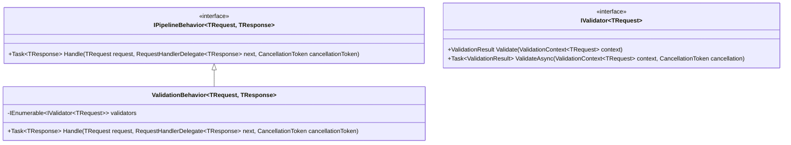

# 验证行为

<cite>
**本文档中引用的文件**   
- [ValidationBehavior.cs](file://Backend/Hrevolve.Application/Behaviors/ValidationBehavior.cs)
- [CreateEmployeeCommand.cs](file://Backend/Hrevolve.Application/Employees/Commands/CreateEmployeeCommand.cs)
- [HrevolveException.cs](file://Backend/Hrevolve.Shared/Exceptions/HrevolveException.cs)
- [DependencyInjection.cs](file://Backend/Hrevolve.Application/DependencyInjection.cs)
- [EmployeesController.cs](file://Backend/Hrevolve.Web/Controllers/EmployeesController.cs)
- [ExceptionHandlingMiddleware.cs](file://Backend/Hrevolve.Web/Middleware/ExceptionHandlingMiddleware.cs)
- [Program.cs](file://Backend/Hrevolve.Web/Program.cs)
</cite>

## 目录
1. [简介](#简介)
2. [验证行为实现机制](#验证行为实现机制)
3. [依赖注入与管道注册](#依赖注入与管道注册)
4. [验证流程详细分析](#验证流程详细分析)
5. [验证失败处理与异常传播](#验证失败处理与异常传播)
6. [性能优化设计](#性能优化设计)
7. [完整执行流程图](#完整执行流程图)
8. [结论](#结论)

## 简介
`ValidationBehavior` 是 Hrevolve 应用程序中 MediatR 管道行为的关键组件，负责在请求处理前自动执行 FluentValidation 验证逻辑。该行为通过依赖注入获取所有注册的验证器，并在管道中执行统一的验证检查，确保业务数据的完整性和一致性。

**Section sources**
- [ValidationBehavior.cs](file://Backend/Hrevolve.Application/Behaviors/ValidationBehavior.cs#L1-L42)

## 验证行为实现机制
`ValidationBehavior<TRequest, TResponse>` 实现了 MediatR 的 `IPipelineBehavior<TRequest, TResponse>` 接口，作为请求处理管道中的中间件。它利用构造函数注入获取当前请求类型的所有 `IValidator<TRequest>` 实例集合。

该行为的核心是 `Handle` 方法，它在请求被实际处理前执行验证逻辑。通过检查验证器集合是否为空来决定是否跳过验证过程，从而避免不必要的性能开销。



**Diagram sources **
- [ValidationBehavior.cs](file://Backend/Hrevolve.Application/Behaviors/ValidationBehavior.cs#L8-L42)

**Section sources**
- [ValidationBehavior.cs](file://Backend/Hrevolve.Application/Behaviors/ValidationBehavior.cs#L8-L42)

## 依赖注入与管道注册
在应用启动时，通过 `DependencyInjection.cs` 文件中的 `AddApplication` 扩展方法完成验证相关服务的注册。系统使用 `AddValidatorsFromAssembly` 方法自动扫描并注册程序集中所有 FluentValidation 验证器。

MediatR 管道通过 `AddBehavior` 方法将 `ValidationBehavior` 注册为全局管道行为，确保所有命令和查询在处理前都会经过验证阶段。


**Diagram sources **
- [DependencyInjection.cs](file://Backend/Hrevolve.Application/DependencyInjection.cs#L13-L22)
- [Program.cs](file://Backend/Hrevolve.Web/Program.cs#L102)

**Section sources**
- [DependencyInjection.cs](file://Backend/Hrevolve.Application/DependencyInjection.cs#L13-L22)

## 验证流程详细分析
以 `CreateEmployeeCommand` 为例，验证流程包含以下关键步骤：

1. **验证上下文创建**：使用请求对象创建 `ValidationContext<TRequest>` 实例
2. **并行验证执行**：通过 `Task.WhenAll` 并行执行所有验证器的异步验证
3. **结果聚合处理**：将多个验证结果中的错误信息进行分组和字典化

验证过程充分利用了异步编程模型，通过并行执行多个验证器来提高性能。


**Diagram sources **
- [ValidationBehavior.cs](file://Backend/Hrevolve.Application/Behaviors/ValidationBehavior.cs#L22-L34)
- [CreateEmployeeCommand.cs](file://Backend/Hrevolve.Application/Employees/Commands/CreateEmployeeCommand.cs#L29-L64)

**Section sources**
- [ValidationBehavior.cs](file://Backend/Hrevolve.Application/Behaviors/ValidationBehavior.cs#L22-L34)
- [CreateEmployeeCommand.cs](file://Backend/Hrevolve.Application/Employees/Commands/CreateEmployeeCommand.cs#L29-L64)

## 验证失败处理与异常传播
当验证失败时，系统会创建包含结构化错误信息的 `ValidationException` 并中断后续管道执行。该异常继承自 `HrevolveException`，包含详细的错误字典，其中键为属性名称，值为该属性的所有错误消息数组。

Web 层的 `ExceptionHandlingMiddleware` 会捕获此异常，并将其转换为标准的错误响应格式，返回给客户端。


**Diagram sources **
- [ValidationBehavior.cs](file://Backend/Hrevolve.Application/Behaviors/ValidationBehavior.cs#L35-L37)
- [ExceptionHandlingMiddleware.cs](file://Backend/Hrevolve.Web/Middleware/ExceptionHandlingMiddleware.cs#L33-L37)
- [EmployeesController.cs](file://Backend/Hrevolve.Web/Controllers/EmployeesController.cs#L58-L63)

**Section sources**
- [ValidationBehavior.cs](file://Backend/Hrevolve.Application/Behaviors/ValidationBehavior.cs#L35-L37)
- [HrevolveException.cs](file://Backend/Hrevolve.Shared/Exceptions/HrevolveException.cs#L42-L57)

## 性能优化设计
`ValidationBehavior` 包含重要的性能优化设计：

1. **空验证器检查**：通过 `validators.Any()` 检查验证器集合，若为空则直接调用 `next()`，避免不必要的验证开销
2. **异步并行执行**：使用 `Task.WhenAll` 并行执行所有验证器，最大化利用异步I/O优势
3. **延迟执行**：只有在确实需要验证时才创建验证上下文和执行验证逻辑

这种设计确保了在没有验证需求时不会产生额外的性能损耗，体现了良好的工程实践。

```mermaid
flowchart LR
A[请求进入] --> B{验证器集合为空?}
B --> |是| C[直接调用next()]
B --> |否| D[执行完整验证流程]
C --> E[返回响应]
D --> E
```

**Diagram sources **
- [ValidationBehavior.cs](file://Backend/Hrevolve.Application/Behaviors/ValidationBehavior.cs#L17-L20)

**Section sources**
- [ValidationBehavior.cs](file://Backend/Hrevolve.Application/Behaviors/ValidationBehavior.cs#L17-L20)

## 完整执行流程图
以下是 `CreateEmployeeCommand` 从 HTTP 请求到最终响应的完整执行流程：


**Diagram sources **
- [ValidationBehavior.cs](file://Backend/Hrevolve.Application/Behaviors/ValidationBehavior.cs)
- [EmployeesController.cs](file://Backend/Hrevolve.Web/Controllers/EmployeesController.cs)
- [CreateEmployeeCommand.cs](file://Backend/Hrevolve.Application/Employees/Commands/CreateEmployeeCommand.cs)
- [ExceptionHandlingMiddleware.cs](file://Backend/Hrevolve.Web/Middleware/ExceptionHandlingMiddleware.cs)

## 结论
`ValidationBehavior` 在 MediatR 管道中实现了高效、可扩展的验证机制。通过依赖注入自动获取验证器集合，利用异步并行处理提高性能，并通过结构化的异常处理确保错误信息的清晰传达。该设计不仅保证了数据完整性，还通过空验证器检查等优化措施避免了不必要的性能开销，体现了良好的架构设计原则。