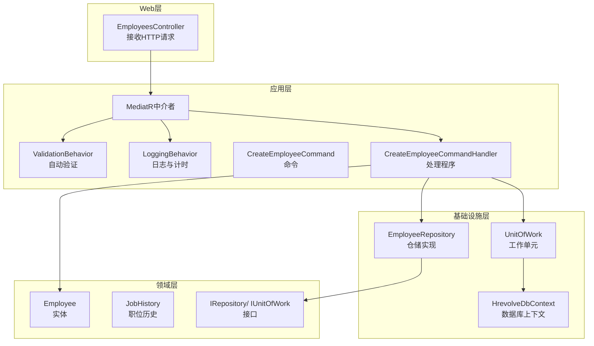
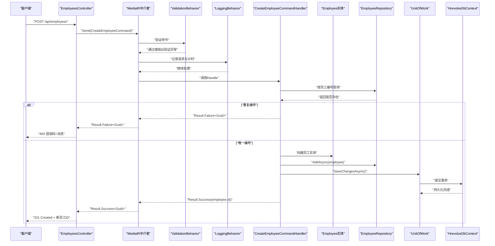
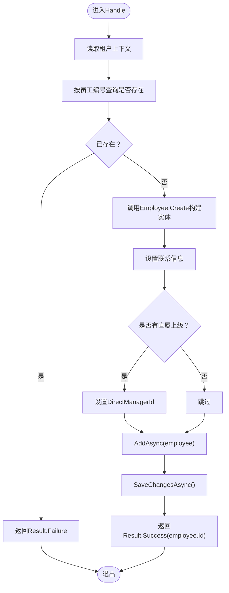
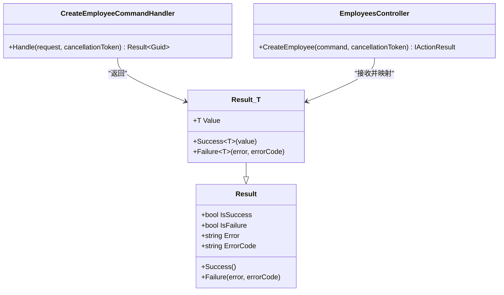
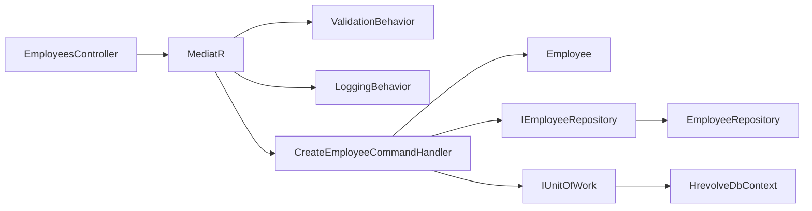

# 命令处理程序实现

<cite>
**本文引用的文件**
- [CreateEmployeeCommand.cs](file://Backend/Hrevolve.Application/Employees/Commands/CreateEmployeeCommand.cs)
- [Result.cs](file://Backend/Hrevolve.Shared/Results/Result.cs)
- [DependencyInjection.cs（应用层）](file://Backend/Hrevolve.Application/DependencyInjection.cs)
- [EmployeesController.cs](file://Backend/Hrevolve.Web/Controllers/EmployeesController.cs)
- [ValidationBehavior.cs](file://Backend/Hrevolve.Application/Behaviors/ValidationBehavior.cs)
- [LoggingBehavior.cs](file://Backend/Hrevolve.Application/Behaviors/LoggingBehavior.cs)
- [IRepository.cs](file://Backend/Hrevolve.Domain/Common/IRepository.cs)
- [IUnitOfWork.cs](file://Backend/Hrevolve.Domain/Common/IUnitOfWork.cs)
- [Employee.cs](file://Backend/Hrevolve.Domain/Employees/Employee.cs)
- [JobHistory.cs](file://Backend/Hrevolve.Domain/Employees/JobHistory.cs)
- [EmployeeRepository.cs](file://Backend/Hrevolve.Infrastructure/Persistence/Repositories/EmployeeRepository.cs)
- [Repository.cs](file://Backend/Hrevolve.Infrastructure/Persistence/Repositories/Repository.cs)
- [HrevolveDbContext.cs](file://Backend/Hrevolve.Infrastructure/Persistence/HrevolveDbContext.cs)
- [UnitOfWork.cs](file://Backend/Hrevolve.Infrastructure/Persistence/Repositories/Repository.cs)
- [ExceptionHandlingMiddleware.cs](file://Backend/Hrevolve.Web/Middleware/ExceptionHandlingMiddleware.cs)
</cite>

## 目录
1. [引言](#引言)
2. [项目结构](#项目结构)
3. [核心组件](#核心组件)
4. [架构总览](#架构总览)
5. [详细组件分析](#详细组件分析)
6. [依赖关系分析](#依赖关系分析)
7. [性能考量](#性能考量)
8. [故障排查指南](#故障排查指南)
9. [结论](#结论)
10. [附录：扩展自定义命令步骤与最佳实践](#附录扩展自定义命令步骤与最佳实践)

## 引言
本文件围绕Hrevolve中命令处理程序的设计与实现进行深入讲解，以CreateEmployeeCommand为例，系统阐述：
- 记录类型（record）作为不可变命令载体的优势
- 对应处理程序如何调用领域模型、执行业务逻辑、与仓储交互并返回结果
- Result<Guid>作为统一返回类型的语义含义及错误传播机制
- 命令验证、事务边界控制、事件发布等典型处理模式
- 扩展自定义命令的步骤与最佳实践

## 项目结构
Hrevolve采用分层架构与CQRS模式：
- Web层负责HTTP请求入口与响应封装
- Application层承载命令/查询、验证与行为管道
- Domain层包含实体、值对象、仓储接口与领域事件
- Infrastructure层提供仓储实现、工作单元与数据库上下文
- Shared层提供通用结果类型、异常与多租户上下文

图表来源
- [EmployeesController.cs](file://Backend/Hrevolve.Web/Controllers/EmployeesController.cs#L1-L106)
- [DependencyInjection.cs（应用层）](file://Backend/Hrevolve.Application/DependencyInjection.cs#L1-L25)
- [CreateEmployeeCommand.cs](file://Backend/Hrevolve.Application/Employees/Commands/CreateEmployeeCommand.cs#L1-L126)
- [Employee.cs](file://Backend/Hrevolve.Domain/Employees/Employee.cs#L1-L137)
- [JobHistory.cs](file://Backend/Hrevolve.Domain/Employees/JobHistory.cs#L1-L124)
- [IRepository.cs](file://Backend/Hrevolve.Domain/Common/IRepository.cs#L1-L30)
- [IUnitOfWork.cs](file://Backend/Hrevolve.Domain/Common/IUnitOfWork.cs#L1-L30)
- [EmployeeRepository.cs](file://Backend/Hrevolve.Infrastructure/Persistence/Repositories/EmployeeRepository.cs#L1-L200)
- [Repository.cs](file://Backend/Hrevolve.Infrastructure/Persistence/Repositories/Repository.cs#L1-L120)
- [HrevolveDbContext.cs](file://Backend/Hrevolve.Infrastructure/Persistence/HrevolveDbContext.cs#L1-L200)

章节来源
- [EmployeesController.cs](file://Backend/Hrevolve.Web/Controllers/EmployeesController.cs#L1-L106)
- [DependencyInjection.cs（应用层）](file://Backend/Hrevolve.Application/DependencyInjection.cs#L1-L25)

## 核心组件
- 命令载体：CreateEmployeeCommand为不可变记录类型，字段均为init-only，确保命令在创建后不可被修改，避免并发与误改风险
- 处理程序：CreateEmployeeCommandHandler实现IRequestHandler，负责业务编排、仓储交互与事务提交
- 统一返回：Result<Guid>封装成功/失败、错误码与值，便于上层统一处理
- 行为管道：ValidationBehavior与LoggingBehavior分别提供自动验证与日志计时
- 领域模型：Employee与JobHistory体现业务规则与状态变更；领域事件用于解耦通知

章节来源
- [CreateEmployeeCommand.cs](file://Backend/Hrevolve.Application/Employees/Commands/CreateEmployeeCommand.cs#L1-L126)
- [Result.cs](file://Backend/Hrevolve.Shared/Results/Result.cs#L1-L88)
- [ValidationBehavior.cs](file://Backend/Hrevolve.Application/Behaviors/ValidationBehavior.cs#L1-L42)
- [LoggingBehavior.cs](file://Backend/Hrevolve.Application/Behaviors/LoggingBehavior.cs#L1-L42)
- [Employee.cs](file://Backend/Hrevolve.Domain/Employees/Employee.cs#L1-L137)
- [JobHistory.cs](file://Backend/Hrevolve.Domain/Employees/JobHistory.cs#L1-L124)

## 架构总览
下面以CreateEmployeeCommand为例，展示从HTTP到领域模型的完整调用链路与错误传播路径。

图表来源
- [EmployeesController.cs](file://Backend/Hrevolve.Web/Controllers/EmployeesController.cs#L48-L66)
- [DependencyInjection.cs（应用层）](file://Backend/Hrevolve.Application/DependencyInjection.cs#L8-L24)
- [CreateEmployeeCommand.cs](file://Backend/Hrevolve.Application/Employees/Commands/CreateEmployeeCommand.cs#L69-L126)
- [EmployeeRepository.cs](file://Backend/Hrevolve.Infrastructure/Persistence/Repositories/EmployeeRepository.cs#L1-L200)
- [Repository.cs](file://Backend/Hrevolve.Infrastructure/Persistence/Repositories/Repository.cs#L1-L120)
- [UnitOfWork.cs](file://Backend/Hrevolve.Infrastructure/Persistence/Repositories/Repository.cs#L67-L120)
- [HrevolveDbContext.cs](file://Backend/Hrevolve.Infrastructure/Persistence/HrevolveDbContext.cs#L1-L200)

## 详细组件分析

### 记录类型（record）作为命令载体的优势
- 不可变性：字段使用init-only，避免命令在处理过程中被意外修改，降低竞态与副作用风险
- 易于测试：构造简单、可序列化，便于构造测试输入
- 明确职责：命令只承载参数，不包含业务逻辑，符合单一职责原则
- 并发友好：避免共享可变状态带来的线程安全问题

章节来源
- [CreateEmployeeCommand.cs](file://Backend/Hrevolve.Application/Employees/Commands/CreateEmployeeCommand.cs#L1-L24)

### CreateEmployeeCommand处理程序的处理流程
- 多租户上下文：从ITenantContextAccessor读取租户ID，确保业务隔离
- 唯一性校验：通过IEmployeeRepository按员工编号查询，若存在则返回失败结果
- 领域建模：调用Employee.Create创建实体，设置联系信息与直属上级
- 事务边界：先AddAsync入队，再SaveChangesAsync提交，保证一致性
- 返回结果：Result.Success(employee.Id)或Result.Failure<Guid>(...)，由上层统一处理

图表来源
- [CreateEmployeeCommand.cs](file://Backend/Hrevolve.Application/Employees/Commands/CreateEmployeeCommand.cs#L76-L124)

章节来源
- [CreateEmployeeCommand.cs](file://Backend/Hrevolve.Application/Employees/Commands/CreateEmployeeCommand.cs#L69-L126)

### 领域模型与仓储交互
- Employee实体：封装员工属性与业务方法，如SetContactInfo、SetDirectManager、Terminate等；创建时发布领域事件
- JobHistory：SCD Type 2实现，记录职位历史与薪资变更；处理程序注释指出应通过DbContext添加
- 仓储接口：IRepository<T>定义基础CRUD能力；IUnitOfWork提供事务控制
- 仓储实现：EmployeeRepository与通用Repository提供具体实现；UnitOfWork封装SaveChangesAsync与事务操作

章节来源
- [Employee.cs](file://Backend/Hrevolve.Domain/Employees/Employee.cs#L1-L137)
- [JobHistory.cs](file://Backend/Hrevolve.Domain/Employees/JobHistory.cs#L1-L124)
- [IRepository.cs](file://Backend/Hrevolve.Domain/Common/IRepository.cs#L1-L30)
- [IUnitOfWork.cs](file://Backend/Hrevolve.Domain/Common/IUnitOfWork.cs#L1-L30)
- [EmployeeRepository.cs](file://Backend/Hrevolve.Infrastructure/Persistence/Repositories/EmployeeRepository.cs#L1-L200)
- [Repository.cs](file://Backend/Hrevolve.Infrastructure/Persistence/Repositories/Repository.cs#L1-L120)
- [UnitOfWork.cs](file://Backend/Hrevolve.Infrastructure/Persistence/Repositories/Repository.cs#L67-L120)

### 统一返回类型Result<Guid>的语义与错误传播
- Result与Result<T>：统一封装成功/失败、错误消息与错误码；Result<T>携带业务值
- 错误传播：处理程序在失败场景返回Result.Failure<T>，上层控制器根据IsFailure判断并映射HTTP状态码
- Web层映射：EmployeesController在失败时返回400并携带code与message；成功返回201并返回Location头

图表来源
- [Result.cs](file://Backend/Hrevolve.Shared/Results/Result.cs#L1-L88)
- [CreateEmployeeCommand.cs](file://Backend/Hrevolve.Application/Employees/Commands/CreateEmployeeCommand.cs#L69-L126)
- [EmployeesController.cs](file://Backend/Hrevolve.Web/Controllers/EmployeesController.cs#L48-L66)

章节来源
- [Result.cs](file://Backend/Hrevolve.Shared/Results/Result.cs#L1-L88)
- [EmployeesController.cs](file://Backend/Hrevolve.Web/Controllers/EmployeesController.cs#L48-L66)

### 命令验证、事务边界与事件发布
- 命令验证：应用层注册ValidationBehavior，自动扫描FluentValidation验证器；未通过时抛出ValidationException，由异常中间件统一处理
- 事务边界：IUnitOfWork.SaveChangesAsync集中控制事务提交；处理程序在所有写操作完成后才提交
- 事件发布：Employee.Create在创建时添加领域事件；事件可通过事件总线或后续处理机制发布（本仓库未直接展示事件发布代码）

章节来源
- [DependencyInjection.cs（应用层）](file://Backend/Hrevolve.Application/DependencyInjection.cs#L8-L24)
- [ValidationBehavior.cs](file://Backend/Hrevolve.Application/Behaviors/ValidationBehavior.cs#L1-L42)
- [LoggingBehavior.cs](file://Backend/Hrevolve.Application/Behaviors/LoggingBehavior.cs#L1-L42)
- [Employee.cs](file://Backend/Hrevolve.Domain/Employees/Employee.cs#L51-L76)
- [UnitOfWork.cs](file://Backend/Hrevolve.Infrastructure/Persistence/Repositories/Repository.cs#L67-L120)

## 依赖关系分析
- 控制器依赖MediatR发送命令
- 应用层通过DI注册MediatR与验证器，自动装配行为管道
- 处理程序依赖仓储接口与工作单元接口，实现松耦合
- 领域层通过实体与值对象表达业务规则，仓储实现依赖EF Core上下文

图表来源
- [EmployeesController.cs](file://Backend/Hrevolve.Web/Controllers/EmployeesController.cs#L1-L106)
- [DependencyInjection.cs（应用层）](file://Backend/Hrevolve.Application/DependencyInjection.cs#L8-L24)
- [CreateEmployeeCommand.cs](file://Backend/Hrevolve.Application/Employees/Commands/CreateEmployeeCommand.cs#L69-L126)
- [EmployeeRepository.cs](file://Backend/Hrevolve.Infrastructure/Persistence/Repositories/EmployeeRepository.cs#L1-L200)
- [Repository.cs](file://Backend/Hrevolve.Infrastructure/Persistence/Repositories/Repository.cs#L1-L120)
- [HrevolveDbContext.cs](file://Backend/Hrevolve.Infrastructure/Persistence/HrevolveDbContext.cs#L1-L200)

章节来源
- [EmployeesController.cs](file://Backend/Hrevolve.Web/Controllers/EmployeesController.cs#L1-L106)
- [DependencyInjection.cs（应用层）](file://Backend/Hrevolve.Application/DependencyInjection.cs#L8-L24)
- [CreateEmployeeCommand.cs](file://Backend/Hrevolve.Application/Employees/Commands/CreateEmployeeCommand.cs#L69-L126)

## 性能考量
- 验证阶段：ValidationBehavior对所有验证器并行执行，减少等待时间
- 日志阶段：LoggingBehavior记录耗时，便于定位慢请求
- 仓储访问：尽量减少不必要的查询与往返，合并写操作以降低事务开销
- 事务粒度：将多个写操作放入同一事务，避免频繁提交导致的锁竞争

## 故障排查指南
- 命令验证失败：检查对应验证器规则与错误码，确认请求体字段是否满足约束
- 业务异常：查看异常中间件对HrevolveException的映射，确认错误码与消息
- 事务回滚：确认SaveChangesAsync是否被调用，以及是否存在未捕获异常导致回滚
- 多租户问题：确认ITenantContextAccessor提供的租户上下文是否正确

章节来源
- [ValidationBehavior.cs](file://Backend/Hrevolve.Application/Behaviors/ValidationBehavior.cs#L1-L42)
- [ExceptionHandlingMiddleware.cs](file://Backend/Hrevolve.Web/Middleware/ExceptionHandlingMiddleware.cs#L41-L70)
- [UnitOfWork.cs](file://Backend/Hrevolve.Infrastructure/Persistence/Repositories/Repository.cs#L67-L120)

## 结论
Hrevolve的命令处理程序通过不可变命令载体、统一返回类型与行为管道，实现了清晰的职责分离与一致的错误传播机制。结合领域模型与仓储抽象，既保证了业务规则的内聚，又提供了良好的扩展性与可维护性。

## 附录：扩展自定义命令步骤与最佳实践
- 步骤
  1) 定义命令：使用record定义不可变命令，字段使用init-only
  2) 编写验证器：基于FluentValidation编写验证规则，确保输入合法性
  3) 实现处理程序：实现IRequestHandler<TRequest, TResponse>，在Handle中编排业务
  4) 仓储与事务：通过仓储接口与IUnitOfWork控制数据持久化与事务边界
  5) 返回结果：使用Result<T>封装成功/失败与错误码
  6) 注册与集成：应用层DI自动注册MediatR与验证器，Web层通过IMediator发送命令
- 最佳实践
  - 命令最小化：仅包含必要参数，避免“上帝对象”
  - 领域优先：业务规则集中在实体与值对象中，处理程序只做编排
  - 错误码标准化：为常见错误定义稳定错误码，便于前端与监控
  - 事务边界明确：将所有写操作放入同一事务，避免部分提交
  - 事件解耦：通过领域事件发布业务事件，保持处理程序无副作用
  - 可观测性：利用LoggingBehavior记录关键指标，便于诊断与优化

章节来源
- [CreateEmployeeCommand.cs](file://Backend/Hrevolve.Application/Employees/Commands/CreateEmployeeCommand.cs#L1-L126)
- [DependencyInjection.cs（应用层）](file://Backend/Hrevolve.Application/DependencyInjection.cs#L8-L24)
- [EmployeesController.cs](file://Backend/Hrevolve.Web/Controllers/EmployeesController.cs#L1-L106)
- [Result.cs](file://Backend/Hrevolve.Shared/Results/Result.cs#L1-L88)
- [Employee.cs](file://Backend/Hrevolve.Domain/Employees/Employee.cs#L1-L137)
- [IRepository.cs](file://Backend/Hrevolve.Domain/Common/IRepository.cs#L1-L30)
- [IUnitOfWork.cs](file://Backend/Hrevolve.Domain/Common/IUnitOfWork.cs#L1-L30)