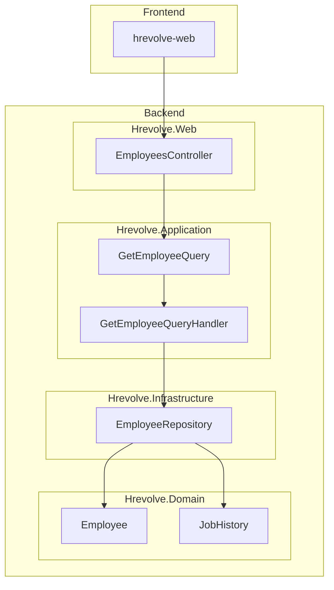
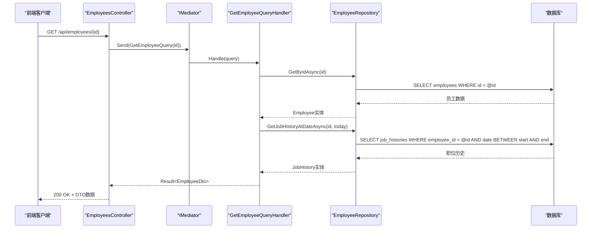
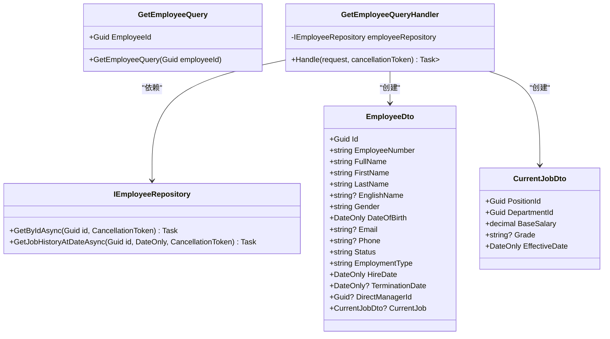
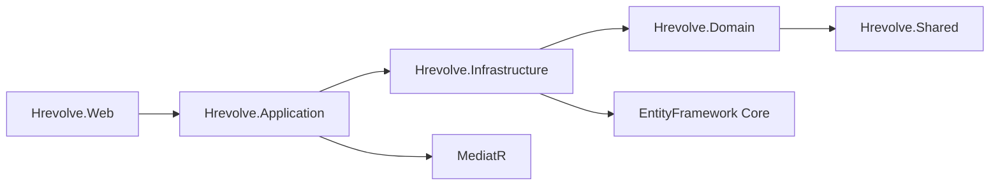

# 查询处理程序实现

<cite>
**本文档引用的文件**  
- [GetEmployeeQuery.cs](file://Backend/Hrevolve.Application/Employees/Queries/GetEmployeeQuery.cs)
- [EmployeeRepository.cs](file://Backend/Hrevolve.Infrastructure/Persistence/Repositories/EmployeeRepository.cs)
- [Employee.cs](file://Backend/Hrevolve.Domain/Employees/Employee.cs)
- [JobHistory.cs](file://Backend/Hrevolve.Domain/Employees/JobHistory.cs)
- [EmployeesController.cs](file://Backend/Hrevolve.Web/Controllers/EmployeesController.cs)
- [Result.cs](file://Backend/Hrevolve.Shared/Results/Result.cs)
- [HrevolveException.cs](file://Backend/Hrevolve.Shared/Exceptions/HrevolveException.cs)
- [DependencyInjection.cs](file://Backend/Hrevolve.Application/DependencyInjection.cs)
</cite>

## 目录
1. [简介](#简介)
2. [项目结构](#项目结构)
3. [核心组件](#核心组件)
4. [架构概述](#架构概述)
5. [详细组件分析](#详细组件分析)
6. [依赖分析](#依赖分析)
7. [性能考量](#性能考量)
8. [故障排除指南](#故障排除指南)
9. [结论](#结论)

## 简介
Hrevolve系统采用CQRS（命令查询职责分离）模式实现高效的数据访问与处理。本文档重点阐述查询处理程序的设计原则与实现方式，以`GetEmployeeQuery`为例，详细说明其如何通过只读上下文高效获取`EmployeeDto`数据，避免加载不必要的导航属性。文档还将深入探讨查询优化策略、命令与查询的差异对比，以及构建复杂查询的实践指南。

## 项目结构
Hrevolve项目采用分层架构设计，主要包括Backend、Frontend、Design和根目录文件。Backend包含多个.NET项目，实现了清晰的分层：Application层处理业务逻辑和CQRS模式，Domain层定义核心领域模型，Infrastructure层负责数据持久化，Web层提供API接口。这种结构确保了关注点分离和代码的可维护性。

**图示来源**  
- [EmployeesController.cs](file://Backend/Hrevolve.Web/Controllers/EmployeesController.cs)
- [GetEmployeeQuery.cs](file://Backend/Hrevolve.Application/Employees/Queries/GetEmployeeQuery.cs)
- [EmployeeRepository.cs](file://Backend/Hrevolve.Infrastructure/Persistence/Repositories/EmployeeRepository.cs)
- [Employee.cs](file://Backend/Hrevolve.Domain/Employees/Employee.cs)
- [JobHistory.cs](file://Backend/Hrevolve.Domain/Employees/JobHistory.cs)

**本节来源**  
- [GetEmployeeQuery.cs](file://Backend/Hrevolve.Application/Employees/Queries/GetEmployeeQuery.cs)
- [EmployeeRepository.cs](file://Backend/Hrevolve.Infrastructure/Persistence/Repositories/EmployeeRepository.cs)

## 核心组件
查询处理程序的核心组件包括查询定义、查询处理器、仓储接口和领域实体。`GetEmployeeQuery`作为查询请求，携带员工ID参数；`GetEmployeeQueryHandler`作为处理器，协调数据获取和DTO映射；`IEmployeeRepository`提供数据访问抽象；`Employee`和`JobHistory`实体定义了核心业务数据结构。这些组件共同实现了高效、安全的数据查询功能。

**本节来源**  
- [GetEmployeeQuery.cs](file://Backend/Hrevolve.Application/Employees/Queries/GetEmployeeQuery.cs)
- [EmployeeRepository.cs](file://Backend/Hrevolve.Infrastructure/Persistence/Repositories/EmployeeRepository.cs)
- [Employee.cs](file://Backend/Hrevolve.Domain/Employees/Employee.cs)

## 架构概述
Hrevolve采用CQRS架构模式，将读写操作分离。查询路径通过MediatR库实现，从Web控制器发起查询请求，经由中介者模式路由到相应的查询处理器，处理器通过仓储层访问数据库并返回DTO。这种架构确保了查询操作的高效性和可扩展性，同时通过只读上下文避免了不必要的数据加载。

**图示来源**  
- [EmployeesController.cs](file://Backend/Hrevolve.Web/Controllers/EmployeesController.cs)
- [GetEmployeeQuery.cs](file://Backend/Hrevolve.Application/Employees/Queries/GetEmployeeQuery.cs)
- [EmployeeRepository.cs](file://Backend/Hrevolve.Infrastructure/Persistence/Repositories/EmployeeRepository.cs)

## 详细组件分析

### GetEmployeeQuery分析
`GetEmployeeQuery`是CQRS模式中的查询请求对象，采用C#记录类型(record)实现不可变性。它封装了获取员工详情所需的所有参数（员工ID），并通过`IRequest<Result<EmployeeDto>>`接口表明其返回类型。查询处理器`GetEmployeeQueryHandler`通过依赖注入获取`IEmployeeRepository`，实现了关注点分离。

**图示来源**  
- [GetEmployeeQuery.cs](file://Backend/Hrevolve.Application/Employees/Queries/GetEmployeeQuery.cs)
- [EmployeeRepository.cs](file://Backend/Hrevolve.Infrastructure/Persistence/Repositories/EmployeeRepository.cs)

**本节来源**  
- [GetEmployeeQuery.cs](file://Backend/Hrevolve.Application/Employees/Queries/GetEmployeeQuery.cs)
- [EmployeeRepository.cs](file://Backend/Hrevolve.Infrastructure/Persistence/Repositories/EmployeeRepository.cs)

### 查询优化策略
Hrevolve系统实施了多项查询优化策略。首先，通过投影（Select）仅获取DTO所需字段，避免加载完整实体和导航属性。其次，采用SCD Type 2（缓慢变化维度类型2）模式的`JobHistory`表，支持高效的历史时点查询。查询处理器还实现了分步加载策略，先获取主实体再按需加载关联数据，减少了不必要的数据库访问。

**本节来源**  
- [GetEmployeeQuery.cs](file://Backend/Hrevolve.Application/Employees/Queries/GetEmployeeQuery.cs)
- [EmployeeRepository.cs](file://Backend/Hrevolve.Infrastructure/Persistence/Repositories/EmployeeRepository.cs)

### 缓存应用
虽然当前代码未直接实现缓存，但CQRS架构为缓存提供了良好基础。查询结果可以被缓存，因为查询操作是幂等的且不改变系统状态。特别是`GetEmployeeQuery`这类高频访问的员工详情查询，非常适合应用缓存策略以提高性能。未来的优化可以考虑在查询处理器中集成分布式缓存，如Redis。

**本节来源**  
- [GetEmployeeQuery.cs](file://Backend/Hrevolve.Application/Employees/Queries/GetEmployeeQuery.cs)

### 分页处理
对于列表查询，Hrevolve使用`PagedResult<T>`和`PagedRequest`类实现分页功能。`PagedRequest`封装了分页参数（页码、页面大小、排序等），而`PagedResult<T>`包含分页数据和元信息（总记录数、总页数等）。这种设计确保了API的一致性和客户端分页的便利性。

**本节来源**  
- [Result.cs](file://Backend/Hrevolve.Shared/Results/Result.cs)

## 依赖分析
系统各组件之间存在清晰的依赖关系。Web层依赖Application层的查询和命令，Application层依赖Infrastructure层的仓储实现，而Infrastructure层依赖Domain层的实体定义。这种单向依赖确保了架构的稳定性。MediatR库作为中介者，解耦了请求发送者和处理者，使得系统更易于测试和维护。

**图示来源**  
- [DependencyInjection.cs](file://Backend/Hrevolve.Application/DependencyInjection.cs)
- [EmployeeRepository.cs](file://Backend/Hrevolve.Infrastructure/Persistence/Repositories/EmployeeRepository.cs)

**本节来源**  
- [DependencyInjection.cs](file://Backend/Hrevolve.Application/DependencyInjection.cs)
- [EmployeeRepository.cs](file://Backend/Hrevolve.Infrastructure/Persistence/Repositories/EmployeeRepository.cs)

## 性能考量
查询处理程序在设计时充分考虑了性能因素。通过避免N+1查询问题、使用适当的数据库索引、实施分步加载策略，确保了查询效率。`GetJobHistoryAtDateAsync`方法中的SCD Type 2查询经过优化，使用复合索引支持高效的时间范围查询。此外，返回`IReadOnlyList<T>`而非`List<T>`有助于防止意外的集合修改，提高数据安全性。

**本节来源**  
- [EmployeeRepository.cs](file://Backend/Hrevolve.Infrastructure/Persistence/Repositories/EmployeeRepository.cs)
- [GetEmployeeQuery.cs](file://Backend/Hrevolve.Application/Employees/Queries/GetEmployeeQuery.cs)

## 故障排除指南
当查询处理出现问题时，应首先检查异常处理机制。系统通过`ExceptionHandlingMiddleware`全局捕获异常，并返回结构化的错误响应。常见的`EntityNotFoundException`表示请求的员工不存在，应检查员工ID是否正确。`ValidationException`表示输入验证失败，需检查请求参数格式。对于数据库相关错误，应查看日志中的详细信息以定位问题根源。

**本节来源**  
- [HrevolveException.cs](file://Backend/Hrevolve.Shared/Exceptions/HrevolveException.cs)
- [EmployeesController.cs](file://Backend/Hrevolve.Web/Controllers/EmployeesController.cs)

## 结论
Hrevolve的查询处理程序设计体现了现代软件架构的最佳实践。通过CQRS模式、MediatR库和清晰的分层架构，实现了高效、可维护的数据访问。`GetEmployeeQuery`示例展示了如何通过只读上下文和精确的数据投影来优化查询性能。未来可进一步引入缓存机制和更复杂的查询优化策略，以应对更大规模的数据访问需求。