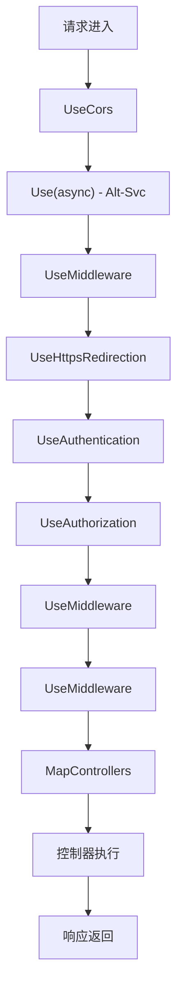
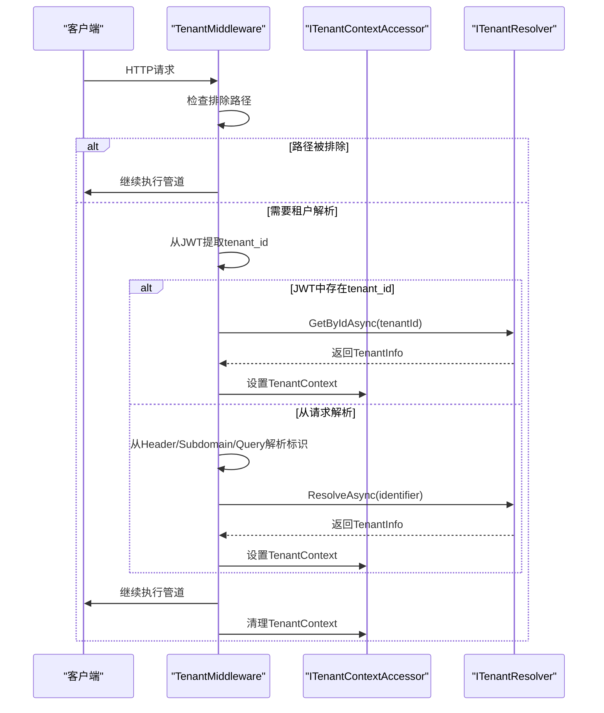
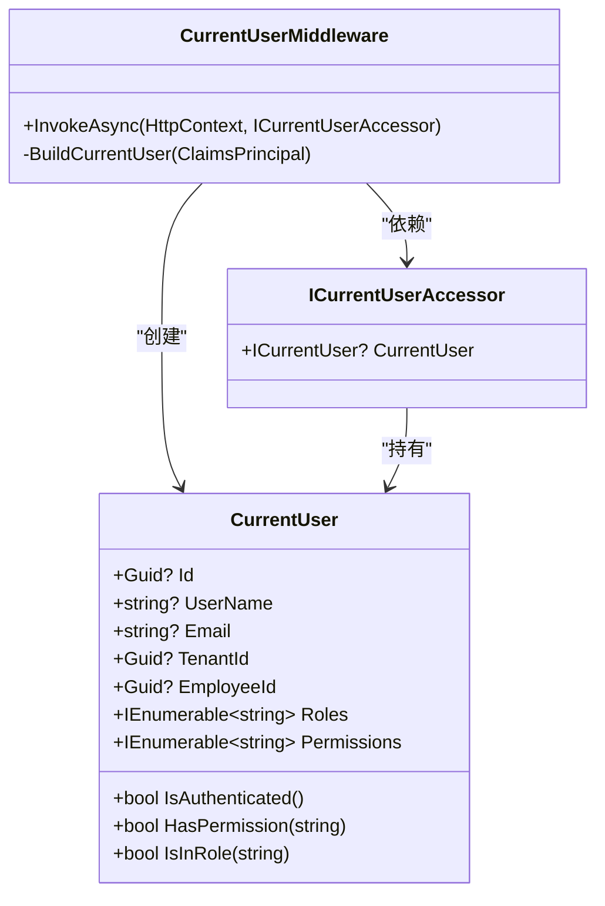
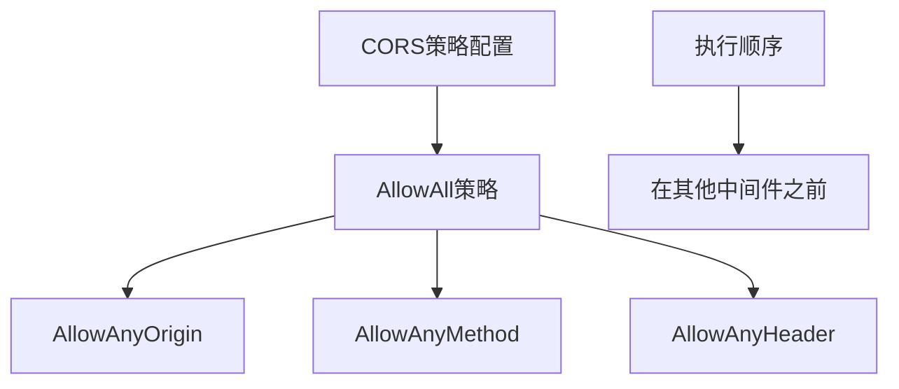
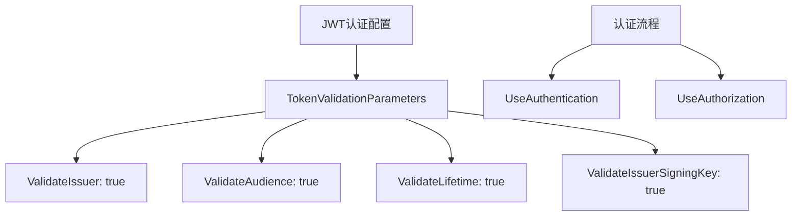
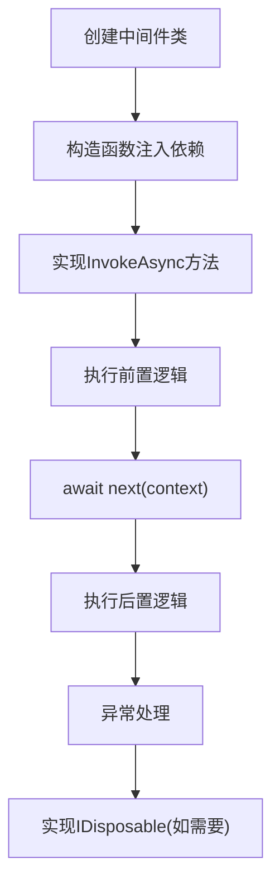
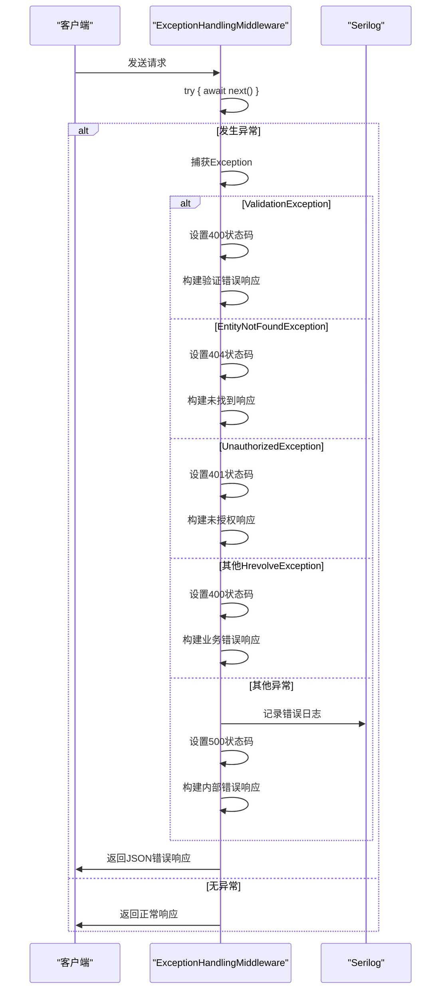
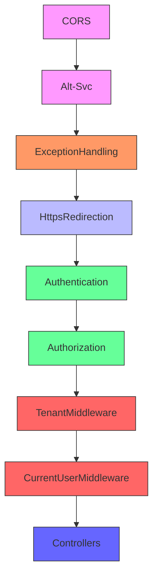
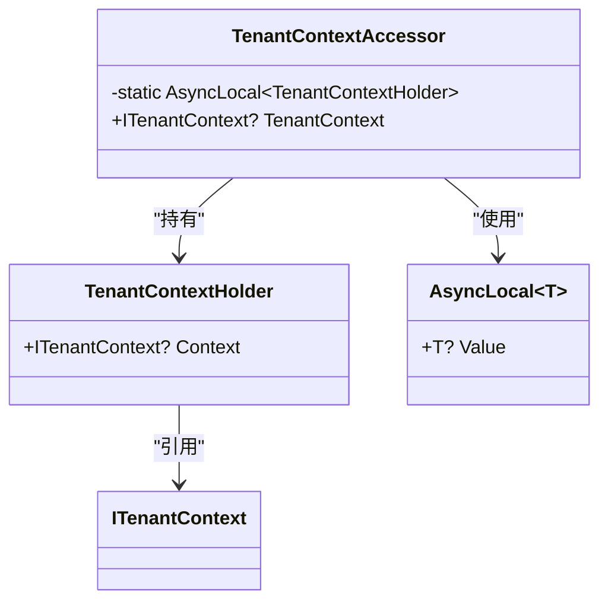
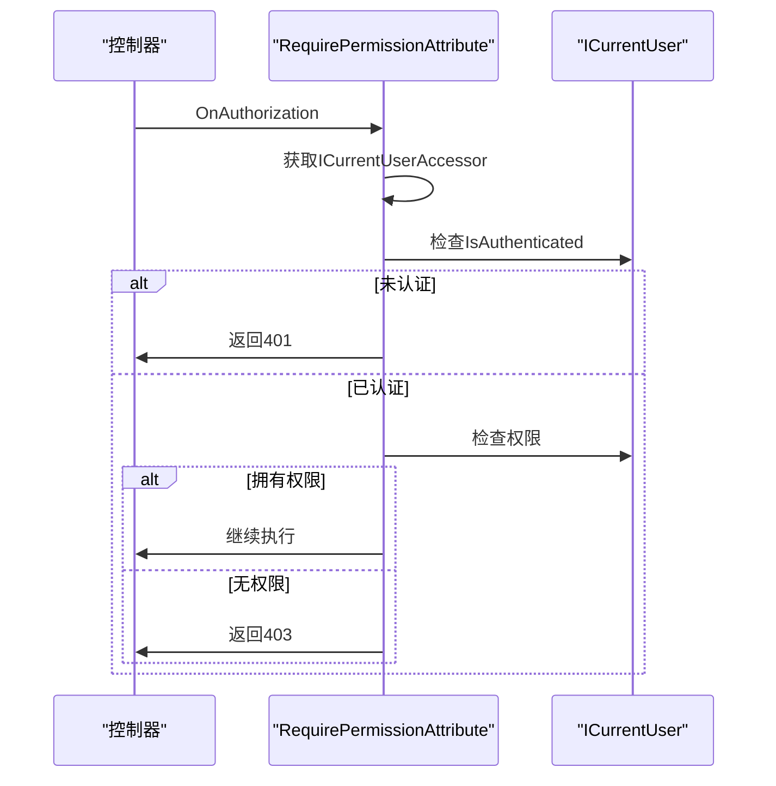

# 中间件管道

<cite>
**本文档中引用的文件**   
- [Program.cs](file://Backend/Hrevolve.Web/Program.cs)
- [TenantMiddleware.cs](file://Backend/Hrevolve.Web/Middleware/TenantMiddleware.cs)
- [CurrentUserMiddleware.cs](file://Backend/Hrevolve.Web/Middleware/CurrentUserMiddleware.cs)
- [ExceptionHandlingMiddleware.cs](file://Backend/Hrevolve.Web/Middleware/ExceptionHandlingMiddleware.cs)
- [ITenantContext.cs](file://Backend/Hrevolve.Shared/MultiTenancy/ITenantContext.cs)
- [ICurrentUser.cs](file://Backend/Hrevolve.Shared/Identity/ICurrentUser.cs)
- [TenantResolver.cs](file://Backend/Hrevolve.Infrastructure/MultiTenancy/TenantResolver.cs)
- [RequirePermissionAttribute.cs](file://Backend/Hrevolve.Web/Filters/RequirePermissionAttribute.cs)
- [appsettings.json](file://Backend/Hrevolve.Web/appsettings.json)
- [AuthController.cs](file://Backend/Hrevolve.Web/Controllers/AuthController.cs)
- [EmployeesController.cs](file://Backend/Hrevolve.Web/Controllers/EmployeesController.cs)
</cite>

## 目录
1. [简介](#简介)
2. [中间件执行顺序](#中间件执行顺序)
3. [核心中间件分析](#核心中间件分析)
4. [内置中间件配置策略](#内置中间件配置策略)
5. [自定义中间件开发指南](#自定义中间件开发指南)
6. [异常处理流程](#异常处理流程)
7. [中间件依赖关系](#中间件依赖关系)
8. [最佳实践](#最佳实践)

## 简介
Hrevolve系统采用基于.NET的中间件管道架构，实现了多租户、身份认证、权限控制等核心功能。本系统通过精心设计的中间件执行顺序，确保了请求处理的正确性和安全性。中间件管道不仅实现了标准的HTTP处理流程，还集成了SaaS特有的多租户支持和全局异常处理机制。

## 中间件执行顺序
根据Program.cs中的配置，中间件按照特定顺序执行，每个中间件在管道中扮演特定角色：

**Diagram sources**
- [Program.cs](file://Backend/Hrevolve.Web/Program.cs#L132-L155)

**Section sources**
- [Program.cs](file://Backend/Hrevolve.Web/Program.cs#L122-L155)

## 核心中间件分析

### TenantMiddleware分析
TenantMiddleware负责解析和设置租户上下文，是多租户架构的核心组件。该中间件优先从JWT令牌中提取租户信息，确保已认证用户的租户上下文正确设置。

**Diagram sources**
- [TenantMiddleware.cs](file://Backend/Hrevolve.Web/Middleware/TenantMiddleware.cs#L21-L94)
- [ITenantContext.cs](file://Backend/Hrevolve.Shared/MultiTenancy/ITenantContext.cs#L38-L81)
- [TenantResolver.cs](file://Backend/Hrevolve.Infrastructure/MultiTenancy/TenantResolver.cs#L29-L56)

**Section sources**
- [TenantMiddleware.cs](file://Backend/Hrevolve.Web/Middleware/TenantMiddleware.cs#L6-L133)
- [ITenantContext.cs](file://Backend/Hrevolve.Shared/MultiTenancy/ITenantContext.cs#L6-L81)

### CurrentUserMiddleware分析
CurrentUserMiddleware从JWT令牌中解析用户身份信息，并设置当前用户上下文，为后续的业务逻辑提供用户信息。

**Diagram sources**
- [CurrentUserMiddleware.cs](file://Backend/Hrevolve.Web/Middleware/CurrentUserMiddleware.cs#L9-L25)
- [ICurrentUser.cs](file://Backend/Hrevolve.Shared/Identity/ICurrentUser.cs#L70-L115)

**Section sources**
- [CurrentUserMiddleware.cs](file://Backend/Hrevolve.Web/Middleware/CurrentUserMiddleware.cs#L6-L58)
- [ICurrentUser.cs](file://Backend/Hrevolve.Shared/Identity/ICurrentUser.cs#L6-L115)

## 内置中间件配置策略

### CORS配置
CORS中间件配置了允许所有来源的策略，确保前端应用能够正常访问API。

**Section sources**
- [Program.cs](file://Backend/Hrevolve.Web/Program.cs#L90-L99)

### 认证与授权配置
系统采用JWT Bearer认证方案，配置了严格的令牌验证参数。

**Section sources**
- [Program.cs](file://Backend/Hrevolve.Web/Program.cs#L70-L88)

## 自定义中间件开发指南
创建自定义中间件需要遵循特定模式，确保与现有管道兼容。

**Section sources**
- [TenantMiddleware.cs](file://Backend/Hrevolve.Web/Middleware/TenantMiddleware.cs#L6-L133)
- [CurrentUserMiddleware.cs](file://Backend/Hrevolve.Web/Middleware/CurrentUserMiddleware.cs#L6-L58)

## 异常处理流程
ExceptionHandlingMiddleware实现了全局异常捕获和标准化错误响应。

**Diagram sources**
- [ExceptionHandlingMiddleware.cs](file://Backend/Hrevolve.Web/Middleware/ExceptionHandlingMiddleware.cs#L9-L85)
- [HrevolveException.cs](file://Backend/Hrevolve.Shared/Exceptions/HrevolveException.cs#L6-L101)

**Section sources**
- [ExceptionHandlingMiddleware.cs](file://Backend/Hrevolve.Web/Middleware/ExceptionHandlingMiddleware.cs#L6-L97)

## 中间件依赖关系
各中间件之间存在明确的依赖关系，执行顺序至关重要。

**Diagram sources**
- [Program.cs](file://Backend/Hrevolve.Web/Program.cs#L132-L155)

**Section sources**
- [Program.cs](file://Backend/Hrevolve.Web/Program.cs#L122-L155)

## 最佳实践

### 多租户上下文管理
使用AsyncLocal确保租户上下文在异步操作中正确传递。

**Section sources**
- [ITenantContext.cs](file://Backend/Hrevolve.Shared/MultiTenancy/ITenantContext.cs#L54-L81)

### 权限验证机制
通过自定义过滤器实现细粒度的权限控制。

**Diagram sources**
- [RequirePermissionAttribute.cs](file://Backend/Hrevolve.Web/Filters/RequirePermissionAttribute.cs#L33-L78)
- [ICurrentUser.cs](file://Backend/Hrevolve.Shared/Identity/ICurrentUser.cs#L51-L57)

**Section sources**
- [RequirePermissionAttribute.cs](file://Backend/Hrevolve.Web/Filters/RequirePermissionAttribute.cs#L6-L80)
- [ICurrentUser.cs](file://Backend/Hrevolve.Shared/Identity/ICurrentUser.cs#L6-L115)