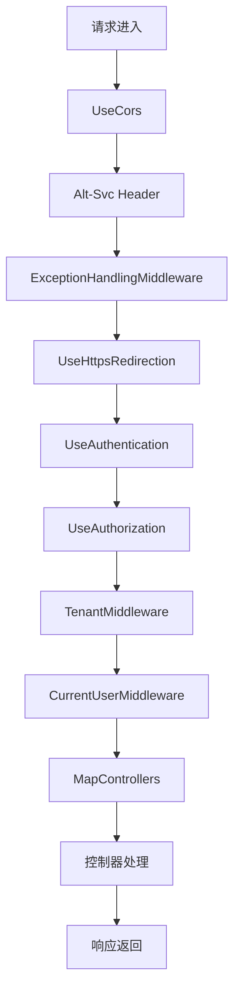
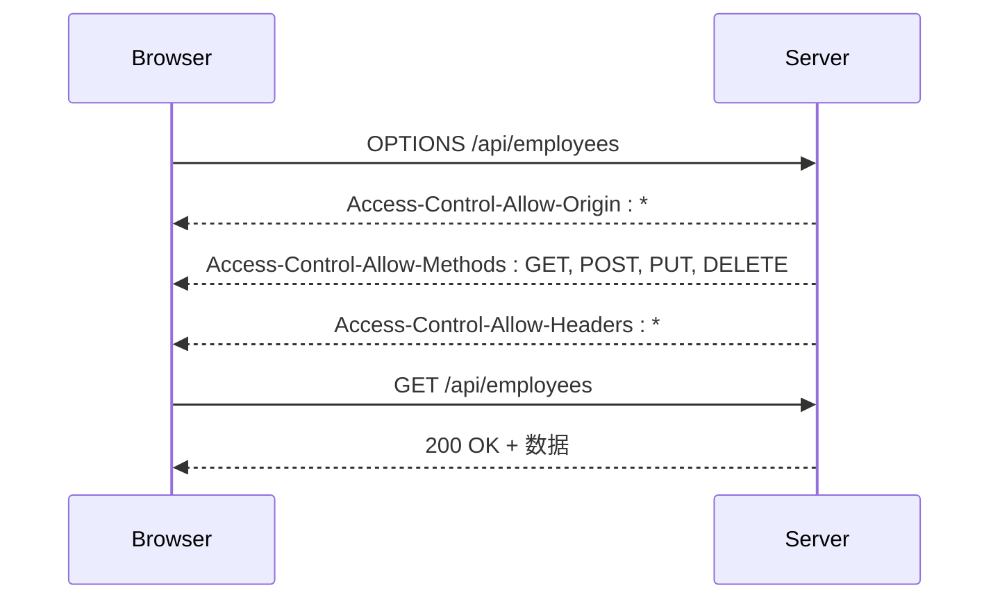
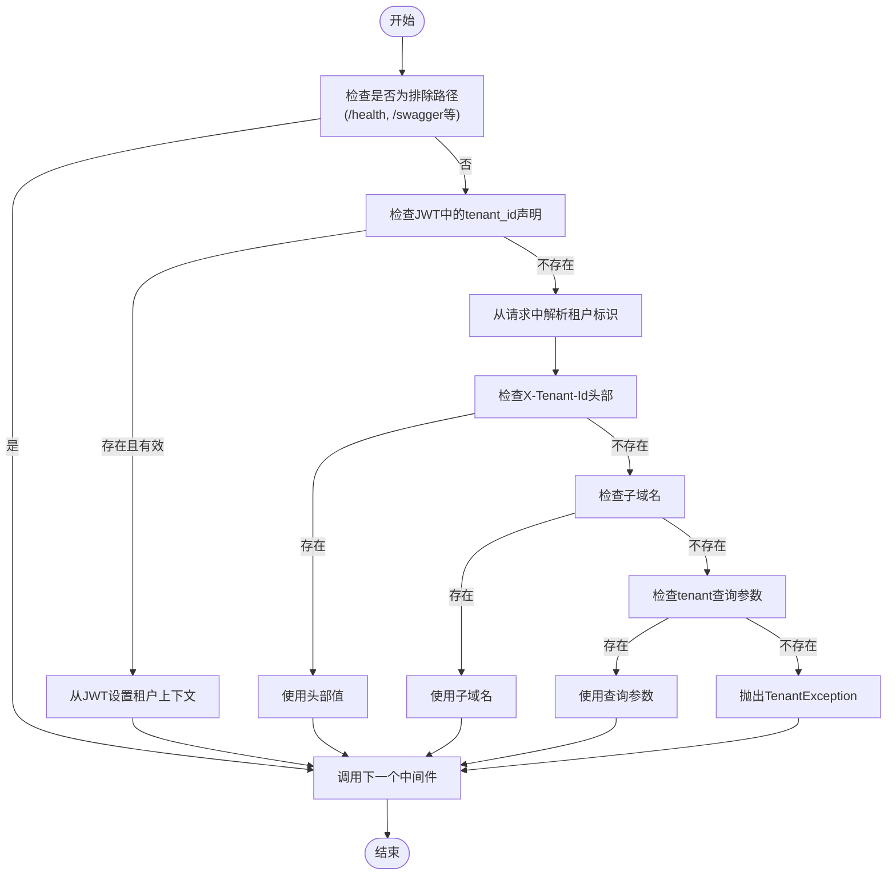
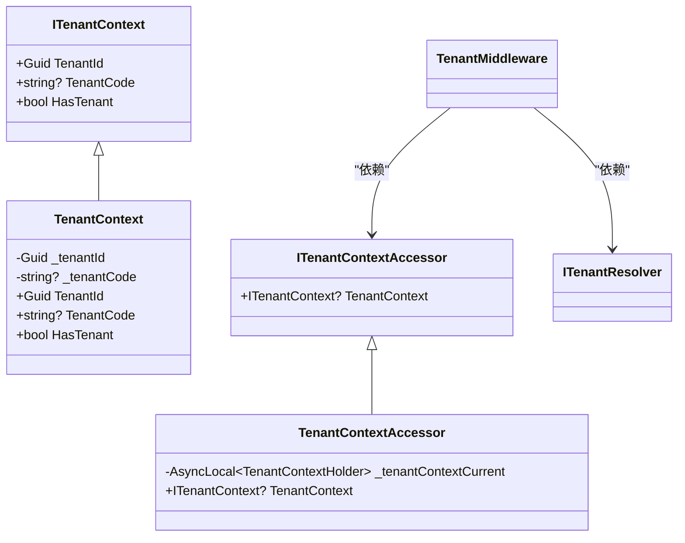
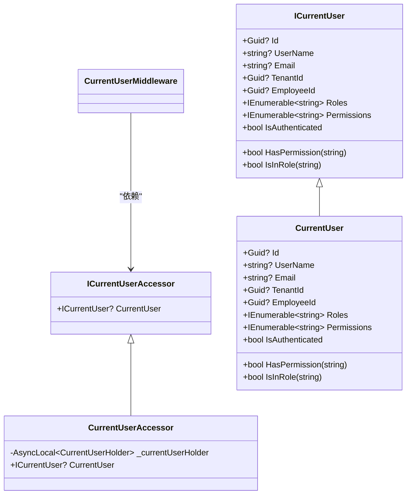
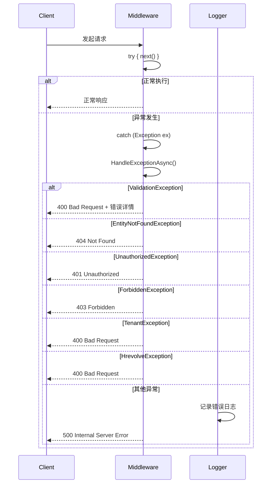
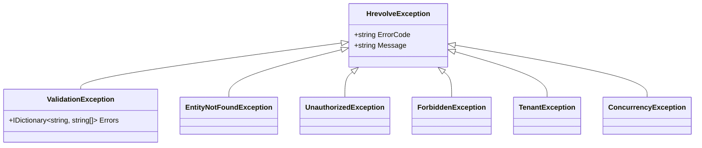
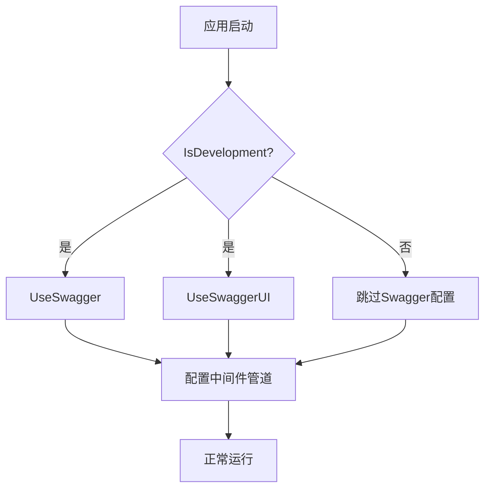

# 中间件管道配置

<cite>
**本文档引用的文件**  
- [Program.cs](file://Backend/Hrevolve.Web/Program.cs)
- [TenantMiddleware.cs](file://Backend/Hrevolve.Web/Middleware/TenantMiddleware.cs)
- [CurrentUserMiddleware.cs](file://Backend/Hrevolve.Web/Middleware/CurrentUserMiddleware.cs)
- [ExceptionHandlingMiddleware.cs](file://Backend/Hrevolve.Web/Middleware/ExceptionHandlingMiddleware.cs)
- [appsettings.json](file://Backend/Hrevolve.Web/appsettings.json)
- [appsettings.Development.json](file://Backend/Hrevolve.Web/appsettings.Development.json)
- [AuthController.cs](file://Backend/Hrevolve.Web/Controllers/AuthController.cs)
- [EmployeesController.cs](file://Backend/Hrevolve.Web/Controllers/EmployeesController.cs)
- [RequirePermissionAttribute.cs](file://Backend/Hrevolve.Web/Filters/RequirePermissionAttribute.cs)
- [ICurrentUser.cs](file://Backend/Hrevolve.Shared/Identity/ICurrentUser.cs)
- [ITenantContext.cs](file://Backend/Hrevolve.Shared/MultiTenancy/ITenantContext.cs)
</cite>

## 目录
1. [引言](#引言)
2. [中间件执行顺序详解](#中间件执行顺序详解)
3. [核心中间件功能分析](#核心中间件功能分析)
4. [多租户与用户上下文处理](#多租户与用户上下文处理)
5. [异常处理机制](#异常处理机制)
6. [开发与生产环境差异](#开发与生产环境差异)
7. [常见配置错误诊断](#常见配置错误诊断)
8. [结论](#结论)

## 引言
本系统采用基于.NET 10的中间件管道架构，实现了多租户SaaS人力资源管理系统的请求处理流程。通过精心设计的中间件执行顺序，确保了安全性、可扩展性和稳定性。本文档系统性说明`Program.cs`中`UseCors`、`UseAuthentication`、`UseAuthorization`、`UseTenantMiddleware`、`UseCurrentUserMiddleware`、`UseExceptionHandlingMiddleware`等中间件的注册顺序及其对请求处理流程的影响。

**Section sources**
- [Program.cs](file://Backend/Hrevolve.Web/Program.cs#L1-L173)

## 中间件执行顺序详解

**Diagram sources**
- [Program.cs](file://Backend/Hrevolve.Web/Program.cs#L132-L155)

中间件执行顺序是ASP.NET Core应用的核心概念，决定了请求处理的逻辑流程。在本系统中，中间件按照以下关键顺序注册：

1. **CORS处理**：必须在最前，确保预检请求能被正确处理
2. **HTTP/3支持**：添加Alt-Svc头，通知客户端支持HTTP/3
3. **全局异常处理**：捕获后续所有中间件和控制器中的异常
4. **HTTPS重定向**：将HTTP请求重定向到HTTPS
5. **认证**：验证用户身份（JWT）
6. **授权**：检查用户是否有访问资源的权限
7. **多租户中间件**：基于认证信息解析租户上下文
8. **当前用户中间件**：构建完整的用户上下文对象
9. **控制器映射**：路由到具体的API控制器

**Section sources**
- [Program.cs](file://Backend/Hrevolve.Web/Program.cs#L131-L155)

## 核心中间件功能分析

### CORS配置
系统通过`AddCors`服务配置了名为"AllowAll"的CORS策略，允许任何来源、方法和头部的跨域请求。这在开发环境中提供了便利，但在生产环境中应根据实际需求进行更严格的限制。

**Diagram sources**
- [Program.cs](file://Backend/Hrevolve.Web/Program.cs#L90-L99)

### 认证与授权
系统采用JWT Bearer认证方案，配置了严格的令牌验证参数，包括签发者、受众、签名密钥等。`UseAuthentication`和`UseAuthorization`必须按此顺序注册，因为授权依赖于认证提供的用户信息。

**Section sources**
- [Program.cs](file://Backend/Hrevolve.Web/Program.cs#L70-L88)

### HTTPS重定向
`UseHttpsRedirection`中间件自动将HTTP请求重定向到HTTPS，增强了系统的安全性。结合Kestrel配置，系统同时支持HTTP/1.1、HTTP/2和HTTP/3协议。

**Section sources**
- [Program.cs](file://Backend/Hrevolve.Web/Program.cs#L144)

## 多租户与用户上下文处理

### 租户中间件执行逻辑
`TenantMiddleware`负责解析并设置租户上下文，其执行逻辑如下：

**Diagram sources**
- [TenantMiddleware.cs](file://Backend/Hrevolve.Web/Middleware/TenantMiddleware.cs#L21-L132)

### 执行顺序的重要性
租户中间件必须在认证之后执行，因为其优先从JWT令牌中获取租户ID。如果顺序颠倒，将无法正确解析租户信息。

**Diagram sources**
- [TenantMiddleware.cs](file://Backend/Hrevolve.Web/Middleware/TenantMiddleware.cs#L6-L132)
- [ITenantContext.cs](file://Backend/Hrevolve.Shared/MultiTenancy/ITenantContext.cs#L6-L81)

**Section sources**
- [TenantMiddleware.cs](file://Backend/Hrevolve.Web/Middleware/TenantMiddleware.cs#L6-L132)
- [ITenantContext.cs](file://Backend/Hrevolve.Shared/MultiTenancy/ITenantContext.cs#L6-L81)

### 当前用户中间件
`CurrentUserMiddleware`从认证后的`ClaimsPrincipal`中提取用户信息，构建`CurrentUser`对象并存储在`ICurrentUserAccessor`中，供后续业务逻辑使用。

**Diagram sources**
- [CurrentUserMiddleware.cs](file://Backend/Hrevolve.Web/Middleware/CurrentUserMiddleware.cs#L6-L58)
- [ICurrentUser.cs](file://Backend/Hrevolve.Shared/Identity/ICurrentUser.cs#L6-L115)

**Section sources**
- [CurrentUserMiddleware.cs](file://Backend/Hrevolve.Web/Middleware/CurrentUserMiddleware.cs#L6-L58)
- [ICurrentUser.cs](file://Backend/Hrevolve.Shared/Identity/ICurrentUser.cs#L6-L115)

## 异常处理机制

### 全局异常处理流程
`ExceptionHandlingMiddleware`作为全局异常处理器，捕获并格式化所有未处理的异常，返回统一的错误响应。

**Diagram sources**
- [ExceptionHandlingMiddleware.cs](file://Backend/Hrevolve.Web/Middleware/ExceptionHandlingMiddleware.cs#L9-L97)

### 支持的异常类型
系统定义了多种业务异常类型，均继承自`HrevolveException`，确保了错误处理的一致性：

**Diagram sources**
- [ExceptionHandlingMiddleware.cs](file://Backend/Hrevolve.Web/Middleware/ExceptionHandlingMiddleware.cs#L31-L75)
- [HrevolveException.cs](file://Backend/Hrevolve.Shared/Exceptions/HrevolveException.cs#L59-L101)

**Section sources**
- [ExceptionHandlingMiddleware.cs](file://Backend/Hrevolve.Web/Middleware/ExceptionHandlingMiddleware.cs#L6-L97)
- [HrevolveException.cs](file://Backend/Hrevolve.Shared/Exceptions/HrevolveException.cs#L47-L101)

## 开发与生产环境差异

### 环境差异化配置
系统通过条件判断实现了开发环境和生产环境的差异化配置：

**Diagram sources**
- [Program.cs](file://Backend/Hrevolve.Web/Program.cs#L122-L129)

### 配置文件差异
开发环境和生产环境使用不同的配置文件，主要差异体现在：

- **JWT密钥**：开发环境使用较短的测试密钥，生产环境使用256位强密钥
- **数据库连接**：开发环境连接本地开发数据库，生产环境连接生产数据库
- **日志级别**：开发环境设置为Debug级别，生产环境设置为Information级别
- **AI服务**：开发环境使用Mock提供者，生产环境使用实际AI服务

**Section sources**
- [appsettings.json](file://Backend/Hrevolve.Web/appsettings.json#L1-L39)
- [appsettings.Development.json](file://Backend/Hrevolve.Web/appsettings.Development.json#L1-L32)

## 常见配置错误诊断

### CORS预检失败
当CORS配置不当时，浏览器会阻止跨域请求。常见原因及解决方案：

| 问题现象 | 可能原因 | 解决方案 |
|---------|---------|---------|
| 预检请求返回404 | CORS中间件位置错误 | 确保`UseCors`在管道最前面 |
| 预检请求返回403 | 策略配置不匹配 | 检查CORS策略是否允许请求的方法和头部 |
| 实际请求被阻止 | 凭据模式不匹配 | 确保前端请求的`credentials`模式与后端配置一致 |

**Section sources**
- [Program.cs](file://Backend/Hrevolve.Web/Program.cs#L90-L99)

### 租户上下文为空
租户上下文为空是常见的运行时错误，可能原因包括：

1. **认证顺序错误**：`TenantMiddleware`在`UseAuthentication`之前执行
2. **JWT缺少tenant_id声明**：登录时未正确生成包含租户信息的令牌
3. **请求路径未排除**：健康检查等公共端点被错误地要求租户信息
4. **租户解析失败**：无法从头部、子域名或查询参数解析租户标识

解决方案是确保中间件执行顺序正确，并在`TenantMiddleware`中正确处理排除路径。

**Section sources**
- [TenantMiddleware.cs](file://Backend/Hrevolve.Web/Middleware/TenantMiddleware.cs#L9-L19)

### 认证与授权失败
认证和授权相关问题的诊断要点：

| 问题类型 | 诊断步骤 | 解决方案 |
|---------|---------|---------|
| 401 Unauthorized | 检查JWT令牌是否有效、是否过期 | 验证JWT配置和令牌生成逻辑 |
| 403 Forbidden | 检查用户权限是否足够 | 验证权限分配和`RequirePermissionAttribute`使用 |
| 权限检查不生效 | 检查`UseAuthorization`是否在`UseAuthentication`之后 | 调整中间件执行顺序 |
| 租户信息丢失 | 检查`TenantMiddleware`是否在认证之后执行 | 调整中间件执行顺序 |

**Section sources**
- [AuthController.cs](file://Backend/Hrevolve.Web/Controllers/AuthController.cs#L15-L68)
- [EmployeesController.cs](file://Backend/Hrevolve.Web/Controllers/EmployeesController.cs#L8-L17)
- [RequirePermissionAttribute.cs](file://Backend/Hrevolve.Web/Filters/RequirePermissionAttribute.cs#L33-L79)

## 结论
本系统的中间件管道配置体现了现代SaaS应用的最佳实践。通过精心设计的执行顺序，确保了安全性、多租户隔离和用户体验的平衡。关键要点包括：

1. **执行顺序至关重要**：CORS必须在最前，认证必须在授权之前，租户中间件必须在认证之后
2. **分层异常处理**：全局异常处理器捕获所有未处理异常，返回统一格式的错误响应
3. **环境差异化**：开发环境启用Swagger，生产环境禁用以提高安全性
4. **多租户支持**：通过多种方式解析租户标识，确保系统的灵活性和可扩展性

正确的中间件配置是系统稳定运行的基础，任何顺序上的错误都可能导致安全漏洞或功能失效。因此，在修改中间件管道时必须格外谨慎，并进行充分的测试验证。