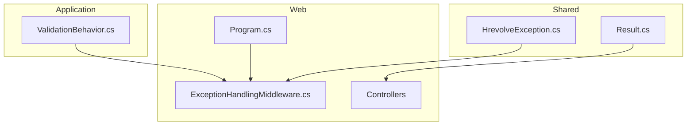
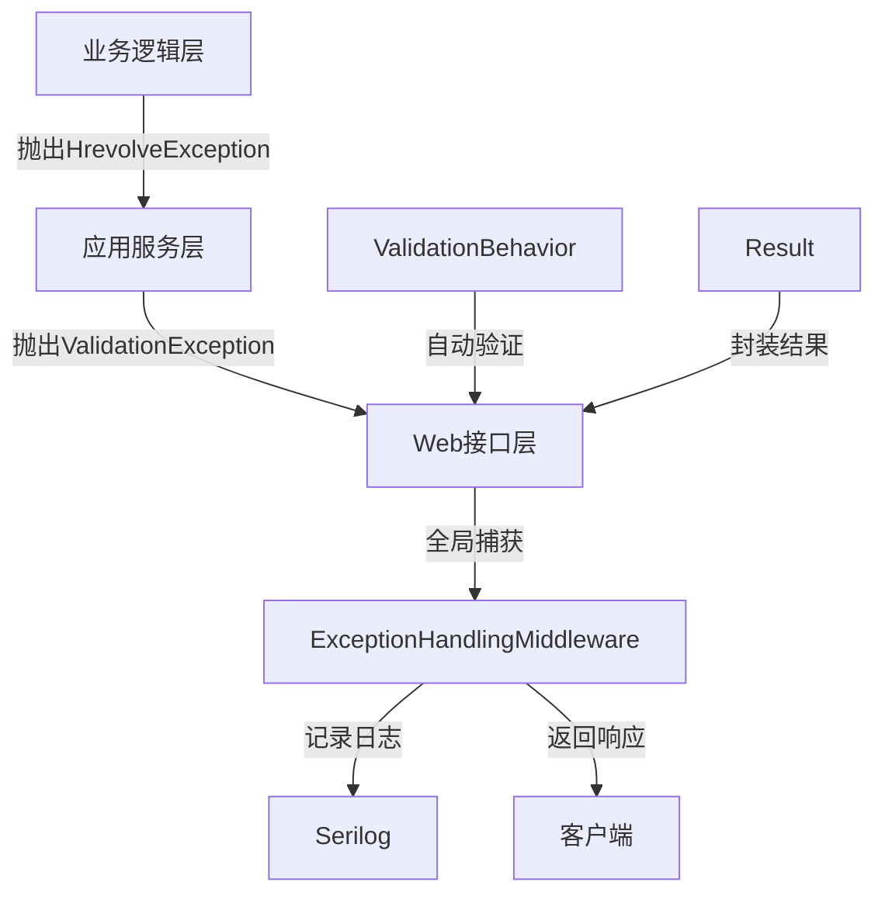
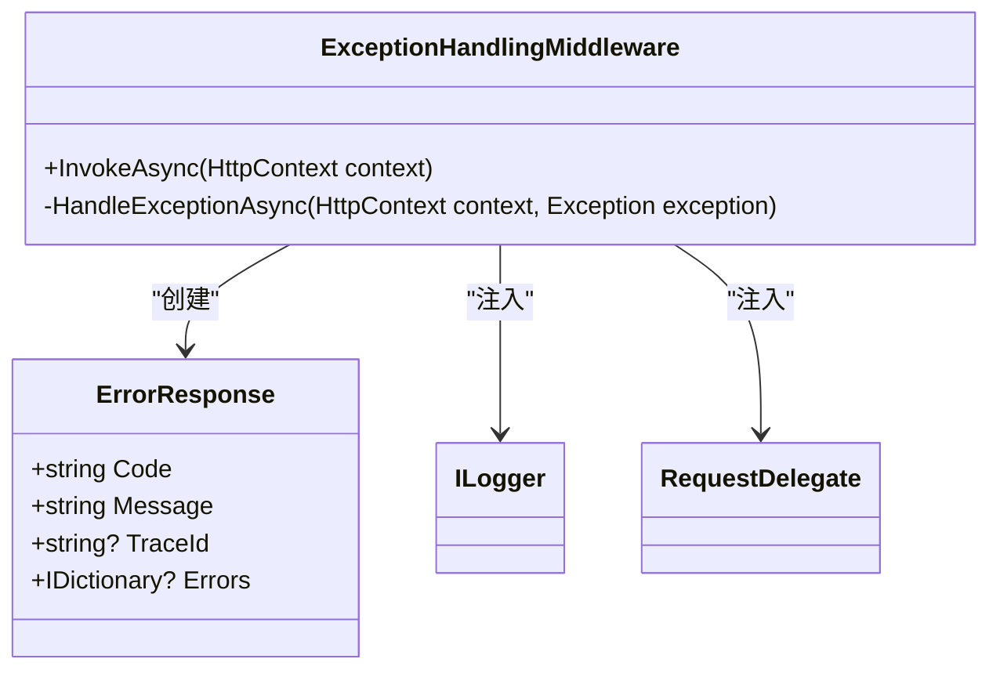
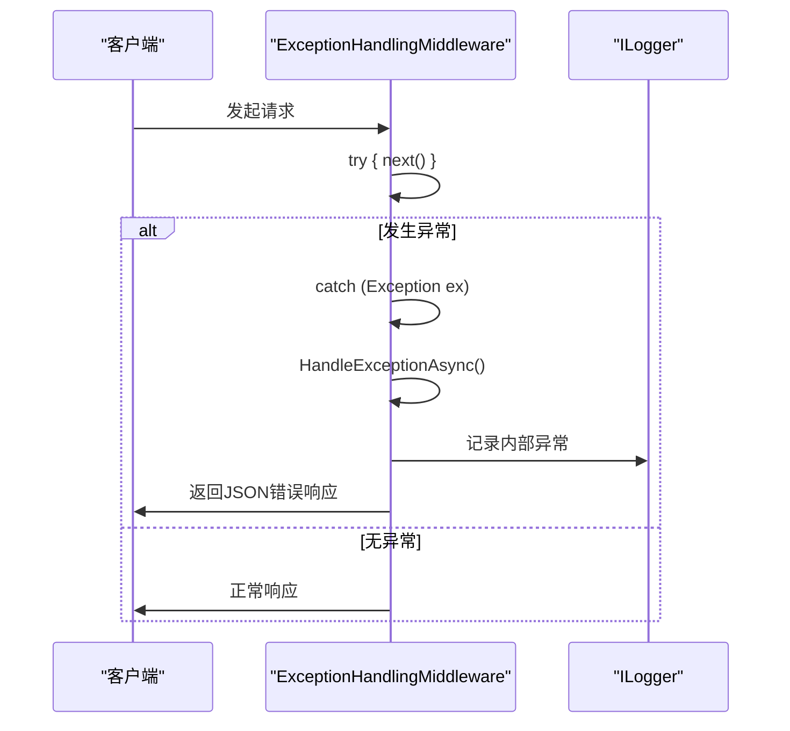
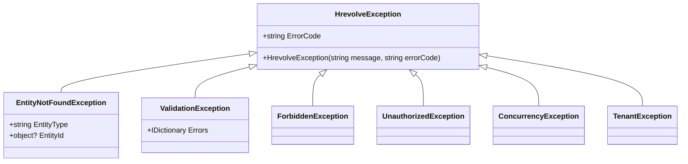
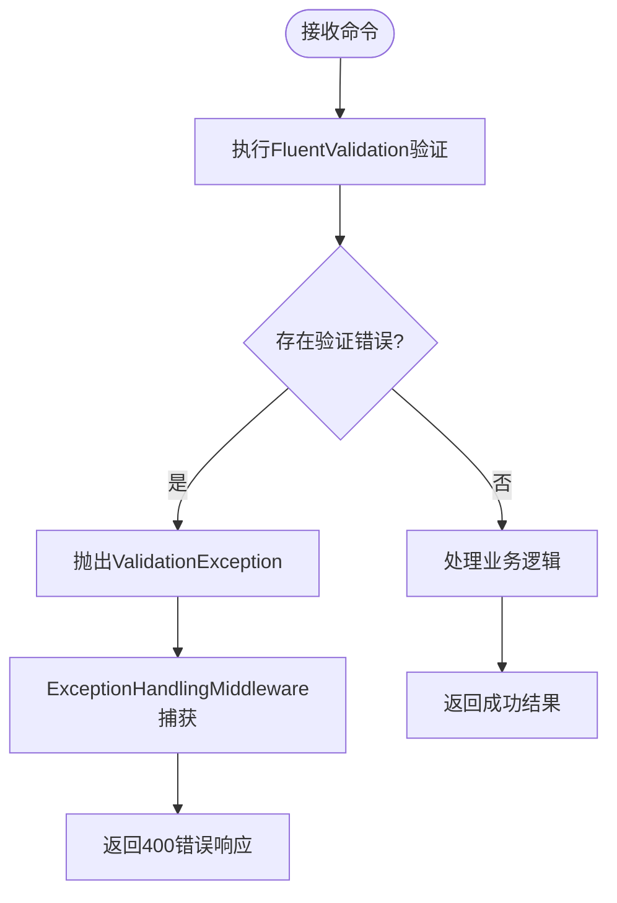
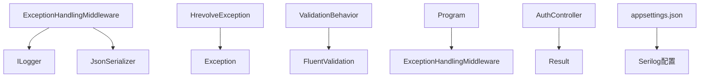

# 异常处理中间件

<cite>
**本文档引用文件**  
- [ExceptionHandlingMiddleware.cs](file://Backend/Hrevolve.Web/Middleware/ExceptionHandlingMiddleware.cs)
- [HrevolveException.cs](file://Backend/Hrevolve.Shared/Exceptions/HrevolveException.cs)
- [Result.cs](file://Backend/Hrevolve.Shared/Results/Result.cs)
- [Program.cs](file://Backend/Hrevolve.Web/Program.cs)
- [appsettings.json](file://Backend/Hrevolve.Web/appsettings.json)
- [appsettings.Development.json](file://Backend/Hrevolve.Web/appsettings.Development.json)
- [ValidationBehavior.cs](file://Backend/Hrevolve.Application/Behaviors/ValidationBehavior.cs)
- [CreateEmployeeCommand.cs](file://Backend/Hrevolve.Application/Employees/Commands/CreateEmployeeCommand.cs)
- [LoginCommand.cs](file://Backend/Hrevolve.Application/Identity/Commands/LoginCommand.cs)
- [AuthController.cs](file://Backend/Hrevolve.Web/Controllers/AuthController.cs)
- [TenantMiddleware.cs](file://Backend/Hrevolve.Web/Middleware/TenantMiddleware.cs)
</cite>

## 目录
1. [简介](#简介)
2. [项目结构](#项目结构)
3. [核心组件](#核心组件)
4. [架构概述](#架构概述)
5. [详细组件分析](#详细组件分析)
6. [依赖分析](#依赖分析)
7. [性能考虑](#性能考虑)
8. [故障排除指南](#故障排除指南)
9. [结论](#结论)

## 简介
Hrevolve系统采用统一的异常处理机制，通过全局异常处理中间件捕获所有未处理的异常，并将其转换为标准化的响应格式。该机制支持验证异常、业务异常和系统异常的分类处理，结合Serilog进行日志记录，实现敏感信息过滤和HTTP状态码映射。在开发和生产环境中采用不同的错误暴露级别，确保系统安全性和可维护性。

## 项目结构
异常处理相关组件分布在多个项目中，形成清晰的分层架构。核心异常定义位于共享库中，确保各层一致性；中间件实现位于Web层，负责全局异常捕获；应用层通过行为管道实现验证异常的自动抛出。

**图示来源**  
- [HrevolveException.cs](file://Backend/Hrevolve.Shared/Exceptions/HrevolveException.cs)
- [ExceptionHandlingMiddleware.cs](file://Backend/Hrevolve.Web/Middleware/ExceptionHandlingMiddleware.cs)
- [ValidationBehavior.cs](file://Backend/Hrevolve.Application/Behaviors/ValidationBehavior.cs)
- [Program.cs](file://Backend/Hrevolve.Web/Program.cs)

**本节来源**  
- [HrevolveException.cs](file://Backend/Hrevolve.Shared/Exceptions/HrevolveException.cs)
- [ExceptionHandlingMiddleware.cs](file://Backend/Hrevolve.Web/Middleware/ExceptionHandlingMiddleware.cs)

## 核心组件
系统的核心异常处理组件包括：HrevolveException异常体系、ExceptionHandlingMiddleware中间件、ErrorResponse响应模型和Result统一返回类型。这些组件协同工作，实现了从异常抛出到客户端响应的完整处理链路。

**本节来源**  
- [ExceptionHandlingMiddleware.cs](file://Backend/Hrevolve.Web/Middleware/ExceptionHandlingMiddleware.cs)
- [HrevolveException.cs](file://Backend/Hrevolve.Shared/Exceptions/HrevolveException.cs)
- [Result.cs](file://Backend/Hrevolve.Shared/Results/Result.cs)

## 架构概述
异常处理架构采用分层设计，从下至上包括异常定义层、业务逻辑层、应用服务层和Web接口层。各层通过约定的异常类型进行通信，最终由全局中间件统一拦截和处理。

**图示来源**  
- [ExceptionHandlingMiddleware.cs](file://Backend/Hrevolve.Web/Middleware/ExceptionHandlingMiddleware.cs)
- [HrevolveException.cs](file://Backend/Hrevolve.Shared/Exceptions/HrevolveException.cs)
- [ValidationBehavior.cs](file://Backend/Hrevolve.Application/Behaviors/ValidationBehavior.cs)
- [Result.cs](file://Backend/Hrevolve.Shared/Results/Result.cs)

## 详细组件分析
### 异常处理中间件分析
ExceptionHandlingMiddleware是系统全局异常处理的核心组件，采用典型的中间件模式，通过try-catch包裹请求委托，捕获所有未处理的异常。

#### 对象导向组件：

**图示来源**  
- [ExceptionHandlingMiddleware.cs](file://Backend/Hrevolve.Web/Middleware/ExceptionHandlingMiddleware.cs)

#### API/服务组件：

**图示来源**  
- [ExceptionHandlingMiddleware.cs](file://Backend/Hrevolve.Web/Middleware/ExceptionHandlingMiddleware.cs)

**本节来源**  
- [ExceptionHandlingMiddleware.cs](file://Backend/Hrevolve.Web/Middleware/ExceptionHandlingMiddleware.cs)

### HrevolveException体系分析
HrevolveException是所有业务异常的基类，通过继承体系实现不同类型的异常分类，支持错误代码和消息的标准化。

#### 对象导向组件：

**图示来源**  
- [HrevolveException.cs](file://Backend/Hrevolve.Shared/Exceptions/HrevolveException.cs)

**本节来源**  
- [HrevolveException.cs](file://Backend/Hrevolve.Shared/Exceptions/HrevolveException.cs)

### 验证异常处理流程
验证异常通过MediatR的行为管道自动处理，ValidationBehavior在命令处理前执行验证，失败时抛出ValidationException。

#### 复杂逻辑组件：

**图示来源**  
- [ValidationBehavior.cs](file://Backend/Hrevolve.Application/Behaviors/ValidationBehavior.cs)
- [ExceptionHandlingMiddleware.cs](file://Backend/Hrevolve.Web/Middleware/ExceptionHandlingMiddleware.cs)

**本节来源**  
- [ValidationBehavior.cs](file://Backend/Hrevolve.Application/Behaviors/ValidationBehavior.cs)

## 依赖分析
异常处理组件依赖于多个核心服务和配置，形成完整的异常处理生态系统。

**图示来源**  
- [ExceptionHandlingMiddleware.cs](file://Backend/Hrevolve.Web/Middleware/ExceptionHandlingMiddleware.cs)
- [HrevolveException.cs](file://Backend/Hrevolve.Shared/Exceptions/HrevolveException.cs)
- [Program.cs](file://Backend/Hrevolve.Web/Program.cs)
- [appsettings.json](file://Backend/Hrevolve.Web/appsettings.json)

**本节来源**  
- [ExceptionHandlingMiddleware.cs](file://Backend/Hrevolve.Web/Middleware/ExceptionHandlingMiddleware.cs)
- [HrevolveException.cs](file://Backend/Hrevolve.Shared/Exceptions/HrevolveException.cs)
- [Program.cs](file://Backend/Hrevolve.Web/Program.cs)

## 性能考虑
异常处理机制对系统性能的影响主要体现在异常发生时的处理开销。正常流程中，中间件仅执行简单的try-catch包装，性能开销极小。异常情况下，序列化错误响应和日志记录会产生额外开销，但这是必要的错误处理成本。

## 故障排除指南
当遇到异常处理相关问题时，可参考以下排查步骤：检查中间件注册顺序、验证异常类型继承关系、确认Serilog配置正确性、检查Result类型使用一致性。

**本节来源**  
- [ExceptionHandlingMiddleware.cs](file://Backend/Hrevolve.Web/Middleware/ExceptionHandlingMiddleware.cs)
- [HrevolveException.cs](file://Backend/Hrevolve.Shared/Exceptions/HrevolveException.cs)
- [appsettings.json](file://Backend/Hrevolve.Web/appsettings.json)

## 结论
Hrevolve的异常处理设计实现了关注点分离和标准化响应，通过中间件模式统一处理所有异常，结合自定义异常体系和Result类型，提供了清晰的错误处理契约。该设计既保证了系统的健壮性，又提高了开发效率和用户体验。