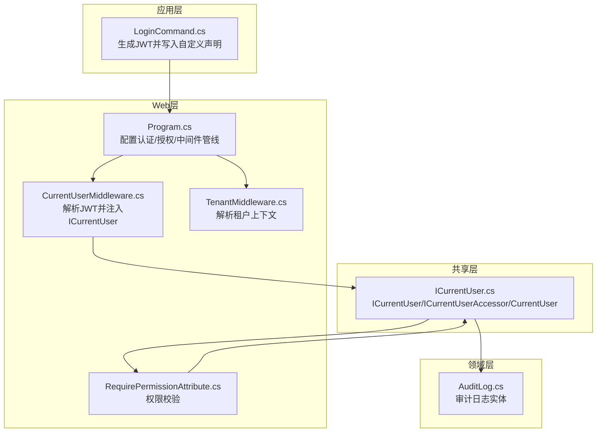
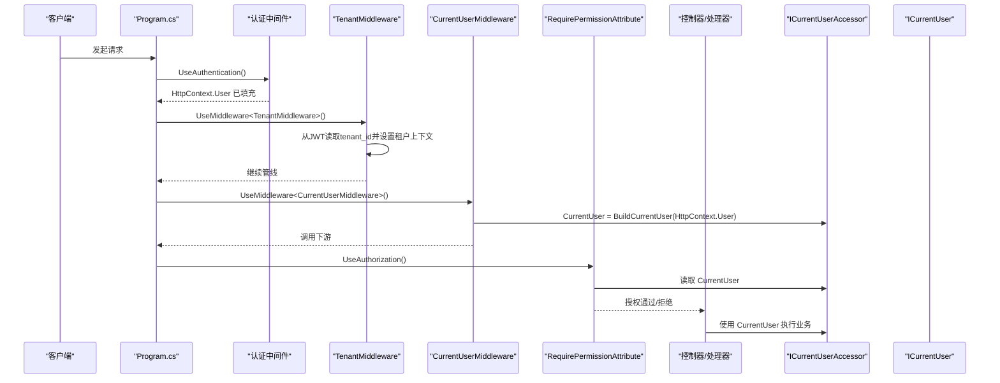
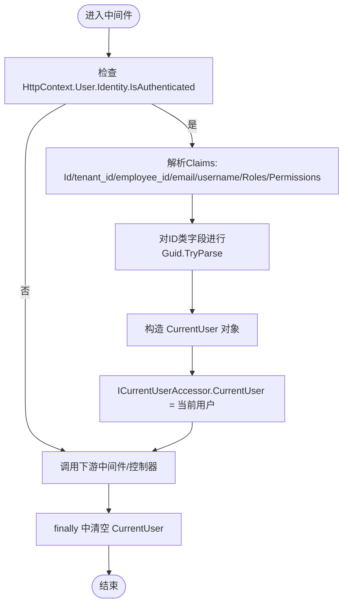
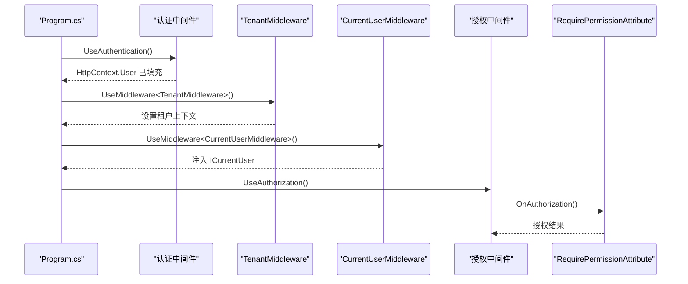
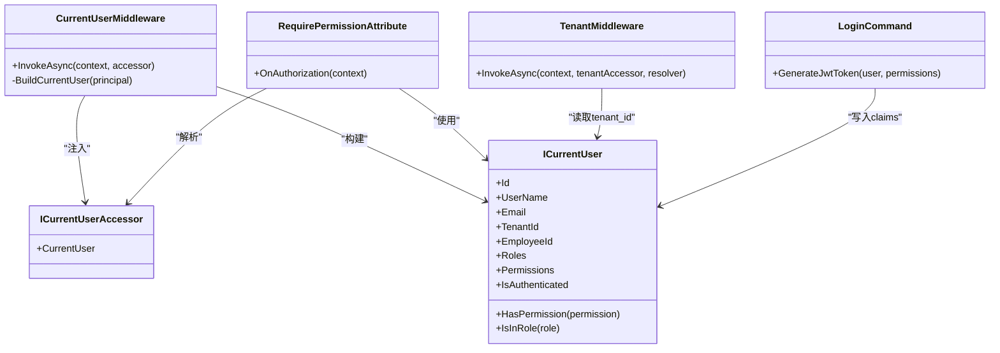

# 当前用户中间件

<cite>
**本文引用的文件**
- [CurrentUserMiddleware.cs](file://Backend/Hrevolve.Web/Middleware/CurrentUserMiddleware.cs)
- [ICurrentUser.cs](file://Backend/Hrevolve.Shared/Identity/ICurrentUser.cs)
- [Program.cs](file://Backend/Hrevolve.Web/Program.cs)
- [RequirePermissionAttribute.cs](file://Backend/Hrevolve.Web/Filters/RequirePermissionAttribute.cs)
- [TenantMiddleware.cs](file://Backend/Hrevolve.Web/Middleware/TenantMiddleware.cs)
- [LoginCommand.cs](file://Backend/Hrevolve.Application/Identity/Commands/LoginCommand.cs)
- [AuditLog.cs](file://Backend/Hrevolve.Domain/Audit/AuditLog.cs)
</cite>

## 目录
1. [简介](#简介)
2. [项目结构](#项目结构)
3. [核心组件](#核心组件)
4. [架构总览](#架构总览)
5. [详细组件分析](#详细组件分析)
6. [依赖关系分析](#依赖关系分析)
7. [性能考量](#性能考量)
8. [故障排查指南](#故障排查指南)
9. [结论](#结论)

## 简介
本文件围绕“当前用户中间件”展开，系统性阐述其如何从JWT令牌中解析用户身份信息（如用户ID、租户ID、员工ID、用户名、邮箱、角色、权限等），并通过ICurrentUser服务将用户上下文注入到整个请求生命周期中，确保后续授权校验与审计日志记录的准确性。文档同时解释中间件在认证后、授权前的执行时机，以及ClaimsPrincipal的映射逻辑与线程上下文传递机制；最后提供调试用户上下文丢失问题的方法，并说明与ASP.NET Core原生User对象的集成策略。

## 项目结构
当前用户中间件位于Web层中间件目录，配合共享层的ICurrentUser接口与访问器、程序入口中的认证与中间件管线配置共同工作。多租户中间件在认证之后运行，以便从JWT中读取租户ID；权限过滤器在授权阶段使用当前用户上下文进行权限判定。

图表来源
- [Program.cs](file://Backend/Hrevolve.Web/Program.cs#L141-L156)
- [CurrentUserMiddleware.cs](file://Backend/Hrevolve.Web/Middleware/CurrentUserMiddleware.cs#L1-L57)
- [TenantMiddleware.cs](file://Backend/Hrevolve.Web/Middleware/TenantMiddleware.cs#L1-L133)
- [RequirePermissionAttribute.cs](file://Backend/Hrevolve.Web/Filters/RequirePermissionAttribute.cs#L1-L80)
- [ICurrentUser.cs](file://Backend/Hrevolve.Shared/Identity/ICurrentUser.cs#L1-L115)
- [LoginCommand.cs](file://Backend/Hrevolve.Application/Identity/Commands/LoginCommand.cs#L128-L162)
- [AuditLog.cs](file://Backend/Hrevolve.Domain/Audit/AuditLog.cs#L1-L126)

章节来源
- [Program.cs](file://Backend/Hrevolve.Web/Program.cs#L141-L156)

## 核心组件
- 当前用户中间件：在认证成功后、授权前，从HttpContext.User（即ClaimsPrincipal）解析用户身份与权限，构建CurrentUser并注入ICurrentUserAccessor，供后续授权与业务逻辑使用。
- ICurrentUser接口与实现：统一抽象当前用户信息，包含用户ID、用户名、邮箱、租户ID、员工ID、角色集合、权限集合、认证状态及权限/角色查询方法。
- ICurrentUserAccessor与CurrentUserAccessor：以AsyncLocal实现线程上下文隔离，确保每个请求的用户上下文独立且可清理。
- 权限过滤器：在授权阶段读取ICurrentUserAccessor.CurrentUser，进行权限校验与拒绝处理。
- 多租户中间件：在认证后从JWT读取租户ID，设置ITenantContext，当前用户中间件随后注入ICurrentUser，两者配合保证租户维度的上下文一致性。
- 登录命令：生成JWT时写入自定义声明（如tenant_id、employee_id、username、permission等），为当前用户中间件提供数据源。
- 审计日志：在领域层记录操作时可使用当前用户上下文（如UserId、UserName、TenantId）进行审计追踪。

章节来源
- [CurrentUserMiddleware.cs](file://Backend/Hrevolve.Web/Middleware/CurrentUserMiddleware.cs#L1-L57)
- [ICurrentUser.cs](file://Backend/Hrevolve.Shared/Identity/ICurrentUser.cs#L1-L115)
- [RequirePermissionAttribute.cs](file://Backend/Hrevolve.Web/Filters/RequirePermissionAttribute.cs#L1-L80)
- [TenantMiddleware.cs](file://Backend/Hrevolve.Web/Middleware/TenantMiddleware.cs#L1-L133)
- [LoginCommand.cs](file://Backend/Hrevolve.Application/Identity/Commands/LoginCommand.cs#L128-L162)
- [AuditLog.cs](file://Backend/Hrevolve.Domain/Audit/AuditLog.cs#L1-L126)

## 架构总览
当前用户中间件处于认证与授权之间，负责将JWT中的Claims映射为统一的ICurrentUser对象，并通过ICurrentUserAccessor在线程上下文中传递。权限过滤器在授权阶段读取该上下文完成权限校验；审计日志在领域层使用该上下文记录操作者信息。

图表来源
- [Program.cs](file://Backend/Hrevolve.Web/Program.cs#L141-L156)
- [TenantMiddleware.cs](file://Backend/Hrevolve.Web/Middleware/TenantMiddleware.cs#L1-L133)
- [CurrentUserMiddleware.cs](file://Backend/Hrevolve.Web/Middleware/CurrentUserMiddleware.cs#L1-L57)
- [RequirePermissionAttribute.cs](file://Backend/Hrevolve.Web/Filters/RequirePermissionAttribute.cs#L1-L80)
- [ICurrentUser.cs](file://Backend/Hrevolve.Shared/Identity/ICurrentUser.cs#L1-L115)

## 详细组件分析

### ClaimsPrincipal 映射与线程上下文传递
- Claims映射逻辑：
  - 用户ID：优先从标准NameIdentifier，其次从自定义sub。
  - 租户ID：从自定义tenant_id。
  - 员工ID：从自定义employee_id。
  - 邮箱：优先从标准Email，其次从自定义email。
  - 用户名：从自定义username。
  - 角色：从标准Role声明集合。
  - 权限：从自定义permission声明集合。
- 类型转换：用户ID、租户ID、员工ID均尝试Guid.TryParse，失败则为null，避免异常传播。
- 线程上下文：通过ICurrentUserAccessor.CurrentUser设置与清理，使用AsyncLocal确保每个请求的上下文隔离，避免并发污染。

图表来源
- [CurrentUserMiddleware.cs](file://Backend/Hrevolve.Web/Middleware/CurrentUserMiddleware.cs#L1-L57)
- [ICurrentUser.cs](file://Backend/Hrevolve.Shared/Identity/ICurrentUser.cs#L1-L115)

章节来源
- [CurrentUserMiddleware.cs](file://Backend/Hrevolve.Web/Middleware/CurrentUserMiddleware.cs#L1-L57)
- [ICurrentUser.cs](file://Backend/Hrevolve.Shared/Identity/ICurrentUser.cs#L1-L115)

### 执行时机与控制流
- 认证后、授权前：当前用户中间件在UseAuthentication与UseAuthorization之间注册，确保HttpContext.User已由ASP.NET Core认证管线填充。
- 多租户中间件在认证之后运行，优先从JWT读取tenant_id设置租户上下文；当前用户中间件随后注入ICurrentUser，二者顺序保证了租户维度的上下文一致性。
- 权限过滤器在授权阶段读取ICurrentUserAccessor.CurrentUser进行权限校验。

图表来源
- [Program.cs](file://Backend/Hrevolve.Web/Program.cs#L141-L156)
- [TenantMiddleware.cs](file://Backend/Hrevolve.Web/Middleware/TenantMiddleware.cs#L1-L133)
- [CurrentUserMiddleware.cs](file://Backend/Hrevolve.Web/Middleware/CurrentUserMiddleware.cs#L1-L57)
- [RequirePermissionAttribute.cs](file://Backend/Hrevolve.Web/Filters/RequirePermissionAttribute.cs#L1-L80)

章节来源
- [Program.cs](file://Backend/Hrevolve.Web/Program.cs#L141-L156)
- [TenantMiddleware.cs](file://Backend/Hrevolve.Web/Middleware/TenantMiddleware.cs#L1-L133)
- [RequirePermissionAttribute.cs](file://Backend/Hrevolve.Web/Filters/RequirePermissionAttribute.cs#L1-L80)

### 与ASP.NET Core原生User对象的集成
- ASP.NET Core认证管线将JWT解析为ClaimsPrincipal并填充到HttpContext.User。
- 当前用户中间件直接读取HttpContext.User，无需额外适配，天然与框架集成。
- 通过ICurrentUserAccessor.CurrentUser暴露统一的用户抽象，避免业务层直接依赖HttpContext。

章节来源
- [Program.cs](file://Backend/Hrevolve.Web/Program.cs#L70-L89)
- [CurrentUserMiddleware.cs](file://Backend/Hrevolve.Web/Middleware/CurrentUserMiddleware.cs#L1-L57)

### 在领域层与应用层的安全访问
- 应用层：可通过依赖注入获取ICurrentUserAccessor并在处理器中读取CurrentUser，结合ITenantContext进行租户维度的数据访问控制。
- 领域层：审计日志实体支持记录UserId、UserName、TenantId等字段，便于在领域事件或仓储操作中写入审计信息。
- 注意：当前仓库未直接展示应用层对ICurrentUser的显式使用示例，但接口设计与管线配置已满足安全访问需求。

章节来源
- [ICurrentUser.cs](file://Backend/Hrevolve.Shared/Identity/ICurrentUser.cs#L1-L115)
- [AuditLog.cs](file://Backend/Hrevolve.Domain/Audit/AuditLog.cs#L1-L126)

### 权限校验与审计日志
- 权限校验：RequirePermissionAttribute在授权阶段读取ICurrentUserAccessor.CurrentUser，支持“任一权限”或“全部权限”两种模式，并内置系统管理员豁免逻辑。
- 审计日志：AuditLog实体提供创建与请求信息设置方法，可在业务操作中传入当前用户上下文（UserId、UserName、TenantId）与请求上下文（IP、UA、路径、TraceId、CorrelationId）。

章节来源
- [RequirePermissionAttribute.cs](file://Backend/Hrevolve.Web/Filters/RequirePermissionAttribute.cs#L1-L80)
- [AuditLog.cs](file://Backend/Hrevolve.Domain/Audit/AuditLog.cs#L1-L126)

## 依赖关系分析
- 当前用户中间件依赖：
  - HttpContext.User（由认证中间件填充）
  - ICurrentUserAccessor（注入）
  - ICurrentUser（构建）
- 权限过滤器依赖：
  - IServiceProvider解析ICurrentUserAccessor
  - ICurrentUser进行HasPermission/IsInRole判断
- 多租户中间件依赖：
  - HttpContext.User读取tenant_id
  - ITenantContextAccessor设置租户上下文
- 登录命令依赖：
  - 生成JWT时写入自定义声明（tenant_id、employee_id、username、permission等）

图表来源
- [CurrentUserMiddleware.cs](file://Backend/Hrevolve.Web/Middleware/CurrentUserMiddleware.cs#L1-L57)
- [ICurrentUser.cs](file://Backend/Hrevolve.Shared/Identity/ICurrentUser.cs#L1-L115)
- [RequirePermissionAttribute.cs](file://Backend/Hrevolve.Web/Filters/RequirePermissionAttribute.cs#L1-L80)
- [TenantMiddleware.cs](file://Backend/Hrevolve.Web/Middleware/TenantMiddleware.cs#L1-L133)
- [LoginCommand.cs](file://Backend/Hrevolve.Application/Identity/Commands/LoginCommand.cs#L128-L162)

章节来源
- [Program.cs](file://Backend/Hrevolve.Web/Program.cs#L141-L156)
- [ICurrentUser.cs](file://Backend/Hrevolve.Shared/Identity/ICurrentUser.cs#L1-L115)

## 性能考量
- Claims解析为轻量内存操作，开销极低。
- AsyncLocal在线程内传递上下文，避免跨线程同步成本。
- 中间件仅在认证成功的请求上设置上下文，未认证请求不会产生额外分配。
- 建议：
  - 控制权限声明数量，避免过大的JWT体积影响网络传输与解析。
  - 在高并发场景下，保持中间件顺序与最小化上下文对象大小，有助于降低GC压力。

## 故障排查指南
- 症状：权限过滤器返回未授权或权限不足。
  - 检查认证中间件是否正确配置，确保HttpContext.User已填充。
  - 检查当前用户中间件是否在认证后、授权前执行。
  - 检查JWT中是否存在期望的自定义声明（如tenant_id、employee_id、username、permission等）。
  - 检查ICurrentUserAccessor.CurrentUser是否被finally清理为null（应在中间件范围内使用）。
- 症状：租户上下文缺失导致业务异常。
  - 确认多租户中间件在认证之后执行。
  - 确认JWT中包含tenant_id声明。
- 症状：审计日志缺少操作者信息。
  - 确保在业务操作中使用当前用户上下文（UserId、UserName、TenantId）写入审计日志。
- 症状：用户上下文在异步/后台任务中丢失。
  - AsyncLocal默认在线程切换时丢失，需确保在同一线程上下文中使用ICurrentUser。
  - 如需跨线程传递，考虑显式传递用户上下文或重构为同步上下文。

章节来源
- [Program.cs](file://Backend/Hrevolve.Web/Program.cs#L141-L156)
- [TenantMiddleware.cs](file://Backend/Hrevolve.Web/Middleware/TenantMiddleware.cs#L1-L133)
- [RequirePermissionAttribute.cs](file://Backend/Hrevolve.Web/Filters/RequirePermissionAttribute.cs#L1-L80)
- [CurrentUserMiddleware.cs](file://Backend/Hrevolve.Web/Middleware/CurrentUserMiddleware.cs#L1-L57)

## 结论
当前用户中间件通过在认证后、授权前的精准时机，将JWT中的Claims映射为统一的ICurrentUser对象，并借助AsyncLocal在线程上下文中安全传递，为后续权限校验与审计日志提供了可靠基础。结合多租户中间件与权限过滤器，系统实现了清晰的认证-授权-审计闭环。建议在生产环境中持续关注JWT声明的最小化与上下文生命周期管理，以获得更好的性能与稳定性。