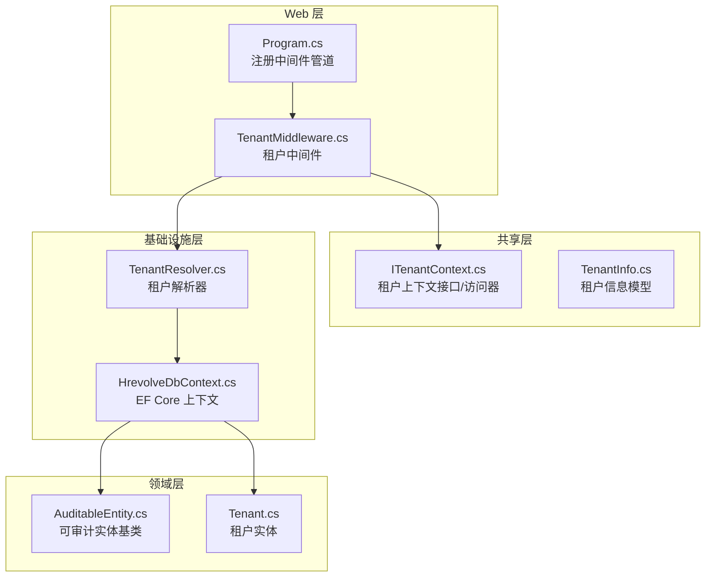
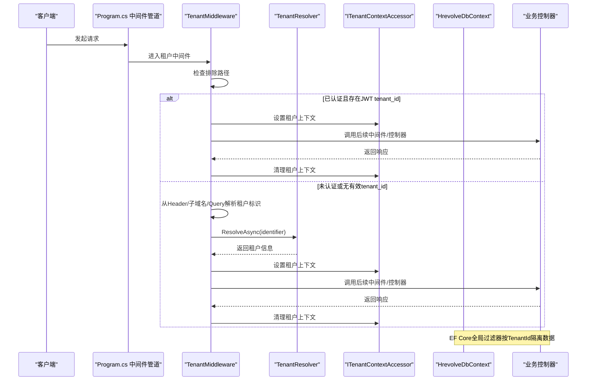
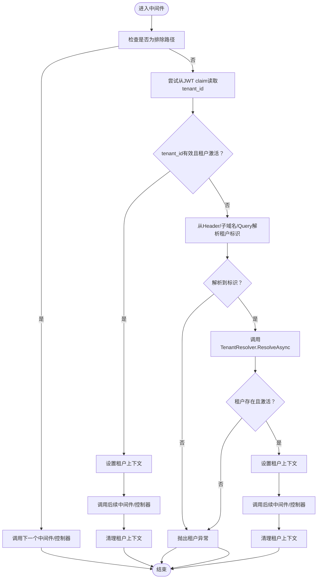
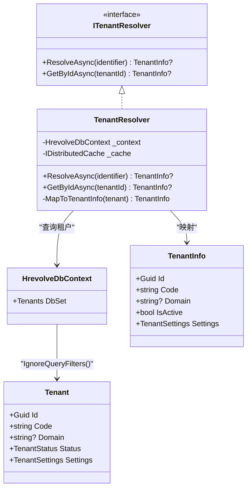
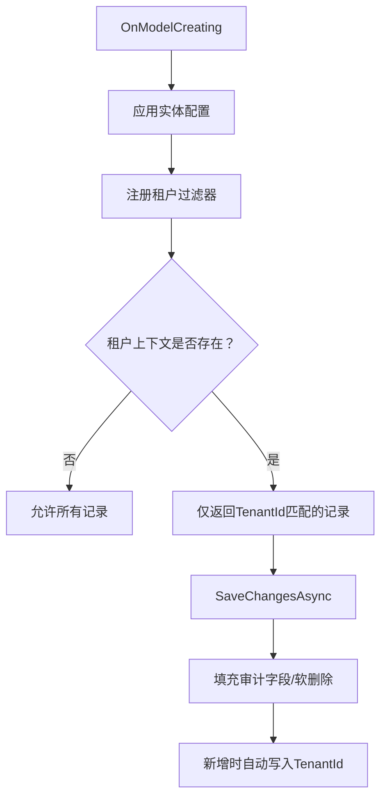
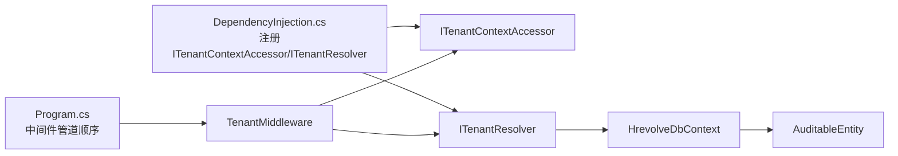

# 租户中间件

<cite>
**本文引用的文件列表**
- [TenantMiddleware.cs](file://Backend/Hrevolve.Web/Middleware/TenantMiddleware.cs)
- [TenantResolver.cs](file://Backend/Hrevolve.Infrastructure/MultiTenancy/TenantResolver.cs)
- [ITenantContext.cs](file://Backend/Hrevolve.Shared/MultiTenancy/ITenantContext.cs)
- [TenantInfo.cs](file://Backend/Hrevolve.Shared/MultiTenancy/TenantInfo.cs)
- [HrevolveDbContext.cs](file://Backend/Hrevolve.Infrastructure/Persistence/HrevolveDbContext.cs)
- [AuditableEntity.cs](file://Backend/Hrevolve.Domain/Common/AuditableEntity.cs)
- [Tenant.cs](file://Backend/Hrevolve.Domain/Tenants/Tenant.cs)
- [Program.cs](file://Backend/Hrevolve.Web/Program.cs)
- [HrevolveException.cs](file://Backend/Hrevolve.Shared/Exceptions/HrevolveException.cs)
- [DependencyInjection.cs（基础设施层）](file://Backend/Hrevolve.Infrastructure/DependencyInjection.cs)
</cite>

## 目录
1. [简介](#简介)
2. [项目结构](#项目结构)
3. [核心组件](#核心组件)
4. [架构总览](#架构总览)
5. [详细组件分析](#详细组件分析)
6. [依赖关系分析](#依赖关系分析)
7. [性能考量](#性能考量)
8. [故障排查指南](#故障排查指南)
9. [结论](#结论)
10. [附录](#附录)

## 简介
本文件系统性解析多租户中间件 TenantMiddleware 的实现机制，说明其如何从 HTTP 请求头或 JWT 令牌中提取租户标识（Tenant ID），并通过 ITenantContext 服务在请求生命周期内设置租户上下文；同时阐述 ITenantContext 在多租户数据隔离中的核心作用，并解释 EF Core 全局查询过滤器如何实现行级隔离。文档还提供租户解析失败的处理策略与扩展点，说明如何支持基于域名、路径或 Header 的多租户路由模式，并结合代码示例展示中间件在请求管道中的执行顺序及其对后续业务逻辑的影响。

## 项目结构
围绕多租户的关键文件分布如下：
- Web 层：请求管道与中间件注册
- 基础设施层：租户解析器与数据库上下文
- 领域层：可审计实体与租户实体
- 共享层：租户上下文接口与信息模型
- 异常层：统一异常类型定义



图表来源
- [Program.cs](file://Backend/Hrevolve.Web/Program.cs#L141-L156)
- [TenantMiddleware.cs](file://Backend/Hrevolve.Web/Middleware/TenantMiddleware.cs#L21-L94)
- [TenantResolver.cs](file://Backend/Hrevolve.Infrastructure/MultiTenancy/TenantResolver.cs#L26-L56)
- [HrevolveDbContext.cs](file://Backend/Hrevolve.Infrastructure/Persistence/HrevolveDbContext.cs#L71-L98)
- [AuditableEntity.cs](file://Backend/Hrevolve.Domain/Common/AuditableEntity.cs#L1-L48)
- [Tenant.cs](file://Backend/Hrevolve.Domain/Tenants/Tenant.cs#L1-L38)

章节来源
- [Program.cs](file://Backend/Hrevolve.Web/Program.cs#L141-L156)

## 核心组件
- TenantMiddleware：在认证之后、业务控制器之前解析租户，设置/清理租户上下文，支持从 JWT claim 或请求头/子域名/查询参数解析租户标识。
- ITenantContext/ITenantContextAccessor：提供线程安全的租户上下文访问能力，贯穿整个请求生命周期。
- TenantResolver：根据标识（代码或域名）或租户 ID 解析租户信息，带缓存与数据库查询。
- HrevolveDbContext：注册全局查询过滤器，实现基于 TenantId 的行级隔离。
- AuditableEntity：所有需要多租户隔离的实体均继承该基类，包含 TenantId 字段。
- Tenant：领域层租户实体，包含状态、域名、连接串等信息。

章节来源
- [TenantMiddleware.cs](file://Backend/Hrevolve.Web/Middleware/TenantMiddleware.cs#L21-L94)
- [ITenantContext.cs](file://Backend/Hrevolve.Shared/MultiTenancy/ITenantContext.cs#L1-L81)
- [TenantResolver.cs](file://Backend/Hrevolve.Infrastructure/MultiTenancy/TenantResolver.cs#L26-L56)
- [HrevolveDbContext.cs](file://Backend/Hrevolve.Infrastructure/Persistence/HrevolveDbContext.cs#L71-L98)
- [AuditableEntity.cs](file://Backend/Hrevolve.Domain/Common/AuditableEntity.cs#L1-L48)
- [Tenant.cs](file://Backend/Hrevolve.Domain/Tenants/Tenant.cs#L1-L38)

## 架构总览
下图展示了请求在管道中的执行顺序与租户解析流程：



图表来源
- [Program.cs](file://Backend/Hrevolve.Web/Program.cs#L141-L156)
- [TenantMiddleware.cs](file://Backend/Hrevolve.Web/Middleware/TenantMiddleware.cs#L21-L94)
- [TenantResolver.cs](file://Backend/Hrevolve.Infrastructure/MultiTenancy/TenantResolver.cs#L26-L56)
- [HrevolveDbContext.cs](file://Backend/Hrevolve.Infrastructure/Persistence/HrevolveDbContext.cs#L71-L98)

## 详细组件分析

### TenantMiddleware：租户解析与上下文设置
- 排除路径：健康检查、Swagger、登录/注册/刷新/注销、本地化等无需租户解析的端点直接放行。
- 优先从 JWT 中解析租户 ID：若用户已认证且 JWT 中包含 tenant_id，则校验租户是否存在且处于激活状态，随后设置租户上下文并调用后续中间件/控制器，最后在 finally 中清理上下文。
- 从请求解析租户标识：支持三种来源，优先级为 Header > 子域名 > Query 参数。当解析到标识后，调用 TenantResolver.ResolveAsync(identifier)，校验租户存在性与激活状态，设置上下文并清理。
- 错误处理：当无法识别租户或租户不存在/未激活时抛出租户异常，由全局异常中间件统一处理。



图表来源
- [TenantMiddleware.cs](file://Backend/Hrevolve.Web/Middleware/TenantMiddleware.cs#L21-L94)

章节来源
- [TenantMiddleware.cs](file://Backend/Hrevolve.Web/Middleware/TenantMiddleware.cs#L21-L94)

### TenantResolver：租户解析与缓存
- 支持两种解析方式：
  - ResolveAsync(identifier)：根据租户代码或域名解析租户信息，忽略全局查询过滤器以确保能查询到被隔离的数据。
  - GetByIdAsync(tenantId)：根据租户 ID 查询租户信息。
- 缓存策略：使用分布式缓存，键前缀 tenant:identifier: 或 tenant:id:，默认缓存 30 分钟。
- 映射：将领域层 Tenant 映射为共享层 TenantInfo，包含租户基本信息与设置。



图表来源
- [TenantResolver.cs](file://Backend/Hrevolve.Infrastructure/MultiTenancy/TenantResolver.cs#L26-L56)
- [HrevolveDbContext.cs](file://Backend/Hrevolve.Infrastructure/Persistence/HrevolveDbContext.cs#L39-L46)
- [Tenant.cs](file://Backend/Hrevolve.Domain/Tenants/Tenant.cs#L1-L38)
- [TenantInfo.cs](file://Backend/Hrevolve.Shared/MultiTenancy/TenantInfo.cs#L1-L30)

章节来源
- [TenantResolver.cs](file://Backend/Hrevolve.Infrastructure/MultiTenancy/TenantResolver.cs#L26-L56)
- [Tenant.cs](file://Backend/Hrevolve.Domain/Tenants/Tenant.cs#L1-L38)
- [TenantInfo.cs](file://Backend/Hrevolve.Shared/MultiTenancy/TenantInfo.cs#L1-L30)

### ITenantContext：多租户上下文
- ITenantContext：暴露当前租户 ID、租户代码与是否已设置租户。
- ITenantContextAccessor：线程安全的租户上下文访问器，内部使用 AsyncLocal 存储，保证每个请求独立上下文。
- TenantContext：ITenantContext 的具体实现，构造时传入租户 ID 与代码。

```mermaid
classDiagram
class ITenantContext {
+Guid TenantId
+string? TenantCode
+bool HasTenant
}
class ITenantContextAccessor {
+TenantContext? TenantContext { get; set; }
}
class TenantContext {
+Guid TenantId
+string? TenantCode
+bool HasTenant
+TenantContext(tenantId, tenantCode)
}
class TenantContextAccessor {
+TenantContext? TenantContext { get; set; }
}
ITenantContext <|.. TenantContext
ITenantContextAccessor <|.. TenantContextAccessor
```

图表来源
- [ITenantContext.cs](file://Backend/Hrevolve.Shared/MultiTenancy/ITenantContext.cs#L1-L81)

章节来源
- [ITenantContext.cs](file://Backend/Hrevolve.Shared/MultiTenancy/ITenantContext.cs#L1-L81)

### EF Core 全局查询过滤器：行级隔离
- 在 OnModelCreating 中为所有继承自 AuditableEntity 的实体注册全局查询过滤器，过滤条件为：当租户上下文为空或实体 TenantId 等于当前租户 ID 时才返回记录。
- 保存变更时自动填充审计字段，并在新增记录且未显式赋值 TenantId 时，依据租户上下文自动写入。



图表来源
- [HrevolveDbContext.cs](file://Backend/Hrevolve.Infrastructure/Persistence/HrevolveDbContext.cs#L71-L98)
- [HrevolveDbContext.cs](file://Backend/Hrevolve.Infrastructure/Persistence/HrevolveDbContext.cs#L120-L155)
- [AuditableEntity.cs](file://Backend/Hrevolve.Domain/Common/AuditableEntity.cs#L1-L48)

章节来源
- [HrevolveDbContext.cs](file://Backend/Hrevolve.Infrastructure/Persistence/HrevolveDbContext.cs#L71-L98)
- [HrevolveDbContext.cs](file://Backend/Hrevolve.Infrastructure/Persistence/HrevolveDbContext.cs#L120-L155)
- [AuditableEntity.cs](file://Backend/Hrevolve.Domain/Common/AuditableEntity.cs#L1-L48)

## 依赖关系分析
- 中间件依赖注入：基础设施层注册 ITenantContextAccessor 单例与 ITenantResolver 作用域服务。
- 管道顺序：认证与授权在多租户中间件之前，确保能从 JWT 中提取 tenant_id；多租户中间件在当前用户中间件之前，以便后续业务逻辑可读取租户上下文。
- 数据访问：TenantResolver 通过 HrevolveDbContext 查询租户，使用 IgnoreQueryFilters() 以绕过租户过滤器，避免循环依赖与隔离失效。



图表来源
- [DependencyInjection.cs（基础设施层）](file://Backend/Hrevolve.Infrastructure/DependencyInjection.cs#L34-L36)
- [Program.cs](file://Backend/Hrevolve.Web/Program.cs#L141-L156)
- [TenantResolver.cs](file://Backend/Hrevolve.Infrastructure/MultiTenancy/TenantResolver.cs#L39-L46)
- [HrevolveDbContext.cs](file://Backend/Hrevolve.Infrastructure/Persistence/HrevolveDbContext.cs#L71-L98)

章节来源
- [DependencyInjection.cs（基础设施层）](file://Backend/Hrevolve.Infrastructure/DependencyInjection.cs#L34-L36)
- [Program.cs](file://Backend/Hrevolve.Web/Program.cs#L141-L156)

## 性能考量
- 缓存命中：TenantResolver 对 ResolveAsync 与 GetByIdAsync 结果进行缓存，显著降低数据库压力与延迟。
- 忽略过滤器：查询租户时使用 IgnoreQueryFilters()，避免因租户上下文缺失导致的查询失败。
- 上下文清理：中间件在 finally 中清理租户上下文，防止上下文泄漏影响后续请求。
- 过滤器反射：全局过滤器在 OnModelCreating 中动态为所有 AuditableEntity 注册，避免在运行时重复扫描实体。

章节来源
- [TenantResolver.cs](file://Backend/Hrevolve.Infrastructure/MultiTenancy/TenantResolver.cs#L26-L56)
- [HrevolveDbContext.cs](file://Backend/Hrevolve.Infrastructure/Persistence/HrevolveDbContext.cs#L71-L98)

## 故障排查指南
- 租户解析失败：
  - 未认证且缺少 JWT tenant_id：检查认证流程与 JWT 生成逻辑，确认 claims 中包含 tenant_id。
  - 请求头/子域名/查询参数缺失：确认客户端是否正确设置 X-Tenant-Id、子域名格式或查询参数 tenant。
  - 租户不存在或未激活：检查租户表数据与状态。
- 异常类型：统一使用租户异常类型，便于全局捕获与错误码标准化。
- 日志定位：中间件在关键步骤记录调试日志，可据此快速定位问题。

章节来源
- [TenantMiddleware.cs](file://Backend/Hrevolve.Web/Middleware/TenantMiddleware.cs#L34-L65)
- [HrevolveException.cs](file://Backend/Hrevolve.Shared/Exceptions/HrevolveException.cs#L93-L101)

## 结论
TenantMiddleware 通过“JWT 优先 + 请求解析”的双通道机制，确保在认证后、业务逻辑前完成租户上下文设置；ITenantContext 作为线程安全的上下文载体，配合 EF Core 全局查询过滤器实现了对所有 AuditableEntity 的行级隔离。TenantResolver 提供高效缓存与灵活解析能力，支撑多租户路由模式（Header/子域名/Query）。整体设计具备良好的扩展性与可维护性，适合在复杂多租户场景中稳定运行。

## 附录

### 请求管道中的执行顺序与影响
- 认证与授权：在多租户中间件之前，确保能从 JWT 中提取 tenant_id。
- 多租户中间件：解析租户并设置上下文，后续中间件与控制器均可读取。
- 当前用户中间件：在多租户之后，读取当前用户上下文。
- 控制器：基于租户上下文执行业务逻辑，EF Core 自动按 TenantId 过滤数据。

章节来源
- [Program.cs](file://Backend/Hrevolve.Web/Program.cs#L141-L156)

### 支持的多租户路由模式
- Header：X-Tenant-Id 请求头，优先级最高。
- 子域名：如 tenant.example.com，取第一个子域名为租户标识。
- Query 参数：tenant=xxx 查询参数。

章节来源
- [TenantMiddleware.cs](file://Backend/Hrevolve.Web/Middleware/TenantMiddleware.cs#L96-L131)