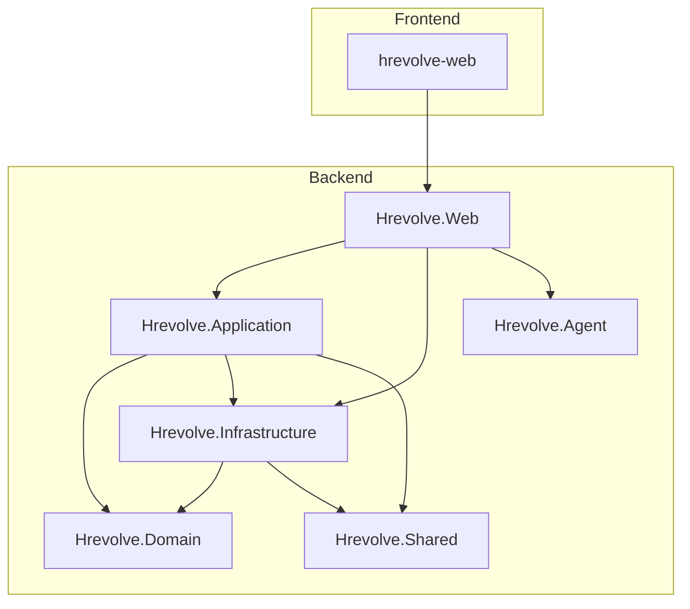
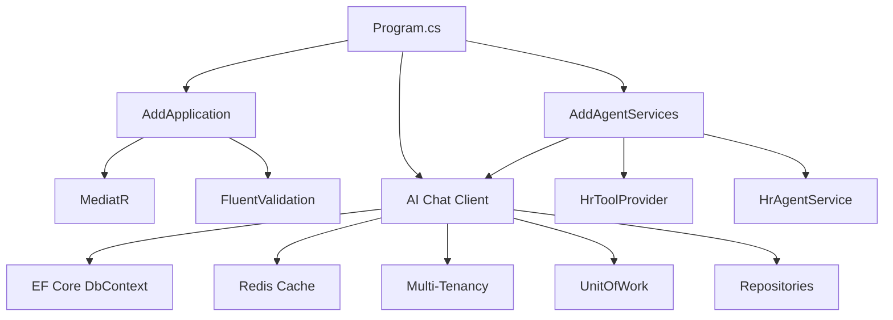
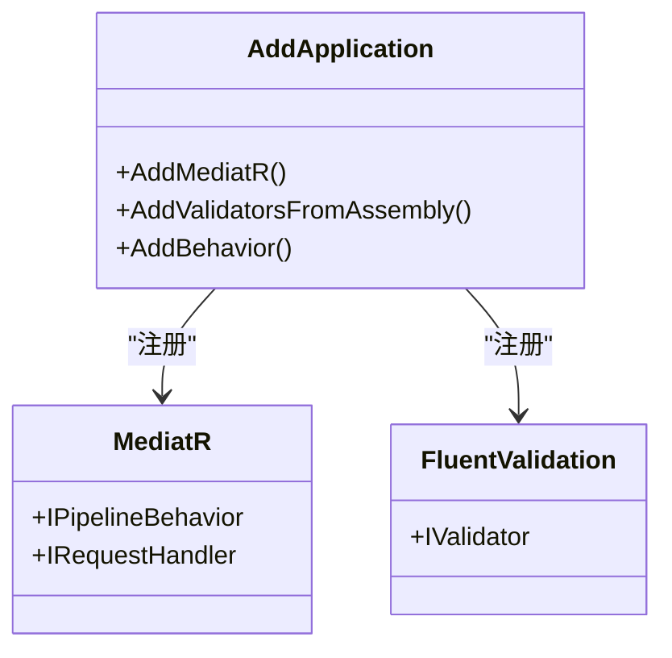
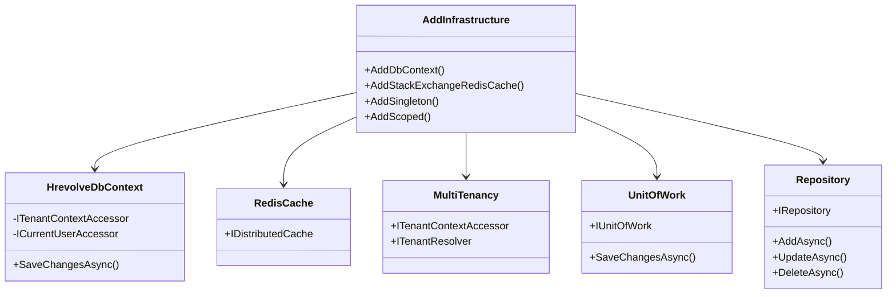
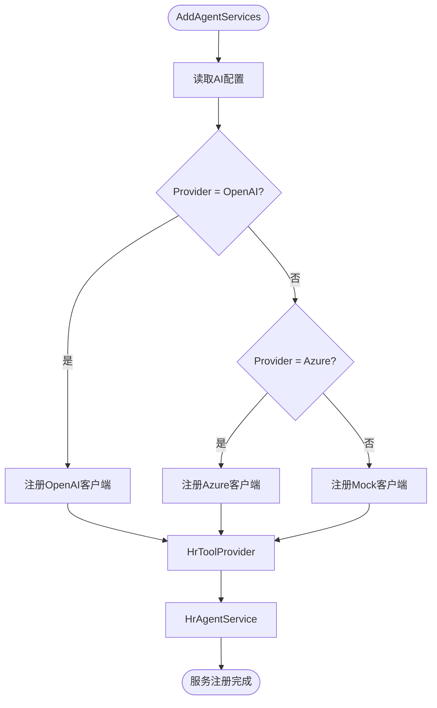
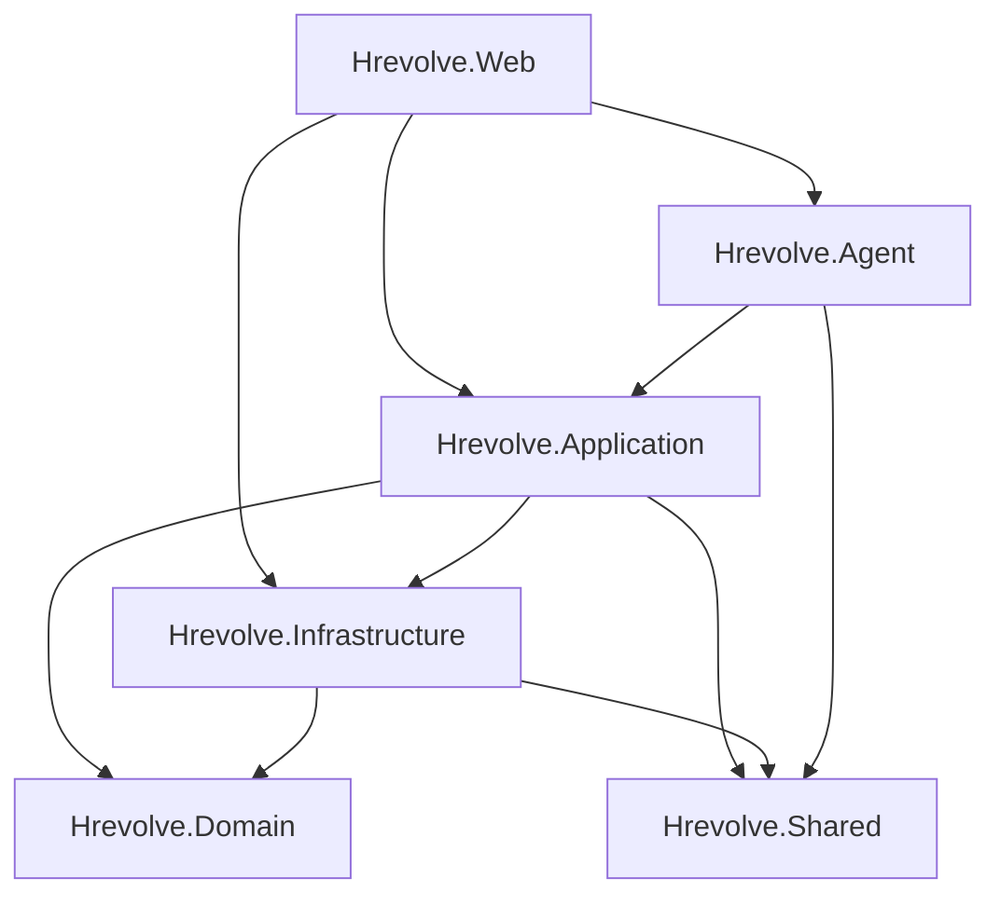

# 依赖注入配置

<cite>
**本文档中引用的文件**  
- [Program.cs](file://Backend/Hrevolve.Web/Program.cs)
- [DependencyInjection.cs](file://Backend/Hrevolve.Application/DependencyInjection.cs)
- [DependencyInjection.cs](file://Backend/Hrevolve.Infrastructure/DependencyInjection.cs)
- [DependencyInjection.cs](file://Backend/Hrevolve.Agent/DependencyInjection.cs)
- [HrevolveDbContext.cs](file://Backend/Hrevolve.Infrastructure/Persistence/HrevolveDbContext.cs)
- [TenantResolver.cs](file://Backend/Hrevolve.Infrastructure/MultiTenancy/TenantResolver.cs)
- [ICurrentUser.cs](file://Backend/Hrevolve.Shared/Identity/ICurrentUser.cs)
- [appsettings.json](file://Backend/Hrevolve.Web/appsettings.json)
- [appsettings.Development.json](file://Backend/Hrevolve.Web/appsettings.Development.json)
</cite>

## 目录
1. [简介](#简介)
2. [项目结构](#项目结构)
3. [核心组件](#核心组件)
4. [架构概述](#架构概述)
5. [详细组件分析](#详细组件分析)
6. [依赖分析](#依赖分析)
7. [性能考虑](#性能考虑)
8. [故障排除指南](#故障排除指南)
9. [结论](#结论)

## 简介
本文档全面文档化 Hrevolve 项目的依赖注入体系，重点分析 Application 和 Infrastructure 层的扩展方法 `AddApplication()` 和 `AddInfrastructure()` 如何注册服务。说明 `Program.cs` 中服务注册的顺序逻辑与最佳实践，详细列出各层注册的核心服务（如 MediatR、EF Core DbContext、Redis Cache、仓储实现等），并解释其生命周期（Scoped/Singleton/Transient）选择依据。提供自定义服务注册的示例，涵盖配置对象注入、条件注册和命名注册等高级场景。

## 项目结构
Hrevolve 是一个基于 .NET 的企业级 SaaS 人力资源管理系统，采用分层架构设计，主要包括 Backend、Frontend 和 Design 三个部分。Backend 包含多个项目，分别对应不同的职责层次：Application（应用层）、Domain（领域层）、Infrastructure（基础设施层）、Shared（共享层）和 Web（Web 层）。这种分层结构有助于实现关注点分离，提升代码可维护性和可测试性。

**Diagram sources**
- [Hrevolve.slnx](file://Backend/Hrevolve.slnx)

**Section sources**
- [Hrevolve.slnx](file://Backend/Hrevolve.slnx)

## 核心组件
本节分析 Hrevolve 项目中与依赖注入相关的核心组件，包括 `AddApplication`、`AddInfrastructure` 和 `AddAgentServices` 扩展方法，以及 `Program.cs` 中的服务注册流程。这些组件共同构成了系统的依赖注入体系，确保了服务的正确注册和解析。

**Section sources**
- [DependencyInjection.cs](file://Backend/Hrevolve.Application/DependencyInjection.cs)
- [DependencyInjection.cs](file://Backend/Hrevolve.Infrastructure/DependencyInjection.cs)
- [DependencyInjection.cs](file://Backend/Hrevolve.Agent/DependencyInjection.cs)
- [Program.cs](file://Backend/Hrevolve.Web/Program.cs)

## 架构概述
Hrevolve 的依赖注入体系遵循典型的分层架构模式，各层通过扩展方法向服务容器注册所需的服务。`Program.cs` 作为应用的入口点，负责调用这些扩展方法，完成服务的注册。整个体系的设计目标是实现松耦合、高内聚，便于单元测试和集成测试。

**Diagram sources**
- [Program.cs](file://Backend/Hrevolve.Web/Program.cs)
- [DependencyInjection.cs](file://Backend/Hrevolve.Application/DependencyInjection.cs)
- [DependencyInjection.cs](file://Backend/Hrevolve.Infrastructure/DependencyInjection.cs)
- [DependencyInjection.cs](file://Backend/Hrevolve.Agent/DependencyInjection.cs)

## 详细组件分析
本节深入分析 Hrevolve 项目中各个组件的依赖注入实现细节。

### Application 层服务注册
Application 层主要负责业务逻辑的编排和处理，通过 `AddApplication` 扩展方法注册相关服务。

#### 服务注册内容
- **MediatR**: 用于实现 CQRS 模式，注册程序集中所有处理程序（Handlers）。
- **FluentValidation**: 用于请求验证，注册程序集中所有验证器（Validators）。
- **Pipeline Behaviors**: 注册管道行为，如 `ValidationBehavior` 和 `LoggingBehavior`，用于在请求处理前后执行特定逻辑。

#### 生命周期管理
- MediatR 相关服务由框架自动管理，通常为 Singleton。
- 验证器（Validators）为 Transient，每次请求都创建新实例。
- Pipeline Behaviors 为 Singleton，全局共享。

**Diagram sources**
- [DependencyInjection.cs](file://Backend/Hrevolve.Application/DependencyInjection.cs)

**Section sources**
- [DependencyInjection.cs](file://Backend/Hrevolve.Application/DependencyInjection.cs)

### Infrastructure 层服务注册
Infrastructure 层负责数据访问和外部服务集成，通过 `AddInfrastructure` 扩展方法注册相关服务。

#### 服务注册内容
- **EF Core DbContext**: `HrevolveDbContext`，用于数据库访问。
- **Redis Cache**: 使用 `StackExchangeRedisCache` 实现分布式缓存。
- **多租户支持**: `ITenantContextAccessor`（Singleton）和 `ITenantResolver`（Scoped）。
- **当前用户访问器**: `ICurrentUserAccessor`（Singleton）。
- **工作单元**: `IUnitOfWork`（Scoped）。
- **仓储模式**: 通用仓储 `IRepository<T>` 和具体实体仓储（如 `IEmployeeRepository`），均为 Scoped。

#### 生命周期管理
- `HrevolveDbContext` 为 Scoped，确保每个请求使用独立的上下文实例。
- Redis Cache 为 Singleton，全局共享连接。
- `ITenantContextAccessor` 和 `ICurrentUserAccessor` 为 Singleton，通过内部状态管理实现请求级别的数据隔离。
- `IUnitOfWork` 和所有仓储为 Scoped，与数据库上下文生命周期一致。

**Diagram sources**
- [DependencyInjection.cs](file://Backend/Hrevolve.Infrastructure/DependencyInjection.cs)
- [HrevolveDbContext.cs](file://Backend/Hrevolve.Infrastructure/Persistence/HrevolveDbContext.cs)
- [TenantResolver.cs](file://Backend/Hrevolve.Infrastructure/MultiTenancy/TenantResolver.cs)

**Section sources**
- [DependencyInjection.cs](file://Backend/Hrevolve.Infrastructure/DependencyInjection.cs)
- [HrevolveDbContext.cs](file://Backend/Hrevolve.Infrastructure/Persistence/HrevolveDbContext.cs)
- [TenantResolver.cs](file://Backend/Hrevolve.Infrastructure/MultiTenancy/TenantResolver.cs)

### Agent 层服务注册
Agent 层基于 Microsoft Agent Framework 实现 AI 助手功能，通过 `AddAgentServices` 扩展方法注册相关服务。

#### 服务注册内容
- **AI Chat Client**: 根据配置动态选择实现（OpenAI、Azure OpenAI 或 Mock）。
- **HrToolProvider**: 提供 HR 相关工具和服务，Singleton。
- **HrAgentService**: AI 助手服务，处理用户请求，Scoped。

#### 条件注册
- 根据 `appsettings.json` 中的 `AI:Provider` 配置，动态选择 AI 客户端实现。
- 如果未配置 API Key，则使用 `MockChatClient`。

**Diagram sources**
- [DependencyInjection.cs](file://Backend/Hrevolve.Agent/DependencyInjection.cs)

**Section sources**
- [DependencyInjection.cs](file://Backend/Hrevolve.Agent/DependencyInjection.cs)

## 依赖分析
Hrevolve 项目的依赖关系清晰，各层之间通过接口进行通信，实现了松耦合。

**Diagram sources**
- [Hrevolve.slnx](file://Backend/Hrevolve.slnx)

**Section sources**
- [Hrevolve.slnx](file://Backend/Hrevolve.slnx)

## 性能考虑
- **DbContext 生命周期**: 使用 Scoped 生命周期避免并发问题，同时减少创建开销。
- **缓存策略**: 使用 Redis 缓存租户信息，减少数据库查询次数。
- **单例服务**: 将 `ITenantContextAccessor` 和 `ICurrentUserAccessor` 设计为 Singleton，通过内部状态管理实现高效的数据隔离。
- **延迟初始化**: 在 `Program.cs` 中使用 `CreateScope` 显式创建作用域，进行数据库初始化，避免在服务注册阶段执行耗时操作。

## 故障排除指南
- **服务未注册**: 检查 `Program.cs` 是否调用了相应的 `AddXxx` 扩展方法。
- **生命周期冲突**: 确保依赖的服务生命周期不短于其使用者（例如，Scoped 服务不能依赖 Transient 服务）。
- **多租户数据泄露**: 检查 `HrevolveDbContext` 的全局查询过滤器是否正确应用。
- **AI 服务不可用**: 检查 `appsettings.json` 中的 AI 配置是否正确，或是否意外使用了 Mock 客户端。

**Section sources**
- [Program.cs](file://Backend/Hrevolve.Web/Program.cs)
- [HrevolveDbContext.cs](file://Backend/Hrevolve.Infrastructure/Persistence/HrevolveDbContext.cs)
- [appsettings.json](file://Backend/Hrevolve.Web/appsettings.json)

## 结论
Hrevolve 项目的依赖注入体系设计合理，遵循了分层架构和关注点分离原则。通过扩展方法封装各层的服务注册逻辑，使 `Program.cs` 保持简洁。生命周期管理得当，确保了性能和线程安全。条件注册和配置驱动的设计提高了系统的灵活性和可维护性。整体架构为系统的扩展和维护奠定了坚实的基础。