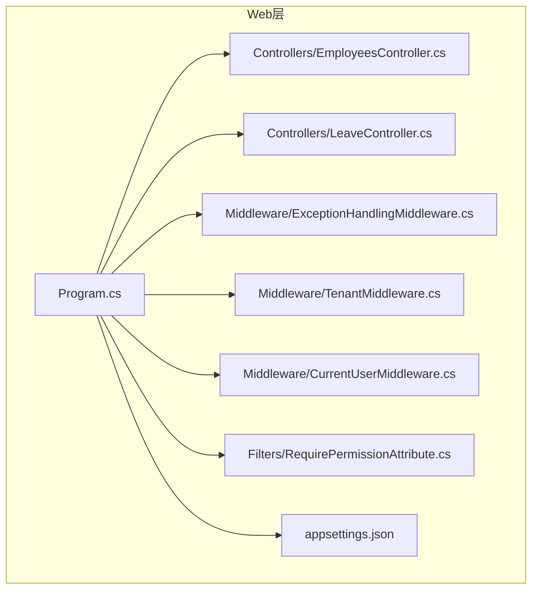
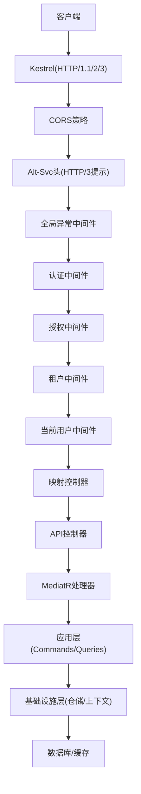
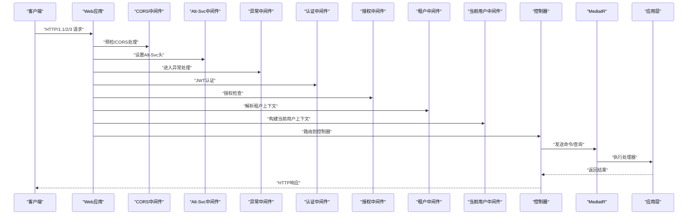
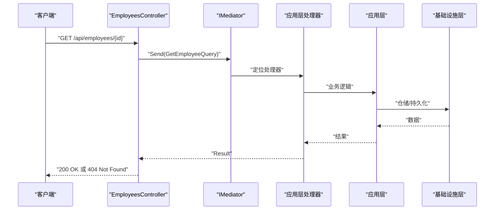
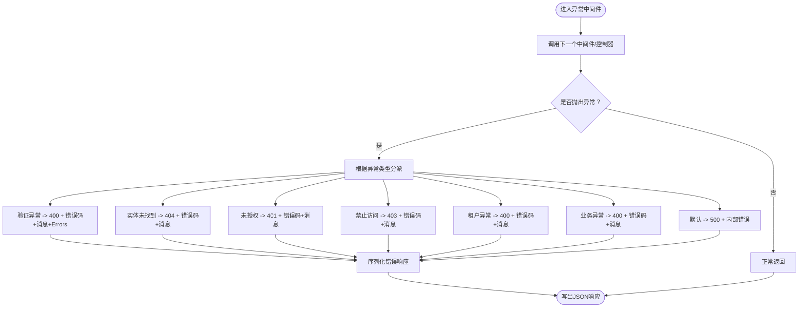
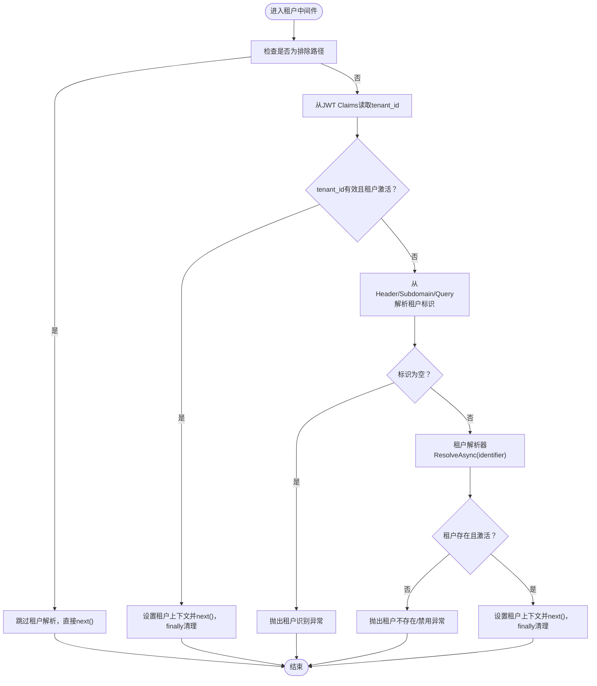
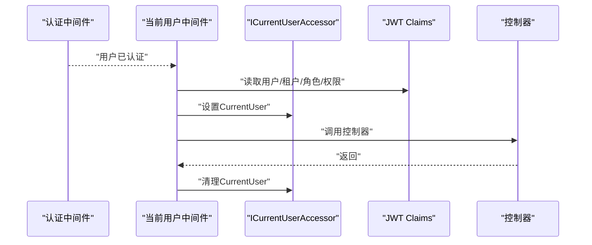
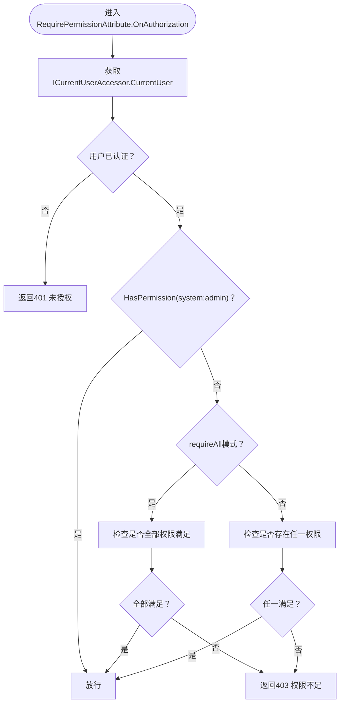
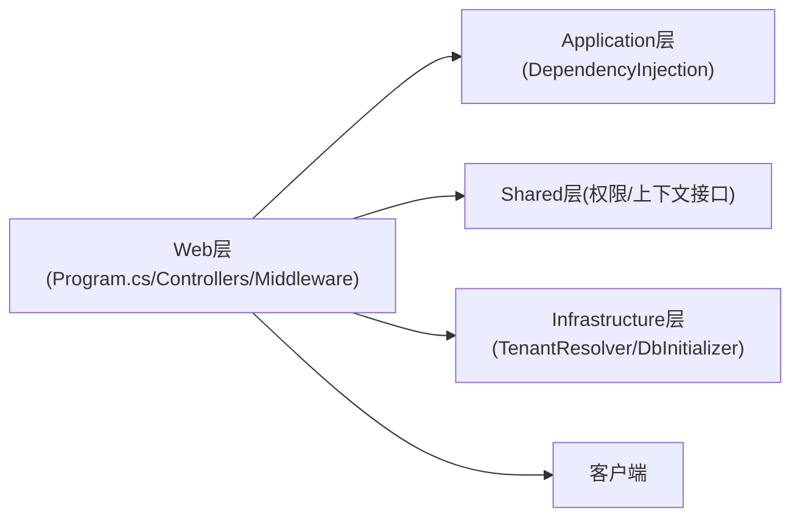

# Web层

<cite>
**本文引用的文件**
- [Program.cs](file://Backend/Hrevolve.Web/Program.cs)
- [EmployeesController.cs](file://Backend/Hrevolve.Web/Controllers/EmployeesController.cs)
- [LeaveController.cs](file://Backend/Hrevolve.Web/Controllers/LeaveController.cs)
- [ExceptionHandlingMiddleware.cs](file://Backend/Hrevolve.Web/Middleware/ExceptionHandlingMiddleware.cs)
- [TenantMiddleware.cs](file://Backend/Hrevolve.Web/Middleware/TenantMiddleware.cs)
- [CurrentUserMiddleware.cs](file://Backend/Hrevolve.Web/Middleware/CurrentUserMiddleware.cs)
- [RequirePermissionAttribute.cs](file://Backend/Hrevolve.Web/Filters/RequirePermissionAttribute.cs)
- [DependencyInjection.cs](file://Backend/Hrevolve.Application/DependencyInjection.cs)
- [appsettings.json](file://Backend/Hrevolve.Web/appsettings.json)
- [ITenantContext.cs](file://Backend/Hrevolve.Shared/MultiTenancy/ITenantContext.cs)
- [TenantInfo.cs](file://Backend/Hrevolve.Shared/MultiTenancy/TenantInfo.cs)
- [TenantResolver.cs](file://Backend/Hrevolve.Infrastructure/MultiTenancy/TenantResolver.cs)
- [ICurrentUser.cs](file://Backend/Hrevolve.Shared/Identity/ICurrentUser.cs)
- [Permissions.cs](file://Backend/Hrevolve.Domain/Identity/Role.cs)
</cite>

## 目录
1. [引言](#引言)
2. [项目结构](#项目结构)
3. [核心组件](#核心组件)
4. [架构总览](#架构总览)
5. [详细组件分析](#详细组件分析)
6. [依赖关系分析](#依赖关系分析)
7. [性能考虑](#性能考虑)
8. [故障排查指南](#故障排查指南)
9. [结论](#结论)
10. [附录](#附录)

## 引言
本指南聚焦于Web层作为系统入口点的职责与实现，围绕Program.cs中的依赖注入与中间件管道配置展开，解释应用启动流程；详解API控制器如何接收HTTP请求并委托至Application层；深入剖析自定义中间件在请求处理管道中的作用，尤其是TenantMiddleware如何解析租户信息并注入上下文；说明RequirePermissionAttribute如何实现基于角色的访问控制（RBAC）；同时覆盖API版本控制、错误响应格式化、CORS策略配置，并强调Web层对Application层的单向依赖。

## 项目结构
Web层位于Backend/Hrevolve.Web，包含以下关键目录与文件：
- Controllers：API控制器集合，负责接收HTTP请求并调用Application层的MediatR处理器
- Middleware：自定义中间件，包括全局异常处理、租户解析、当前用户上下文注入
- Filters：授权过滤器，实现基于权限的访问控制
- Program.cs：应用启动与服务注册、中间件管道配置
- appsettings.json：运行时配置（JWT、连接串、日志等）

图表来源
- [Program.cs](file://Backend/Hrevolve.Web/Program.cs#L1-L173)
- [EmployeesController.cs](file://Backend/Hrevolve.Web/Controllers/EmployeesController.cs#L1-L106)
- [LeaveController.cs](file://Backend/Hrevolve.Web/Controllers/LeaveController.cs#L1-L122)
- [ExceptionHandlingMiddleware.cs](file://Backend/Hrevolve.Web/Middleware/ExceptionHandlingMiddleware.cs#L1-L97)
- [TenantMiddleware.cs](file://Backend/Hrevolve.Web/Middleware/TenantMiddleware.cs#L1-L133)
- [CurrentUserMiddleware.cs](file://Backend/Hrevolve.Web/Middleware/CurrentUserMiddleware.cs#L1-L58)
- [RequirePermissionAttribute.cs](file://Backend/Hrevolve.Web/Filters/RequirePermissionAttribute.cs#L1-L80)
- [appsettings.json](file://Backend/Hrevolve.Web/appsettings.json#L1-L39)

章节来源
- [Program.cs](file://Backend/Hrevolve.Web/Program.cs#L1-L173)

## 核心组件
- 依赖注入与启动流程：Program.cs集中完成Kestrel配置、Serilog日志、Swagger、JWT认证与授权、CORS、应用层与基础设施层注册、健康检查端点、中间件管道装配与应用运行
- API控制器：EmployeesController、LeaveController通过IMediator接收请求，封装命令/查询，调用Application层并返回标准化结果
- 自定义中间件：
  - ExceptionHandlingMiddleware：统一捕获异常并输出标准化错误响应
  - TenantMiddleware：解析租户上下文（优先JWT，其次Header/Subdomain/Query），并进行租户有效性校验
  - CurrentUserMiddleware：从JWT Claims构建当前用户上下文并注入
- 授权过滤器：RequirePermissionAttribute基于ICurrentUserAccessor与权限常量实现RBAC
- 配置：appsettings.json提供JWT密钥、颁发者、受众、连接串、日志级别等

章节来源
- [Program.cs](file://Backend/Hrevolve.Web/Program.cs#L1-L173)
- [EmployeesController.cs](file://Backend/Hrevolve.Web/Controllers/EmployeesController.cs#L1-L106)
- [LeaveController.cs](file://Backend/Hrevolve.Web/Controllers/LeaveController.cs#L1-L122)
- [ExceptionHandlingMiddleware.cs](file://Backend/Hrevolve.Web/Middleware/ExceptionHandlingMiddleware.cs#L1-L97)
- [TenantMiddleware.cs](file://Backend/Hrevolve.Web/Middleware/TenantMiddleware.cs#L1-L133)
- [CurrentUserMiddleware.cs](file://Backend/Hrevolve.Web/Middleware/CurrentUserMiddleware.cs#L1-L58)
- [RequirePermissionAttribute.cs](file://Backend/Hrevolve.Web/Filters/RequirePermissionAttribute.cs#L1-L80)
- [appsettings.json](file://Backend/Hrevolve.Web/appsettings.json#L1-L39)

## 架构总览
Web层采用“控制器-中介者-应用层”的单向依赖模式，中间件贯穿请求生命周期，提供认证、授权、租户解析与异常处理能力。

图表来源
- [Program.cs](file://Backend/Hrevolve.Web/Program.cs#L121-L159)
- [ExceptionHandlingMiddleware.cs](file://Backend/Hrevolve.Web/Middleware/ExceptionHandlingMiddleware.cs#L1-L97)
- [TenantMiddleware.cs](file://Backend/Hrevolve.Web/Middleware/TenantMiddleware.cs#L1-L133)
- [CurrentUserMiddleware.cs](file://Backend/Hrevolve.Web/Middleware/CurrentUserMiddleware.cs#L1-L58)
- [EmployeesController.cs](file://Backend/Hrevolve.Web/Controllers/EmployeesController.cs#L1-L106)
- [LeaveController.cs](file://Backend/Hrevolve.Web/Controllers/LeaveController.cs#L1-L122)

## 详细组件分析

### 启动流程与中间件管道
- Kestrel配置启用HTTP/3与HTTPS端口，便于现代浏览器与客户端利用HTTP/3加速
- Serilog日志通过配置读取与上下文增强，统一输出
- Swagger在开发环境启用，提供API文档与调试
- JWT认证与授权注册，Token校验参数来自配置
- CORS策略“AllowAll”在其他中间件之前注册
- 中间件顺序至关重要：CORS -> Alt-Svc -> 全局异常 -> HTTPS重定向 -> 认证 -> 授权 -> 租户 -> 当前用户 -> 映射控制器
- 健康检查端点提供简单可用性检测

图表来源
- [Program.cs](file://Backend/Hrevolve.Web/Program.cs#L121-L159)
- [ExceptionHandlingMiddleware.cs](file://Backend/Hrevolve.Web/Middleware/ExceptionHandlingMiddleware.cs#L1-L97)
- [TenantMiddleware.cs](file://Backend/Hrevolve.Web/Middleware/TenantMiddleware.cs#L1-L133)
- [CurrentUserMiddleware.cs](file://Backend/Hrevolve.Web/Middleware/CurrentUserMiddleware.cs#L1-L58)
- [EmployeesController.cs](file://Backend/Hrevolve.Web/Controllers/EmployeesController.cs#L1-L106)
- [LeaveController.cs](file://Backend/Hrevolve.Web/Controllers/LeaveController.cs#L1-L122)

章节来源
- [Program.cs](file://Backend/Hrevolve.Web/Program.cs#L1-L173)

### API控制器与Application层交互
- 控制器通过IMediator接收请求，发送命令/查询至应用层
- 对于查询类操作，返回Ok或NotFound；对于写入类操作，返回Created或BadRequest
- 控制器方法上标注[Authorize]，并结合[RequirePermission]实现细粒度权限控制
- Application层通过MediatR注册，自动装配行为（验证、日志）与验证器

图表来源
- [EmployeesController.cs](file://Backend/Hrevolve.Web/Controllers/EmployeesController.cs#L1-L106)
- [DependencyInjection.cs](file://Backend/Hrevolve.Application/DependencyInjection.cs#L1-L26)

章节来源
- [EmployeesController.cs](file://Backend/Hrevolve.Web/Controllers/EmployeesController.cs#L1-L106)
- [DependencyInjection.cs](file://Backend/Hrevolve.Application/DependencyInjection.cs#L1-L26)

### 自定义中间件：异常处理
- 全局捕获异常，按异常类型映射HTTP状态码与错误码
- 输出统一的错误响应模型，包含TraceId、Code、Message与Errors（针对验证异常）
- 默认未处理异常记录日志并返回服务器内部错误

图表来源
- [ExceptionHandlingMiddleware.cs](file://Backend/Hrevolve.Web/Middleware/ExceptionHandlingMiddleware.cs#L1-L97)

章节来源
- [ExceptionHandlingMiddleware.cs](file://Backend/Hrevolve.Web/Middleware/ExceptionHandlingMiddleware.cs#L1-L97)

### 自定义中间件：租户解析与上下文注入
- 排除路径：健康检查、Swagger、登录/注册/刷新/登出、本地化等无需租户上下文
- 优先从JWT Claims获取tenant_id，若有效且租户激活，则设置租户上下文
- 若无JWT或无效，则尝试从Header(X-Tenant-Id)、子域名、Query参数解析租户标识
- 解析成功后校验租户存在性与激活状态，设置租户上下文并在请求结束时清理
- 租户解析器支持缓存与数据库查询，避免重复解析

图表来源
- [TenantMiddleware.cs](file://Backend/Hrevolve.Web/Middleware/TenantMiddleware.cs#L1-L133)
- [ITenantContext.cs](file://Backend/Hrevolve.Shared/MultiTenancy/ITenantContext.cs#L1-L80)
- [TenantInfo.cs](file://Backend/Hrevolve.Shared/MultiTenancy/TenantInfo.cs#L1-L44)
- [TenantResolver.cs](file://Backend/Hrevolve.Infrastructure/MultiTenancy/TenantResolver.cs#L1-L41)

章节来源
- [TenantMiddleware.cs](file://Backend/Hrevolve.Web/Middleware/TenantMiddleware.cs#L1-L133)
- [ITenantContext.cs](file://Backend/Hrevolve.Shared/MultiTenancy/ITenantContext.cs#L1-L80)
- [TenantInfo.cs](file://Backend/Hrevolve.Shared/MultiTenancy/TenantInfo.cs#L1-L44)
- [TenantResolver.cs](file://Backend/Hrevolve.Infrastructure/MultiTenancy/TenantResolver.cs#L1-L41)

### 自定义中间件：当前用户上下文注入
- 在认证通过后，从JWT Claims提取用户标识、租户、员工、邮箱、用户名、角色与权限
- 构建当前用户对象并注入ICurrentUserAccessor，请求结束后清理
- 为RequirePermissionAttribute提供权限判断依据

图表来源
- [CurrentUserMiddleware.cs](file://Backend/Hrevolve.Web/Middleware/CurrentUserMiddleware.cs#L1-L58)
- [ICurrentUser.cs](file://Backend/Hrevolve.Shared/Identity/ICurrentUser.cs#L1-L114)

章节来源
- [CurrentUserMiddleware.cs](file://Backend/Hrevolve.Web/Middleware/CurrentUserMiddleware.cs#L1-L58)
- [ICurrentUser.cs](file://Backend/Hrevolve.Shared/Identity/ICurrentUser.cs#L1-L114)

### 基于角色的访问控制（RBAC）
- RequirePermissionAttribute在授权阶段执行，从服务容器获取ICurrentUserAccessor
- 若用户未认证，返回未授权；若用户具备system:admin权限，放行
- 否则根据requireAll策略（全部满足或任一满足）判断权限集合
- 未满足权限时返回403与标准化错误码与消息

图表来源
- [RequirePermissionAttribute.cs](file://Backend/Hrevolve.Web/Filters/RequirePermissionAttribute.cs#L1-L80)
- [ICurrentUser.cs](file://Backend/Hrevolve.Shared/Identity/ICurrentUser.cs#L1-L114)
- [Permissions.cs](file://Backend/Hrevolve.Domain/Identity/Role.cs#L89-L123)

章节来源
- [RequirePermissionAttribute.cs](file://Backend/Hrevolve.Web/Filters/RequirePermissionAttribute.cs#L1-L80)
- [ICurrentUser.cs](file://Backend/Hrevolve.Shared/Identity/ICurrentUser.cs#L1-L114)
- [Permissions.cs](file://Backend/Hrevolve.Domain/Identity/Role.cs#L89-L123)

### API版本控制
- 当前项目未显式配置API版本路由，默认使用控制器路由约定（如/api/employees、/api/leave）
- 若需版本控制，可在Program.cs中添加版本化路由（例如按URL前缀或媒体类型），并在控制器上标注版本属性
- 版本控制建议与Swagger文档同步维护，确保前端与SDK生成一致

[本节为通用实践说明，不直接分析具体文件，故无章节来源]

### 错误响应格式化
- 全局异常中间件统一输出JSON错误响应，字段包含Code、Message、TraceId与可选Errors
- 验证异常携带Errors数组，便于前端展示字段级错误
- 未处理异常记录日志并返回通用内部错误

章节来源
- [ExceptionHandlingMiddleware.cs](file://Backend/Hrevolve.Web/Middleware/ExceptionHandlingMiddleware.cs#L1-L97)

### CORS策略配置
- 在Program.cs中注册名为“AllowAll”的CORS策略，允许任意来源、方法与头部
- CORS必须在其他中间件之前注册，以确保预检请求正确处理
- 生产环境建议限制来源、方法与头部，仅开放必要范围

章节来源
- [Program.cs](file://Backend/Hrevolve.Web/Program.cs#L90-L99)

### Web层对Application层的单向依赖
- Web层通过IMediator调用应用层命令/查询处理器，不反向依赖应用层
- 应用层通过Behaviors（验证、日志）与验证器提升质量，不感知Web层细节
- 这种设计保证了关注点分离与可测试性

章节来源
- [DependencyInjection.cs](file://Backend/Hrevolve.Application/DependencyInjection.cs#L1-L26)
- [EmployeesController.cs](file://Backend/Hrevolve.Web/Controllers/EmployeesController.cs#L1-L106)
- [LeaveController.cs](file://Backend/Hrevolve.Web/Controllers/LeaveController.cs#L1-L122)

## 依赖关系分析
- Web层依赖Application层（MediatR、行为、验证器）
- Web层依赖Shared层（权限常量、当前用户/租户上下文接口）
- Web层依赖Infrastructure层（租户解析器、数据库初始化）
- 中间件之间存在明确的顺序依赖：CORS -> Alt-Svc -> 异常 -> 认证 -> 授权 -> 租户 -> 当前用户 -> 控制器

图表来源
- [Program.cs](file://Backend/Hrevolve.Web/Program.cs#L101-L159)
- [DependencyInjection.cs](file://Backend/Hrevolve.Application/DependencyInjection.cs#L1-L26)
- [TenantResolver.cs](file://Backend/Hrevolve.Infrastructure/MultiTenancy/TenantResolver.cs#L1-L41)
- [ICurrentUser.cs](file://Backend/Hrevolve.Shared/Identity/ICurrentUser.cs#L1-L114)
- [ITenantContext.cs](file://Backend/Hrevolve.Shared/MultiTenancy/ITenantContext.cs#L1-L80)

章节来源
- [Program.cs](file://Backend/Hrevolve.Web/Program.cs#L101-L159)
- [DependencyInjection.cs](file://Backend/Hrevolve.Application/DependencyInjection.cs#L1-L26)
- [TenantResolver.cs](file://Backend/Hrevolve.Infrastructure/MultiTenancy/TenantResolver.cs#L1-L41)
- [ICurrentUser.cs](file://Backend/Hrevolve.Shared/Identity/ICurrentUser.cs#L1-L114)
- [ITenantContext.cs](file://Backend/Hrevolve.Shared/MultiTenancy/ITenantContext.cs#L1-L80)

## 性能考虑
- HTTP/3启用与Alt-Svc头可提升传输性能，减少握手延迟
- 租户解析器使用分布式缓存降低数据库压力
- MediatR行为（验证、日志）在请求链路中增加少量开销，但显著提升可观测性与健壮性
- 建议在生产环境限制CORS范围，避免不必要的预检开销

[本节提供一般性指导，不直接分析具体文件，故无章节来源]

## 故障排查指南
- 未授权/401：确认JWT是否正确签发与携带，Claims中是否包含用户标识与权限
- 权限不足/403：检查用户是否具备system:admin或目标权限；确认RequirePermissionAttribute的requireAll策略
- 租户识别失败：确认Header/Subdomain/Query中是否提供有效的租户标识；检查租户状态是否激活
- 验证异常：查看错误响应中的Errors字段，定位字段级校验失败
- 服务器内部错误：查看日志中TraceId，定位异常堆栈

章节来源
- [RequirePermissionAttribute.cs](file://Backend/Hrevolve.Web/Filters/RequirePermissionAttribute.cs#L1-L80)
- [TenantMiddleware.cs](file://Backend/Hrevolve.Web/Middleware/TenantMiddleware.cs#L1-L133)
- [ExceptionHandlingMiddleware.cs](file://Backend/Hrevolve.Web/Middleware/ExceptionHandlingMiddleware.cs#L1-L97)

## 结论
Web层通过清晰的启动流程、严格的中间件顺序与完善的授权/异常处理机制，实现了稳定可靠的系统入口。它以单向依赖的方式与Application层协作，借助自定义中间件保障多租户、RBAC与可观测性，为上层业务提供了坚实基础。

[本节为总结性内容，不直接分析具体文件，故无章节来源]

## 附录
- 配置要点：JWT密钥、颁发者、受众；连接串；日志级别
- 权限常量：参考领域层权限常量定义，确保前后端一致

章节来源
- [appsettings.json](file://Backend/Hrevolve.Web/appsettings.json#L1-L39)
- [Permissions.cs](file://Backend/Hrevolve.Domain/Identity/Role.cs#L89-L123)