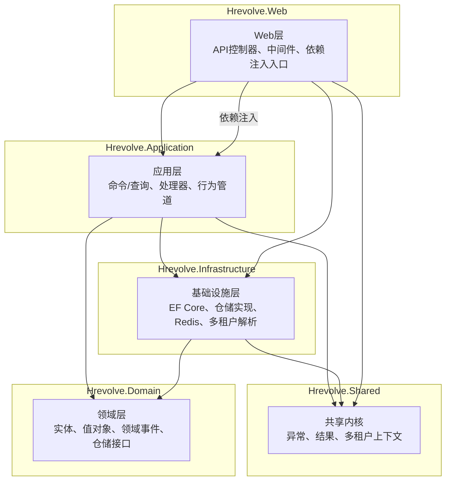
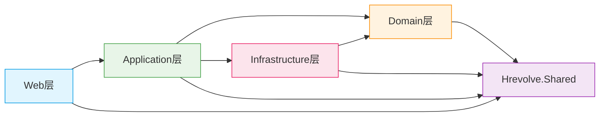
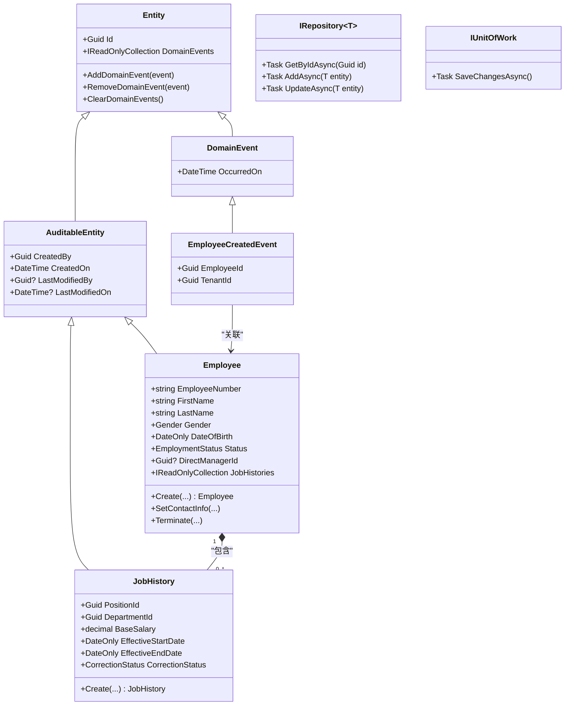
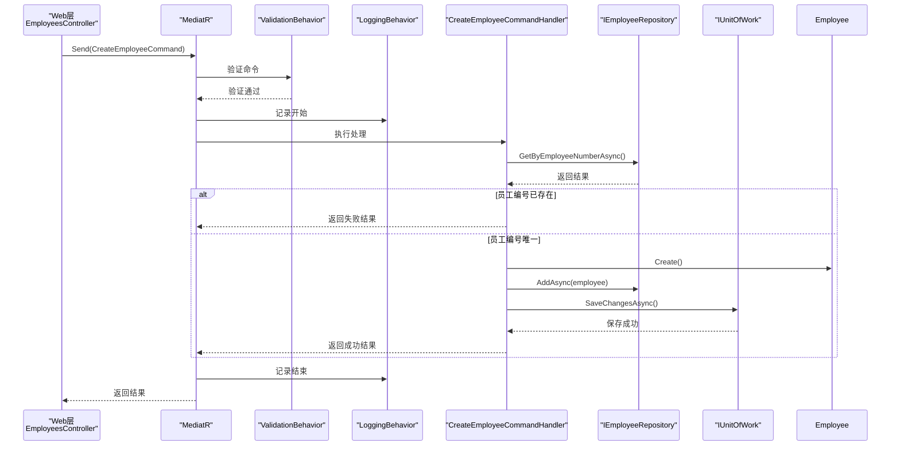
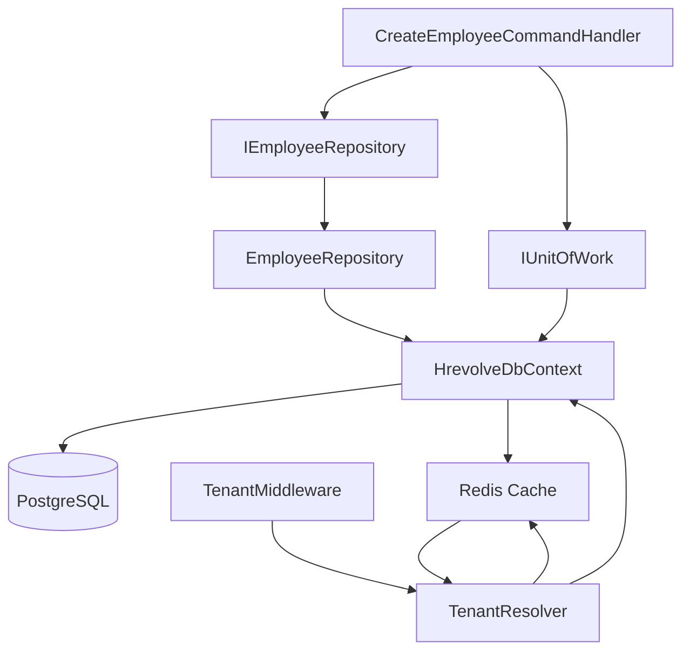

# 分层架构

<cite>
**本文档引用文件**  
- [Employee.cs](file://Backend/Hrevolve.Domain/Employees/Employee.cs)
- [CreateEmployeeCommand.cs](file://Backend/Hrevolve.Application/Employees/Commands/CreateEmployeeCommand.cs)
- [EmployeeRepository.cs](file://Backend/Hrevolve.Infrastructure/Persistence/Repositories/EmployeeRepository.cs)
- [TenantResolver.cs](file://Backend/Hrevolve.Infrastructure/MultiTenancy/TenantResolver.cs)
- [HrevolveException.cs](file://Backend/Hrevolve.Shared/Exceptions/HrevolveException.cs)
- [Result.cs](file://Backend/Hrevolve.Shared/Results/Result.cs)
- [EmployeesController.cs](file://Backend/Hrevolve.Web/Controllers/EmployeesController.cs)
- [Hrevolve.Domain.csproj](file://Backend/Hrevolve.Domain/Hrevolve.Domain.csproj)
- [Hrevolve.Application.csproj](file://Backend/Hrevolve.Application/Hrevolve.Application.csproj)
- [Hrevolve.Infrastructure.csproj](file://Backend/Hrevolve.Infrastructure/Hrevolve.Infrastructure.csproj)
- [Hrevolve.Web.csproj](file://Backend/Hrevolve.Web/Hrevolve.Web.csproj)
- [Hrevolve.Shared.csproj](file://Backend/Hrevolve.Shared/Hrevolve.Shared.csproj)
</cite>

## 目录
1. [简介](#简介)
2. [项目结构](#项目结构)
3. [核心组件](#核心组件)
4. [架构概览](#架构概览)
5. [详细组件分析](#详细组件分析)
6. [依赖分析](#依赖分析)
7. [性能考虑](#性能考虑)
8. [故障排除指南](#故障排除指南)
9. [结论](#结论)

## 简介
Hrevolve 采用 Clean Architecture 的分层设计，将系统划分为清晰的四个层次：Domain（领域层）、Application（应用层）、Infrastructure（基础设施层）和 Web（表现层）。这种架构实现了关注点分离，确保业务逻辑独立于技术实现，支持多租户、领域驱动设计（DDD）和 CQRS 模式。本文档详细阐述各层职责、依赖方向、通信机制及关键实现。

## 项目结构
Hrevolve 后端项目采用标准的分层解决方案结构，各层通过项目引用明确依赖关系。



**图示来源**
- [Hrevolve.Domain.csproj](file://Backend/Hrevolve.Domain/Hrevolve.Domain.csproj)
- [Hrevolve.Application.csproj](file://Backend/Hrevolve.Application/Hrevolve.Application.csproj)
- [Hrevolve.Infrastructure.csproj](file://Backend/Hrevolve.Infrastructure/Hrevolve.Infrastructure.csproj)
- [Hrevolve.Web.csproj](file://Backend/Hrevolve.Web/Hrevolve.Web.csproj)
- [Hrevolve.Shared.csproj](file://Backend/Hrevolve.Shared/Hrevolve.Shared.csproj)

**本节来源**
- [Hrevolve.Domain.csproj](file://Backend/Hrevolve.Domain/Hrevolve.Domain.csproj)
- [Hrevolve.Application.csproj](file://Backend/Hrevolve.Application/Hrevolve.Application.csproj)
- [Hrevolve.Infrastructure.csproj](file://Backend/Hrevolve.Infrastructure/Hrevolve.Infrastructure.csproj)
- [Hrevolve.Web.csproj](file://Backend/Hrevolve.Web/Hrevolve.Web.csproj)
- [Hrevolve.Shared.csproj](file://Backend/Hrevolve.Shared/Hrevolve.Shared.csproj)

## 核心组件
Hrevolve 的核心在于其分层架构，每一层都有明确的职责和边界。领域层定义了业务核心，应用层协调用例，基础设施层提供技术实现，Web层处理HTTP交互。共享内核为各层提供基础契约和工具。

**本节来源**
- [Employee.cs](file://Backend/Hrevolve.Domain/Employees/Employee.cs)
- [CreateEmployeeCommand.cs](file://Backend/Hrevolve.Application/Employees/Commands/CreateEmployeeCommand.cs)
- [Result.cs](file://Backend/Hrevolve.Shared/Results/Result.cs)

## 架构概览
Hrevolve 的 Clean Architecture 严格遵循依赖倒置原则。高层模块（Domain）不依赖于低层模块（Infrastructure），两者都依赖于抽象（接口）。应用层作为协调者，依赖于领域层的抽象和基础设施层的具体实现。



**图示来源**
- [Hrevolve.Domain.csproj](file://Backend/Hrevolve.Domain/Hrevolve.Domain.csproj)
- [Hrevolve.Application.csproj](file://Backend/Hrevolve.Application/Hrevolve.Application.csproj)
- [Hrevolve.Infrastructure.csproj](file://Backend/Hrevolve.Infrastructure/Hrevolve.Infrastructure.csproj)
- [Hrevolve.Web.csproj](file://Backend/Hrevolve.Web/Hrevolve.Web.csproj)
- [Hrevolve.Shared.csproj](file://Backend/Hrevolve.Shared/Hrevolve.Shared.csproj)

## 详细组件分析
本节深入分析 Hrevolve 的关键组件，展示其如何协同工作以实现业务功能。

### 领域层 (Domain Layer) 分析
领域层是业务逻辑的核心，包含实体、值对象、领域事件和仓储接口。



**图示来源**
- [Employee.cs](file://Backend/Hrevolve.Domain/Employees/Employee.cs)
- [Entity.cs](file://Backend/Hrevolve.Domain/Common/Entity.cs)
- [IRepository.cs](file://Backend/Hrevolve.Domain/Common/IRepository.cs)

**本节来源**
- [Employee.cs](file://Backend/Hrevolve.Domain/Employees/Employee.cs)
- [Entity.cs](file://Backend/Hrevolve.Domain/Common/Entity.cs)
- [IRepository.cs](file://Backend/Hrevolve.Domain/Common/IRepository.cs)

### 应用层 (Application Layer) 分析
应用层处理业务用例，使用 MediatR 实现 CQRS 模式，并通过行为管道（Behaviors）实现横切关注点。



**图示来源**
- [CreateEmployeeCommand.cs](file://Backend/Hrevolve.Application/Employees/Commands/CreateEmployeeCommand.cs)
- [EmployeesController.cs](file://Backend/Hrevolve.Web/Controllers/EmployeesController.cs)

**本节来源**
- [CreateEmployeeCommand.cs](file://Backend/Hrevolve.Application/Employees/Commands/CreateEmployeeCommand.cs)

### 基础设施层 (Infrastructure Layer) 分析
基础设施层提供技术实现，包括数据访问、缓存和多租户支持。



**图示来源**
- [EmployeeRepository.cs](file://Backend/Hrevolve.Infrastructure/Persistence/Repositories/EmployeeRepository.cs)
- [TenantResolver.cs](file://Backend/Hrevolve.Infrastructure/MultiTenancy/TenantResolver.cs)
- [HrevolveDbContext.cs](file://Backend/Hrevolve.Infrastructure/Persistence/HrevolveDbContext.cs)

**本节来源**
- [EmployeeRepository.cs](file://Backend/Hrevolve.Infrastructure/Persistence/Repositories/EmployeeRepository.cs)
- [TenantResolver.cs](file://Backend/Hrevolve.Infrastructure/MultiTenancy/TenantResolver.cs)

## 依赖分析
Hrevolve 的依赖关系清晰且单向，确保了架构的松耦合。

```mermaid
graph TD
Web --> Application
Application --> Domain
Application --> Infrastructure
Application --> Shared
Infrastructure --> Domain
Infrastructure --> Shared
Web --> Infrastructure
Web --> Shared
Web -.-> Application : "通过MediatR注入"
style Web fill:#e1f5fe,stroke:#039be5
style Application fill:#e8f5e8,stroke:#43a047
style Domain fill:#fff3e0,stroke:#fb8c00
style Infrastructure fill:#fce4ec,stroke:#e91e63
style Shared fill:#f3e5f5,stroke:#9c27b0
```

**图示来源**
- [Hrevolve.Domain.csproj](file://Backend/Hrevolve.Domain/Hrevolve.Domain.csproj)
- [Hrevolve.Application.csproj](file://Backend/Hrevolve.Application/Hrevolve.Application.csproj)
- [Hrevolve.Infrastructure.csproj](file://Backend/Hrevolve.Infrastructure/Hrevolve.Infrastructure.csproj)
- [Hrevolve.Web.csproj](file://Backend/Hrevolve.Web/Hrevolve.Web.csproj)
- [Hrevolve.Shared.csproj](file://Backend/Hrevolve.Shared/Hrevolve.Shared.csproj)

**本节来源**
- [Hrevolve.Domain.csproj](file://Backend/Hrevolve.Domain/Hrevolve.Domain.csproj)
- [Hrevolve.Application.csproj](file://Backend/Hrevolve.Application/Hrevolve.Application.csproj)
- [Hrevolve.Infrastructure.csproj](file://Backend/Hrevolve.Infrastructure/Hrevolve.Infrastructure.csproj)
- [Hrevolve.Web.csproj](file://Backend/Hrevolve.Web/Hrevolve.Web.csproj)
- [Hrevolve.Shared.csproj](file://Backend/Hrevolve.Shared/Hrevolve.Shared.csproj)

## 性能考虑
- **缓存策略**：`TenantResolver` 使用 Redis 缓存租户信息，减少数据库查询，提升多租户解析性能。
- **数据查询**：`EmployeeRepository` 使用 `Include` 和 `Where` 进行高效的数据加载和过滤，避免 N+1 查询问题。
- **异步操作**：所有 I/O 操作（数据库、缓存）均使用异步方法，提高系统吞吐量。
- **验证前置**：在应用层早期进行输入验证，避免不必要的领域逻辑执行和数据库访问。

## 故障排除指南
- **实体未找到**：检查 `EntityNotFoundException`，确保请求的实体ID存在。
- **验证失败**：检查 `ValidationException`，根据返回的错误信息修正请求数据。
- **权限不足**：检查 `ForbiddenException` 或 `UnauthorizedException`，确认用户权限和认证状态。
- **并发冲突**：检查 `ConcurrencyException`，提示用户刷新页面后重试。
- **租户解析失败**：检查 `TenantException`，确认租户标识（域名或代码）正确且租户处于激活状态。

**本节来源**
- [HrevolveException.cs](file://Backend/Hrevolve.Shared/Exceptions/HrevolveException.cs)
- [Result.cs](file://Backend/Hrevolve.Shared/Results/Result.cs)

## 结论
Hrevolve 的分层架构成功实现了 Clean Architecture 的原则。通过明确的分层和依赖管理，系统具备了高内聚、低耦合、可测试和可维护的特性。领域层专注于业务规则，应用层协调用例，基础设施层提供灵活的技术实现，Web层处理外部交互。共享内核统一了异常处理和结果返回。该架构为系统的长期演进和扩展提供了坚实的基础。