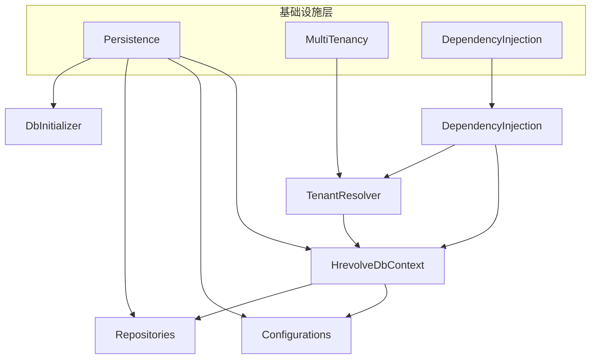
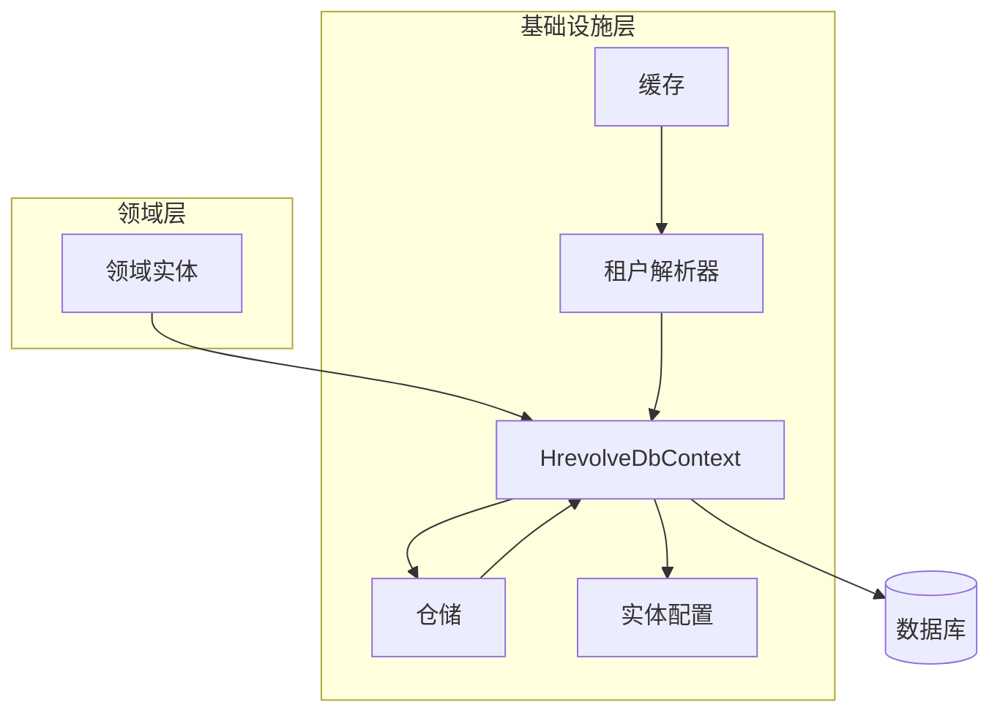
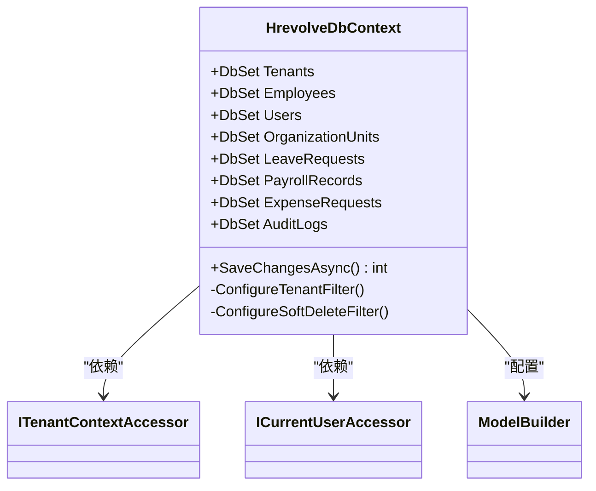
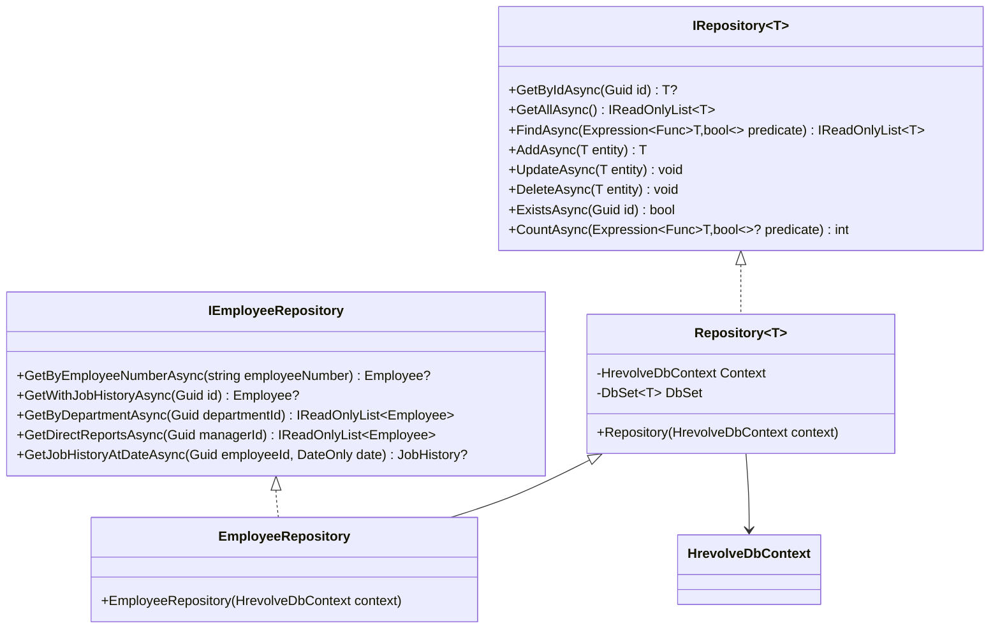
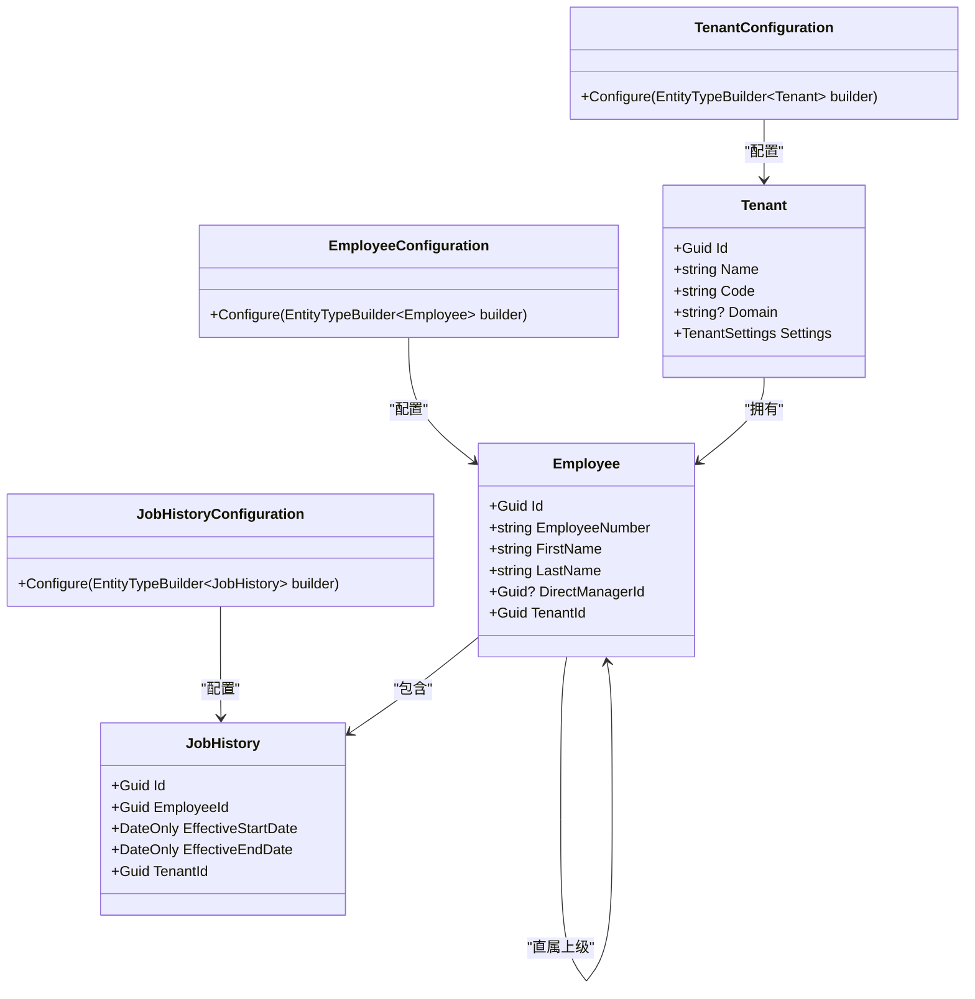
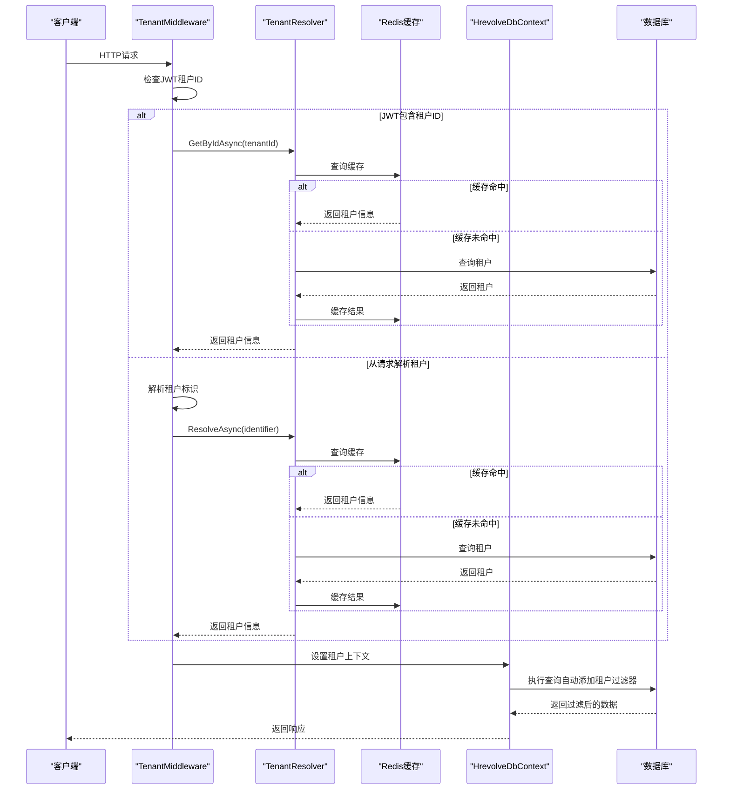
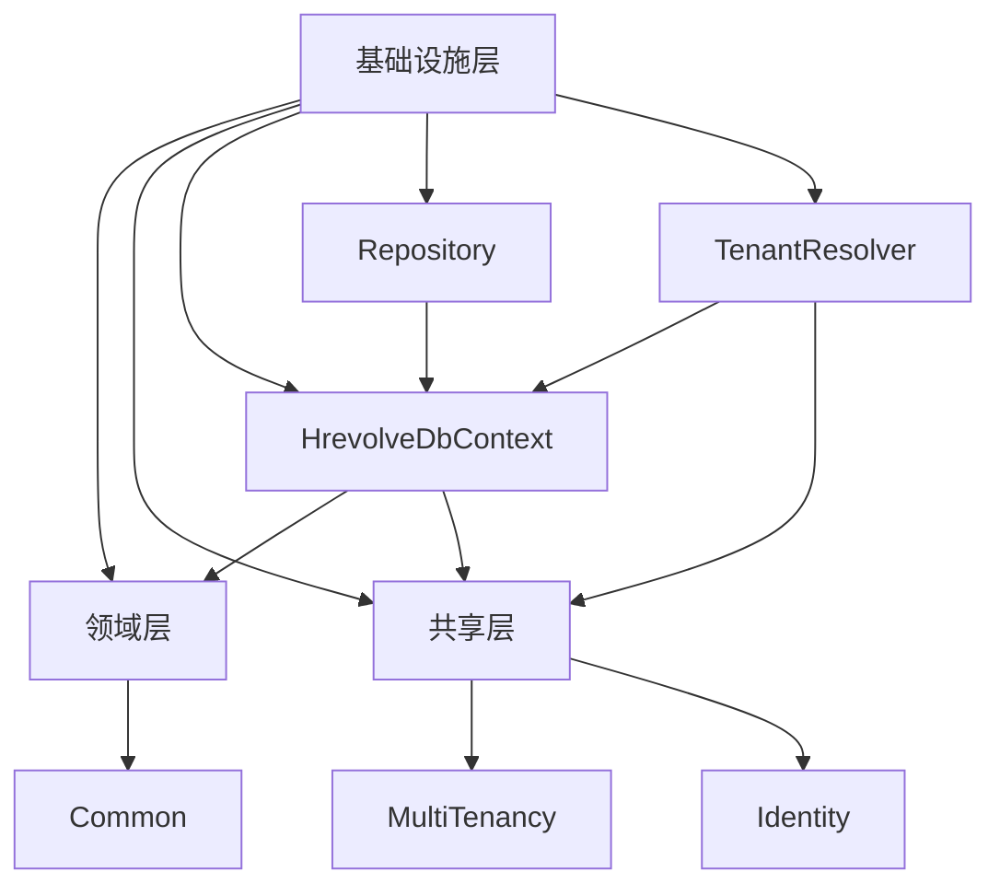

# 基础设施层

<cite>
**本文档中引用的文件**  
- [HrevolveDbContext.cs](file://Backend/Hrevolve.Infrastructure/Persistence/HrevolveDbContext.cs)
- [Repository.cs](file://Backend/Hrevolve.Infrastructure/Persistence/Repositories/Repository.cs)
- [EmployeeRepository.cs](file://Backend/Hrevolve.Infrastructure/Persistence/Repositories/EmployeeRepository.cs)
- [EmployeeConfiguration.cs](file://Backend/Hrevolve.Infrastructure/Persistence/Configurations/EmployeeConfiguration.cs)
- [TenantResolver.cs](file://Backend/Hrevolve.Infrastructure/MultiTenancy/TenantResolver.cs)
- [DependencyInjection.cs](file://Backend/Hrevolve.Infrastructure/DependencyInjection.cs)
- [DbInitializer.cs](file://Backend/Hrevolve.Infrastructure/Persistence/DbInitializer.cs)
- [TenantMiddleware.cs](file://Backend/Hrevolve.Web/Middleware/TenantMiddleware.cs)
- [IRepository.cs](file://Backend/Hrevolve.Domain/Common/IRepository.cs)
- [ITenantContext.cs](file://Backend/Hrevolve.Shared/MultiTenancy/ITenantContext.cs)
- [ICurrentUser.cs](file://Backend/Hrevolve.Shared/Identity/ICurrentUser.cs)
- [appsettings.json](file://Backend/Hrevolve.Web/appsettings.json)
- [InitialCreate.cs](file://Backend/Hrevolve.Infrastructure/Migrations/20251227093819_InitialCreate.cs)
- [TenantConfiguration.cs](file://Backend/Hrevolve.Infrastructure/Persistence/Configurations/TenantConfiguration.cs)
</cite>

## 目录
1. [引言](#引言)
2. [项目结构](#项目结构)
3. [核心组件](#核心组件)
4. [架构概述](#架构概述)
5. [详细组件分析](#详细组件分析)
6. [依赖分析](#依赖分析)
7. [性能考虑](#性能考虑)
8. [故障排除指南](#故障排除指南)
9. [结论](#结论)

## 引言
基础设施层是Hrevolve系统的核心技术实现适配器，负责将领域层的抽象定义转化为具体的技术实现。该层通过Entity Framework Core（EF Core）实现对象关系映射（ORM），为上层应用提供数据持久化能力。本技术文档系统阐述基础设施层的设计与实现，重点关注多租户数据隔离、仓储模式实现、数据库迁移策略以及缓存集成等关键机制。

## 项目结构
基础设施层的项目结构遵循清晰的分层设计，主要包含持久化、多租户和依赖注入三大模块。持久化模块负责数据库上下文、实体配置和仓储实现；多租户模块处理租户解析和上下文管理；依赖注入模块配置服务注册。

**图表来源**  
- [HrevolveDbContext.cs](file://Backend/Hrevolve.Infrastructure/Persistence/HrevolveDbContext.cs)
- [TenantResolver.cs](file://Backend/Hrevolve.Infrastructure/MultiTenancy/TenantResolver.cs)
- [DependencyInjection.cs](file://Backend/Hrevolve.Infrastructure/DependencyInjection.cs)

**本节来源**  
- [HrevolveDbContext.cs](file://Backend/Hrevolve.Infrastructure/Persistence/HrevolveDbContext.cs)
- [TenantResolver.cs](file://Backend/Hrevolve.Infrastructure/MultiTenancy/TenantResolver.cs)
- [DependencyInjection.cs](file://Backend/Hrevolve.Infrastructure/DependencyInjection.cs)

## 核心组件
基础设施层的核心组件包括HrevolveDbContext、通用仓储实现、实体配置类和多租户解析器。这些组件协同工作，实现了数据持久化、多租户隔离和依赖注入等关键功能。

**本节来源**  
- [HrevolveDbContext.cs](file://Backend/Hrevolve.Infrastructure/Persistence/HrevolveDbContext.cs)
- [Repository.cs](file://Backend/Hrevolve.Infrastructure/Persistence/Repositories/Repository.cs)
- [EmployeeConfiguration.cs](file://Backend/Hrevolve.Infrastructure/Persistence/Configurations/EmployeeConfiguration.cs)
- [TenantResolver.cs](file://Backend/Hrevolve.Infrastructure/MultiTenancy/TenantResolver.cs)

## 架构概述
基础设施层的架构设计体现了清晰的分层和关注点分离原则。EF Core作为ORM框架，通过HrevolveDbContext实现领域实体与数据库表的映射。仓储模式提供了一致的数据访问接口，而多租户机制确保了数据隔离。

**图表来源**  
- [HrevolveDbContext.cs](file://Backend/Hrevolve.Infrastructure/Persistence/HrevolveDbContext.cs)
- [Repository.cs](file://Backend/Hrevolve.Infrastructure/Persistence/Repositories/Repository.cs)
- [EmployeeConfiguration.cs](file://Backend/Hrevolve.Infrastructure/Persistence/Configurations/EmployeeConfiguration.cs)
- [TenantResolver.cs](file://Backend/Hrevolve.Infrastructure/MultiTenancy/TenantResolver.cs)

## 详细组件分析
本节深入分析基础设施层的关键组件，包括数据库上下文、仓储模式、实体配置和多租户机制。

### 数据库上下文分析
HrevolveDbContext是EF Core的核心组件，负责管理数据库连接、事务和查询。它通过构造函数注入租户上下文和当前用户访问器，实现多租户和审计功能。

**图表来源**  
- [HrevolveDbContext.cs](file://Backend/Hrevolve.Infrastructure/Persistence/HrevolveDbContext.cs#L9-L156)

**本节来源**  
- [HrevolveDbContext.cs](file://Backend/Hrevolve.Infrastructure/Persistence/HrevolveDbContext.cs#L9-L156)

### 仓储模式分析
仓储模式通过IRepository接口和Repository基类实现，为上层应用提供统一的数据访问抽象。通用仓储支持基本的CRUD操作，而具体实体仓储可扩展特定查询。

**图表来源**  
- [IRepository.cs](file://Backend/Hrevolve.Domain/Common/IRepository.cs#L8-L30)
- [Repository.cs](file://Backend/Hrevolve.Infrastructure/Persistence/Repositories/Repository.cs#L6-L65)
- [EmployeeRepository.cs](file://Backend/Hrevolve.Infrastructure/Persistence/Repositories/EmployeeRepository.cs#L6-L81)

**本节来源**  
- [IRepository.cs](file://Backend/Hrevolve.Domain/Common/IRepository.cs#L8-L30)
- [Repository.cs](file://Backend/Hrevolve.Infrastructure/Persistence/Repositories/Repository.cs#L6-L65)
- [EmployeeRepository.cs](file://Backend/Hrevolve.Infrastructure/Persistence/Repositories/EmployeeRepository.cs#L6-L81)

### 实体配置分析
实体配置类使用EF Core的Fluent API定义数据库表结构、索引和关系。EmployeeConfiguration类展示了如何配置员工实体的属性、索引和自引用关系。

**图表来源**  
- [EmployeeConfiguration.cs](file://Backend/Hrevolve.Infrastructure/Persistence/Configurations/EmployeeConfiguration.cs#L5-L70)
- [TenantConfiguration.cs](file://Backend/Hrevolve.Infrastructure/Persistence/Configurations/TenantConfiguration.cs#L7-L55)

**本节来源**  
- [EmployeeConfiguration.cs](file://Backend/Hrevolve.Infrastructure/Persistence/Configurations/EmployeeConfiguration.cs#L5-L70)
- [TenantConfiguration.cs](file://Backend/Hrevolve.Infrastructure/Persistence/Configurations/TenantConfiguration.cs#L7-L55)

### 多租户机制分析
多租户机制通过全局查询过滤器实现数据隔离。HrevolveDbContext为所有AuditableEntity添加租户过滤器，确保查询结果仅包含当前租户的数据。

**图表来源**  
- [TenantMiddleware.cs](file://Backend/Hrevolve.Web/Middleware/TenantMiddleware.cs#L6-L132)
- [TenantResolver.cs](file://Backend/Hrevolve.Infrastructure/MultiTenancy/TenantResolver.cs#L13-L107)
- [HrevolveDbContext.cs](file://Backend/Hrevolve.Infrastructure/Persistence/HrevolveDbContext.cs#L77-L98)

**本节来源**  
- [TenantMiddleware.cs](file://Backend/Hrevolve.Web/Middleware/TenantMiddleware.cs#L6-L132)
- [TenantResolver.cs](file://Backend/Hrevolve.Infrastructure/MultiTenancy/TenantResolver.cs#L13-L107)
- [HrevolveDbContext.cs](file://Backend/Hrevolve.Infrastructure/Persistence/HrevolveDbContext.cs#L77-L98)

## 依赖分析
基础设施层依赖于领域层的实体定义和共享层的接口契约。通过依赖注入，各组件之间的耦合度被有效降低。

**图表来源**  
- [HrevolveDbContext.cs](file://Backend/Hrevolve.Infrastructure/Persistence/HrevolveDbContext.cs)
- [Repository.cs](file://Backend/Hrevolve.Infrastructure/Persistence/Repositories/Repository.cs)
- [TenantResolver.cs](file://Backend/Hrevolve.Infrastructure/MultiTenancy/TenantResolver.cs)

**本节来源**  
- [HrevolveDbContext.cs](file://Backend/Hrevolve.Infrastructure/Persistence/HrevolveDbContext.cs)
- [Repository.cs](file://Backend/Hrevolve.Infrastructure/Persistence/Repositories/Repository.cs)
- [TenantResolver.cs](file://Backend/Hrevolve.Infrastructure/MultiTenancy/TenantResolver.cs)

## 性能考虑
基础设施层通过多种机制优化性能，包括Redis缓存、数据库连接池和查询优化。租户解析结果被缓存30分钟，减少数据库查询压力。

**本节来源**  
- [TenantResolver.cs](file://Backend/Hrevolve.Infrastructure/MultiTenancy/TenantResolver.cs#L18)
- [appsettings.json](file://Backend/Hrevolve.Web/appsettings.json#L4)

## 故障排除指南
当遇到多租户相关问题时，应首先检查租户中间件的执行流程。确保租户标识能正确解析，并且租户上下文被正确设置。

**本节来源**  
- [TenantMiddleware.cs](file://Backend/Hrevolve.Web/Middleware/TenantMiddleware.cs#L6-L132)
- [TenantResolver.cs](file://Backend/Hrevolve.Infrastructure/MultiTenancy/TenantResolver.cs#L13-L107)

## 结论
基础设施层成功实现了领域层定义的接口，为Hrevolve系统提供了稳定的数据持久化和多租户支持。通过EF Core的全局查询过滤器，实现了无缝的多租户数据隔离。仓储模式的通用实现降低了代码重复，提高了开发效率。整体设计遵循了关注点分离原则，为系统的可维护性和可扩展性奠定了坚实基础。