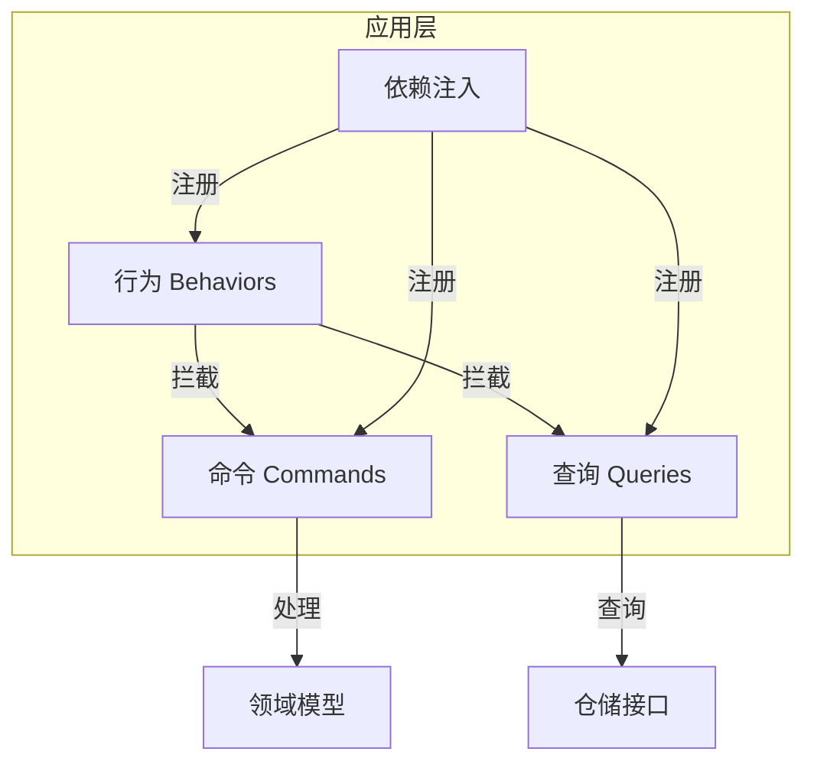
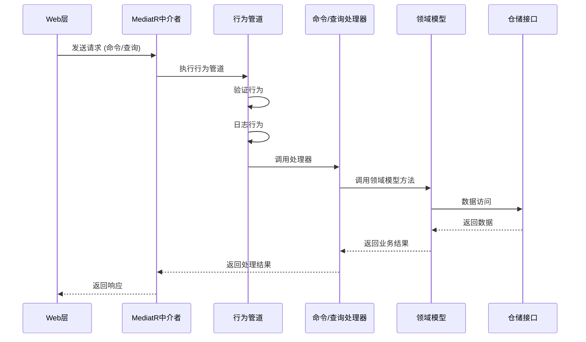
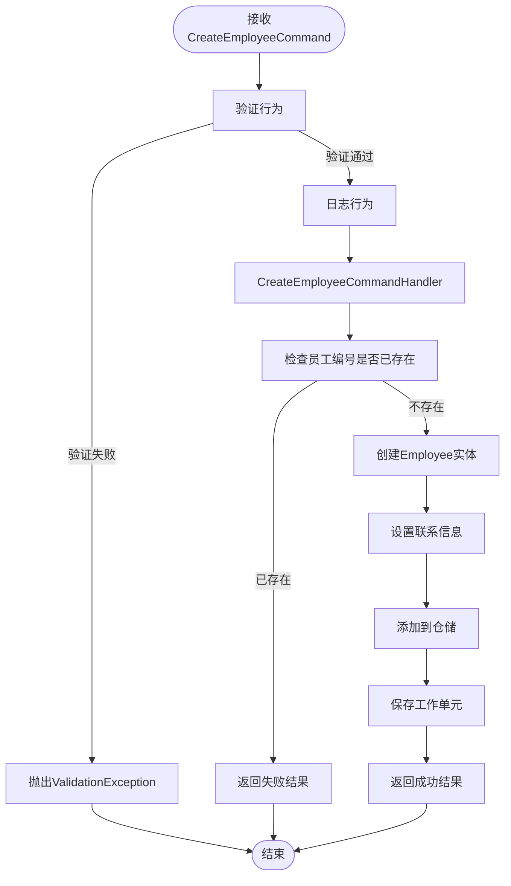
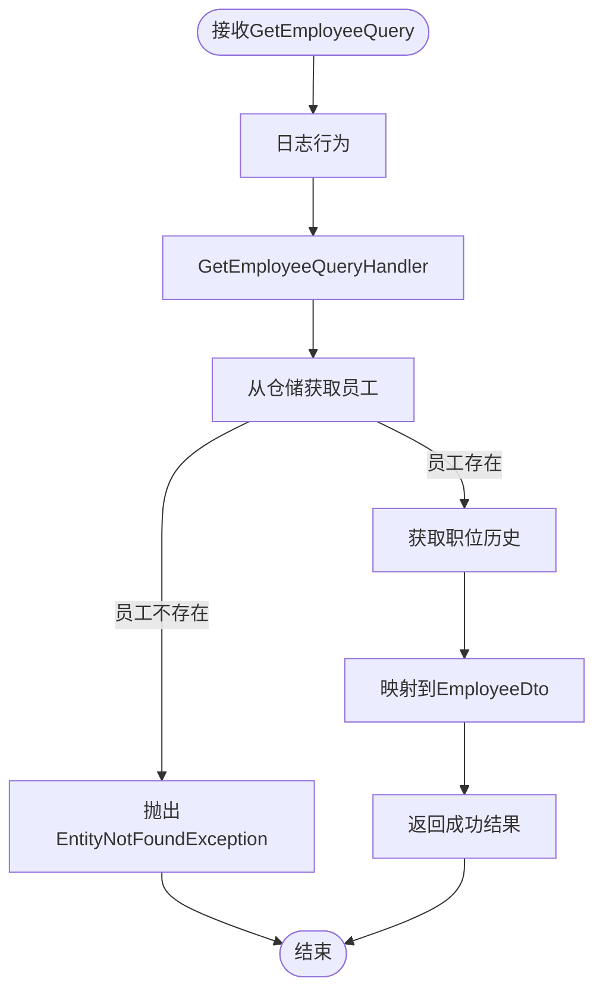
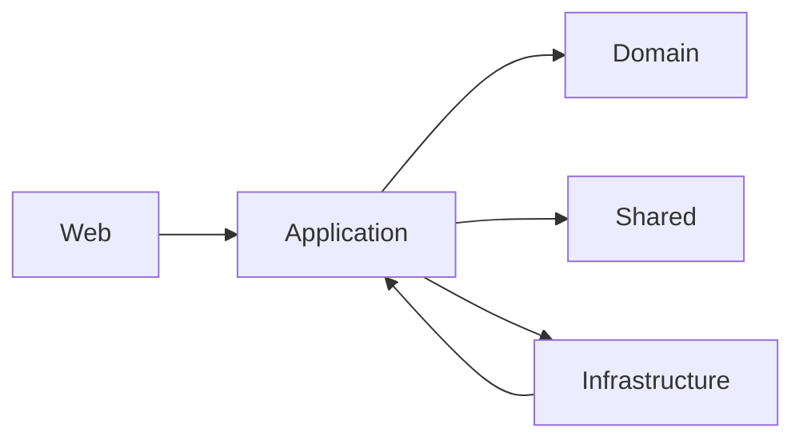

# 应用层

<cite>
**本文档中引用的文件**  
- [DependencyInjection.cs](file://Backend/Hrevolve.Application/DependencyInjection.cs)
- [CreateEmployeeCommand.cs](file://Backend/Hrevolve.Application/Employees/Commands/CreateEmployeeCommand.cs)
- [GetEmployeeQuery.cs](file://Backend/Hrevolve.Application/Employees/Queries/GetEmployeeQuery.cs)
- [ValidationBehavior.cs](file://Backend/Hrevolve.Application/Behaviors/ValidationBehavior.cs)
- [LoggingBehavior.cs](file://Backend/Hrevolve.Application/Behaviors/LoggingBehavior.cs)
- [Employee.cs](file://Backend/Hrevolve.Domain/Employees/Employee.cs)
- [IRepository.cs](file://Backend/Hrevolve.Domain/Common/IRepository.cs)
- [EmployeeRepository.cs](file://Backend/Hrevolve.Infrastructure/Persistence/Repositories/EmployeeRepository.cs)
- [EmployeesController.cs](file://Backend/Hrevolve.Web/Controllers/EmployeesController.cs)
- [Result.cs](file://Backend/Hrevolve.Shared/Results/Result.cs)
- [JobHistory.cs](file://Backend/Hrevolve.Domain/Employees/JobHistory.cs)
- [Entity.cs](file://Backend/Hrevolve.Domain/Common/Entity.cs)
- [ExceptionHandlingMiddleware.cs](file://Backend/Hrevolve.Web/Middleware/ExceptionHandlingMiddleware.cs)
</cite>

## 目录
1. [简介](#简介)
2. [项目结构](#项目结构)
3. [核心组件](#核心组件)
4. [架构概述](#架构概述)
5. [详细组件分析](#详细组件分析)
6. [依赖分析](#依赖分析)
7. [性能考虑](#性能考虑)
8. [故障排除指南](#故障排除指南)
9. [结论](#结论)

## 简介
Hrevolve应用层作为业务用例的协调器，实现了清晰的职责分离和可维护的架构设计。该层基于CQRS（命令查询职责分离）模式，利用MediatR库实现请求处理管道，将命令（写操作）与查询（读操作）完全解耦。通过行为管道（Behavior Pipeline）机制，系统能够在不侵入核心业务逻辑的情况下实现验证、日志记录等横切关注点。应用服务通过定义良好的接口与领域模型和基础设施层交互，确保了业务规则的集中管理和数据访问的抽象化。

## 项目结构
Hrevolve应用层遵循模块化设计原则，按功能领域组织代码结构。核心组件包括命令、查询、行为处理器和依赖注入配置。每个业务实体（如员工、请假、薪资等）都有独立的模块，包含其特定的命令和查询实现。行为管道组件实现了跨领域的横切关注点，如验证和日志记录。这种结构确保了高内聚、低耦合的设计原则，便于维护和扩展。

**图示来源**
- [DependencyInjection.cs](file://Backend/Hrevolve.Application/DependencyInjection.cs)
- [CreateEmployeeCommand.cs](file://Backend/Hrevolve.Application/Employees/Commands/CreateEmployeeCommand.cs)
- [GetEmployeeQuery.cs](file://Backend/Hrevolve.Application/Employees/Queries/GetEmployeeQuery.cs)
- [ValidationBehavior.cs](file://Backend/Hrevolve.Application/Behaviors/ValidationBehavior.cs)
- [LoggingBehavior.cs](file://Backend/Hrevolve.Application/Behaviors/LoggingBehavior.cs)

**本节来源**
- [Backend/Hrevolve.Application](file://Backend/Hrevolve.Application)

## 核心组件
应用层的核心组件包括CQRS模式的实现、行为管道机制、结果类型系统和依赖注入配置。CQRS模式通过MediatR实现，将写操作（命令）和读操作（查询）分离，提高了系统的可扩展性和性能。行为管道利用MediatR的IPipelineBehavior接口，在请求处理过程中插入横切关注点，如验证和日志记录。统一的结果类型系统（Result<T>）提供了标准化的响应格式，简化了错误处理。依赖注入配置集中管理了所有应用服务的注册和生命周期。

**本节来源**
- [DependencyInjection.cs](file://Backend/Hrevolve.Application/DependencyInjection.cs)
- [Result.cs](file://Backend/Hrevolve.Shared/Results/Result.cs)

## 架构概述
Hrevolve应用层采用分层架构，清晰地分离了关注点。Web层通过API控制器接收HTTP请求，并将其委托给MediatR中介者。MediatR根据请求类型（命令或查询）路由到相应的处理器。在请求到达处理器之前，会经过行为管道的预处理阶段，执行验证、日志记录等操作。处理器实现核心业务逻辑，调用领域模型执行业务规则，并通过仓储接口与数据存储交互。整个流程通过依赖注入容器协调，确保了松耦合和可测试性。

**图示来源**
- [EmployeesController.cs](file://Backend/Hrevolve.Web/Controllers/EmployeesController.cs)
- [CreateEmployeeCommand.cs](file://Backend/Hrevolve.Application/Employees/Commands/CreateEmployeeCommand.cs)
- [GetEmployeeQuery.cs](file://Backend/Hrevolve.Application/Employees/Queries/GetEmployeeQuery.cs)
- [ValidationBehavior.cs](file://Backend/Hrevolve.Application/Behaviors/ValidationBehavior.cs)
- [LoggingBehavior.cs](file://Backend/Hrevolve.Application/Behaviors/LoggingBehavior.cs)
- [Employee.cs](file://Backend/Hrevolve.Domain/Employees/Employee.cs)
- [EmployeeRepository.cs](file://Backend/Hrevolve.Infrastructure/Persistence/Repositories/EmployeeRepository.cs)

## 详细组件分析
### 员工管理组件分析
员工管理组件展示了Hrevolve应用层的核心设计模式。通过CreateEmployeeCommand和GetEmployeeQuery两个示例，可以清晰地看到CQRS模式的实现方式。命令用于修改系统状态，查询用于获取数据，两者完全分离，确保了单一职责原则。

#### 命令处理流程

**图示来源**
- [CreateEmployeeCommand.cs](file://Backend/Hrevolve.Application/Employees/Commands/CreateEmployeeCommand.cs)
- [ValidationBehavior.cs](file://Backend/Hrevolve.Application/Behaviors/ValidationBehavior.cs)
- [LoggingBehavior.cs](file://Backend/Hrevolve.Application/Behaviors/LoggingBehavior.cs)
- [Employee.cs](file://Backend/Hrevolve.Domain/Employees/Employee.cs)
- [EmployeeRepository.cs](file://Backend/Hrevolve.Infrastructure/Persistence/Repositories/EmployeeRepository.cs)

#### 查询处理流程

**图示来源**
- [GetEmployeeQuery.cs](file://Backend/Hrevolve.Application/Employees/Queries/GetEmployeeQuery.cs)
- [LoggingBehavior.cs](file://Backend/Hrevolve.Application/Behaviors/LoggingBehavior.cs)
- [EmployeeRepository.cs](file://Backend/Hrevolve.Infrastructure/Persistence/Repositories/EmployeeRepository.cs)

**本节来源**
- [CreateEmployeeCommand.cs](file://Backend/Hrevolve.Application/Employees/Commands/CreateEmployeeCommand.cs)
- [GetEmployeeQuery.cs](file://Backend/Hrevolve.Application/Employees/Queries/GetEmployeeQuery.cs)
- [Employee.cs](file://Backend/Hrevolve.Domain/Employees/Employee.cs)
- [EmployeeRepository.cs](file://Backend/Hrevolve.Infrastructure/Persistence/Repositories/EmployeeRepository.cs)

## 依赖分析
应用层与其他层之间存在明确的依赖关系。应用层依赖于领域层的实体和领域事件，以及共享层的结果类型和异常定义。通过接口抽象，应用层依赖于基础设施层的仓储接口，而不是具体实现，这符合依赖倒置原则。Web层依赖于应用层的MediatR接口进行请求处理。这种依赖结构确保了业务逻辑的独立性，使得应用层可以在不修改核心业务规则的情况下更换数据访问技术或表示层。

**图示来源**
- [DependencyInjection.cs](file://Backend/Hrevolve.Application/DependencyInjection.cs)
- [EmployeesController.cs](file://Backend/Hrevolve.Web/Controllers/EmployeesController.cs)
- [IRepository.cs](file://Backend/Hrevolve.Domain/Common/IRepository.cs)

**本节来源**
- [Backend/Hrevolve.Application](file://Backend/Hrevolve.Application)
- [Backend/Hrevolve.Web](file://Backend/Hrevolve.Web)
- [Backend/Hrevolve.Domain](file://Backend/Hrevolve.Domain)
- [Backend/Hrevolve.Infrastructure](file://Backend/Hrevolve.Infrastructure)

## 性能考虑
应用层的设计考虑了性能优化。CQRS模式允许对读写操作进行独立优化，查询可以直接访问优化的读模型，而不需要加载完整的领域对象。行为管道的实现采用了异步编程模型，避免了阻塞操作。验证行为在管道早期执行，可以快速拒绝无效请求，减少不必要的处理开销。日志行为使用结构化日志记录，便于后续分析和监控。此外，通过工作单元模式，多个相关操作可以作为一个事务执行，减少了数据库往返次数。

## 故障排除指南
当应用层出现问题时，可以从以下几个方面进行排查：首先检查行为管道的日志输出，了解请求处理的完整流程和耗时；其次验证请求数据是否符合验证规则，可以通过单元测试验证验证器的正确性；然后检查领域模型的方法是否正确执行了业务规则；最后确认仓储接口的实现是否正确地与数据库交互。全局异常处理中间件会捕获所有未处理的异常，并返回结构化的错误响应，便于前端处理。

**本节来源**
- [ExceptionHandlingMiddleware.cs](file://Backend/Hrevolve.Web/Middleware/ExceptionHandlingMiddleware.cs)
- [ValidationBehavior.cs](file://Backend/Hrevolve.Application/Behaviors/ValidationBehavior.cs)
- [LoggingBehavior.cs](file://Backend/Hrevolve.Application/Behaviors/LoggingBehavior.cs)

## 结论
Hrevolve应用层通过CQRS模式和MediatR实现了清晰的职责分离，使系统更易于理解和维护。行为管道机制优雅地解决了横切关注点的问题，避免了业务逻辑的污染。领域驱动设计的原则确保了业务规则的集中管理和正确性。依赖注入和接口抽象提供了良好的可测试性和可扩展性。整体架构遵循了SOLID原则，为系统的长期演进奠定了坚实的基础。