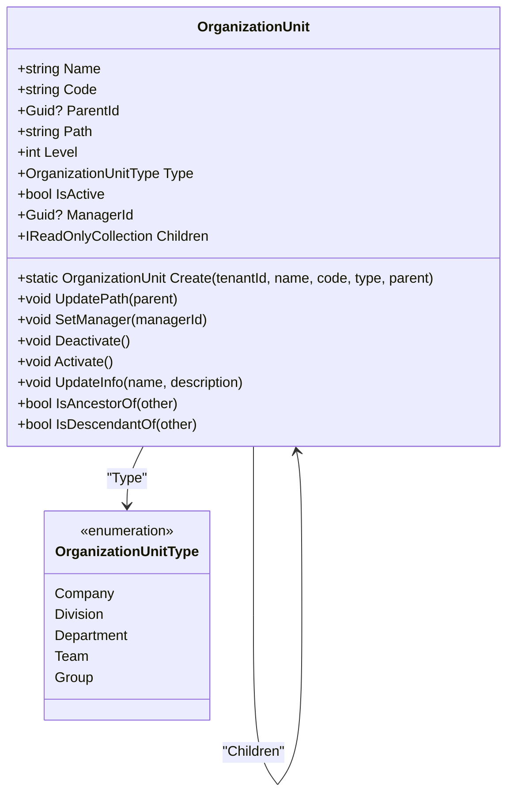
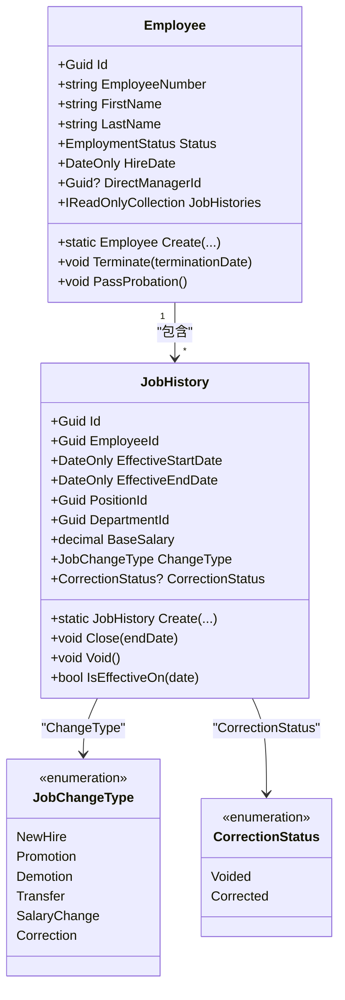
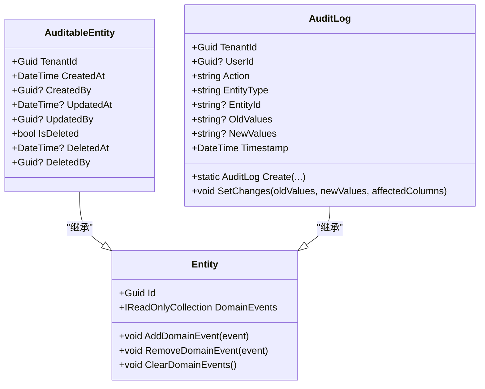
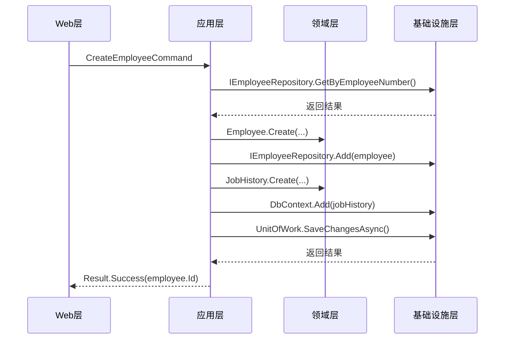

# 领域层

<cite>
**本文档引用的文件**  
- [Employee.cs](file://Backend/Hrevolve.Domain/Employees/Employee.cs)
- [JobHistory.cs](file://Backend/Hrevolve.Domain/Employees/JobHistory.cs)
- [LeaveRequest.cs](file://Backend/Hrevolve.Domain/Leave/LeaveRequest.cs)
- [LeaveType.cs](file://Backend/Hrevolve.Domain/Leave/LeaveType.cs)
- [OrganizationUnit.cs](file://Backend/Hrevolve.Domain/Organizations/OrganizationUnit.cs)
- [Position.cs](file://Backend/Hrevolve.Domain/Organizations/Position.cs)
- [AuditableEntity.cs](file://Backend/Hrevolve.Domain/Common/AuditableEntity.cs)
- [Entity.cs](file://Backend/Hrevolve.Domain/Common/Entity.cs)
- [ValueObject.cs](file://Backend/Hrevolve.Domain/Common/ValueObject.cs)
- [CreateEmployeeCommand.cs](file://Backend/Hrevolve.Application/Employees/Commands/CreateEmployeeCommand.cs)
- [CreateLeaveRequestCommand.cs](file://Backend/Hrevolve.Application/Leave/Commands/CreateLeaveRequestCommand.cs)
- [AuditLog.cs](file://Backend/Hrevolve.Domain/Audit/AuditLog.cs)
- [User.cs](file://Backend/Hrevolve.Domain/Identity/User.cs)
- [Role.cs](file://Backend/Hrevolve.Domain/Identity/Role.cs)
- [IRepository.cs](file://Backend/Hrevolve.Domain/Common/IRepository.cs)
- [Repository.cs](file://Backend/Hrevolve.Infrastructure/Persistence/Repositories/Repository.cs)
- [HrevolveDbContext.cs](file://Backend/Hrevolve.Infrastructure/Persistence/HrevolveDbContext.cs)
</cite>

## 目录
1. [引言](#引言)
2. [核心实体设计](#核心实体设计)
3. [值对象与数据一致性](#值对象与数据一致性)
4. [聚合根边界与关系](#聚合根边界与关系)
5. [领域事件与扩展点](#领域事件与扩展点)
6. [软删除与审计追踪](#软删除与审计追踪)
7. [领域层与应用层协作](#领域层与应用层协作)
8. [领域模型封装业务逻辑](#领域模型封装业务逻辑)
9. [结论](#结论)

## 引言
Hrevolve项目采用领域驱动设计（DDD）作为核心架构范式，将业务逻辑集中在领域层，确保系统具有高度的可维护性和可扩展性。领域层作为业务规则和核心逻辑的守护者，不依赖于任何外部层，保持了纯净的领域模型。本文档深入阐述Hrevolve领域层的设计原则、核心组件及其交互方式，为开发者提供权威的参考指南。

## 核心实体设计
Hrevolve领域层的核心实体包括Employee（员工）、OrganizationUnit（组织单元）和LeaveRequest（请假申请），它们直接映射业务领域的关键概念，并封装了丰富的业务规则。

### 员工实体 (Employee)
`Employee` 实体是员工全生命周期管理的核心，其设计遵循DDD的聚合根原则。所有属性均通过私有 `set` 访问器保护，确保状态只能通过明确定义的业务方法进行变更，防止了非法状态的出现。

- **设计原则**：采用工厂方法 `Create` 进行实例化，确保在创建时即满足所有必需的业务约束（如入职日期不能为空）。
- **业务规则**：
  - `Terminate` 方法用于终止员工，会自动将状态更新为 `Terminated` 并记录离职日期。
  - `PassProbation` 方法用于通过试用期，仅在员工处于在职状态且有试用期结束日期时才可执行。
  - `SetContactInfo` 方法集中管理联系信息，避免了分散的属性赋值。
- **枚举类型**：使用 `Gender`、`EmploymentStatus` 和 `EmploymentType` 等枚举来约束属性值，保证了数据的准确性和可读性。

**Section sources**
- [Employee.cs](file://Backend/Hrevolve.Domain/Employees/Employee.cs#L1-L137)

### 组织单元实体 (OrganizationUnit)
`OrganizationUnit` 实体支持树状的组织架构，其设计巧妙地结合了邻接表模型（`ParentId`）和路径枚举模型（`Path`），以实现高效的层级查询。

- **设计原则**：`Path` 字段（如 `/1/5/23/`）用于快速判断上下级关系，避免了昂贵的递归查询。
- **业务规则**：
  - `UpdatePath` 方法在创建或移动组织单元时被调用，自动维护 `Path` 和 `Level` 字段。
  - `IsAncestorOf` 和 `IsDescendantOf` 方法利用 `Path` 字段进行高效的层级关系判断。
  - `Deactivate` 和 `Activate` 方法用于管理组织单元的启用状态。

**Diagram sources**
- [OrganizationUnit.cs](file://Backend/Hrevolve.Domain/Organizations/OrganizationUnit.cs#L1-L108)

### 请假申请实体 (LeaveRequest)
`LeaveRequest` 实体是请假业务流程的核心，它不仅存储申请数据，还封装了复杂的业务逻辑。

- **设计原则**：在创建时通过 `CalculateTotalDays` 方法自动计算请假天数，确保数据的一致性。
- **业务规则**：
  - `Approve`、`Reject` 和 `Cancel` 方法是状态变更的唯一入口，它们会更新申请状态并添加相应的领域事件。
  - `CalculateTotalDays` 方法处理了全天、上午和下午等时段的复杂计算逻辑。
- **关联实体**：通过 `LeaveApproval` 集合记录完整的审批历史，实现了审批流程的可追溯性。

**Section sources**
- [LeaveRequest.cs](file://Backend/Hrevolve.Domain/Leave/LeaveRequest.cs#L1-L234)

## 值对象与数据一致性
值对象（Value Object）在Hrevolve中用于表示没有独立身份、仅由其属性值定义的对象。它们通过重写 `Equals` 和 `GetHashCode` 方法，确保了基于属性值的相等性比较。

- **作用**：`ValueObject` 基类（`ValueObject.cs`）提供了一个抽象的 `GetEqualityComponents` 方法，强制子类定义其相等性比较的组件。这确保了两个值对象在所有属性值都相等时才被视为相同。
- **数据一致性**：值对象是不可变的（Immutable），一旦创建，其状态就不能被修改。任何“修改”操作都会返回一个新的值对象实例。这种设计消除了因共享可变状态而导致的副作用，极大地增强了系统的可预测性和线程安全性。

**Section sources**
- [ValueObject.cs](file://Backend/Hrevolve.Domain/Common/ValueObject.cs#L1-L33)

## 聚合根边界与关系
聚合（Aggregate）是DDD中用于定义一致性边界的模式。聚合根（Aggregate Root）是聚合的入口点，负责维护聚合内部的业务规则。

### Employee与JobHistory的关系
`Employee` 是一个典型的聚合根，而 `JobHistory` 是其聚合内的实体。

- **边界划分逻辑**：
  - `Employee` 聚合根负责维护员工的核心信息（如姓名、联系方式）和状态（如在职、离职）。
  - `JobHistory` 实体则专门负责记录员工职位、部门、薪资等随时间变化的历史信息。它通过 `EmployeeId` 与 `Employee` 关联，并且其生命周期完全依赖于 `Employee`。
  - 这种划分将“员工是谁”和“员工的历史”这两个关注点分离，使得模型更加清晰和易于维护。
- **SCD Type 2 实现**：`JobHistory` 的设计实现了缓慢变化维度（SCD）的Type 2模式。通过 `EffectiveStartDate` 和 `EffectiveEndDate` 字段，可以精确地查询员工在任意历史时间点的状态。`Close` 方法用于关闭当前记录，为创建新的职位历史记录做准备。

**Diagram sources**
- [Employee.cs](file://Backend/Hrevolve.Domain/Employees/Employee.cs#L1-L137)
- [JobHistory.cs](file://Backend/Hrevolve.Domain/Employees/JobHistory.cs#L1-L124)

## 领域事件与扩展点
领域事件（Domain Event）是领域模型中发生的重要业务活动的记录，它们是实现松耦合和事件驱动架构的关键。

- **潜在扩展点**：
  - `EmployeeCreatedEvent`、`EmployeeTerminatedEvent` 等事件可以被应用层或基础设施层的事件处理器订阅，用于触发后续操作，如发送欢迎邮件、同步数据到外部系统、生成报表等。
  - 通过 `AddDomainEvent` 方法，可以在不修改核心业务逻辑的情况下，轻松地添加新的响应行为，符合开闭原则（OCP）。
- **实现机制**：`Entity` 基类通过一个私有的 `_domainEvents` 集合来管理领域事件。当聚合根的状态发生变更时，通过 `AddDomainEvent` 方法将事件添加到集合中。在事务提交后，这些事件会被发布到事件总线。

**Section sources**
- [Employee.cs](file://Backend/Hrevolve.Domain/Employees/Employee.cs#L133-L137)
- [Entity.cs](file://Backend/Hrevolve.Domain/Common/Entity.cs#L10-L18)

## 软删除与审计追踪
Hrevolve通过 `AuditableEntity` 基类统一实现了软删除和审计追踪功能。

### 软删除实现
- **机制**：`AuditableEntity` 继承自 `Entity`，并引入了 `IsDeleted` 布尔字段作为软删除标记。
- **基础设施支持**：在 `HrevolveDbContext` 中，通过 `SetSoftDeleteFilter` 方法为所有继承 `AuditableEntity` 的实体类型自动添加查询过滤器（`HasQueryFilter(e => !e.IsDeleted)`）。这意味着，除非显式查询，否则所有被“删除”的记录都不会出现在查询结果中。

### 审计追踪实现
- **机制**：`AuditableEntity` 包含了 `CreatedAt`、`CreatedBy`、`UpdatedAt`、`UpdatedBy`、`DeletedAt` 和 `DeletedBy` 等字段。
- **基础设施支持**：在 `HrevolveDbContext` 的 `SaveChangesAsync` 方法中，通过检查 `ChangeTracker` 的条目状态，自动填充这些审计字段。例如，当实体状态为 `Added` 时，会自动设置 `CreatedAt` 和 `CreatedBy`。

**Diagram sources**
- [AuditableEntity.cs](file://Backend/Hrevolve.Domain/Common/AuditableEntity.cs#L1-L47)
- [HrevolveDbContext.cs](file://Backend/Hrevolve.Infrastructure/Persistence/HrevolveDbContext.cs#L101-L134)
- [AuditLog.cs](file://Backend/Hrevolve.Domain/Audit/AuditLog.cs#L1-L126)

## 领域层与应用层协作
领域层与应用层的协作遵循清晰的职责分离原则。

- **协作方式**：
  - **应用层发起**：应用层（Application Layer）的命令处理器（如 `CreateEmployeeCommandHandler`）接收来自表示层（Web层）的请求。
  - **领域层执行**：应用层通过仓储（Repository）获取或创建领域实体，然后调用领域实体上的业务方法来执行核心逻辑。
  - **持久化**：应用层通过工作单元（UnitOfWork）协调多个仓储的操作，并在最后调用 `SaveChangesAsync` 来提交事务。
- **为何领域层不应依赖其他层**：
  - **独立性**：领域层是业务规则的“圣殿”，它必须独立于技术细节（如数据库、Web框架）。这种独立性使得领域模型可以被轻松地测试、重构和重用。
  - **可测试性**：由于领域层不依赖外部服务，可以对其进行纯粹的单元测试，无需启动数据库或网络服务。
  - **可维护性**：当技术栈发生变化时（例如从SQL Server迁移到MongoDB），只需修改基础设施层的实现，而领域层可以保持不变。

**Diagram sources**
- [CreateEmployeeCommand.cs](file://Backend/Hrevolve.Application/Employees/Commands/CreateEmployeeCommand.cs#L67-L126)
- [CreateLeaveRequestCommand.cs](file://Backend/Hrevolve.Application/Leave/Commands/CreateLeaveRequestCommand.cs#L43-L137)

## 领域模型封装业务逻辑
领域模型通过将业务逻辑封装在实体和值对象内部，确保了业务规则在持久化之前得到验证。

- **示例**：在 `CreateLeaveRequestCommandHandler` 中，应用层在调用 `LeaveRequest.Create` 之前，会先进行一系列业务规则检查：
  1.  **验证假期类型**：检查 `request.LeaveTypeId` 是否有效且处于激活状态。
  2.  **检查假期余额**：查询 `LeaveBalance`，计算可用余额，并确保申请天数不超过可用余额。
  3.  **检查日期冲突**：查询数据库，确保新申请的日期与已有的请假申请不冲突。
- **封装验证**：只有当所有这些前置检查都通过后，才会调用 `LeaveRequest.Create` 工厂方法。`LeaveRequest` 实体内部的 `CalculateTotalDays` 方法会再次进行精确的天数计算。这种分层验证确保了业务规则的严格执行。

**Section sources**
- [CreateLeaveRequestCommand.cs](file://Backend/Hrevolve.Application/Leave/Commands/CreateLeaveRequestCommand.cs#L43-L137)
- [LeaveRequest.cs](file://Backend/Hrevolve.Domain/Leave/LeaveRequest.cs#L92-L101)

## 结论
Hrevolve的领域层设计充分体现了领域驱动设计的核心思想。通过精心设计的聚合根、值对象和领域事件，系统成功地将复杂的业务逻辑与技术实现细节分离。`AuditableEntity` 提供了统一的多租户、软删除和审计追踪支持，而清晰的分层架构确保了领域模型的纯净性和可维护性。这种设计为Hrevolve构建一个健壮、灵活且可扩展的企业级HR系统奠定了坚实的基础。