# 后端架构

<cite>
**本文档引用的文件**
- [Program.cs](file://Backend/Hrevolve.Web/Program.cs)
- [DependencyInjection.cs](file://Backend/Hrevolve.Application/DependencyInjection.cs)
- [DependencyInjection.cs](file://Backend/Hrevolve.Infrastructure/DependencyInjection.cs)
- [Tenant.cs](file://Backend/Hrevolve.Domain/Tenants/Tenant.cs)
- [ITenantContext.cs](file://Backend/Hrevolve.Shared/MultiTenancy/ITenantContext.cs)
- [LoggingBehavior.cs](file://Backend/Hrevolve.Application/Behaviors/LoggingBehavior.cs)
- [ValidationBehavior.cs](file://Backend/Hrevolve.Application/Behaviors/ValidationBehavior.cs)
- [TenantResolver.cs](file://Backend/Hrevolve.Infrastructure/MultiTenancy/TenantResolver.cs)
- [TenantMiddleware.cs](file://Backend/Hrevolve.Web/Middleware/TenantMiddleware.cs)
- [ExceptionHandlingMiddleware.cs](file://Backend/Hrevolve.Web/Middleware/ExceptionHandlingMiddleware.cs)
- [CreateEmployeeCommand.cs](file://Backend/Hrevolve.Application/Employees/Commands/CreateEmployeeCommand.cs)
- [GetEmployeeQuery.cs](file://Backend/Hrevolve.Application/Employees/Queries/GetEmployeeQuery.cs)
- [LoginCommand.cs](file://Backend/Hrevolve.Application/Identity/Commands/LoginCommand.cs)
- [CreateLeaveRequestCommand.cs](file://Backend/Hrevolve.Application/Leave/Commands/CreateLeaveRequestCommand.cs)
- [HrevolveDbContext.cs](file://Backend/Hrevolve.Infrastructure/Persistence/HrevolveDbContext.cs)
</cite>

## 目录
1. [项目结构](#项目结构)
2. [分层架构设计](#分层架构设计)
3. [服务注册与依赖注入](#服务注册与依赖注入)
4. [中间件管道配置](#中间件管道配置)
5. [CQRS模式与MediatR应用](#cqrs模式与mediatr应用)
6. [行为过滤器机制](#行为过滤器机制)
7. [多租户上下文传播](#多租户上下文传播)
8. [数据库上下文与全局过滤器](#数据库上下文与全局过滤器)

## 项目结构

Hrevolve后端采用Clean Architecture分层设计，包含多个核心项目：

- **Hrevolve.Domain**：领域层，定义核心实体、值对象和业务规则
- **Hrevolve.Application**：应用层，处理用例逻辑，实现CQRS模式
- **Hrevolve.Infrastructure**：基础设施层，负责数据持久化和外部服务集成
- **Hrevolve.Web**：Web层，暴露API接口并配置中间件管道
- **Hrevolve.Shared**：共享层，包含跨层使用的接口和异常定义

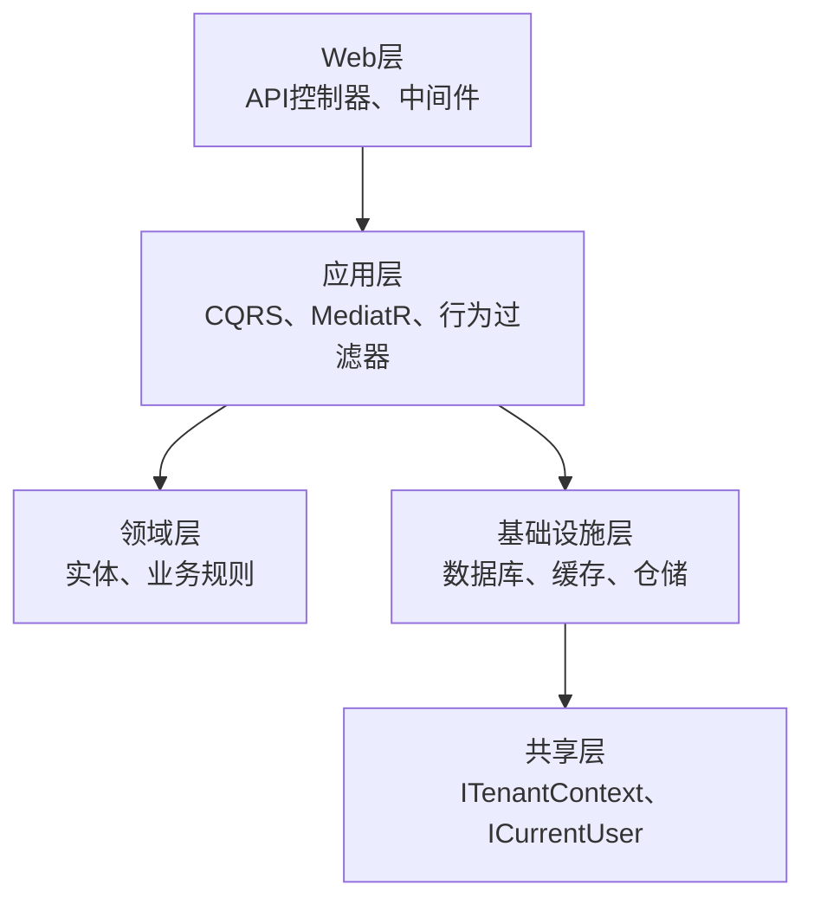

**图示来源**
- [Program.cs](file://Backend/Hrevolve.Web/Program.cs#L1-L173)
- [DependencyInjection.cs](file://Backend/Hrevolve.Application/DependencyInjection.cs#L1-L26)
- [DependencyInjection.cs](file://Backend/Hrevolve.Infrastructure/DependencyInjection.cs#L1-L58)

## 分层架构设计

Hrevolve采用Clean Architecture分层设计，各层职责分明，通过依赖注入实现松耦合。

### 领域层（Domain）

领域层定义了系统的核心实体和业务规则，如`Employee`、`Tenant`、`LeaveRequest`等。所有实体都继承自`AuditableEntity`，包含创建/更新时间、用户和租户ID等审计信息。

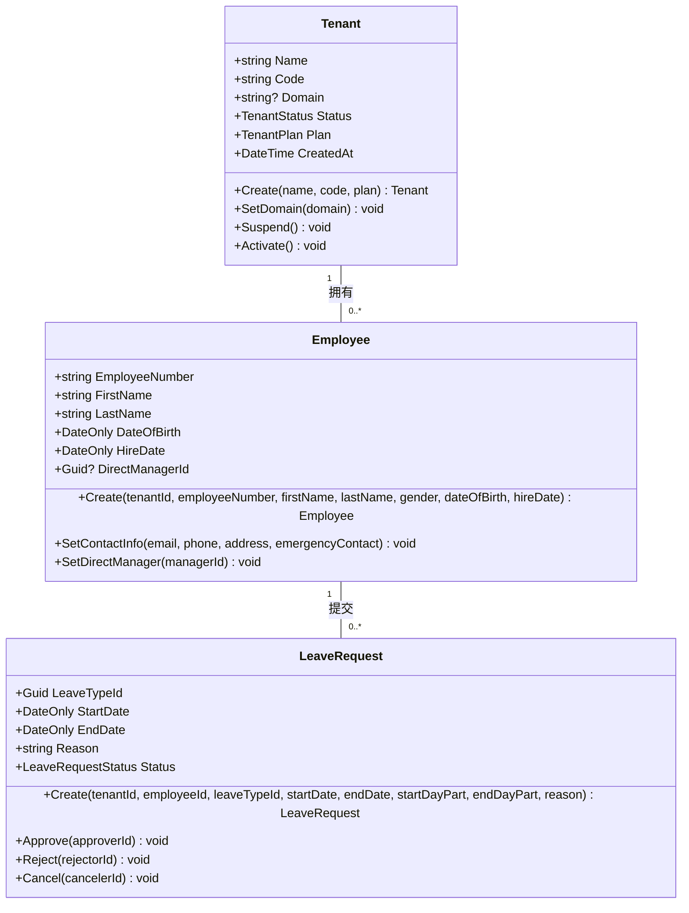

**图示来源**
- [Tenant.cs](file://Backend/Hrevolve.Domain/Tenants/Tenant.cs#L1-L67)
- [Employee.cs](file://Backend/Hrevolve.Domain/Employees/Employee.cs)
- [LeaveRequest.cs](file://Backend/Hrevolve.Domain/Leave/LeaveRequest.cs)

### 应用层（Application）

应用层采用CQRS模式，将命令（Commands）和查询（Queries）分离。通过MediatR实现请求处理管道，包含验证、日志等行为过滤器。

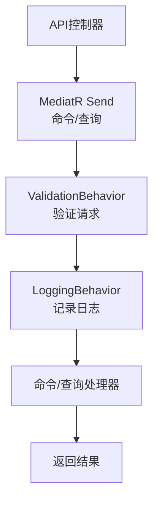

**图示来源**
- [CreateEmployeeCommand.cs](file://Backend/Hrevolve.Application/Employees/Commands/CreateEmployeeCommand.cs#L1-L136)
- [GetEmployeeQuery.cs](file://Backend/Hrevolve.Application/Employees/Queries/GetEmployeeQuery.cs#L1-L158)
- [LoginCommand.cs](file://Backend/Hrevolve.Application/Identity/Commands/LoginCommand.cs#L1-L177)

### 基础设施层（Infrastructure）

基础设施层实现数据持久化，包含`HrevolveDbContext`、仓储模式和多租户解析器。使用Entity Framework Core进行数据库操作，并通过全局查询过滤器实现多租户数据隔离。

### Web层（Web）

Web层负责暴露API接口，配置中间件管道，处理HTTP请求和响应。包含认证、授权、异常处理和多租户解析等中间件。

## 服务注册与依赖注入

### 应用层服务注册

应用层通过`AddApplication`扩展方法注册服务，主要包含MediatR和FluentValidation。

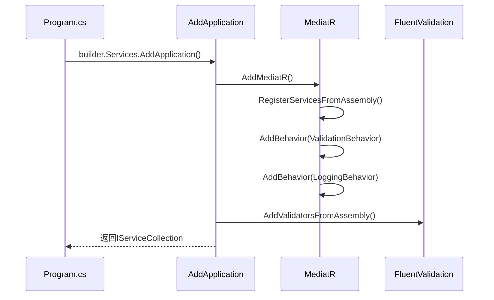

**图示来源**
- [DependencyInjection.cs](file://Backend/Hrevolve.Application/DependencyInjection.cs#L1-L26)
- [Program.cs](file://Backend/Hrevolve.Web/Program.cs#L102)

### 基础设施层服务注册

基础设施层通过`AddInfrastructure`扩展方法注册服务，包括数据库上下文、Redis缓存、多租户组件和仓储。

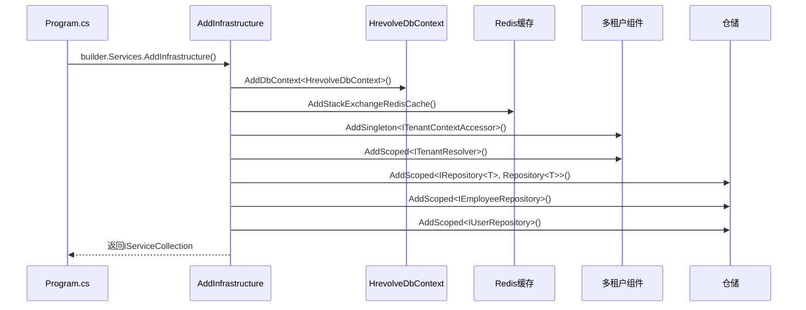

**图示来源**
- [DependencyInjection.cs](file://Backend/Hrevolve.Infrastructure/DependencyInjection.cs#L1-L58)
- [Program.cs](file://Backend/Hrevolve.Web/Program.cs#L103)

## 中间件管道配置

`Program.cs`中的中间件管道配置遵循特定顺序，确保正确处理请求。

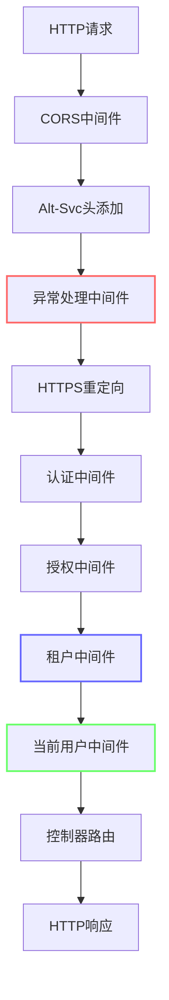

**图示来源**
- [Program.cs](file://Backend/Hrevolve.Web/Program.cs#L121-L155)
- [ExceptionHandlingMiddleware.cs](file://Backend/Hrevolve.Web/Middleware/ExceptionHandlingMiddleware.cs#L1-L105)
- [TenantMiddleware.cs](file://Backend/Hrevolve.Web/Middleware/TenantMiddleware.cs#L1-L142)

### 中间件执行顺序与作用

1. **CORS中间件**：允许跨域请求，必须在其他中间件之前
2. **Alt-Svc头添加**：通知客户端支持HTTP/3
3. **异常处理中间件**：捕获全局异常，返回标准化错误响应
4. **HTTPS重定向**：将HTTP请求重定向到HTTPS
5. **认证中间件**：验证JWT令牌，设置用户身份
6. **授权中间件**：检查用户权限
7. **租户中间件**：解析并设置租户上下文
8. **当前用户中间件**：设置当前用户信息
9. **控制器路由**：映射到相应的API控制器

## CQRS模式与MediatR应用

### 命令处理流程

以创建员工为例，展示CQRS命令处理流程：

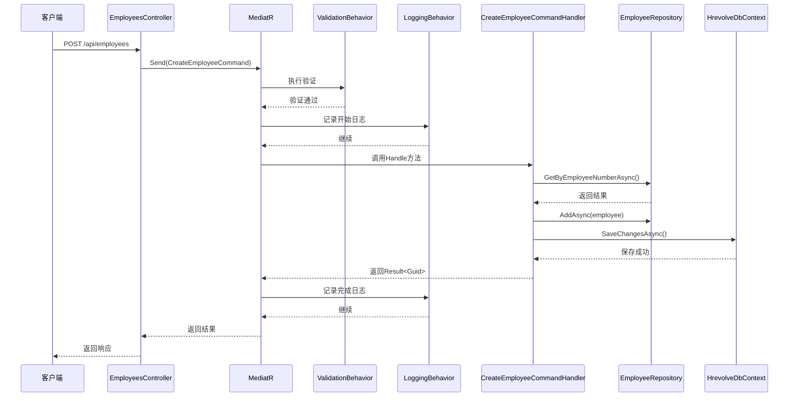

**图示来源**
- [CreateEmployeeCommand.cs](file://Backend/Hrevolve.Application/Employees/Commands/CreateEmployeeCommand.cs#L1-L136)
- [EmployeesController.cs](file://Backend/Hrevolve.Web/Controllers/EmployeesController.cs)

### 查询处理流程

以获取员工详情为例，展示CQRS查询处理流程：

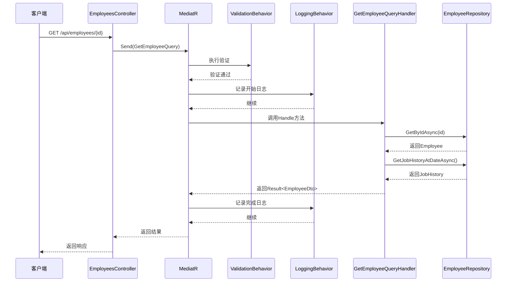

**图示来源**
- [GetEmployeeQuery.cs](file://Backend/Hrevolve.Application/Employees/Queries/GetEmployeeQuery.cs#L1-L158)
- [EmployeesController.cs](file://Backend/Hrevolve.Web/Controllers/EmployeesController.cs)

## 行为过滤器机制

### 验证行为过滤器

`ValidationBehavior`在命令/查询处理前自动执行FluentValidation验证。

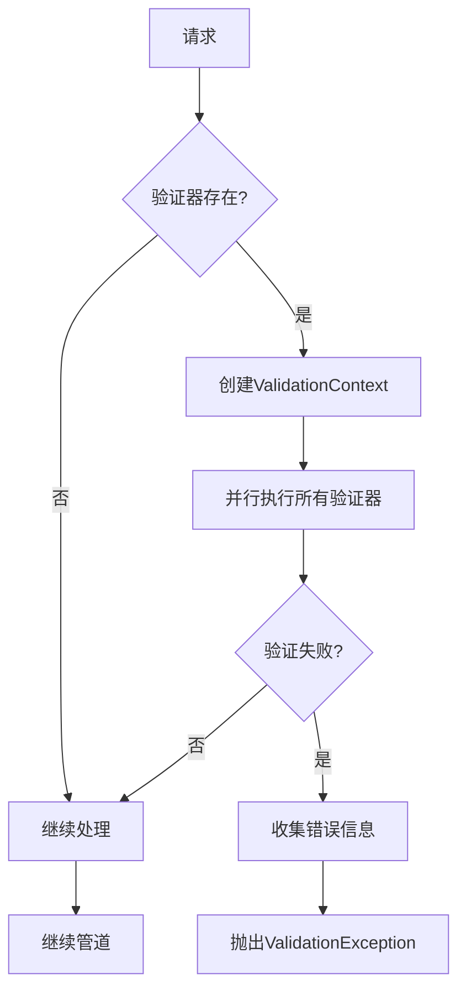

**图示来源**
- [ValidationBehavior.cs](file://Backend/Hrevolve.Application/Behaviors/ValidationBehavior.cs#L1-L49)
- [CreateEmployeeCommandValidator.cs](file://Backend/Hrevolve.Application/Employees/Commands/CreateEmployeeCommand.cs#L29-L65)

### 日志行为过滤器

`LoggingBehavior`记录请求处理的开始、完成和异常信息。

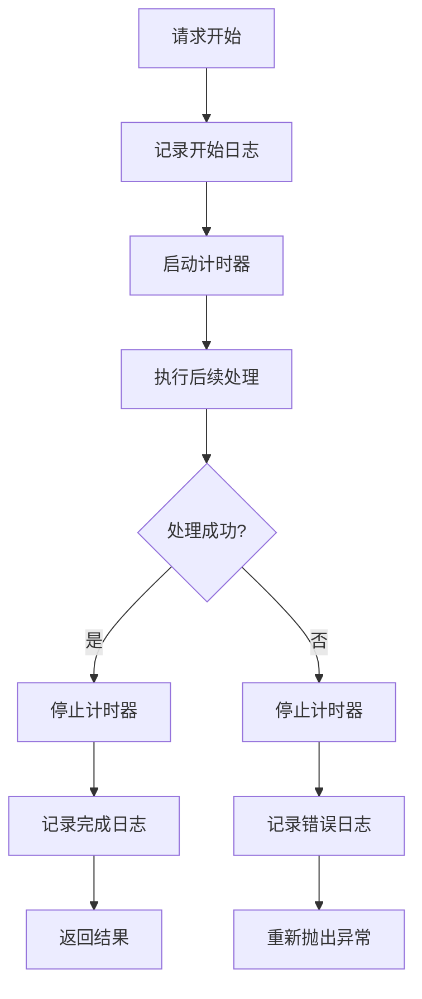

**图示来源**
- [LoggingBehavior.cs](file://Backend/Hrevolve.Application/Behaviors/LoggingBehavior.cs#L1-L59)

## 多租户上下文传播

### 租户上下文接口

`ITenantContext`定义了租户上下文的基本接口，`ITenantContextAccessor`用于设置和获取上下文。

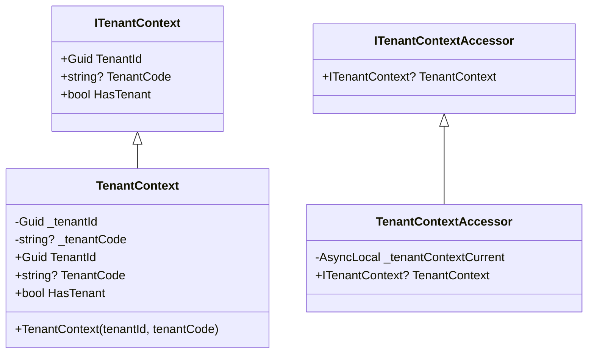

**图示来源**
- [ITenantContext.cs](file://Backend/Hrevolve.Shared/MultiTenancy/ITenantContext.cs#L1-L81)

### 租户解析流程

租户中间件解析租户的完整流程：

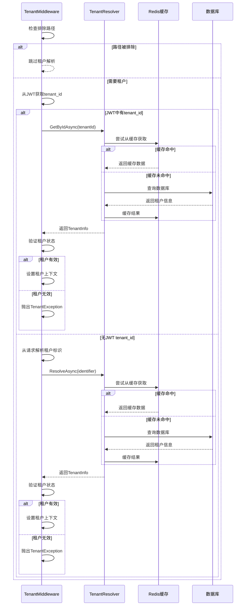

**图示来源**
- [TenantMiddleware.cs](file://Backend/Hrevolve.Web/Middleware/TenantMiddleware.cs#L1-L142)
- [TenantResolver.cs](file://Backend/Hrevolve.Infrastructure/MultiTenancy/TenantResolver.cs#L1-L108)

### 租户标识解析优先级

租户中间件按照以下优先级解析租户标识：

1. **Header**：`X-Tenant-Id` 请求头
2. **子域名**：`tenant.example.com` 的子域名部分
3. **查询参数**：`?tenant=code` 的查询参数

## 数据库上下文与全局过滤器

### HrevolveDbContext设计

`HrevolveDbContext`通过依赖注入获取`ITenantContextAccessor`和`ICurrentUserAccessor`，实现多租户和审计功能。

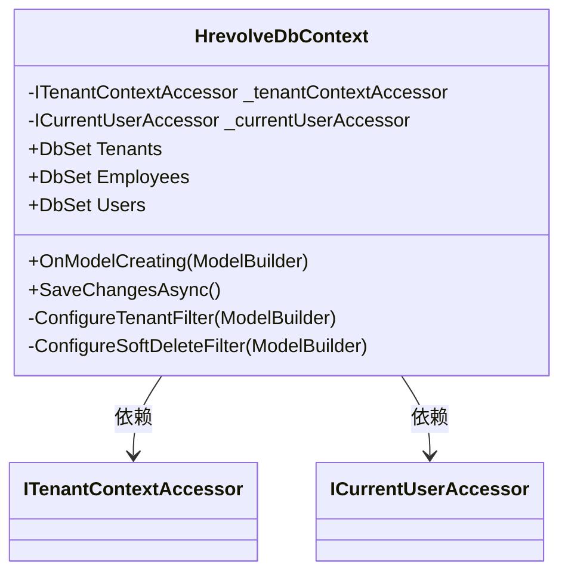

**图示来源**
- [HrevolveDbContext.cs](file://Backend/Hrevolve.Infrastructure/Persistence/HrevolveDbContext.cs#L1-L157)

### 全局查询过滤器

`HrevolveDbContext`实现了两个全局查询过滤器：

1. **多租户过滤器**：确保查询只返回当前租户的数据
2. **软删除过滤器**：自动过滤已删除的记录

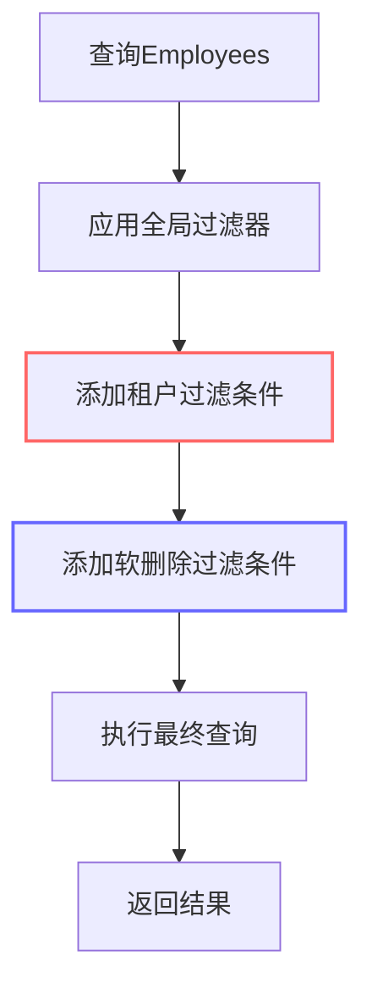

当执行 `context.Employees.ToList()` 时，实际生成的SQL包含：
```sql
WHERE "TenantId" = @tenantId AND "IsDeleted" = FALSE
```

**图示来源**
- [HrevolveDbContext.cs](file://Backend/Hrevolve.Infrastructure/Persistence/HrevolveDbContext.cs#L77-L118)

### 实体状态跟踪与审计

`SaveChangesAsync`重写方法在保存更改时自动设置审计字段：

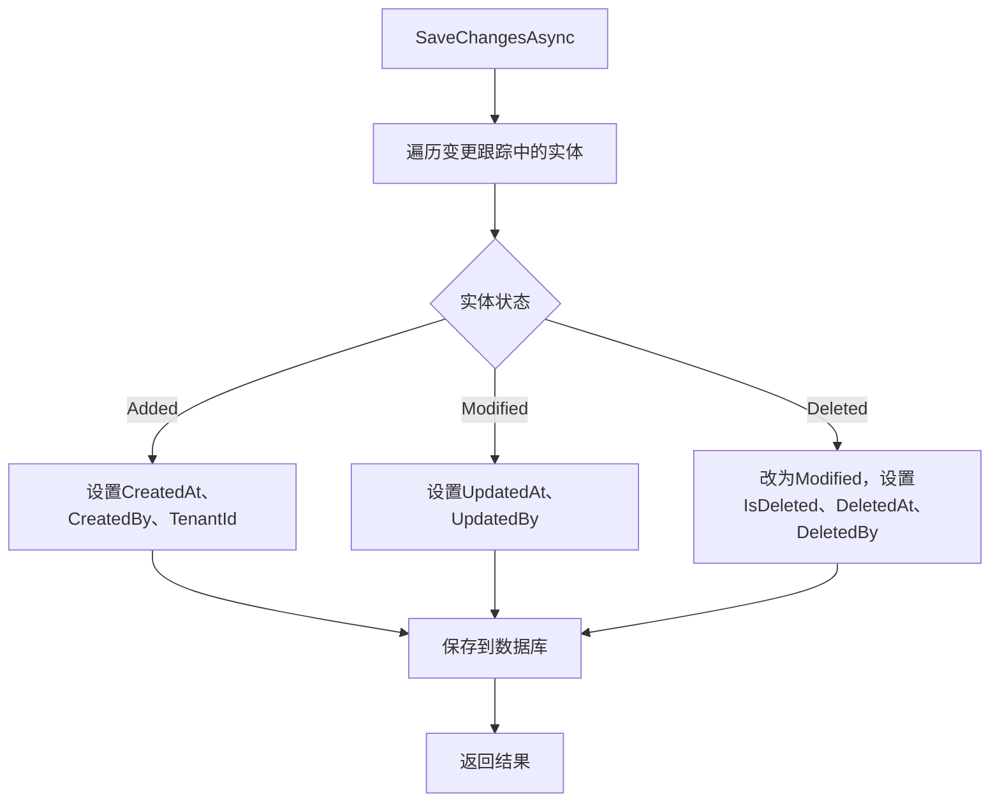

**图示来源**
- [HrevolveDbContext.cs](file://Backend/Hrevolve.Infrastructure/Persistence/HrevolveDbContext.cs#L120-L155)