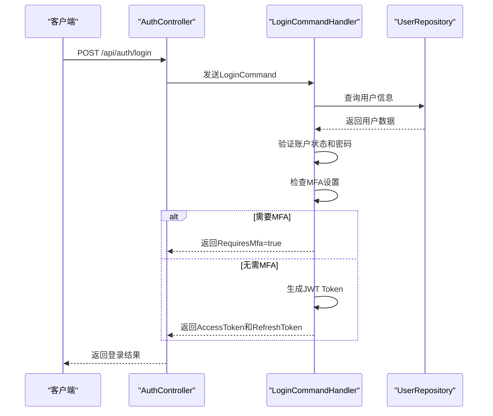
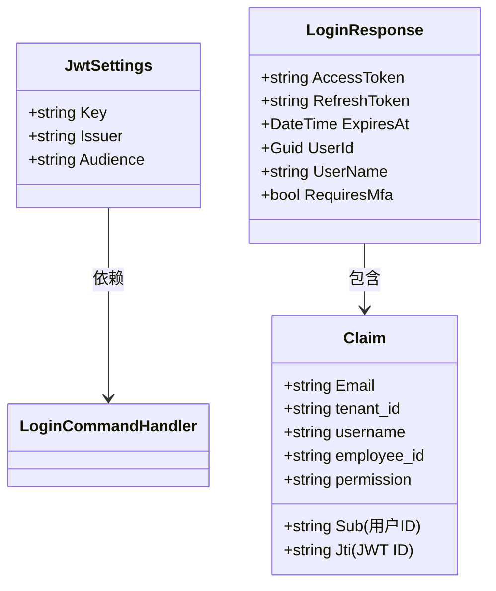
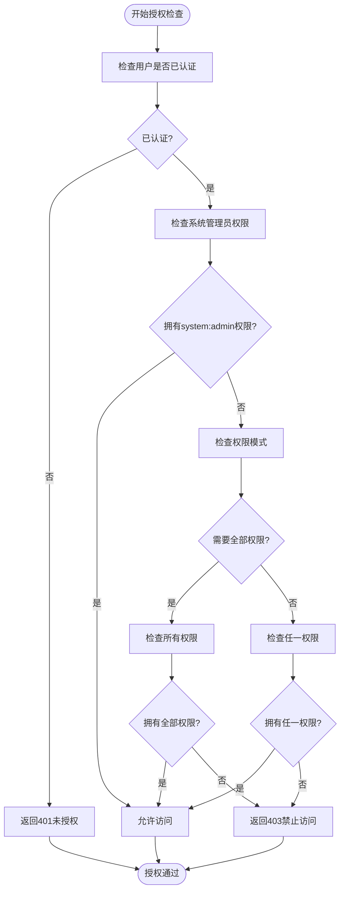
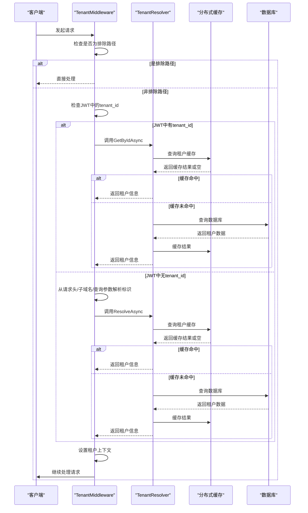
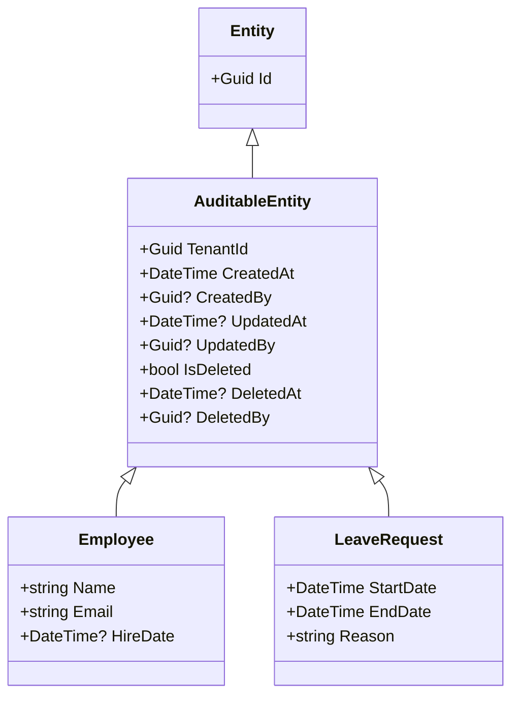
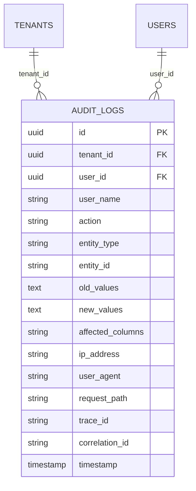
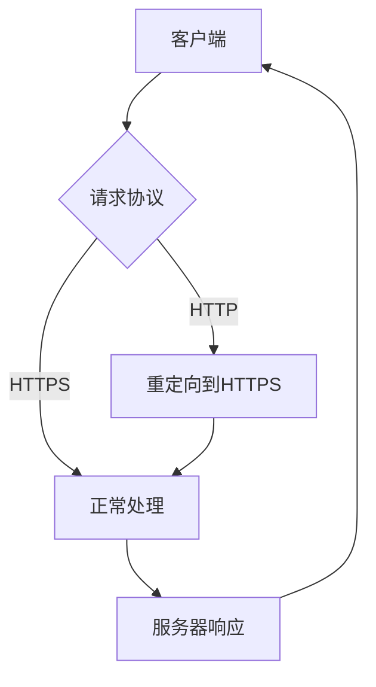

# 安全机制

<cite>
**本文档中引用的文件**  
- [AuthController.cs](file://Backend/Hrevolve.Web/Controllers/AuthController.cs)
- [LoginCommand.cs](file://Backend/Hrevolve.Application/Identity/Commands/LoginCommand.cs)
- [RequirePermissionAttribute.cs](file://Backend/Hrevolve.Web/Filters/RequirePermissionAttribute.cs)
- [TenantResolver.cs](file://Backend/Hrevolve.Infrastructure/MultiTenancy/TenantResolver.cs)
- [TenantMiddleware.cs](file://Backend/Hrevolve.Web/Middleware/TenantMiddleware.cs)
- [AuditableEntity.cs](file://Backend/Hrevolve.Domain/Common/AuditableEntity.cs)
- [AuditLog.cs](file://Backend/Hrevolve.Domain/Audit/AuditLog.cs)
- [CurrentUser.cs](file://Backend/Hrevolve.Shared/Identity/ICurrentUser.cs)
- [ITenantContext.cs](file://Backend/Hrevolve.Shared/MultiTenancy/ITenantContext.cs)
- [Program.cs](file://Backend/Hrevolve.Web/Program.cs)
- [appsettings.json](file://Backend/Hrevolve.Web/appsettings.json)
- [CurrentUserMiddleware.cs](file://Backend/Hrevolve.Web/Middleware/CurrentUserMiddleware.cs)
</cite>

## 目录
1. [引言](#引言)
2. [身份认证机制](#身份认证机制)
3. [授权控制](#授权控制)
4. [多租户数据隔离](#多租户数据隔离)
5. [审计与日志](#审计与日志)
6. [数据保护](#数据保护)
7. [安全最佳实践](#安全最佳实践)

## 引言
Hrevolve系统采用全面的安全架构设计，涵盖身份认证、授权、数据保护和审计四大核心领域。系统基于JWT实现无状态认证，通过RBAC模型进行细粒度权限控制，支持多租户环境下的数据隔离，并具备完整的操作审计能力。本文档详细阐述各项安全机制的实现原理与技术细节。

## 身份认证机制

Hrevolve系统采用JWT（JSON Web Token）作为主要的身份认证机制，支持用户名密码登录、Token刷新和登出功能。认证流程严格遵循安全最佳实践，包含IP记录、密码验证、MFA支持等关键环节。

**图示来源**  
- [AuthController.cs](file://Backend/Hrevolve.Web/Controllers/AuthController.cs#L17-L88)
- [LoginCommand.cs](file://Backend/Hrevolve.Application/Identity/Commands/LoginCommand.cs#L46-L168)

### JWT令牌管理

系统在`Program.cs`中配置了JWT认证方案，使用HMAC-SHA256算法进行签名，确保令牌的完整性和安全性。JWT配置信息从`appsettings.json`文件中读取，包含Issuer、Audience和密钥等关键参数。

**图示来源**  
- [Program.cs](file://Backend/Hrevolve.Web/Program.cs#L70-L86)
- [appsettings.json](file://Backend/Hrevolve.Web/appsettings.json#L6-L10)
- [LoginCommand.cs](file://Backend/Hrevolve.Application/Identity/Commands/LoginCommand.cs#L128-L162)

### 多因素认证支持

系统具备扩展支持MFA（多因素认证）的能力。当用户启用MFA时，登录流程会检查设备信任状态，对非受信任设备返回`RequiresMfa=true`，引导前端进行二次验证。支持的MFA方式包括TOTP（基于时间的一次性密码）和WebAuthn/FIDO2标准。

**本节来源**  
- [LoginCommand.cs](file://Backend/Hrevolve.Application/Identity/Commands/LoginCommand.cs#L81-L98)
- [Hrevolve.drawio](file://Design/Hrevolve.drawio#L150-L158)

### 单点登录扩展能力

通过`TenantSettings`中的`EnableSso`配置项，系统支持单点登录（SSO）的扩展。租户可以配置启用SSO，将认证委托给外部身份提供商，实现跨系统的统一身份管理。

**本节来源**  
- [TenantResolver.cs](file://Backend/Hrevolve.Infrastructure/MultiTenancy/TenantResolver.cs#L102-L103)

## 授权控制

Hrevolve系统采用基于角色的访问控制（RBAC）模型，通过自定义的`RequirePermissionAttribute`实现接口级别的权限检查，确保最小权限原则的落实。

### 基于权限的访问控制

`RequirePermissionAttribute`是一个自定义的授权过滤器，实现了`IAuthorizationFilter`接口。它通过检查当前用户是否具有指定权限来决定是否允许访问受保护的资源。系统支持两种权限检查模式：任一权限满足（OR）和全部权限满足（AND）。

**图示来源**  
- [RequirePermissionAttribute.cs](file://Backend/Hrevolve.Web/Filters/RequirePermissionAttribute.cs#L33-L78)

### 权限声明结构

权限信息作为声明（Claim）嵌入JWT令牌中，在用户登录时由`LoginCommandHandler`从数据库获取并添加到令牌的`permission`声明中。每个权限以字符串形式表示，如`employee:read`、`payroll:write`等，支持细粒度的资源操作控制。

**本节来源**  
- [LoginCommand.cs](file://Backend/Hrevolve.Application/Identity/Commands/LoginCommand.cs#L148-L152)
- [CurrentUserMiddleware.cs](file://Backend/Hrevolve.Web/Middleware/CurrentUserMiddleware.cs#L48-L50)

## 多租户数据隔离

Hrevolve系统采用多租户架构，通过`TenantResolver`和`TenantMiddleware`实现租户解析与上下文设置，确保不同租户间的数据完全隔离。

### 租户解析流程

租户解析器`TenantResolver`支持多种租户标识方式，包括域名、租户代码等。解析过程优先查询分布式缓存，未命中时再查询数据库，并将结果缓存30分钟以提高性能。租户信息包含连接字符串、设置等关键数据。

**图示来源**  
- [TenantMiddleware.cs](file://Backend/Hrevolve.Web/Middleware/TenantMiddleware.cs#L30-L103)
- [TenantResolver.cs](file://Backend/Hrevolve.Infrastructure/MultiTenancy/TenantResolver.cs#L29-L84)

### 租户上下文管理

`TenantContextAccessor`使用`AsyncLocal`存储当前请求的租户上下文，确保在异步操作中租户信息的正确传递。`TenantMiddleware`在请求处理完成后会清理租户上下文，防止内存泄漏。

**本节来源**  
- [ITenantContext.cs](file://Backend/Hrevolve.Shared/MultiTenancy/ITenantContext.cs#L54-L80)
- [TenantMiddleware.cs](file://Backend/Hrevolve.Web/Middleware/TenantMiddleware.cs#L94-L102)

## 审计与日志

系统通过`AuditableEntity`基类和`AuditLog`实体实现全面的操作审计，自动记录关键数据的创建、修改和删除操作。

### 审计实体基类

`AuditableEntity`作为所有可审计实体的基类，定义了租户ID、创建/修改时间、创建/修改人ID等审计字段。这些字段在数据持久化时由系统自动填充，确保审计信息的完整性和一致性。

**图示来源**  
- [AuditableEntity.cs](file://Backend/Hrevolve.Domain/Common/AuditableEntity.cs#L6-L47)

### 审计日志记录

`AuditLog`实体用于记录所有关键操作，包括创建、更新、删除、登录等。每条审计日志包含操作类型、实体类型、变更前后值、客户端IP、用户代理等丰富信息，支持安全审计和问题追溯。

**图示来源**  
- [AuditLog.cs](file://Backend/Hrevolve.Domain/Audit/AuditLog.cs#L8-L107)
- [HrevolveDbContextModelSnapshot.cs](file://Backend/Hrevolve.Infrastructure/Migrations/HrevolveDbContextModelSnapshot.cs#L308-L339)

## 数据保护

系统在数据保护方面采取了多层次的安全措施，包括敏感数据加密存储和强制HTTPS传输。

### 敏感字段加密

数据库中的敏感字段（如密码哈希、连接字符串、加密密钥等）采用加密存储。租户的`EncryptionKey`字段在数据库中加密存储，确保即使数据库泄露，敏感信息也不会被轻易获取。

**本节来源**  
- [HrevolveDbContextModelSnapshot.cs](file://Backend/Hrevolve.Infrastructure/Migrations/HrevolveDbContextModelSnapshot.cs#L1743-L1745)

### HTTPS强制传输

在`Program.cs`中配置了Kestrel服务器，启用HTTPS端口（5225）并支持HTTP/1.1、HTTP/2和HTTP/3协议。通过`UseHttpsRedirection`中间件强制HTTP请求重定向到HTTPS，确保所有数据传输都经过加密。

**本节来源**  
- [Program.cs](file://Backend/Hrevolve.Web/Program.cs#L4-L18)
- [Program.cs](file://Backend/Hrevolve.Web/Program.cs#L144)

## 安全最佳实践

Hrevolve系统遵循多项安全最佳实践，防范常见安全漏洞。

### 常见漏洞防范

- **暴力破解防护**：系统实现登录失败次数限制，连续失败3次后锁定账户15分钟，防止暴力破解攻击。
- **跨站请求伪造（CSRF）**：虽然未在代码中直接体现，但JWT认证机制本身具有抗CSRF的特性。
- **敏感信息泄露**：通过`ExcludedPaths`配置，确保健康检查、Swagger等公共接口不进行租户解析，避免信息泄露。
- **权限提升**：通过严格的权限检查和租户隔离，防止用户访问非授权资源或跨租户数据。

**本节来源**  
- [Hrevolve.drawio](file://Design/Hrevolve.drawio#L123-L127)
- [TenantMiddleware.cs](file://Backend/Hrevolve.Web/Middleware/TenantMiddleware.cs#L12-L22)

### 安全配置建议

1. **JWT密钥管理**：生产环境中应使用强密钥（至少256位），并通过密钥管理系统（KMS）进行管理，避免硬编码。
2. **审计日志保护**：审计日志应定期备份并存储在安全位置，防止被恶意删除或篡改。
3. **租户隔离验证**：定期审查租户隔离机制的有效性，确保没有绕过租户过滤的漏洞。
4. **依赖库更新**：及时更新所有依赖库，特别是安全相关的库（如JWT、加密库等），修复已知漏洞。