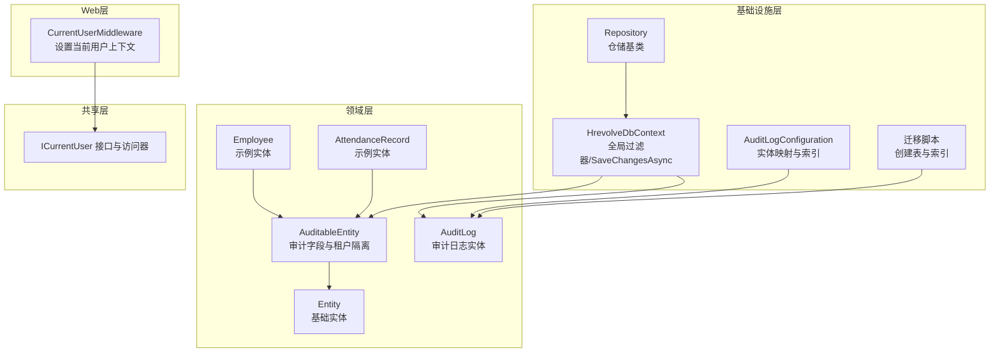
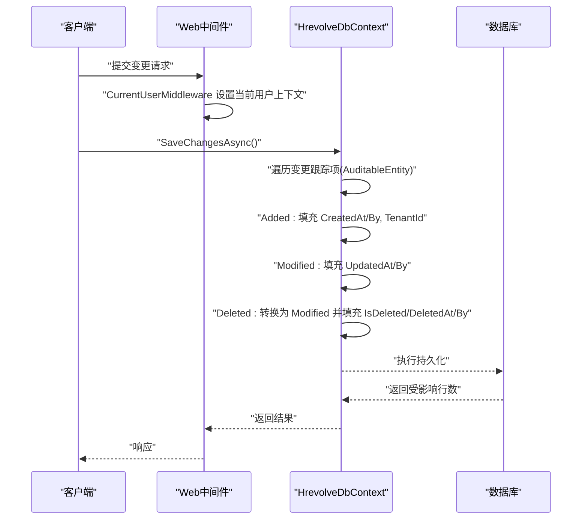
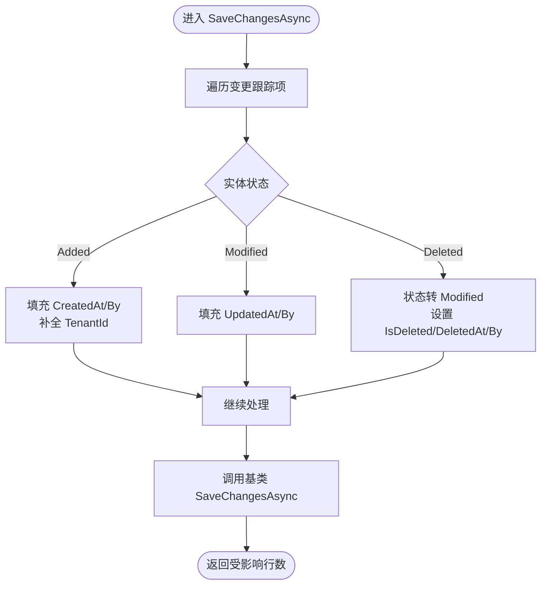
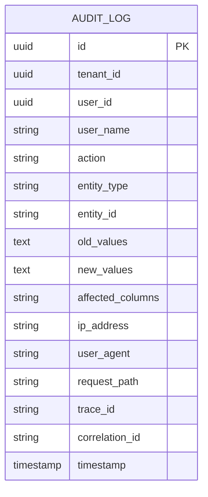
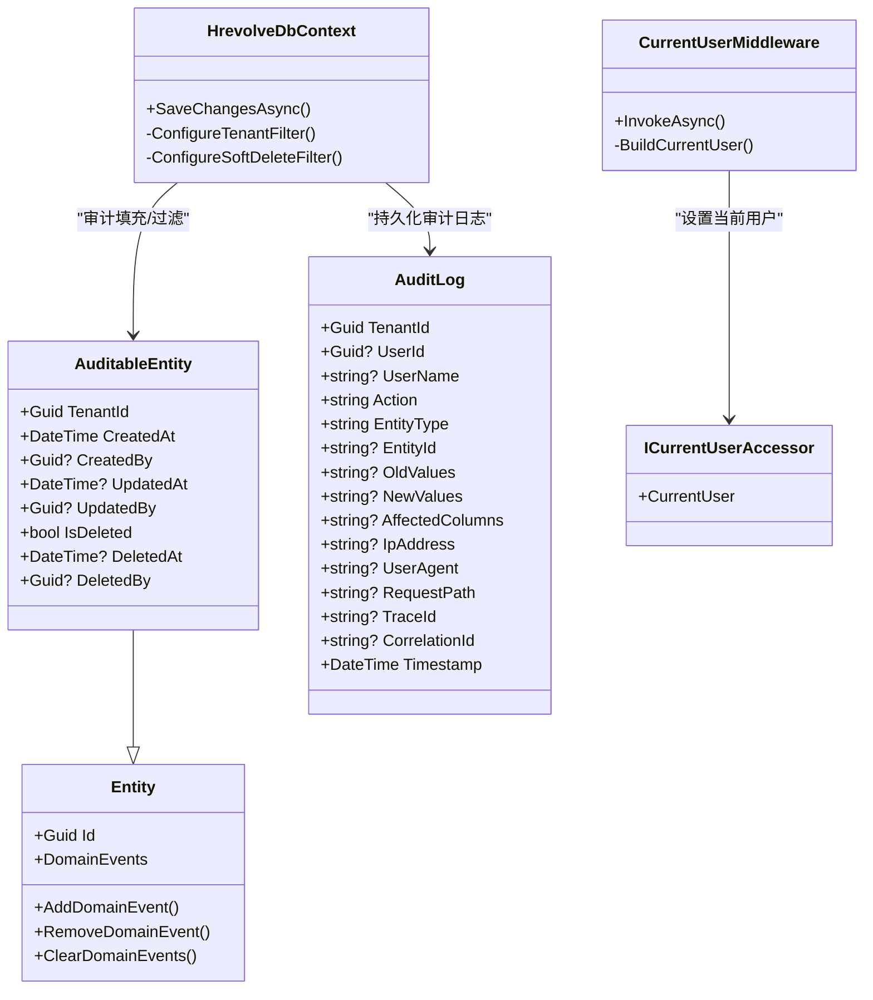

# 审计日志

<cite>
**本文引用的文件**
- [AuditableEntity.cs](file://Backend/Hrevolve.Domain/Common/AuditableEntity.cs)
- [Entity.cs](file://Backend/Hrevolve.Domain/Common/Entity.cs)
- [HrevolveDbContext.cs](file://Backend/Hrevolve.Infrastructure/Persistence/HrevolveDbContext.cs)
- [ICurrentUser.cs](file://Backend/Hrevolve.Shared/Identity/ICurrentUser.cs)
- [CurrentUserMiddleware.cs](file://Backend/Hrevolve.Web/Middleware/CurrentUserMiddleware.cs)
- [AuditLog.cs](file://Backend/Hrevolve.Domain/Audit/AuditLog.cs)
- [AuditLogConfiguration.cs](file://Backend/Hrevolve.Infrastructure/Persistence/Configurations/AuditLogConfiguration.cs)
- [20251227093819_InitialCreate.cs](file://Backend/Hrevolve.Infrastructure/Migrations/20251227093819_InitialCreate.cs)
- [TenantResolver.cs](file://Backend/Hrevolve.Infrastructure/MultiTenancy/TenantResolver.cs)
- [Employee.cs](file://Backend/Hrevolve.Domain/Employees/Employee.cs)
- [AttendanceRecord.cs](file://Backend/Hrevolve.Domain/Attendance/AttendanceRecord.cs)
- [Repository.cs](file://Backend/Hrevolve.Infrastructure/Persistence/Repositories/Repository.cs)
</cite>

## 目录
1. [简介](#简介)
2. [项目结构](#项目结构)
3. [核心组件](#核心组件)
4. [架构总览](#架构总览)
5. [详细组件分析](#详细组件分析)
6. [依赖关系分析](#依赖关系分析)
7. [性能考量](#性能考量)
8. [故障排查指南](#故障排查指南)
9. [结论](#结论)
10. [附录](#附录)

## 简介
本文件系统化记录基于 AuditableEntity 抽象基类的自动化审计日志机制。该机制通过在 EF Core SaveChangesAsync 中自动填充审计字段，结合多租户隔离与软删除策略，实现对全系统实体（员工、考勤、薪酬等）的统一审计与可追溯性管理。同时，审计日志实体用于记录操作行为、变更内容及请求上下文，配合数据库索引与迁移脚本，满足合规与性能要求。

## 项目结构
围绕审计主题的关键文件分布如下：
- 领域层：AuditableEntity、Entity、AuditLog、各业务实体（如 Employee、AttendanceRecord）
- 基础设施层：HrevolveDbContext（全局过滤器、SaveChangesAsync）、AuditLogConfiguration、迁移脚本
- Web 层：CurrentUserMiddleware（注入当前用户上下文）
- 共享层：ICurrentUser 接口与 CurrentUser 实现（线程本地存储）

图表来源
- [AuditableEntity.cs](file://Backend/Hrevolve.Domain/Common/AuditableEntity.cs#L1-L48)
- [Entity.cs](file://Backend/Hrevolve.Domain/Common/Entity.cs#L1-L49)
- [AuditLog.cs](file://Backend/Hrevolve.Domain/Audit/AuditLog.cs#L1-L126)
- [Employee.cs](file://Backend/Hrevolve.Domain/Employees/Employee.cs#L1-L137)
- [AttendanceRecord.cs](file://Backend/Hrevolve.Domain/Attendance/AttendanceRecord.cs#L1-L99)
- [HrevolveDbContext.cs](file://Backend/Hrevolve.Infrastructure/Persistence/HrevolveDbContext.cs#L1-L157)
- [AuditLogConfiguration.cs](file://Backend/Hrevolve.Infrastructure/Persistence/Configurations/AuditLogConfiguration.cs#L1-L47)
- [20251227093819_InitialCreate.cs](file://Backend/Hrevolve.Infrastructure/Migrations/20251227093819_InitialCreate.cs#L1-L851)
- [CurrentUserMiddleware.cs](file://Backend/Hrevolve.Web/Middleware/CurrentUserMiddleware.cs#L1-L58)
- [Repository.cs](file://Backend/Hrevolve.Infrastructure/Persistence/Repositories/Repository.cs#L1-L115)

章节来源
- [AuditableEntity.cs](file://Backend/Hrevolve.Domain/Common/AuditableEntity.cs#L1-L48)
- [HrevolveDbContext.cs](file://Backend/Hrevolve.Infrastructure/Persistence/HrevolveDbContext.cs#L1-L157)

## 核心组件
- AuditableEntity：继承自 Entity，新增 TenantId、CreatedAt/UpdatedAt/DeletedAt、CreatedBy/UpdatedBy/DeletedBy、IsDeleted 等审计字段，统一支撑多租户隔离与软删除。
- HrevolveDbContext：重写 SaveChangesAsync，在 Added/Modified/Deleted 三种状态分别填充审计字段；通过 HasQueryFilter 实施租户过滤与软删除过滤。
- ICurrentUser 与 CurrentUserMiddleware：在请求生命周期内注入当前用户上下文，供 SaveChangesAsync 获取操作者信息。
- AuditLog：独立的审计日志实体，记录操作类型、实体类型/ID、变更内容、请求上下文等，配合索引优化查询。

章节来源
- [AuditableEntity.cs](file://Backend/Hrevolve.Domain/Common/AuditableEntity.cs#L1-L48)
- [HrevolveDbContext.cs](file://Backend/Hrevolve.Infrastructure/Persistence/HrevolveDbContext.cs#L120-L156)
- [ICurrentUser.cs](file://Backend/Hrevolve.Shared/Identity/ICurrentUser.cs#L1-L115)
- [CurrentUserMiddleware.cs](file://Backend/Hrevolve.Web/Middleware/CurrentUserMiddleware.cs#L1-L58)
- [AuditLog.cs](file://Backend/Hrevolve.Domain/Audit/AuditLog.cs#L1-L126)

## 架构总览
下图展示审计流程：应用层发起保存，中间件注入用户上下文，EF Core 调用 DbContext.SaveChangesAsync，自动填充审计字段并执行软删除转换，最终持久化到数据库。

图表来源
- [HrevolveDbContext.cs](file://Backend/Hrevolve.Infrastructure/Persistence/HrevolveDbContext.cs#L120-L156)
- [CurrentUserMiddleware.cs](file://Backend/Hrevolve.Web/Middleware/CurrentUserMiddleware.cs#L1-L58)

## 详细组件分析

### AuditableEntity 审计字段详解
- TenantId：租户标识，用于多租户隔离。
- CreatedAt/UpdatedAt/DeletedAt：记录创建、最后修改与软删除的时间戳。
- CreatedBy/UpdatedBy/DeletedBy：记录操作者标识，便于审计溯源。
- IsDeleted：软删除标记，替代物理删除，保障数据可追溯性。

这些字段在 EF Core SaveChangesAsync 中由 DbContext 自动填充，无需业务层重复赋值。

章节来源
- [AuditableEntity.cs](file://Backend/Hrevolve.Domain/Common/AuditableEntity.cs#L1-L48)
- [HrevolveDbContext.cs](file://Backend/Hrevolve.Infrastructure/Persistence/HrevolveDbContext.cs#L120-L156)

### HrevolveDbContext 的审计与过滤机制
- SaveChangesAsync：
  - Added：填充 CreatedAt、CreatedBy；若未设置 TenantId 且存在租户上下文，则自动补全 TenantId。
  - Modified：填充 UpdatedAt、UpdatedBy。
  - Deleted：将实体状态转换为 Modified，并设置 IsDeleted、DeletedAt、DeletedBy，从而实现软删除。
- 全局查询过滤器：
  - 租户过滤：对所有 AuditableEntity 类型实体应用 HasQueryFilter，仅返回当前租户的数据。
  - 软删除过滤：对所有 AuditableEntity 类型实体应用 HasQueryFilter，隐藏 IsDeleted=true 的记录。

图表来源
- [HrevolveDbContext.cs](file://Backend/Hrevolve.Infrastructure/Persistence/HrevolveDbContext.cs#L120-L156)

章节来源
- [HrevolveDbContext.cs](file://Backend/Hrevolve.Infrastructure/Persistence/HrevolveDbContext.cs#L77-L119)
- [HrevolveDbContext.cs](file://Backend/Hrevolve.Infrastructure/Persistence/HrevolveDbContext.cs#L120-L156)

### 多租户隔离与软删除
- 多租户隔离：通过 ConfigureTenantFilter 对所有 AuditableEntity 添加租户过滤条件，确保查询默认只返回当前租户数据。
- 软删除：ConfigureSoftDeleteFilter 对所有 AuditableEntity 添加 IsDeleted 过滤，隐藏被软删除的记录；删除操作在 SaveChangesAsync 中转换为更新并打上 IsDeleted 标记。

章节来源
- [HrevolveDbContext.cs](file://Backend/Hrevolve.Infrastructure/Persistence/HrevolveDbContext.cs#L77-L119)

### 审计日志实体与索引
- AuditLog 实体：记录操作类型、实体类型/ID、变更内容（OldValues/NewValues/AffectedColumns）、请求上下文（IP/UserAgent/RequestPath/TraceId/CorrelationId）以及时间戳。
- 索引设计：迁移脚本创建了针对 TenantId、Timestamp、UserId、EntityType、EntityId 等列的复合索引，以提升审计查询性能。

图表来源
- [AuditLog.cs](file://Backend/Hrevolve.Domain/Audit/AuditLog.cs#L1-L126)
- [20251227093819_InitialCreate.cs](file://Backend/Hrevolve.Infrastructure/Migrations/20251227093819_InitialCreate.cs#L1-L851)

章节来源
- [AuditLog.cs](file://Backend/Hrevolve.Domain/Audit/AuditLog.cs#L1-L126)
- [AuditLogConfiguration.cs](file://Backend/Hrevolve.Infrastructure/Persistence/Configurations/AuditLogConfiguration.cs#L1-L47)
- [20251227093819_InitialCreate.cs](file://Backend/Hrevolve.Infrastructure/Migrations/20251227093819_InitialCreate.cs#L816-L831)

### 当前用户上下文注入
- CurrentUserMiddleware：从 JWT Claims 解析用户信息，构建 CurrentUser 并通过 ICurrentUserAccessor 注入到线程本地存储，供 SaveChangesAsync 使用。
- ICurrentUser：定义用户标识、用户名、邮箱、租户ID、员工ID、角色与权限集合等。

章节来源
- [CurrentUserMiddleware.cs](file://Backend/Hrevolve.Web/Middleware/CurrentUserMiddleware.cs#L1-L58)
- [ICurrentUser.cs](file://Backend/Hrevolve.Shared/Identity/ICurrentUser.cs#L1-L115)

### 示例实体：员工与考勤
- Employee：继承自 AuditableEntity，具备完整的审计字段，适用于员工全生命周期管理。
- AttendanceRecord：继承自 AuditableEntity，具备考勤相关业务字段，同样受审计与过滤机制约束。

章节来源
- [Employee.cs](file://Backend/Hrevolve.Domain/Employees/Employee.cs#L1-L137)
- [AttendanceRecord.cs](file://Backend/Hrevolve.Domain/Attendance/AttendanceRecord.cs#L1-L99)

### 仓储与工作单元
- Repository：封装通用 CRUD 操作，内部通过 HrevolveDbContext 执行持久化。
- UnitOfWork：封装事务控制与 SaveChangesAsync 调用，保证批量操作的一致性。

章节来源
- [Repository.cs](file://Backend/Hrevolve.Infrastructure/Persistence/Repositories/Repository.cs#L1-L115)

## 依赖关系分析
- AuditableEntity 依赖 Entity 提供基础标识与领域事件能力。
- HrevolveDbContext 依赖 ICurrentUserAccessor 与 ITenantContextAccessor 获取当前用户与租户上下文。
- AuditLogConfiguration 与迁移脚本共同定义审计日志表结构与索引。
- Web 层 CurrentUserMiddleware 为基础设施层提供用户上下文。

图表来源
- [Entity.cs](file://Backend/Hrevolve.Domain/Common/Entity.cs#L1-L49)
- [AuditableEntity.cs](file://Backend/Hrevolve.Domain/Common/AuditableEntity.cs#L1-L48)
- [HrevolveDbContext.cs](file://Backend/Hrevolve.Infrastructure/Persistence/HrevolveDbContext.cs#L1-L157)
- [AuditLog.cs](file://Backend/Hrevolve.Domain/Audit/AuditLog.cs#L1-L126)
- [CurrentUserMiddleware.cs](file://Backend/Hrevolve.Web/Middleware/CurrentUserMiddleware.cs#L1-L58)
- [ICurrentUser.cs](file://Backend/Hrevolve.Shared/Identity/ICurrentUser.cs#L1-L115)

## 性能考量
- 索引优化建议：
  - 审计日志：按 TenantId、Timestamp 建立复合索引，支持按租户与时间范围检索。
  - 审计日志：按 TenantId、UserId、Timestamp 建立复合索引，支持按用户与时间范围检索。
  - 审计日志：按 TenantId、EntityType、EntityId 建立复合索引，支持按实体定位检索。
  - 业务实体：根据实际查询模式建立复合索引（例如员工按 TenantId+Status、TenantId+EmployeeNumber 等）。
- 归档策略：
  - 审计日志：定期将历史审计数据归档至独立表或外部存储，保留最近 N 个月的审计记录，降低主表膨胀。
  - 业务实体：对长期不活跃的历史数据进行归档或冷存储，减少热数据扫描压力。
- 查询最佳实践：
  - 使用分页与筛选条件，避免一次性加载大量审计数据。
  - 优先使用复合索引覆盖的查询条件，减少回表与排序成本。
  - 对高频查询建立物化视图或汇总表，加速报表与统计场景。

章节来源
- [20251227093819_InitialCreate.cs](file://Backend/Hrevolve.Infrastructure/Migrations/20251227093819_InitialCreate.cs#L816-L831)
- [AuditLogConfiguration.cs](file://Backend/Hrevolve.Infrastructure/Persistence/Configurations/AuditLogConfiguration.cs#L1-L47)

## 故障排查指南
- 审计字段为空：
  - 确认请求是否经过 CurrentUserMiddleware，确保 ICurrentUserAccessor.CurrentUser 已正确设置。
  - 检查 SaveChangesAsync 是否被调用（仓储/工作单元层）。
- 软删除无效：
  - 确认实体确实进入 Deleted 状态，DbContext 将其转换为 Modified 并设置 IsDeleted。
  - 检查全局过滤器是否生效（HasQueryFilter）。
- 多租户隔离异常：
  - 确认 ITenantContextAccessor.TenantContext 是否包含有效租户信息。
  - 检查实体 TenantId 是否被正确填充（空值时自动补全）。
- 审计日志缺失：
  - 确认审计日志实体是否被持久化，检查迁移脚本中的索引与表结构。
  - 核对审计日志的筛选条件（TenantId、时间范围、实体类型/ID）。

章节来源
- [CurrentUserMiddleware.cs](file://Backend/Hrevolve.Web/Middleware/CurrentUserMiddleware.cs#L1-L58)
- [HrevolveDbContext.cs](file://Backend/Hrevolve.Infrastructure/Persistence/HrevolveDbContext.cs#L120-L156)
- [TenantResolver.cs](file://Backend/Hrevolve.Infrastructure/MultiTenancy/TenantResolver.cs#L1-L108)

## 结论
通过 AuditableEntity 基类与 HrevolveDbContext 的 SaveChangesAsync 审计填充、全局租户过滤与软删除过滤，系统实现了对全业务实体的统一审计与可追溯性管理。配合 AuditLog 实体与索引优化，既能满足合规要求，又能兼顾查询性能。建议结合业务场景持续优化索引与归档策略，确保系统长期稳定运行。

## 附录
- 审计操作类型常量：用于标识 Create、Update、Delete、Login、Logout、LoginFailed、PasswordChange、MfaEnabled、MfaDisabled、Export、Import 等操作类型，便于审计日志分类与检索。

章节来源
- [AuditLog.cs](file://Backend/Hrevolve.Domain/Audit/AuditLog.cs#L110-L126)