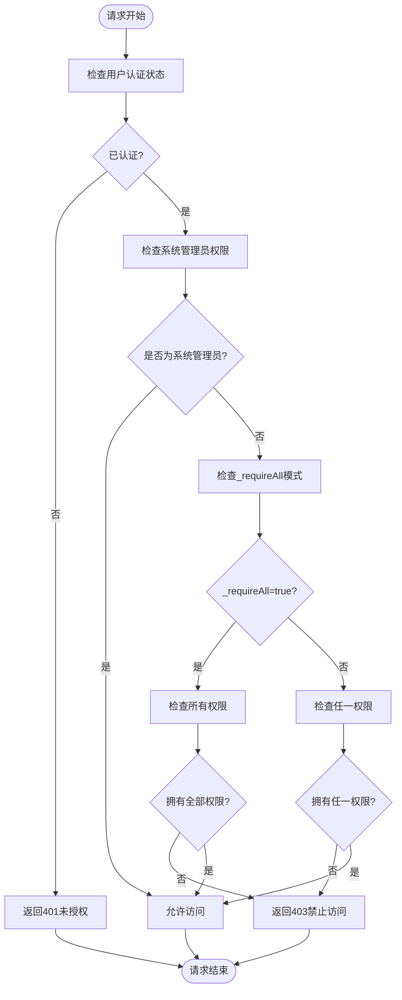
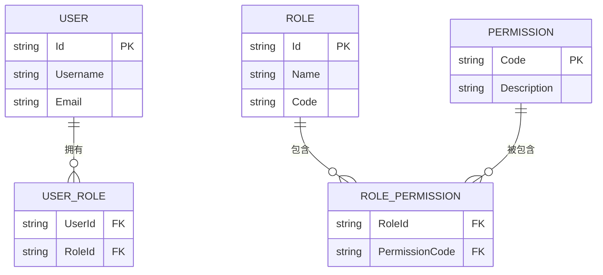
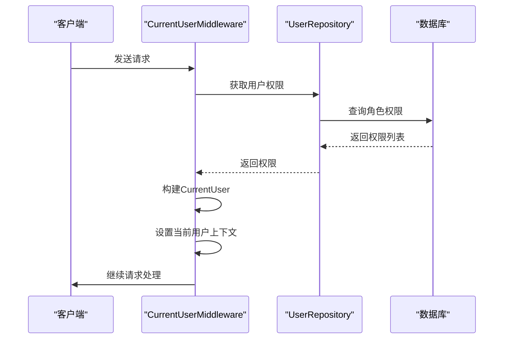

# 授权控制

<cite>
**本文档引用的文件**
- [RequirePermissionAttribute.cs](file://Backend/Hrevolve.Web/Filters/RequirePermissionAttribute.cs)
- [ICurrentUser.cs](file://Backend/Hrevolve.Shared/Identity/ICurrentUser.cs)
- [CurrentUserMiddleware.cs](file://Backend/Hrevolve.Web/Middleware/CurrentUserMiddleware.cs)
- [Role.cs](file://Backend/Hrevolve.Domain/Identity/Role.cs)
- [EmployeesController.cs](file://Backend/Hrevolve.Web/Controllers/EmployeesController.cs)
- [UserRepository.cs](file://Backend/Hrevolve.Infrastructure/Persistence/Repositories/UserRepository.cs)
- [Program.cs](file://Backend/Hrevolve.Web/Program.cs)
</cite>

## 目录
1. [介绍](#介绍)
2. [核心组件](#核心组件)
3. [权限检查流程](#权限检查流程)
4. [权限粒度设计](#权限粒度设计)
5. [前后端权限同步](#前后端权限同步)
6. [性能优化建议](#性能优化建议)
7. [结论](#结论)

## 介绍
本系统实现了基于RBAC（基于角色的访问控制）的接口级权限控制系统，通过`RequirePermissionAttribute`特性实现细粒度的权限验证。该系统支持单权限或组合权限的灵活配置，为不同业务模块提供精确的访问控制。

## 核心组件

`RequirePermissionAttribute`是本系统权限控制的核心组件，实现了`IAuthorizationFilter`接口，在请求管道中拦截并验证用户权限。该特性支持两种构造函数重载：一种接受单个或多个权限字符串，另一种额外接受`requireAll`参数来指定是否需要满足所有权限。

权限验证过程中，系统首先检查用户认证状态，未认证用户将收到401未授权响应。系统管理员（拥有`system:admin`权限的用户）自动豁免所有权限检查。对于普通用户，根据`_requireAll`标志决定权限检查逻辑：当为true时需满足所有指定权限，为false时只需满足任一权限。

当权限不足时，系统返回标准化的403 Forbidden响应，包含错误代码"FORBIDDEN"和消息"权限不足"。

**核心组件来源**
- [RequirePermissionAttribute.cs](file://Backend/Hrevolve.Web/Filters/RequirePermissionAttribute.cs#L1-L79)
- [ICurrentUser.cs](file://Backend/Hrevolve.Shared/Identity/ICurrentUser.cs#L1-L114)

## 权限检查流程

**流程图来源**
- [RequirePermissionAttribute.cs](file://Backend/Hrevolve.Web/Filters/RequirePermissionAttribute.cs#L33-L78)
- [CurrentUserMiddleware.cs](file://Backend/Hrevolve.Web/Middleware/CurrentUserMiddleware.cs#L9-L25)

## 权限粒度设计

系统采用模块化权限设计原则，权限代码遵循`模块名:操作类型`的命名规范。主要权限模块包括：

- 员工管理：`employee:read`, `employee:write`, `employee:delete`
- 组织管理：`organization:read`, `organization:write`
- 考勤管理：`attendance:read`, `attendance:write`, `attendance:approve`
- 假期管理：`leave:read`, `leave:write`, `leave:approve`
- 薪酬管理：`payroll:read`, `payroll:write`, `payroll:approve`
- 报销管理：`expense:read`, `expense:write`, `expense:approve`

这种设计实现了最小权限原则，确保用户只能访问其工作职责所需的资源。例如，普通HR人员可能拥有`employee:read`和`employee:write`权限，但不具有`employee:delete`权限；而审批人员则拥有`leave:approve`等审批权限。

**权限设计来源**
- [Role.cs](file://Backend/Hrevolve.Domain/Identity/Role.cs#L89-L123)
- [EmployeesController.cs](file://Backend/Hrevolve.Web/Controllers/EmployeesController.cs#L16-L53)

## 前后端权限同步

系统实现了前后端权限的统一管理，确保用户界面与API访问权限的一致性。前端通过相同的权限代码控制菜单和功能按钮的显示，与后端API权限保持同步。

在前端实现中，菜单项配置包含`permission`属性，与后端权限代码对应。例如，设置菜单需要`settings:read`权限，薪酬模块需要`payroll:read`权限。前端通过计算属性过滤用户有权访问的菜单项，确保用户只能看到其有权限访问的功能。

这种设计避免了权限不一致的问题，即使用户通过URL直接访问受限页面，后端的`RequirePermissionAttribute`也会进行最终的权限验证，提供双重安全保障。

**前后端同步来源**
- [MainLayout.vue](file://Frontend/hrevolve-web/src/layouts/MainLayout.vue#L173-L184)
- [RolesView.vue](file://Frontend/hrevolve-web/src/views/settings/RolesView.vue#L94-L100)

## 性能优化建议

系统在权限管理方面采用了多项性能优化措施：

1. **权限缓存**：用户权限在登录时从数据库加载，并存储在JWT令牌中，避免每次请求都查询数据库。
2. **高效查询**：`UserRepository.GetPermissionsAsync`方法使用单次数据库查询获取用户所有权限，通过角色关联关系一次性加载。
3. **内存访问**：权限检查在内存中进行，`CurrentUser.HasPermission`方法直接在权限列表中进行Contains检查。
4. **异步本地存储**：`CurrentUserAccessor`使用`AsyncLocal`确保用户上下文在异步操作中的正确传递，避免线程安全问题。

这些优化确保了权限检查的高性能，即使在高并发场景下也能快速完成权限验证。

**性能优化来源**
- [UserRepository.cs](file://Backend/Hrevolve.Infrastructure/Persistence/Repositories/UserRepository.cs#L13-L67)
- [CurrentUserMiddleware.cs](file://Backend/Hrevolve.Web/Middleware/CurrentUserMiddleware.cs#L13-L57)
- [ICurrentUser.cs](file://Backend/Hrevolve.Shared/Identity/ICurrentUser.cs#L81-L82)

## 结论
本系统通过`RequirePermissionAttribute`实现了灵活、安全的接口级权限控制。系统支持单权限和组合权限的配置，为不同业务场景提供精确的访问控制。权限检查流程清晰，包含认证检查、管理员豁免和权限验证三个阶段。通过前后端权限代码的统一管理，确保了用户体验的一致性。性能优化措施保证了权限检查的高效性，为系统的稳定运行提供了保障。