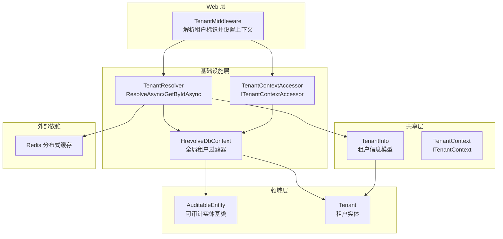
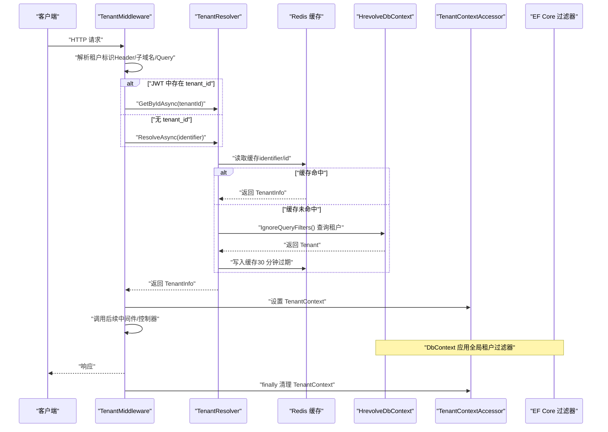
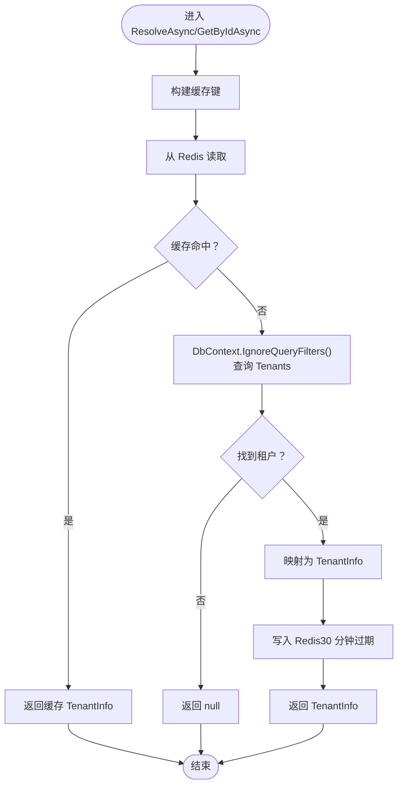
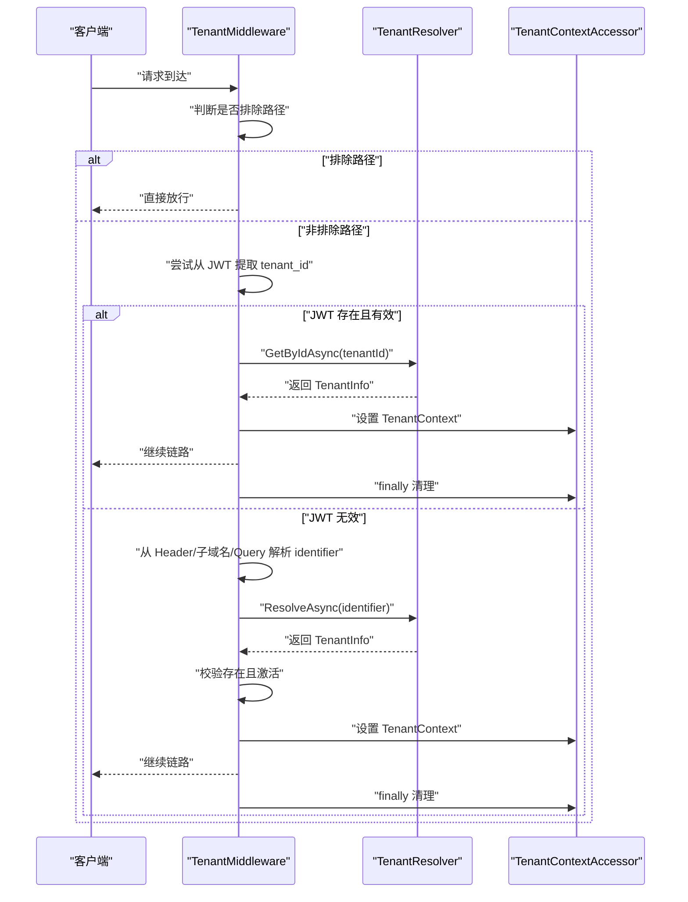
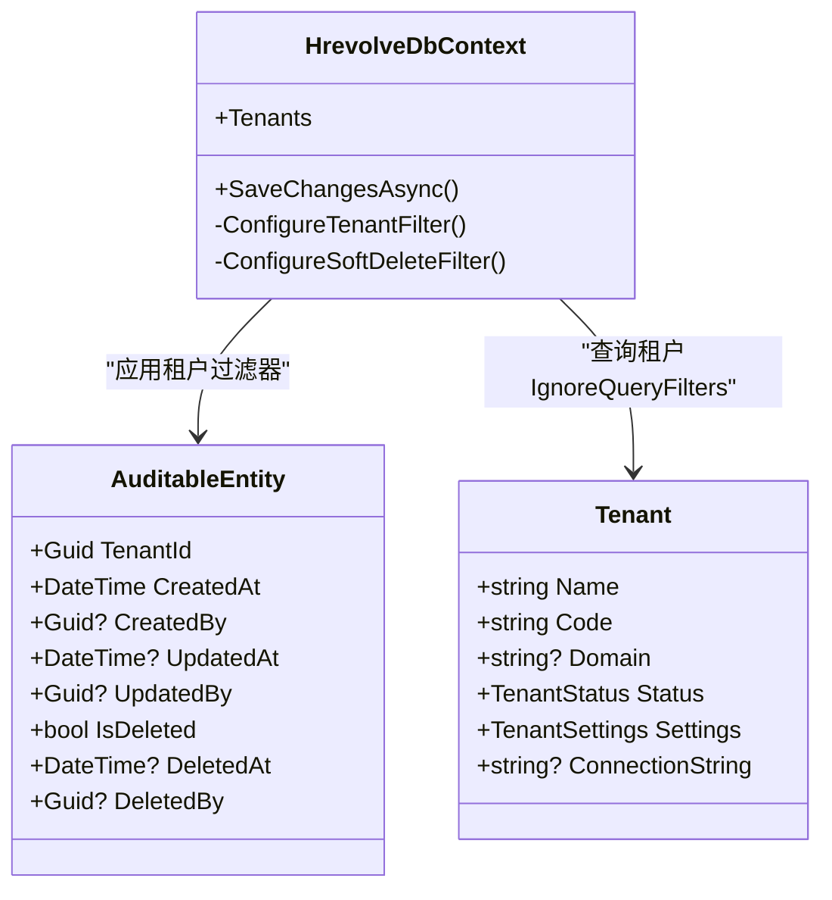
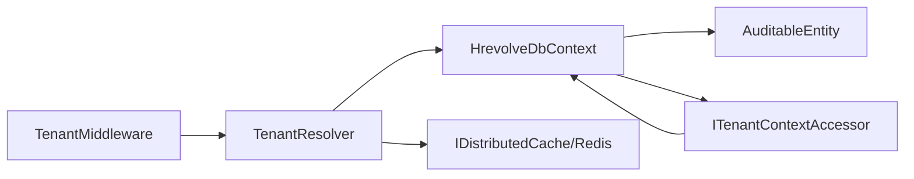

# 数据隔离

<cite>
**本文引用的文件**
- [Backend/Hrevolve.Infrastructure/MultiTenancy/TenantResolver.cs](file://Backend/Hrevolve.Infrastructure/MultiTenancy/TenantResolver.cs)
- [Backend/Hrevolve.Shared/MultiTenancy/TenantInfo.cs](file://Backend/Hrevolve.Shared/MultiTenancy/TenantInfo.cs)
- [Backend/Hrevolve.Web/Middleware/TenantMiddleware.cs](file://Backend/Hrevolve.Web/Middleware/TenantMiddleware.cs)
- [Backend/Hrevolve.Infrastructure/Persistence/HrevolveDbContext.cs](file://Backend/Hrevolve.Infrastructure/Persistence/HrevolveDbContext.cs)
- [Backend/Hrevolve.Shared/MultiTenancy/ITenantContext.cs](file://Backend/Hrevolve.Shared/MultiTenancy/ITenantContext.cs)
- [Backend/Hrevolve.Infrastructure/DependencyInjection.cs](file://Backend/Hrevolve.Infrastructure/DependencyInjection.cs)
- [Backend/Hrevolve.Shared/Exceptions/HrevolveException.cs](file://Backend/Hrevolve.Shared/Exceptions/HrevolveException.cs)
- [Backend/Hrevolve.Domain/Common/AuditableEntity.cs](file://Backend/Hrevolve.Domain/Common/AuditableEntity.cs)
- [Backend/Hrevolve.Domain/Tenants/Tenant.cs](file://Backend/Hrevolve.Domain/Tenants/Tenant.cs)
</cite>

## 目录
1. [简介](#简介)
2. [项目结构](#项目结构)
3. [核心组件](#核心组件)
4. [架构总览](#架构总览)
5. [详细组件分析](#详细组件分析)
6. [依赖关系分析](#依赖关系分析)
7. [性能考量](#性能考量)
8. [故障排查指南](#故障排查指南)
9. [结论](#结论)

## 简介
本文件围绕 Hrevolve 多租户架构下的数据隔离机制展开，重点阐述 TenantResolver 的核心职责：通过 ResolveAsync 和 GetByIdAsync 方法，基于域名或租户代码解析 TenantInfo；结合 Redis 分布式缓存（30 分钟过期）提升性能；在查询租户信息时使用 IgnoreQueryFilters() 绕过全局租户过滤器以避免递归过滤；明确租户解析流程（先缓存、未命中再查数据库、成功后回填缓存）；强调 TenantInfo 对象承载连接字符串、区域设置及安全策略（MFA、SSO 启用状态），为后续请求上下文提供依据；说明该机制与中间件协同工作，在请求开始时确定当前租户，确保所有数据操作限定在租户边界内，从根本上防止跨租户数据访问。

## 项目结构
- 多租户解析与上下文
  - 解析器：Backend/Hrevolve.Infrastructure/MultiTenancy/TenantResolver.cs
  - 上下文接口与实现：Backend/Hrevolve.Shared/MultiTenancy/ITenantContext.cs
  - 租户信息模型：Backend/Hrevolve.Shared/MultiTenancy/TenantInfo.cs
- Web 层中间件
  - 租户中间件：Backend/Hrevolve.Web/Middleware/TenantMiddleware.cs
- 数据层与全局过滤
  - DbContext 与全局过滤器：Backend/Hrevolve.Infrastructure/Persistence/HrevolveDbContext.cs
  - 可审计实体基类：Backend/Hrevolve.Domain/Common/AuditableEntity.cs
  - 租户实体：Backend/Hrevolve.Domain/Tenants/Tenant.cs
- 依赖注入与缓存
  - 基础设施 DI：Backend/Hrevolve.Infrastructure/DependencyInjection.cs
- 异常体系
  - 租户异常：Backend/Hrevolve.Shared/Exceptions/HrevolveException.cs

图表来源
- [Backend/Hrevolve.Web/Middleware/TenantMiddleware.cs](file://Backend/Hrevolve.Web/Middleware/TenantMiddleware.cs#L1-L133)
- [Backend/Hrevolve.Infrastructure/MultiTenancy/TenantResolver.cs](file://Backend/Hrevolve.Infrastructure/MultiTenancy/TenantResolver.cs#L1-L108)
- [Backend/Hrevolve.Infrastructure/Persistence/HrevolveDbContext.cs](file://Backend/Hrevolve.Infrastructure/Persistence/HrevolveDbContext.cs#L63-L119)
- [Backend/Hrevolve.Shared/MultiTenancy/ITenantContext.cs](file://Backend/Hrevolve.Shared/MultiTenancy/ITenantContext.cs#L1-L81)
- [Backend/Hrevolve.Shared/MultiTenancy/TenantInfo.cs](file://Backend/Hrevolve.Shared/MultiTenancy/TenantInfo.cs#L1-L45)
- [Backend/Hrevolve.Domain/Common/AuditableEntity.cs](file://Backend/Hrevolve.Domain/Common/AuditableEntity.cs#L1-L47)
- [Backend/Hrevolve.Domain/Tenants/Tenant.cs](file://Backend/Hrevolve.Domain/Tenants/Tenant.cs#L1-L66)

章节来源
- [Backend/Hrevolve.Web/Middleware/TenantMiddleware.cs](file://Backend/Hrevolve.Web/Middleware/TenantMiddleware.cs#L1-L133)
- [Backend/Hrevolve.Infrastructure/MultiTenancy/TenantResolver.cs](file://Backend/Hrevolve.Infrastructure/MultiTenancy/TenantResolver.cs#L1-L108)
- [Backend/Hrevolve.Infrastructure/Persistence/HrevolveDbContext.cs](file://Backend/Hrevolve.Infrastructure/Persistence/HrevolveDbContext.cs#L63-L119)
- [Backend/Hrevolve.Shared/MultiTenancy/ITenantContext.cs](file://Backend/Hrevolve.Shared/MultiTenancy/ITenantContext.cs#L1-L81)
- [Backend/Hrevolve.Shared/MultiTenancy/TenantInfo.cs](file://Backend/Hrevolve.Shared/MultiTenancy/TenantInfo.cs#L1-L45)
- [Backend/Hrevolve.Domain/Common/AuditableEntity.cs](file://Backend/Hrevolve.Domain/Common/AuditableEntity.cs#L1-L47)
- [Backend/Hrevolve.Domain/Tenants/Tenant.cs](file://Backend/Hrevolve.Domain/Tenants/Tenant.cs#L1-L66)

## 核心组件
- TenantResolver
  - 职责：根据标识（域名或代码）或租户 ID 解析 TenantInfo；优先读取 Redis 缓存，未命中则查询数据库；成功后回填缓存，过期时间为 30 分钟。
  - 关键点：使用 IgnoreQueryFilters() 绕过全局租户过滤器，避免递归过滤导致无法查询到租户元数据。
- TenantMiddleware
  - 职责：在请求开始时解析租户标识（Header、子域名、Query 参数优先级），若用户已认证则优先从 JWT 中提取租户 ID；设置 ITenantContextAccessor 的 TenantContext；在 finally 中清理上下文。
- HrevolveDbContext
  - 职责：为所有继承自 AuditableEntity 的实体应用全局租户过滤器；在 SaveChangesAsync 中自动填充 TenantId。
- TenantContextAccessor / TenantContext
  - 职责：通过 AsyncLocal 存储当前请求的租户上下文，确保线程内隔离且在请求结束后清理。
- TenantInfo
  - 职责：承载租户关键配置（Id、Code、Domain、ConnectionString、Settings、IsActive），为后续请求上下文与业务逻辑提供依据。

章节来源
- [Backend/Hrevolve.Infrastructure/MultiTenancy/TenantResolver.cs](file://Backend/Hrevolve.Infrastructure/MultiTenancy/TenantResolver.cs#L1-L108)
- [Backend/Hrevolve.Web/Middleware/TenantMiddleware.cs](file://Backend/Hrevolve.Web/Middleware/TenantMiddleware.cs#L1-L133)
- [Backend/Hrevolve.Infrastructure/Persistence/HrevolveDbContext.cs](file://Backend/Hrevolve.Infrastructure/Persistence/HrevolveDbContext.cs#L63-L119)
- [Backend/Hrevolve.Shared/MultiTenancy/ITenantContext.cs](file://Backend/Hrevolve.Shared/MultiTenancy/ITenantContext.cs#L1-L81)
- [Backend/Hrevolve.Shared/MultiTenancy/TenantInfo.cs](file://Backend/Hrevolve.Shared/MultiTenancy/TenantInfo.cs#L1-L45)

## 架构总览
下图展示了从请求进入 Web 层，到中间件解析租户、解析器缓存与数据库交互、DbContext 应用全局过滤的整体流程。

图表来源
- [Backend/Hrevolve.Web/Middleware/TenantMiddleware.cs](file://Backend/Hrevolve.Web/Middleware/TenantMiddleware.cs#L1-L133)
- [Backend/Hrevolve.Infrastructure/MultiTenancy/TenantResolver.cs](file://Backend/Hrevolve.Infrastructure/MultiTenancy/TenantResolver.cs#L1-L108)
- [Backend/Hrevolve.Infrastructure/Persistence/HrevolveDbContext.cs](file://Backend/Hrevolve.Infrastructure/Persistence/HrevolveDbContext.cs#L63-L119)

## 详细组件分析

### TenantResolver：租户解析与缓存策略
- ResolveAsync
  - 先按“identifier”构造缓存键，尝试从 Redis 读取；命中则直接返回。
  - 未命中时，使用 IgnoreQueryFilters() 查询 Tenants，匹配 Code 或 Domain；成功后映射为 TenantInfo，并写入 Redis，绝对过期时间 30 分钟。
- GetByIdAsync
  - 先按“id”构造缓存键，尝试从 Redis 读取；未命中则使用 IgnoreQueryFilters() 查询 Tenants，成功后映射并回填缓存。
- 缓存键设计
  - 前缀统一为“tenant:”，区分“identifier”和“id”两种场景，便于后续运维与清理。
- 忽略全局过滤的必要性
  - 因为租户元数据查询本身属于“跨租户”场景，若受全局租户过滤器影响，将无法正确解析目标租户，从而导致递归过滤问题。使用 IgnoreQueryFilters() 显式绕过，确保能读取到租户记录。

图表来源
- [Backend/Hrevolve.Infrastructure/MultiTenancy/TenantResolver.cs](file://Backend/Hrevolve.Infrastructure/MultiTenancy/TenantResolver.cs#L1-L108)

章节来源
- [Backend/Hrevolve.Infrastructure/MultiTenancy/TenantResolver.cs](file://Backend/Hrevolve.Infrastructure/MultiTenancy/TenantResolver.cs#L1-L108)

### TenantMiddleware：请求级租户上下文确定
- 路径排除
  - 对健康检查、Swagger、认证相关接口等路径不进行租户解析，直接放行。
- 租户标识解析优先级
  - Header：X-Tenant-Id
  - Host 子域名：tenant.example.com 的子域即为租户标识
  - Query 参数：tenant=xxx
- 认证用户优先
  - 若 JWT 中存在 tenant_id，则直接调用 GetByIdAsync 获取 TenantInfo；若租户有效且激活，设置 TenantContext 并继续链路，finally 中清理。
- 未认证用户
  - 从请求解析租户标识，调用 ResolveAsync；校验租户存在且激活后设置 TenantContext；finally 中清理。
- 异常处理
  - 无法识别租户、租户不存在、租户被禁用时抛出 TenantException。

图表来源
- [Backend/Hrevolve.Web/Middleware/TenantMiddleware.cs](file://Backend/Hrevolve.Web/Middleware/TenantMiddleware.cs#L1-L133)

章节来源
- [Backend/Hrevolve.Web/Middleware/TenantMiddleware.cs](file://Backend/Hrevolve.Web/Middleware/TenantMiddleware.cs#L1-L133)
- [Backend/Hrevolve.Shared/Exceptions/HrevolveException.cs](file://Backend/Hrevolve.Shared/Exceptions/HrevolveException.cs#L92-L102)

### DbContext 全局租户过滤器与 SaveChanges
- 全局过滤器
  - 对所有继承自 AuditableEntity 的实体应用租户过滤器，仅返回当前 TenantContext.TenantId 匹配的数据。
- 保存时填充
  - 在 SaveChangesAsync 中，对新增实体自动填充 TenantId（若当前上下文存在且实体未显式赋值）、创建时间与创建人；删除操作改为软删除。
- 忽略过滤器的场景
  - 在 TenantResolver 的租户查询中使用 IgnoreQueryFilters()，确保能读取到租户元数据，避免递归过滤。

图表来源
- [Backend/Hrevolve.Infrastructure/Persistence/HrevolveDbContext.cs](file://Backend/Hrevolve.Infrastructure/Persistence/HrevolveDbContext.cs#L63-L119)
- [Backend/Hrevolve.Domain/Common/AuditableEntity.cs](file://Backend/Hrevolve.Domain/Common/AuditableEntity.cs#L1-L47)
- [Backend/Hrevolve.Domain/Tenants/Tenant.cs](file://Backend/Hrevolve.Domain/Tenants/Tenant.cs#L1-L66)

章节来源
- [Backend/Hrevolve.Infrastructure/Persistence/HrevolveDbContext.cs](file://Backend/Hrevolve.Infrastructure/Persistence/HrevolveDbContext.cs#L63-L119)
- [Backend/Hrevolve.Domain/Common/AuditableEntity.cs](file://Backend/Hrevolve.Domain/Common/AuditableEntity.cs#L1-L47)
- [Backend/Hrevolve.Domain/Tenants/Tenant.cs](file://Backend/Hrevolve.Domain/Tenants/Tenant.cs#L1-L66)

### TenantInfo：租户配置载体
- 字段说明
  - Id、Name、Code、Domain、ConnectionString、IsActive
  - Settings：Timezone、Locale、Currency、MaxEmployees、EnableMfa、EnableSso
- 用途
  - 作为缓存对象与上下文传递载体，支撑后续请求中的区域化与安全策略决策。

章节来源
- [Backend/Hrevolve.Shared/MultiTenancy/TenantInfo.cs](file://Backend/Hrevolve.Shared/MultiTenancy/TenantInfo.cs#L1-L45)
- [Backend/Hrevolve.Domain/Tenants/Tenant.cs](file://Backend/Hrevolve.Domain/Tenants/Tenant.cs#L1-L66)

### 依赖注入与缓存配置
- 依赖注入
  - 注册 ITenantContextAccessor、ITenantResolver、Redis 缓存、DbContext 等。
- Redis 缓存
  - 使用 StackExchange.Redis，实例名前缀为“Hrevolve:”。

章节来源
- [Backend/Hrevolve.Infrastructure/DependencyInjection.cs](file://Backend/Hrevolve.Infrastructure/DependencyInjection.cs#L1-L58)

## 依赖关系分析
- 组件耦合
  - TenantMiddleware 依赖 ITenantResolver 与 ITenantContextAccessor。
  - TenantResolver 依赖 HrevolveDbContext 与 IDistributedCache。
  - HrevolveDbContext 依赖 ITenantContextAccessor 与 ICurrentUserAccessor，并对所有 AuditableEntity 应用租户过滤器。
- 外部依赖
  - Redis 作为分布式缓存，TenantResolver 通过 IDistributedCache 读写。
  - PostgreSQL 作为主数据库，由 DbContext 管理连接字符串与迁移。

图表来源
- [Backend/Hrevolve.Web/Middleware/TenantMiddleware.cs](file://Backend/Hrevolve.Web/Middleware/TenantMiddleware.cs#L1-L133)
- [Backend/Hrevolve.Infrastructure/MultiTenancy/TenantResolver.cs](file://Backend/Hrevolve.Infrastructure/MultiTenancy/TenantResolver.cs#L1-L108)
- [Backend/Hrevolve.Infrastructure/Persistence/HrevolveDbContext.cs](file://Backend/Hrevolve.Infrastructure/Persistence/HrevolveDbContext.cs#L63-L119)
- [Backend/Hrevolve.Shared/MultiTenancy/ITenantContext.cs](file://Backend/Hrevolve.Shared/MultiTenancy/ITenantContext.cs#L1-L81)

章节来源
- [Backend/Hrevolve.Web/Middleware/TenantMiddleware.cs](file://Backend/Hrevolve.Web/Middleware/TenantMiddleware.cs#L1-L133)
- [Backend/Hrevolve.Infrastructure/MultiTenancy/TenantResolver.cs](file://Backend/Hrevolve.Infrastructure/MultiTenancy/TenantResolver.cs#L1-L108)
- [Backend/Hrevolve.Infrastructure/Persistence/HrevolveDbContext.cs](file://Backend/Hrevolve.Infrastructure/Persistence/HrevolveDbContext.cs#L63-L119)
- [Backend/Hrevolve.Shared/MultiTenancy/ITenantContext.cs](file://Backend/Hrevolve.Shared/MultiTenancy/ITenantContext.cs#L1-L81)

## 性能考量
- 缓存命中率
  - 通过 30 分钟绝对过期策略平衡一致性与性能；建议监控缓存命中率与延迟，必要时调整过期时间或增加缓存键命名规范。
- 查询路径优化
  - ResolveAsync/GetByIdAsync 优先走缓存；未命中时使用 IgnoreQueryFilters() 直接查询 Tenants，避免额外筛选开销。
- DbContext 过滤器
  - 全局租户过滤器仅对业务实体生效，不影响租户元数据查询；SaveChangesAsync 自动填充字段减少重复逻辑。
- 并发与线程安全
  - TenantContextAccessor 使用 AsyncLocal，天然支持并发请求隔离；中间件在 finally 中清理上下文，避免线程复用导致的数据污染。

[本节为通用性能建议，无需特定文件引用]

## 故障排查指南
- 常见错误与定位
  - 无法识别租户：检查 TenantMiddleware 的租户标识解析顺序（Header、子域名、Query）是否符合预期。
  - 租户不存在或被禁用：TenantMiddleware 在 ResolveAsync/GetByIdAsync 返回空或租户非激活时抛出 TenantException。
  - 缓存异常：确认 Redis 连接字符串与实例名配置正确；检查缓存键格式与过期策略。
  - 递归过滤问题：确保 TenantResolver 的租户查询始终使用 IgnoreQueryFilters()。
- 日志与诊断
  - TenantMiddleware 记录 JWT 中 tenant_id、解析到的租户标识、设置/清理上下文的日志，便于定位问题。
- 修复建议
  - 若出现跨租户数据泄露迹象，优先检查 DbContext 的全局过滤器是否正确应用，以及 TenantContext 是否在请求生命周期内正确设置与清理。

章节来源
- [Backend/Hrevolve.Web/Middleware/TenantMiddleware.cs](file://Backend/Hrevolve.Web/Middleware/TenantMiddleware.cs#L1-L133)
- [Backend/Hrevolve.Shared/Exceptions/HrevolveException.cs](file://Backend/Hrevolve.Shared/Exceptions/HrevolveException.cs#L92-L102)
- [Backend/Hrevolve.Infrastructure/MultiTenancy/TenantResolver.cs](file://Backend/Hrevolve.Infrastructure/MultiTenancy/TenantResolver.cs#L1-L108)
- [Backend/Hrevolve.Infrastructure/Persistence/HrevolveDbContext.cs](file://Backend/Hrevolve.Infrastructure/Persistence/HrevolveDbContext.cs#L63-L119)

## 结论
Hrevolve 的多租户数据隔离机制以 TenantResolver 为核心，结合 TenantMiddleware 在请求入口确定当前租户上下文，通过 Redis 缓存显著降低租户查询成本；DbContext 的全局租户过滤器确保所有业务实体默认受限于当前租户边界。TenantResolver 在查询租户元数据时使用 IgnoreQueryFilters() 绕过全局过滤，避免递归过滤导致的查询失败。TenantInfo 承载连接字符串、区域设置与安全策略，为后续请求上下文与业务逻辑提供基础。整体设计在保证数据安全的同时兼顾性能与可维护性。