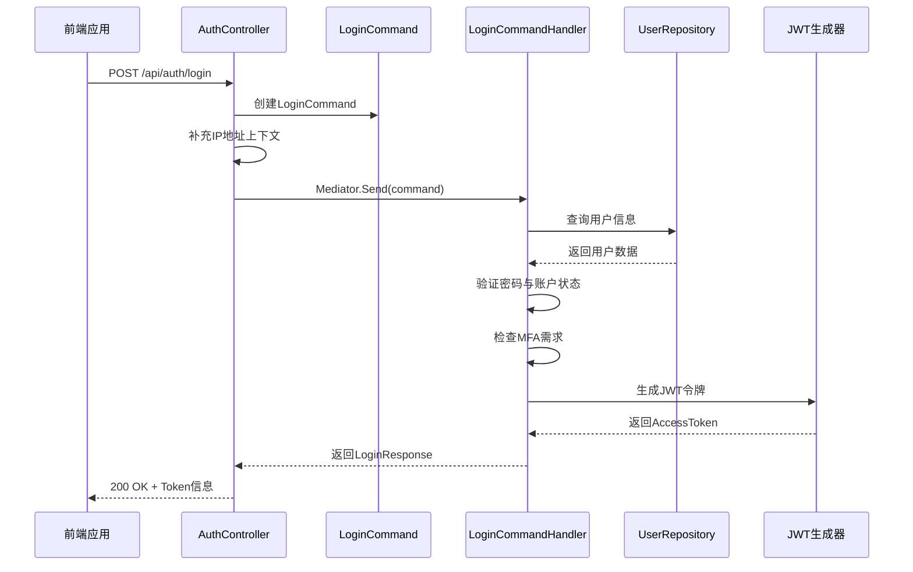
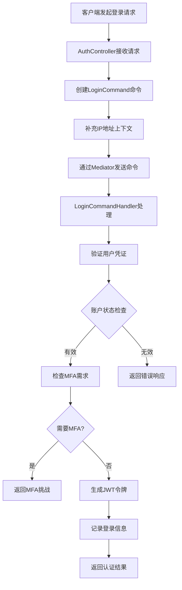
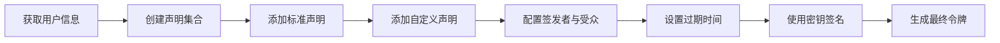
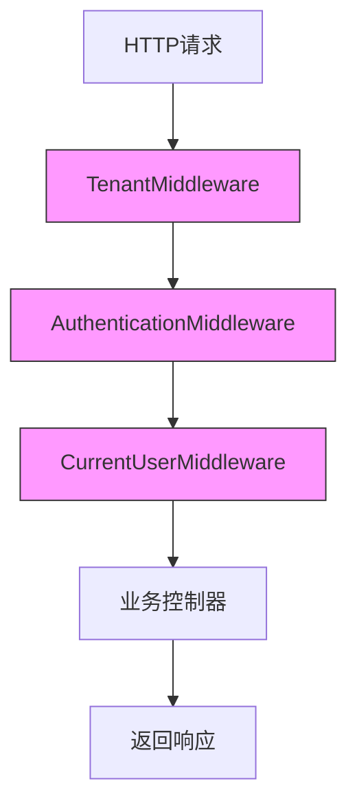
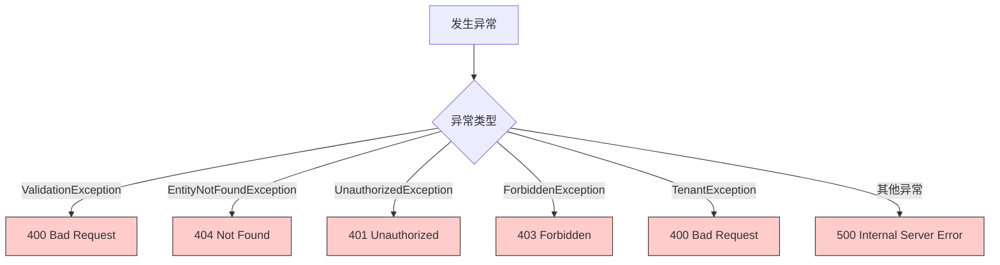

# 身份认证

<cite>
**本文档中引用的文件**  
- [AuthController.cs](file://Backend/Hrevolve.Web/Controllers/AuthController.cs)
- [LoginCommand.cs](file://Backend/Hrevolve.Application/Identity/Commands/LoginCommand.cs)
- [Program.cs](file://Backend/Hrevolve.Web/Program.cs)
- [CurrentUserMiddleware.cs](file://Backend/Hrevolve.Web/Middleware/CurrentUserMiddleware.cs)
- [TenantMiddleware.cs](file://Backend/Hrevolve.Web/Middleware/TenantMiddleware.cs)
- [ICurrentUser.cs](file://Backend/Hrevolve.Shared/Identity/ICurrentUser.cs)
- [appsettings.json](file://Backend/Hrevolve.Web/appsettings.json)
- [auth.ts](file://Frontend/hrevolve-web/src/api/modules/auth.ts)
- [auth.ts](file://Frontend/hrevolve-web/src/stores/auth.ts)
- [Hrevolve.drawio](file://Design/Hrevolve.drawio)
- [HrevolveException.cs](file://Backend/Hrevolve.Shared/Exceptions/HrevolveException.cs)
- [ExceptionHandlingMiddleware.cs](file://Backend/Hrevolve.Web/Middleware/ExceptionHandlingMiddleware.cs)
- [20251227093819_InitialCreate.cs](file://Backend/Hrevolve.Infrastructure/Migrations/20251227093819_InitialCreate.cs)
</cite>

## 目录
1. [简介](#简介)
2. [认证流程概览](#认证流程概览)
3. [登录流程分析](#登录流程分析)
4. [JWT令牌生成与验证](#jwt令牌生成与验证)
5. [Token刷新与登出机制](#token刷新与登出机制)
6. [当前用户信息提取](#当前用户信息提取)
7. [多因素认证与单点登录扩展设计](#多因素认证与单点登录扩展设计)
8. [安全最佳实践](#安全最佳实践)
9. [异常处理与错误响应](#异常处理与错误响应)

## 简介
Hrevolve系统采用基于JWT的现代化身份认证机制，结合CQRS模式实现高内聚、低耦合的认证逻辑。系统支持多租户架构，通过中间件链式处理请求，确保安全性与可扩展性。本文档详细解析系统的身份认证核心机制，涵盖从用户登录到权限验证的完整流程。

## 认证流程概览
Hrevolve系统的身份认证流程采用分层架构设计，从前端请求到后端处理形成完整的闭环。整个流程涉及控制器、命令处理器、中间件和共享组件等多个层次。



**图示来源**
- [AuthController.cs](file://Backend/Hrevolve.Web/Controllers/AuthController.cs#L16-L32)
- [LoginCommand.cs](file://Backend/Hrevolve.Application/Identity/Commands/LoginCommand.cs#L51-L119)
- [auth.ts](file://Frontend/hrevolve-web/src/api/modules/auth.ts#L7-L9)

## 登录流程分析
Hrevolve系统的登录流程采用CQRS模式，将查询与命令分离，确保业务逻辑的清晰性和可维护性。`LoginCommand`作为命令对象，封装了用户凭证和上下文信息。

### CQRS模式下的认证逻辑
登录流程通过`LoginCommand`实现命令-处理分离模式。控制器接收请求后创建命令对象，并通过Mediator模式分发给对应的处理器。



**图示来源**
- [AuthController.cs](file://Backend/Hrevolve.Web/Controllers/AuthController.cs#L16-L32)
- [LoginCommand.cs](file://Backend/Hrevolve.Application/Identity/Commands/LoginCommand.cs#L51-L119)

### 上下文信息补充
系统在认证过程中会自动补充客户端IP地址等上下文信息，增强安全审计能力。`AuthController`通过`HttpContext.Connection.RemoteIpAddress`获取客户端IP并注入到命令中。

```csharp
var enrichedCommand = command with
{
    IpAddress = HttpContext.Connection.RemoteIpAddress?.ToString()
};
```

这种设计模式使得核心业务逻辑无需关心上下文获取细节，保持了职责单一性原则。

**节段来源**
- [AuthController.cs](file://Backend/Hrevolve.Web/Controllers/AuthController.cs#L19-L22)

## JWT令牌生成与验证
Hrevolve系统采用JWT（JSON Web Token）作为主要的身份认证令牌，通过标准的OAuth 2.0流程实现安全的无状态认证。

### JWT令牌结构规范
系统生成的JWT令牌包含标准声明和自定义声明，确保身份信息的完整性和安全性。

| 声明类型 | 字段名 | 说明 | 示例值 |
|---------|-------|------|-------|
| 标准声明 | sub | 用户唯一标识 | "a1b2c3d4-e5f6-7890-1234-567890abcdef" |
| 标准声明 | email | 用户邮箱 | "user@company.com" |
| 标准声明 | jti | 令牌唯一标识 | "f1e2d3c4-b5a6-7890-1234-567890abcdef" |
| 自定义声明 | tenant_id | 租户唯一标识 | "t1b2c3d4-e5f6-7890-1234-567890abcdef" |
| 自定义声明 | username | 用户名 | "john_doe" |
| 自定义声明 | employee_id | 员工ID | "e1b2c3d4-e5f6-7890-1234-567890abcdef" |
| 自定义声明 | permission | 权限列表 | ["user.read", "user.write"] |

**节段来源**
- [LoginCommand.cs](file://Backend/Hrevolve.Application/Identity/Commands/LoginCommand.cs#L136-L152)

### 令牌生成过程
JWT令牌的生成过程严格遵循安全最佳实践，使用HMAC-SHA256算法进行签名，确保令牌的完整性和防篡改性。



**图示来源**
- [LoginCommand.cs](file://Backend/Hrevolve.Application/Identity/Commands/LoginCommand.cs#L128-L161)

### 令牌验证配置
系统在`Program.cs`中配置了严格的JWT验证参数，确保只有合法的令牌才能通过验证。

```csharp
builder.Services.AddAuthentication(JwtBearerDefaults.AuthenticationScheme)
    .AddJwtBearer(options =>
    {
        options.TokenValidationParameters = new TokenValidationParameters
        {
            ValidateIssuer = true,
            ValidateAudience = true,
            ValidateLifetime = true,
            ValidateIssuerSigningKey = true,
            ValidIssuer = jwtSettings["Issuer"],
            ValidAudience = jwtSettings["Audience"],
            IssuerSigningKey = new SymmetricSecurityKey(Encoding.UTF8.GetBytes(jwtSettings["Key"]!)),
            ClockSkew = TimeSpan.Zero
        };
    });
```

这些配置确保了：
- 令牌必须由指定的签发者（Issuer）签发
- 令牌必须面向指定的受众（Audience）
- 令牌必须在有效期内
- 令牌的签名必须使用正确的密钥验证

**节段来源**
- [Program.cs](file://Backend/Hrevolve.Web/Program.cs#L72-L85)

## Token刷新与登出机制
Hrevolve系统实现了完整的Token生命周期管理，包括刷新和登出功能，确保系统的安全性和用户体验。

### Token刷新流程
虽然当前版本的`RefreshToken`功能尚未完全实现，但系统已预留了相应的接口和数据结构。

```csharp
public record RefreshTokenRequest(string RefreshToken);

[HttpPost("refresh")]
[AllowAnonymous]
public async Task<IActionResult> RefreshToken([FromBody] RefreshTokenRequest request, CancellationToken cancellationToken)
{
    // TODO: 实现Token刷新逻辑
    return Ok(new { message = "Token刷新功能待实现" });
}
```

前端已实现相应的刷新逻辑，通过`refreshAccessToken`方法定期刷新访问令牌。

```typescript
const refreshAccessToken = async (): Promise<boolean> => {
    if (!refreshToken.value) return false;
    
    try {
        const response = await authApi.refreshToken(refreshToken.value);
        token.value = response.data.accessToken;
        refreshToken.value = response.data.refreshToken;
        
        localStorage.setItem('token', response.data.accessToken);
        localStorage.setItem('refreshToken', response.data.refreshToken);
        
        return true;
    } catch {
        logout();
        return false;
    }
};
```

**节段来源**
- [AuthController.cs](file://Backend/Hrevolve.Web/Controllers/AuthController.cs#L37-L43)
- [auth.ts](file://Frontend/hrevolve-web/src/stores/auth.ts#L70-L85)

### 登出机制
登出功能同样处于待实现状态，但接口设计已完成。

```csharp
[HttpPost("logout")]
[Authorize]
public async Task<IActionResult> Logout(CancellationToken cancellationToken)
{
    // TODO: 实现登出逻辑（如将Token加入黑名单）
    return Ok(new { message = "登出成功" });
}
```

理想的登出实现应包括将当前Token加入黑名单，防止后续使用，同时清除客户端的存储信息。

**节段来源**
- [AuthController.cs](file://Backend/Hrevolve.Web/Controllers/AuthController.cs#L48-L54)

## 当前用户信息提取
系统通过`GetCurrentUser`接口和中间件机制，实现了从JWT令牌中提取用户身份与权限数据的功能。

### 接口实现
`GetCurrentUser`接口直接从`ClaimsPrincipal`中提取用户相关信息，构建响应对象。

```csharp
[HttpGet("me")]
[Authorize]
public IActionResult GetCurrentUser()
{
    var userId = User.FindFirst("sub")?.Value;
    var tenantId = User.FindFirst("tenant_id")?.Value;
    var username = User.FindFirst("username")?.Value;
    var email = User.FindFirst("email")?.Value;
    var employeeId = User.FindFirst("employee_id")?.Value;
    var permissions = User.FindAll("permission").Select(c => c.Value).ToList();
    
    return Ok(new
    {
        userId,
        tenantId,
        username,
        email,
        employeeId,
        permissions
    });
}
```

**节段来源**
- [AuthController.cs](file://Backend/Hrevolve.Web/Controllers/AuthController.cs#L59-L78)

### 中间件集成
`CurrentUserMiddleware`在请求管道中解析JWT令牌，构建当前用户上下文，供后续业务逻辑使用。



**图示来源**
- [CurrentUserMiddleware.cs](file://Backend/Hrevolve.Web/Middleware/CurrentUserMiddleware.cs#L9-L24)
- [TenantMiddleware.cs](file://Backend/Hrevolve.Web/Middleware/TenantMiddleware.cs#L21-L31)

### 用户上下文模型
系统定义了`ICurrentUser`接口和`CurrentUser`实现类，提供统一的用户信息访问方式。

```csharp
public interface ICurrentUser
{
    Guid? Id { get; }
    string? UserName { get; }
    string? Email { get; }
    Guid? TenantId { get; }
    Guid? EmployeeId { get; }
    IEnumerable<string> Roles { get; }
    IEnumerable<string> Permissions { get; }
    bool IsAuthenticated { get; }
    bool HasPermission(string permission);
    bool IsInRole(string role);
}
```

**节段来源**
- [ICurrentUser.cs](file://Backend/Hrevolve.Shared/Identity/ICurrentUser.cs#L6-L57)

## 多因素认证与单点登录扩展设计
Hrevolve系统在设计上预留了对多因素认证（MFA）和单点登录（SSO）的支持，体现了良好的可扩展性。

### MFA多因素认证
系统已实现MFA的基础架构，包括数据库字段和业务逻辑判断。

```csharp
if (user.MfaEnabled)
{
    var isTrustedDevice = user.TrustedDevices.Any(d => d.DeviceId == request.DeviceId);
    if (!isTrustedDevice)
    {
        return Result.Success(new LoginResponse
        {
            RequiresMfa = true,
            UserId = user.Id,
            UserName = user.Username,
            AccessToken = string.Empty,
            RefreshToken = string.Empty,
            ExpiresAt = DateTime.UtcNow
        });
    }
}
```

根据设计文档，系统计划支持多种MFA方式：

```mermaid
graph TD
A[MFA认证] --> B[TOTP(Google Authenticator)]
A --> C[WebAuthn/FIDO2]
A --> D[短信验证码]
A --> E[邮件验证码]
style A fill:#ffcccc,stroke:#333
```

**图示来源**
- [LoginCommand.cs](file://Backend/Hrevolve.Application/Identity/Commands/LoginCommand.cs#L82-L97)
- [Hrevolve.drawio](file://Design/Hrevolve.drawio#L150-L158)

### SSO单点登录
虽然当前代码中未直接体现SSO实现，但系统架构为SSO集成做好了准备。通过`ITenantResolver`和多租户中间件，系统可以轻松集成企业级SSO解决方案。

## 安全最佳实践
Hrevolve系统遵循多项安全最佳实践，确保身份认证机制的安全性。

### HTTPS强制传输
系统通过Swagger配置和生产环境部署策略，强制要求使用HTTPS进行通信。

```csharp
options.AddSecurityDefinition("Bearer", new OpenApiSecurityScheme
{
    Description = "JWT Authorization header using the Bearer scheme. Example: \"Bearer {token}\"",
    Name = "Authorization",
    In = ParameterLocation.Header,
    Type = SecuritySchemeType.ApiKey,
    Scheme = "Bearer"
});
```

**节段来源**
- [Program.cs](file://Backend/Hrevolve.Web/Program.cs#L45-L52)

### 密码哈希存储
虽然当前代码中的密码验证仅为演示目的，但注释明确指出了生产环境应使用BCrypt等安全哈希算法。

```csharp
private bool VerifyPassword(string password, string? passwordHash)
{
    // 实际项目中应使用BCrypt.Net-Next等库
    // return BCrypt.Net.BCrypt.Verify(password, passwordHash);
    return !string.IsNullOrEmpty(passwordHash) && passwordHash == password; // 仅用于演示
}
```

**节段来源**
- [LoginCommand.cs](file://Backend/Hrevolve.Application/Identity/Commands/LoginCommand.cs#L121-L126)

### 防暴力破解策略
系统实现了账户锁定机制，防止暴力破解攻击。

```csharp
if (user.IsLockedOut)
{
    return Result.Failure<LoginResponse>("账户已被锁定，请稍后重试", "ACCOUNT_LOCKED");
}

// 记录失败登录尝试
user.RecordFailedLogin();
```

同时，数据库设计中包含了`AccessFailedCount`和`LockoutEnd`字段，支持自动解锁功能。

```sql
AccessFailedCount = table.Column<int>(type: "integer", nullable: false),
LockoutEnd = table.Column<DateTime>(type: "timestamp with time zone", nullable: true),
```

**节段来源**
- [LoginCommand.cs](file://Backend/Hrevolve.Application/Identity/Commands/LoginCommand.cs#L63-L65)
- [20251227093819_InitialCreate.cs](file://Backend/Hrevolve.Infrastructure/Migrations/20251227093819_InitialCreate.cs#L348-L349)

## 异常处理与错误响应
系统实现了完善的异常处理机制，提供一致的错误响应格式。

### 全局异常处理
`ExceptionHandlingMiddleware`捕获所有未处理的异常，并转换为标准化的错误响应。



**图示来源**
- [ExceptionHandlingMiddleware.cs](file://Backend/Hrevolve.Web/Middleware/ExceptionHandlingMiddleware.cs#L31-L75)

### 错误响应格式
系统返回统一的错误响应格式，便于前端处理。

```json
{
  "code": "INVALID_CREDENTIALS",
  "message": "用户名或密码错误",
  "traceId": "00-1a2b3c4d5e6f7g8h9i0j1k2l3m4n5o6p-7q8r9s0t1u2v3w4x-5y6z7a8b"
}
```

对于验证异常，还会返回详细的字段错误信息：

```json
{
  "code": "VALIDATION_ERROR",
  "message": "验证失败",
  "errors": {
    "username": ["用户名不能为空"],
    "password": ["密码不能为空"]
  }
}
```

**节段来源**
- [ExceptionHandlingMiddleware.cs](file://Backend/Hrevolve.Web/Middleware/ExceptionHandlingMiddleware.cs#L26-L95)
- [HrevolveException.cs](file://Backend/Hrevolve.Shared/Exceptions/HrevolveException.cs#L42-L57)