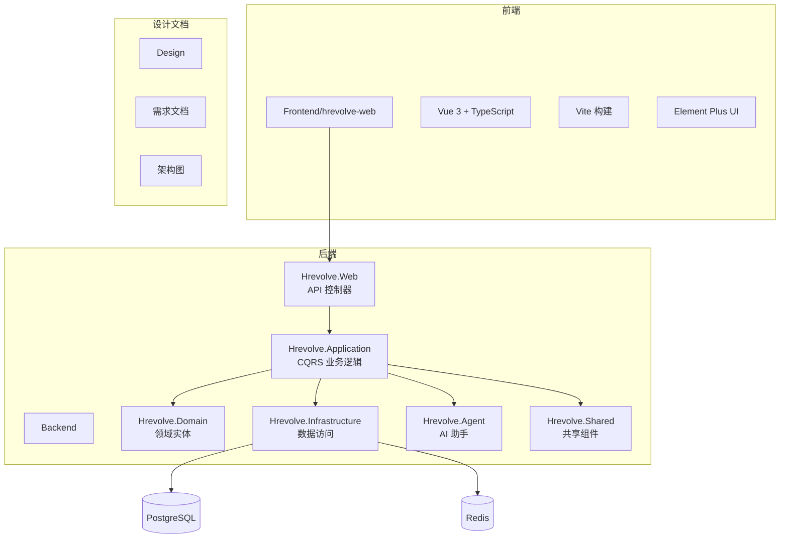
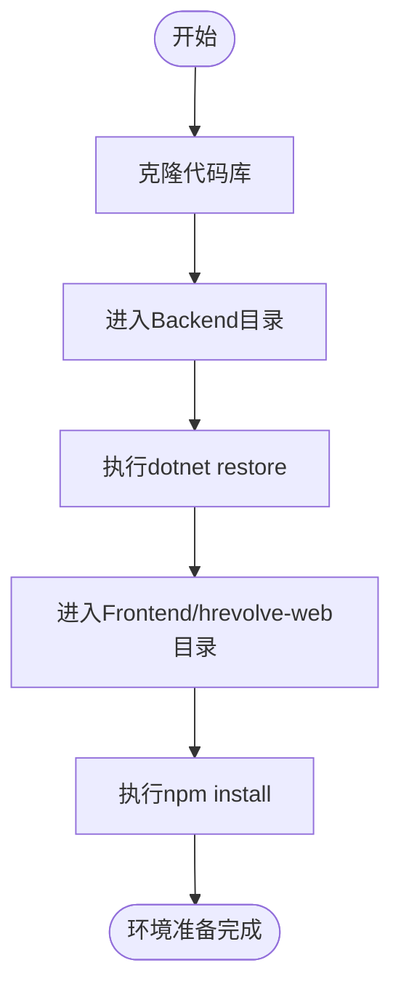
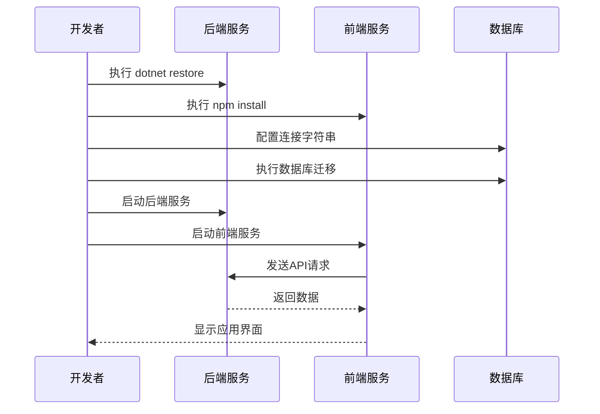
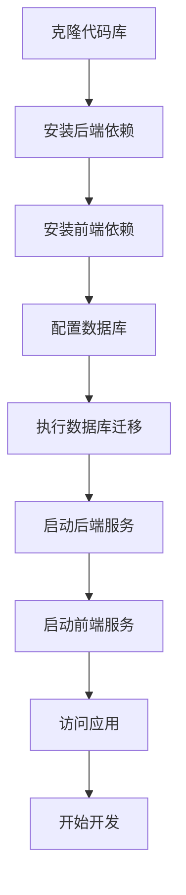

# 开发者指南

<cite>
**本文档引用的文件**  
- [README.md](file://README.md)
- [Backend/README.md](file://Backend/README.md)
- [Frontend/README.md](file://Frontend/README.md)
- [Backend/Hrevolve.Web/appsettings.json](file://Backend/Hrevolve.Web/appsettings.json)
- [Backend/Hrevolve.Web/appsettings.Development.json](file://Backend/Hrevolve.Web/appsettings.Development.json)
- [Backend/Hrevolve.Web/Program.cs](file://Backend/Hrevolve.Web/Program.cs)
- [Backend/Hrevolve.Web/Controllers/AuthController.cs](file://Backend/Hrevolve.Web/Controllers/AuthController.cs)
- [Backend/Hrevolve.Application/Identity/Commands/LoginCommand.cs](file://Backend/Hrevolve.Application/Identity/Commands/LoginCommand.cs)
- [Frontend/hrevolve-web/package.json](file://Frontend/hrevolve-web/package.json)
- [Frontend/hrevolve-web/src/main.ts](file://Frontend/hrevolve-web/src/main.ts)
- [Frontend/hrevolve-web/src/api/modules/auth.ts](file://Frontend/hrevolve-web/src/api/modules/auth.ts)
- [Frontend/hrevolve-web/src/stores/auth.ts](file://Frontend/hrevolve-web/src/stores/auth.ts)
- [Backend/Hrevolve.Agent/Services/HrToolProvider.cs](file://Backend/Hrevolve.Agent/Services/HrToolProvider.cs)
- [Backend/Hrevolve.Agent/Services/HrAgentService.cs](file://Backend/Hrevolve.Agent/Services/HrAgentService.cs)
- [Backend/Hrevolve.Web/Middleware/TenantMiddleware.cs](file://Backend/Hrevolve.Web/Middleware/TenantMiddleware.cs)
- [Backend/Hrevolve.Web/Middleware/CurrentUserMiddleware.cs](file://Backend/Hrevolve.Web/Middleware/CurrentUserMiddleware.cs)
</cite>

## 目录
1. [简介](#简介)
2. [项目结构](#项目结构)
3. [本地开发环境配置](#本地开发环境配置)
4. [代码库克隆与依赖安装](#代码库克隆与依赖安装)
5. [服务启动流程](#服务启动流程)
6. [前后端并行开发调试技巧](#前后端并行开发调试技巧)
7. [代码规范与提交流程](#代码规范与提交流程)
8. [功能扩展指南](#功能扩展指南)
9. [常见问题排查](#常见问题排查)
10. [附录](#附录)

## 简介

本指南旨在为新加入的开发者提供全面的入门指导，涵盖从环境搭建到功能扩展的全流程。Hrevolve 是一个基于 Clean Architecture 和领域驱动设计（DDD）的企业级 SaaS 人力资源管理系统，采用 .NET 10 和 Vue 3 技术栈构建，深度融合 AI 能力。

**本文档引用的文件**  
- [README.md](file://README.md)

## 项目结构

Hrevolve 项目采用分层架构设计，前后端分离，代码组织清晰。



**图源**  
- [README.md](file://README.md#L86-L102)

## 本地开发环境配置

### 环境要求

| 组件 | 版本要求 | 安装说明 |
|------|----------|----------|
| **.NET SDK** | .NET 10 Preview | 从微软官网下载安装 |
| **Node.js** | 18+ | 推荐使用 nvm 进行版本管理 |
| **PostgreSQL** | 16+ | 需启用 UUID 扩展 |
| **Redis** | 7+ | 用于缓存和会话存储 |
| **IDE** | Visual Studio 2022 / Rider / VS Code | 后端推荐使用 Rider，前端推荐使用 VS Code |

### 开发工具配置

1. **Visual Studio Code 插件推荐**：
   - C# Dev Kit
   - Vue Language Features (Volar)
   - ESLint
   - Prettier
   - DotENV

2. **数据库客户端**：
   - PostgreSQL：推荐使用 DBeaver 或 pgAdmin
   - Redis：推荐使用 Another Redis Desktop Manager

**本文档引用的文件**  
- [README.md](file://README.md#L106-L111)
- [Backend/README.md](file://Backend/README.md#L54-L58)

## 代码库克隆与依赖安装

### 代码库克隆

```bash
git clone https://github.com/your-company/Hrevolve.git
cd Hrevolve
```

### 后端依赖安装

```bash
cd Backend
dotnet restore
```

该命令会自动恢复所有项目（Hrevolve.Web、Hrevolve.Application 等）的 NuGet 包。

### 前端依赖安装

```bash
cd Frontend/hrevolve-web
npm install
```

依赖信息定义在 `package.json` 文件中。



**图源**  
- [Frontend/hrevolve-web/package.json](file://Frontend/hrevolve-web/package.json)
- [README.md](file://README.md#L118-L135)

## 服务启动流程

### 数据库配置

1. 确保 PostgreSQL 服务已启动
2. 修改 `Backend/Hrevolve.Web/appsettings.Development.json` 中的数据库连接字符串：

```json
"ConnectionStrings": {
  "DefaultConnection": "Host=localhost;Port=5432;Database=hrevolve_dev;Username=postgres;Password=123456"
}
```

### 数据库迁移

```bash
# 创建初始迁移
dotnet ef migrations add InitialCreate -p Hrevolve.Infrastructure -s Hrevolve.Web

# 应用迁移到数据库
dotnet ef database update -p Hrevolve.Infrastructure -s Hrevolve.Web
```

### 后端服务启动

```bash
dotnet run --project Hrevolve.Web
```

服务将启动在 `https://localhost:5001`，API 文档可通过 `https://localhost:5001/swagger` 访问。

### 前端服务启动

```bash
cd Frontend/hrevolve-web
npm run dev
```

前端开发服务器将启动在 `http://localhost:5173`。



**本文档引用的文件**  
- [Backend/Hrevolve.Web/appsettings.json](file://Backend/Hrevolve.Web/appsettings.json)
- [Backend/Hrevolve.Web/appsettings.Development.json](file://Backend/Hrevolve.Web/appsettings.Development.json)
- [README.md](file://README.md#L114-L142)

## 前后端并行开发调试技巧

### API 接口测试（Postman）

1. **导入集合**：使用项目提供的 Postman 集合模板
2. **环境变量配置**：
   - `base_url`: `https://localhost:5001`
   - `tenant_id`: 测试租户ID
3. **认证流程测试**：
   - 先调用 `POST /api/auth/login` 获取 Token
   - 将返回的 `accessToken` 设置到后续请求的 Authorization 头

### 前端 Mock 数据配置

在开发初期，可使用前端的 Mock 功能：

```typescript
// 在 .env.development 中启用 Mock
VITE_USE_MOCK=true
```

Mock 数据定义在 `src/api/modules` 目录下的各模块文件中。

### 断点调试设置

#### 后端调试（Visual Studio / Rider）
1. 在 `Program.cs` 文件中设置断点
2. 启动调试模式（F5）
3. 可以调试控制器、服务、中间件等所有 C# 代码

#### 前端调试（VS Code）
1. 安装 "Debugger for Chrome" 插件
2. 配置 `launch.json`：
```json
{
  "type": "chrome",
  "request": "launch",
  "name": "调试前端",
  "url": "http://localhost:5173",
  "webRoot": "${workspaceFolder}/Frontend/hrevolve-web/src"
}
```

**本文档引用的文件**  
- [Backend/Hrevolve.Web/Program.cs](file://Backend/Hrevolve.Web/Program.cs)
- [Frontend/hrevolve-web/src/main.ts](file://Frontend/hrevolve-web/src/main.ts)

## 代码规范与提交流程

### C# 命名约定

| 类型 | 规范 | 示例 |
|------|------|------|
| 类 | PascalCase | `EmployeeService` |
| 方法 | PascalCase | `GetEmployeeById` |
| 私有字段 | _camelCase | `_userRepository` |
| 接口 | I+PascalCase | `IUserService` |
| 常量 | UPPER_CASE | `MAX_RETRY_COUNT` |

### TypeScript 类型定义

```typescript
// 接口使用 PascalCase
interface User {
  id: string;
  username: string;
  email: string;
}

// 类型别名使用 PascalCase
type LoginRequest = {
  username: string;
  password: string;
};

// 枚举使用 PascalCase
enum UserRole {
  Admin = 'admin',
  Employee = 'employee'
}
```

### 提交信息格式

采用 Conventional Commits 规范：

```
<type>(<scope>): <subject>

<body>

<footer>
```

- **type**: feat, fix, docs, style, refactor, test, chore
- **scope**: 模块名称，如 auth, employee, payroll
- **subject**: 简短描述，不超过 50 字符

示例：
```
feat(auth): 实现JWT令牌刷新功能

- 添加RefreshTokenRequest DTO
- 实现Token刷新逻辑
- 更新AuthController接口

Closes #123
```

### Pull Request 流程

1. 从 `main` 分支创建特性分支：`feature/your-feature-name`
2. 完成功能开发并本地测试
3. 提交符合规范的 commit
4. 推送分支并创建 Pull Request
5. 至少一名团队成员代码审查
6. 通过 CI/CD 流水线检查
7. 合并到 `main` 分支

**本文档引用的文件**  
- [Backend/Hrevolve.Application/Identity/Commands/LoginCommand.cs](file://Backend/Hrevolve.Application/Identity/Commands/LoginCommand.cs)
- [Frontend/hrevolve-web/src/api/modules/auth.ts](file://Frontend/hrevolve-web/src/api/modules/auth.ts)

## 功能扩展指南

### 扩展 AI 助手功能

通过 `HrToolProvider` 添加新工具：

1. 在 `HrToolProvider.cs` 文件中添加新方法：

```csharp
/// <summary>
/// 查询报销余额
/// </summary>
[Description("查询员工的报销余额信息")]
private static async Task<string> GetExpenseBalance(
    [Description("员工ID")] Guid employeeId)
{
    // 实现业务逻辑
    await Task.Delay(100);
    return $"员工报销余额：¥5,000.00";
}
```

2. 在 `GetTools()` 方法中注册新工具：

```csharp
public IList<AITool> GetTools()
{
    return
    [
        // ... existing tools
        AIFunctionFactory.Create(GetExpenseBalance, "get_expense_balance", "查询员工的报销余额信息")
    ];
}
```

### 自定义中间件

创建新的中间件类：

```csharp
public class CustomLoggingMiddleware(RequestDelegate next, ILogger<CustomLoggingMiddleware> logger)
{
    public async Task InvokeAsync(HttpContext context)
    {
        logger.LogInformation("请求开始: {Method} {Path}", context.Request.Method, context.Request.Path);
        await next(context);
        logger.LogInformation("请求结束: {StatusCode}", context.Response.StatusCode);
    }
}
```

在 `Program.cs` 中注册中间件：

```csharp
app.UseMiddleware<CustomLoggingMiddleware>();
```

### 添加新的业务模块

1. **领域层**：在 `Hrevolve.Domain` 添加实体
2. **应用层**：在 `Hrevolve.Application` 添加命令/查询
3. **基础设施层**：在 `Hrevolve.Infrastructure` 添加配置和仓储
4. **Web 层**：在 `Hrevolve.Web` 添加控制器

**本文档引用的文件**  
- [Backend/Hrevolve.Agent/Services/HrToolProvider.cs](file://Backend/Hrevolve.Agent/Services/HrToolProvider.cs)
- [Backend/Hrevolve.Web/Middleware/CurrentUserMiddleware.cs](file://Backend/Hrevolve.Web/Middleware/CurrentUserMiddleware.cs)

## 常见问题排查

### 数据库迁移失败

**症状**：`dotnet ef database update` 命令执行失败

**解决方案**：
1. 检查数据库连接字符串是否正确
2. 确认 PostgreSQL 服务正在运行
3. 检查用户权限是否足够
4. 查看详细的错误日志

```bash
# 启用详细日志
dotnet ef database update --verbose
```

### JWT 认证错误

**症状**：API 返回 401 Unauthorized

**排查步骤**：
1. 检查 `appsettings.json` 中的 JWT 配置
2. 确认 Token 是否过期
3. 检查 Authorization 头格式是否正确：`Bearer <token>`
4. 使用 Swagger 测试认证流程

```csharp
// 在 AuthController 中调试
[HttpGet("me")]
[Authorize]
public IActionResult GetCurrentUser()
{
    // 检查用户声明
    var claims = User.Claims.Select(c => $"{c.Type}: {c.Value}");
    return Ok(new { claims });
}
```

### 跨域问题（CORS）

**症状**：浏览器控制台出现 CORS 错误

**解决方案**：
1. 确认后端已启用 CORS：

```csharp
builder.Services.AddCors(options =>
{
    options.AddPolicy("AllowAll", policy =>
    {
        policy.AllowAnyOrigin()
              .AllowAnyMethod()
              .AllowAnyHeader();
    });
});
```

2. 确认中间件顺序正确：

```csharp
app.UseCors("AllowAll");
app.UseAuthentication();
app.UseAuthorization();
```

3. 检查前端请求的域名和端口是否匹配

**本文档引用的文件**  
- [Backend/Hrevolve.Web/Program.cs](file://Backend/Hrevolve.Web/Program.cs#L90-L99)
- [Backend/Hrevolve.Web/Controllers/AuthController.cs](file://Backend/Hrevolve.Web/Controllers/AuthController.cs)

## 附录

### 项目启动流程图



### 主要配置文件说明

| 文件 | 用途 |
|------|------|
| `appsettings.json` | 生产环境配置 |
| `appsettings.Development.json` | 开发环境配置 |
| `.env.development` | 前端开发环境变量 |
| `vite.config.ts` | 前端构建配置 |