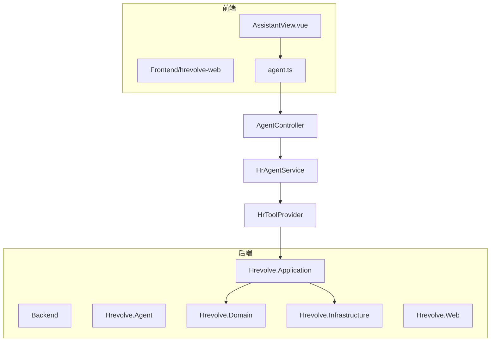
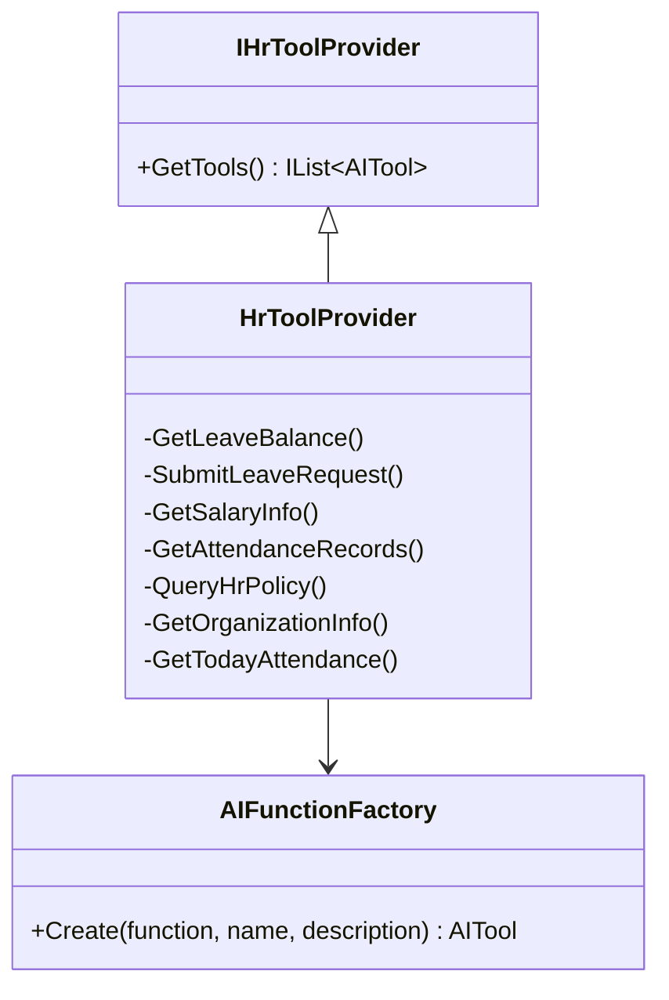
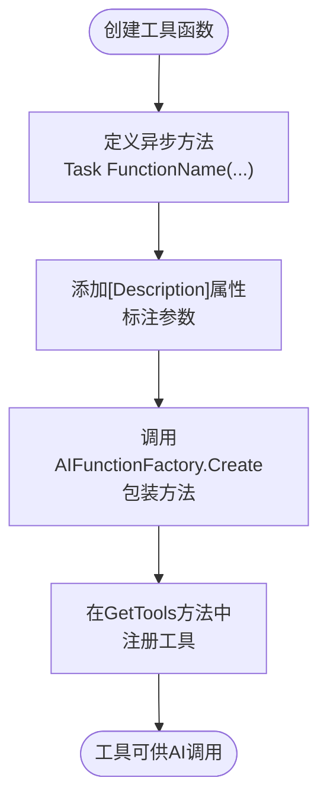
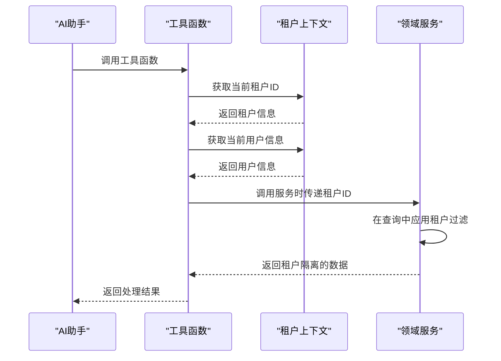
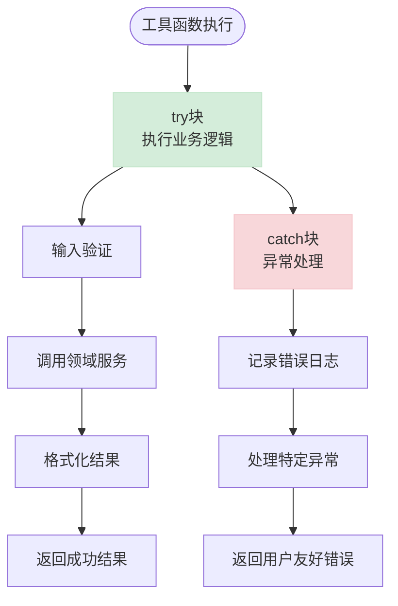
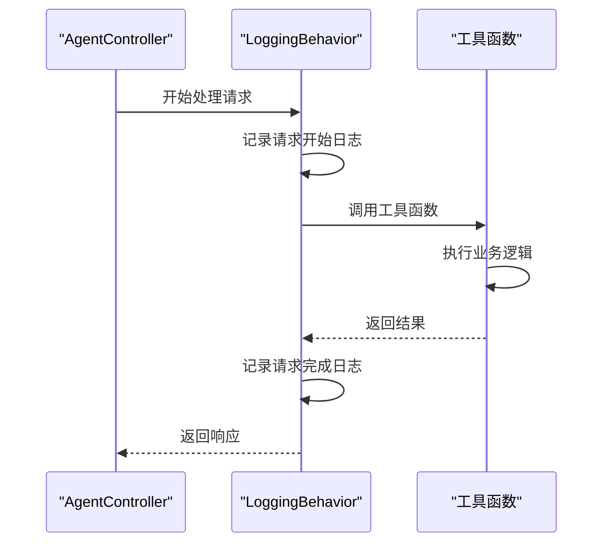
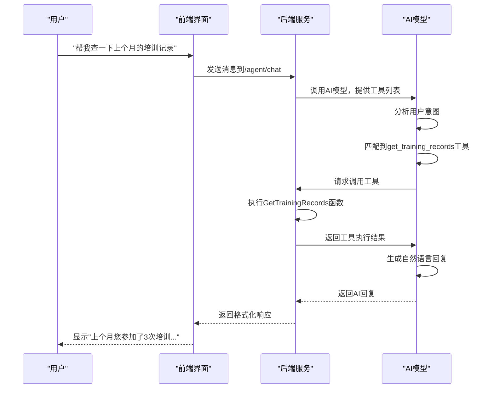

# AI助手扩展

<cite>
**本文档引用文件**  
- [HrToolProvider.cs](file://Backend/Hrevolve.Agent/Services/HrToolProvider.cs)
- [HrAgentService.cs](file://Backend/Hrevolve.Agent/Services/HrAgentService.cs)
- [DependencyInjection.cs](file://Backend/Hrevolve.Agent/DependencyInjection.cs)
- [ITenantContext.cs](file://Backend/Hrevolve.Shared/MultiTenancy/ITenantContext.cs)
- [ICurrentUser.cs](file://Backend/Hrevolve.Shared/Identity/ICurrentUser.cs)
- [LoggingBehavior.cs](file://Backend/Hrevolve.Application/Behaviors/LoggingBehavior.cs)
- [ExceptionHandlingMiddleware.cs](file://Backend/Hrevolve.Web/Middleware/ExceptionHandlingMiddleware.cs)
- [AgentController.cs](file://Backend/Hrevolve.Web/Controllers/AgentController.cs)
- [agent.ts](file://Frontend/hrevolve-web/src/api/modules/agent.ts)
- [AssistantView.vue](file://Frontend/hrevolve-web/src/views/assistant/AssistantView.vue)
</cite>

## 目录
1. [项目结构](#项目结构)
2. [核心组件](#核心组件)
3. [工具函数实现](#工具函数实现)
4. [AIFunctionFactory.Create方法详解](#aifunctionfactorycreate方法详解)
5. "查询培训记录"工具实现示例
6. 多租户上下文使用
7. 错误处理与日志记录
8. 工具触发机制与自然语言理解
9. 总结

## 项目结构



**图示来源**  
- [AssistantView.vue](file://Frontend/hrevolve-web/src/views/assistant/AssistantView.vue)
- [agent.ts](file://Frontend/hrevolve-web/src/api/modules/agent.ts)
- [AgentController.cs](file://Backend/Hrevolve.Web/Controllers/AgentController.cs)
- [HrAgentService.cs](file://Backend/Hrevolve.Agent/Services/HrAgentService.cs)
- [HrToolProvider.cs](file://Backend/Hrevolve.Agent/Services/HrToolProvider.cs)

## 核心组件

本系统的核心是基于Microsoft Agent Framework构建的AI助手，通过IHrToolProvider接口扩展工具函数。HrAgentService作为主要服务协调AI对话流程，而HrToolProvider提供具体的业务工具实现。

**本节来源**  
- [HrAgentService.cs](file://Backend/Hrevolve.Agent/Services/HrAgentService.cs)
- [HrToolProvider.cs](file://Backend/Hrevolve.Agent/Services/HrToolProvider.cs)

## 工具函数实现

AI助手通过实现IHrToolProvider接口来扩展新工具函数。每个工具函数都是一个异步方法，通过AIFunctionFactory.Create包装后注册到AI系统中。



**图示来源**  
- [HrToolProvider.cs](file://Backend/Hrevolve.Agent/Services/HrToolProvider.cs)

## AIFunctionFactory.Create方法详解

AIFunctionFactory.Create方法用于将普通C#方法转换为AI可调用的工具函数。该方法接受三个主要参数：

- **函数委托**：要包装的异步方法
- **名称**：工具的唯一标识符
- **描述**：工具功能的简要说明

工具函数的签名必须遵循特定规范：
- 返回类型必须是`Task<string>`
- 参数使用`[Description]`属性标注
- 参数类型支持基本类型和字符串



**本节来源**  
- [HrToolProvider.cs](file://Backend/Hrevolve.Agent/Services/HrToolProvider.cs)

## "查询培训记录"工具实现示例

以添加"查询培训记录"工具为例，展示从领域服务调用到权限验证的完整实现流程。

```csharp
/// <summary>
/// 查询员工的培训记录
/// </summary>
[Description("查询员工的培训记录信息")]
private static async Task<string> GetTrainingRecords(
    [Description("员工ID")] Guid employeeId,
    [Description("开始日期，格式：YYYY-MM-DD")] string startDate,
    [Description("结束日期，格式：YYYY-MM-DD")] string endDate)
{
    // TODO: 调用TrainingService获取培训记录
    await Task.Delay(100);
    
    return $"""
        培训记录查询结果（{startDate} 至 {endDate}）：
        - 参加培训次数：3 次
        - 完成课程：5 门
        - 总学习时长：15 小时
        - 待完成课程：2 门（绩效管理、领导力发展）
        
        建议：您有2门课程待完成，请及时学习以满足年度培训要求。
        """;
}
```

在HrToolProvider的GetTools方法中注册新工具：

```csharp
public IList<AITool> GetTools()
{
    return
    [
        AIFunctionFactory.Create(GetLeaveBalance, "get_leave_balance", "查询员工的假期余额信息"),
        AIFunctionFactory.Create(SubmitLeaveRequest, "submit_leave_request", "帮助员工提交请假申请"),
        AIFunctionFactory.Create(GetSalaryInfo, "get_salary_info", "查询员工的薪资信息"),
        AIFunctionFactory.Create(GetAttendanceRecords, "get_attendance_records", "查询员工的考勤记录"),
        AIFunctionFactory.Create(QueryHrPolicy, "query_hr_policy", "查询公司HR政策和规章制度"),
        AIFunctionFactory.Create(GetOrganizationInfo, "get_organization_info", "查询公司组织架构信息"),
        AIFunctionFactory.Create(GetTodayAttendance, "get_today_attendance", "获取今日考勤状态"),
        AIFunctionFactory.Create(GetTrainingRecords, "get_training_records", "查询员工的培训记录")
    ];
}
```

**本节来源**  
- [HrToolProvider.cs](file://Backend/Hrevolve.Agent/Services/HrToolProvider.cs)

## 多租户上下文使用

在工具函数中正确使用多租户上下文是确保数据隔离的关键。系统通过ITenantContext和ICurrentUser接口提供租户和用户信息。



在实际实现中，可以通过依赖注入获取上下文服务：

```csharp
public class HrToolProvider(IServiceProvider serviceProvider) : IHrToolProvider
{
    private async Task<string> GetEmployeeTrainingRecords(Guid employeeId)
    {
        // 从服务提供者获取租户上下文
        using var scope = serviceProvider.CreateScope();
        var tenantContext = scope.ServiceProvider.GetRequiredService<ITenantContextAccessor>().TenantContext;
        var currentUser = scope.ServiceProvider.GetRequiredService<ICurrentUserAccessor>().CurrentUser;
        
        // 验证权限和租户隔离
        if (currentUser?.TenantId == null || !tenantContext.HasTenant)
        {
            return "无法确定租户上下文，请重新登录。";
        }
        
        // 调用领域服务，确保数据隔离
        var trainingService = scope.ServiceProvider.GetRequiredService<ITrainingService>();
        var records = await trainingService.GetRecordsAsync(employeeId, tenantContext.TenantId);
        
        // 格式化返回结果
        return FormatTrainingRecords(records);
    }
}
```

**图示来源**  
- [ITenantContext.cs](file://Backend/Hrevolve.Shared/MultiTenancy/ITenantContext.cs)
- [ICurrentUser.cs](file://Backend/Hrevolve.Shared/Identity/ICurrentUser.cs)

**本节来源**  
- [HrToolProvider.cs](file://Backend/Hrevolve.Agent/Services/HrToolProvider.cs)
- [ITenantContext.cs](file://Backend/Hrevolve.Shared/MultiTenancy/ITenantContext.cs)
- [ICurrentUser.cs](file://Backend/Hrevolve.Shared/Identity/ICurrentUser.cs)

## 错误处理与日志记录

系统提供了完善的错误处理和日志记录机制，确保工具函数的稳定性和可维护性。



最佳实践示例：

```csharp
/// <summary>
/// 查询员工的培训记录（带错误处理）
/// </summary>
[Description("查询员工的培训记录信息")]
private static async Task<string> GetTrainingRecords(
    [Description("员工ID")] Guid employeeId,
    [Description("开始日期，格式：YYYY-MM-DD")] string startDate,
    [Description("结束日期，格式：YYYY-MM-DD")] string endDate)
{
    try
    {
        // 输入验证
        if (!DateOnly.TryParse(startDate, out var start) || !DateOnly.TryParse(endDate, out var end))
        {
            return "日期格式错误，请使用 YYYY-MM-DD 格式";
        }
        
        if (start > end)
        {
            return "开始日期不能晚于结束日期";
        }
        
        // 调用领域服务
        using var scope = serviceProvider.CreateScope();
        var trainingService = scope.ServiceProvider.GetRequiredService<ITrainingService>();
        var records = await trainingService.GetRecordsAsync(employeeId, start, end);
        
        // 处理空结果
        if (!records.Any())
        {
            return $"在 {startDate} 到 {endDate} 期间没有找到您的培训记录。";
        }
        
        // 格式化结果
        return FormatTrainingRecords(records);
    }
    catch (EntityNotFoundException ex)
    {
        return $"未找到员工信息，请确认员工ID是否正确。";
    }
    catch (UnauthorizedException ex)
    {
        return "您没有权限查询此信息，请联系HR部门。";
    }
    catch (Exception ex)
    {
        // 记录详细错误日志
        logger.LogError(ex, "查询培训记录失败 - 员工ID: {EmployeeId}, 开始日期: {StartDate}, 结束日期: {EndDate}", 
                       employeeId, startDate, endDate);
        return "查询培训记录时发生错误，请稍后重试或联系系统管理员。";
    }
}
```

系统级日志记录通过管道行为实现：



**图示来源**  
- [LoggingBehavior.cs](file://Backend/Hrevolve.Application/Behaviors/LoggingBehavior.cs)
- [ExceptionHandlingMiddleware.cs](file://Backend/Hrevolve.Web/Middleware/ExceptionHandlingMiddleware.cs)

**本节来源**  
- [HrToolProvider.cs](file://Backend/Hrevolve.Agent/Services/HrToolProvider.cs)
- [LoggingBehavior.cs](file://Backend/Hrevolve.Application/Behaviors/LoggingBehavior.cs)
- [ExceptionHandlingMiddleware.cs](file://Backend/Hrevolve.Web/Middleware/ExceptionHandlingMiddleware.cs)

## 工具触发机制与自然语言理解

新工具在AI对话中的触发机制依赖于自然语言理解(NLU)和工具调用能力。



自然语言理解配置通过系统提示词(Prompt)实现：

```csharp
private static string GetSystemPrompt()
{
    return """
        你是Hrevolve HR助手，一个专业、友好的人力资源AI助手。
        
        你的职责包括：
        1. 回答员工关于公司政策、规章制度的问题
        2. 帮助员工查询假期余额、薪资信息、考勤记录、培训记录
        3. 协助员工提交请假申请、报销申请等
        4. 提供组织架构、同事联系方式等信息查询
        
        注意事项：
        - 始终保持专业、友好的态度
        - 涉及敏感信息（如薪资）时，只能查询员工本人的信息
        - 如果不确定答案，请诚实告知并建议联系HR部门
        - 使用简洁清晰的中文回复
        - 如果需要执行操作（如请假），请先确认所有必要信息
        - 当需要调用工具时，请使用提供的工具函数
        """;
}
```

前端集成通过API调用实现：

```typescript
// agent.ts
export const agentApi = {
  /** 发送消息给AI助手 */
  chat(message: string) {
    return request.post<ChatResponse>('/agent/chat', { message });
  },
  
  /** 获取对话历史 */
  getHistory(limit: number = 20) {
    return request.get<ChatMessage[]>('/agent/history', { params: { limit } });
  },
};

// AssistantView.vue
const sendMessage = async (text?: string) => {
  const message = text || inputMessage.value.trim();
  if (!message || loading.value) return;
  
  messages.value.push(userMessage);
  loading.value = true;
  
  try {
    const res = await agentApi.chat(message);
    // 处理AI回复
  } catch {
    // 处理错误
  } finally {
    loading.value = false;
  }
};
```

**图示来源**  
- [HrAgentService.cs](file://Backend/Hrevolve.Agent/Services/HrAgentService.cs)
- [AgentController.cs](file://Backend/Hrevolve.Web/Controllers/AgentController.cs)
- [agent.ts](file://Frontend/hrevolve-web/src/api/modules/agent.ts)
- [AssistantView.vue](file://Frontend/hrevolve-web/src/views/assistant/AssistantView.vue)

**本节来源**  
- [HrAgentService.cs](file://Backend/Hrevolve.Agent/Services/HrAgentService.cs)
- [AgentController.cs](file://Backend/Hrevolve.Web/Controllers/AgentController.cs)
- [agent.ts](file://Frontend/hrevolve-web/src/api/modules/agent.ts)
- [AssistantView.vue](file://Frontend/hrevolve-web/src/views/assistant/AssistantView.vue)

## 总结

通过实现IHrToolProvider接口，可以轻松为AI助手扩展新的工具函数。关键要点包括：

1. 使用AIFunctionFactory.Create方法包装异步函数
2. 正确使用[Description]属性标注参数
3. 在多租户环境中确保数据隔离
4. 实现完善的错误处理和日志记录
5. 通过系统提示词配置自然语言理解

新工具的添加流程简单明了，只需定义函数、添加描述、注册到工具列表即可。系统会自动处理工具发现、调用和结果整合，让AI助手能够智能地选择和使用适当的工具来满足用户需求。