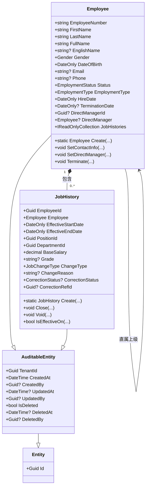
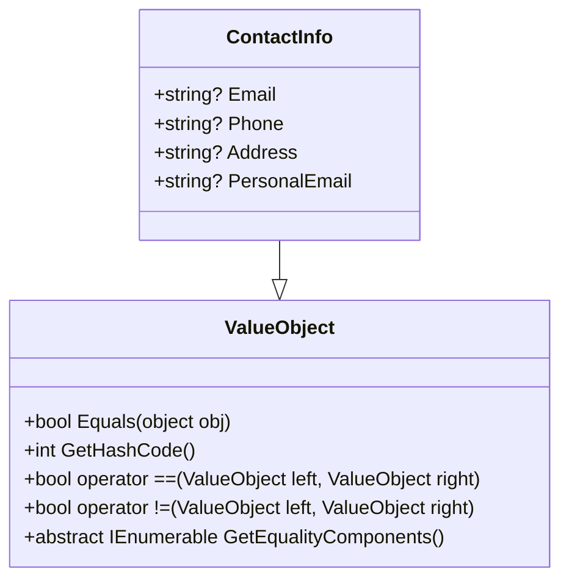
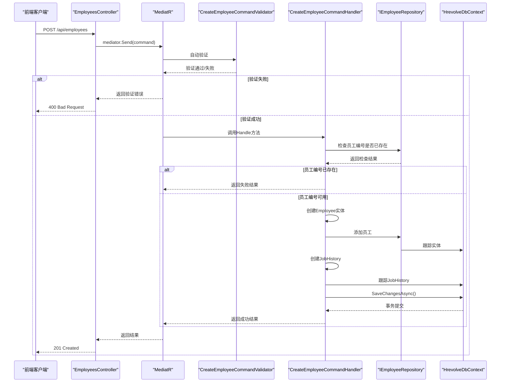
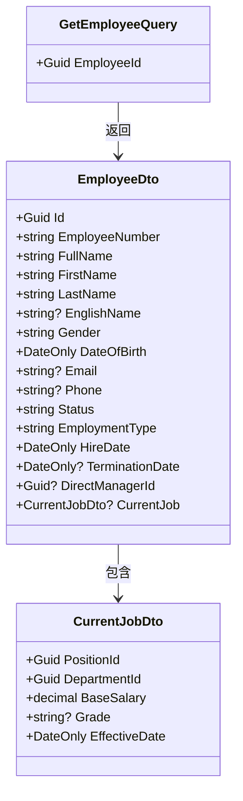
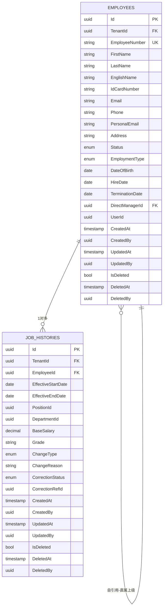
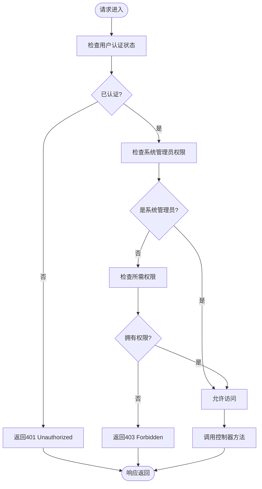
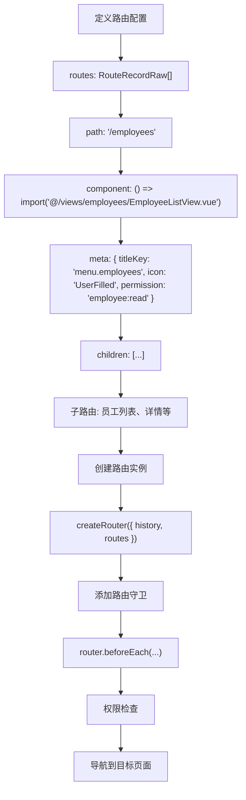
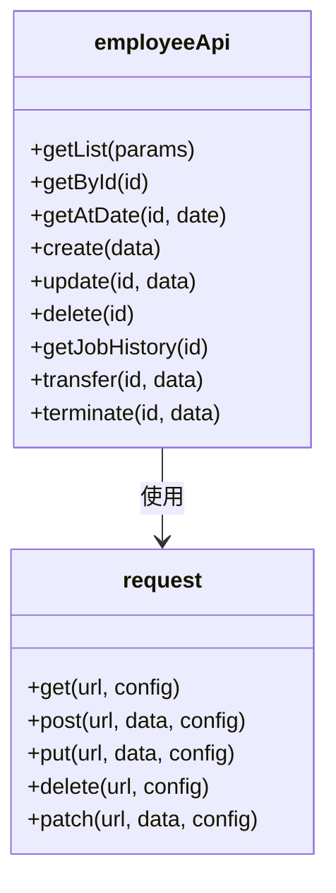
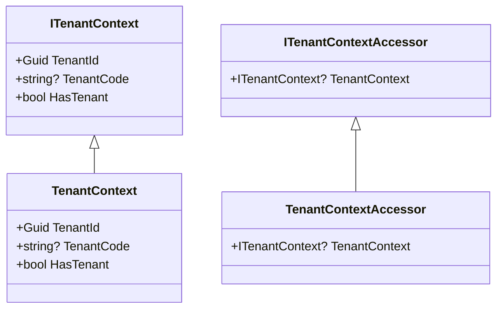
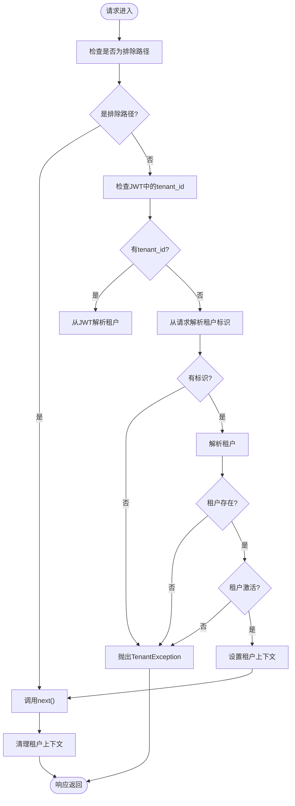

# 业务模块扩展

<cite>
**本文档引用的文件**  
- [Tenant.cs](file://Backend/Hrevolve.Domain/Tenants/Tenant.cs)
- [CreateEmployeeCommand.cs](file://Backend/Hrevolve.Application/Employees/Commands/CreateEmployeeCommand.cs)
- [GetEmployeeQuery.cs](file://Backend/Hrevolve.Application/Employees/Queries/GetEmployeeQuery.cs)
- [ValueObject.cs](file://Backend/Hrevolve.Domain/Common/ValueObject.cs)
- [AuditableEntity.cs](file://Backend/Hrevolve.Domain/Common/AuditableEntity.cs)
- [Employee.cs](file://Backend/Hrevolve.Domain/Employees/Employee.cs)
- [JobHistory.cs](file://Backend/Hrevolve.Domain/Employees/JobHistory.cs)
- [EmployeeConfiguration.cs](file://Backend/Hrevolve.Infrastructure/Persistence/Configurations/EmployeeConfiguration.cs)
- [EmployeesController.cs](file://Backend/Hrevolve.Web/Controllers/EmployeesController.cs)
- [ITenantContext.cs](file://Backend/Hrevolve.Shared/MultiTenancy/ITenantContext.cs)
- [index.ts](file://Frontend/hrevolve-web/src/router/index.ts)
- [employee.ts](file://Frontend/hrevolve-web/src/api/modules/employee.ts)
- [request.ts](file://Frontend/hrevolve-web/src/api/request.ts)
- [RequirePermissionAttribute.cs](file://Backend/Hrevolve.Web/Filters/RequirePermissionAttribute.cs)
- [TenantMiddleware.cs](file://Backend/Hrevolve.Web/Middleware/TenantMiddleware.cs)
</cite>

## 目录
1. [引言](#引言)
2. [领域模型设计](#领域模型设计)
3. [CQRS模式与命令查询定义](#cqrs模式与命令查询定义)
4. [EF Core配置映射](#ef-core配置映射)
5. [API控制器实现](#api控制器实现)
6. [前端集成流程](#前端集成流程)
7. [多租户上下文传播](#多租户上下文传播)

## 引言
本文档详细阐述在Hrevolve HR系统中新增业务模块的标准化流程。通过员工管理模块作为示例，全面介绍从领域模型设计、CQRS命令查询定义、EF Core映射配置、API控制器实现到前端集成的完整开发流程。特别强调多租户字段（TenantId）在各层的正确传播和使用，确保系统在SaaS架构下的数据隔离和安全性。

## 领域模型设计

在Hrevolve系统中，领域模型设计遵循领域驱动设计（DDD）原则，核心包括实体（Entity）、值对象（Value Object）和聚合根（Aggregate Root）的定义。

### 实体与聚合根
实体是具有唯一标识和生命周期的对象。在本系统中，所有实体都继承自`Entity`基类，而可审计实体则继承自`AuditableEntity`，后者包含了多租户隔离和审计字段。

`Employee`（员工）是员工管理模块的聚合根，它包含了员工的基本信息、联系方式、雇佣状态等核心属性。作为聚合根，`Employee`负责维护其内部一致性，并通过工厂方法`Create`来保证对象的合法创建。



**图示来源**
- [Employee.cs](file://Backend/Hrevolve.Domain/Employees/Employee.cs#L6-L137)
- [JobHistory.cs](file://Backend/Hrevolve.Domain/Employees/JobHistory.cs#L9-L124)
- [AuditableEntity.cs](file://Backend/Hrevolve.Domain/Common/AuditableEntity.cs#L6-L48)

### 值对象
值对象是通过其属性值来定义的对象，没有唯一标识。在本系统中，所有值对象都继承自`ValueObject`基类，该基类提供了基于属性值的相等性比较。

虽然在当前示例中没有明确的值对象实现，但系统设计为支持值对象的创建。例如，可以将员工的联系方式（ContactInfo）设计为一个值对象，包含邮箱、电话、地址等属性。



**图示来源**
- [ValueObject.cs](file://Backend/Hrevolve.Domain/Common/ValueObject.cs#L6-L33)

**本节来源**
- [ValueObject.cs](file://Backend/Hrevolve.Domain/Common/ValueObject.cs#L1-L33)
- [AuditableEntity.cs](file://Backend/Hrevolve.Domain/Common/AuditableEntity.cs#L1-L48)

## CQRS模式与命令查询定义

Hrevolve系统采用CQRS（命令查询职责分离）模式，将数据修改操作（命令）与数据读取操作（查询）完全分离，以提高系统的可维护性和性能。

### 命令定义与验证
命令用于表示对系统状态的修改操作。每个命令都是一个记录（record），实现`IRequest<Result<T>>`接口，其中`Result<T>`是系统统一的返回结果类型。

以`CreateEmployeeCommand`为例，它包含了创建员工所需的所有数据，并通过C#的`init`属性确保不可变性。

命令的验证通过FluentValidation库实现。每个命令都有对应的验证器（Validator），在命令处理前自动执行验证规则。



**图示来源**
- [CreateEmployeeCommand.cs](file://Backend/Hrevolve.Application/Employees/Commands/CreateEmployeeCommand.cs#L6-L126)
- [EmployeesController.cs](file://Backend/Hrevolve.Web/Controllers/EmployeesController.cs#L54-L66)

### 查询定义与DTO
查询用于获取系统状态，不改变任何数据。查询返回的是DTO（数据传输对象），而不是领域实体，以实现关注点分离。

`GetEmployeeQuery`查询返回`EmployeeDto`，它是一个扁平化的数据结构，包含了员工的详细信息以及当前职位信息。这种设计避免了前端需要多次调用API来获取关联数据。



**图示来源**
- [GetEmployeeQuery.cs](file://Backend/Hrevolve.Application/Employees/Queries/GetEmployeeQuery.cs#L38-L146)

**本节来源**
- [CreateEmployeeCommand.cs](file://Backend/Hrevolve.Application/Employees/Commands/CreateEmployeeCommand.cs#L6-L126)
- [GetEmployeeQuery.cs](file://Backend/Hrevolve.Application/Employees/Queries/GetEmployeeQuery.cs#L38-L146)

## EF Core配置映射

EF Core配置文件用于定义领域实体与数据库表之间的映射关系，包括表名、字段类型、索引和关系等。

### 表名与字段配置
`EmployeeConfiguration`类配置了`Employee`实体的映射。通过`ToTable`方法指定数据库表名为"Employees"，并为每个属性配置了适当的长度限制和约束。



**图示来源**
- [EmployeeConfiguration.cs](file://Backend/Hrevolve.Infrastructure/Persistence/Configurations/EmployeeConfiguration.cs#L5-L110)

### 索引定义
索引对于查询性能至关重要。系统为关键查询路径定义了复合索引：

- `(TenantId, EmployeeNumber)`：确保租户内员工编号的唯一性，支持通过员工编号快速查找
- `(TenantId, Email)`：支持通过邮箱查找员工
- `(TenantId, Status)`：支持按状态筛选员工（如在职、离职）

对于`JobHistory`，定义了`(TenantId, EmployeeId, EffectiveStartDate, EffectiveEndDate)`索引，以支持高效的时点查询。

### 关系配置
实体间的关系通过`HasOne`、`HasMany`等方法配置。`Employee`与`JobHistory`之间是一对多关系，配置为级联删除（Cascade），确保删除员工时自动删除其所有职位历史记录。

`Employee`的`DirectManager`属性配置为自引用关系，使用`Restrict`删除行为，防止直接删除有下属的管理者。

**本节来源**
- [EmployeeConfiguration.cs](file://Backend/Hrevolve.Infrastructure/Persistence/Configurations/EmployeeConfiguration.cs#L5-L110)

## API控制器实现

API控制器是前后端交互的入口，负责接收HTTP请求、调用应用服务并返回响应。

### 路由设计
控制器使用属性路由进行精确控制。`EmployeesController`的基路径为`api/employees`，通过`[Route("api/[controller]")]`自动生成。

具体操作的路由设计遵循RESTful原则：
- `GET /api/employees/{id}`：获取指定员工详情
- `POST /api/employees`：创建新员工
- `PUT /api/employees/{id}`：更新员工信息
- `POST /api/employees/{id}/terminate`：员工离职（特定操作）

### 权限控制
权限控制通过自定义的`[RequirePermission]`特性实现。该特性实现了`IAuthorizationFilter`接口，在请求处理前检查用户权限。



**图示来源**
- [RequirePermissionAttribute.cs](file://Backend/Hrevolve.Web/Filters/RequirePermissionAttribute.cs#L7-L80)
- [EmployeesController.cs](file://Backend/Hrevolve.Web/Controllers/EmployeesController.cs#L16-L17)

### MediatR请求分发
控制器通过MediatR库将请求分发给相应的命令或查询处理器。这种方式实现了请求处理的解耦，使控制器保持简洁。

```csharp
var result = await mediator.Send(new GetEmployeeQuery(id), cancellationToken);
```

MediatR会自动找到`GetEmployeeQueryHandler`并执行，同时触发验证行为（ValidationBehavior）和日志行为（LoggingBehavior）。

**本节来源**
- [EmployeesController.cs](file://Backend/Hrevolve.Web/Controllers/EmployeesController.cs#L9-L95)
- [RequirePermissionAttribute.cs](file://Backend/Hrevolve.Web/Filters/RequirePermissionAttribute.cs#L7-L80)

## 前端集成流程

前端集成包括路由注册、API客户端封装和视图组件开发三个主要步骤。

### 前端路由注册
前端使用Vue Router进行路由管理。新的业务模块需要在`router/index.ts`中注册路由。



**图示来源**
- [index.ts](file://Frontend/hrevolve-web/src/router/index.ts#L5-L368)

### API客户端封装
API客户端封装在`src/api/modules`目录下，每个业务模块有一个对应的TS文件。

`employee.ts`文件封装了所有员工管理相关的API调用，使用统一的`request`实例，自动处理认证和租户信息。



**图示来源**
- [employee.ts](file://Frontend/hrevolve-web/src/api/modules/employee.ts#L5-L51)
- [request.ts](file://Frontend/hrevolve-web/src/api/request.ts#L84-L104)

### 视图组件开发
视图组件位于`src/views`目录下，遵循一致的命名和结构规范。员工管理模块包含`EmployeeListView`和`EmployeeDetailView`等组件。

**本节来源**
- [index.ts](file://Frontend/hrevolve-web/src/router/index.ts#L5-L368)
- [employee.ts](file://Frontend/hrevolve-web/src/api/modules/employee.ts#L5-L51)
- [request.ts](file://Frontend/hrevolve-web/src/api/request.ts#L1-L107)

## 多租户上下文传播

多租户是Hrevolve系统的核心特性，TenantId在各层的正确传播和使用是确保数据隔离的关键。

### 租户上下文实现
`ITenantContext`接口定义了租户上下文的基本结构，包含`TenantId`和`TenantCode`。`TenantContextAccessor`使用`AsyncLocal`存储当前请求的租户上下文，确保在异步操作中也能正确传递。



**图示来源**
- [ITenantContext.cs](file://Backend/Hrevolve.Shared/MultiTenancy/ITenantContext.cs#L6-L81)

### 租户中间件
`TenantMiddleware`是租户解析的核心组件。它按照优先级从多个来源解析租户标识：

1. **JWT Token**：已认证用户的JWT中包含`tenant_id`声明
2. **Header**：`X-Tenant-Id`请求头
3. **Subdomain**：子域名（如`tenant1.example.com`）
4. **Query Parameter**：URL查询参数`tenant`

中间件在请求开始时设置租户上下文，在请求结束时清理，确保上下文不会泄漏到其他请求。



**图示来源**
- [TenantMiddleware.cs](file://Backend/Hrevolve.Web/Middleware/TenantMiddleware.cs#L6-L133)

### 各层租户使用
- **领域层**：实体继承`AuditableEntity`，自动包含`TenantId`字段
- **应用层**：命令处理器通过`ITenantContextAccessor`获取当前租户ID
- **基础设施层**：EF Core配置中为所有实体添加`(TenantId)`索引，确保数据隔离
- **前端层**：`request.ts`拦截器自动将`X-Tenant-Id`头添加到所有请求

**本节来源**
- [TenantMiddleware.cs](file://Backend/Hrevolve.Web/Middleware/TenantMiddleware.cs#L6-L133)
- [ITenantContext.cs](file://Backend/Hrevolve.Shared/MultiTenancy/ITenantContext.cs#L6-L81)
- [AuditableEntity.cs](file://Backend/Hrevolve.Domain/Common/AuditableEntity.cs#L11-L12)
- [request.ts](file://Frontend/hrevolve-web/src/api/request.ts#L26-L28)