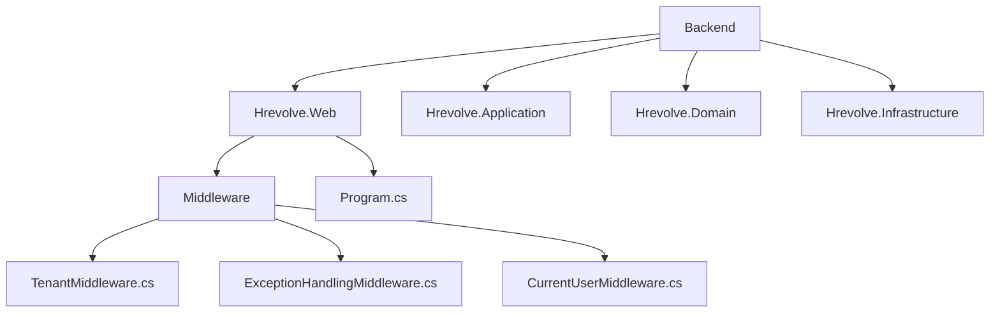
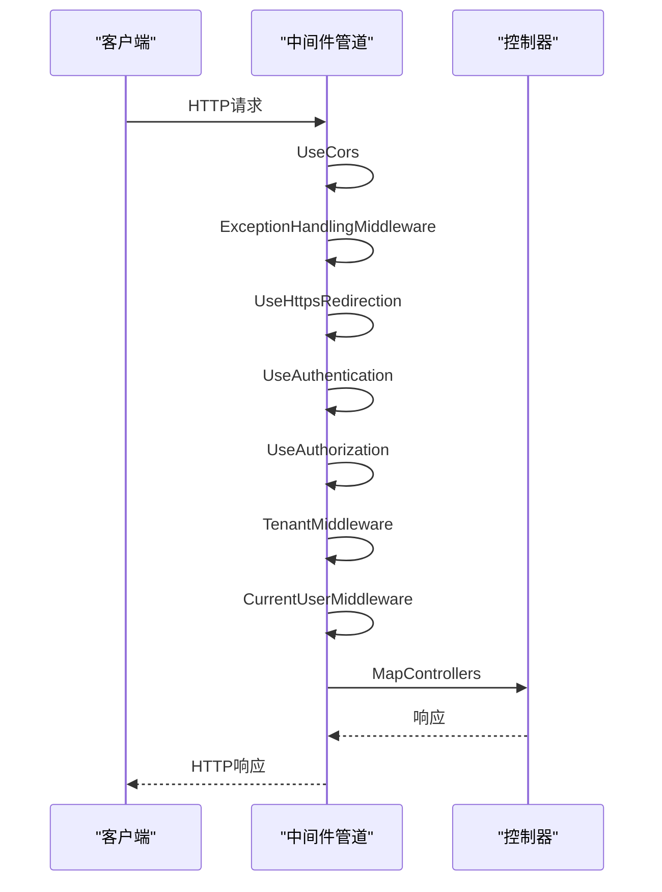
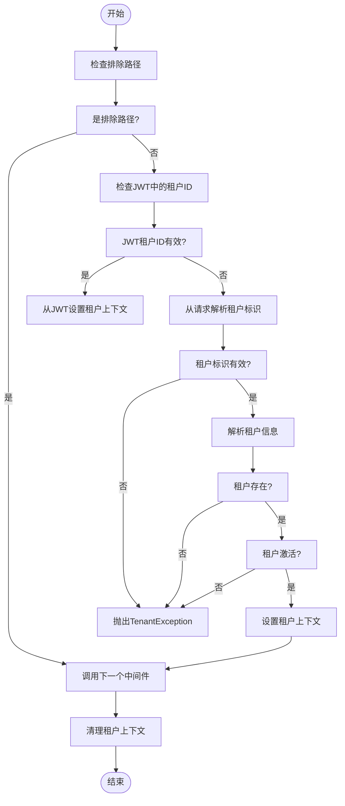
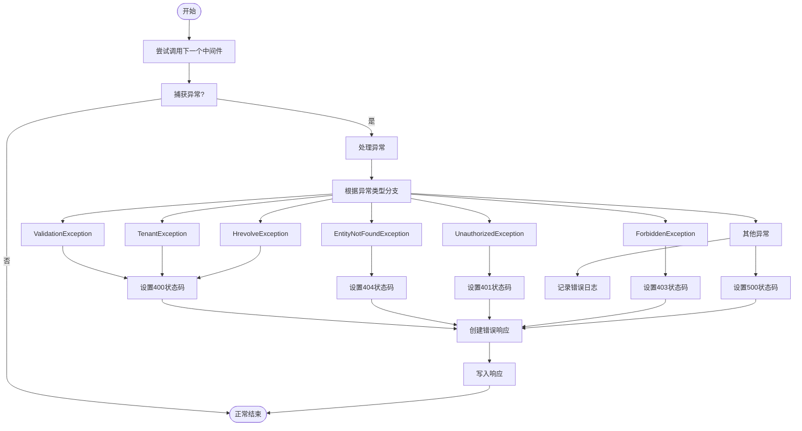
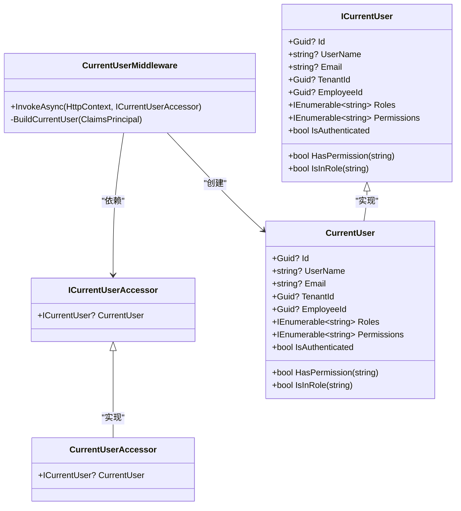
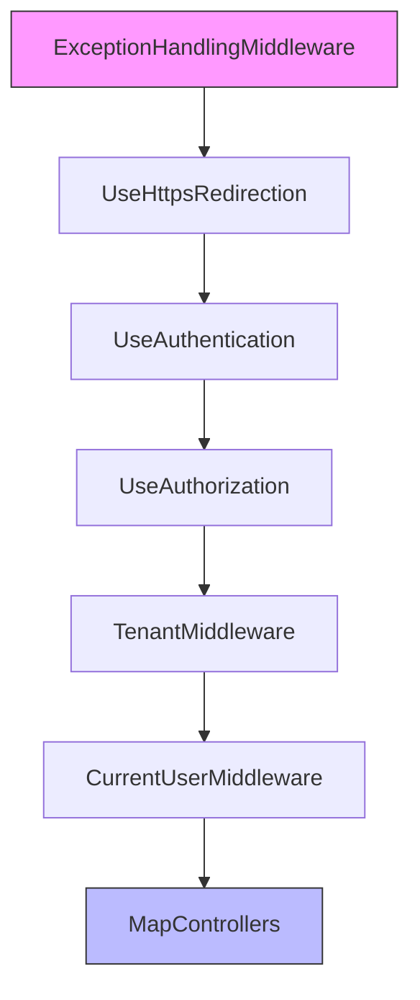
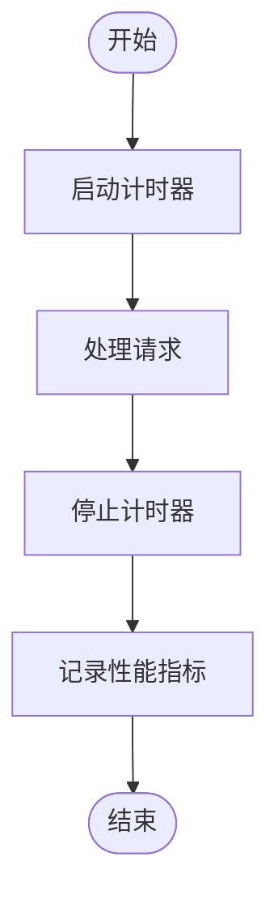

# 中间件扩展

<cite>
**本文档中引用的文件**  
- [TenantMiddleware.cs](file://Backend/Hrevolve.Web/Middleware/TenantMiddleware.cs)
- [ExceptionHandlingMiddleware.cs](file://Backend/Hrevolve.Web/Middleware/ExceptionHandlingMiddleware.cs)
- [CurrentUserMiddleware.cs](file://Backend/Hrevolve.Web/Middleware/CurrentUserMiddleware.cs)
- [Program.cs](file://Backend/Hrevolve.Web/Program.cs)
- [ITenantContext.cs](file://Backend/Hrevolve.Shared/MultiTenancy/ITenantContext.cs)
- [ICurrentUser.cs](file://Backend/Hrevolve.Shared/Identity/ICurrentUser.cs)
- [TenantResolver.cs](file://Backend/Hrevolve.Infrastructure/MultiTenancy/TenantResolver.cs)
- [Tenant.cs](file://Backend/Hrevolve.Domain/Tenants/Tenant.cs)
- [HrevolveException.cs](file://Backend/Hrevolve.Shared/Exceptions/HrevolveException.cs)
- [LoggingBehavior.cs](file://Backend/Hrevolve.Application/Behaviors/LoggingBehavior.cs)
- [RequirePermissionAttribute.cs](file://Backend/Hrevolve.Web/Filters/RequirePermissionAttribute.cs)
</cite>

## 目录
1. [简介](#简介)
2. [项目结构](#项目结构)
3. [核心组件](#核心组件)
4. [架构概述](#架构概述)
5. [详细组件分析](#详细组件分析)
6. [依赖分析](#依赖分析)
7. [性能考虑](#性能考虑)
8. [故障排除指南](#故障排除指南)
9. [结论](#结论)

## 简介
本文档旨在为开发者提供创建和注入自定义中间件到ASP.NET Core请求管道的全面指导。以性能监控中间件为例，展示如何记录请求处理时间、捕获异常并生成监控指标。文档详细说明中间件构造函数依赖注入的原理，如何获取ILogger等服务实例，解释InvokeAsync方法的执行流程和await _next(context)调用的重要性。同时强调在finally块中清理资源的必要性，说明中间件执行顺序的配置方法，以及如何通过UseWhen等条件分支控制中间件执行。最后提供与现有TenantMiddleware协同工作的最佳实践。

## 项目结构
本项目采用分层架构设计，包含Backend、Frontend、Design等主要目录。Backend目录下包含多个.NET项目，其中Hrevolve.Web项目包含中间件实现，Hrevolve.Application包含应用层逻辑，Hrevolve.Domain包含领域模型，Hrevolve.Infrastructure包含基础设施代码。中间件相关代码位于Hrevolve.Web/Middleware目录下，包括TenantMiddleware、ExceptionHandlingMiddleware和CurrentUserMiddleware。

**图示来源**
- [TenantMiddleware.cs](file://Backend/Hrevolve.Web/Middleware/TenantMiddleware.cs)
- [ExceptionHandlingMiddleware.cs](file://Backend/Hrevolve.Web/Middleware/ExceptionHandlingMiddleware.cs)
- [CurrentUserMiddleware.cs](file://Backend/Hrevolve.Web/Middleware/CurrentUserMiddleware.cs)
- [Program.cs](file://Backend/Hrevolve.Web/Program.cs)

**节来源**
- [TenantMiddleware.cs](file://Backend/Hrevolve.Web/Middleware/TenantMiddleware.cs)
- [ExceptionHandlingMiddleware.cs](file://Backend/Hrevolve.Web/Middleware/ExceptionHandlingMiddleware.cs)
- [CurrentUserMiddleware.cs](file://Backend/Hrevolve.Web/Middleware/CurrentUserMiddleware.cs)
- [Program.cs](file://Backend/Hrevolve.Web/Program.cs)

## 核心组件
项目中的核心中间件组件包括TenantMiddleware、ExceptionHandlingMiddleware和CurrentUserMiddleware。这些中间件共同构成了系统的请求处理管道，负责多租户上下文管理、全局异常处理和当前用户上下文设置。中间件通过依赖注入获取所需服务，并在请求管道中按特定顺序执行。

**节来源**
- [TenantMiddleware.cs](file://Backend/Hrevolve.Web/Middleware/TenantMiddleware.cs)
- [ExceptionHandlingMiddleware.cs](file://Backend/Hrevolve.Web/Middleware/ExceptionHandlingMiddleware.cs)
- [CurrentUserMiddleware.cs](file://Backend/Hrevolve.Web/Middleware/CurrentUserMiddleware.cs)

## 架构概述
系统的中间件架构基于ASP.NET Core的请求管道模型，采用分层处理方式。请求首先经过CORS和HTTP重定向处理，然后进入认证和授权中间件，接着是多租户和用户上下文中间件，最后到达控制器。异常处理中间件位于管道前端，确保所有异常都能被捕获和处理。

**图示来源**
- [Program.cs](file://Backend/Hrevolve.Web/Program.cs)
- [TenantMiddleware.cs](file://Backend/Hrevolve.Web/Middleware/TenantMiddleware.cs)
- [CurrentUserMiddleware.cs](file://Backend/Hrevolve.Web/Middleware/CurrentUserMiddleware.cs)

## 详细组件分析
本节详细分析各个中间件组件的实现细节和工作原理。

### TenantMiddleware分析
TenantMiddleware负责解析和设置多租户上下文。它从JWT、请求头、子域名或查询参数中解析租户标识，并通过ITenantResolver服务获取租户信息。中间件使用ITenantContextAccessor来存储和访问租户上下文，并在请求结束时清理上下文。

**图示来源**
- [TenantMiddleware.cs](file://Backend/Hrevolve.Web/Middleware/TenantMiddleware.cs)
- [ITenantContext.cs](file://Backend/Hrevolve.Shared/MultiTenancy/ITenantContext.cs)
- [TenantResolver.cs](file://Backend/Hrevolve.Infrastructure/MultiTenancy/TenantResolver.cs)

**节来源**
- [TenantMiddleware.cs](file://Backend/Hrevolve.Web/Middleware/TenantMiddleware.cs)
- [ITenantContext.cs](file://Backend/Hrevolve.Shared/MultiTenancy/ITenantContext.cs)
- [TenantResolver.cs](file://Backend/Hrevolve.Infrastructure/MultiTenancy/TenantResolver.cs)

### ExceptionHandlingMiddleware分析
ExceptionHandlingMiddleware是全局异常处理中间件，捕获管道中所有未处理的异常，并将其转换为标准化的错误响应。中间件使用ILogger记录异常信息，并根据异常类型返回相应的HTTP状态码和错误信息。

**图示来源**
- [ExceptionHandlingMiddleware.cs](file://Backend/Hrevolve.Web/Middleware/ExceptionHandlingMiddleware.cs)
- [HrevolveException.cs](file://Backend/Hrevolve.Shared/Exceptions/HrevolveException.cs)

**节来源**
- [ExceptionHandlingMiddleware.cs](file://Backend/Hrevolve.Web/Middleware/ExceptionHandlingMiddleware.cs)
- [HrevolveException.cs](file://Backend/Hrevolve.Shared/Exceptions/HrevolveException.cs)

### CurrentUserMiddleware分析
CurrentUserMiddleware从JWT中解析用户信息并设置当前用户上下文。中间件使用ICurrentUserAccessor来存储和访问用户上下文，并在请求结束时清理上下文。它提取用户ID、邮箱、角色和权限等信息，为后续的业务逻辑提供用户上下文。

**图示来源**
- [CurrentUserMiddleware.cs](file://Backend/Hrevolve.Web/Middleware/CurrentUserMiddleware.cs)
- [ICurrentUser.cs](file://Backend/Hrevolve.Shared/Identity/ICurrentUser.cs)

**节来源**
- [CurrentUserMiddleware.cs](file://Backend/Hrevolve.Web/Middleware/CurrentUserMiddleware.cs)
- [ICurrentUser.cs](file://Backend/Hrevolve.Shared/Identity/ICurrentUser.cs)

## 依赖分析
中间件组件之间存在明确的依赖关系和执行顺序。ExceptionHandlingMiddleware必须位于管道最前端，以捕获所有后续中间件的异常。TenantMiddleware依赖于认证中间件，因为它需要从JWT中获取租户信息。CurrentUserMiddleware依赖于认证和租户中间件，因为它需要用户和租户上下文。

**图示来源**
- [Program.cs](file://Backend/Hrevolve.Web/Program.cs)
- [TenantMiddleware.cs](file://Backend/Hrevolve.Web/Middleware/TenantMiddleware.cs)
- [CurrentUserMiddleware.cs](file://Backend/Hrevolve.Web/Middleware/CurrentUserMiddleware.cs)

**节来源**
- [Program.cs](file://Backend/Hrevolve.Web/Program.cs)
- [TenantMiddleware.cs](file://Backend/Hrevolve.Web/Middleware/TenantMiddleware.cs)
- [CurrentUserMiddleware.cs](file://Backend/Hrevolve.Web/Middleware/CurrentUserMiddleware.cs)

## 性能考虑
在创建自定义中间件时，需要注意性能影响。避免在中间件中执行耗时的同步操作，尽量使用异步方法。对于频繁访问的数据，考虑使用缓存。在性能监控中间件中，使用Stopwatch精确测量请求处理时间，并将指标记录到日志或监控系统中。

**图示来源**
- [LoggingBehavior.cs](file://Backend/Hrevolve.Application/Behaviors/LoggingBehavior.cs)

## 故障排除指南
当中间件出现问题时，可以通过以下步骤进行排查：检查中间件注册顺序，确保依赖的中间件已正确注册；查看日志输出，特别是调试级别的日志；验证依赖注入配置，确保所需服务已正确注册；检查异常处理逻辑，确保异常被正确捕获和处理。

**节来源**
- [ExceptionHandlingMiddleware.cs](file://Backend/Hrevolve.Web/Middleware/ExceptionHandlingMiddleware.cs)
- [TenantMiddleware.cs](file://Backend/Hrevolve.Web/Middleware/TenantMiddleware.cs)
- [CurrentUserMiddleware.cs](file://Backend/Hrevolve.Web/Middleware/CurrentUserMiddleware.cs)

## 结论
本文档详细介绍了如何在ASP.NET Core应用中创建和配置自定义中间件。通过分析现有中间件的实现，展示了中间件构造函数依赖注入、InvokeAsync方法执行流程、资源清理、执行顺序配置等关键概念。开发者可以基于这些最佳实践创建自己的中间件，如性能监控中间件，以增强应用的功能和可观测性。