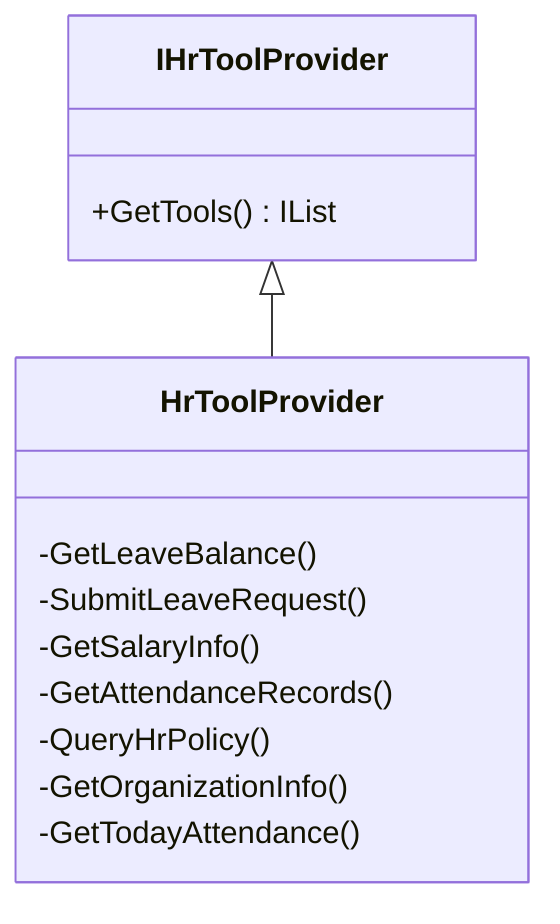
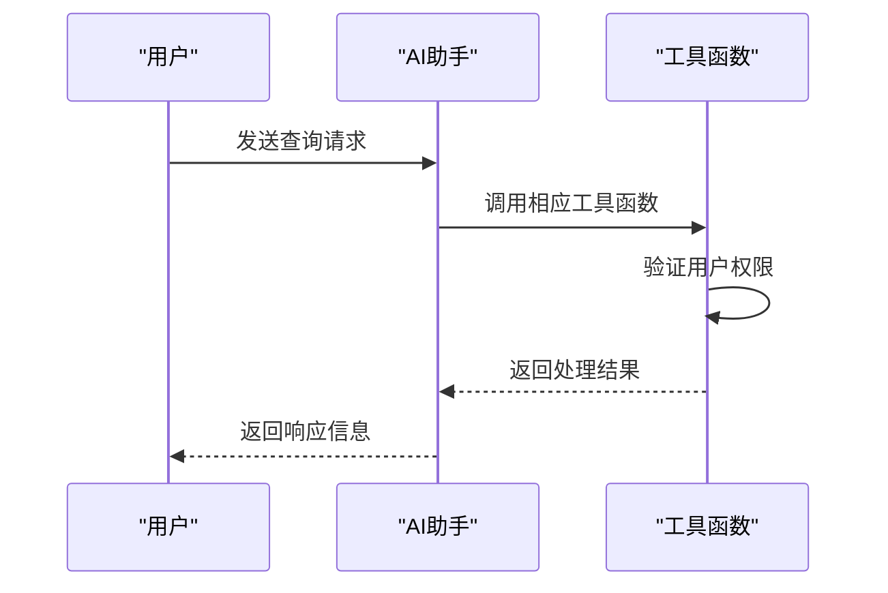
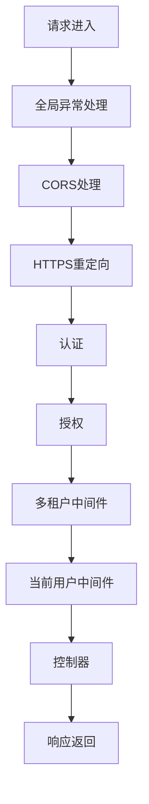
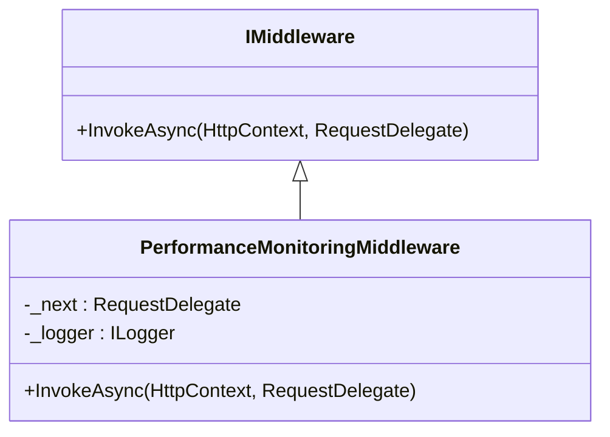
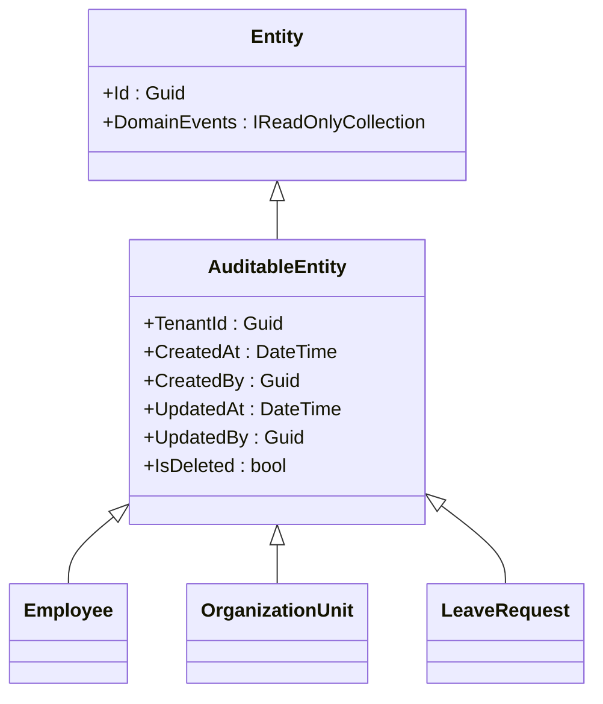
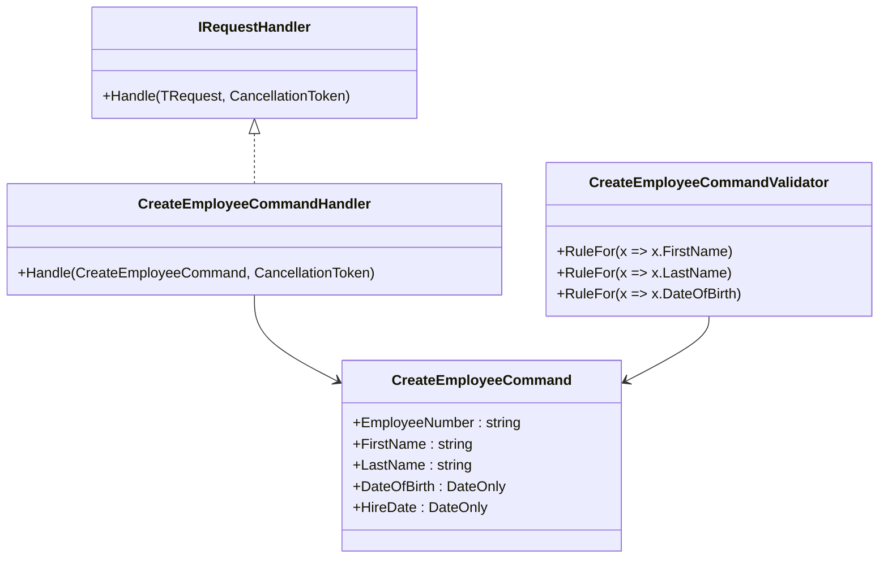
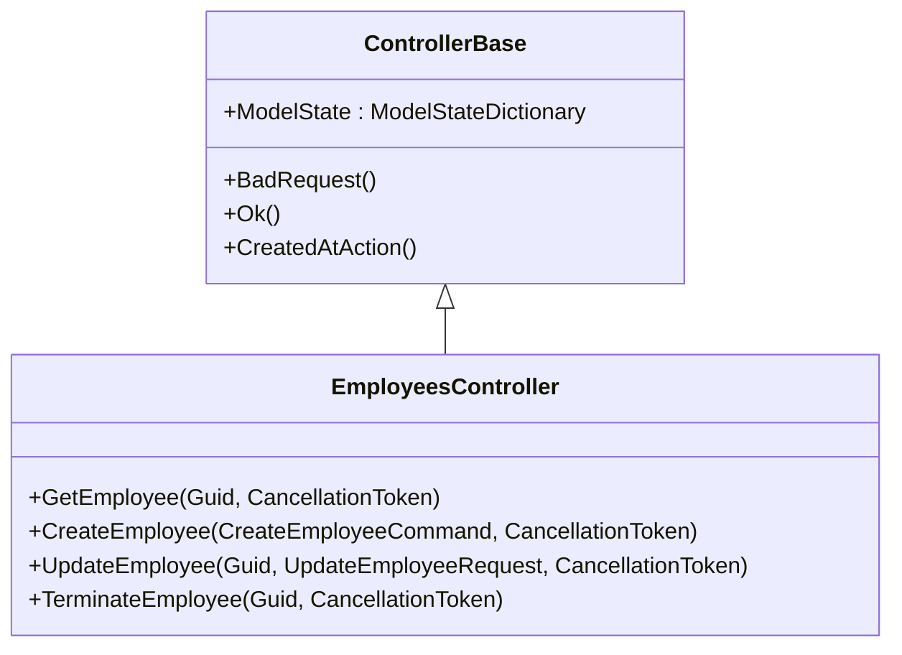
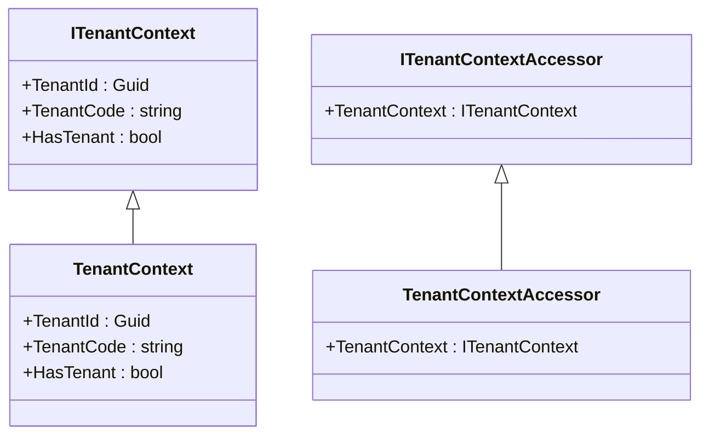
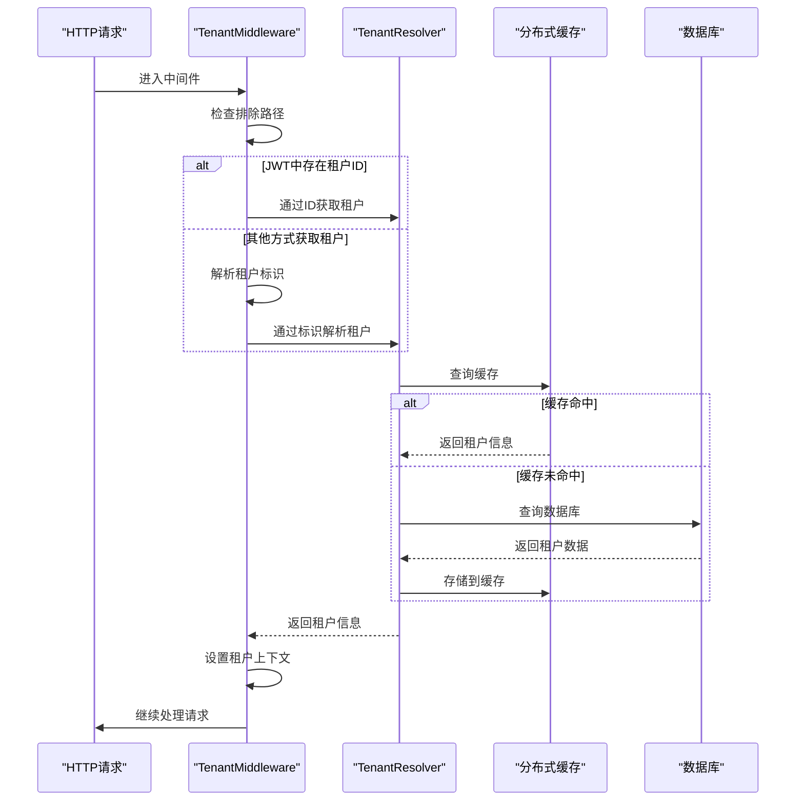

# 扩展与定制

<cite>
**本文档引用的文件**   
- [HrToolProvider.cs](file://Backend/Hrevolve.Agent/Services/HrToolProvider.cs)
- [HrAgentService.cs](file://Backend/Hrevolve.Agent/Services/HrAgentService.cs)
- [TenantMiddleware.cs](file://Backend/Hrevolve.Web/Middleware/TenantMiddleware.cs)
- [ITenantContext.cs](file://Backend/Hrevolve.Shared/MultiTenancy/ITenantContext.cs)
- [DependencyInjection.cs](file://Backend/Hrevolve.Agent/DependencyInjection.cs)
- [Program.cs](file://Backend/Hrevolve.Web/Program.cs)
- [RequirePermissionAttribute.cs](file://Backend/Hrevolve.Web/Filters/RequirePermissionAttribute.cs)
- [CurrentUserMiddleware.cs](file://Backend/Hrevolve.Web/Middleware/CurrentUserMiddleware.cs)
- [AgentController.cs](file://Backend/Hrevolve.Web/Controllers/AgentController.cs)
- [CreateEmployeeCommand.cs](file://Backend/Hrevolve.Application/Employees/Commands/CreateEmployeeCommand.cs)
- [HrevolveDbContext.cs](file://Backend/Hrevolve.Infrastructure/Persistence/HrevolveDbContext.cs)
- [TenantResolver.cs](file://Backend/Hrevolve.Infrastructure/MultiTenancy/TenantResolver.cs)
</cite>

## 目录
1. [简介](#简介)
2. [AI助手工具扩展](#ai助手工具扩展)
3. [自定义中间件开发](#自定义中间件开发)
4. [新增业务模块流程](#新增业务模块流程)
5. [多租户上下文传播](#多租户上下文传播)
6. [结论](#结论)

## 简介
本指南详细说明了如何安全地扩展Hrevolve系统功能，包括为AI助手添加新工具函数、创建自定义中间件、新增业务模块的标准化流程以及多租户上下文的正确传播方式。通过遵循这些指导原则，开发者可以确保新功能与现有系统架构保持一致，并满足安全性和可维护性的要求。

## AI助手工具扩展

### 实现HrToolProvider接口
要为AI助手添加新工具函数，需要通过实现`IHrToolProvider`接口来扩展`HrToolProvider`类。该接口定义了获取所有可用AI工具的方法，而具体实现则通过`AIFunctionFactory.Create`方法注册具体的工具函数。



**图示来源**
- [HrToolProvider.cs](file://Backend/Hrevolve.Agent/Services/HrToolProvider.cs#L6-L31)

### 工具注册与权限验证
新工具函数的注册需要在`GetTools`方法中完成，通过`AIFunctionFactory.Create`方法将函数包装为`AITool`对象。每个工具函数都应包含适当的权限验证逻辑，确保只有授权用户才能执行敏感操作。



**图示来源**
- [HrToolProvider.cs](file://Backend/Hrevolve.Agent/Services/HrToolProvider.cs#L24-L30)
- [RequirePermissionAttribute.cs](file://Backend/Hrevolve.Web/Filters/RequirePermissionAttribute.cs#L33-L68)

**本节来源**
- [HrToolProvider.cs](file://Backend/Hrevolve.Agent/Services/HrToolProvider.cs#L1-L250)
- [RequirePermissionAttribute.cs](file://Backend/Hrevolve.Web/Filters/RequirePermissionAttribute.cs#L1-L80)

## 自定义中间件开发

### 中间件注入流程
自定义中间件需要在`Program.cs`文件中的请求管道中进行注册。中间件的执行顺序至关重要，通常全局异常处理、认证授权等核心中间件应优先注册。



**图示来源**
- [Program.cs](file://Backend/Hrevolve.Web/Program.cs#L141-L154)

### 性能监控中间件示例
创建自定义中间件时，应继承`IMiddleware`接口或使用委托方式实现。以下是一个性能监控中间件的基本结构：



**本节来源**
- [Program.cs](file://Backend/Hrevolve.Web/Program.cs#L122-L154)
- [TenantMiddleware.cs](file://Backend/Hrevolve.Web/Middleware/TenantMiddleware.cs#L1-L133)

## 新增业务模块流程

### 领域模型设计
新增业务模块的第一步是设计领域模型，这些模型应继承自`Entity`或`AuditableEntity`基类，并位于`Hrevolve.Domain`项目中。模型设计应遵循单一职责原则和高内聚低耦合的设计理念。



**图示来源**
- [Entity.cs](file://Backend/Hrevolve.Domain/Common/Entity.cs#L6-L32)
- [HrevolveDbContext.cs](file://Backend/Hrevolve.Infrastructure/Persistence/HrevolveDbContext.cs#L24-L62)

### CQRS命令/查询定义
应用层使用CQRS模式来分离读写操作。命令用于修改数据状态，查询用于获取数据。每个命令和查询都有相应的处理器和验证器。



**图示来源**
- [CreateEmployeeCommand.cs](file://Backend/Hrevolve.Application/Employees/Commands/CreateEmployeeCommand.cs#L6-L126)

### EF Core配置映射
实体框架核心（EF Core）配置通过实现`IEntityTypeConfiguration`接口来完成。这些配置定义了数据库表结构、索引、外键约束等。

```mermaid
classDiagram
class IEntityTypeConfiguration[T] {
+Configure(EntityTypeBuilder[T])
}
class EmployeeConfiguration {
+Configure(EntityTypeBuilder[Employee])
}
class OrganizationConfiguration {
+Configure(EntityTypeBuilder[OrganizationUnit])
}
IEntityTypeConfiguration <|-- EmployeeConfiguration
IEntityTypeConfiguration <|-- OrganizationConfiguration
```

**图示来源**
- [OrganizationConfiguration.cs](file://Backend/Hrevolve.Infrastructure/Persistence/Configurations/OrganizationConfiguration.cs#L41-L94)
- [ExpenseConfiguration.cs](file://Backend/Hrevolve.Infrastructure/Persistence/Configurations/ExpenseConfiguration.cs#L41-L87)

### API控制器暴露
API控制器负责将应用层的功能暴露给前端。控制器应使用适当的路由、授权和验证属性来确保安全性。



**本节来源**
- [CreateEmployeeCommand.cs](file://Backend/Hrevolve.Application/Employees/Commands/CreateEmployeeCommand.cs#L1-L126)
- [HrevolveDbContext.cs](file://Backend/Hrevolve.Infrastructure/Persistence/HrevolveDbContext.cs#L1-L157)
- [EmployeesController.cs](file://Backend/Hrevolve.Web/Controllers/EmployeesController.cs#L42-L86)

## 多租户上下文传播

### ITenantContext接口
`ITenantContext`接口提供了当前请求的租户信息，包括租户ID和租户代码。该接口的实现使用`AsyncLocal`来确保上下文在异步操作中正确传播。



**图示来源**
- [ITenantContext.cs](file://Backend/Hrevolve.Shared/MultiTenancy/ITenantContext.cs#L6-L81)

### 租户解析与中间件
`TenantMiddleware`负责解析并设置租户上下文。它从JWT令牌、请求头、子域名或查询参数中提取租户标识，并通过`ITenantResolver`服务解析租户信息。



**图示来源**
- [TenantMiddleware.cs](file://Backend/Hrevolve.Web/Middleware/TenantMiddleware.cs#L1-L133)
- [TenantResolver.cs](file://Backend/Hrevolve.Infrastructure/MultiTenancy/TenantResolver.cs#L1-L108)

**本节来源**
- [ITenantContext.cs](file://Backend/Hrevolve.Shared/MultiTenancy/ITenantContext.cs#L1-L81)
- [TenantMiddleware.cs](file://Backend/Hrevolve.Web/Middleware/TenantMiddleware.cs#L1-L133)
- [TenantResolver.cs](file://Backend/Hrevolve.Infrastructure/MultiTenancy/TenantResolver.cs#L1-L108)

## 结论
通过遵循上述指导原则，开发者可以安全有效地扩展Hrevolve系统的功能。关键要点包括：正确实现`HrToolProvider`接口以添加AI助手工具，创建自定义中间件并正确注入到请求管道，按照标准化流程新增业务模块，以及确保多租户上下文在数据操作中的正确传播。这些实践有助于保持系统的可维护性、安全性和可扩展性。