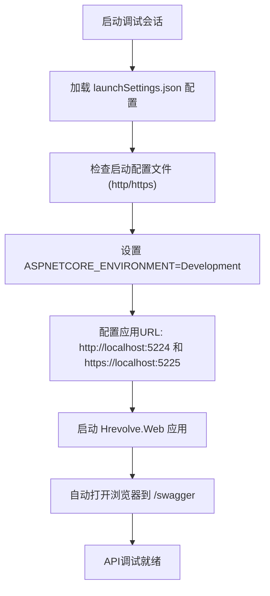
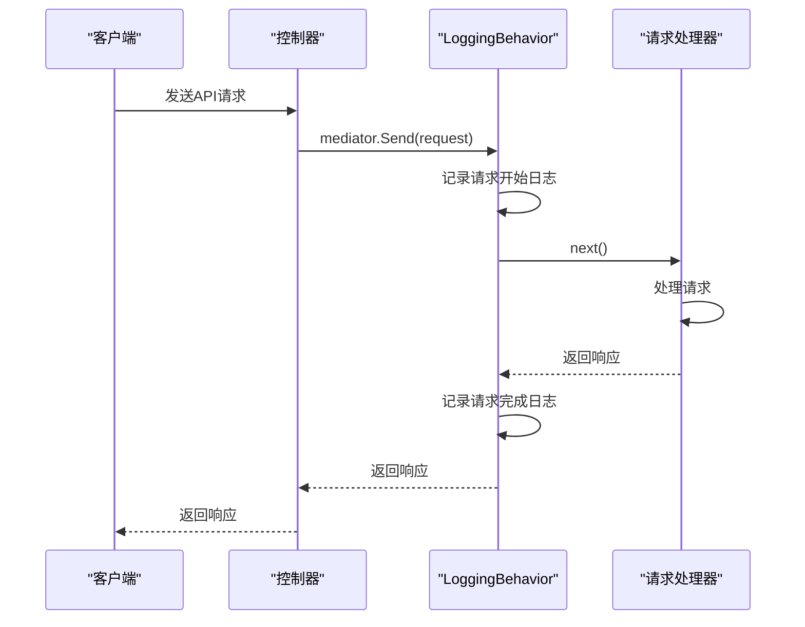
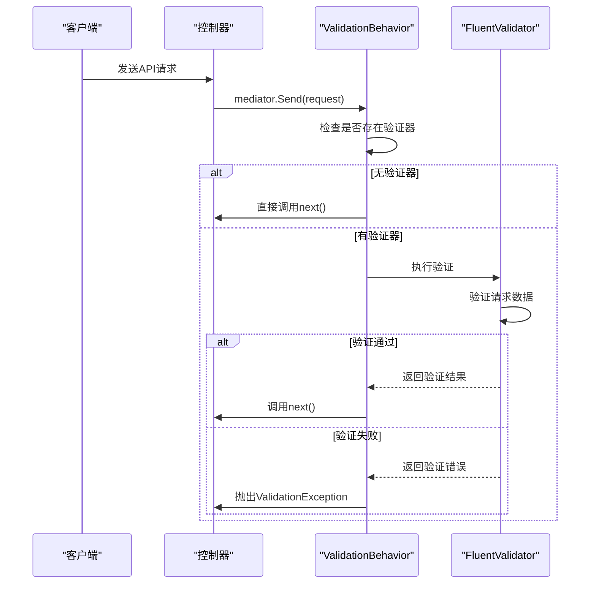
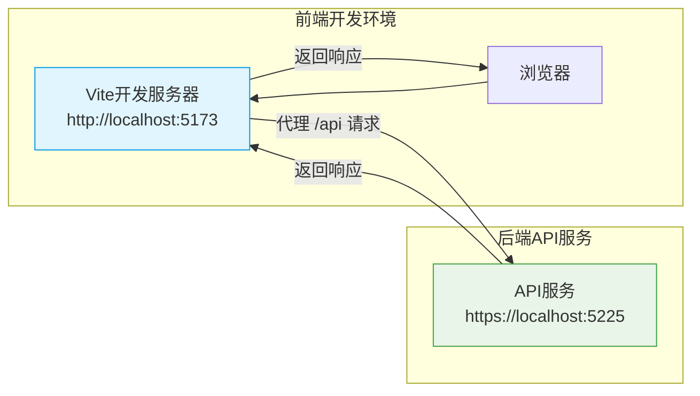
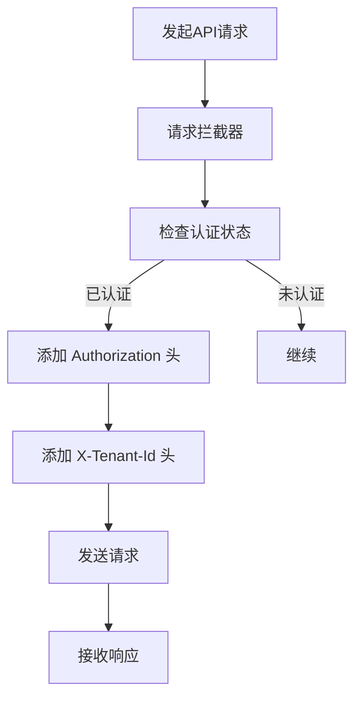
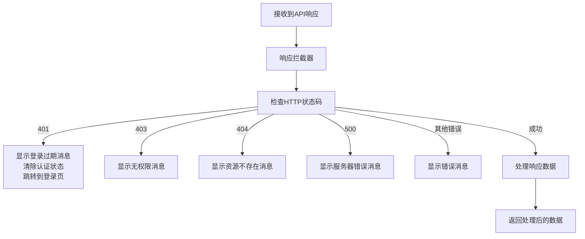
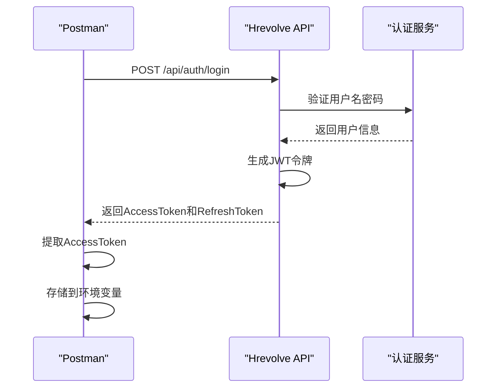
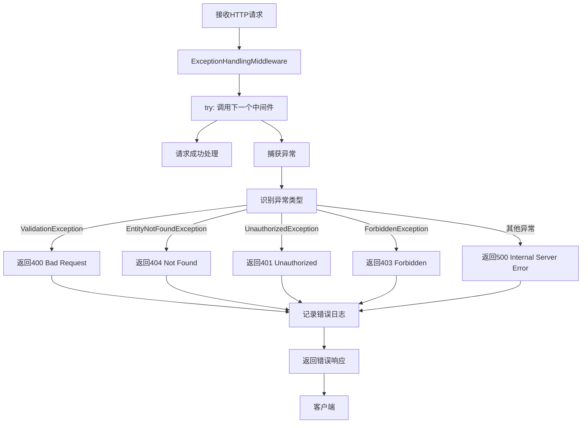

# 调试指南

<cite>
**本文档中引用的文件**  
- [Program.cs](file://Backend/Hrevolve.Web/Program.cs)
- [appsettings.Development.json](file://Backend/Hrevolve.Web/appsettings.Development.json)
- [launchSettings.json](file://Backend/Hrevolve.Web/Properties/launchSettings.json)
- [vite.config.ts](file://Frontend/hrevolve-web/vite.config.ts)
- [request.ts](file://Frontend/hrevolve-web/src/api/request.ts)
- [LoggingBehavior.cs](file://Backend/Hrevolve.Application/Behaviors/LoggingBehavior.cs)
- [ValidationBehavior.cs](file://Backend/Hrevolve.Application/Behaviors/ValidationBehavior.cs)
- [ExceptionHandlingMiddleware.cs](file://Backend/Hrevolve.Web/Middleware/ExceptionHandlingMiddleware.cs)
- [DependencyInjection.cs](file://Backend/Hrevolve.Application/DependencyInjection.cs)
- [AuthController.cs](file://Backend/Hrevolve.Web/Controllers/AuthController.cs)
- [LoginCommand.cs](file://Backend/Hrevolve.Application/Identity/Commands/LoginCommand.cs)
- [auth.ts](file://Frontend/hrevolve-web/src/stores/auth.ts)
</cite>

## 目录
1. [简介](#简介)
2. [后端API调试配置](#后端api调试配置)
3. [MediatR管道行为拦截器调试](#mediatr管道行为拦截器调试)
4. [前端开发服务器代理配置](#前端开发服务器代理配置)
5. [Axios拦截器使用](#axios拦截器使用)
6. [Postman API测试示例](#postman-api测试示例)
7. [Serilog日志输出与异常定位](#serilog日志输出与异常定位)
8. [错误处理流程分析](#错误处理流程分析)

## 简介
本文档提供Hrevolve人力资源管理系统前后端联合调试的详细操作指南。内容涵盖后端API调试配置、MediatR管道行为拦截器调试技巧、前端Vite开发服务器代理设置、Axios拦截器使用方法、Postman测试用例示例以及Serilog日志和异常处理机制的分析。

## 后端API调试配置

### Visual Studio调试设置
在Visual Studio中调试Hrevolve后端API时，需确保项目启动配置正确。`launchSettings.json`文件定义了多个启动配置文件，包括`http`和`https`配置。



**Diagram sources**
- [launchSettings.json](file://Backend/Hrevolve.Web/Properties/launchSettings.json#L1-L42)

### VS Code调试设置
在VS Code中调试需要配置`.vscode/launch.json`文件。以下配置适用于Hrevolve项目：

```json
{
  "version": "0.2.0",
  "configurations": [
    {
      "name": "Hrevolve.Web",
      "type": "coreclr",
      "request": "launch",
      "preLaunchTask": "build",
      "program": "${workspaceFolder}/Backend/Hrevolve.Web/bin/Debug/net10.0/Hrevolve.Web.dll",
      "args": [],
      "cwd": "${workspaceFolder}/Backend/Hrevolve.Web",
      "stopAtEntry": false,
      "serverReadyAction": {
        "action": "openExternally",
        "pattern": "\\bNow listening on:\\s+(https?://\\S+)"
      },
      "env": {
        "ASPNETCORE_ENVIRONMENT": "Development"
      },
      "sourceFileMap": {
        "/Views": "${workspaceFolder}/Views"
      }
    }
  ]
}
```

**Section sources**
- [launchSettings.json](file://Backend/Hrevolve.Web/Properties/launchSettings.json#L1-L42)

## MediatR管道行为拦截器调试

### LoggingBehavior调试技巧
`LoggingBehavior`是MediatR管道中的日志记录行为，用于记录请求处理的开始、完成和异常信息。



**Diagram sources**
- [LoggingBehavior.cs](file://Backend/Hrevolve.Application/Behaviors/LoggingBehavior.cs#L1-L51)
- [AuthController.cs](file://Backend/Hrevolve.Web/Controllers/AuthController.cs#L1-L83)

### ValidationBehavior调试技巧
`ValidationBehavior`是MediatR管道中的验证行为，自动执行FluentValidation验证规则。



**Diagram sources**
- [ValidationBehavior.cs](file://Backend/Hrevolve.Application/Behaviors/ValidationBehavior.cs#L1-L43)
- [LoginCommand.cs](file://Backend/Hrevolve.Application/Identity/Commands/LoginCommand.cs#L31-L41)

**Section sources**
- [ValidationBehavior.cs](file://Backend/Hrevolve.Application/Behaviors/ValidationBehavior.cs#L1-L43)
- [DependencyInjection.cs](file://Backend/Hrevolve.Application/DependencyInjection.cs#L1-L26)

## 前端开发服务器代理配置

### Vite代理配置解决跨域问题
前端项目使用Vite作为开发服务器，通过配置代理解决与后端API的跨域问题。



**Diagram sources**
- [vite.config.ts](file://Frontend/hrevolve-web/vite.config.ts#L1-L27)

### 代理配置详解
Vite的代理配置在`vite.config.ts`文件中定义，将所有以`/api`开头的请求代理到后端API服务。

```typescript
server: {
  port: 5173,
  proxy: {
    '/api': {
      target: 'https://localhost:5225',
      changeOrigin: true,
      secure: false, // 允许自签名证书
    },
  },
}
```

此配置确保前端开发时，API请求能够正确路由到后端服务，避免跨域问题。

**Section sources**
- [vite.config.ts](file://Frontend/hrevolve-web/vite.config.ts#L1-L27)

## Axios拦截器使用

### 请求拦截器配置
Axios请求拦截器用于在发送请求前添加认证信息和其他必要头信息。



**Diagram sources**
- [request.ts](file://Frontend/hrevolve-web/src/api/request.ts#L1-L36)

### 响应拦截器配置
Axios响应拦截器用于统一处理API响应，包括错误处理和用户界面反馈。



**Diagram sources**
- [request.ts](file://Frontend/hrevolve-web/src/api/request.ts#L38-L81)

### 拦截器代码实现
```typescript
// 请求拦截器
service.interceptors.request.use(
  (config) => {
    const authStore = useAuthStore();
    
    // 添加认证Token
    if (authStore.token) {
      config.headers.Authorization = `Bearer ${authStore.token}`;
    }
    
    // 添加租户ID
    if (authStore.tenantId && authStore.tenantId.trim()) {
      config.headers['X-Tenant-Id'] = authStore.tenantId;
    }
    
    return config;
  }
);

// 响应拦截器
service.interceptors.response.use(
  (response) => {
    return {
      ...response,
      data: {
        success: true,
        data: response.data,
        message: 'success'
      }
    };
  },
  (error) => {
    const { response } = error;
    
    if (response) {
      switch (response.status) {
        case 401:
          ElMessage.error('登录已过期，请重新登录');
          const authStore = useAuthStore();
          authStore.logout();
          window.location.href = '/login';
          break;
        case 403:
          ElMessage.error('没有权限访问该资源');
          break;
      }
    }
    
    return Promise.reject(error);
  }
);
```

**Section sources**
- [request.ts](file://Frontend/hrevolve-web/src/api/request.ts#L1-L107)
- [auth.ts](file://Frontend/hrevolve-web/src/stores/auth.ts#L1-L119)

## Postman API测试示例

### 登录API测试
使用Postman测试登录API时，需要正确设置请求参数和认证令牌。



**Diagram sources**
- [AuthController.cs](file://Backend/Hrevolve.Web/Controllers/AuthController.cs#L1-L83)
- [LoginCommand.cs](file://Backend/Hrevolve.Application/Identity/Commands/LoginCommand.cs#L1-L169)

### JWT认证令牌传递
在Postman中测试需要认证的API时，需要在请求头中添加JWT令牌。

```json
{
  "request": {
    "method": "GET",
    "header": [
      {
        "key": "Authorization",
        "value": "Bearer {{access_token}}",
        "type": "text"
      },
      {
        "key": "X-Tenant-Id",
        "value": "{{tenant_id}}",
        "type": "text"
      }
    ],
    "url": "https://localhost:5225/api/employees/me"
  }
}
```

其中`{{access_token}}`和`{{tenant_id}}`是Postman环境变量，可以在登录API成功响应后自动提取并设置。

**Section sources**
- [AuthController.cs](file://Backend/Hrevolve.Web/Controllers/AuthController.cs#L59-L80)
- [request.ts](file://Frontend/hrevolve-web/src/api/request.ts#L21-L28)

## Serilog日志输出与异常定位

### Serilog配置
Serilog在`Program.cs`文件中配置，用于记录应用程序的详细日志信息。

```csharp
Log.Logger = new LoggerConfiguration()
    .ReadFrom.Configuration(builder.Configuration)
    .Enrich.FromLogContext()
    .Enrich.WithProperty("Application", "Hrevolve")
    .WriteTo.Console()
    .CreateLogger();
```

在`appsettings.Development.json`中配置了详细的日志级别：

```json
"Serilog": {
  "MinimumLevel": {
    "Default": "Debug",
    "Override": {
      "Microsoft": "Information",
      "Microsoft.EntityFrameworkCore.Database.Command": "Information"
    }
  }
}
```

**Section sources**
- [Program.cs](file://Backend/Hrevolve.Web/Program.cs#L20-L27)
- [appsettings.Development.json](file://Backend/Hrevolve.Web/appsettings.Development.json#L16-L23)

### 日志输出示例
启用Serilog详细日志后，可以观察到以下类型的日志输出：

```
[INF] 处理请求 LoginCommand - 用户: , 租户: 
[INF] 请求 LoginCommand 处理完成 - 耗时: 123ms
[ERR] 请求 CreateEmployeeCommand 处理失败 - 耗时: 45ms, 错误: 验证失败
```

这些日志对于调试和定位问题非常有帮助，特别是在分析请求处理流程和性能瓶颈时。

**Section sources**
- [LoggingBehavior.cs](file://Backend/Hrevolve.Application/Behaviors/LoggingBehavior.cs#L21-L35)

## 错误处理流程分析

### ExceptionHandlingMiddleware工作流程
全局异常处理中间件`ExceptionHandlingMiddleware`捕获所有未处理的异常，并返回统一格式的错误响应。



**Diagram sources**
- [ExceptionHandlingMiddleware.cs](file://Backend/Hrevolve.Web/Middleware/ExceptionHandlingMiddleware.cs#L1-L97)

### 中间件注册顺序
在`Program.cs`中，异常处理中间件必须在其他业务中间件之前注册，以确保能够捕获所有异常。

```csharp
// 全局异常处理必须在其他中间件之前
app.UseMiddleware<ExceptionHandlingMiddleware>();

app.UseHttpsRedirection();
app.UseAuthentication();
app.UseAuthorization();
app.UseMiddleware<TenantMiddleware>();
app.UseMiddleware<CurrentUserMiddleware>();
```

**Section sources**
- [Program.cs](file://Backend/Hrevolve.Web/Program.cs#L141-L154)
- [ExceptionHandlingMiddleware.cs](file://Backend/Hrevolve.Web/Middleware/ExceptionHandlingMiddleware.cs#L1-L97)