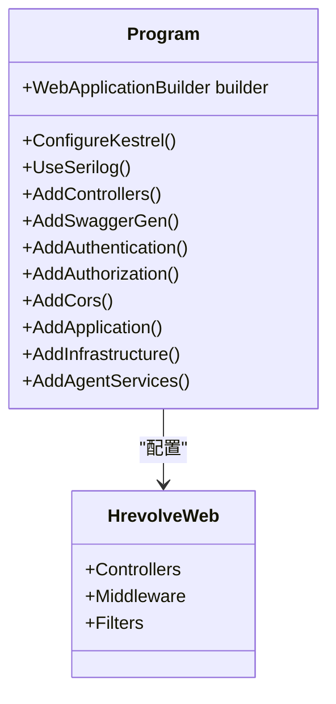
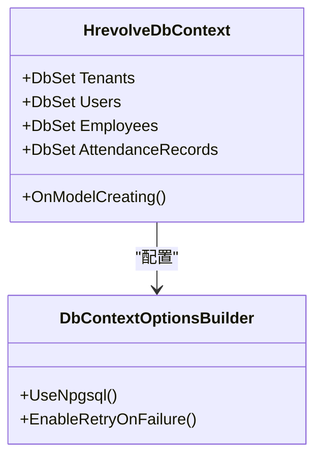
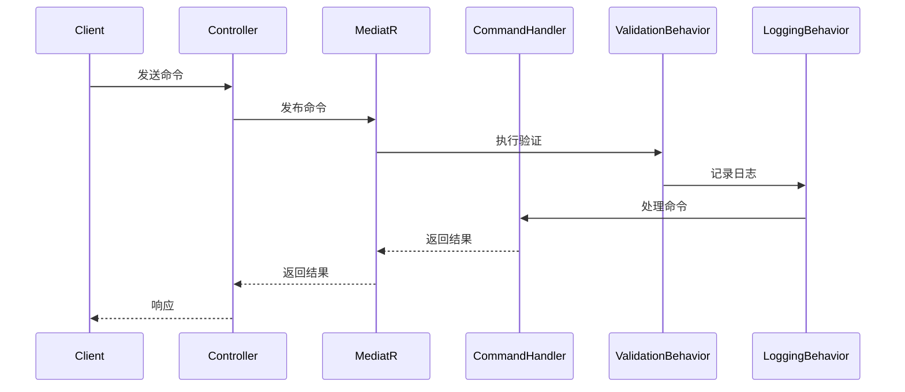
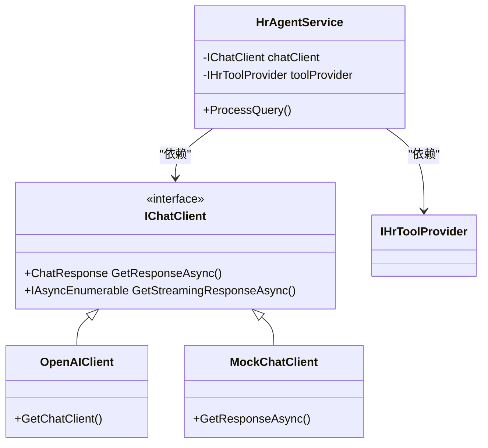
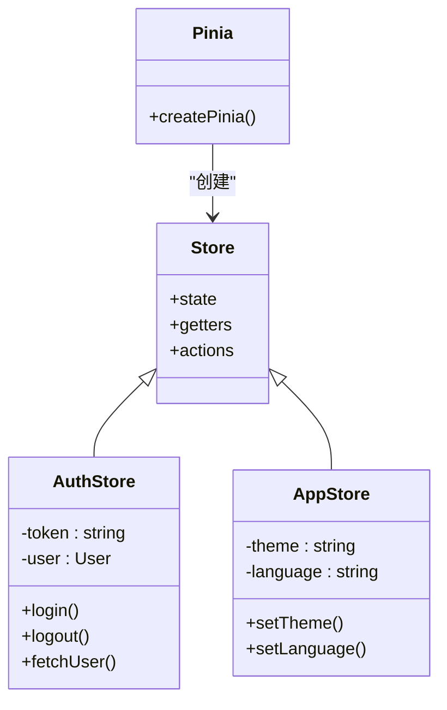
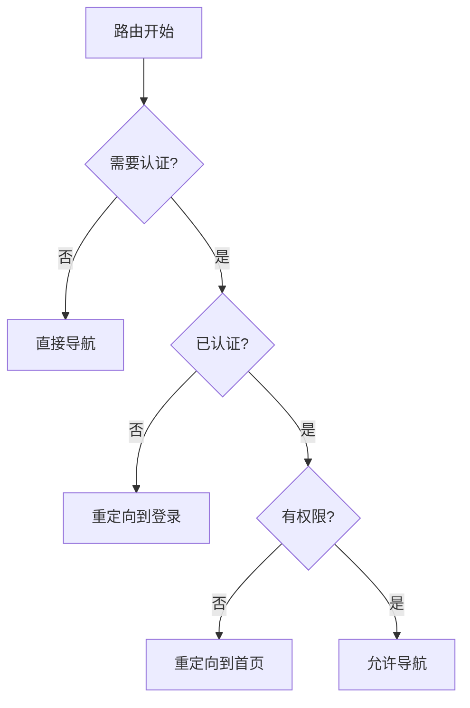

# 技术栈与依赖

<cite>
**本文档引用的文件**  
- [Hrevolve.Web.csproj](file://Backend/Hrevolve.Web/Hrevolve.Web.csproj)
- [Hrevolve.Application.csproj](file://Backend/Hrevolve.Application/Hrevolve.Application.csproj)
- [Hrevolve.Infrastructure.csproj](file://Backend/Hrevolve.Infrastructure/Hrevolve.Infrastructure.csproj)
- [Hrevolve.Agent.csproj](file://Backend/Hrevolve.Agent/Hrevolve.Agent.csproj)
- [package.json](file://Frontend/hrevolve-web/package.json)
- [appsettings.json](file://Backend/Hrevolve.Web/appsettings.json)
- [appsettings.Development.json](file://Backend/Hrevolve.Web/appsettings.Development.json)
- [Program.cs](file://Backend/Hrevolve.Web/Program.cs)
- [DependencyInjection.cs](file://Backend/Hrevolve.Application/DependencyInjection.cs)
- [DependencyInjection.cs](file://Backend/Hrevolve.Infrastructure/DependencyInjection.cs)
- [DependencyInjection.cs](file://Backend/Hrevolve.Agent/DependencyInjection.cs)
- [main.ts](file://Frontend/hrevolve-web/src/main.ts)
- [index.ts](file://Frontend/hrevolve-web/src/stores/index.ts)
- [router/index.ts](file://Frontend/hrevolve-web/src/router/index.ts)
</cite>

## 目录
1. [技术栈概览](#技术栈概览)  
2. [后端技术栈](#后端技术栈)  
   2.1 [.NET 10 与 ASP.NET Core Web API](#net-10-与-aspnet-core-web-api)  
   2.2 [Entity Framework Core](#entity-framework-core)  
   2.3 [MediatR 与 CQRS 模式](#mediatr-与-cqrs-模式)  
   2.4 [FluentValidation](#fluentvalidation)  
   2.5 [Serilog](#serilog)  
   2.6 [Microsoft Agent Framework](#microsoft-agent-framework)  
3. [前端技术栈](#前端技术栈)  
   3.1 [Vue 3 与 Vite](#vue-3-与-vite)  
   3.2 [TypeScript](#typescript)  
   3.3 [Pinia 状态管理](#pinia-状态管理)  
   3.4 [Element Plus 与 UI 组件](#element-plus-与-ui-组件)  
   3.5 [Vue Router 路由管理](#vue-router-路由管理)  
   3.6 [Axios HTTP 客户端](#axios-http-客户端)  
4. [数据库与缓存](#数据库与缓存)  
   4.1 [PostgreSQL 16](#postgresql-16)  
   4.2 [Redis 7](#redis-7)  
5. [开发环境依赖](#开发环境依赖)  
   5.1 [.NET SDK](#net-sdk)  
   5.2 [Node.js 18+](#nodejs-18)  
   5.3 [OpenAI API 密钥](#openai-api-密钥)  
6. [关键配置文件解析](#关键配置文件解析)  
   6.1 [package.json 依赖分析](#packagejson-依赖分析)  
   6.2 [appsettings.json 配置解读](#appsettingsjson-配置解读)  
7. [技术选型优势](#技术选型优势)  
   7.1 [多租户支持](#多租户支持)  
   7.2 [高性能设计](#高性能设计)  
   7.3 [可扩展性架构](#可扩展性架构)  
8. [兼容性矩阵](#兼容性矩阵)  
9. [推荐开发工具链](#推荐开发工具链)

## 技术栈概览

Hrevolve 项目采用现代化全栈技术组合，后端基于 .NET 10 构建，前端采用 Vue 3 生态，数据库使用 PostgreSQL 16，缓存采用 Redis 7。项目通过分层架构实现关注点分离，利用 CQRS 模式提升系统可维护性，结合 AI Agent 增强智能化服务能力。整体技术栈设计兼顾开发效率、运行性能和系统可扩展性。

**本节引用文件**  
- [Hrevolve.Web.csproj](file://Backend/Hrevolve.Web/Hrevolve.Web.csproj)
- [package.json](file://Frontend/hrevolve-web/package.json)

## 后端技术栈

### .NET 10 与 ASP.NET Core Web API

项目后端基于 .NET 10 构建，采用 ASP.NET Core Web API 作为核心 Web 框架。所有项目文件（Hrevolve.Web、Hrevolve.Application、Hrevolve.Domain 等）均配置为 `net10.0` 目标框架，确保统一的运行时环境。

Web API 层通过 `Program.cs` 配置 Kestrel 服务器，支持 HTTP/1.1、HTTP/2 和 HTTP/3 协议，提升现代浏览器的通信效率。API 文档通过 Swagger (Swashbuckle.AspNetCore) 自动生成，便于前后端协作。



**图示来源**  
- [Program.cs](file://Backend/Hrevolve.Web/Program.cs)
- [Hrevolve.Web.csproj](file://Backend/Hrevolve.Web/Hrevolve.Web.csproj)

**本节引用文件**  
- [Hrevolve.Web.csproj](file://Backend/Hrevolve.Web/Hrevolve.Web.csproj)
- [Program.cs](file://Backend/Hrevolve.Web/Program.cs)

### Entity Framework Core

项目使用 Entity Framework Core 10 作为 ORM 框架，配合 Npgsql.EntityFrameworkCore.PostgreSQL 提供程序实现与 PostgreSQL 16 的集成。采用代码优先（Code-First）的迁移策略，通过 `dotnet ef` 工具管理数据库模式变更。

在 `Hrevolve.Infrastructure.csproj` 中引用了 `Microsoft.EntityFrameworkCore` 和 `Npgsql.EntityFrameworkCore.PostgreSQL` 包，版本均为 10.0.0。数据库上下文 `HrevolveDbContext` 配置了连接重试机制（最多3次），增强生产环境的稳定性。



**图示来源**  
- [Hrevolve.Infrastructure.csproj](file://Backend/Hrevolve.Infrastructure/Hrevolve.Infrastructure.csproj)
- [DependencyInjection.cs](file://Backend/Hrevolve.Infrastructure/DependencyInjection.cs)

**本节引用文件**  
- [Hrevolve.Infrastructure.csproj](file://Backend/Hrevolve.Infrastructure/Hrevolve.Infrastructure.csproj)
- [DependencyInjection.cs](file://Backend/Hrevolve.Infrastructure/DependencyInjection.cs)

### MediatR 与 CQRS 模式

项目采用 MediatR 库（版本 12.4.1）实现 CQRS（命令查询职责分离）模式。在 `Hrevolve.Application.csproj` 中引用 MediatR，并通过 `AddMediatR` 扩展方法注册服务。

应用层分为 Commands 和 Queries 两个目录，分别处理写操作和读操作。通过管道行为（Pipeline Behavior）实现横切关注点，如 `ValidationBehavior` 和 `LoggingBehavior`，在请求处理流程中自动执行验证和日志记录。



**图示来源**  
- [Hrevolve.Application.csproj](file://Backend/Hrevolve.Application/Hrevolve.Application.csproj)
- [DependencyInjection.cs](file://Backend/Hrevolve.Application/DependencyInjection.cs)

**本节引用文件**  
- [Hrevolve.Application.csproj](file://Backend/Hrevolve.Application/Hrevolve.Application.csproj)
- [DependencyInjection.cs](file://Backend/Hrevolve.Application/DependencyInjection.cs)

### FluentValidation

项目使用 FluentValidation（版本 11.11.0）实现领域模型的验证逻辑。验证规则与业务逻辑分离，提高了代码的可维护性。在 `Hrevolve.Application` 层中，通过 `AddValidatorsFromAssembly` 方法自动注册所有验证器。

验证行为通过 MediatR 的管道机制集成，在命令执行前自动验证输入数据，确保领域对象的完整性。

**本节引用文件**  
- [Hrevolve.Application.csproj](file://Backend/Hrevolve.Application/Hrevolve.Application.csproj)
- [DependencyInjection.cs](file://Backend/Hrevolve.Application/DependencyInjection.cs)

### Serilog

项目采用 Serilog 作为日志框架，替代 ASP.NET Core 默认的日志系统。在 `Hrevolve.Web.csproj` 中引用 `Serilog.AspNetCore` 包（版本 8.0.3）。

通过 `appsettings.json` 配置日志级别和输出目标，支持控制台输出和结构化日志记录。在 `Program.cs` 中配置 Serilog，使用 `Enrich.FromLogContext()` 等方法丰富日志上下文信息。

```json
"Serilog": {
  "MinimumLevel": {
    "Default": "Information",
    "Override": {
      "Microsoft": "Warning",
      "Microsoft.Hosting.Lifetime": "Information"
    }
  },
  "WriteTo": [
    {
      "Name": "Console",
      "Args": {
        "outputTemplate": "[{Timestamp:HH:mm:ss} {Level:u3}] {Message:lj} {Properties:j}{NewLine}{Exception}"
      }
    }
  ]
}
```

**本节引用文件**  
- [Hrevolve.Web.csproj](file://Backend/Hrevolve.Web/Hrevolve.Web.csproj)
- [appsettings.json](file://Backend/Hrevolve.Web/appsettings.json)
- [Program.cs](file://Backend/Hrevolve.Web/Program.cs)

### Microsoft Agent Framework

项目集成 Microsoft Agent Framework（预览版）实现 AI 助手功能。在 `Hrevolve.Agent.csproj` 中引用 `Microsoft.Agents.AI` 和 `Microsoft.Agents.AI.OpenAI` 包。

通过 `IChatClient` 接口抽象 AI 服务，支持 OpenAI、Azure OpenAI 和模拟客户端三种模式。AI 配置在 `appsettings.json` 中定义，包括模型选择、API 密钥等。开发环境使用 `MockChatClient` 避免产生费用。



**图示来源**  
- [Hrevolve.Agent.csproj](file://Backend/Hrevolve.Agent/Hrevolve.Agent.csproj)
- [DependencyInjection.cs](file://Backend/Hrevolve.Agent/DependencyInjection.cs)

**本节引用文件**  
- [Hrevolve.Agent.csproj](file://Backend/Hrevolve.Agent/Hrevolve.Agent.csproj)
- [DependencyInjection.cs](file://Backend/Hrevolve.Agent/DependencyInjection.cs)
- [appsettings.json](file://Backend/Hrevolve.Web/appsettings.json)

## 前端技术栈

### Vue 3 与 Vite

前端基于 Vue 3 构建，采用 Vite 作为构建工具。在 `package.json` 中，`vue` 版本为 `^3.5.24`，`vite` 版本为 `npm:rolldown-vite@7.2.5`。

Vite 提供了快速的开发服务器启动和热模块替换（HMR），显著提升开发体验。生产构建通过 `vite build` 命令执行，结合 `vue-tsc` 进行类型检查。

**本节引用文件**  
- [package.json](file://Frontend/hrevolve-web/package.json)

### TypeScript

项目使用 TypeScript（版本 ~5.9.3）增强代码的类型安全。通过 `tsconfig.json` 配置编译选项，`vite.config.ts` 提供 Vite 的 TypeScript 配置。

类型定义文件 `types/index.ts` 集中管理项目特定类型，提高代码的可维护性。

**本节引用文件**  
- [package.json](file://Frontend/hrevolve-web/package.json)

### Pinia 状态管理

项目采用 Pinia（版本 ^3.0.4）作为状态管理库。在 `src/stores/index.ts` 中创建 Pinia 实例，并导出 `useAuthStore` 和 `useAppStore`。

状态管理模块包括认证状态、应用配置等，通过组合式 API 在组件中使用，实现跨组件的状态共享。



**图示来源**  
- [package.json](file://Frontend/hrevolve-web/package.json)
- [src/stores/index.ts](file://Frontend/hrevolve-web/src/stores/index.ts)

**本节引用文件**  
- [package.json](file://Frontend/hrevolve-web/package.json)
- [src/stores/index.ts](file://Frontend/hrevolve-web/src/stores/index.ts)

### Element Plus 与 UI 组件

项目使用 Element Plus（版本 ^2.13.0）作为 UI 组件库。在 `main.ts` 中通过 `app.use(ElementPlus)` 全局注册组件。

引入 `@element-plus/icons-vue` 提供图标支持，并在 `App.vue` 中通过 `el-config-provider` 配置国际化。项目采用 SCSS 预处理器，通过 `element-dark.scss` 实现暗色主题。

**本节引用文件**  
- [package.json](file://Frontend/hrevolve-web/package.json)
- [main.ts](file://Frontend/hrevolve-web/src/main.ts)
- [App.vue](file://Frontend/hrevolve-web/src/App.vue)

### Vue Router 路由管理

项目使用 Vue Router（版本 ^4.6.4）实现客户端路由。在 `src/router/index.ts` 中定义路由配置，支持嵌套路由和路由守卫。

通过 `router.beforeEach` 实现全局前置守卫，处理认证检查和权限验证。路由配置包含元信息（meta），用于控制页面标题、权限要求等。



**图示来源**  
- [package.json](file://Frontend/hrevolve-web/package.json)
- [src/router/index.ts](file://Frontend/hrevolve-web/src/router/index.ts)

**本节引用文件**  
- [package.json](file://Frontend/hrevolve-web/package.json)
- [src/router/index.ts](file://Frontend/hrevolve-web/src/router/index.ts)

### Axios HTTP 客户端

项目使用 Axios（版本 ^1.13.2）作为 HTTP 客户端。在 `src/api/request.ts` 中封装 Axios 实例，配置基础 URL、超时时间和请求拦截器。

API 模块按功能组织在 `src/api/modules` 目录下，如 `employee.ts`、`leave.ts` 等，提供类型安全的 API 调用方法。

**本节引用文件**  
- [package.json](file://Frontend/hrevolve-web/package.json)

## 数据库与缓存

### PostgreSQL 16

项目使用 PostgreSQL 16 作为主数据库。在 `appsettings.json` 中配置连接字符串，使用 `Npgsql` 提供程序连接数据库。

数据库设计支持多租户架构，`Tenants` 表存储租户信息，包括连接字符串、加密密钥等。通过 EF Core 迁移管理数据库模式变更，确保环境间的一致性。

**本节引用文件**  
- [appsettings.json](file://Backend/Hrevolve.Web/appsettings.json)
- [Hrevolve.Infrastructure.csproj](file://Backend/Hrevolve.Infrastructure/Hrevolve.Infrastructure.csproj)

### Redis 7

项目使用 Redis 7 作为分布式缓存。在 `appsettings.json` 中配置 Redis 连接信息，通过 `Microsoft.Extensions.Caching.StackExchangeRedis` 包集成。

缓存用于存储会话令牌、租户上下文、MFA 代码等临时数据，提升系统性能。在 `Hrevolve.Infrastructure` 层通过 `AddStackExchangeRedisCache` 方法注册缓存服务。

**本节引用文件**  
- [appsettings.json](file://Backend/Hrevolve.Web/appsettings.json)
- [Hrevolve.Infrastructure.csproj](file://Backend/Hrevolve.Infrastructure/Hrevolve.Infrastructure.csproj)
- [DependencyInjection.cs](file://Backend/Hrevolve.Infrastructure/DependencyInjection.cs)

## 开发环境依赖

### .NET SDK

开发环境需要安装 .NET 10 SDK，用于编译和运行后端项目。通过 `dotnet restore` 恢复 NuGet 包，`dotnet build` 构建项目，`dotnet run` 启动应用。

**本节引用文件**  
- [Hrevolve.Web.csproj](file://Backend/Hrevolve.Web/Hrevolve.Web.csproj)

### Node.js 18+

前端开发需要 Node.js 18 或更高版本。通过 `npm install` 安装 npm 包，`npm run dev` 启动开发服务器，`npm run build` 构建生产版本。

**本节引用文件**  
- [package.json](file://Frontend/hrevolve-web/package.json)

### OpenAI API 密钥

AI 功能需要 OpenAI API 密钥。在 `appsettings.json` 的 `AI` 部分配置 `ApiKey` 和 `Model`。开发环境可使用模拟模式，避免产生费用。

```json
"AI": {
  "Provider": "OpenAI",
  "ApiKey": "your-api-key-here",
  "Model": "gpt-4o"
}
```

**本节引用文件**  
- [appsettings.json](file://Backend/Hrevolve.Web/appsettings.json)
- [appsettings.Development.json](file://Backend/Hrevolve.Web/appsettings.Development.json)

## 关键配置文件解析

### package.json 依赖分析

`package.json` 文件定义了前端项目的依赖关系。主要依赖包括：

- **核心框架**: Vue 3, Vue Router, Pinia
- **UI 组件**: Element Plus, @element-plus/icons-vue
- **工具库**: Axios, dayjs, eCharts
- **开发依赖**: Vite, TypeScript, @vitejs/plugin-vue

通过 `overrides` 字段指定使用 `rolldown-vite` 替代默认 Vite，可能用于优化构建性能。

**本节引用文件**  
- [package.json](file://Frontend/hrevolve-web/package.json)

### appsettings.json 配置解读

`appsettings.json` 是后端主要配置文件，包含以下关键配置：

- **ConnectionStrings**: 数据库和 Redis 连接字符串
- **Jwt**: JWT 认证配置，包括密钥、签发者和受众
- **AI**: AI 服务配置，支持多种提供商
- **Serilog**: 日志配置，定义日志级别和输出格式

开发环境配置在 `appsettings.Development.json` 中重写，使用不同的数据库和更详细的日志级别。

```json
"ConnectionStrings": {
  "DefaultConnection": "Host=localhost;Port=5432;Database=hrevolve;Username=postgres;Password=postgres",
  "Redis": "localhost:6379"
}
```

**本节引用文件**  
- [appsettings.json](file://Backend/Hrevolve.Web/appsettings.json)
- [appsettings.Development.json](file://Backend/Hrevolve.Web/appsettings.Development.json)

## 技术选型优势

### 多租户支持

项目通过 `ITenantResolver` 和 `TenantMiddleware` 实现多租户支持。租户信息存储在数据库中，通过域名或代码解析。Redis 缓存租户上下文，减少数据库查询。

`HrevolveDbContext` 在查询时自动应用租户过滤器，确保数据隔离。每个租户可配置独立的数据库连接字符串，支持完全隔离的数据库实例。

**本节引用文件**  
- [TenantResolver.cs](file://Backend/Hrevolve.Infrastructure/MultiTenancy/TenantResolver.cs)
- [appsettings.json](file://Backend/Hrevolve.Web/appsettings.json)

### 高性能设计

项目通过多种技术实现高性能：
- 使用 Redis 缓存频繁访问的数据
- EF Core 启用连接重试，提高数据库操作的可靠性
- Vite 提供快速的前端构建和热更新
- Kestrel 服务器支持 HTTP/3，减少网络延迟
- 异步编程模型避免阻塞线程

**本节引用文件**  
- [DependencyInjection.cs](file://Backend/Hrevolve.Infrastructure/DependencyInjection.cs)
- [Program.cs](file://Backend/Hrevolve.Web/Program.cs)

### 可扩展性架构

项目采用分层架构和微服务思想，各层职责清晰：
- **Domain**: 领域模型和业务规则
- **Application**: 应用服务和用例
- **Infrastructure**: 数据访问和外部服务集成
- **Web**: API 接口和表现层

通过 MediatR 实现松耦合的命令处理，便于功能扩展。插件化设计允许动态添加 AI 工具和服务。

**本节引用文件**  
- 项目结构中的各层 .csproj 文件

## 兼容性矩阵

| 技术 | 版本 | 兼容性说明 |
|------|------|------------|
| .NET SDK | 10.0 | 后端所有项目统一使用 |
| ASP.NET Core | 10.0.1 | Web 层核心框架 |
| Entity Framework Core | 10.0.0 | ORM 框架 |
| PostgreSQL | 16 | 主数据库 |
| Redis | 7 | 缓存服务 |
| Vue | 3.5.24 | 前端框架 |
| Vite | 7.2.5 | 构建工具 |
| TypeScript | 5.9.3 | 类型系统 |
| Pinia | 3.0.4 | 状态管理 |
| Element Plus | 2.13.0 | UI 组件库 |
| Axios | 1.13.2 | HTTP 客户端 |

**本节引用文件**  
- 所有 .csproj 和 package.json 文件

## 推荐开发工具链

- **IDE**: Visual Studio 2022 或 Visual Studio Code
- **数据库工具**: pgAdmin 或 DBeaver
- **API 测试**: Swagger UI 或 Postman
- **版本控制**: Git
- **包管理**: NuGet (.NET), npm (前端)
- **构建工具**: dotnet CLI, Vite
- **调试工具**: .NET Debugger, Chrome DevTools

开发环境应安装 .NET 10 SDK 和 Node.js 18+，配置环境变量管理敏感信息如数据库密码和 API 密钥。

**本节引用文件**  
- 项目根目录的 .gitignore 文件