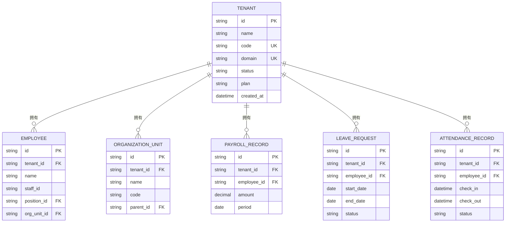

# 多租户策略

<cite>
**本文档引用的文件**  
- [Tenant.cs](file://Backend/Hrevolve.Domain/Tenants/Tenant.cs)
- [TenantResolver.cs](file://Backend/Hrevolve.Infrastructure/MultiTenancy/TenantResolver.cs)
- [ITenantContext.cs](file://Backend/Hrevolve.Shared/MultiTenancy/ITenantContext.cs)
- [TenantInfo.cs](file://Backend/Hrevolve.Shared/MultiTenancy/TenantInfo.cs)
- [HrevolveDbContext.cs](file://Backend/Hrevolve.Infrastructure/Persistence/HrevolveDbContext.cs)
- [AuditableEntity.cs](file://Backend/Hrevolve.Domain/Common/AuditableEntity.cs)
- [TenantConfiguration.cs](file://Backend/Hrevolve.Infrastructure/Persistence/Configurations/TenantConfiguration.cs)
- [TenantMiddleware.cs](file://Backend/Hrevolve.Web/Middleware/TenantMiddleware.cs)
- [DatabaseDesign.drawio](file://Design/DatabaseDesign.drawio)
</cite>

## 目录
1. [引言](#引言)
2. [多租户数据隔离策略概述](#多租户数据隔离策略概述)
3. [查询重写实现机制](#查询重写实现机制)
4. [租户解析与上下文集成](#租户解析与上下文集成)
5. [行级安全(RLS)协同工作](#行级安全rls协同工作)
6. [实体关系与数据视图](#实体关系与数据视图)
7. [结论](#结论)

## 引言
Hrevolve系统采用SaaS架构，为多个租户提供人力资源管理服务。为确保各租户间数据的完全隔离与安全，系统实现了两种核心数据隔离策略：查询重写（Query Rewriting）和行级安全（Row-Level Security, RLS）。本文档将详细阐述这两种策略的实现机制，结合系统设计，说明每个租户如何拥有独立的数据视图。

## 多租户数据隔离策略概述
Hrevolve系统通过两种互补的策略实现多租户数据隔离：

1.  **查询重写 (Query Rewriting)**：在应用层，利用Entity Framework Core的全局查询过滤器（Global Query Filters），在所有数据查询操作中自动注入租户ID（TenantId）条件。这是系统数据隔离的核心机制。
2.  **行级安全 (RLS)**：在数据库层面，通过数据库的行级安全策略，为每个租户创建独立的数据库视图或安全策略，确保即使应用层出现漏洞，数据库也能提供第二层防护。

这两种策略协同工作，形成了纵深防御体系，确保了数据的绝对安全。

## 查询重写实现机制
查询重写是Hrevolve系统实现多租户隔离的主要手段，其核心在于Entity Framework Core的全局查询过滤器。

### 全局查询过滤器配置
在`HrevolveDbContext`的`OnModelCreating`方法中，系统配置了全局查询过滤器：
```csharp
protected override void OnModelCreating(ModelBuilder modelBuilder)
{
    // ...
    ConfigureTenantFilter(modelBuilder);
    // ...
}
```
`ConfigureTenantFilter`方法遍历模型中的所有实体类型，为所有继承自`AuditableEntity`的实体动态应用租户过滤器。

### 租户过滤器逻辑
`SetTenantFilter<T>`方法定义了过滤器的具体逻辑：
```csharp
modelBuilder.Entity<T>().HasQueryFilter(e => 
    context._tenantContextAccessor.TenantContext == null || 
    e.TenantId == context._tenantContextAccessor.TenantContext.TenantId);
```
该逻辑确保：
- 当前请求没有设置租户上下文时，查询不受限制（用于处理租户自身的查询）。
- 当前请求设置了租户上下文时，所有查询结果必须满足`TenantId`等于当前上下文中的租户ID。

### 基础实体设计
所有需要进行多租户隔离的实体都继承自`AuditableEntity`基类，该类定义了`TenantId`属性：
```csharp
public abstract class AuditableEntity : Entity
{
    public Guid TenantId { get; set; }
    // ...
}
```
这使得全局查询过滤器能够统一地应用于所有业务实体，如员工、考勤记录、薪资单等。

**Section sources**
- [HrevolveDbContext.cs](file://Backend/Hrevolve.Infrastructure/Persistence/HrevolveDbContext.cs#L71-L103)
- [AuditableEntity.cs](file://Backend/Hrevolve.Domain/Common/AuditableEntity.cs#L11-L11)

## 租户解析与上下文集成
租户隔离的实现依赖于在请求生命周期内准确识别并设置当前租户。Hrevolve通过中间件和上下文管理器完成这一过程。

### 租户解析器 (TenantResolver)
`TenantResolver`服务负责根据请求信息解析租户。它首先尝试从分布式缓存中获取租户信息，若缓存未命中，则从数据库查询。查询时使用`IgnoreQueryFilters()`方法绕过全局租户过滤器，以确保能查询到所有租户。
```csharp
var tenant = await _context.Tenants
    .IgnoreQueryFilters()
    .Where(t => t.Code == identifier || t.Domain == identifier)
    .FirstOrDefaultAsync();
```
解析成功后，租户信息会被缓存，以提高后续请求的性能。

### 租户上下文管理
系统使用`ITenantContextAccessor`接口和`TenantContextAccessor`实现类来管理租户上下文。`TenantContextAccessor`利用`AsyncLocal<T>`在当前异步上下文中存储租户信息，确保线程安全。

### 租户中间件 (TenantMiddleware)
`TenantMiddleware`是整个流程的入口。它在请求管道中执行以下步骤：
1.  **排除路径**：对健康检查、登录等公共API路径放行。
2.  **JWT优先**：优先从已认证用户的JWT令牌中提取租户ID。
3.  **请求解析**：如果JWT中没有租户信息，则从请求头、子域名或查询参数中解析租户标识。
4.  **设置上下文**：调用`TenantResolver`解析租户，并将租户信息设置到`TenantContextAccessor`中。
5.  **清理**：在请求结束时，清理租户上下文，防止内存泄漏。

**Section sources**
- [TenantResolver.cs](file://Backend/Hrevolve.Infrastructure/MultiTenancy/TenantResolver.cs#L29-L56)
- [ITenantContext.cs](file://Backend/Hrevolve.Shared/MultiTenancy/ITenantContext.cs#L38-L81)
- [TenantMiddleware.cs](file://Backend/Hrevolve.Web/Middleware/TenantMiddleware.cs#L21-L94)

## 行级安全(RLS)协同工作
虽然查询重写是主要的隔离手段，但Hrevolve系统也设计了与数据库行级安全（RLS）协同工作的能力，以提供更高级别的安全保障。

### RLS作为第二道防线
RLS策略在数据库层面强制执行访问控制。即使应用层的查询重写逻辑被绕过（例如，通过直接执行SQL注入），RLS也能阻止用户访问其他租户的数据。这为系统提供了纵深防御。

### 与查询重写的协同
-   **查询重写**：作为第一道防线，处理所有正常的业务查询，性能开销小，易于维护。
-   **RLS**：作为第二道防线，提供最终的安全保障，防止因应用层漏洞导致的数据泄露。

这种协同工作模式确保了即使在极端情况下，数据安全也能得到保障。

**Section sources**
- [RequirementsDocument.md](file://Design/RequirementsDocument.md#L87-L95)

## 实体关系与数据视图
结合`DatabaseDesign.drawio`中的设计，可以清晰地看到多租户架构下的数据视图。



**Diagram sources**
- [DatabaseDesign.drawio](file://Design/DatabaseDesign.drawio)
- [Tenant.cs](file://Backend/Hrevolve.Domain/Tenants/Tenant.cs#L8-L38)
- [AuditableEntity.cs](file://Backend/Hrevolve.Domain/Common/AuditableEntity.cs#L11-L11)

如上图所示，`Tenant`实体是整个数据模型的核心。所有业务实体（如`Employee`, `PayrollRecord`等）都通过`tenant_id`外键与`Tenant`关联。通过查询重写，每个租户的查询都被自动限制在`tenant_id`等于其自身ID的记录范围内，从而为每个租户创建了一个逻辑上独立的数据视图。

## 结论
Hrevolve系统通过在应用层实现基于Entity Framework Core全局查询过滤器的查询重写，并结合`TenantMiddleware`和`TenantResolver`服务进行租户解析与上下文管理，高效地实现了多租户数据隔离。同时，系统设计支持与数据库行级安全（RLS）协同工作，为数据安全提供了双重保障。这种架构既保证了开发的便捷性和性能，又确保了数据的绝对安全，是SaaS系统多租户设计的典范。