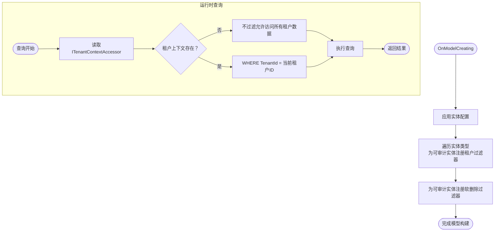

# 查询重写策略

<cite>
**本文引用的文件**
- [HrevolveDbContext.cs](file://Backend/Hrevolve.Infrastructure/Persistence/HrevolveDbContext.cs)
- [TenantMiddleware.cs](file://Backend/Hrevolve.Web/Middleware/TenantMiddleware.cs)
- [ITenantContext.cs](file://Backend/Hrevolve.Shared/MultiTenancy/ITenantContext.cs)
- [TenantResolver.cs](file://Backend/Hrevolve.Infrastructure/MultiTenancy/TenantResolver.cs)
- [AuditableEntity.cs](file://Backend/Hrevolve.Domain/Common/AuditableEntity.cs)
- [Tenant.cs](file://Backend/Hrevolve.Domain/Tenants/Tenant.cs)
- [Program.cs](file://Backend/Hrevolve.Web/Program.cs)
- [DependencyInjection.cs](file://Backend/Hrevolve.Infrastructure/DependencyInjection.cs)
- [ExceptionHandlingMiddleware.cs](file://Backend/Hrevolve.Web/Middleware/ExceptionHandlingMiddleware.cs)
</cite>

## 目录
1. [引言](#引言)
2. [项目结构](#项目结构)
3. [核心组件](#核心组件)
4. [架构总览](#架构总览)
5. [详细组件分析](#详细组件分析)
6. [依赖关系分析](#依赖关系分析)
7. [性能考量](#性能考量)
8. [故障排查指南](#故障排查指南)
9. [结论](#结论)

## 引言
本文件围绕Hrevolve系统如何通过Entity Framework Core的全局查询过滤器（Global Query Filters）实现多租户数据隔离展开，重点说明以下内容：
- 在所有继承自可审计基类的实体上自动应用租户ID过滤条件的技术细节；
- TenantMiddleware如何解析当前请求的租户并将其注入到ITenantContext中；
- HrevolveDbContext如何在OnModelCreating阶段为所有实体注册租户过滤器，并在查询时动态添加WHERE TenantId = @currentTenantId；
- 在租户解析等特定场景下使用IgnoreQueryFilters的必要性；
- 该策略的性能影响与缓存优化方案。

## 项目结构
Hrevolve采用分层架构，多租户能力贯穿Web层、共享层、基础设施层与领域层：
- Web层负责请求生命周期与中间件顺序（认证、异常处理、多租户上下文注入、当前用户上下文）；
- 基础设施层包含EF Core上下文、仓储、租户解析器与依赖注入配置；
- 共享层提供跨层通用接口（如ITenantContext）；
- 领域层定义可审计实体与租户实体，统一承载租户隔离字段。

图表来源
- [Program.cs](file://Backend/Hrevolve.Web/Program.cs#L141-L156)
- [TenantMiddleware.cs](file://Backend/Hrevolve.Web/Middleware/TenantMiddleware.cs#L21-L94)
- [ITenantContext.cs](file://Backend/Hrevolve.Shared/MultiTenancy/ITenantContext.cs#L1-L81)
- [HrevolveDbContext.cs](file://Backend/Hrevolve.Infrastructure/Persistence/HrevolveDbContext.cs#L63-L118)
- [TenantResolver.cs](file://Backend/Hrevolve.Infrastructure/MultiTenancy/TenantResolver.cs#L1-L108)
- [DependencyInjection.cs](file://Backend/Hrevolve.Infrastructure/DependencyInjection.cs#L1-L58)
- [AuditableEntity.cs](file://Backend/Hrevolve.Domain/Common/AuditableEntity.cs#L1-L48)
- [Tenant.cs](file://Backend/Hrevolve.Domain/Tenants/Tenant.cs#L1-L67)

章节来源
- [Program.cs](file://Backend/Hrevolve.Web/Program.cs#L141-L156)
- [DependencyInjection.cs](file://Backend/Hrevolve.Infrastructure/DependencyInjection.cs#L1-L58)

## 核心组件
- HrevolveDbContext：在OnModelCreating中注册全局查询过滤器，自动为所有可审计实体添加租户隔离与软删除过滤条件；在SaveChangesAsync中自动填充审计字段并执行软删除。
- TenantMiddleware：在请求进入控制器前解析租户上下文（优先JWT中的tenant_id，否则从Header/Subdomain/Query解析），并将租户信息注入ITenantContextAccessor；对健康检查、认证等例外路径放行。
- ITenantContext/Accessor/Context：提供线程安全的租户上下文存储，TenantContextAccessor使用AsyncLocal保证每个请求独立上下文。
- TenantResolver：根据租户标识或ID解析租户信息，使用分布式缓存提升性能；在解析租户元数据时使用IgnoreQueryFilters绕过租户过滤器，避免循环依赖与隔离失效。
- AuditableEntity：所有参与多租户隔离的实体均继承该基类，包含TenantId与IsDeleted等审计字段。
- Tenant：领域层租户实体，包含状态、域名、连接串等配置。

章节来源
- [HrevolveDbContext.cs](file://Backend/Hrevolve.Infrastructure/Persistence/HrevolveDbContext.cs#L63-L156)
- [TenantMiddleware.cs](file://Backend/Hrevolve.Web/Middleware/TenantMiddleware.cs#L1-L133)
- [ITenantContext.cs](file://Backend/Hrevolve.Shared/MultiTenancy/ITenantContext.cs#L1-L81)
- [TenantResolver.cs](file://Backend/Hrevolve.Infrastructure/MultiTenancy/TenantResolver.cs#L1-L108)
- [AuditableEntity.cs](file://Backend/Hrevolve.Domain/Common/AuditableEntity.cs#L1-L48)
- [Tenant.cs](file://Backend/Hrevolve.Domain/Tenants/Tenant.cs#L1-L67)

## 架构总览
下图展示了从请求进入系统到EF Core生成查询的完整链路，以及全局查询过滤器如何在运行时生效。

图表来源
- [Program.cs](file://Backend/Hrevolve.Web/Program.cs#L141-L156)
- [TenantMiddleware.cs](file://Backend/Hrevolve.Web/Middleware/TenantMiddleware.cs#L21-L94)
- [TenantResolver.cs](file://Backend/Hrevolve.Infrastructure/MultiTenancy/TenantResolver.cs#L26-L56)
- [HrevolveDbContext.cs](file://Backend/Hrevolve.Infrastructure/Persistence/HrevolveDbContext.cs#L77-L98)
- [ITenantContext.cs](file://Backend/Hrevolve.Shared/MultiTenancy/ITenantContext.cs#L24-L81)

## 详细组件分析

### HrevolveDbContext：全局查询过滤器与审计
- OnModelCreating阶段：
  - 应用所有实体配置；
  - 注册租户过滤器：遍历所有实体类型，若实现可审计基类，则为其注册HasQueryFilter(e => e.TenantId == 当前租户ID或未设置上下文时不过滤）；
  - 注册软删除过滤器：对可审计实体注册HasQueryFilter(e => !e.IsDeleted)。
- SaveChangesAsync阶段：
  - 自动填充创建/更新审计字段；
  - 对删除操作执行软删除（状态变更而非物理删除），并记录删除审计信息。

图表来源
- [HrevolveDbContext.cs](file://Backend/Hrevolve.Infrastructure/Persistence/HrevolveDbContext.cs#L63-L118)
- [AuditableEntity.cs](file://Backend/Hrevolve.Domain/Common/AuditableEntity.cs#L1-L48)

章节来源
- [HrevolveDbContext.cs](file://Backend/Hrevolve.Infrastructure/Persistence/HrevolveDbContext.cs#L63-L156)
- [AuditableEntity.cs](file://Backend/Hrevolve.Domain/Common/AuditableEntity.cs#L1-L48)

### TenantMiddleware：租户解析与上下文注入
- 路径排除：对健康检查、Swagger、登录/注册/刷新/登出、本地化等路径直接放行，避免无租户上下文时的解析失败。
- 优先级解析：
  - JWT中存在tenant_id且有效时，直接通过TenantResolver.GetByIdAsync获取租户信息并校验状态；
  - 否则从请求中解析租户标识：Header（X-Tenant-Id）、子域名（tenant.example.com）、Query参数（tenant=...）。
- 上下文设置与清理：成功解析后设置ITenantContextAccessor.TenantContext，调用next后在finally中清理，确保线程安全与资源释放。

图表来源
- [TenantMiddleware.cs](file://Backend/Hrevolve.Web/Middleware/TenantMiddleware.cs#L1-L133)
- [TenantResolver.cs](file://Backend/Hrevolve.Infrastructure/MultiTenancy/TenantResolver.cs#L26-L56)
- [ExceptionHandlingMiddleware.cs](file://Backend/Hrevolve.Web/Middleware/ExceptionHandlingMiddleware.cs#L41-L70)

章节来源
- [TenantMiddleware.cs](file://Backend/Hrevolve.Web/Middleware/TenantMiddleware.cs#L1-L133)
- [ExceptionHandlingMiddleware.cs](file://Backend/Hrevolve.Web/Middleware/ExceptionHandlingMiddleware.cs#L41-L70)

### ITenantContext与TenantContextAccessor：线程安全上下文
- ITenantContext提供TenantId、TenantCode与HasTenant属性；
- TenantContext实现ITenantContext；
- TenantContextAccessor使用AsyncLocal存储当前请求的租户上下文，确保并发安全与请求隔离。

图表来源
- [ITenantContext.cs](file://Backend/Hrevolve.Shared/MultiTenancy/ITenantContext.cs#L1-L81)

章节来源
- [ITenantContext.cs](file://Backend/Hrevolve.Shared/MultiTenancy/ITenantContext.cs#L1-L81)

### TenantResolver：租户解析与缓存
- ResolveAsync/GetByIdAsync优先从分布式缓存读取，命中则直接返回；
- 未命中时通过IgnoreQueryFilters()绕过租户过滤器，查询租户元数据（状态、域名、连接串等），映射为TenantInfo并写入缓存；
- 缓存键使用前缀区分按标识与按ID两种查询，绝对过期时间统一为30分钟。

图表来源
- [TenantResolver.cs](file://Backend/Hrevolve.Infrastructure/MultiTenancy/TenantResolver.cs#L26-L108)
- [HrevolveDbContext.cs](file://Backend/Hrevolve.Infrastructure/Persistence/HrevolveDbContext.cs#L77-L98)

章节来源
- [TenantResolver.cs](file://Backend/Hrevolve.Infrastructure/MultiTenancy/TenantResolver.cs#L1-L108)

### IgnoreQueryFilters的使用场景与必要性
- 在租户解析阶段使用IgnoreQueryFilters()的原因：
  - 避免租户过滤器导致无法查询到目标租户元数据（租户表本身也受租户过滤器保护）；
  - 避免循环依赖：当租户解析依赖租户表，而租户表又受租户过滤器保护时，必须先绕过过滤器以获取真实租户信息；
  - 保证租户解析的“自举”能力，使系统能够在未知租户上下文中定位到正确的租户配置。
- 在业务查询阶段，IgnoreQueryFilters()应谨慎使用，仅在明确需要绕过租户隔离的场景（如管理员后台、系统内部维护任务）才考虑显式调用。

章节来源
- [TenantResolver.cs](file://Backend/Hrevolve.Infrastructure/MultiTenancy/TenantResolver.cs#L39-L44)
- [TenantResolver.cs](file://Backend/Hrevolve.Infrastructure/MultiTenancy/TenantResolver.cs#L70-L73)
- [HrevolveDbContext.cs](file://Backend/Hrevolve.Infrastructure/Persistence/HrevolveDbContext.cs#L77-L98)

## 依赖关系分析
- 中间件顺序：认证/授权 -> TenantMiddleware -> 当前用户中间件 -> 控制器；
- 依赖注入：
  - 注册ITenantContextAccessor为Singleton，TenantContextAccessor使用AsyncLocal；
  - 注册ITenantResolver为Scoped，TenantResolver依赖HrevolveDbContext与IDistributedCache；
  - 注册HrevolveDbContext使用Npgsql并启用重试；
  - 注册StackExchangeRedis作为分布式缓存。
- 运行时依赖：
  - TenantMiddleware依赖ITenantResolver与ITenantContextAccessor；
  - HrevolveDbContext依赖ITenantContextAccessor与ICurrentUserAccessor；
  - TenantResolver依赖HrevolveDbContext与IDistributedCache。

图表来源
- [Program.cs](file://Backend/Hrevolve.Web/Program.cs#L141-L156)
- [DependencyInjection.cs](file://Backend/Hrevolve.Infrastructure/DependencyInjection.cs#L1-L58)
- [TenantMiddleware.cs](file://Backend/Hrevolve.Web/Middleware/TenantMiddleware.cs#L21-L94)
- [TenantResolver.cs](file://Backend/Hrevolve.Infrastructure/MultiTenancy/TenantResolver.cs#L1-L108)
- [HrevolveDbContext.cs](file://Backend/Hrevolve.Infrastructure/Persistence/HrevolveDbContext.cs#L63-L118)

章节来源
- [Program.cs](file://Backend/Hrevolve.Web/Program.cs#L141-L156)
- [DependencyInjection.cs](file://Backend/Hrevolve.Infrastructure/DependencyInjection.cs#L1-L58)

## 性能考量
- 全局查询过滤器开销：
  - 对每个可审计实体的查询自动附加WHERE条件，通常带来常数级开销；建议为TenantId建立索引以降低过滤成本。
- 缓存优化：
  - TenantResolver对租户元数据进行缓存，键前缀区分按标识与按ID查询，绝对过期时间30分钟，显著减少数据库压力；
  - 建议在高并发场景下评估缓存命中率，必要时引入更细粒度的缓存键或热点租户预热。
- IgnoreQueryFilters使用：
  - 仅在租户解析阶段使用，避免在高频业务查询中滥用，防止绕过租户隔离带来的额外查询负担。
- 审计与软删除：
  - SaveChangesAsync阶段批量处理审计字段与软删除，避免逐条处理带来的额外往返；注意在大量删除场景下软删除可能增加更新开销。

[本节为通用性能讨论，无需具体文件分析]

## 故障排查指南
- 租户解析失败：
  - 检查TenantMiddleware排除路径配置是否覆盖了目标端点；
  - 确认JWT claims中是否存在tenant_id且值有效；
  - 检查Header/Subdomain/Query参数是否正确传递；
  - 查看异常处理中间件对TenantException的响应码与消息。
- 查询结果为空或越权：
  - 确认ITenantContextAccessor在请求期间已正确设置；
  - 检查HrevolveDbContext的租户过滤器是否对目标实体生效（实体是否继承AuditableEntity）；
  - 如确需临时绕过过滤器，可在特定管理端场景使用IgnoreQueryFilters()。
- 缓存命中问题：
  - 检查分布式缓存连接字符串与实例名；
  - 确认缓存键前缀与过期策略符合预期；
  - 观察TenantResolver日志输出，确认缓存读取/写入路径。

章节来源
- [TenantMiddleware.cs](file://Backend/Hrevolve.Web/Middleware/TenantMiddleware.cs#L1-L133)
- [ExceptionHandlingMiddleware.cs](file://Backend/Hrevolve.Web/Middleware/ExceptionHandlingMiddleware.cs#L41-L70)
- [TenantResolver.cs](file://Backend/Hrevolve.Infrastructure/MultiTenancy/TenantResolver.cs#L1-L108)
- [HrevolveDbContext.cs](file://Backend/Hrevolve.Infrastructure/Persistence/HrevolveDbContext.cs#L77-L98)

## 结论
Hrevolve通过EF Core全局查询过滤器实现了对所有可审计实体的自动租户隔离，配合TenantMiddleware在请求生命周期内注入租户上下文，形成“请求级”的数据边界控制。TenantResolver在租户解析阶段使用IgnoreQueryFilters()确保系统能够正确加载租户元数据，同时通过分布式缓存显著降低数据库压力。整体设计在保证数据安全的同时兼顾了性能与可维护性，适合在SaaS多租户场景中推广使用。