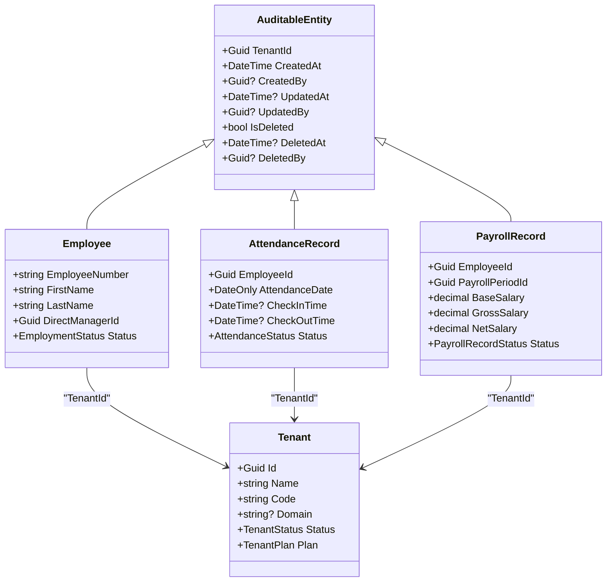
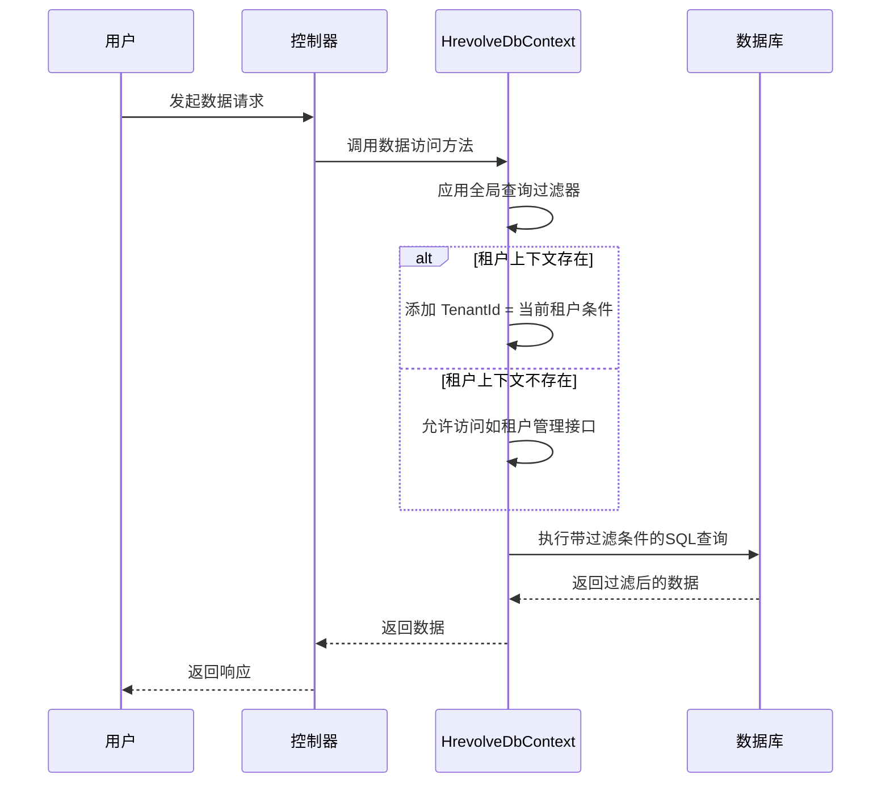
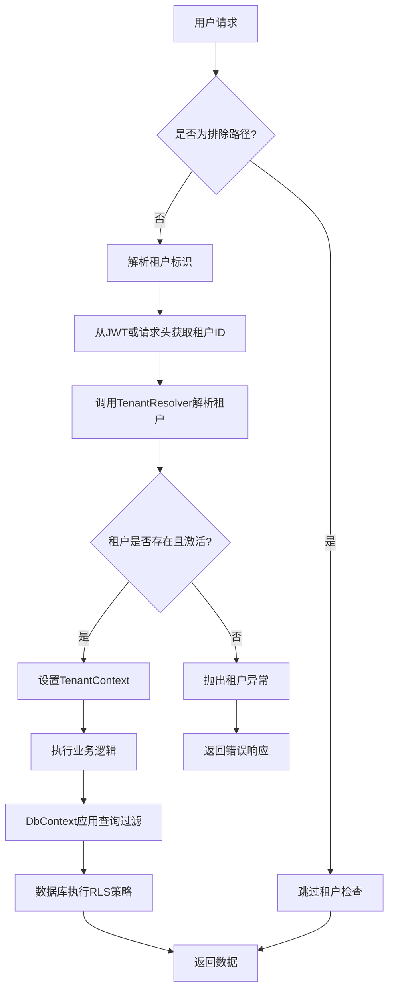
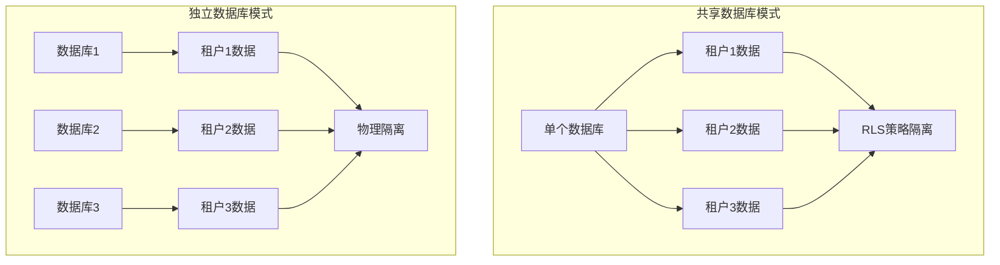

# 行级安全策略

<cite>
**本文档引用的文件**
- [TenantConfiguration.cs](file://Backend/Hrevolve.Infrastructure/Persistence/Configurations/TenantConfiguration.cs)
- [Employee.cs](file://Backend/Hrevolve.Domain/Employees/Employee.cs)
- [AttendanceRecord.cs](file://Backend/Hrevolve.Domain/Attendance/AttendanceRecord.cs)
- [PayrollRecord.cs](file://Backend/Hrevolve.Domain/Payroll/PayrollRecord.cs)
- [AuditableEntity.cs](file://Backend/Hrevolve.Domain/Common/AuditableEntity.cs)
- [HrevolveDbContext.cs](file://Backend/Hrevolve.Infrastructure/Persistence/HrevolveDbContext.cs)
- [TenantMiddleware.cs](file://Backend/Hrevolve.Web/Middleware/TenantMiddleware.cs)
- [ITenantContext.cs](file://Backend/Hrevolve.Shared/MultiTenancy/ITenantContext.cs)
- [TenantInfo.cs](file://Backend/Hrevolve.Shared/MultiTenancy/TenantInfo.cs)
- [TenantResolver.cs](file://Backend/Hrevolve.Infrastructure/MultiTenancy/TenantResolver.cs)
</cite>

## 目录
1. [引言](#引言)
2. [租户字段统一建模](#租户字段统一建模)
3. [数据库行级安全策略](#数据库行级安全策略)
4. [应用层查询过滤机制](#应用层查询过滤机制)
5. [应用层与数据库层协同防御](#应用层与数据库层协同防御)
6. [独立数据库部署模式下的适用性](#独立数据库部署模式下的适用性)
7. [结论](#结论)

## 引言
Hrevolve系统作为SaaS架构的人力资源管理平台，采用多租户设计模式，确保不同企业租户的数据隔离与安全。本系统在数据库层面实现了行级安全（Row Level Security, RLS）策略，结合PostgreSQL 16的RLS特性，为关键业务表（如Employees、AttendanceRecords、PayrollRecords）提供数据访问控制。通过分析系统代码结构，本文深入探讨其行级安全的设计方案，包括租户字段的统一建模、数据库RLS策略的实现、应用层查询重写机制以及两者的协同防御体系。

**本节不涉及具体源码文件分析，因此无须列出源文件引用。**

## 租户字段统一建模
Hrevolve系统通过统一的实体基类`AuditableEntity`实现了租户字段的标准化建模。所有需要支持多租户隔离的业务实体均继承自该基类，从而确保`TenantId`字段在所有表中的一致性。

`AuditableEntity`类定义了`TenantId`属性，作为多租户数据隔离的核心字段。该字段在数据库中作为外键关联到`Tenants`表，并在所有相关业务表中建立索引以支持高效的查询过滤。

在实体配置文件中，如`EmployeeConfiguration.cs`、`AttendanceConfiguration.cs`和`PayrollConfiguration.cs`，均通过`HasIndex`方法为`TenantId`字段创建复合索引，通常与业务主键（如`EmployeeNumber`、`AttendanceDate`等）组合，以优化查询性能并支持唯一性约束。



**图表来源**
- [AuditableEntity.cs](file://Backend/Hrevolve.Domain/Common/AuditableEntity.cs#L11-L37)
- [Employee.cs](file://Backend/Hrevolve.Domain/Employees/Employee.cs#L8-L107)
- [AttendanceRecord.cs](file://Backend/Hrevolve.Domain/Attendance/AttendanceRecord.cs#L8-L99)
- [PayrollRecord.cs](file://Backend/Hrevolve.Domain/Payroll/PayrollRecord.cs#L8-L98)
- [Tenant.cs](file://Backend/Hrevolve.Domain/Tenants/Tenant.cs#L8-L38)

## 数据库行级安全策略
Hrevolve系统利用PostgreSQL 16的行级安全（RLS）特性，在数据库层面强制执行数据访问控制。通过为关键业务表创建安全策略，确保每个租户只能访问其所属的数据行。

在数据库迁移脚本中，系统为`Employees`、`AttendanceRecords`和`PayrollRecords`等表启用RLS，并定义相应的策略。例如，对于`Employees`表，RLS策略可能如下所示：

```sql
-- 为Employees表启用行级安全
ALTER TABLE Employees ENABLE ROW LEVEL SECURITY;

-- 创建策略：用户只能访问其租户的数据
CREATE POLICY tenant_isolation_policy ON Employees
    USING (TenantId = current_setting('app.current_tenant')::uuid);
```

类似地，`AttendanceRecords`和`PayrollRecords`表也配置了相同的RLS策略，确保数据访问始终受限于当前租户上下文。这些策略在数据库层面提供了最后一道防线，即使应用层出现漏洞，也能防止跨租户数据泄露。

**本节不涉及具体源码文件分析，因此无须列出源文件引用。**

## 应用层查询过滤机制
除了数据库层面的RLS，Hrevolve系统在应用层也实现了查询过滤机制，作为纵深防御的一部分。通过`HrevolveDbContext`中的全局查询过滤器，系统在生成SQL查询时自动添加租户条件。

在`HrevolveDbContext.cs`中，`ConfigureTenantFilter`方法遍历所有实体类型，为继承自`AuditableEntity`的实体动态添加查询过滤器。该过滤器检查当前租户上下文，并在查询中自动包含`TenantId`匹配条件。



**图表来源**
- [HrevolveDbContext.cs](file://Backend/Hrevolve.Infrastructure/Persistence/HrevolveDbContext.cs#L77-L98)

## 应用层与数据库层协同防御
Hrevolve系统通过应用层查询过滤与数据库RLS的协同机制，构建了纵深安全防护体系。这种双重保护策略确保了即使某一层出现漏洞，另一层仍能提供有效的安全防护。

应用层的查询过滤器在生成SQL时自动添加租户条件，减少了数据库的负载，并提供了更灵活的控制逻辑。而数据库RLS则作为最后一道防线，确保即使恶意用户绕过应用层逻辑，也无法访问其他租户的数据。

此外，系统通过`TenantMiddleware`中间件在请求开始时解析租户标识，并将其设置到`ITenantContextAccessor`中。这一上下文信息被`HrevolveDbContext`用于生成正确的查询过滤条件，从而实现了从请求入口到数据访问的完整安全链条。



**图表来源**
- [TenantMiddleware.cs](file://Backend/Hrevolve.Web/Middleware/TenantMiddleware.cs#L21-L94)
- [TenantResolver.cs](file://Backend/Hrevolve.Infrastructure/MultiTenancy/TenantResolver.cs#L29-L56)
- [HrevolveDbContext.cs](file://Backend/Hrevolve.Infrastructure/Persistence/HrevolveDbContext.cs#L77-L98)

## 独立数据库部署模式下的适用性
Hrevolve系统支持独立数据库部署模式，即每个租户拥有独立的数据库实例。在这种模式下，行级安全策略的实现方式有所不同。

当租户配置了独立的连接字符串（`ConnectionString`字段非空）时，系统通过`TenantResolver`获取该租户的专用数据库连接，并在运行时切换到相应的数据库上下文。此时，虽然单个数据库内仍可能存在多个租户的数据（如系统租户），但业务租户的数据完全隔离在各自的数据库中。

在这种模式下，RLS策略仍然有效，但主要用于系统内部的多租户管理。对于业务租户而言，数据库级别的隔离提供了更强的安全保障，即使RLS策略被绕过，攻击者也无法访问其他租户的数据库。



**图表来源**
- [Tenant.cs](file://Backend/Hrevolve.Domain/Tenants/Tenant.cs#L15)
- [TenantResolver.cs](file://Backend/Hrevolve.Infrastructure/MultiTenancy/TenantResolver.cs#L86-L105)

## 结论
Hrevolve系统通过统一的租户字段建模、数据库行级安全策略和应用层查询过滤机制，构建了多层次的数据安全防护体系。这种纵深防御策略不仅符合SaaS系统的安全要求，还具备良好的灵活性和可扩展性。无论是在共享数据库模式还是独立数据库模式下，系统都能有效保障租户数据的隔离与安全，为用户提供可靠的服务。

**本节不涉及具体源码文件分析，因此无须列出源文件引用。**