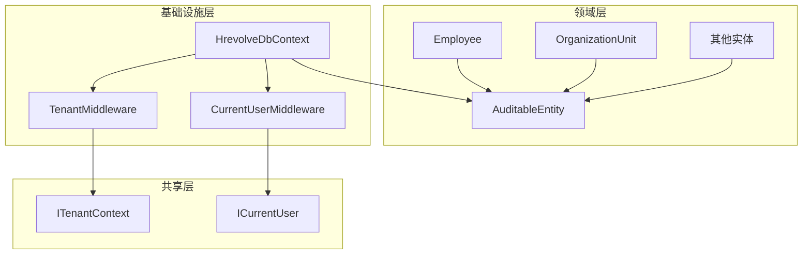
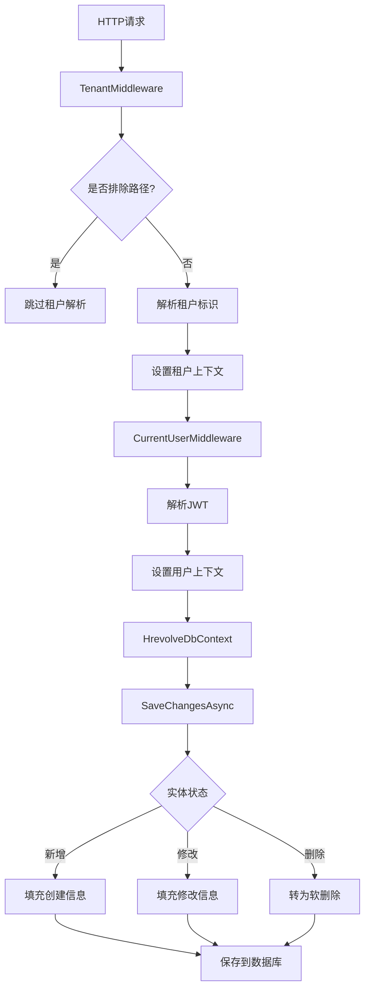
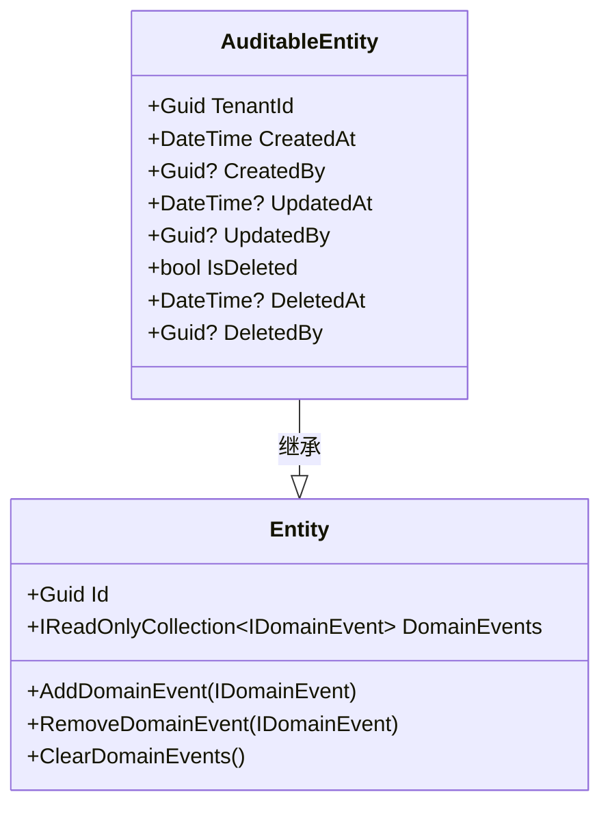
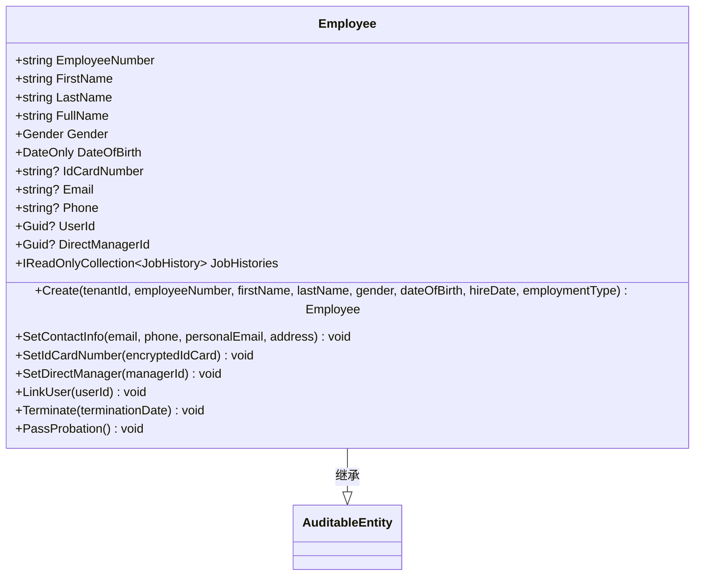
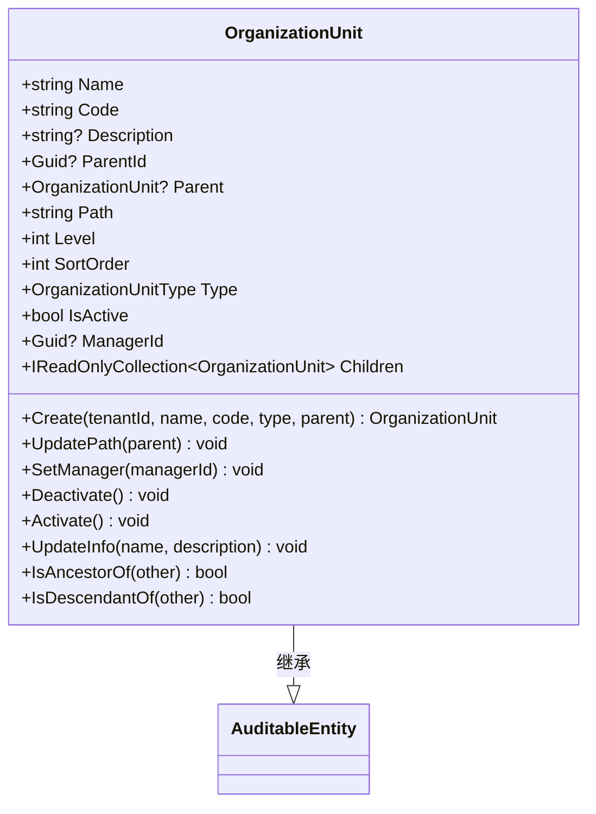
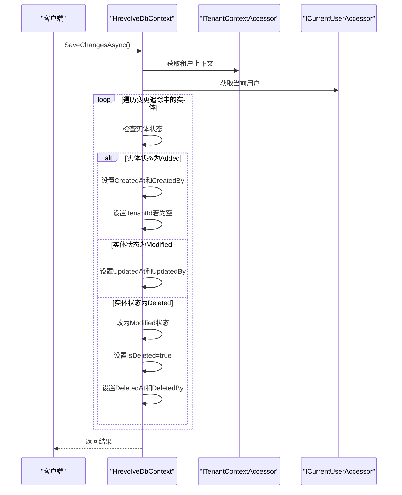
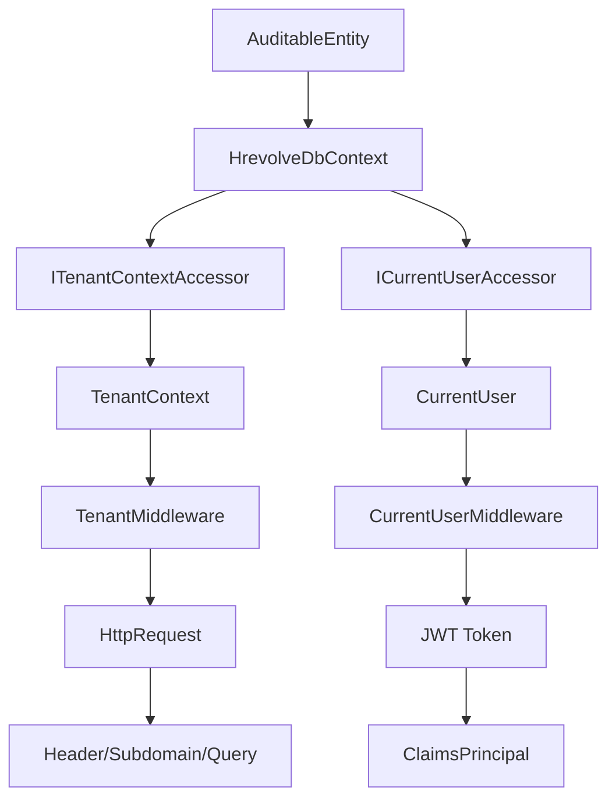

# 可审计实体基类

<cite>
**本文档引用的文件**   
- [AuditableEntity.cs](file://Backend/Hrevolve.Domain/Common/AuditableEntity.cs)
- [HrevolveDbContext.cs](file://Backend/Hrevolve.Infrastructure/Persistence/HrevolveDbContext.cs)
- [Employee.cs](file://Backend/Hrevolve.Domain/Employees/Employee.cs)
- [OrganizationUnit.cs](file://Backend/Hrevolve.Domain/Organizations/OrganizationUnit.cs)
- [ICurrentUser.cs](file://Backend/Hrevolve.Shared/Identity/ICurrentUser.cs)
- [TenantMiddleware.cs](file://Backend/Hrevolve.Web/Middleware/TenantMiddleware.cs)
- [CurrentUserMiddleware.cs](file://Backend/Hrevolve.Web/Middleware/CurrentUserMiddleware.cs)
- [TenantContext.cs](file://Backend/Hrevolve.Shared/MultiTenancy/ITenantContext.cs)
- [Entity.cs](file://Backend/Hrevolve.Domain/Common/Entity.cs)
</cite>

## 目录
1. [简介](#简介)
2. [项目结构](#项目结构)
3. [核心组件](#核心组件)
4. [架构概述](#架构概述)
5. [详细组件分析](#详细组件分析)
6. [依赖分析](#依赖分析)
7. [性能考虑](#性能考虑)
8. [故障排除指南](#故障排除指南)
9. [结论](#结论)

## 简介
本文档详细说明了 `AuditableEntity` 基类的设计与实现，该基类为所有继承它的实体提供多租户隔离、审计字段自动填充和软删除功能。通过分析代码结构和执行流程，阐述了系统如何在数据持久化过程中自动维护审计信息，并确保数据的一致性和可追溯性。

## 项目结构
`AuditableEntity` 基类位于 `Hrevolve.Domain` 项目的 `Common` 文件夹中，作为领域层的核心抽象类，被所有需要审计功能的实体继承。其审计逻辑的实现依赖于基础设施层的 `HrevolveDbContext`，并通过中间件在请求管道中设置当前用户和租户上下文。

**图示来源**
- [AuditableEntity.cs](file://Backend/Hrevolve.Domain/Common/AuditableEntity.cs)
- [HrevolveDbContext.cs](file://Backend/Hrevolve.Infrastructure/Persistence/HrevolveDbContext.cs)
- [TenantMiddleware.cs](file://Backend/Hrevolve.Web/Middleware/TenantMiddleware.cs)
- [CurrentUserMiddleware.cs](file://Backend/Hrevolve.Web/Middleware/CurrentUserMiddleware.cs)

**本节来源**
- [AuditableEntity.cs](file://Backend/Hrevolve.Domain/Common/AuditableEntity.cs)
- [HrevolveDbContext.cs](file://Backend/Hrevolve.Infrastructure/Persistence/HrevolveDbContext.cs)

## 核心组件
`AuditableEntity` 基类继承自 `Entity`，扩展了多租户和审计相关的属性。`HrevolveDbContext` 在 `SaveChangesAsync` 方法中拦截实体状态变化，自动填充审计字段。`TenantMiddleware` 和 `CurrentUserMiddleware` 负责在请求开始时解析并设置租户和用户上下文。

**本节来源**
- [AuditableEntity.cs](file://Backend/Hrevolve.Domain/Common/AuditableEntity.cs#L6-L47)
- [HrevolveDbContext.cs](file://Backend/Hrevolve.Infrastructure/Persistence/HrevolveDbContext.cs#L120-L154)
- [TenantMiddleware.cs](file://Backend/Hrevolve.Web/Middleware/TenantMiddleware.cs)
- [CurrentUserMiddleware.cs](file://Backend/Hrevolve.Web/Middleware/CurrentUserMiddleware.cs)

## 架构概述
系统采用分层架构，`AuditableEntity` 位于领域层，为所有业务实体提供统一的审计接口。基础设施层的数据库上下文负责实现审计逻辑，通过依赖注入获取当前用户和租户信息。Web层的中间件在请求管道中解析JWT和请求头，建立完整的上下文环境。

**图示来源**
- [TenantMiddleware.cs](file://Backend/Hrevolve.Web/Middleware/TenantMiddleware.cs)
- [CurrentUserMiddleware.cs](file://Backend/Hrevolve.Web/Middleware/CurrentUserMiddleware.cs)
- [HrevolveDbContext.cs](file://Backend/Hrevolve.Infrastructure/Persistence/HrevolveDbContext.cs#L120-L154)

## 详细组件分析

### AuditableEntity基类分析
`AuditableEntity` 定义了所有审计实体必须具备的字段，包括租户ID、时间戳、操作人ID和软删除标记。

**图示来源**
- [AuditableEntity.cs](file://Backend/Hrevolve.Domain/Common/AuditableEntity.cs)
- [Entity.cs](file://Backend/Hrevolve.Domain/Common/Entity.cs)

### Employee实体分析
`Employee` 实体继承 `AuditableEntity`，获得完整的审计能力。在创建员工时，系统会自动记录租户ID、创建时间和创建人。

**图示来源**
- [Employee.cs](file://Backend/Hrevolve.Domain/Employees/Employee.cs)
- [AuditableEntity.cs](file://Backend/Hrevolve.Domain/Common/AuditableEntity.cs)

### OrganizationUnit实体分析
`OrganizationUnit` 实体同样继承 `AuditableEntity`，用于管理组织架构。其特有的路径枚举模型支持高效的树形查询。

**图示来源**
- [OrganizationUnit.cs](file://Backend/Hrevolve.Domain/Organizations/OrganizationUnit.cs)
- [AuditableEntity.cs](file://Backend/Hrevolve.Domain/Common/AuditableEntity.cs)

### 数据持久化流程分析
当实体状态发生变化时，`HrevolveDbContext` 的 `SaveChangesAsync` 方法会自动处理审计信息的填充。

**图示来源**
- [HrevolveDbContext.cs](file://Backend/Hrevolve.Infrastructure/Persistence/HrevolveDbContext.cs#L120-L154)
- [TenantContext.cs](file://Backend/Hrevolve.Shared/MultiTenancy/ITenantContext.cs)
- [ICurrentUser.cs](file://Backend/Hrevolve.Shared/Identity/ICurrentUser.cs)

**本节来源**
- [AuditableEntity.cs](file://Backend/Hrevolve.Domain/Common/AuditableEntity.cs)
- [HrevolveDbContext.cs](file://Backend/Hrevolve.Infrastructure/Persistence/HrevolveDbContext.cs)
- [Employee.cs](file://Backend/Hrevolve.Domain/Employees/Employee.cs)
- [OrganizationUnit.cs](file://Backend/Hrevolve.Domain/Organizations/OrganizationUnit.cs)

## 依赖分析
`AuditableEntity` 基类的实现依赖于多个关键组件，形成了一个完整的审计生态系统。

**图示来源**
- [AuditableEntity.cs](file://Backend/Hrevolve.Domain/Common/AuditableEntity.cs)
- [HrevolveDbContext.cs](file://Backend/Hrevolve.Infrastructure/Persistence/HrevolveDbContext.cs)
- [TenantContext.cs](file://Backend/Hrevolve.Shared/MultiTenancy/ITenantContext.cs)
- [ICurrentUser.cs](file://Backend/Hrevolve.Shared/Identity/ICurrentUser.cs)
- [TenantMiddleware.cs](file://Backend/Hrevolve.Web/Middleware/TenantMiddleware.cs)
- [CurrentUserMiddleware.cs](file://Backend/Hrevolve.Web/Middleware/CurrentUserMiddleware.cs)

**本节来源**
- [HrevolveDbContext.cs](file://Backend/Hrevolve.Infrastructure/Persistence/HrevolveDbContext.cs)
- [TenantContext.cs](file://Backend/Hrevolve.Shared/MultiTenancy/ITenantContext.cs)
- [ICurrentUser.cs](file://Backend/Hrevolve.Shared/Identity/ICurrentUser.cs)

## 性能考虑
审计功能对性能的影响主要体现在以下几个方面：
- **数据库查询**：全局查询过滤器会自动添加租户和软删除条件，可能影响查询性能，但通过适当的索引可以优化。
- **内存使用**：`ChangeTracker` 需要跟踪所有实体的状态变化，对于大批量操作可能会增加内存消耗。
- **缓存策略**：租户信息被缓存30分钟，减少了数据库查询次数，提高了租户解析的性能。

## 故障排除指南
### 常见问题
1. **审计字段未填充**
   - 检查 `TenantMiddleware` 和 `CurrentUserMiddleware` 是否正确注册在 `Program.cs` 中。
   - 确认JWT令牌中包含 `tenant_id` 和用户信息。
   - 验证 `HrevolveDbContext` 是否正确注入了 `ITenantContextAccessor` 和 `ICurrentUserAccessor`。

2. **多租户数据泄露**
   - 确保所有继承 `AuditableEntity` 的实体都应用了租户过滤器。
   - 检查 `ConfigureTenantFilter` 方法是否正确配置了全局查询过滤器。

3. **软删除无效**
   - 确认 `ConfigureSoftDeleteFilter` 方法已正确应用。
   - 检查实体是否正确继承了 `AuditableEntity`。

**本节来源**
- [HrevolveDbContext.cs](file://Backend/Hrevolve.Infrastructure/Persistence/HrevolveDbContext.cs#L77-L118)
- [TenantMiddleware.cs](file://Backend/Hrevolve.Web/Middleware/TenantMiddleware.cs)
- [CurrentUserMiddleware.cs](file://Backend/Hrevolve.Web/Middleware/CurrentUserMiddleware.cs)

## 结论
`AuditableEntity` 基类通过统一的接口为所有业务实体提供了强大的审计能力。结合EF Core的拦截机制和ASP.NET Core的中间件管道，系统能够自动维护数据的完整性和可追溯性。这种设计不仅减少了重复代码，还确保了审计逻辑的一致性，是构建企业级SaaS应用的重要基础组件。