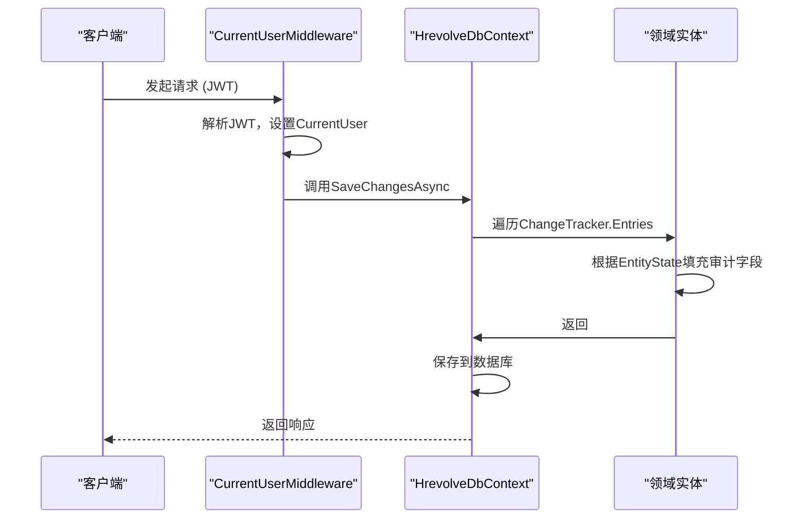
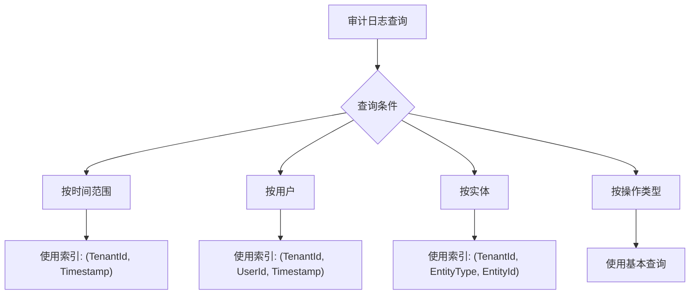

# 审计与软删除

<cite>
**本文档引用的文件**  
- [AuditableEntity.cs](file://Backend/Hrevolve.Domain/Common/AuditableEntity.cs)
- [AuditLog.cs](file://Backend/Hrevolve.Domain/Audit/AuditLog.cs)
- [HrevolveDbContext.cs](file://Backend/Hrevolve.Infrastructure/Persistence/HrevolveDbContext.cs)
- [AuditLogConfiguration.cs](file://Backend/Hrevolve.Infrastructure/Persistence/Configurations/AuditLogConfiguration.cs)
- [Employee.cs](file://Backend/Hrevolve.Domain/Employees/Employee.cs)
- [User.cs](file://Backend/Hrevolve.Domain/Identity/User.cs)
- [CurrentUserMiddleware.cs](file://Backend/Hrevolve.Web/Middleware/CurrentUserMiddleware.cs)
- [ICurrentUser.cs](file://Backend/Hrevolve.Shared/Identity/ICurrentUser.cs)
- [CreateEmployeeCommand.cs](file://Backend/Hrevolve.Application/Employees/Commands/CreateEmployeeCommand.cs)
</cite>

## 目录
1. [引言](#引言)
2. [审计字段与软删除机制](#审计字段与软删除机制)
3. [审计日志实体结构](#审计日志实体结构)
4. [审计日志与系统集成](#审计日志与系统集成)
5. [数据库配置与索引](#数据库配置与索引)
6. [审计日志记录流程](#审计日志记录流程)
7. [总结](#总结)

## 引言
本系统通过统一的审计与软删除机制，实现了对所有业务实体的变更追踪和数据保护。基于 `AuditableEntity` 基类，所有实体自动继承审计字段并由框架自动填充。同时，系统采用软删除策略，结合全局查询过滤器，确保已删除数据在正常查询中不可见，但可被恢复或用于审计分析。审计日志实体 `AuditLog` 记录了所有关键操作的详细信息，支持安全审计、合规检查和问题追溯。

## 审计字段与软删除机制

系统中的所有可审计实体均继承自 `AuditableEntity` 基类，该基类定义了统一的审计和多租户隔离字段。当实体被创建、修改或删除时，这些字段会由 `HrevolveDbContext` 在 `SaveChangesAsync` 方法中自动填充。

### 审计字段说明
- **TenantId**: 租户ID，用于多租户环境下的数据隔离。
- **CreatedAt**: 实体创建时间，由系统在新增时自动设置为当前UTC时间。
- **CreatedBy**: 创建人ID，记录执行创建操作的用户ID。
- **UpdatedAt**: 最后修改时间，在实体更新时自动更新。
- **UpdatedBy**: 最后修改人ID，记录执行更新操作的用户ID。
- **IsDeleted**: 软删除标记，布尔值，`true` 表示该记录已被逻辑删除。
- **DeletedAt**: 删除时间，记录执行删除操作的时间。
- **DeletedBy**: 删除人ID，记录执行删除操作的用户ID。

### 软删除实现
软删除通过 `HrevolveDbContext` 中的 `ConfigureSoftDeleteFilter` 方法实现。该方法为所有继承自 `AuditableEntity` 的实体类型配置了全局查询过滤器（`HasQueryFilter`），确保在查询时自动排除 `IsDeleted = true` 的记录。当调用 `Remove` 方法删除实体时，EF Core 的 `SaveChangesAsync` 会拦截该操作，将其转换为修改操作，并将 `IsDeleted`、`DeletedAt` 和 `DeletedBy` 字段设置为相应值，从而实现逻辑删除而非物理删除。

**Section sources**
- [AuditableEntity.cs](file://Backend/Hrevolve.Domain/Common/AuditableEntity.cs#L6-L47)
- [HrevolveDbContext.cs](file://Backend/Hrevolve.Infrastructure/Persistence/HrevolveDbContext.cs#L100-L118)

## 审计日志实体结构

`AuditLog` 实体是系统审计功能的核心，用于记录所有关键操作的详细信息。其结构设计全面，包含了操作上下文、变更详情和请求信息。

### 核心字段
- **TenantId**: 关联的租户ID。
- **UserId**: 执行操作的用户ID。
- **UserName**: 执行操作的用户名。
- **Action**: 操作类型，如 "Create"、"Update"、"Delete" 等，定义在 `AuditActions` 静态类中。
- **EntityType**: 被操作的实体类型名称（如 "Employee"、"User"）。
- **EntityId**: 被操作的实体唯一标识。
- **OldValues**: 变更前的旧值，以JSON格式存储。
- **NewValues**: 变更后的新值，以JSON格式存储。
- **AffectedColumns**: 受影响的字段列表。
- **IpAddress**: 客户端IP地址。
- **UserAgent**: 用户代理字符串。
- **RequestPath**: HTTP请求路径。
- **TraceId**: 追踪ID，用于分布式链路追踪。
- **CorrelationId**: 关联ID，用于关联相关操作。
- **Timestamp**: 操作发生的时间戳。

```mermaid
erDiagram
AUDIT_LOG {
uuid Id PK
uuid TenantId FK
uuid? UserId FK
string? UserName
string Action
string EntityType
string? EntityId
string? OldValues
string? NewValues
string? AffectedColumns
string? IpAddress
string? UserAgent
string? RequestPath
string? TraceId
string? CorrelationId
timestamp Timestamp
}
TENANT ||--o{ AUDIT_LOG : "belongs to"
USER ||--o{ AUDIT_LOG : "created by"
```

**Diagram sources**
- [AuditLog.cs](file://Backend/Hrevolve.Domain/Audit/AuditLog.cs#L8-L69)

**Section sources**
- [AuditLog.cs](file://Backend/Hrevolve.Domain/Audit/AuditLog.cs#L8-L107)
- [AuditActions.cs](file://Backend/Hrevolve.Domain/Audit/AuditLog.cs#L112-L125)

## 审计日志与系统集成

审计日志的记录是自动化的，主要通过领域事件（Domain Events）和中间件集成到系统中。

### 领域事件驱动
当领域实体发生重要状态变更时（如员工创建、用户登录），会通过 `AddDomainEvent` 方法添加相应的领域事件。这些事件在 `SaveChangesAsync` 期间被处理，并触发审计日志的创建。例如，`Employee.Create` 方法会添加 `EmployeeCreatedEvent`，该事件最终会被处理并生成一条类型为 "Create" 的审计日志。

### 中间件集成
`CurrentUserMiddleware` 中间件负责从JWT令牌中解析当前用户信息，并通过 `ICurrentUserAccessor` 将其注入到当前请求上下文中。`HrevolveDbContext` 在 `SaveChangesAsync` 时通过 `_currentUserAccessor.CurrentUser` 获取当前用户，从而填充 `CreatedBy`、`UpdatedBy` 等审计字段。



**Diagram sources**
- [HrevolveDbContext.cs](file://Backend/Hrevolve.Infrastructure/Persistence/HrevolveDbContext.cs#L120-L155)
- [CurrentUserMiddleware.cs](file://Backend/Hrevolve.Web/Middleware/CurrentUserMiddleware.cs#L9-L25)

**Section sources**
- [HrevolveDbContext.cs](file://Backend/Hrevolve.Infrastructure/Persistence/HrevolveDbContext.cs#L120-L155)
- [CurrentUserMiddleware.cs](file://Backend/Hrevolve.Web/Middleware/CurrentUserMiddleware.cs#L9-L57)
- [ICurrentUser.cs](file://Backend/Hrevolve.Shared/Identity/ICurrentUser.cs#L62-L114)

## 数据库配置与索引

`AuditLog` 实体的数据库配置通过 `AuditLogConfiguration` 类进行定义，确保了数据的完整性和查询性能。

### 配置要点
- **表名**: 映射到数据库中的 `AuditLogs` 表。
- **主键**: `Id` 字段。
- **字段长度限制**: 对 `UserName`、`Action`、`EntityType` 等字符串字段设置了合理的最大长度。
- **必填字段**: `Action` 和 `EntityType` 被标记为必填。

### 查询优化索引
为支持高效的审计日志查询，配置了多个复合索引：
- `(TenantId, Timestamp)`: 按租户和时间范围查询。
- `(TenantId, UserId, Timestamp)`: 按租户、用户和时间范围查询特定用户的操作。
- `(TenantId, EntityType, EntityId)`: 按租户、实体类型和实体ID查询特定实体的所有操作。
- `TraceId`: 支持通过追踪ID进行链路分析。



**Diagram sources**
- [AuditLogConfiguration.cs](file://Backend/Hrevolve.Infrastructure/Persistence/Configurations/AuditLogConfiguration.cs#L7-L55)

**Section sources**
- [AuditLogConfiguration.cs](file://Backend/Hrevolve.Infrastructure/Persistence/Configurations/AuditLogConfiguration.cs#L7-L55)

## 审计日志记录流程

完整的审计日志记录流程如下：
1.  **用户请求**: 用户发起一个修改数据的请求（如创建员工）。
2.  **身份识别**: `CurrentUserMiddleware` 解析JWT，设置当前用户上下文。
3.  **业务处理**: 应用层处理命令，创建或修改领域实体。
4.  **状态变更**: 实体状态变更被EF Core的 `ChangeTracker` 捕获。
5.  **保存拦截**: 调用 `SaveChangesAsync` 时，`HrevolveDbContext` 遍历所有 `AuditableEntity` 的变更条目。
6.  **填充审计字段**: 根据 `EntityState` (Added, Modified, Deleted) 自动填充 `CreatedAt`、`CreatedBy`、`UpdatedAt`、`UpdatedBy` 或 `IsDeleted`、`DeletedAt`、`DeletedBy`。
7.  **生成审计日志**: 如果有领域事件被触发，系统会创建 `AuditLog` 实体并添加到 `DbContext`。
8.  **持久化**: 所有变更（包括实体和审计日志）作为一个事务提交到数据库。

此流程确保了审计信息的完整性和一致性，所有操作都有据可查。

**Section sources**
- [HrevolveDbContext.cs](file://Backend/Hrevolve.Infrastructure/Persistence/HrevolveDbContext.cs#L120-L155)
- [CreateEmployeeCommand.cs](file://Backend/Hrevolve.Application/Employees/Commands/CreateEmployeeCommand.cs#L76-L124)

## 总结
本系统的审计与软删除机制设计精良，通过基类继承、全局过滤器和自动化填充，实现了对所有实体的透明化审计。`AuditableEntity` 提供了统一的审计字段，`HrevolveDbContext` 负责自动填充和软删除转换，而 `AuditLog` 实体则详细记录了每一次关键操作。结合领域事件和中间件，整个系统形成了一个闭环的审计追踪体系，既保证了数据安全，又满足了合规性要求。